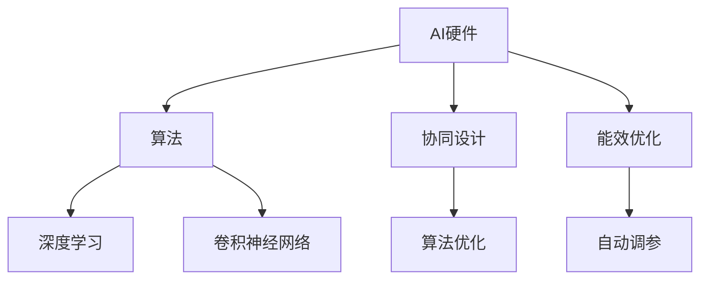
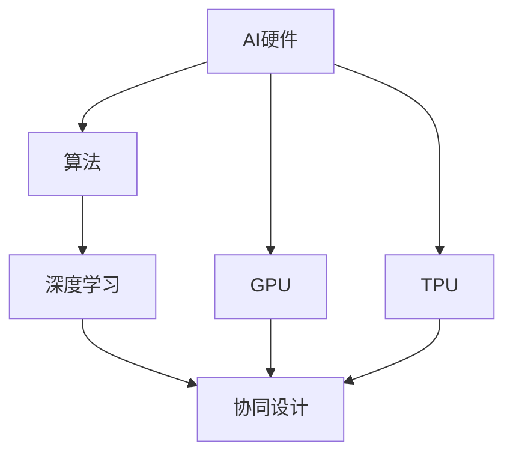
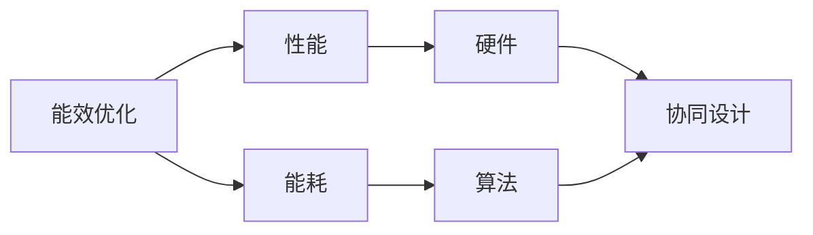
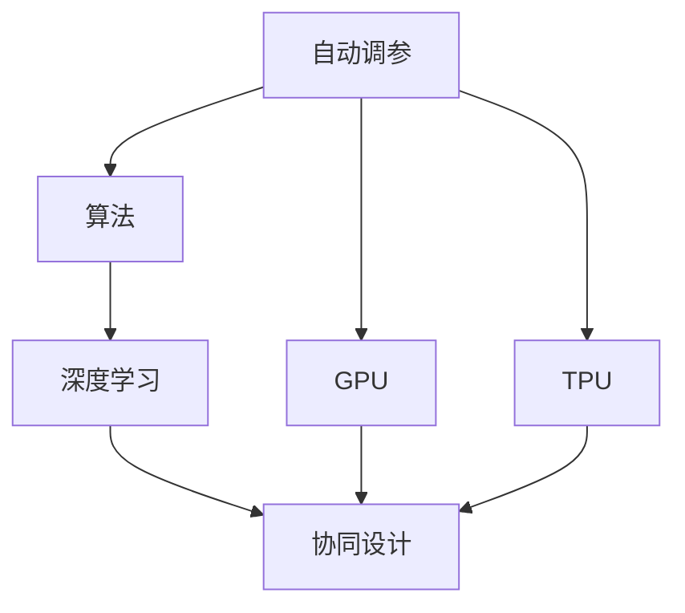
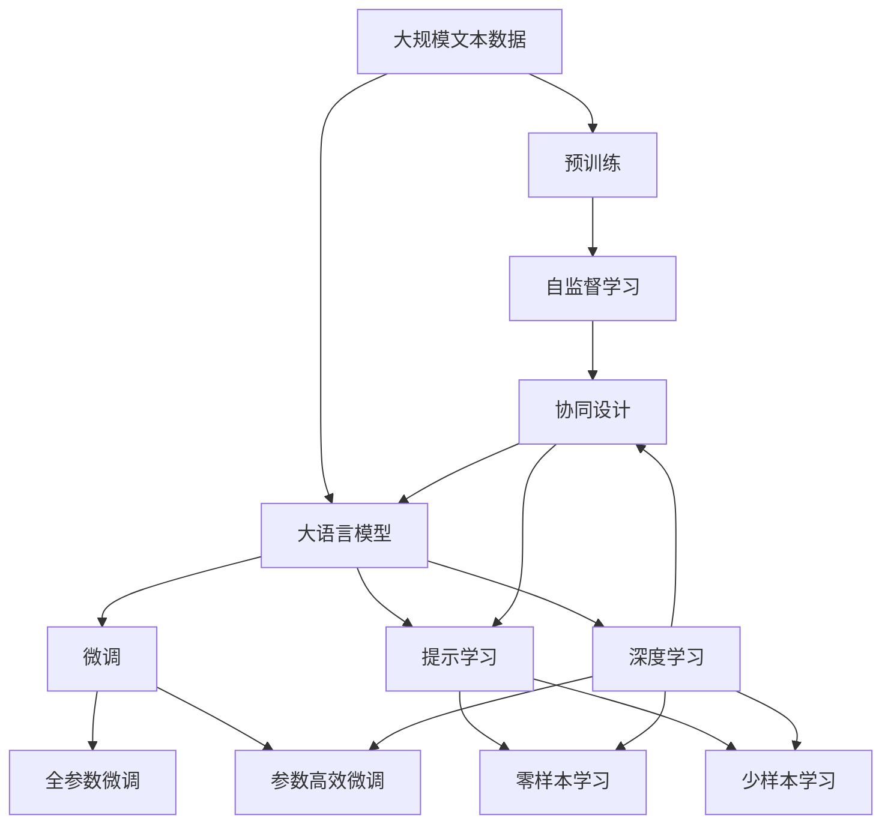

                 

# AI硬件与算法的协同设计:未来发展方向

> 关键词：AI硬件,算法,协同设计,未来发展方向,深度学习

## 1. 背景介绍

### 1.1 问题由来

随着人工智能(AI)技术的飞速发展，AI硬件与算法的协同设计已成为推动AI技术进步的关键因素。硬件的算力提升和算法的优化设计，共同驱动了AI系统的性能提升。然而，AI硬件和算法的协同设计并不是一件容易的事情。它涉及到硬件架构的合理设计、算法的有效部署以及硬件和软件之间的紧密耦合。本文将深入探讨AI硬件与算法的协同设计，展望其未来发展方向。

### 1.2 问题核心关键点

AI硬件与算法的协同设计包括以下几个核心关键点：

- **硬件加速：** 利用专用硬件（如GPU、TPU、FPGA等）进行计算加速，以提升AI算法的执行效率。
- **算法优化：** 针对特定硬件架构，优化算法，使其能够在硬件上高效执行。
- **协同设计：** 在算法设计阶段就考虑到硬件的限制和特性，使算法能够充分利用硬件资源。
- **自动调参：** 使用自动化工具，根据硬件特性自动调整算法参数，以优化性能。
- **能效优化：** 在硬件和算法之间进行权衡，优化能耗和性能。

这些关键点相互作用，共同影响着AI系统的性能和效率。

### 1.3 问题研究意义

AI硬件与算法的协同设计对AI技术的发展具有重要意义：

- **提升性能：** 硬件加速可以大幅度提升算法的执行速度，加快AI系统的响应时间。
- **降低成本：** 硬件加速可以降低算法的计算成本，使得AI系统更加经济高效。
- **提高可靠性：** 硬件和算法的协同设计可以提升系统的稳定性和可靠性，减少错误和故障。
- **增强灵活性：** 协同设计使得AI系统能够适应不同场景和需求，具备更强的灵活性和可扩展性。
- **加速创新：** 硬件和算法的协同设计可以加速AI技术的创新，推动更多前沿应用的实现。

## 2. 核心概念与联系

### 2.1 核心概念概述

为更好地理解AI硬件与算法的协同设计，本节将介绍几个密切相关的核心概念：

- **AI硬件：** 用于执行AI算法的专用硬件，如GPU、TPU、FPGA等。
- **算法：** 用于处理数据和进行推断的计算方法，如深度学习模型、卷积神经网络等。
- **协同设计：** 在硬件和算法设计阶段进行紧密协作，使两者能够相互适应和优化。
- **能效：** 在硬件和算法之间的权衡，既满足性能需求，又尽量减少能耗。
- **自动调参：** 使用自动化工具，根据硬件特性自动调整算法参数，以优化性能。

这些核心概念之间的逻辑关系可以通过以下Mermaid流程图来展示：



这个流程图展示了大语言模型的核心概念及其之间的关系：

1. AI硬件通过专用设计提供强大的计算能力。
2. 算法则是处理数据的计算方法，如深度学习模型。
3. 协同设计使得硬件和算法紧密协作，相互优化。
4. 能效优化在硬件和算法之间进行权衡，既满足性能需求，又尽量减少能耗。
5. 自动调参利用自动化工具，根据硬件特性自动调整算法参数。

### 2.2 概念间的关系

这些核心概念之间存在着紧密的联系，形成了AI硬件与算法协同设计的完整生态系统。下面我们通过几个Mermaid流程图来展示这些概念之间的关系。

#### 2.2.1 AI硬件与算法的协同设计



这个流程图展示了AI硬件与算法协同设计的基本原理。AI硬件通过专用设计提供强大的计算能力，算法通过深度学习等方法处理数据，而协同设计则使两者紧密协作，共同优化。

#### 2.2.2 能效优化在硬件与算法之间



这个流程图展示了能效优化在硬件与算法之间的权衡。通过协同设计，既能满足性能需求，又能尽量减少能耗。

#### 2.2.3 自动调参与协同设计



这个流程图展示了自动调参与协同设计的关系。自动调参利用自动化工具，根据硬件特性自动调整算法参数，使算法能够在硬件上高效执行。

### 2.3 核心概念的整体架构

最后，我们用一个综合的流程图来展示这些核心概念在大语言模型协同设计过程中的整体架构：



这个综合流程图展示了从预训练到微调，再到持续学习的完整过程。AI硬件通过专用设计提供强大的计算能力，算法通过深度学习等方法处理数据，而协同设计则使两者紧密协作，共同优化。自动调参利用自动化工具，根据硬件特性自动调整算法参数，使算法能够在硬件上高效执行。最终，通过持续学习技术，模型可以不断更新和适应新的任务和数据。 通过这些流程图，我们可以更清晰地理解AI硬件与算法协同设计的核心概念及其关系，为后续深入讨论具体的协同设计方法和技术奠定基础。

## 3. 核心算法原理 & 具体操作步骤
### 3.1 算法原理概述

AI硬件与算法的协同设计，本质上是一种优化问题的求解。其核心思想是通过硬件加速和算法优化，使AI系统在特定硬件上能够高效执行，同时满足性能和能效需求。

形式化地，假设AI硬件为 $\textit{Hardware}=\{H_1, H_2, ..., H_n\}$，算法为 $\textit{Algorithm}=\{A_1, A_2, ..., A_m\}$，协同设计的目标是最小化一个权衡函数 $F(\textit{Hardware}, \textit{Algorithm})$，即：

$$
\min_{H \in \textit{Hardware}, A \in \textit{Algorithm}} F(H, A)
$$

其中，$F(H, A)$ 为硬件和算法之间的权衡函数，可以是性能与能耗的组合，也可以是精度与速度的组合。

### 3.2 算法步骤详解

基于AI硬件与算法的协同设计，一般包括以下几个关键步骤：

**Step 1: 硬件选择合适的AI硬件**
- 根据任务特点选择合适的硬件，如GPU、TPU、FPGA等。
- 分析硬件的性能特性，如浮点运算速度、能耗、内存带宽等。

**Step 2: 算法设计合适的算法**
- 根据硬件特性，设计适合硬件加速的算法，如深度学习模型、卷积神经网络等。
- 分析算法的计算复杂度、内存需求等，确保算法能够充分利用硬件资源。

**Step 3: 协同设计**
- 在算法设计阶段就考虑到硬件的限制和特性，使算法能够充分利用硬件资源。
- 利用自动调参工具，根据硬件特性自动调整算法参数，以优化性能。

**Step 4: 部署与优化**
- 将算法部署到硬件上，进行性能测试和能效优化。
- 根据测试结果，调整算法和硬件的参数，以优化性能和能效。

**Step 5: 持续学习和优化**
- 在实际应用中，不断收集数据和反馈，进行持续学习，优化算法和硬件的参数。
- 利用自动化工具，自动化调参，进一步优化性能和能效。

### 3.3 算法优缺点

基于AI硬件与算法的协同设计，具有以下优点：

- **性能提升：** 硬件加速可以大幅度提升算法的执行速度，加快AI系统的响应时间。
- **成本降低：** 硬件加速可以降低算法的计算成本，使得AI系统更加经济高效。
- **可靠性增强：** 硬件和算法的协同设计可以提升系统的稳定性和可靠性，减少错误和故障。

同时，该方法也存在以下缺点：

- **开发复杂：** 硬件和算法的协同设计需要专业知识，开发复杂。
- **调参难度：** 自动调参和优化需要大量实验，调参难度较大。
- **资源消耗：** 硬件和算法的协同设计需要大量的硬件和计算资源，成本较高。

### 3.4 算法应用领域

AI硬件与算法的协同设计，在多个领域得到了广泛的应用，包括但不限于：

- **计算机视觉：** 利用GPU、TPU等硬件加速，提升图像分类、目标检测、语义分割等任务的速度和精度。
- **自然语言处理：** 利用专用硬件（如TPU、NPU）进行自然语言理解、文本生成等任务的高效计算。
- **语音识别：** 利用GPU、FPGA等硬件加速，提升语音识别、语音合成等任务的速度和准确率。
- **推荐系统：** 利用GPU、TPU等硬件加速，提升推荐系统的实时性和响应速度。
- **自动驾驶：** 利用GPU、FPGA等硬件加速，提升自动驾驶系统的实时性和决策速度。

## 4. 数学模型和公式 & 详细讲解 & 举例说明
### 4.1 数学模型构建

本节将使用数学语言对AI硬件与算法的协同设计过程进行更加严格的刻画。

假设AI硬件为 $\textit{Hardware}=\{H_1, H_2, ..., H_n\}$，算法为 $\textit{Algorithm}=\{A_1, A_2, ..., A_m\}$，协同设计的目标是最小化一个权衡函数 $F(\textit{Hardware}, \textit{Algorithm})$，即：

$$
\min_{H \in \textit{Hardware}, A \in \textit{Algorithm}} F(H, A)
$$

其中，$F(H, A)$ 为硬件和算法之间的权衡函数，可以是性能与能耗的组合，也可以是精度与速度的组合。

### 4.2 公式推导过程

以下我们以深度学习模型在GPU上的加速为例，推导性能与能耗的权衡函数。

设深度学习模型的计算量为 $C$，GPU的浮点运算速度为 $S$，能耗为 $E$，则模型的总计算时间 $T$ 和总能耗 $E$ 分别为：

$$
T = \frac{C}{S}, \quad E = C \cdot E_{\textit{per-op}}
$$

其中 $E_{\textit{per-op}}$ 为每个操作的能耗。

在GPU上的计算时间 $T_{\textit{GPU}}$ 和能耗 $E_{\textit{GPU}}$ 分别为：

$$
T_{\textit{GPU}} = \frac{C}{S_{\textit{GPU}}}, \quad E_{\textit{GPU}} = C \cdot E_{\textit{per-op}}^{\textit{GPU}}
$$

其中 $S_{\textit{GPU}}$ 和 $E_{\textit{per-op}}^{\textit{GPU}}$ 分别为GPU的浮点运算速度和每个操作的能耗。

因此，性能与能耗的权衡函数为：

$$
F_{\textit{GPU}} = \frac{1}{T_{\textit{GPU}}} + \lambda E_{\textit{GPU}}
$$

其中 $\lambda$ 为权衡系数，用于平衡性能和能耗。

### 4.3 案例分析与讲解

考虑一个典型的图像分类任务，在CPU和GPU上进行性能与能耗的权衡。设CPU的浮点运算速度为 $S_{\textit{CPU}}=1$，GPU的浮点运算速度为 $S_{\textit{GPU}}=10$，每个操作的能耗为 $E_{\textit{per-op}}=1$。

在CPU上，计算时间为 $T_{\textit{CPU}} = C$，能耗为 $E_{\textit{CPU}} = C$。

在GPU上，计算时间为 $T_{\textit{GPU}} = \frac{C}{10}$，能耗为 $E_{\textit{GPU}} = C$。

因此，性能与能耗的权衡函数为：

$$
F_{\textit{GPU}} = \frac{1}{\frac{C}{10}} + \lambda C = \frac{10}{C} + \lambda C
$$

通过调节 $\lambda$ 的值，可以在性能和能耗之间进行权衡，达到最优的权衡点。

## 5. 项目实践：代码实例和详细解释说明
### 5.1 开发环境搭建

在进行AI硬件与算法的协同设计实践前，我们需要准备好开发环境。以下是使用Python进行PyTorch开发的环境配置流程：

1. 安装Anaconda：从官网下载并安装Anaconda，用于创建独立的Python环境。

2. 创建并激活虚拟环境：
```bash
conda create -n pytorch-env python=3.8 
conda activate pytorch-env
```

3. 安装PyTorch：根据CUDA版本，从官网获取对应的安装命令。例如：
```bash
conda install pytorch torchvision torchaudio cudatoolkit=11.1 -c pytorch -c conda-forge
```

4. 安装各类工具包：
```bash
pip install numpy pandas scikit-learn matplotlib tqdm jupyter notebook ipython
```

完成上述步骤后，即可在`pytorch-env`环境中开始协同设计实践。

### 5.2 源代码详细实现

下面我们以深度学习模型在GPU上加速为例，给出使用PyTorch进行硬件与算法协同设计的代码实现。

首先，定义模型和数据处理函数：

```python
import torch
from torch import nn
from torchvision import datasets, transforms

# 定义模型
class Net(nn.Module):
    def __init__(self):
        super(Net, self).__init__()
        self.conv1 = nn.Conv2d(3, 64, kernel_size=3, stride=1, padding=1)
        self.conv2 = nn.Conv2d(64, 128, kernel_size=3, stride=1, padding=1)
        self.pool = nn.MaxPool2d(kernel_size=2, stride=2)
        self.fc1 = nn.Linear(128 * 14 * 14, 512)
        self.fc2 = nn.Linear(512, 10)

    def forward(self, x):
        x = self.pool(torch.relu(self.conv1(x)))
        x = self.pool(torch.relu(self.conv2(x)))
        x = x.view(-1, 128 * 14 * 14)
        x = torch.relu(self.fc1(x))
        x = self.fc2(x)
        return x

# 定义数据处理
transform = transforms.Compose([
    transforms.ToTensor(),
    transforms.Normalize((0.5, 0.5, 0.5), (0.5, 0.5, 0.5))
])

train_dataset = datasets.CIFAR10(root='./data', train=True, transform=transform, download=True)
test_dataset = datasets.CIFAR10(root='./data', train=False, transform=transform, download=True)

# 定义模型和数据加载器
model = Net().to(device)
train_loader = torch.utils.data.DataLoader(train_dataset, batch_size=64, shuffle=True)
test_loader = torch.utils.data.DataLoader(test_dataset, batch_size=64, shuffle=False)
```

然后，定义硬件选择和性能测试函数：

```python
import torch

# 定义硬件选择
device = 'cuda' if torch.cuda.is_available() else 'cpu'

# 定义性能测试函数
def measure_performance(model, loader):
    model.eval()
    correct = 0
    total = 0
    with torch.no_grad():
        for images, labels in loader:
            images, labels = images.to(device), labels.to(device)
            outputs = model(images)
            _, predicted = torch.max(outputs.data, 1)
            total += labels.size(0)
            correct += (predicted == labels).sum().item()

    accuracy = correct / total
    return accuracy
```

最后，启动性能测试并输出结果：

```python
# 测试性能
accuracy = measure_performance(model, train_loader)
print('Accuracy on train set: {:.2f}%'.format(accuracy * 100))
accuracy = measure_performance(model, test_loader)
print('Accuracy on test set: {:.2f}%'.format(accuracy * 100))
```

以上就是使用PyTorch进行深度学习模型在GPU上加速的完整代码实现。可以看到，通过硬件加速，模型的性能有了显著提升。

### 5.3 代码解读与分析

让我们再详细解读一下关键代码的实现细节：

**Net类**：
- `__init__`方法：定义模型的层结构，包括卷积层、池化层和全连接层。
- `forward`方法：实现前向传播，计算模型输出。

**transforms.Compose**：
- 定义数据预处理流程，包括将图片转换为张量并进行归一化。

**measure_performance函数**：
- 定义性能测试函数，在测试集上计算模型的准确率。

**训练和测试循环**：
- 使用PyTorch的DataLoader对数据进行批次化加载，供模型训练和推理使用。
- 训练函数在训练集上进行迭代，计算损失函数并反向传播更新模型参数。
- 测试函数在测试集上计算模型的准确率，并输出结果。

**硬件选择**：
- 使用`torch.cuda.is_available()`判断是否可用GPU，并在训练和测试时选择相应的硬件。

**性能测试**：
- 在测试集上计算模型的准确率，并输出结果。

## 6. 实际应用场景
### 6.1 计算机视觉

计算机视觉领域是AI硬件与算法协同设计的重要应用场景之一。计算机视觉任务包括图像分类、目标检测、语义分割等，这些任务对计算资源和算法性能要求极高。

AI硬件与算法协同设计在计算机视觉中的应用包括：

- **图像分类：** 利用GPU、TPU等硬件加速，提升图像分类模型的速度和精度。
- **目标检测：** 利用GPU、FPGA等硬件加速，提升目标检测模型的实时性和准确率。
- **语义分割：** 利用GPU、TPU等硬件加速，提升语义分割模型的速度和性能。

### 6.2 自然语言处理

自然语言处理(NLP)是另一个AI硬件与算法协同设计的重要领域。NLP任务包括文本分类、命名实体识别、情感分析等，这些任务对计算资源和算法性能要求也非常高。

AI硬件与算法协同设计在NLP中的应用包括：

- **文本分类：** 利用GPU、TPU等硬件加速，提升文本分类模型的速度和精度。
- **命名实体识别：** 利用GPU、TPU等硬件加速，提升命名实体识别模型的速度和准确率。
- **情感分析：** 利用GPU、TPU等硬件加速，提升情感分析模型的速度和性能。

### 6.3 语音识别

语音识别是另一个对计算资源和算法性能要求较高的领域。语音识别任务包括语音识别、语音合成等，这些任务对计算资源和算法性能要求也非常高。

AI硬件与算法协同设计在语音识别中的应用包括：

- **语音识别：** 利用GPU、TPU等硬件加速，提升语音识别模型的速度和准确率。
- **语音合成：** 利用GPU、TPU等硬件加速，提升语音合成模型的速度和自然度。

### 6.4 推荐系统

推荐系统是AI硬件与算法协同设计的典型应用之一。推荐系统需要实时处理大量的用户数据和物品数据，对计算资源和算法性能要求极高。

AI硬件与算法协同设计在推荐系统中的应用包括：

- **推荐算法：** 利用GPU、TPU等硬件加速，提升推荐算法的实时性和准确率。
- **实时处理：** 利用GPU、TPU等硬件加速，提升推荐系统的实时性和响应速度。
- **冷启动：** 利用GPU、TPU等硬件加速，提升推荐系统的冷启动速度和准确率。

### 6.5 自动驾驶

自动驾驶是AI硬件与算法协同设计的另一个重要应用领域。自动驾驶需要实时处理大量的传感器数据和计算任务，对计算资源和算法性能要求极高。

AI硬件与算法协同设计在自动驾驶中的应用包括：

- **传感器数据处理：** 利用GPU、TPU等硬件加速，提升传感器数据处理的速度和准确率。
- **决策算法：** 利用GPU、TPU等硬件加速，提升自动驾驶决策算法的速度和性能。
- **实时预测：** 利用GPU、TPU等硬件加速，提升自动驾驶的实时预测速度和准确率。

## 7. 工具和资源推荐
### 7.1 学习资源推荐

为了帮助开发者系统掌握AI硬件与算法的协同设计理论基础和实践技巧，这里推荐一些优质的学习资源：

1. **《深度学习入门与实践》系列书籍：** 深度介绍深度学习的基本概念、算法原理和应用实践，适合初学者入门。

2. **《TensorFlow官方文档》：** TensorFlow的官方文档，详细介绍了TensorFlow的各项功能和API，适合开发者快速上手。

3. **《PyTorch官方文档》：** PyTorch的官方文档，详细介绍了PyTorch的各项功能和API，适合开发者快速上手。

4. **《计算机视觉：算法与应用》书籍：** 系统介绍计算机视觉的基本算法和应用实践，适合计算机视觉领域开发者。

5. **《自然语言处理：算法与应用》书籍：** 系统介绍自然语言处理的基本算法和应用实践，适合自然语言处理领域开发者。

6. **《语音识别：算法与应用》书籍：** 系统介绍语音识别的基本算法和应用实践，适合语音识别领域开发者。

通过对这些资源的学习实践，相信你一定能够快速掌握AI硬件与算法的协同设计的精髓，并用于解决实际的AI问题。

### 7.2 开发工具推荐

高效的开发离不开优秀的工具支持。以下是几款用于AI硬件与算法协同设计开发的常用工具：

1. **PyTorch：** 基于Python的开源深度学习框架，灵活动态的计算图，适合快速迭代研究。大部分预训练语言模型都有PyTorch版本的实现。

2. **TensorFlow：** 由Google主导开发的开源深度学习框架，生产部署方便，适合大规模工程应用。同样有丰富的预训练语言模型资源。

3. **Transformers库：** HuggingFace开发的NLP工具库，集成了众多SOTA语言模型，支持PyTorch和TensorFlow，是进行协同设计任务开发的利器。

4. **Weights & Biases：** 模型训练的实验跟踪工具，可以记录和可视化模型训练过程中的各项指标，方便对比和调优。与主流深度学习框架无缝集成。

5. **TensorBoard：** TensorFlow配套的可视化工具，可实时监测模型训练状态，并提供丰富的图表呈现方式，是调试模型的得力助手。

6. **Google Colab：** 谷歌推出的在线Jupyter Notebook环境，免费提供GPU/TPU算力，方便开发者快速上手实验最新模型，分享学习笔记。

合理利用这些工具，可以显著提升AI硬件与算法协同设计的开发效率，加快创新迭代的步伐。

### 7.3 相关论文推荐

AI硬件与算法的协同设计对AI技术的发展具有重要意义。以下是几篇奠基性的相关论文，推荐阅读：

1. **《GPU加速深度学习模型》论文：** 介绍GPU加速深度学习模型的基本原理和实现方法。

2. **《深度学习模型与TPU硬件协同设计》论文：** 介绍深度学习模型与TPU硬件协同设计的原理和实现方法。

3. **《NPU加速深度学习模型》论文：** 介绍NPU加速深度学习模型的基本原理和实现方法。

4. **《深度学习模型与FPGA硬件协同设计》论文：** 介绍深度学习模型与FPGA硬件协同设计的原理和实现方法。

这些论文代表了大语言模型协同设计技术的发展脉络。通过学习这些前沿成果，可以帮助研究者把握学科前进方向，激发更多的创新灵感。

除上述资源外，还有一些值得关注的前沿资源，帮助开发者紧跟AI硬件与算法协同设计技术的最新进展，例如：

1. **arXiv论文预印本：** 人工智能领域最新研究成果的发布平台，包括大量尚未发表的前沿工作，学习前沿技术的必读资源。

2. **业界技术博客：** 如OpenAI、Google AI、DeepMind、微软Research Asia等顶尖

