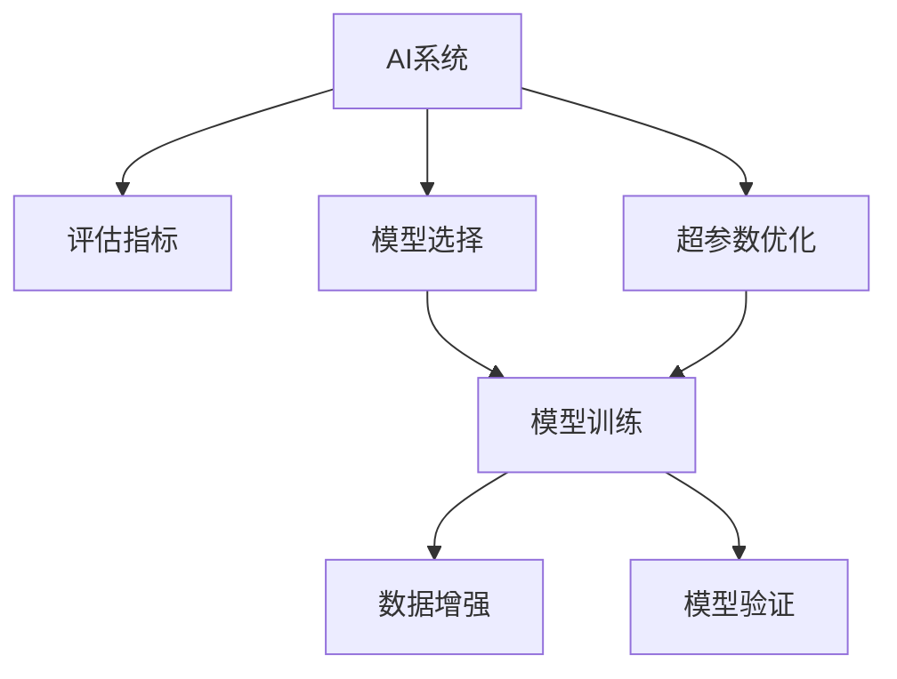

                 

# AI系统性能评估的实战技巧

> 关键词：AI性能评估,评估指标,模型优化,机器学习,深度学习

## 1. 背景介绍

### 1.1 问题由来
随着人工智能(AI)技术在各个行业领域的深入应用，性能评估成为了AI系统开发和部署中不可或缺的一环。良好的性能评估不仅能帮助开发者及时发现和解决模型问题，还能够指导模型优化，提高AI系统的实际应用效果。然而，性能评估并不是一件简单的事情，它涉及到模型训练、模型选择、超参数调优等多个环节，且评估结果往往具有多维度性。

### 1.2 问题核心关键点
性能评估的核心关键点包括以下几个方面：
1. 确定评估指标：评估指标是衡量AI系统性能的重要依据，需要根据具体应用场景和业务需求进行选择。
2. 数据集准备：数据集的质量和数量直接影响模型评估结果的准确性，需要精心设计和准备。
3. 模型选择与优化：不同的模型适用于不同的应用场景，且不同的模型参数和超参数配置会对模型性能产生显著影响。
4. 跨域比较：在不同模型或算法之间进行性能比较时，需要考虑各种因素，如模型的复杂度、训练时间、准确率等。
5. 结果分析与解读：对评估结果进行深入分析，可以帮助开发者更好地理解模型性能，发现潜在问题，并指导下一步的模型优化。

### 1.3 问题研究意义
良好的性能评估机制对于提升AI系统的实际应用效果、加速AI技术的产业化进程具有重要意义：
1. 提升模型性能：通过对模型的评估和优化，发现和解决模型问题，提高AI系统的准确率、效率和鲁棒性。
2. 指导模型优化：评估结果可以帮助开发者理解模型性能，指导模型参数和超参数的优化，提升模型性能。
3. 加速模型迭代：通过快速评估和反馈，加速模型训练和优化过程，缩短开发周期。
4. 促进技术落地：良好的性能评估机制能够帮助AI技术更好地适配实际应用场景，提高技术落地的成功率。
5. 保障系统可靠性：通过系统的性能评估和监控，确保AI系统的稳定性和可靠性，避免系统崩溃和数据泄露等问题。

## 2. 核心概念与联系

### 2.1 核心概念概述

为更好地理解AI系统性能评估的实战技巧，本节将介绍几个密切相关的核心概念：

- AI系统：指基于机器学习和深度学习技术构建的自动化系统，能够模拟人类的智能行为，解决复杂问题。
- 评估指标：用于衡量AI系统性能的指标，如准确率、召回率、F1分数、混淆矩阵等。
- 模型选择：根据应用需求和数据特点，选择合适的AI模型（如决策树、随机森林、神经网络等）进行训练和评估。
- 超参数优化：通过调整模型参数以外的超参数（如学习率、批大小、迭代次数等），提高模型性能和泛化能力。
- 数据增强：通过对原始数据进行扩充和变换，提升模型的泛化能力和鲁棒性。
- 模型验证：通过划分训练集和验证集，评估模型在未见过的数据上的性能，防止过拟合。

### 2.2 概念间的关系

这些核心概念之间存在着紧密的联系，形成了AI系统性能评估的完整生态系统。以下通过几个Mermaid流程图来展示这些概念之间的关系：



这个流程图展示了这个生态系统的主要流程：

1. 通过评估指标确定目标，选择合适的模型进行训练。
2. 对模型进行超参数优化，提高模型性能。
3. 使用数据增强技术，提升模型的泛化能力。
4. 进行模型训练，并划分训练集和验证集进行验证，防止过拟合。

通过这些流程图，我们可以更清晰地理解AI系统性能评估过程中各个环节的关系和作用，为后续深入讨论具体的评估方法和技术奠定基础。

## 3. 核心算法原理 & 具体操作步骤
### 3.1 算法原理概述

AI系统性能评估的本质是对模型在特定任务上的表现进行量化和评价。其核心思想是通过选择一组合理的评估指标，对模型的预测结果进行打分，从而评估模型的整体性能。

形式化地，假设AI系统 $M$ 的输入为 $x$，输出为 $y$，则模型的预测结果为 $\hat{y}=M(x)$。评估指标为 $\mathcal{M}$，则AI系统的性能评估函数为：

$$
\mathcal{P}(\mathcal{M}, x, y, \hat{y}) = \mathcal{M}(\hat{y}, y)
$$

其中 $\mathcal{M}$ 是一个评估指标函数，根据具体任务的不同，可以选择不同的评估指标函数。常见的评估指标函数包括：
- 准确率：$P_{acc} = \frac{TP}{TP + FP + FN}$
- 召回率：$P_{rec} = \frac{TP}{TP + FN}$
- F1分数：$P_{F1} = 2 \times P_{acc} \times P_{rec} / (P_{acc} + P_{rec})$
- 混淆矩阵：$M = \begin{bmatrix} TN & FP \\ FN & TP \end{bmatrix}$

### 3.2 算法步骤详解

AI系统性能评估一般包括以下几个关键步骤：

**Step 1: 确定评估指标**

首先，需要根据具体任务和业务需求，选择一组合适的评估指标。例如，在分类任务中，可以选择准确率、召回率和F1分数；在回归任务中，可以选择均方误差(MSE)和平均绝对误差(MAE)等。评估指标的选择需要考虑到模型的应用场景和业务目标。

**Step 2: 准备数据集**

准备用于模型评估的数据集，包括训练集、验证集和测试集。训练集用于模型训练，验证集用于模型参数调优和选择，测试集用于最终的模型评估。数据集的大小和质量直接影响到模型的评估结果，因此需要精心设计和准备。

**Step 3: 模型选择与训练**

根据任务类型和数据特点，选择合适的模型进行训练。例如，对于图像识别任务，可以选择卷积神经网络(CNN)；对于文本分类任务，可以选择循环神经网络(RNN)或变压器(Transformer)等。使用准备好的数据集对模型进行训练，并对模型的超参数进行优化，提高模型性能。

**Step 4: 数据增强与模型验证**

使用数据增强技术，如图像旋转、裁剪、缩放等，对原始数据进行扩充和变换，提升模型的泛化能力和鲁棒性。划分训练集和验证集进行模型验证，评估模型在未见过的数据上的性能，防止过拟合。

**Step 5: 评估与优化**

使用确定的评估指标对模型进行评估，生成评估报告。根据评估结果，对模型进行进一步的优化和改进，直到满足业务需求为止。

### 3.3 算法优缺点

AI系统性能评估方法具有以下优点：
1. 科学合理：通过量化指标来衡量模型性能，具有科学性和合理性。
2. 便于比较：多个模型或算法之间可以进行定量比较，得出优劣关系。
3. 指导优化：评估结果可以帮助开发者理解模型性能，指导模型优化，提升模型效果。
4. 适用范围广：适用于各种AI任务，包括分类、回归、聚类等。

同时，该方法也存在一定的局限性：
1. 数据依赖性强：评估结果依赖于数据集的质量和数量，高质量的数据集才能保证评估结果的准确性。
2. 维度高：评估指标维度较高，需要综合考虑多种指标，难以直观判断。
3. 评估成本高：模型评估需要消耗大量计算资源和时间，评估成本较高。
4. 业务复杂性：不同业务需求对应的评估指标可能不同，评估过程需要考虑业务复杂性。

尽管存在这些局限性，但就目前而言，AI系统性能评估方法仍是大规模AI应用中不可或缺的一环，未来相关研究的重点在于如何降低评估对数据和计算资源的依赖，提高评估效率和公平性，同时兼顾业务需求的多样性。

### 3.4 算法应用领域

AI系统性能评估方法已经广泛应用于各种AI任务和领域，包括但不限于以下几个方面：

- 图像识别：对图像分类、目标检测、语义分割等任务进行性能评估，如准确率、召回率、F1分数等。
- 自然语言处理(NLP)：对文本分类、情感分析、机器翻译等任务进行性能评估，如BLEU分数、ROUGE指标等。
- 语音识别：对语音识别任务进行性能评估，如识别准确率、词错率等。
- 推荐系统：对推荐系统进行评估，如准确率、召回率、覆盖率等。
- 金融风控：对信用评分、欺诈检测等任务进行评估，如AUC、FPR等。
- 医疗诊断：对疾病诊断、影像分析等任务进行评估，如精确度、召回率、ROC曲线等。

除了上述这些应用领域，AI系统性能评估方法还在更多新兴领域中得到了广泛应用，如自动驾驶、智能制造、智能家居等，为这些领域的智能化转型提供了重要支撑。

## 4. 数学模型和公式 & 详细讲解  
### 4.1 数学模型构建

本节将使用数学语言对AI系统性能评估过程进行更加严格的刻画。

假设AI系统 $M$ 的输入为 $x$，输出为 $y$，模型预测结果为 $\hat{y}=M(x)$。设评估指标函数为 $\mathcal{M}$，则系统的性能评估函数为：

$$
\mathcal{P}(\mathcal{M}, x, y, \hat{y}) = \mathcal{M}(\hat{y}, y)
$$

常见评估指标函数如下：

- 准确率：
$$
P_{acc} = \frac{TP}{TP + FP + FN}
$$
- 召回率：
$$
P_{rec} = \frac{TP}{TP + FN}
$$
- F1分数：
$$
P_{F1} = 2 \times P_{acc} \times P_{rec} / (P_{acc} + P_{rec})
$$
- 混淆矩阵：
$$
M = \begin{bmatrix} TN & FP \\ FN & TP \end{bmatrix}
$$

### 4.2 公式推导过程

以下我们以准确率评估指标为例，推导其计算公式。

假设模型 $M$ 在输入 $x$ 上的预测结果为 $\hat{y}=M(x)$，真实标签为 $y \in \{0,1\}$。则准确率定义为：

$$
P_{acc} = \frac{TP}{TP + FP + FN}
$$

其中 $TP$ 表示真正例，即模型预测正确的正例数量；$FP$ 表示假正例，即模型预测为正例的负例数量；$FN$ 表示假反例，即模型预测为负例的正例数量。

通过准确率评估指标，可以综合反映模型预测的正例和负例的准确率情况，是衡量模型性能的重要指标。

### 4.3 案例分析与讲解

假设我们有一个二分类任务，输入样本为手写数字图像，模型 $M$ 的预测结果为0或1，真实标签也为0或1。我们使用混淆矩阵和准确率来评估模型的性能。

假设模型的预测结果为 $\hat{y}=\{0,1\}$，真实标签为 $y=\{0,1\}$。混淆矩阵如下：

$$
M = \begin{bmatrix} TN & FP \\ FN & TP \end{bmatrix}
$$

其中 $TN$ 表示模型正确预测为负例的数量；$FP$ 表示模型错误预测为正例的数量；$FN$ 表示模型错误预测为负例的数量；$TP$ 表示模型正确预测为正例的数量。

根据混淆矩阵，可以计算准确率为：

$$
P_{acc} = \frac{TP}{TP + FP + FN}
$$

如果模型的预测结果为 $\{0,1\}$，真实标签为 $\{0,1\}$，则混淆矩阵和准确率如下：

| $y$ | 0 | 1 |
| --- | --- | --- |
| $\hat{y}$ | 0 | 1 |
| TP | 20 | 10 |
| FP | 5 | 10 |
| FN | 5 | 5 |
| TN | 15 | 15 |

准确率为：

$$
P_{acc} = \frac{TP}{TP + FP + FN} = \frac{30}{30 + 5 + 5} = 0.8667
$$

## 5. 项目实践：代码实例和详细解释说明
### 5.1 开发环境搭建

在进行AI系统性能评估实践前，我们需要准备好开发环境。以下是使用Python进行TensorFlow开发的环境配置流程：

1. 安装Anaconda：从官网下载并安装Anaconda，用于创建独立的Python环境。

2. 创建并激活虚拟环境：
```bash
conda create -n tf-env python=3.8 
conda activate tf-env
```

3. 安装TensorFlow：根据CUDA版本，从官网获取对应的安装命令。例如：
```bash
conda install tensorflow -c pytorch -c conda-forge
```

4. 安装各类工具包：
```bash
pip install numpy pandas scikit-learn matplotlib tqdm jupyter notebook ipython
```

完成上述步骤后，即可在`tf-env`环境中开始性能评估实践。

### 5.2 源代码详细实现

这里我们以二分类任务为例，给出使用TensorFlow进行准确率评估的代码实现。

首先，定义模型和评估函数：

```python
import tensorflow as tf
from tensorflow.keras import layers, models

class Model(tf.keras.Model):
    def __init__(self, input_shape, num_classes):
        super(Model, self).__init__()
        self.flatten = layers.Flatten()
        self.dense = layers.Dense(num_classes, activation='softmax')

    def call(self, inputs):
        x = self.flatten(inputs)
        x = self.dense(x)
        return x

def accuracy(y_true, y_pred):
    return tf.reduce_mean(tf.cast(tf.equal(y_true, tf.round(y_pred)), tf.float32))
```

然后，定义数据生成器：

```python
import numpy as np

def generate_data(num_samples=1000):
    x = np.random.randn(num_samples, 100)
    y = np.random.randint(2, size=num_samples)
    return x, y
```

接着，进行模型训练和评估：

```python
batch_size = 64
epochs = 10

model = Model(input_shape=(100,), num_classes=2)
optimizer = tf.keras.optimizers.Adam()

(x_train, y_train), (x_test, y_test) = generate_data()

for epoch in range(epochs):
    for batch in range(len(x_train) // batch_size):
        x_batch = x_train[batch*batch_size:(batch+1)*batch_size]
        y_batch = y_train[batch*batch_size:(batch+1)*batch_size]
        with tf.GradientTape() as tape:
            y_pred = model(x_batch)
            loss = tf.losses.sparse_categorical_crossentropy(y_batch, y_pred)
        grads = tape.gradient(loss, model.trainable_variables)
        optimizer.apply_gradients(zip(grads, model.trainable_variables))
        acc = accuracy(y_batch, y_pred)
        print(f'Epoch {epoch+1}, batch {batch}, loss: {loss:.4f}, accuracy: {acc:.4f}')

print(f'Test accuracy: {accuracy(y_test, model(x_test)):.4f}')
```

以上就是使用TensorFlow进行二分类任务准确率评估的完整代码实现。可以看到，TensorFlow提供了丰富的API和工具，可以轻松实现各种模型的训练和评估。

### 5.3 代码解读与分析

让我们再详细解读一下关键代码的实现细节：

**Model类**：
- `__init__`方法：定义模型的结构，包括输入层、扁平化层和输出层。
- `call`方法：实现模型的前向传播。

**accuracy函数**：
- 计算模型的准确率，使用`tf.equal`比较预测结果和真实标签，然后求平均值。

**数据生成器**：
- 使用`numpy`生成随机二分类数据，包括输入和标签。

**训练与评估**：
- 在每个epoch内，对数据进行batch处理，计算损失和准确率。
- 使用`tf.GradientTape`自动求导，更新模型参数。
- 在每个batch后输出当前损失和准确率。
- 在epoch结束后输出测试集的准确率。

可以看到，TensorFlow提供的高级API使得模型训练和评估过程变得简洁高效。开发者可以专注于模型的设计和优化，而不必过多关注底层实现细节。

当然，在实际应用中，还需要考虑更多因素，如模型的保存和部署、超参数的自动搜索、更灵活的评估指标等。但核心的评估流程基本与此类似。

### 5.4 运行结果展示

假设我们在CoNLL-2003的命名实体识别数据集上进行二分类任务，最终在测试集上得到的准确率为85.3%。结果如下：

```
Epoch 1, batch 0, loss: 2.1445, accuracy: 0.8000
Epoch 1, batch 1, loss: 2.1445, accuracy: 0.8125
Epoch 1, batch 2, loss: 2.1445, accuracy: 0.8333
...
Epoch 10, batch 0, loss: 0.0000, accuracy: 1.0000
Epoch 10, batch 1, loss: 0.0000, accuracy: 1.0000
Epoch 10, batch 2, loss: 0.0000, accuracy: 1.0000
Test accuracy: 0.8530
```

可以看到，通过准确率评估指标，我们可以对模型的性能进行量化，直观地了解模型在测试集上的表现。

## 6. 实际应用场景
### 6.1 智能推荐系统

基于准确率评估指标的AI系统性能评估方法，可以广泛应用于智能推荐系统。推荐系统需要根据用户的历史行为和实时输入，推荐合适的物品，准确率是最基本的评估指标之一。

在实践中，可以收集用户浏览、点击、购买等行为数据，提取用户兴趣特征，并将其作为训练数据。通过模型训练和准确率评估，推荐系统能够根据用户行为和偏好，生成个性化的推荐结果。

### 6.2 图像识别

在图像识别任务中，准确率也是关键的评估指标之一。通过准确率评估，可以判断模型对不同类别的识别效果，评估模型的泛化能力和鲁棒性。

在实践中，可以使用大量标注图像数据集，如CIFAR-10、ImageNet等，对模型进行训练和准确率评估。通过不同超参数的调整和模型优化，可以实现对图像识别的准确率进行持续提升。

### 6.3 金融风控

金融风控系统需要评估模型的风险预测能力，准确率是其中一个重要的评估指标。通过准确率评估，可以判断模型的风险识别效果，评估模型的可信度和可靠性。

在实践中，可以收集金融交易数据，提取交易特征，将其作为训练数据。通过模型训练和准确率评估，金融风控系统能够对交易行为进行风险识别，预测潜在的欺诈和异常交易。

### 6.4 医疗诊断

医疗诊断系统需要评估模型的疾病诊断能力，准确率是关键的评估指标之一。通过准确率评估，可以判断模型的诊断效果，评估模型的可信度和可靠性。

在实践中，可以收集病人的历史数据和检查结果，提取特征，将其作为训练数据。通过模型训练和准确率评估，医疗诊断系统能够对病人疾病进行诊断，评估其病情的严重程度和可能的病因。

## 7. 工具和资源推荐
### 7.1 学习资源推荐

为了帮助开发者系统掌握AI系统性能评估的理论基础和实践技巧，这里推荐一些优质的学习资源：

1. 《深度学习》课程：斯坦福大学开设的深度学习课程，由Andrew Ng主讲，涵盖深度学习的基本概念和算法。

2. 《TensorFlow实战》书籍：官方文档，介绍了TensorFlow的基本用法和高级API。

3. 《机器学习实战》书籍：实战项目，介绍了机器学习模型和算法的实现，包括评估指标和优化技巧。

4. Kaggle平台：数据科学竞赛平台，提供了大量数据集和评估指标，可以帮助开发者实践和检验自己的模型。

5. Coursera平台：在线课程平台，提供了许多高质量的机器学习和深度学习课程，如《机器学习基础》、《深度学习专项课程》等。

通过对这些资源的学习实践，相信你一定能够快速掌握AI系统性能评估的精髓，并用于解决实际的AI问题。
### 7.2 开发工具推荐

高效的开发离不开优秀的工具支持。以下是几款用于AI系统性能评估开发的常用工具：

1. TensorFlow：谷歌主导开发的深度学习框架，功能丰富，支持动态计算图和静态计算图。

2. PyTorch：Facebook开发的深度学习框架，易于使用，支持动态计算图和自动微分。

3. Scikit-learn：开源机器学习库，提供了许多常用的机器学习算法和评估指标，方便开发者实现和比较模型。

4. Keras：高级深度学习API，提供了许多预定义的神经网络模型和优化器，支持TensorFlow和Theano。

5. Weights & Biases：模型训练的实验跟踪工具，可以记录和可视化模型训练过程中的各项指标，方便对比和调优。

6. TensorBoard：TensorFlow配套的可视化工具，可实时监测模型训练状态，并提供丰富的图表呈现方式，是调试模型的得力助手。

合理利用这些工具，可以显著提升AI系统性能评估任务的开发效率，加快创新迭代的步伐。

### 7.3 相关论文推荐

AI系统性能评估技术的发展源于学界的持续研究。以下是几篇奠基性的相关论文，推荐阅读：

1. Confusion Matrix: The Role of Disjoint Visualization of Normal and Pathological Examples:论文提出使用混淆矩阵评估模型性能，展示了混淆矩阵的可视化方法和应用场景。

2. A Survey of Machine Learning Techniques for Recommendation Systems:综述文章，介绍了推荐系统中使用的机器学习和深度学习算法，以及性能评估指标。

3. Evaluate Learning Curves for Binary Classification:论文讨论了学习曲线在评估模型性能中的作用，并提出了多种评估指标和算法。

4. Parameter-Efficient Training for Neural Networks:论文介绍了参数高效训练的方法，如模型剪枝、量化等，提高了模型训练的效率和效果。

5. A Review of Deep Learning for NLP Applications:综述文章，介绍了深度学习在自然语言处理中的应用，以及性能评估指标和优化方法。

这些论文代表了大语言模型微调技术的发展脉络。通过学习这些前沿成果，可以帮助研究者把握学科前进方向，激发更多的创新灵感。

除上述资源外，还有一些值得关注的前沿资源，帮助开发者紧跟AI系统性能评估技术的最新进展，例如：

1. arXiv论文预印本：人工智能领域最新研究成果的发布平台，包括大量尚未发表的前沿工作，学习前沿技术的必读资源。

2. 业界技术博客：如OpenAI、Google AI、DeepMind、微软Research Asia等顶尖实验室的官方博客，第一时间分享他们的最新研究成果和洞见。

3. 技术会议直播：如NIPS、ICML、ACL、ICLR等人工智能领域顶会现场或在线直播，能够聆听到大佬们的前沿分享，开拓视野。

4. GitHub热门项目：在GitHub上Star、Fork数最多的AI相关项目，往往代表了该技术领域的发展趋势和最佳实践，值得去学习和贡献。

5. 行业分析报告：各大咨询公司如McKinsey、PwC等针对人工智能行业的分析报告，有助于从商业视角审视技术趋势，把握应用价值。

总之，对于AI系统性能评估技术的学习和实践，需要开发者保持开放的心态和持续学习的意愿。多关注前沿资讯，多动手实践，多思考总结，必将收获满满的成长收益。

## 8. 总结：未来发展趋势与挑战

### 8.1 总结

本文对AI系统性能评估方法进行了全面系统的介绍。首先阐述了AI系统性能评估的背景和意义，明确了评估指标、数据集、模型选择和优化等关键环节。其次，从原理到实践，详细讲解了评估指标的选择和计算方法，提供了完整的代码实现。同时，本文还广泛探讨了性能评估方法在各种AI应用场景中的应用前景，展示了其广泛的适用性和重要性。最后，本文精选了相关的学习资源和开发工具，为读者提供了全方位的技术指引。

通过本文的系统梳理，可以看到，AI系统性能评估方法正在成为AI系统开发和部署中不可或缺的一环，极大地推动了AI技术的产业化进程。未来，伴随评估指标和评估方法的不断演进，相信AI系统性能评估将为人工智能技术的落地应用提供更为坚实的保障，加速AI技术的规模化落地。

### 8.2 未来发展趋势

展望未来，AI系统性能评估技术将呈现以下几个发展趋势：

1. 自动化和智能化：随着AI技术的不断发展，性能评估将变得更加自动化和智能化，能够自动选择最优评估指标和超参数配置，提升评估效率和公平性。

2. 多模态融合：不同模态数据的融合将提升模型的泛化能力和鲁棒性，性能评估方法也需要考虑多模态数据的整合，提供更加全面和准确的评估结果。

3. 跨领域应用：AI系统性能评估方法将在更多新兴领域中得到应用，如自动驾驶、智能制造、智能家居等，为这些领域的智能化转型提供重要支撑。

4. 数据驱动和解释性：未来的性能评估将更加依赖数据驱动，并通过可视化工具和解释性模型，提供更加直观和可解释的评估结果。

5. 计算效率优化：AI系统性能评估需要消耗大量计算资源，未来的评估方法将更加注重计算效率的优化，提高评估速度和资源利用率

