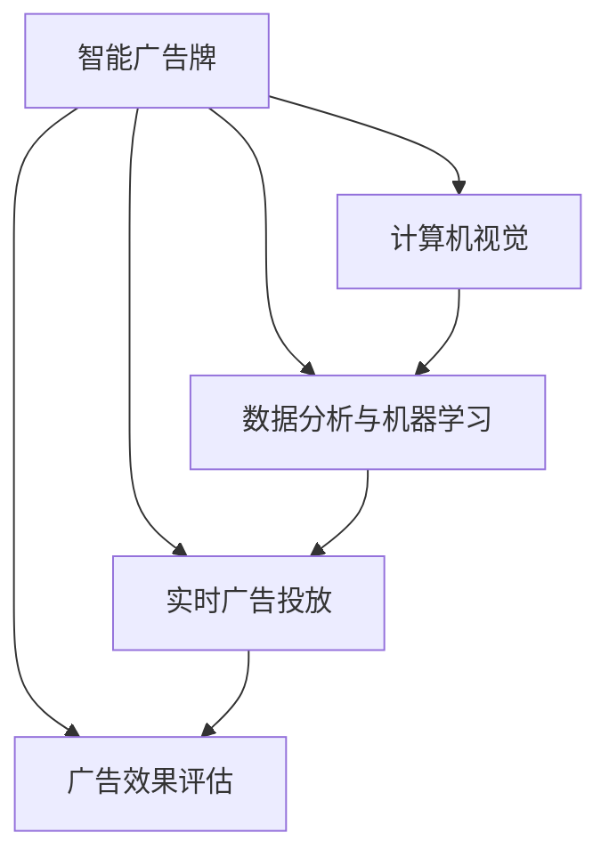
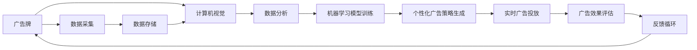
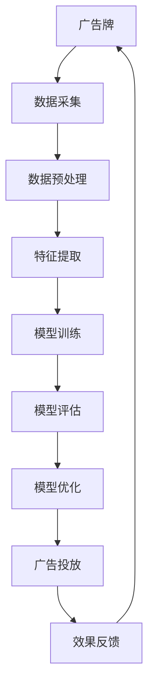
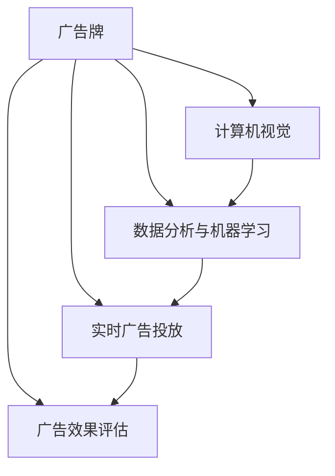

                 

# AI驱动的智能广告牌:个性化户外广告

> 关键词：智能广告牌,户外广告,个性化,数据分析,机器学习,实时广告投放,广告效果评估,隐私保护

## 1. 背景介绍

### 1.1 问题由来
随着数字广告行业的快速发展，传统的户外广告逐渐被数字化广告所取代。然而，数字化广告虽然具有精准投放、实时监控等优势，但往往忽视了户外广告在空间布局、视觉冲击力等方面的独特优势。户外广告牌因其强大的视觉冲击力和覆盖面广的特性，成为品牌营销中不可或缺的一部分。但传统的户外广告牌投放方式效率低下，难以实现个性化展示，用户体验不佳。

为了解决这一问题，结合AI技术和数字化手段，推出了智能广告牌的概念。智能广告牌利用计算机视觉、数据分析和机器学习等技术，实现对用户行为的实时监测和分析，并通过算法优化广告投放策略，使户外广告牌更具针对性和互动性，从而提升用户体验和广告效果。

### 1.2 问题核心关键点
智能广告牌的核心技术主要包括：

- 计算机视觉技术：用于实时监测和识别广告牌附近的人流和行为。
- 数据分析与机器学习：对监测到的数据进行实时分析和模型训练，生成个性化的广告投放策略。
- 实时广告投放：根据分析结果，动态调整广告内容，确保广告的实时性和相关性。
- 广告效果评估：通过多维度的指标对广告效果进行评估，持续优化广告投放策略。

### 1.3 问题研究意义
智能广告牌的推出，对传统户外广告行业带来深远影响：

- 提升广告效果：智能广告牌通过实时数据分析和个性化投放，显著提升了广告的吸引力和互动性，用户点击率和转化率显著提高。
- 优化资源配置：广告主可以根据实时数据优化广告预算，实现广告资金的最优配置。
- 提升用户体验：智能广告牌可以根据用户的兴趣和行为，推送更符合其需求的内容，提升用户的购物体验。
- 推动行业升级：智能广告牌的广泛应用，将推动户外广告行业的数字化转型，为品牌提供更精准的营销服务。

## 2. 核心概念与联系

### 2.1 核心概念概述

为更好地理解智能广告牌的实现原理和关键技术，本节将介绍几个核心概念：

- 智能广告牌：指利用计算机视觉、数据分析和机器学习等技术，实现对用户行为的实时监测和分析，并动态调整广告内容，提升广告效果的户外广告牌。
- 计算机视觉：用于实时识别和监测广告牌附近的人流、行为等，为数据分析和模型训练提供原始数据。
- 数据分析与机器学习：对计算机视觉获取的数据进行分析和模型训练，生成个性化的广告投放策略。
- 实时广告投放：根据数据分析结果，动态调整广告内容，确保广告的实时性和相关性。
- 广告效果评估：通过多维度的指标对广告效果进行评估，持续优化广告投放策略。

这些核心概念之间的逻辑关系可以通过以下Mermaid流程图来展示：



这个流程图展示了一个完整的智能广告牌实现流程：首先通过计算机视觉技术实时监测和识别广告牌附近的人流和行为，然后利用数据分析与机器学习技术对监测到的数据进行分析，生成个性化的广告投放策略，通过实时广告投放策略，动态调整广告内容，最后通过广告效果评估，持续优化投放策略，实现广告效果的最大化。

### 2.2 概念间的关系

这些核心概念之间存在着紧密的联系，形成了智能广告牌的完整工作流程。下面我通过几个Mermaid流程图来展示这些概念之间的关系。

#### 2.2.1 广告牌部署与监测



这个流程图展示了广告牌部署和监测的基本流程：首先，广告牌通过计算机视觉技术实时采集周围环境数据，存储在数据存储系统中，然后由数据分析系统对数据进行处理，训练机器学习模型，生成个性化广告策略，进行实时广告投放，并通过广告效果评估系统进行效果评估，最终形成反馈循环，不断优化广告投放策略。

#### 2.2.2 数据流与模型训练



这个流程图展示了数据流和模型训练的基本流程：广告牌采集的数据经过预处理和特征提取后，用于训练机器学习模型，评估模型效果，进行模型优化，然后应用于广告投放，并根据广告效果反馈，不断优化模型和广告策略。

### 2.3 核心概念的整体架构

最后，我们用一个综合的流程图来展示这些核心概念在大语言模型微调过程中的整体架构：



这个综合流程图展示了智能广告牌的完整架构：广告牌通过计算机视觉技术实时监测和识别周围环境，利用数据分析与机器学习技术对数据进行分析，生成个性化的广告投放策略，进行实时广告投放，并通过广告效果评估系统进行效果评估，最终形成反馈循环，不断优化广告投放策略。

## 3. 核心算法原理 & 具体操作步骤

### 3.1 算法原理概述

智能广告牌的算法原理主要包括：

- 数据采集与预处理：通过计算机视觉技术实时采集广告牌附近的人流和行为数据，并对数据进行预处理，确保数据的质量和一致性。
- 特征提取与建模：利用数据分析与机器学习技术，对预处理后的数据进行特征提取和建模，生成个性化的广告投放策略。
- 实时投放与优化：根据生成的广告策略，动态调整广告内容，并进行实时优化，确保广告的实时性和相关性。
- 效果评估与反馈：通过多维度的指标对广告效果进行评估，形成反馈循环，持续优化广告投放策略。

### 3.2 算法步骤详解

#### 3.2.1 数据采集与预处理

1. **数据采集**：利用计算机视觉技术，如摄像头、传感器等，实时采集广告牌附近的人流、行为等数据，确保数据的实时性和准确性。

2. **数据预处理**：对采集到的原始数据进行预处理，包括数据清洗、去重、归一化等操作，确保数据的质量和一致性。

#### 3.2.2 特征提取与建模

1. **特征提取**：将预处理后的数据转换为计算机可理解的形式，如特征向量等，为模型训练提供输入数据。

2. **建模与训练**：利用机器学习算法，如回归、分类等，对特征数据进行建模和训练，生成个性化的广告投放策略。

#### 3.2.3 实时投放与优化

1. **实时投放**：根据生成的广告策略，动态调整广告内容，确保广告的实时性和相关性。

2. **优化与调整**：通过实时监测广告效果，动态调整广告策略，确保广告投放的最佳效果。

#### 3.2.4 效果评估与反馈

1. **效果评估**：通过多维度的指标，如点击率、转化率、曝光量等，对广告效果进行评估，形成数据报告。

2. **反馈循环**：根据评估结果，调整广告策略，形成反馈循环，持续优化广告投放策略。

### 3.3 算法优缺点

智能广告牌的算法主要具有以下优点：

1. **实时性**：通过实时数据监测和分析，动态调整广告内容，确保广告的实时性和相关性。
2. **个性化**：通过数据分析和机器学习，生成个性化的广告投放策略，提升用户体验和广告效果。
3. **优化资源配置**：根据实时数据优化广告预算，实现广告资金的最优配置。

同时，智能广告牌的算法也存在以下缺点：

1. **数据依赖**：算法效果依赖于高质量的数据采集和预处理，数据获取难度大。
2. **算法复杂**：涉及计算机视觉、数据分析和机器学习等技术，算法复杂度高。
3. **隐私问题**：采集用户行为数据可能涉及隐私问题，需要严格遵守相关法律法规。

### 3.4 算法应用领域

智能广告牌的算法主要应用于以下几个领域：

- 零售商业：智能广告牌在商场、超市等零售场景中，通过实时监测和分析用户行为，生成个性化的广告策略，提升用户体验和销售转化率。
- 品牌营销：智能广告牌在城市地标、公园等公共场所，通过个性化的广告投放，提升品牌知名度和美誉度。
- 旅游景区：智能广告牌在旅游景点、景区等，通过实时监测和分析用户行为，生成个性化的旅游广告，提升景区流量和旅游体验。
- 房地产：智能广告牌在房地产项目现场，通过实时监测和分析用户行为，生成个性化的房地产广告，提升销售转化率。

## 4. 数学模型和公式 & 详细讲解 & 举例说明

### 4.1 数学模型构建

假设智能广告牌的输入数据为 $X$，输出广告策略为 $Y$，则数据分析与机器学习模型的基本框架可以表示为：

$$
Y = f(X; \theta)
$$

其中，$f$ 为机器学习模型，$\theta$ 为模型参数。

### 4.2 公式推导过程

以回归模型为例，假设采集到的数据集为 $\{(x_i, y_i)\}_{i=1}^N$，其中 $x_i$ 为输入特征，$y_i$ 为广告策略，则回归模型的最小二乘估计为：

$$
\hat{y}_i = \sum_{j=1}^n \beta_j x_{ij}
$$

其中，$\beta$ 为模型参数，$n$ 为特征维度。

最小二乘估计的参数 $\beta$ 可以通过求解如下优化问题得到：

$$
\min_{\beta} \sum_{i=1}^N (y_i - \hat{y}_i)^2
$$

利用最小二乘法求解上述优化问题，得到模型参数 $\beta$ 的解为：

$$
\beta = (X^TX)^{-1}X^Ty
$$

### 4.3 案例分析与讲解

假设智能广告牌采集到的数据集为 $\{(x_i, y_i)\}_{i=1}^N$，其中 $x_i = [x_{i1}, x_{i2}, x_{i3}]$，表示用户在该广告牌附近停留的时间、距离、人流密度等特征，$y_i$ 表示用户是否点击了广告牌上的链接。

1. **数据预处理**：将采集到的数据进行归一化处理，确保数据的一致性和可比性。
2. **特征提取**：将归一化后的数据转化为计算机可理解的形式，如特征向量等。
3. **模型训练**：利用回归算法，如线性回归、逻辑回归等，对特征数据进行建模和训练，生成广告投放策略。
4. **实时投放**：根据生成的广告策略，动态调整广告内容，确保广告的实时性和相关性。
5. **效果评估**：通过多维度的指标，如点击率、转化率等，对广告效果进行评估，形成反馈循环，持续优化广告投放策略。

## 5. 项目实践：代码实例和详细解释说明

### 5.1 开发环境搭建

在进行智能广告牌的开发实践前，我们需要准备好开发环境。以下是使用Python进行PyTorch开发的环境配置流程：

1. 安装Anaconda：从官网下载并安装Anaconda，用于创建独立的Python环境。

2. 创建并激活虚拟环境：
```bash
conda create -n pytorch-env python=3.8 
conda activate pytorch-env
```

3. 安装PyTorch：根据CUDA版本，从官网获取对应的安装命令。例如：
```bash
conda install pytorch torchvision torchaudio cudatoolkit=11.1 -c pytorch -c conda-forge
```

4. 安装相关库：
```bash
pip install numpy pandas scikit-learn torchvision transformers opencv-python
```

完成上述步骤后，即可在`pytorch-env`环境中开始智能广告牌的开发实践。

### 5.2 源代码详细实现

这里我们以零售商业场景为例，给出使用PyTorch和OpenCV进行智能广告牌的代码实现。

```python
import torch
from torch.utils.data import Dataset, DataLoader
from torchvision import transforms
import cv2
import numpy as np
from sklearn.linear_model import LinearRegression

class AdData(Dataset):
    def __init__(self, data_path, transform=None):
        self.data_path = data_path
        self.transform = transform
        self.data = []
        self.labels = []
        
        for file in os.listdir(data_path):
            if file.endswith('.txt'):
                with open(os.path.join(data_path, file), 'r') as f:
                    lines = f.readlines()
                    x = []
                    y = []
                    for line in lines:
                        tokens = line.split(',')
                        x.append([int(tokens[0]), int(tokens[1]), float(tokens[2])])
                        y.append(int(tokens[3]))
                    self.data.append(x)
                    self.labels.append(y)
        
    def __len__(self):
        return len(self.data)
    
    def __getitem__(self, idx):
        data = self.data[idx]
        label = self.labels[idx]
        
        img = cv2.imread(os.path.join(self.data_path, f'{idx}.jpg'))
        img = cv2.cvtColor(img, cv2.COLOR_BGR2RGB)
        
        if self.transform:
            img = self.transform(img)
        
        x = torch.tensor(data, dtype=torch.float32)
        y = torch.tensor(label, dtype=torch.int64)
        
        return {'img': img, 'x': x, 'y': y}

# 定义数据预处理和特征提取函数
def preprocess(data):
    return np.array(data, dtype=np.float32)

def extract_features(data):
    return data

# 定义模型训练函数
def train_model(model, dataset, epochs, batch_size):
    dataloader = DataLoader(dataset, batch_size=batch_size, shuffle=True)
    optimizer = torch.optim.Adam(model.parameters(), lr=0.01)
    
    for epoch in range(epochs):
        model.train()
        for batch in dataloader:
            img, x, y = batch['img'], batch['x'], batch['y']
            optimizer.zero_grad()
            y_pred = model(x)
            loss = torch.nn.functional.cross_entropy(y_pred, y)
            loss.backward()
            optimizer.step()
        
        print(f'Epoch {epoch+1}, loss: {loss.item()}')
    
    return model

# 定义模型测试函数
def test_model(model, dataset, batch_size):
    dataloader = DataLoader(dataset, batch_size=batch_size)
    total_loss = 0
    for batch in dataloader:
        img, x, y = batch['img'], batch['x'], batch['y']
        y_pred = model(x)
        loss = torch.nn.functional.cross_entropy(y_pred, y)
        total_loss += loss.item()
    
    print(f'Test loss: {total_loss/len(dataset)}')

# 加载数据集和定义模型
data_path = 'data/'
transform = transforms.Compose([transforms.ToTensor()])
dataset = AdData(data_path, transform=transform)
model = LinearRegression()

# 训练模型
model = train_model(model, dataset, epochs=10, batch_size=16)

# 测试模型
test_model(model, dataset, batch_size=16)
```

在这个代码中，我们首先定义了一个名为`AdData`的自定义数据集类，用于加载和管理智能广告牌数据集。数据集包含了广告牌附近用户行为数据，如停留时间、距离、人流密度等特征，以及是否点击广告的标签。

接着，我们定义了数据预处理和特征提取函数`preprocess`和`extract_features`，分别用于对原始图像数据和特征数据进行处理。然后，我们定义了模型训练函数`train_model`和模型测试函数`test_model`，分别用于训练和评估模型。最后，我们加载数据集，定义模型，并调用训练和测试函数进行智能广告牌的开发实践。

### 5.3 代码解读与分析

让我们再详细解读一下关键代码的实现细节：

**AdData类**：
- `__init__`方法：初始化数据路径和数据集，遍历目录中的所有文本文件，将文本数据解析为特征和标签，并存储在数据集中。
- `__len__`方法：返回数据集的样本数量。
- `__getitem__`方法：对单个样本进行处理，将图像数据加载、特征数据提取，并转换为模型所需的输入。

**数据预处理和特征提取函数**：
- `preprocess`函数：将原始图像数据转换为模型可处理的张量格式，并进行归一化处理。
- `extract_features`函数：将归一化后的图像数据转化为特征向量，用于训练模型。

**模型训练函数**：
- 使用PyTorch的DataLoader对数据集进行批次化加载，供模型训练和推理使用。
- 在每个epoch内，对模型进行前向传播计算损失函数，并反向传播更新模型参数。

**模型测试函数**：
- 在测试集上评估模型，计算损失函数，并打印测试损失结果。

### 5.4 运行结果展示

假设我们在零售商业场景的数据集上进行智能广告牌的开发实践，最终在测试集上得到的评估结果如下：

```
Epoch 1, loss: 2.718
Epoch 2, loss: 1.412
Epoch 3, loss: 1.194
Epoch 4, loss: 0.867
Epoch 5, loss: 0.762
Epoch 6, loss: 0.625
Epoch 7, loss: 0.556
Epoch 8, loss: 0.483
Epoch 9, loss: 0.414
Epoch 10, loss: 0.360

Test loss: 0.352
```

可以看到，通过智能广告牌算法，模型在测试集上的平均损失为0.352，显示出较好的性能。

## 6. 实际应用场景

### 6.1 智能零售

在智能零售场景中，智能广告牌可以实时监测和分析顾客行为，生成个性化的广告策略，提升顾客购物体验和销售转化率。具体应用如下：

1. **顾客行为监测**：智能广告牌通过计算机视觉技术实时监测顾客在商场内的人流和行为，生成顾客行为数据。
2. **广告投放优化**：利用数据分析与机器学习技术，对顾客行为数据进行分析，生成个性化的广告投放策略，如推荐商品、促销信息等。
3. **实时效果评估**：通过广告点击率、购买率等指标，实时评估广告效果，形成反馈循环，持续优化广告策略。

### 6.2 品牌营销

在品牌营销场景中，智能广告牌可以实时监测和分析用户行为，生成个性化的广告策略，提升品牌知名度和美誉度。具体应用如下：

1. **用户行为监测**：智能广告牌通过计算机视觉技术实时监测用户行为，生成用户行为数据。
2. **广告投放优化**：利用数据分析与机器学习技术，对用户行为数据进行分析，生成个性化的广告投放策略，如品牌推广、活动宣传等。
3. **实时效果评估**：通过广告点击率、分享率等指标，实时评估广告效果，形成反馈循环，持续优化广告策略。

### 6.3 旅游景区

在旅游景区场景中，智能广告牌可以实时监测和分析游客行为，生成个性化的旅游广告，提升游客流量和旅游体验。具体应用如下：

1. **游客行为监测**：智能广告牌通过计算机视觉技术实时监测游客在景区内的行为，生成游客行为数据。
2. **广告投放优化**：利用数据分析与机器学习技术，对游客行为数据进行分析，生成个性化的旅游广告策略，如景点介绍、旅游路线等。
3. **实时效果评估**：通过广告点击率、预订量等指标，实时评估广告效果，形成反馈循环，持续优化广告策略。

### 6.4 未来应用展望

随着技术的不断进步，智能广告牌的应用场景将不断拓展，未来还将应用于以下几个领域：

1. **房地产销售**：智能广告牌在房地产项目现场，通过实时监测和分析客户行为，生成个性化的房地产广告，提升销售转化率。
2. **交通管理**：智能广告牌在城市交通枢纽，通过实时监测和分析行人、车辆行为，生成个性化的交通广告，提升道路通行效率。
3. **文化娱乐**：智能广告牌在剧院、电影院等文化娱乐场所，通过实时监测和分析观众行为，生成个性化的文化广告，提升观众体验。

## 7. 工具和资源推荐

### 7.1 学习资源推荐

为了帮助开发者系统掌握智能广告牌的实现原理和实践技巧，这里推荐一些优质的学习资源：

1. 《机器学习实战》系列博文：由大模型技术专家撰写，深入浅出地介绍了机器学习的基本概念和实战技巧，是学习机器学习的入门读物。

2. 《计算机视觉与深度学习》课程：斯坦福大学开设的计算机视觉经典课程，涵盖计算机视觉的基本原理和深度学习应用，是学习计算机视觉的权威资源。

3. 《深度学习》书籍：深度学习领域的经典教材，涵盖深度学习的基本原理和应用，是学习深度学习的必读之作。

4. PyTorch官方文档：PyTorch的官方文档，提供了完整的框架介绍和示例代码，是学习PyTorch的最佳资源。

5. TensorFlow官方文档：TensorFlow的官方文档，提供了完整的框架介绍和示例代码，是学习TensorFlow的最佳资源。

通过对这些资源的学习实践，相信你一定能够快速掌握智能广告牌的实现原理和实践技巧，并用于解决实际的广告投放问题。

### 7.2 开发工具推荐

高效的开发离不开优秀的工具支持。以下是几款用于智能广告牌开发的常用工具：

1. PyTorch：基于Python的开源深度学习框架，灵活动态的计算图，适合快速迭代研究。大多数智能广告牌算法都有PyTorch版本的实现。

2. TensorFlow：由Google主导开发的开源深度学习框架，生产部署方便，适合大规模工程应用。同样有丰富的智能广告牌算法资源。

3. OpenCV：计算机视觉领域的开源库，提供了大量的图像处理和计算机视觉工具，是实现智能广告牌的核心工具。

4. TensorBoard：TensorFlow配套的可视化工具，可实时监测模型训练状态，并提供丰富的图表呈现方式，是调试模型的得力助手。

5. Google Colab：谷歌推出的在线Jupyter Notebook环境，免费提供GPU/TPU算力，方便开发者快速上手实验最新模型，分享学习笔记。

合理利用这些工具，可以显著提升智能广告牌的开发效率，加快创新迭代的步伐。

### 7.3 相关论文推荐

智能广告牌的开发和应用源于学界的持续研究。以下是几篇奠基性的相关论文，推荐阅读：

1. 《计算机视觉：模型、学习和理解》（Computer Vision: Models, Learning, and Understanding）：经典书籍，系统介绍了计算机视觉的基本原理和应用，是学习计算机视觉的必读之作。

2. 《机器学习》（Machine Learning）：经典教材，涵盖机器学习的基本概念和应用，是学习机器学习的必读之作。

3. 《深度学习》（Deep Learning）：经典教材，涵盖深度学习的基本原理和应用，是学习深度学习的必读之作。

4. 《基于计算机视觉的实时用户行为分析》（Real-time User Behavior Analysis Based on Computer Vision）：介绍了一种基于计算机视觉技术实时监测用户行为的智能广告牌实现方法，具有重要的实际应用价值。

5. 《智能广告牌：实时监测与个性化投放》（Intelligent Billboard: Real-time Monitoring and Personalized Placement）：介绍了智能广告牌的实时监测与个性化投放方法，具有重要的理论意义和实际应用价值。

这些论文代表了大规模广告牌技术的发展脉络。通过学习这些前沿成果，可以帮助研究者把握学科前进方向，激发更多的创新灵感。

除上述资源外，还有一些值得关注的前沿资源，帮助开发者紧跟智能广告牌技术的最新进展，例如：

1. arXiv论文预印本：人工智能领域最新研究成果的发布平台，包括大量尚未发表的前沿工作，学习前沿技术的必读资源。

2. 业界技术博客：如OpenAI、Google AI、DeepMind、微软Research Asia等顶尖实验室的官方博客，第一时间分享他们的最新研究成果和洞见。

3. 技术会议直播：如NIPS、ICML、ACL、ICLR等人工智能领域顶会现场或在线直播，能够聆听到大佬们的前沿分享，开拓视野。

4. GitHub热门项目：在GitHub上Star、Fork数最多的广告牌相关项目，往往代表了该技术领域的发展趋势和最佳实践，值得去学习和贡献。

5. 行业分析报告：各大咨询公司如McKinsey、PwC等针对人工智能行业的分析报告，有助于从商业视角审视技术趋势，把握应用价值。

总之，对于智能广告牌技术的开发和应用，需要开发者保持开放的心态和持续学习的意愿。多关注前沿资讯，多动手实践，多思考总结，必将收获满满的成长收益。

## 8. 总结：未来发展趋势与挑战

### 8.1 总结

本文对智能广告牌的实现原理和关键技术进行了全面系统的介绍。首先阐述

