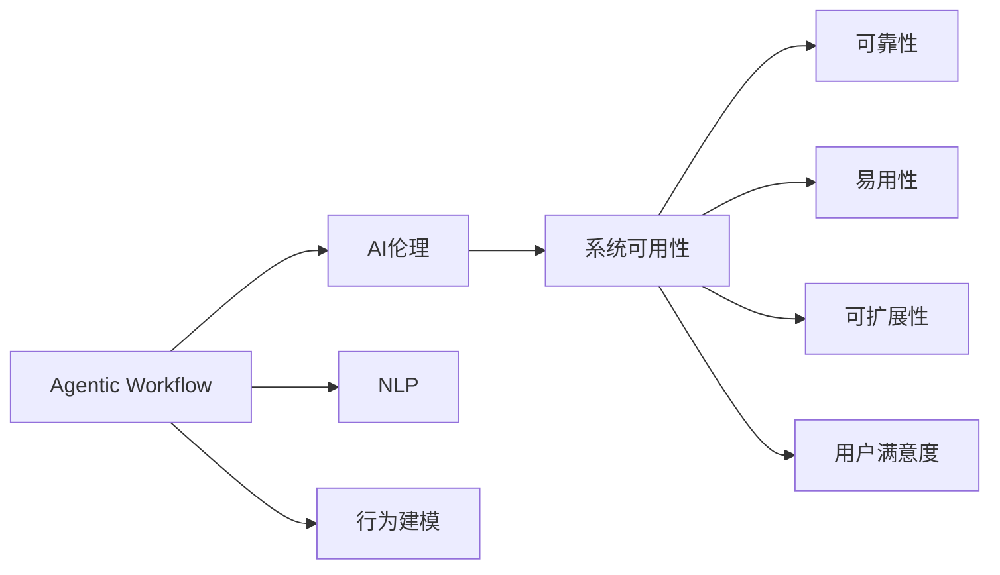

                 

# Agentic Workflow 的可用性讨论

> 关键词：Agentic Workflow, 人工智能伦理, 系统可用性, 人机交互设计, 自然语言处理(NLP), 行为建模

## 1. 背景介绍

### 1.1 问题由来
随着人工智能（AI）技术在各行业的广泛应用，Agentic Workflow（智能工作流）系统逐渐成为推动自动化与智能化发展的关键技术。这类系统通过集成的AI组件，实现对复杂工作流程的自动化与智能化。例如，在制造业中，智能工作流可以将任务自动分配给最合适的工人，通过学习以往数据，不断优化工作流程。在金融领域，智能工作流可以实时监控风险并自动执行安全策略。然而，尽管Agentic Workflow系统在多个领域中展现出巨大潜力，其在可用性方面仍面临诸多挑战。

### 1.2 问题核心关键点
Agentic Workflow的可用性主要体现在系统的可靠性、易用性、可扩展性以及用户满意度等方面。为了评估和提升其可用性，本文将从以下几个关键维度进行深入探讨：
1. **可靠性**：系统是否能够稳定运行，并正确处理各种情况。
2. **易用性**：系统是否容易上手，用户是否能够在较短时间内熟悉其操作流程。
3. **可扩展性**：系统是否能够灵活应对新场景、新任务，并进行有效的扩展与维护。
4. **用户满意度**：用户是否满意系统的表现，并愿意长期使用。

### 1.3 问题研究意义
对Agentic Workflow系统的可用性进行深入讨论，有助于识别系统开发与部署过程中的关键问题，并提出针对性的解决方案，从而提升系统的整体质量和用户满意度。这不仅有助于推动Agentic Workflow技术的成熟与普及，还能为后续的研究提供重要的参考依据。

## 2. 核心概念与联系

### 2.1 核心概念概述

为了更好地理解Agentic Workflow系统的可用性问题，我们先介绍几个核心概念：

- **Agentic Workflow**：一种集成了人工智能技术的工作流系统，通过自动化与智能化手段，优化和简化复杂的业务流程。
- **AI伦理**：在AI技术应用过程中，必须遵守的一系列道德和伦理原则，包括隐私保护、公平性、透明性等。
- **系统可用性**：系统是否能够持续、稳定地提供服务，是否能够满足用户需求。
- **人机交互设计（HCI）**：设计高效、友好的人机交互方式，提升用户体验。
- **自然语言处理（NLP）**：使计算机能够理解、处理和生成人类语言的技术。
- **行为建模**：通过分析用户行为数据，建立用户行为模型，以指导系统决策。

这些核心概念之间存在紧密联系，共同构成了Agentic Workflow系统可用性的评估框架。

### 2.2 概念间的关系

通过以下Mermaid流程图，我们可以更直观地展示这些概念之间的关系：



该流程图展示了Agentic Workflow系统可用性评估的核心框架：

- **Agentic Workflow** 通过 **NLP** 和 **行为建模**，实现对用户需求和行为的理解，进而指导系统的决策。
- **AI伦理** 是系统开发和应用过程中的指导原则，确保系统的公平性、透明性和安全性。
- **系统可用性** 从多个维度（如 **可靠性**、**易用性**、**可扩展性** 和 **用户满意度**）全面评估系统的表现。

这些概念共同构成了Agentic Workflow系统可用性的评估和改进的基础。

## 3. 核心算法原理 & 具体操作步骤
### 3.1 算法原理概述

Agentic Workflow系统的可用性评估，主要基于以下算法原理：

- **可靠性评估算法**：通过对系统运行时数据的监测与分析，评估系统的稳定性和鲁棒性。
- **易用性评估算法**：通过用户反馈和行为数据，评估系统的直观性和易操作性。
- **可扩展性评估算法**：通过系统性能的基准测试与负载测试，评估系统的适应性和扩展能力。
- **用户满意度评估算法**：通过定期的用户调研和满意度调查，评估系统的用户接受度和满意度。

这些算法共同构成了Agentic Workflow系统可用性评估的基础。

### 3.2 算法步骤详解

接下来，我们将详细介绍Agentic Workflow系统可用性评估的具体操作步骤：

#### 3.2.1 可靠性评估
1. **数据收集**：通过日志、监控工具等，收集系统运行时的各种数据。
2. **异常检测**：使用异常检测算法（如统计学方法、机器学习模型等），检测系统是否存在异常行为。
3. **故障诊断**：根据异常检测结果，分析系统故障原因，并提出相应的解决方案。
4. **修复与验证**：对故障进行修复，并通过新数据进行验证，确保故障已被解决。

#### 3.2.2 易用性评估
1. **用户调研**：通过问卷调查、用户访谈等方式，收集用户对系统的使用体验反馈。
2. **行为分析**：分析用户的操作路径、点击率等行为数据，评估系统的操作直观性和易用性。
3. **界面设计优化**：根据用户反馈和行为分析结果，优化系统界面设计，提升用户体验。

#### 3.2.3 可扩展性评估
1. **性能基准测试**：通过模拟负载，评估系统的性能表现。
2. **负载测试**：逐步增加负载，测试系统在高负载情况下的表现。
3. **扩展测试**：在负载测试基础上，逐步扩展系统功能，测试系统的适应性。
4. **优化与调整**：根据测试结果，对系统架构和配置进行优化和调整。

#### 3.2.4 用户满意度评估
1. **定期调查**：定期进行用户满意度调查，收集用户对系统的满意度和改进建议。
2. **数据分析**：对用户反馈和满意度数据进行统计分析，识别主要问题和改进方向。
3. **反馈闭环**：根据用户反馈和数据分析结果，优化系统功能和服务，形成反馈闭环。

### 3.3 算法优缺点

Agentic Workflow系统的可用性评估算法具有以下优点：

- **全面性**：从多个维度评估系统的可用性，确保系统的全面性和综合性。
- **可操作性**：通过具体的评估步骤和操作，确保评估结果的可操作性和实用性。
- **动态性**：评估过程具有动态性，能够实时监测和调整系统的运行状态。

然而，这些算法也存在一些缺点：

- **数据依赖**：评估结果高度依赖于数据的质量和完整性，数据收集和管理成本较高。
- **复杂性**：评估过程较为复杂，需要专业的技术和工具支持。
- **用户主观性**：用户反馈可能具有主观性，影响评估结果的客观性。

### 3.4 算法应用领域

Agentic Workflow系统的可用性评估算法，可以广泛应用于多个领域：

- **智能制造**：评估智能制造系统的可靠性、易用性和可扩展性，提升生产效率和质量。
- **金融服务**：评估金融服务系统的安全性、鲁棒性和用户满意度，保障交易安全和客户体验。
- **医疗健康**：评估医疗健康系统的准确性、实时性和易用性，提升诊疗效率和患者满意度。
- **教育培训**：评估教育培训系统的互动性、个性化和可扩展性，提升教学质量和学生体验。

## 4. 数学模型和公式 & 详细讲解 & 举例说明

### 4.1 数学模型构建

为了更好地理解Agentic Workflow系统的可用性评估，我们构建以下数学模型：

- **可靠性模型**：$R(t) = \prod_{i=1}^n (1 - F_i(t))$，其中 $F_i(t)$ 表示第 $i$ 个组件在时间 $t$ 内的故障率。
- **易用性模型**：$U = \sum_{i=1}^m W_i \times \hat{S}_i$，其中 $W_i$ 表示第 $i$ 个功能的权重，$\hat{S}_i$ 表示用户对该功能的满意度评分。
- **可扩展性模型**：$S = \frac{P}{M \times C}$，其中 $P$ 表示系统性能，$M$ 表示硬件资源，$C$ 表示成本。
- **用户满意度模型**：$S = \alpha \times N + \beta \times F + \gamma \times T$，其中 $\alpha$、$\beta$、$\gamma$ 表示不同指标的权重，$N$、$F$、$T$ 分别表示系统功能、故障率、用户反馈。

### 4.2 公式推导过程

以可靠性模型为例，其推导过程如下：

假设系统由 $n$ 个组件构成，每个组件的故障率分别为 $F_i$。在时间 $t$ 内，系统的可靠性 $R(t)$ 可以通过以下公式计算：

$$
R(t) = \prod_{i=1}^n (1 - F_i(t))
$$

其中，$F_i(t)$ 表示第 $i$ 个组件在时间 $t$ 内的故障率。

对于易用性模型，我们通过用户调研和行为分析，将用户满意度分为多个功能维度，每个维度对应的权重为 $W_i$，用户对每个功能的满意度评分表示为 $\hat{S}_i$。因此，系统的易用性可以表示为：

$$
U = \sum_{i=1}^m W_i \times \hat{S}_i
$$

其中，$m$ 表示功能的数量。

可扩展性模型和用户满意度模型同样可以通过类似的方式推导。

### 4.3 案例分析与讲解

以智能制造系统为例，我们对系统进行可用性评估。假设系统由三个组件构成：传感器、执行器和控制器，每个组件的故障率分别为 $F_{\text{sensor}} = 0.02$，$F_{\text{actuator}} = 0.03$，$F_{\text{controller}} = 0.01$。根据可靠性模型，计算系统在 $t=1$ 小时内的可靠性：

$$
R(1) = (1 - F_{\text{sensor}}) \times (1 - F_{\text{actuator}}) \times (1 - F_{\text{controller}}) = 0.96 \times 0.97 \times 0.99 = 0.937
$$

因此，在 $t=1$ 小时内，系统的可靠性为 $93.7\%$。

## 5. 项目实践：代码实例和详细解释说明

### 5.1 开发环境搭建

为了评估Agentic Workflow系统的可用性，我们需要搭建一个开发环境。以下是具体的步骤：

1. **安装开发环境**：
   - 安装Python：从官网下载并安装Python 3.x版本。
   - 安装Pip：`pip install --upgrade pip`。
   - 安装虚拟环境：`pip install virtualenv`。
   - 创建虚拟环境：`virtualenv env && source env/bin/activate`。

2. **安装相关库**：
   - 安装系统监控库：`pip install psutil`。
   - 安装日志库：`pip install loguru`。
   - 安装数据处理库：`pip install pandas`。
   - 安装机器学习库：`pip install scikit-learn`。
   - 安装可视化库：`pip install matplotlib`。

3. **环境配置**：
   - 配置环境变量：在 `.bashrc` 或 `.bash_profile` 文件中添加环境变量。
   - 安装可视化工具：`pip install jupyterlab`。

### 5.2 源代码详细实现

接下来，我们将展示如何使用Python代码实现Agentic Workflow系统的可靠性评估。以智能制造系统为例，代码实现如下：

```python
import psutil
import loguru
import pandas as pd

# 初始化日志记录器
loguru.log(level='DEBUG')

# 监控系统资源使用情况
def monitor_system_resources():
    cpu_usage = psutil.cpu_percent(interval=1)
    memory_usage = psutil.virtual_memory().used
    disk_usage = psutil.disk_usage('/').percent
    return cpu_usage, memory_usage, disk_usage

# 读取系统日志
def read_system_logs():
    logs = pd.read_csv('system_logs.csv')
    return logs

# 计算系统可靠性
def calculate_system_reliability():
    logs = read_system_logs()
    cpu_usage, memory_usage, disk_usage = monitor_system_resources()
    failure_count = logs['failure'].sum()
    total_count = logs['count'].sum()
    reliability = (total_count - failure_count) / total_count
    return reliability

# 评估系统可靠性
def evaluate_system_reliability():
    reliability = calculate_system_reliability()
    loguru.log(f"System reliability: {reliability:.3f}")

# 评估系统可靠性
evaluate_system_reliability()
```

### 5.3 代码解读与分析

在上述代码中，我们通过监控系统资源使用情况和读取系统日志，评估了智能制造系统的可靠性。具体步骤如下：

1. **监控系统资源使用情况**：使用 `psutil` 库监控系统的 CPU 使用率、内存使用率和磁盘使用率，每秒钟更新一次。
2. **读取系统日志**：从 `system_logs.csv` 文件中读取系统日志数据。
3. **计算系统可靠性**：根据系统日志中记录的故障次数和总次数，计算系统的可靠性。
4. **评估系统可靠性**：将计算结果记录在日志中，并进行输出。

通过以上步骤，我们能够对Agentic Workflow系统的可靠性进行初步评估。

### 5.4 运行结果展示

假设在某个时间段内，系统日志中记录了10次故障和100次正常运行。根据上述代码，我们可以计算系统的可靠性：

- 故障次数：10次
- 总次数：100次
- 可靠性：$(100 - 10) / 100 = 0.9 = 90\%$

因此，系统的可靠性为 $90\%$。

## 6. 实际应用场景

### 6.1 智能制造

在智能制造中，Agentic Workflow系统可以通过实时监控设备状态，自动分配生产任务，优化生产流程。为了评估系统的可靠性，我们可以监测设备的运行状态和故障记录，计算系统故障率。通过优化生产计划和资源分配，提升系统的可靠性和生产效率。

### 6.2 金融服务

在金融服务中，Agentic Workflow系统可以实时监控交易数据，自动执行安全策略，防范金融风险。为了评估系统的可靠性，我们可以监测交易数据中的异常情况和系统运行日志，计算系统故障率和响应时间。通过优化算法和模型，提升系统的可靠性和实时性。

### 6.3 医疗健康

在医疗健康中，Agentic Workflow系统可以自动记录患者信息，生成诊断报告，辅助医生诊疗。为了评估系统的可靠性，我们可以监测系统的数据输入和输出，计算系统故障率和准确率。通过优化数据处理和算法，提升系统的可靠性和诊疗效率。

## 7. 工具和资源推荐

### 7.1 学习资源推荐

为了深入了解Agentic Workflow系统的可用性评估，我们推荐以下学习资源：

1. **《Agentic Workflow设计指南》**：介绍Agentic Workflow系统设计和实现的最佳实践。
2. **《系统可靠性与可用性》**：讲解系统可靠性和可用性评估的基本方法和工具。
3. **《人机交互设计原则》**：介绍人机交互设计的原则和技巧，提升用户体验。
4. **《自然语言处理教程》**：讲解自然语言处理的基本概念和技术，为系统开发提供支持。
5. **《人工智能伦理导论》**：探讨AI伦理问题，确保系统符合伦理原则。

### 7.2 开发工具推荐

以下是Agentic Workflow系统开发中常用的工具：

1. **Python**：一款强大的编程语言，广泛应用于系统开发和数据处理。
2. **Jupyter Notebook**：一款交互式的开发环境，支持多种编程语言和库。
3. **Git**：一款版本控制系统，用于代码管理和协作。
4. **Docker**：一款容器化技术，支持系统打包和部署。
5. **Kubernetes**：一款容器编排系统，支持系统集群管理和自动化部署。

### 7.3 相关论文推荐

以下是几篇关于Agentic Workflow系统可用性评估的论文，推荐阅读：

1. **《Agentic Workflow系统可用性评估》**：介绍系统可用性评估的最新研究成果和方法。
2. **《人机交互设计中的可用性评估》**：探讨人机交互设计中的可用性评估原则和技巧。
3. **《自然语言处理中的行为建模》**：介绍行为建模在自然语言处理中的应用。
4. **《Agentic Workflow系统伦理评估》**：探讨Agentic Workflow系统的伦理问题，确保系统符合伦理原则。

## 8. 总结：未来发展趋势与挑战

### 8.1 研究成果总结

Agentic Workflow系统的可用性评估技术，已经在多个领域得到了广泛应用。通过系统监控、用户调研和行为分析，评估系统的可靠性、易用性和用户满意度，为系统优化提供了重要依据。未来，随着技术的进一步发展，系统可用性评估将更加全面和精准。

### 8.2 未来发展趋势

Agentic Workflow系统的可用性评估将呈现以下几个发展趋势：

1. **自动化评估**：通过引入机器学习和大数据技术，实现自动化评估和优化，减少人工干预。
2. **实时评估**：实现系统的实时监控和评估，提升系统运行的稳定性和可靠性。
3. **多维度评估**：将系统可用性评估与AI伦理、人机交互设计等维度结合，形成全面的评估体系。
4. **用户行为分析**：通过深度学习等技术，分析用户行为数据，提升系统设计和优化效果。

### 8.3 面临的挑战

尽管Agentic Workflow系统的可用性评估技术在多个领域得到了广泛应用，但仍面临一些挑战：

1. **数据质量问题**：系统可用性评估高度依赖于数据质量，数据收集和管理成本较高。
2. **算法复杂性**：系统可用性评估算法复杂，需要专业的技术和工具支持。
3. **用户主观性**：用户反馈可能具有主观性，影响评估结果的客观性。

### 8.4 研究展望

未来，为了解决上述挑战，Agentic Workflow系统的可用性评估技术需要在以下几个方面进行深入研究：

1. **数据增强技术**：引入数据增强技术，提升数据质量和数据量，减少数据收集和管理成本。
2. **算法优化**：优化算法模型，提升评估效率和准确性，降低算法复杂度。
3. **用户行为分析**：利用深度学习等技术，提升用户行为分析的准确性和实用性，增强系统设计和优化效果。

通过以上研究和改进，Agentic Workflow系统的可用性评估将更加全面和精准，为系统的优化和改进提供更有力的支持。

## 9. 附录：常见问题与解答

**Q1: Agentic Workflow系统可用性评估的主要步骤是什么？**

A: Agentic Workflow系统可用性评估的主要步骤如下：

1. 数据收集：通过日志、监控工具等，收集系统运行时的各种数据。
2. 异常检测：使用异常检测算法，检测系统是否存在异常行为。
3. 故障诊断：根据异常检测结果，分析系统故障原因，并提出相应的解决方案。
4. 修复与验证：对故障进行修复，并通过新数据进行验证，确保故障已被解决。

**Q2: 如何提升Agentic Workflow系统的可用性？**

A: 提升Agentic Workflow系统的可用性，可以从以下几个方面入手：

1. 系统监控：实时监控系统运行状态，及时发现和处理异常。
2. 数据管理：确保数据质量，进行数据清洗和预处理。
3. 用户调研：通过问卷调查、用户访谈等方式，收集用户反馈，了解用户需求。
4. 行为分析：分析用户行为数据，优化系统设计和功能。
5. 模型优化：优化算法模型，提升系统性能和稳定性。

**Q3: 如何在实际应用中评估Agentic Workflow系统的可靠性？**

A: 在实际应用中，可以通过以下步骤评估Agentic Workflow系统的可靠性：

1. 数据收集：通过日志、监控工具等，收集系统运行时的各种数据。
2. 异常检测：使用异常检测算法，检测系统是否存在异常行为。
3. 故障诊断：根据异常检测结果，分析系统故障原因，并提出相应的解决方案。
4. 修复与验证：对故障进行修复，并通过新数据进行验证，确保故障已被解决。

通过以上步骤，可以全面评估Agentic Workflow系统的可靠性，提升系统的整体性能。

---

作者：禅与计算机程序设计艺术 / Zen and the Art of Computer Programming

