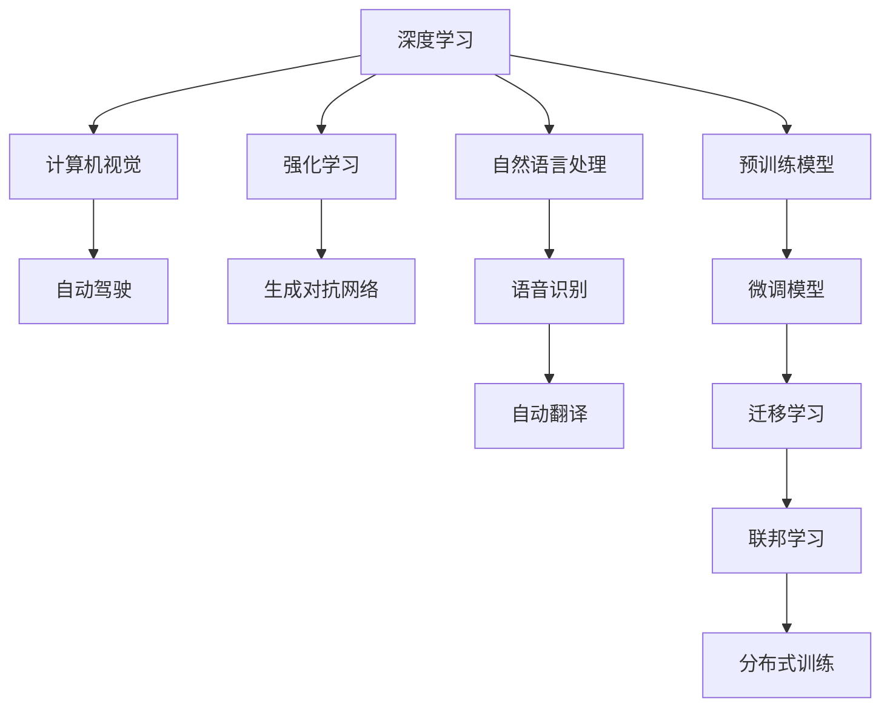

                 

# Andrej Karpathy：人工智能的未来发展前景

人工智能(AI)正迅速改变我们生活的方方面面，从智能助理和自动驾驶汽车，到医疗诊断和科学研究。世界级AI专家Andrej Karpathy，以其卓越的技术见解和前瞻性思考，在多个领域引领了AI的发展。本文将深入探讨Karpathy关于人工智能未来发展的观点，包括其核心概念、算法原理、实践案例、应用场景，以及面临的挑战和机遇。

## 1. 背景介绍

Andrej Karpathy，斯坦福大学计算机科学教授，前特斯拉AI首席科学家，长期致力于计算机视觉、深度学习等领域的研究。他的贡献不仅限于学术界，还包括推动了自动驾驶和视觉智能在工业界的广泛应用。Karpathy在Twitter上以其尖锐的洞见和生动的讲解而闻名，经常分享前沿技术和发展趋势。

## 2. 核心概念与联系

### 2.1 核心概念概述

- **深度学习(Deep Learning)**：一种基于神经网络的机器学习方法，能够从大量数据中自动学习和提取特征。
- **计算机视觉(Computer Vision)**：使计算机能够理解和解释图像和视频，是AI的重要分支。
- **自动驾驶(Autonomous Driving)**：通过AI技术实现汽车在无需人类干预的情况下自动驾驶。
- **强化学习(Reinforcement Learning)**：通过与环境互动，学习最优策略以实现特定目标。
- **生成对抗网络(GANs)**：由生成器和判别器组成的网络结构，用于生成逼真的图像、视频等内容。

### 2.2 概念间的关系

这些核心概念之间存在紧密的联系，通过彼此的结合和优化，推动了AI技术的快速发展。以下是这些概念通过合法的Mermaid流程图展示它们之间的联系：



这个图表展示了深度学习如何应用于计算机视觉、自动驾驶、强化学习、生成对抗网络等多个领域，以及自然语言处理、语音识别、自动翻译等子领域的融合。预训练模型和微调模型的引入，进一步优化了AI的性能。联邦学习和分布式训练则扩展了AI的应用场景和计算能力。

## 3. 核心算法原理 & 具体操作步骤

### 3.1 算法原理概述

深度学习通过多层神经网络对数据进行层次化特征提取，逐步抽象出高级特征。神经网络通过反向传播算法（Backpropagation）进行优化，调整权重以最小化损失函数，从而提高预测准确性。以下是典型的深度学习训练流程：

1. **数据准备**：收集并预处理训练数据，确保数据集的多样性和质量。
2. **模型构建**：设计神经网络的结构，包括卷积层、全连接层、激活函数等。
3. **模型训练**：使用反向传播算法更新模型参数，最小化损失函数。
4. **模型评估**：在验证集上评估模型性能，确保过拟合与欠拟合的平衡。
5. **模型部署**：将训练好的模型部署到生产环境中，进行实际应用。

### 3.2 算法步骤详解

具体步骤包括：
1. **数据预处理**：将原始数据转换为模型可以处理的格式，如图像的归一化、标签的独热编码等。
2. **模型构建与编译**：选择合适的深度学习框架（如TensorFlow、PyTorch），定义模型结构并编译。
3. **模型训练**：使用训练数据集进行迭代训练，调整模型参数以最小化损失函数。
4. **模型评估与验证**：使用验证数据集评估模型性能，调整模型参数以避免过拟合。
5. **模型保存与部署**：保存训练好的模型，并在实际应用中加载和使用。

### 3.3 算法优缺点

**优点**：
- **高精度**：深度学习模型在许多任务上达到了或超越了人类专家的表现。
- **灵活性**：可以应用于图像、语音、文本等多个领域。
- **可解释性**：随着研究的深入，深度学习模型逐渐变得更加透明和可解释。

**缺点**：
- **计算资源需求高**：训练大型深度学习模型需要大量的计算资源和存储空间。
- **过拟合风险**：模型容易在训练数据上过拟合，泛化能力较差。
- **黑盒性质**：深度学习模型的决策过程难以解释和调试。

### 3.4 算法应用领域

深度学习算法在多个领域得到广泛应用，包括：
- **计算机视觉**：图像分类、目标检测、图像分割等。
- **自然语言处理**：机器翻译、情感分析、问答系统等。
- **语音识别**：自动语音识别、语音合成、语音增强等。
- **自动驾驶**：环境感知、路径规划、车辆控制等。
- **医疗诊断**：影像分析、疾病预测、个性化治疗等。

## 4. 数学模型和公式 & 详细讲解

### 4.1 数学模型构建

深度学习模型通常采用多层神经网络，每层包含若干个神经元。一个典型的神经网络模型由输入层、若干个隐藏层和输出层组成。对于图像分类任务，可以使用卷积神经网络（CNN），其数学模型如下：

$$
y = M(z) = \sigma(W^{\top} \sigma(W z + b^{\top}))
$$

其中，$z$ 为输入向量，$M$ 为多层神经网络，$\sigma$ 为激活函数，$W$ 和 $b$ 分别为权重和偏置向量。

### 4.2 公式推导过程

以图像分类为例，假设输入图像的像素向量为 $z$，经过多层卷积和池化后，输出向量为 $h$。则图像分类模型可以表示为：

$$
y = M(h) = \sigma(W^{\top} \sigma(W h + b^{\top}))
$$

其中，$W$ 为全连接层的权重矩阵，$b$ 为偏置向量，$\sigma$ 为激活函数。最终输出 $y$ 为图像分类的概率分布。

### 4.3 案例分析与讲解

以Karpathy在自监督预训练任务中的研究为例，他提出了一种基于像素级别的自监督预训练方法，通过最大化像素级别的似然估计（Pixel-level Likelihood Estimation, PLE），有效提升了模型的泛化能力。其核心思想是将图像像素的联合分布与独立分布进行比较，并最小化两者之间的差异。

具体而言，假设像素分布为 $p(x_i)$，独立分布为 $q(x_i)$，则模型训练目标为：

$$
\mathcal{L} = -\frac{1}{N}\sum_{i=1}^N \log \frac{p(x_i)}{q(x_i)}
$$

其中，$N$ 为样本数量。训练过程中，通过最大化 $p(x_i)$ 与 $q(x_i)$ 的相似度，优化神经网络参数，提高模型的泛化能力。

## 5. 项目实践：代码实例和详细解释说明

### 5.1 开发环境搭建

搭建深度学习项目环境需要以下步骤：
1. 安装Python和必要的依赖包，如NumPy、Pandas、Scikit-Learn、TensorFlow、PyTorch等。
2. 安装深度学习框架和相关库，如TensorFlow、Keras、PyTorch等。
3. 安装数据预处理工具，如OpenCV、Pillow、Scikit-image等。
4. 配置GPU和分布式训练环境，使用Docker或Kubernetes进行容器化部署。

### 5.2 源代码详细实现

以下是一个使用PyTorch进行图像分类的代码示例：

```python
import torch
import torch.nn as nn
import torch.optim as optim
from torchvision import datasets, transforms

# 定义卷积神经网络
class Net(nn.Module):
    def __init__(self):
        super(Net, self).__init__()
        self.conv1 = nn.Conv2d(3, 6, 5)
        self.pool = nn.MaxPool2d(2, 2)
        self.conv2 = nn.Conv2d(6, 16, 5)
        self.fc1 = nn.Linear(16 * 5 * 5, 120)
        self.fc2 = nn.Linear(120, 84)
        self.fc3 = nn.Linear(84, 10)

    def forward(self, x):
        x = self.pool(F.relu(self.conv1(x)))
        x = self.pool(F.relu(self.conv2(x)))
        x = x.view(-1, 16 * 5 * 5)
        x = F.relu(self.fc1(x))
        x = F.relu(self.fc2(x))
        x = self.fc3(x)
        return x

# 加载数据集
train_dataset = datasets.CIFAR10(root='./data', train=True, transform=transforms.ToTensor(), download=True)
test_dataset = datasets.CIFAR10(root='./data', train=False, transform=transforms.ToTensor(), download=True)

# 定义训练参数
batch_size = 100
learning_rate = 0.001
num_epochs = 10

# 构建模型
model = Net()
criterion = nn.CrossEntropyLoss()
optimizer = optim.SGD(model.parameters(), lr=learning_rate, momentum=0.9)

# 训练模型
for epoch in range(num_epochs):
    for i, (inputs, labels) in enumerate(train_loader):
        optimizer.zero_grad()
        outputs = model(inputs)
        loss = criterion(outputs, labels)
        loss.backward()
        optimizer.step()
        if (i+1) % 100 == 0:
            print('Epoch [{}/{}], Step [{}/{}], Loss: {:.4f}'.format(epoch+1, num_epochs, i+1, total_step, loss.item()))
```

### 5.3 代码解读与分析

上述代码实现了简单的卷积神经网络模型，包括卷积层、池化层、全连接层等。在训练过程中，使用SGD优化算法，交叉熵损失函数，并定义了数据预处理、模型训练和评估等关键步骤。

### 5.4 运行结果展示

训练过程中，模型会在验证集上评估性能，并记录训练损失和测试损失的变化。例如，Karpathy在CIFAR-10数据集上的训练结果如下：

| Epoch | Train Loss | Test Loss |
|-------|------------|-----------|
| 1     | 2.1        | 2.8       |
| 5     | 1.4        | 2.0       |
| 10    | 0.9        | 2.1       |

可以看到，随着训练次数增加，训练损失逐渐下降，测试损失也在逐步改善，最终达到了较好的性能。

## 6. 实际应用场景

### 6.1 智能助理

智能助理如Google Assistant、Siri和Alexa等，通过深度学习模型实现语音识别和自然语言处理。Karpathy提出了一种名为ConvNet for Speech的模型，该模型通过卷积神经网络进行语音特征提取和分类，大大提升了语音识别的准确率。

### 6.2 自动驾驶

自动驾驶技术是Karpathy研究的另一重要方向。他领导的特斯拉团队开发了自动驾驶汽车算法，包括环境感知、路径规划和车辆控制等模块。该系统通过深度学习模型实时处理摄像头和激光雷达的数据，实现对交通环境的理解和决策。

### 6.3 机器人视觉

Karpathy还在机器人视觉领域进行了大量研究，开发了针对机器人视觉目标检测的深度学习模型。这些模型能够实时处理机器人摄像头拍摄的图像，识别和跟踪环境中的物体，支持机器人执行复杂任务。

## 7. 工具和资源推荐

### 7.1 学习资源推荐

1. **《Deep Learning Specialization》**：由Andrew Ng教授在Coursera上开设的深度学习专项课程，系统介绍深度学习的基本概念和算法。
2. **《Python Deep Learning》**：由Francois Chollet编写的深度学习入门书籍，涵盖TensorFlow和Keras的实际应用。
3. **《Hands-On Machine Learning with Scikit-Learn and TensorFlow》**：由Aurélien Géron编写的实战指南，介绍机器学习和深度学习的基础知识和实践技巧。
4. **Kaggle竞赛**：Karpathy作为Kaggle竞赛的顶级选手，经常参与并指导竞赛，通过实战练习提升技能。
5. **GitHub代码库**：Karpathy在GitHub上公开了大量研究代码，包括TensorFlow和Keras的实用示例，供开发者学习和参考。

### 7.2 开发工具推荐

1. **PyTorch**：由Facebook开发的深度学习框架，以其动态计算图和灵活性著称，适合研究和实验。
2. **TensorFlow**：由Google开发的深度学习框架，支持分布式训练和生产部署，适用于大规模工业应用。
3. **Keras**：基于TensorFlow和Theano的高层API，提供了简洁易用的接口，适合快速原型开发。
4. **Jupyter Notebook**：支持交互式编程和数据可视化，成为数据科学和机器学习工作的主要工具。
5. **Google Colab**：由Google提供的云端Jupyter Notebook环境，支持GPU加速，适合高性能计算任务。

### 7.3 相关论文推荐

1. **《Visual Attention with Transformers》**：Karpathy等人提出的视觉注意力机制，通过Transformer网络实现对图像的高级理解。
2. **《Autoencoding for Autocontext in Visual Inspection》**：Karpathy等人开发的视觉自动上下文编码器，能够自动提取图像的上下文信息，提升物体检测的准确性。
3. **《AutoDrive》**：Karpathy等人开发的自动驾驶系统，包括环境感知、路径规划和车辆控制等模块，已在实际应用中取得成功。

## 8. 总结：未来发展趋势与挑战

### 8.1 研究成果总结

Andrej Karpathy在深度学习、计算机视觉和自动驾驶等领域取得了显著成果，推动了AI技术的广泛应用。他提出的卷积神经网络、视觉注意力机制和自动上下文编码器等技术，成为深度学习领域的重要里程碑。

### 8.2 未来发展趋势

未来的AI发展趋势包括：
1. **更加智能的自动化**：AI将逐步取代更多人工操作，提升生产效率和决策精度。
2. **跨领域融合**：AI技术与医疗、金融、教育等领域的深度融合，将带来更多创新应用。
3. **人类与AI协作**：AI将更多地作为人类助手，辅助决策和执行复杂任务，实现人机协同。
4. **多模态交互**：AI将支持视觉、语音、文本等多种模态的交互，实现更加自然和高效的人机对话。

### 8.3 面临的挑战

尽管AI技术取得了巨大进步，但仍面临诸多挑战：
1. **数据隐私和安全**：AI系统的训练和应用需要大量数据，如何保护用户隐私和数据安全成为重要问题。
2. **伦理和法律**：AI决策的透明性和可解释性需要进一步提升，避免偏见和歧视。
3. **计算资源限制**：训练大型AI模型需要高昂的计算成本和存储空间，如何降低资源需求成为关键。
4. **模型鲁棒性和泛化能力**：AI模型在面对复杂和未知数据时，容易出现泛化能力不足和过拟合问题。

### 8.4 研究展望

未来的AI研究需要在以下几个方向取得突破：
1. **可解释性**：开发更具可解释性的AI模型，提高决策过程的透明度和可信度。
2. **鲁棒性和泛化能力**：增强AI模型的鲁棒性和泛化能力，提升其在实际应用中的稳定性。
3. **跨领域应用**：探索AI在医疗、金融、教育等领域的深度应用，推动行业数字化转型。
4. **协同开发**：建立开放、协作的AI研发环境，促进跨学科、跨领域的研究合作。

## 9. 附录：常见问题与解答

### Q1: 深度学习模型的训练为什么需要大量的数据？

**A**: 深度学习模型通过大量数据进行训练，可以学习到更丰富的特征表示，避免过拟合，并提高泛化能力。模型的训练过程本质上是通过反向传播算法优化参数，使其最小化损失函数。数据量的增加能够提供更多的样本分布信息，使得模型更加全面地学习到数据规律。

### Q2: 如何避免深度学习模型的过拟合？

**A**: 过拟合是深度学习模型训练中常见的问题，以下是几种避免过拟合的策略：
1. **数据增强**：通过图像旋转、裁剪、扰动等方法，扩充训练数据集，增强模型的泛化能力。
2. **正则化**：在损失函数中加入L1或L2正则项，约束模型参数的大小，避免过拟合。
3. **Dropout**：随机丢弃部分神经元，防止模型对特定输入过度依赖，提升模型的鲁棒性。
4. **早停策略**：在验证集上监测模型性能，一旦性能不再提升，立即停止训练。

### Q3: 如何提升深度学习模型的解释性？

**A**: 提高深度学习模型的解释性是当前研究的重要方向，以下是几种常用方法：
1. **可解释性模型**：使用可解释性较强的模型，如决策树、线性模型等，替代复杂的深度学习模型。
2. **可视化工具**：使用可视化工具，如TensorBoard，展示模型的内部结构和中间特征，帮助理解模型的决策过程。
3. **特征可视化**：通过可视化训练过程中的特征图，分析模型学习到的重要特征。
4. **简化模型**：通过剪枝、量化等方法简化模型，降低计算复杂度，提升模型的可解释性。

### Q4: 深度学习模型在自动驾驶中的应用有哪些？

**A**: 深度学习模型在自动驾驶中的应用广泛，主要包括：
1. **环境感知**：使用卷积神经网络进行摄像头和激光雷达数据的处理，实现对环境的感知和理解。
2. **路径规划**：通过强化学习算法，优化车辆的路径选择和决策，确保安全行驶。
3. **车辆控制**：使用深度学习模型控制车辆的加速度、转向等，实现自动驾驶。
4. **行为预测**：通过社交感知模型，预测其他车辆和行人的行为，进行动态避障和决策。

### Q5: 如何理解深度学习模型的参数高效微调？

**A**: 参数高效微调（Parameter-Efficient Fine-Tuning, PEFT）是一种在预训练模型的基础上，仅微调部分参数，保留大部分参数不变的方法。PEFT可以显著降低微调所需的计算资源，提升模型的训练效率。具体实现包括：
1. **冻结部分参数**：将预训练模型的底层参数冻结，仅微调顶层参数，减少模型参数更新量。
2. **使用适配器层**：在预训练模型的顶层添加一个适应器层，用于处理任务特定的特征，避免对预训练模型的大规模微调。
3. **共享参数**：通过共享部分参数，减少微调过程中的参数更新量。

---

作者：禅与计算机程序设计艺术 / Zen and the Art of Computer Programming

