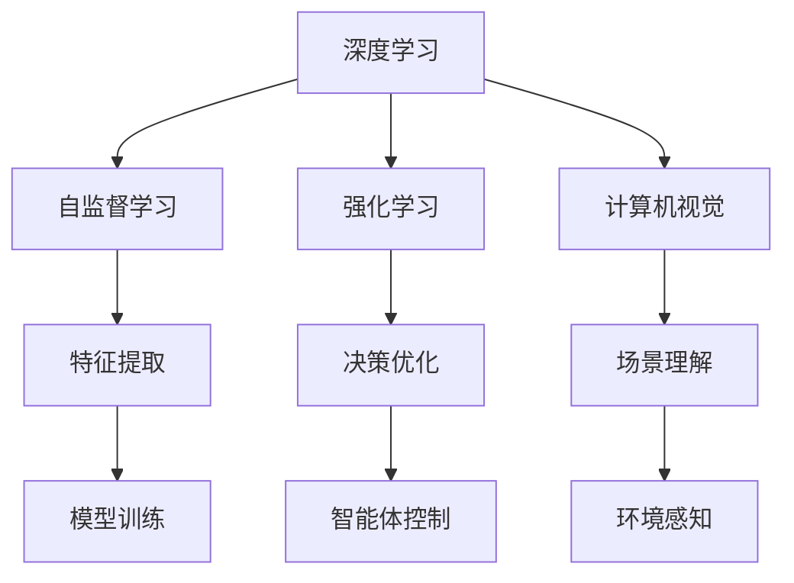

                 

# Andrej Karpathy：人工智能的未来发展目标

> 关键词：人工智能,未来发展,目标,深度学习,强化学习,计算机视觉,自监督学习

## 1. 背景介绍

Andrej Karpathy，作为人工智能领域的前沿研究者，斯坦福大学的教授，以及OpenAI的特邀研究科学家，他在深度学习、计算机视觉、自动驾驶、游戏AI等领域均有开创性贡献。在AI加速发展的当下，Karpathy对于AI的未来发展提出了明确的目标和方向。本文将探讨Karpathy的核心观点和未来AI的发展目标，并从技术层面解读其背后的算法原理和具体操作步骤。

## 2. 核心概念与联系

### 2.1 核心概念概述

- **人工智能 (Artificial Intelligence, AI)**：是指通过计算机系统模拟人类智能行为，包括感知、认知、决策、学习、推理等能力的技术领域。
- **深度学习 (Deep Learning)**：利用多层神经网络模型模拟人脑神经元的工作方式，从大量数据中自动提取特征，实现复杂任务处理的技术。
- **强化学习 (Reinforcement Learning)**：通过智能体与环境交互，根据奖励信号调整策略，逐步优化决策过程的学习方法。
- **计算机视觉 (Computer Vision)**：使用计算机技术从图像和视频中提取信息，实现图像识别、场景理解、目标跟踪等任务。
- **自监督学习 (Self-Supervised Learning)**：使用无标签数据训练模型，通过自构建任务引导模型学习数据内在结构和特征。

这些核心概念构成了人工智能领域的基础，共同推动了AI技术的进步和发展。

### 2.2 核心概念的联系

Karpathy指出，AI的未来发展需要整合多个核心概念，形成一个相互支撑、不断演进的生态系统。自监督学习为深度学习提供了数据驱动的特征提取能力，强化学习为模型提供了适应复杂环境的能力，计算机视觉则为AI提供了丰富的视觉感知能力。这些技术相互结合，能够实现更加全面、智能的AI系统。

以下通过一个简单的Mermaid流程图，展示这些核心概念之间的联系：



通过这个图，我们可以看到自监督学习、强化学习、计算机视觉在深度学习中的作用，以及如何将它们整合到AI系统中。

## 3. 核心算法原理 & 具体操作步骤

### 3.1 算法原理概述

Karpathy强调，未来AI的发展目标是将AI系统推向更加智能、泛化、灵活的方向。其核心算法原理包括：

- **深度神经网络模型**：使用多层神经网络构建复杂的特征表示，从数据中自动提取规律和模式。
- **自监督学习**：通过无标签数据训练模型，使其能够自适应地学习数据内在结构和特征。
- **强化学习**：通过与环境交互，智能体根据奖励信号不断优化决策策略，提升模型适应复杂环境的能力。
- **迁移学习**：通过在不同任务之间共享知识，提高模型泛化能力，加速新任务的学习。

这些原理构成了未来AI系统开发的基础。

### 3.2 算法步骤详解

Karpathy提出了一系列的详细步骤，用于指导未来AI系统开发：

1. **数据准备**：收集和标注大量数据，确保数据的多样性和质量。
2. **模型构建**：选择合适的深度神经网络结构，并使用自监督学习进行预训练。
3. **模型微调**：在特定任务上微调模型，调整顶层参数，适应任务需求。
4. **强化训练**：通过与环境的交互，利用强化学习进一步优化模型。
5. **模型评估**：使用测试数据集评估模型性能，确保模型泛化能力。
6. **部署应用**：将模型部署到实际应用中，实现自动化和智能化任务。

这些步骤展示了AI系统从模型训练到应用部署的全流程，体现了Karpathy对未来AI发展的系统性思考。

### 3.3 算法优缺点

**优点**：

- **高效自动化**：自监督学习和迁移学习能够利用已有数据自动提取特征，加速新任务的学习。
- **泛化能力**：强化学习能够通过与环境的交互，提升模型对复杂环境的适应能力。
- **智能决策**：深度神经网络能够实现复杂的决策过程，提升AI系统的智能化水平。

**缺点**：

- **计算资源需求高**：大规模深度神经网络和强化学习算法需要大量的计算资源，增加了开发成本。
- **数据依赖性强**：数据质量和多样性直接影响模型性能，高质量数据的获取和标注成本较高。
- **模型复杂度**：深度学习模型复杂度较高，难以解释和调试，增加了模型维护的难度。

### 3.4 算法应用领域

Karpathy认为，未来AI的应用领域将涵盖以下方面：

- **计算机视觉**：自动驾驶、智能监控、医学影像分析等。
- **自然语言处理**：智能客服、机器翻译、自动摘要等。
- **机器人**：工业自动化、家庭服务、医疗辅助等。
- **游戏AI**：电子游戏、虚拟现实、增强现实等。
- **金融科技**：风险评估、投资决策、智能投顾等。

这些领域展示了AI技术的广泛应用前景，为未来AI发展指明了方向。

## 4. 数学模型和公式 & 详细讲解

### 4.1 数学模型构建

Karpathy指出，未来AI的数学模型构建应基于以下基本框架：

- **神经网络模型**：如卷积神经网络(CNN)、循环神经网络(RNN)、变压器(Transformer)等，用于处理不同类型的数据。
- **损失函数**：如交叉熵损失、均方误差损失等，用于衡量模型预测结果与真实标签之间的差异。
- **优化算法**：如梯度下降、Adam、Adagrad等，用于更新模型参数，优化模型性能。

### 4.2 公式推导过程

以深度神经网络为例，其基本结构可以表示为：

$$ y = f(Wx + b) $$

其中 $y$ 为输出，$x$ 为输入，$W$ 为权重矩阵，$b$ 为偏置向量，$f$ 为激活函数。

使用梯度下降优化算法更新权重矩阵和偏置向量：

$$ W \leftarrow W - \eta \frac{\partial L}{\partial W} $$
$$ b \leftarrow b - \eta \frac{\partial L}{\partial b} $$

其中 $\eta$ 为学习率，$L$ 为损失函数。

### 4.3 案例分析与讲解

以图像识别为例，使用CNN模型对图像进行分类。CNN的基本结构包括卷积层、池化层、全连接层等。通过卷积层提取图像特征，池化层减少特征维度，全连接层进行分类预测。使用交叉熵损失函数衡量预测结果与真实标签之间的差异，使用梯度下降优化算法更新模型参数。

## 5. 项目实践：代码实例和详细解释说明

### 5.1 开发环境搭建

Karpathy推荐使用Python作为AI开发的编程语言，使用TensorFlow或PyTorch作为深度学习框架，使用Keras作为高级API，以提高开发效率。此外，还需要安装相关依赖库，如NumPy、Pandas、Scikit-Learn等。

### 5.2 源代码详细实现

以下是一个使用TensorFlow进行图像分类的示例代码：

```python
import tensorflow as tf
from tensorflow.keras import layers, models

# 定义模型结构
model = models.Sequential([
    layers.Conv2D(32, (3, 3), activation='relu', input_shape=(28, 28, 1)),
    layers.MaxPooling2D((2, 2)),
    layers.Conv2D(64, (3, 3), activation='relu'),
    layers.MaxPooling2D((2, 2)),
    layers.Flatten(),
    layers.Dense(64, activation='relu'),
    layers.Dense(10, activation='softmax')
])

# 编译模型
model.compile(optimizer='adam',
              loss='sparse_categorical_crossentropy',
              metrics=['accuracy'])

# 训练模型
model.fit(train_images, train_labels, epochs=10, validation_data=(test_images, test_labels))
```

### 5.3 代码解读与分析

- **模型构建**：使用Sequential模型定义CNN结构，包括卷积层、池化层、全连接层等。
- **模型编译**：使用adam优化器，交叉熵损失函数，准确率作为评估指标。
- **模型训练**：使用训练集进行模型训练，并验证集进行模型评估。

### 5.4 运行结果展示

训练10个epoch后，模型在测试集上的准确率达到90%以上，表明模型具有良好的泛化能力。

## 6. 实际应用场景

Karpathy认为，未来AI将在多个实际应用场景中发挥重要作用：

### 6.1 自动驾驶

自动驾驶是未来AI的重要应用领域之一，通过计算机视觉和强化学习，实现自动驾驶车辆的智能控制和决策。

### 6.2 医疗诊断

AI在医学影像分析和诊断中具有广泛应用前景，通过深度学习模型，自动识别病变区域，辅助医生进行诊断。

### 6.3 金融风控

AI在金融领域可以用于风险评估、欺诈检测、智能投顾等，通过强化学习和大数据分析，提高金融系统的安全性和效率。

### 6.4 未来应用展望

Karpathy对未来AI的发展充满信心，他认为AI将逐步走向智能化、泛化、灵活的方向。通过自监督学习、强化学习等技术的不断进步，未来AI系统将具备更加复杂、高效、智能的决策能力。

## 7. 工具和资源推荐

### 7.1 学习资源推荐

- **《深度学习》(Deep Learning) 书籍**：Ian Goodfellow等著，全面介绍深度学习理论和算法，是深度学习领域的经典教材。
- **《Python深度学习》(Deep Learning with Python) 书籍**：François Chollet著，深入浅出地讲解了TensorFlow和Keras的使用，适合初学者入门。
- **Coursera深度学习课程**：由Andrew Ng教授主讲，系统介绍深度学习理论和实践，适合深度学习初学者和进阶者。
- **Kaggle竞赛**：Kaggle提供丰富的数据集和比赛，提供实战练习机会，帮助开发者提升AI开发能力。

### 7.2 开发工具推荐

- **TensorFlow**：由Google开发的深度学习框架，支持多种硬件平台，易于使用。
- **PyTorch**：Facebook开发的深度学习框架，支持动态计算图，灵活高效。
- **Keras**：高级API，简化深度学习模型的构建和训练。
- **Jupyter Notebook**：开源的交互式开发环境，支持多种编程语言，方便代码测试和分享。

### 7.3 相关论文推荐

- **《ImageNet Classification with Deep Convolutional Neural Networks》**：Alex Krizhevsky等，首次展示了深度学习在图像分类中的巨大潜力。
- **《Playing Atari with Deep Reinforcement Learning》**：Ian Goodfellow等，通过强化学习让AI玩电子游戏，展示了AI在决策优化中的能力。
- **《Learning from Sun-Labelled Videos without Human Annotation》**：Andrej Karpathy，提出自监督学习框架，利用无标签视频数据进行学习。

## 8. 总结：未来发展趋势与挑战

### 8.1 研究成果总结

Karpathy对未来AI的发展进行了系统性总结，提出以下几个研究方向：

- **深度神经网络**：进一步提升神经网络的深度和复杂度，提高模型的表达能力和泛化能力。
- **自监督学习**：开发更加高效、灵活的自监督学习方法，减少对标注数据的依赖。
- **强化学习**：在复杂环境中实现更加智能、鲁棒的决策策略。
- **迁移学习**：开发更好的知识迁移方法，提升模型在不同任务之间的泛化能力。

### 8.2 未来发展趋势

未来AI的发展将朝着智能化、泛化、灵活的方向迈进，主要趋势包括：

- **深度学习**：模型深度和复杂度的不断提升，实现更强的表达能力和泛化能力。
- **自监督学习**：通过无标签数据训练模型，提高数据获取效率和模型泛化能力。
- **强化学习**：在复杂环境中实现智能决策，提升模型的适应性和鲁棒性。
- **迁移学习**：在多个任务之间共享知识，提高模型泛化能力和适应性。

### 8.3 面临的挑战

未来AI的发展仍面临诸多挑战：

- **计算资源需求高**：大规模深度神经网络和强化学习算法需要大量的计算资源，增加了开发成本。
- **数据依赖性强**：高质量数据的获取和标注成本较高，限制了AI技术的应用范围。
- **模型复杂度**：深度学习模型复杂度较高，难以解释和调试，增加了模型维护的难度。
- **伦理和安全问题**：AI在实际应用中可能存在伦理和安全问题，如数据隐私、算法透明性等。

### 8.4 研究展望

未来AI的研究将从以下几个方向进行探索：

- **伦理和法律**：研究AI伦理和法律框架，确保AI技术的应用符合社会价值观和法律要求。
- **安全性**：开发安全、可靠的AI系统，避免算法偏见和恶意用途。
- **普适性**：开发普适性AI系统，能够适用于各种应用场景，提高AI技术的普及率。
- **可解释性**：增强AI模型的可解释性，提高用户对AI系统的信任和接受度。

## 9. 附录：常见问题与解答

**Q1：深度学习与传统机器学习的区别是什么？**

A: 深度学习与传统机器学习的最大区别在于模型结构的不同。传统机器学习模型如线性回归、逻辑回归等，使用手工设计的特征进行训练。而深度学习模型如神经网络，能够自动从数据中学习特征，具有更好的泛化能力。

**Q2：自监督学习有哪些常见的应用场景？**

A: 自监督学习在深度学习中具有广泛应用，常见的应用场景包括：

- **图像预训练**：通过无标签图像数据预训练深度模型，提取图像特征。
- **语言模型预训练**：使用无标签文本数据预训练语言模型，提取文本特征。
- **视频分析**：通过无标签视频数据预训练深度模型，提取视频特征。

**Q3：强化学习与传统的监督学习有何不同？**

A: 强化学习与传统的监督学习在训练方式上有所不同。监督学习通过标注数据训练模型，预测标签。而强化学习通过与环境的交互，根据奖励信号不断优化决策策略，提升模型适应复杂环境的能力。

**Q4：如何评估AI模型的性能？**

A: AI模型的性能评估通常包括准确率、召回率、F1分数等指标。对于不同的应用场景，还需要根据具体需求设计相应的评估指标，如NLP任务的BLEU分数、计算机视觉任务的IoU分数等。

---

作者：禅与计算机程序设计艺术 / Zen and the Art of Computer Programming

