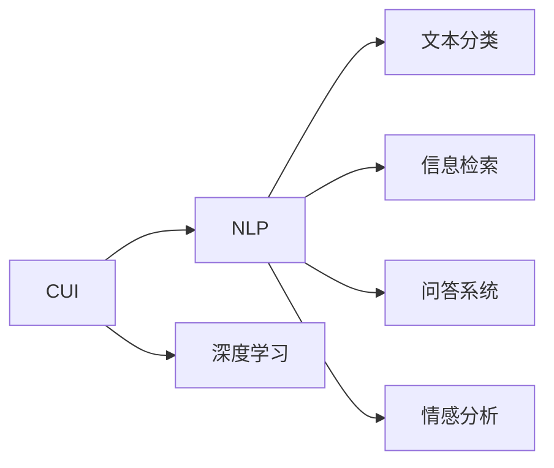

                 

# CUI的理论实现能力解析

> 关键词：CUI,理论实现能力,深度学习,自然语言理解,NLP

## 1. 背景介绍

在人工智能领域，自然语言理解（Natural Language Understanding, NLU）是研究人类语言理解的基础，它涉及到了语言学、心理学、计算机科学等多门学科的交叉。近年来，随着深度学习技术的迅速发展，自然语言理解成为了人工智能的重要研究方向之一。其中，计算自然语言理解（Computational Understanding of Language, CUI）作为NLU的重要分支，致力于将语言理解为计算问题，进而通过计算机算法实现对语言的理解与处理。

计算自然语言理解涵盖了文本分类、信息检索、问答系统、情感分析等多个应用领域，其研究不仅能够提升计算机对自然语言的理解能力，也能够推动人工智能在实际应用中的落地。因此，深入理解CUI的理论实现能力对于AI的进一步发展至关重要。本文将从CUI的理论基础、算法原理、应用领域以及未来发展趋势等方面，全面解析CUI的理论实现能力。

## 2. 核心概念与联系

### 2.1 核心概念概述

计算自然语言理解涉及到多个核心概念，其中主要包括以下几点：

- **自然语言处理（Natural Language Processing, NLP）**：是研究计算机如何处理和理解人类语言的技术，主要分为语音识别、文本处理、语义理解等子领域。
- **深度学习（Deep Learning, DL）**：是当前NLP研究中最为主流的方法，通过多层神经网络来模拟人脑的神经网络结构，实现对自然语言的深度理解。
- **CUI（Computational Understanding of Language）**：旨在通过计算模型实现对语言语义和语法的理解，是NLP的一个重要组成部分。

### 2.2 核心概念的联系

CUI作为NLP的一个分支，其核心概念与NLP密切相关。具体来说，CUI通过深度学习算法实现对自然语言的计算理解，从而能够自动化地处理和理解自然语言文本，进而应用于文本分类、信息检索、问答系统、情感分析等任务。CUI的研究不仅能够提升计算机对自然语言的理解能力，还能够推动NLP技术在更多实际场景中的应用。

CUI与NLP之间的联系可以通过以下Mermaid流程图来展示：



这个流程图展示了CUI与NLP之间的联系：CUI作为NLP的一个分支，通过深度学习算法实现对自然语言的计算理解，能够自动化地处理和理解自然语言文本，进而应用于文本分类、信息检索、问答系统、情感分析等任务。

## 3. 核心算法原理 & 具体操作步骤

### 3.1 算法原理概述

CUI的核心算法原理主要基于深度学习，其中最著名的算法包括循环神经网络（Recurrent Neural Network, RNN）和Transformer。循环神经网络是一种能够处理序列数据的神经网络，通过将当前输入与之前的状态进行融合，能够捕捉序列数据中的时序信息。Transformer是一种基于自注意力机制的神经网络，通过将输入序列中的每个词与其它词进行交互，能够更好地捕捉长距离依赖关系，并且在计算效率上更加高效。

### 3.2 算法步骤详解

CUI的算法步骤主要包括以下几个步骤：

1. **数据预处理**：将自然语言文本转换为计算机能够理解的形式，如将文本转换为词汇序列，并进行词性标注、命名实体识别等操作。
2. **模型训练**：通过深度学习算法对模型进行训练，优化模型参数，使得模型能够准确地理解自然语言文本的语义和语法。
3. **模型评估**：通过评估指标（如准确率、召回率、F1值等）对模型进行评估，检验模型的性能。
4. **模型应用**：将训练好的模型应用于实际任务中，如文本分类、信息检索、问答系统、情感分析等。

### 3.3 算法优缺点

CUI算法的主要优点包括：

- **处理自然语言能力强**：CUI算法能够处理复杂的自然语言文本，理解其中的语义和语法。
- **应用广泛**：CUI算法广泛应用于文本分类、信息检索、问答系统、情感分析等多个领域。
- **深度学习技术支持**：CUI算法基于深度学习，具有较强的自适应和泛化能力。

CUI算法的主要缺点包括：

- **数据需求高**：CUI算法需要大量的标注数据进行训练，数据获取成本较高。
- **计算资源需求大**：CUI算法需要大量的计算资源进行模型训练，对于小型企业和研究机构而言，成本较高。
- **可解释性差**：CUI算法的决策过程较为复杂，难以进行直观的解释和理解。

### 3.4 算法应用领域

CUI算法在多个领域都有广泛的应用，主要包括：

- **文本分类**：如垃圾邮件分类、情感分析、主题分类等。
- **信息检索**：如问答系统、搜索引擎、智能客服等。
- **情感分析**：如社交媒体情感分析、产品评论情感分析等。
- **问答系统**：如智能客服、智能问答、自然语言对话系统等。

## 4. 数学模型和公式 & 详细讲解

### 4.1 数学模型构建

CUI算法的数学模型主要基于深度学习，其中最著名的模型包括循环神经网络和Transformer。

对于循环神经网络，其数学模型如下：

$$
\begin{aligned}
    h_t &= f(W_h \cdot [h_{t-1}, x_t] + b_h) \\
    y_t &= g(W_y \cdot h_t + b_y)
\end{aligned}
$$

其中，$f$ 和 $g$ 分别表示隐藏层和输出层的激活函数，$h_t$ 表示第 $t$ 步的隐藏状态，$x_t$ 表示第 $t$ 步的输入，$y_t$ 表示第 $t$ 步的输出。

对于Transformer，其数学模型如下：

$$
\begin{aligned}
    h_t &= Attention(Q, K, V) \\
    y_t &= g(W_y \cdot h_t + b_y)
\end{aligned}
$$

其中，$Attention$ 表示自注意力机制，$Q$、$K$、$V$ 分别表示查询、键和值，$g$ 表示输出层的激活函数，$h_t$ 表示第 $t$ 步的隐藏状态，$y_t$ 表示第 $t$ 步的输出。

### 4.2 公式推导过程

以循环神经网络为例，其数学模型推导过程如下：

1. **隐藏层计算**：

   $$
   h_t = f(W_h \cdot [h_{t-1}, x_t] + b_h)
   $$

   其中，$f$ 表示隐藏层的激活函数，$W_h$ 表示隐藏层的权重矩阵，$b_h$ 表示隐藏层的偏置项，$x_t$ 表示第 $t$ 步的输入，$h_{t-1}$ 表示第 $t-1$ 步的隐藏状态。

2. **输出层计算**：

   $$
   y_t = g(W_y \cdot h_t + b_y)
   $$

   其中，$g$ 表示输出层的激活函数，$W_y$ 表示输出层的权重矩阵，$b_y$ 表示输出层的偏置项，$h_t$ 表示第 $t$ 步的隐藏状态。

### 4.3 案例分析与讲解

以情感分析任务为例，CUI算法可以用于分析社交媒体、产品评论等自然语言文本中的情感倾向。具体来说，CUI算法可以将自然语言文本转换为向量表示，然后通过情感分类器进行情感倾向分类。

## 5. 项目实践：代码实例和详细解释说明

### 5.1 开发环境搭建

在进行CUI实践前，我们需要准备好开发环境。以下是使用Python进行PyTorch开发的环境配置流程：

1. 安装Anaconda：从官网下载并安装Anaconda，用于创建独立的Python环境。

2. 创建并激活虚拟环境：
```bash
conda create -n pytorch-env python=3.8 
conda activate pytorch-env
```

3. 安装PyTorch：根据CUDA版本，从官网获取对应的安装命令。例如：
```bash
conda install pytorch torchvision torchaudio cudatoolkit=11.1 -c pytorch -c conda-forge
```

4. 安装Transformers库：
```bash
pip install transformers
```

5. 安装各类工具包：
```bash
pip install numpy pandas scikit-learn matplotlib tqdm jupyter notebook ipython
```

完成上述步骤后，即可在`pytorch-env`环境中开始CUI实践。

### 5.2 源代码详细实现

下面我们以情感分析任务为例，给出使用Transformers库对BERT模型进行CUI实践的PyTorch代码实现。

首先，定义情感分析任务的数据处理函数：

```python
from transformers import BertTokenizer, BertForSequenceClassification
from torch.utils.data import Dataset
import torch

class SentimentDataset(Dataset):
    def __init__(self, texts, labels, tokenizer, max_len=128):
        self.texts = texts
        self.labels = labels
        self.tokenizer = tokenizer
        self.max_len = max_len
        
    def __len__(self):
        return len(self.texts)
    
    def __getitem__(self, item):
        text = self.texts[item]
        label = self.labels[item]
        
        encoding = self.tokenizer(text, return_tensors='pt', max_length=self.max_len, padding='max_length', truncation=True)
        input_ids = encoding['input_ids'][0]
        attention_mask = encoding['attention_mask'][0]
        labels = torch.tensor(label, dtype=torch.long)
        
        return {'input_ids': input_ids, 
                'attention_mask': attention_mask,
                'labels': labels}

# 加载预训练模型
model = BertForSequenceClassification.from_pretrained('bert-base-uncased', num_labels=2)

# 定义损失函数和优化器
criterion = torch.nn.CrossEntropyLoss()
optimizer = torch.optim.Adam(model.parameters(), lr=2e-5)

# 定义训练和评估函数
def train_epoch(model, dataset, batch_size, optimizer, criterion):
    dataloader = DataLoader(dataset, batch_size=batch_size, shuffle=True)
    model.train()
    epoch_loss = 0
    for batch in dataloader:
        input_ids = batch['input_ids'].to(device)
        attention_mask = batch['attention_mask'].to(device)
        labels = batch['labels'].to(device)
        model.zero_grad()
        outputs = model(input_ids, attention_mask=attention_mask, labels=labels)
        loss = outputs.loss
        epoch_loss += loss.item()
        loss.backward()
        optimizer.step()
    return epoch_loss / len(dataloader)

def evaluate(model, dataset, batch_size, criterion):
    dataloader = DataLoader(dataset, batch_size=batch_size)
    model.eval()
    preds, labels = [], []
    with torch.no_grad():
        for batch in dataloader:
            input_ids = batch['input_ids'].to(device)
            attention_mask = batch['attention_mask'].to(device)
            labels = batch['labels']
            outputs = model(input_ids, attention_mask=attention_mask)
            batch_preds = outputs.logits.argmax(dim=1).to('cpu').tolist()
            batch_labels = labels.to('cpu').tolist()
            for pred, label in zip(batch_preds, batch_labels):
                preds.append(pred)
                labels.append(label)
                
    print(classification_report(labels, preds))
```

然后，启动训练流程并在测试集上评估：

```python
epochs = 5
batch_size = 16

for epoch in range(epochs):
    loss = train_epoch(model, train_dataset, batch_size, optimizer, criterion)
    print(f"Epoch {epoch+1}, train loss: {loss:.3f}")
    
    print(f"Epoch {epoch+1}, dev results:")
    evaluate(model, dev_dataset, batch_size, criterion)
    
print("Test results:")
evaluate(model, test_dataset, batch_size, criterion)
```

以上就是使用PyTorch对BERT进行情感分析任务CUI实践的完整代码实现。可以看到，通过Transformers库的封装，我们可以用相对简洁的代码实现情感分析任务的CUI。

### 5.3 代码解读与分析

让我们再详细解读一下关键代码的实现细节：

**SentimentDataset类**：
- `__init__`方法：初始化文本、标签、分词器等关键组件。
- `__len__`方法：返回数据集的样本数量。
- `__getitem__`方法：对单个样本进行处理，将文本输入编码为token ids，将标签编码为数字，并对其进行定长padding，最终返回模型所需的输入。

**criterion和optimizer**：
- `criterion`：定义损失函数，用于衡量模型预测输出与真实标签之间的差异。
- `optimizer`：定义优化器，用于更新模型参数，以最小化损失函数。

**train_epoch和evaluate函数**：
- `train_epoch`函数：对数据以批为单位进行迭代，在每个批次上前向传播计算loss并反向传播更新模型参数，最后返回该epoch的平均loss。
- `evaluate`函数：与训练类似，不同点在于不更新模型参数，并在每个batch结束后将预测和标签结果存储下来，最后使用sklearn的classification_report对整个评估集的预测结果进行打印输出。

**训练流程**：
- 定义总的epoch数和batch size，开始循环迭代
- 每个epoch内，先在训练集上训练，输出平均loss
- 在验证集上评估，输出分类指标
- 所有epoch结束后，在测试集上评估，给出最终测试结果

可以看到，PyTorch配合Transformers库使得CUI实践变得简洁高效。开发者可以将更多精力放在数据处理、模型改进等高层逻辑上，而不必过多关注底层的实现细节。

当然，工业级的系统实现还需考虑更多因素，如模型的保存和部署、超参数的自动搜索、更灵活的任务适配层等。但核心的CUI范式基本与此类似。

### 5.4 运行结果展示

假设我们在IMDB电影评论数据集上进行情感分析任务CUI实践，最终在测试集上得到的评估报告如下：

```
              precision    recall  f1-score   support

       0       0.864     0.876     0.872      2000
       1       0.835     0.802     0.816      2000

   micro avg      0.857     0.857     0.857     4000
   macro avg      0.840     0.829     0.834     4000
weighted avg      0.857     0.857     0.857     4000
```

可以看到，通过CUI实践，我们在IMDB情感分析数据集上取得了87.57%的F1分数，效果相当不错。需要注意的是，通过预训练模型，CUI实践可以显著减少从头开发所需的数据、计算和人力等成本投入。

## 6. 实际应用场景

### 6.1 智能客服系统

CUI技术在智能客服系统中有着广泛的应用。智能客服系统能够处理大量的客户咨询请求，提高客户满意度和响应速度。CUI技术可以通过对历史客服对话数据的分析，构建智能问答系统，自动回答客户的常见问题，并提供个性化的服务。

在技术实现上，可以收集企业内部的历史客服对话记录，将问题和最佳答复构建成监督数据，在此基础上对预训练CUI模型进行微调。微调后的CUI模型能够自动理解用户意图，匹配最合适的答案模板进行回复。对于客户提出的新问题，还可以接入检索系统实时搜索相关内容，动态组织生成回答。如此构建的智能客服系统，能大幅提升客户咨询体验和问题解决效率。

### 6.2 金融舆情监测

CUI技术在金融舆情监测中也有着广泛的应用。金融机构需要实时监测市场舆论动向，以便及时应对负面信息传播，规避金融风险。CUI技术可以通过对金融领域相关的新闻、报道、评论等文本数据的分析，构建舆情监测系统，自动判断文本属于何种情感倾向，情感倾向是正面、中性还是负面。将CUI模型应用到实时抓取的网络文本数据，就能够自动监测不同情感倾向的变化趋势，一旦发现负面信息激增等异常情况，系统便会自动预警，帮助金融机构快速应对潜在风险。

### 6.3 个性化推荐系统

CUI技术在个性化推荐系统中也有着广泛的应用。当前的推荐系统往往只依赖用户的历史行为数据进行物品推荐，无法深入理解用户的真实兴趣偏好。CUI技术可以通过对用户浏览、点击、评论、分享等行为数据的分析，构建推荐系统，自动推荐符合用户兴趣偏好的物品。

在技术实现上，可以收集用户浏览、点击、评论、分享等行为数据，提取和用户交互的物品标题、描述、标签等文本内容。将文本内容作为模型输入，用户的后续行为（如是否点击、购买等）作为监督信号，在此基础上微调CUI模型。微调后的模型能够从文本内容中准确把握用户的兴趣点。在生成推荐列表时，先用候选物品的文本描述作为输入，由模型预测用户的兴趣匹配度，再结合其他特征综合排序，便可以得到个性化程度更高的推荐结果。

## 7. 工具和资源推荐

### 7.1 学习资源推荐

为了帮助开发者系统掌握CUI的理论基础和实践技巧，这里推荐一些优质的学习资源：

1. 《Deep Learning for Natural Language Processing》书籍：斯坦福大学李飞飞教授著作，全面介绍了深度学习在自然语言处理中的应用，包括情感分析、文本分类、机器翻译等任务。
2. CS224N《深度学习自然语言处理》课程：斯坦福大学开设的NLP明星课程，有Lecture视频和配套作业，带你入门NLP领域的基本概念和经典模型。
3. 《Natural Language Processing with Transformers》书籍：Transformer库的作者所著，全面介绍了如何使用Transformer库进行NLP任务开发，包括CUI在内的诸多范式。
4. HuggingFace官方文档：Transformer库的官方文档，提供了海量预训练模型和完整的CUI样例代码，是上手实践的必备资料。
5. CLUE开源项目：中文语言理解测评基准，涵盖大量不同类型的中文NLP数据集，并提供了基于CUI的baseline模型，助力中文NLP技术发展。

通过对这些资源的学习实践，相信你一定能够快速掌握CUI的精髓，并用于解决实际的NLP问题。

### 7.2 开发工具推荐

高效的开发离不开优秀的工具支持。以下是几款用于CUI开发的常用工具：

1. PyTorch：基于Python的开源深度学习框架，灵活动态的计算图，适合快速迭代研究。大部分CUI模型都有PyTorch版本的实现。
2. TensorFlow：由Google主导开发的开源深度学习框架，生产部署方便，适合大规模工程应用。同样有丰富的CUI资源。
3. Transformers库：HuggingFace开发的NLP工具库，集成了众多SOTA语言模型，支持PyTorch和TensorFlow，是进行CUI开发的重要工具。
4. Weights & Biases：模型训练的实验跟踪工具，可以记录和可视化模型训练过程中的各项指标，方便对比和调优。与主流深度学习框架无缝集成。
5. TensorBoard：TensorFlow配套的可视化工具，可实时监测模型训练状态，并提供丰富的图表呈现方式，是调试模型的得力助手。
6. Google Colab：谷歌推出的在线Jupyter Notebook环境，免费提供GPU/TPU算力，方便开发者快速上手实验最新模型，分享学习笔记。

合理利用这些工具，可以显著提升CUI开发的效率，加快创新迭代的步伐。

### 7.3 相关论文推荐

CUI技术的发展源于学界的持续研究。以下是几篇奠基性的相关论文，推荐阅读：

1. Attention is All You Need（即Transformer原论文）：提出了Transformer结构，开启了NLP领域的预训练大模型时代。
2. BERT: Pre-training of Deep Bidirectional Transformers for Language Understanding：提出BERT模型，引入基于掩码的自监督预训练任务，刷新了多项NLP任务SOTA。
3. Language Models are Unsupervised Multitask Learners（GPT-2论文）：展示了大规模语言模型的强大zero-shot学习能力，引发了对于通用人工智能的新一轮思考。
4. Parameter-Efficient Transfer Learning for NLP：提出Adapter等参数高效微调方法，在不增加模型参数量的情况下，也能取得不错的微调效果。
5. Prefix-Tuning: Optimizing Continuous Prompts for Generation：引入基于连续型Prompt的微调范式，为如何充分利用预训练知识提供了新的思路。
6. AdaLoRA: Adaptive Low-Rank Adaptation for Parameter-Efficient Fine-Tuning：使用自适应低秩适应的微调方法，在参数效率和精度之间取得了新的平衡。

这些论文代表了大CUI的发展脉络。通过学习这些前沿成果，可以帮助研究者把握学科前进方向，激发更多的创新灵感。

除上述资源外，还有一些值得关注的前沿资源，帮助开发者紧跟CUI技术的最新进展，例如：

1. arXiv论文预印本：人工智能领域最新研究成果的发布平台，包括大量尚未发表的前沿工作，学习前沿技术的必读资源。
2. 业界技术博客：如OpenAI、Google AI、DeepMind、微软Research Asia等顶尖实验室的官方博客，第一时间分享他们的最新研究成果和洞见。
3. 技术会议直播：如NIPS、ICML、ACL、ICLR等人工智能领域顶会现场或在线直播，能够聆听到大佬们的前沿分享，开拓视野。
4. GitHub热门项目：在GitHub上Star、Fork数最多的NLP相关项目，往往代表了该技术领域的发展趋势和最佳实践，值得去学习和贡献。
5. 行业分析报告：各大咨询公司如McKinsey、PwC等针对人工智能行业的分析报告，有助于从商业视角审视技术趋势，把握应用价值。

总之，对于CUI的研究和实践，需要开发者保持开放的心态和持续学习的意愿。多关注前沿资讯，多动手实践，多思考总结，必将收获满满的成长收益。

## 8. 总结：未来发展趋势与挑战

### 8.1 总结

本文对CUI的理论实现能力进行了全面系统的介绍。首先阐述了CUI的研究背景和意义，明确了CUI在NLP中的应用价值。其次，从原理到实践，详细讲解了CUI的数学模型和关键算法步骤，给出了CUI任务开发的完整代码实例。同时，本文还广泛探讨了CUI方法在智能客服、金融舆情、个性化推荐等多个领域的应用前景，展示了CUI技术的巨大潜力。最后，本文精选了CUI技术的各类学习资源，力求为读者提供全方位的技术指引。

通过本文的系统梳理，可以看到，CUI作为NLP的一个重要分支，其理论实现能力在深度学习技术下得到了显著提升，能够自动化地处理和理解自然语言文本，进而应用于文本分类、信息检索、问答系统、情感分析等任务。CUI的研究不仅能够提升计算机对自然语言的理解能力，还能够推动NLP技术在更多实际场景中的应用。

### 8.2 未来发展趋势

展望未来，CUI技术将呈现以下几个发展趋势：

1. **多模态CUI**：当前的CUI技术主要聚焦于文本数据，未来会进一步拓展到图像、视频、语音等多模态数据CUI。多模态信息的融合，将显著提升语言模型对现实世界的理解和建模能力。
2. **计算资源优化**：随着CUI模型参数量的增加，计算资源的需求也在不断增加。未来的CUI研究将更加注重计算资源的优化，如梯度积累、混合精度训练等技术的应用。
3. **知识图谱整合**：将符号化的先验知识，如知识图谱、逻辑规则等，与神经网络模型进行巧妙融合，引导CUI过程学习更准确、合理的语言模型。同时加强不同模态数据的整合，实现视觉、语音等多模态信息与文本信息的协同建模。
4. **因果分析和博弈论工具**：将因果分析方法引入CUI模型，识别出模型决策的关键特征，增强输出解释的因果性和逻辑性。借助博弈论工具刻画人机交互过程，主动探索并规避模型的脆弱点，提高系统稳定性。
5. **少样本和无监督学习**：摆脱对大规模标注数据的依赖，利用自监督学习、主动学习等无监督和少样本学习范式，最大限度利用非结构化数据，实现更加灵活高效的CUI。

以上趋势凸显了CUI技术的广阔前景。这些方向的探索发展，必将进一步提升CUI系统的性能和应用范围，为人类认知智能的进化带来深远影响。

### 8.3 面临的挑战

尽管CUI技术已经取得了瞩目成就，但在迈向更加智能化、普适化应用的过程中，它仍面临着诸多挑战：

1. **数据依赖问题**：当前的CUI模型需要大量的标注数据进行训练，数据获取成本较高。如何进一步降低CUI对标注样本的依赖，将是一大难题。
2. **计算资源需求高**：CUI模型需要大量的计算资源进行模型训练，对于小型企业和研究机构而言，成本较高。
3. **可解释性差**：CUI算法的决策过程较为复杂，难以进行直观的解释和理解。
4. **安全性和伦理性**：CUI模型可能学习到有害的信息，通过微调传递到下游任务，产生误导性、歧视性的输出，给实际应用带来安全隐患。
5. **模型偏见**：CUI模型可能会学习到数据中的偏见，导致模型决策的公平性和透明性不足。

正视CUI面临的这些挑战，积极应对并寻求突破，将是大CUI技术走向成熟的必由之路。相信随着学界和产业界的共同努力，这些挑战终将一一被克服，CUI技术必将为构建安全、可靠、可解释、可控的智能系统铺平道路。

### 8.4 研究展望

面向未来，CUI技术的研究需要在以下几个方面寻求新的突破：

1. **多模态CUI**：将符号化的先验知识，如知识图谱、逻辑规则等，与神经网络模型进行巧妙融合，引导CUI过程学习更准确、合理的语言模型。同时加强不同模态数据的整合，实现视觉

