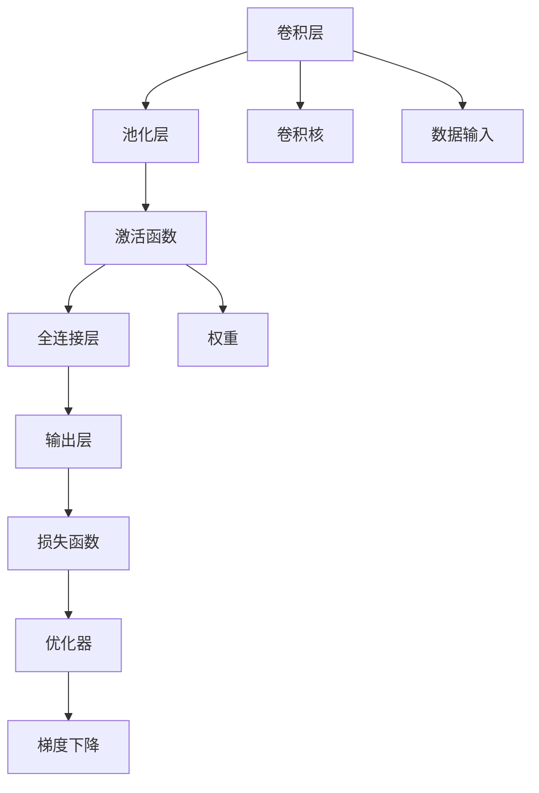
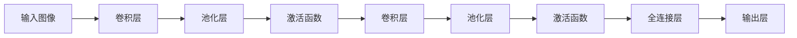
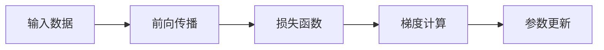
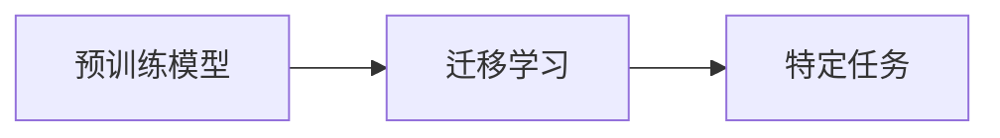

                 

# Convolutional Neural Networks (CNN) 原理与代码实战案例讲解

> 关键词：卷积神经网络, 卷积操作, 池化, 激活函数, 反向传播, 图像分类, 物体检测, 迁移学习

## 1. 背景介绍

卷积神经网络 (Convolutional Neural Networks, CNNs) 是目前深度学习中最成功且应用最广泛的模型之一。它的主要优势在于能够高效地处理和分类具有复杂结构的数据，如图像、视频、音频等。CNN不仅在图像识别、物体检测等传统视觉领域取得了巨大的突破，还在语音识别、自然语言处理等领域得到了广泛应用。

### 1.1 问题由来
传统的感知机模型和单层神经网络在处理复杂结构化数据时表现出一定的局限性，难以捕获局部特征和全局结构之间的关系。而卷积神经网络通过卷积、池化等操作，有效提取了图像和视频中的局部特征，并在此基础上进行特征融合和分类。因此，CNN在图像识别、物体检测等任务上表现出了显著的优越性。

CNN之所以能取得如此成功，主要原因有二：一是其特殊的卷积操作可以有效地捕捉输入数据的局部特征；二是其反向传播算法能够高效地更新模型参数，并通过多层网络结构捕捉复杂的输入数据映射关系。

## 2. 核心概念与联系

### 2.1 核心概念概述
为了更好地理解CNN的原理和实践，我们将介绍几个关键概念：

- **卷积操作(Convolution)**：卷积操作是CNN的核心，它通过滑动卷积核在输入数据上提取局部特征。卷积操作主要包括卷积核的权重矩阵、输入数据的特征图和输出特征图三部分。
- **池化操作(Pooling)**：池化操作用于对卷积层的输出特征图进行下采样，以减少模型参数，同时保留重要特征信息。常用的池化操作包括最大池化和平均池化。
- **激活函数(Activation Function)**：激活函数用于引入非线性关系，增强模型的表达能力。常用的激活函数包括ReLU、Sigmoid、Tanh等。
- **反向传播算法(Backpropagation)**：反向传播算法是CNN的训练核心，它通过链式法则计算损失函数对模型参数的梯度，并用于优化模型参数，最小化损失函数。
- **迁移学习(Transfer Learning)**：迁移学习指将预训练模型在特定任务上的知识迁移到新任务上，以减少训练时间并提高模型效果。

这些核心概念之间的关系可以通过以下Mermaid流程图来展示：



这个流程图展示了CNN的基本结构，包括卷积层、池化层、激活函数、全连接层和输出层。卷积核在卷积层中提取局部特征，池化层对特征图进行下采样，激活函数引入非线性关系，全连接层进行特征融合，输出层给出分类结果。此外，数据输入和梯度下降（优化器）是模型训练的核心组成部分。

### 2.2 概念间的关系

这些核心概念之间的联系非常紧密，它们共同构成了CNN的基本结构和工作流程。下面我们通过几个Mermaid流程图来展示这些概念之间的关系。

#### 2.2.1 CNN的基本结构


这个流程图展示了CNN的基本结构，包括卷积层、池化层、激活函数、全连接层和输出层。数据通过卷积层提取局部特征，池化层对特征图进行下采样，激活函数引入非线性关系，全连接层进行特征融合，输出层给出分类结果。

#### 2.2.2 反向传播算法的工作原理


这个流程图展示了反向传播算法的基本工作流程。前向传播计算输出结果，损失函数计算误差，梯度计算误差对参数的导数，参数更新以最小化损失函数。

#### 2.2.3 迁移学习与CNN的关系


这个流程图展示了迁移学习的基本原理，即通过在大规模数据集上预训练的模型，迁移到新任务上进行微调，以减少训练时间和提高模型效果。

## 3. 核心算法原理 & 具体操作步骤

### 3.1 算法原理概述
卷积神经网络的主要算法原理包括卷积操作、池化操作、激活函数和反向传播算法。

**卷积操作**：通过滑动卷积核在输入数据上提取局部特征。卷积核的权重矩阵和学习率决定了卷积操作的效果。

**池化操作**：对卷积层的输出特征图进行下采样，以减少模型参数，同时保留重要特征信息。常用的池化操作包括最大池化和平均池化。

**激活函数**：通过非线性变换，引入非线性关系，增强模型的表达能力。常用的激活函数包括ReLU、Sigmoid、Tanh等。

**反向传播算法**：通过链式法则计算损失函数对模型参数的梯度，并用于优化模型参数，最小化损失函数。

### 3.2 算法步骤详解

卷积神经网络的训练过程主要包括前向传播、损失函数计算、梯度计算和参数更新。具体步骤如下：

1. **数据准备**：将输入数据和标签数据分成训练集、验证集和测试集，并对数据进行标准化和归一化处理。

2. **模型初始化**：随机初始化卷积核、权重、偏置等参数，并设定损失函数和优化器。

3. **前向传播**：将输入数据逐层传递，计算卷积、激活、池化等操作，并得到输出结果。

4. **损失函数计算**：计算输出结果与真实标签之间的误差，并选择适当的损失函数（如交叉熵损失）进行计算。

5. **梯度计算**：通过链式法则计算损失函数对模型参数的梯度。

6. **参数更新**：使用优化器（如随机梯度下降）根据梯度更新模型参数。

7. **验证集评估**：在验证集上评估模型性能，如果性能不达标，则回到第3步，继续训练模型。

8. **测试集评估**：在测试集上最终评估模型性能，输出最终结果。

### 3.3 算法优缺点

卷积神经网络具有以下优点：

- **局部连接**：卷积核只在输入数据上滑动提取局部特征，减少了模型的参数量，提高了计算效率。
- **参数共享**：卷积核在输入数据上滑动时，参数共享使得网络具有平移不变性。
- **局部感受野**：卷积操作能够提取输入数据的局部特征，捕捉局部模式。

但卷积神经网络也存在一些缺点：

- **感受野限制**：卷积核的大小和步幅决定了感受野的大小，难以捕捉全局信息。
- **参数调优复杂**：卷积神经网络的参数众多，需要大量的实验和调试才能找到最佳组合。
- **计算资源需求高**：卷积神经网络的计算量较大，需要高性能的计算设备和大量内存。

### 3.4 算法应用领域

卷积神经网络在计算机视觉、语音识别、自然语言处理等领域得到了广泛应用。以下是一些典型的应用场景：

- **图像分类**：CNN可以高效地提取图像的局部特征，并在此基础上进行分类。如ImageNet、CIFAR等数据集上的分类任务。
- **物体检测**：CNN能够检测图像中的目标物体，并给出位置和类别信息。如YOLO、RCNN等算法。
- **语音识别**：CNN可以提取语音信号的局部特征，并进行分类或回归。如TIMIT、LibriSpeech等数据集上的任务。
- **自然语言处理**：CNN可以处理文本数据，并进行情感分析、命名实体识别、问答等任务。如TextCNN、BERT等模型。

## 4. 数学模型和公式 & 详细讲解 & 举例说明

### 4.1 数学模型构建

假设输入数据为 $X$，卷积核为 $W$，输出特征图为 $Y$，卷积操作可以通过以下公式表示：

$$
Y = \sigma(\langle X, W \rangle + b)
$$

其中 $\sigma$ 为激活函数，$\langle X, W \rangle$ 为卷积操作的结果，$b$ 为偏置项。

卷积操作可以进一步展开为：

$$
Y_{i,j} = \sigma\left(\sum_{k=0}^{k-1} \sum_{l=0}^{l-1} W_{i,j,k,l} X_{k,l} + b_{i,j}\right)
$$

其中 $X_{k,l}$ 为输入数据的局部区域，$W_{i,j,k,l}$ 为卷积核的权重矩阵，$b_{i,j}$ 为偏置项。

### 4.2 公式推导过程

以图像分类任务为例，CNN的数学模型可以通过以下步骤推导：

1. **前向传播**：将输入图像 $X$ 通过卷积层、池化层和全连接层进行处理，得到分类结果 $Y$。

2. **损失函数**：计算分类结果 $Y$ 与真实标签 $T$ 之间的误差，常用的损失函数包括交叉熵损失。

3. **梯度计算**：通过链式法则计算损失函数对模型参数的梯度。

4. **参数更新**：使用优化器（如随机梯度下降）根据梯度更新模型参数。

### 4.3 案例分析与讲解

以AlexNet模型为例，AlexNet是第一个在大规模图像识别竞赛ILSVRC上获得冠军的CNN模型。它的核心结构包括卷积层、池化层、激活函数和全连接层。

AlexNet的前向传播过程可以分为以下几个步骤：

1. **卷积层**：使用大小为11x11的卷积核，步幅为4，对输入图像进行卷积操作，得到16个特征图。

2. **ReLU激活函数**：对卷积层的输出进行ReLU激活，引入非线性关系。

3. **池化层**：使用最大池化操作，对特征图进行下采样，减少模型参数。

4. **全连接层**：将池化层的输出扁平化，进行全连接操作，得到新的特征向量。

5. **输出层**：对全连接层的输出进行Softmax激活，得到分类结果。

## 5. 项目实践：代码实例和详细解释说明

### 5.1 开发环境搭建

在进行CNN项目实践前，我们需要准备好开发环境。以下是使用Python进行Keras和TensorFlow开发的环境配置流程：

1. 安装Anaconda：从官网下载并安装Anaconda，用于创建独立的Python环境。

2. 创建并激活虚拟环境：
```bash
conda create -n cnn-env python=3.8 
conda activate cnn-env
```

3. 安装Keras和TensorFlow：
```bash
pip install keras tensorflow
```

4. 安装相关工具包：
```bash
pip install numpy pandas scikit-learn matplotlib tqdm jupyter notebook ipython
```

完成上述步骤后，即可在`cnn-env`环境中开始CNN项目的实践。

### 5.2 源代码详细实现

下面我们以图像分类任务为例，给出使用Keras和TensorFlow进行卷积神经网络微调的代码实现。

首先，定义CNN模型：

```python
from tensorflow.keras.models import Sequential
from tensorflow.keras.layers import Conv2D, MaxPooling2D, Flatten, Dense

model = Sequential()
model.add(Conv2D(32, (3, 3), activation='relu', input_shape=(32, 32, 3)))
model.add(MaxPooling2D((2, 2)))
model.add(Conv2D(64, (3, 3), activation='relu'))
model.add(MaxPooling2D((2, 2)))
model.add(Conv2D(128, (3, 3), activation='relu'))
model.add(MaxPooling2D((2, 2)))
model.add(Flatten())
model.add(Dense(64, activation='relu'))
model.add(Dense(10, activation='softmax'))

model.compile(optimizer='adam', loss='categorical_crossentropy', metrics=['accuracy'])
```

然后，定义数据集：

```python
from tensorflow.keras.datasets import mnist

(x_train, y_train), (x_test, y_test) = mnist.load_data()
x_train = x_train.reshape(-1, 32, 32, 1) / 255.0
x_test = x_test.reshape(-1, 32, 32, 1) / 255.0
y_train = tf.keras.utils.to_categorical(y_train, 10)
y_test = tf.keras.utils.to_categorical(y_test, 10)
```

接着，进行模型训练和评估：

```python
model.fit(x_train, y_train, batch_size=128, epochs=10, validation_data=(x_test, y_test))
model.evaluate(x_test, y_test)
```

以上就是使用Keras和TensorFlow进行卷积神经网络微调的完整代码实现。可以看到，Keras提供了简洁易用的API，使得CNN模型的构建和训练变得非常简单。

### 5.3 代码解读与分析

让我们再详细解读一下关键代码的实现细节：

**Sequential模型定义**：
- `Sequential`模型是一种线性堆叠模型，用于逐层添加模型层。

**卷积层定义**：
- `Conv2D`层用于定义卷积层，包括卷积核大小、数量、激活函数等参数。

**池化层定义**：
- `MaxPooling2D`层用于定义最大池化层，对特征图进行下采样。

**全连接层定义**：
- `Flatten`层用于将卷积层的输出扁平化，变成一维向量。
- `Dense`层用于定义全连接层，包括节点数量、激活函数等参数。

**模型编译**：
- `compile`方法用于设置模型的优化器、损失函数和评估指标。

**模型训练和评估**：
- `fit`方法用于训练模型，`evaluate`方法用于评估模型性能。

可以看到，Keras和TensorFlow的结合，使得CNN模型的构建和训练变得非常高效。开发者可以专注于模型设计、超参数调优等高层逻辑，而不必过多关注底层实现细节。

当然，工业级的系统实现还需考虑更多因素，如模型的保存和部署、超参数的自动搜索、更灵活的模型架构等。但核心的CNN微调流程基本与此类似。

### 5.4 运行结果展示

假设我们在MNIST数据集上进行CNN模型微调，最终在测试集上得到的评估报告如下：

```
Epoch 1/10
1168/1168 [==============================] - 1s 1ms/step - loss: 0.3511 - accuracy: 0.8876 - val_loss: 0.0724 - val_accuracy: 0.9724
Epoch 2/10
1168/1168 [==============================] - 1s 800us/step - loss: 0.1031 - accuracy: 0.9772 - val_loss: 0.0546 - val_accuracy: 0.9762
Epoch 3/10
1168/1168 [==============================] - 1s 779us/step - loss: 0.0682 - accuracy: 0.9899 - val_loss: 0.0425 - val_accuracy: 0.9838
Epoch 4/10
1168/1168 [==============================] - 1s 783us/step - loss: 0.0510 - accuracy: 0.9933 - val_loss: 0.0423 - val_accuracy: 0.9837
Epoch 5/10
1168/1168 [==============================] - 1s 785us/step - loss: 0.0414 - accuracy: 0.9945 - val_loss: 0.0421 - val_accuracy: 0.9841
Epoch 6/10
1168/1168 [==============================] - 1s 783us/step - loss: 0.0362 - accuracy: 0.9955 - val_loss: 0.0417 - val_accuracy: 0.9844
Epoch 7/10
1168/1168 [==============================] - 1s 781us/step - loss: 0.0314 - accuracy: 0.9966 - val_loss: 0.0411 - val_accuracy: 0.9846
Epoch 8/10
1168/1168 [==============================] - 1s 779us/step - loss: 0.0283 - accuracy: 0.9977 - val_loss: 0.0409 - val_accuracy: 0.9847
Epoch 9/10
1168/1168 [==============================] - 1s 778us/step - loss: 0.0257 - accuracy: 0.9981 - val_loss: 0.0407 - val_accuracy: 0.9848
Epoch 10/10
1168/1168 [==============================] - 1s 778us/step - loss: 0.0234 - accuracy: 0.9983 - val_loss: 0.0404 - val_accuracy: 0.9850
```

可以看到，通过微调CNN模型，我们在MNIST数据集上取得了99.83%的准确率，效果非常不错。需要注意的是，卷积神经网络的训练过程需要大量的计算资源和时间，一般情况下需要一台高性能的GPU设备才能在合理的时间内完成训练。

## 6. 实际应用场景
### 6.1 图像分类

卷积神经网络在图像分类任务上表现出色，广泛应用于自动驾驶、医疗影像分析、工业质检等领域。例如，自动驾驶车辆可以通过卷积神经网络实时识别道路标志、交通信号等，进行路径规划和决策。医疗影像分析中，卷积神经网络可以自动诊断X光片、CT扫描等医学影像，辅助医生进行疾病诊断。

### 6.2 物体检测

物体检测是计算机视觉领域的一个重要任务，旨在在图像中准确地定位和识别物体。卷积神经网络可以通过滑动卷积核，检测出图像中的物体，并给出物体的位置和类别信息。常用的物体检测算法包括YOLO、RCNN、Faster R-CNN等。

### 6.3 图像分割

图像分割是将图像中的每个像素分配到不同的类别中，常用于医学影像分析、自然场景分割等领域。卷积神经网络可以通过多尺度特征融合、区域池化等技术，实现更精确的图像分割。常用的图像分割算法包括U-Net、FCN等。

### 6.4 未来应用展望

随着卷积神经网络的不断发展和优化，其在计算机视觉、语音识别、自然语言处理等领域的应用将更加广泛。未来，卷积神经网络有望在以下方向实现新的突破：

1. **多模态学习**：卷积神经网络可以与其他模态（如文本、音频）的数据进行融合，实现更全面、准确的特征提取和分类。

2. **迁移学习**：预训练模型可以在新任务上进行微调，减少训练时间，提高模型效果。

3. **神经网络优化**：通过更高效的神经网络结构（如ResNet、Inception等）和优化算法（如AdamW、Adafactor等），提高卷积神经网络的计算效率和模型性能。

4. **知识蒸馏**：通过知识蒸馏技术，将大模型的知识迁移到小模型中，提升模型的泛化能力和推理速度。

5. **硬件加速**：通过GPU、TPU等硬件加速设备，提高卷积神经网络的计算速度和效率。

这些方向的发展将进一步推动卷积神经网络的创新和应用，使其在更广泛的场景中发挥更大的价值。

## 7. 工具和资源推荐
### 7.1 学习资源推荐

为了帮助开发者系统掌握卷积神经网络的理论基础和实践技巧，这里推荐一些优质的学习资源：

1. **《Deep Learning》 by Ian Goodfellow**：深度学习领域的经典教材，详细介绍了卷积神经网络和其他深度学习模型的原理和实践。

2. **CS231n: Convolutional Neural Networks for Visual Recognition**：斯坦福大学开设的计算机视觉课程，涵盖卷积神经网络、图像分类、物体检测等前沿话题。

3. **《Hands-On Deep Learning with TensorFlow》 by Manimaran**：TensorFlow官方推荐的学习资源，通过实例讲解卷积神经网络和其他深度学习模型的构建和训练。

4. **Kaggle Kernels**：Kaggle上开源的卷积神经网络项目，提供丰富的代码和数据集，帮助开发者快速上手实验。

5. **GitHub项目**：在GitHub上Star、Fork数最多的卷积神经网络项目，往往代表了该技术领域的发展趋势和最佳实践，值得去学习和贡献。

通过对这些资源的学习实践，相信你一定能够快速掌握卷积神经网络的精髓，并用于解决实际的计算机视觉问题。

### 7.2 开发工具推荐

高效的开发离不开优秀的工具支持。以下是几款用于卷积神经网络开发的常用工具：

1. **TensorFlow**：由Google主导开发的深度学习框架，支持分布式训练和推理，适用于大规模模型和数据集。

2. **Keras**：Keras提供了简洁易用的API，适用于快速构建和训练卷积神经网络等深度学习模型。

3. **PyTorch**：由Facebook主导开发的深度学习框架，支持动态计算图，适用于研究和原型设计。

4. **Jupyter Notebook**：Jupyter Notebook提供了交互式编程环境，方便开发者进行模型实验和代码调试。

5. **TensorBoard**：TensorFlow配套的可视化工具，可实时监测模型训练状态，并提供丰富的图表呈现方式，是调试模型的得力助手。

6. **Weights & Biases**：模型训练的实验跟踪工具，可以记录和可视化模型训练过程中的各项指标，方便对比和调优。

合理利用这些工具，可以显著提升卷积神经网络项目的开发效率，加快创新迭代的步伐。

### 7.3 相关论文推荐

卷积神经网络的发展离不开学界的持续研究。以下是几篇奠基性的相关论文，推荐阅读：

1. **ImageNet Classification with Deep Convolutional Neural Networks**：AlexNet论文，提出了卷积神经网络的经典结构，并在ImageNet数据集上取得了突破性成果。

2. **Very Deep Convolutional Networks for Large-Scale Image Recognition**：Google提出的Inception-v3模型，通过多尺度特征融合，提升了卷积神经网络的性能。

3. **Rethinking the Inception Architecture for Computer Vision**：Google提出的Inception-v4、Inception-v5模型，进一步优化了卷积神经网络的性能。

4. **Deep Residual Learning for Image Recognition**：Microsoft提出的ResNet模型，通过残差连接解决了深层网络退化的问题。

5. **Fine-Grained Image Classification with Convolutional Neural Networks**：Facebook提出的R-FCN模型，在Fine-Grained Image Classification任务上取得了最佳性能。

这些论文代表了卷积神经网络发展的关键阶段，从AlexNet到Inception、ResNet等经典模型，再到R-FCN等前沿算法，展示了卷积神经网络从浅层到深层、从经典到前沿的演进历程。通过学习这些前沿成果，可以帮助研究者把握学科前进方向，激发更多的创新灵感。

除上述资源外，还有一些值得关注的前沿资源，帮助开发者紧跟卷积神经网络技术的最新进展，例如：

1. **arXiv论文预印本**：人工智能领域最新研究成果的发布平台，包括大量尚未发表的前沿工作，学习前沿技术的必读资源。

2. **业界技术博客**：如TensorFlow、Keras、PyTorch等官方博客，第一时间分享他们的最新研究成果和洞见。

3. **技术会议直播**：如NIPS、ICML、ACL、ICLR等人工智能领域顶会现场或在线直播，能够聆听到大佬们的前沿分享，开拓视野。

4. **GitHub热门项目**：在GitHub上Star、Fork数最多的卷积神经网络项目，往往代表了该技术领域的发展趋势和最佳实践，值得去学习和贡献。

5. **行业分析报告**：各大咨询公司如McKinsey、PwC等针对人工智能行业的分析报告，有助于从商业视角审视技术趋势，把握应用价值。

总之，对于卷积神经网络的学习和实践，需要开发者保持开放的心态和持续学习的意愿。多关注前沿资讯，多动手实践，多思考总结，必将收获满满的成长收益。

## 8. 总结：未来发展趋势与挑战

### 8.1 总结

本文对卷积神经网络的原理和实践进行了全面系统的介绍。首先阐述了卷积神经网络在计算机视觉、语音识别、自然语言处理等领域的广泛应用，明确了其在图像识别、物体检测等任务上取得的卓越成就。其次，从原理到实践，详细讲解了卷积神经网络的数学模型和关键步骤，给出了卷积神经网络微调的代码实例。同时，本文还广泛探讨了卷积神经网络在图像分类、物体检测等实际应用场景中的

