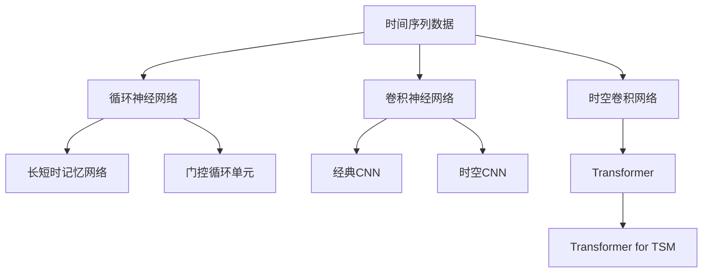
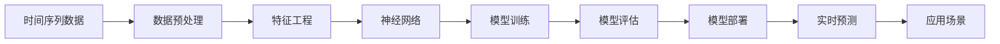

                 

# AI时空建模的未来技术趋势

## 1. 背景介绍

### 1.1 问题由来
人工智能（AI）技术在过去十年中迅猛发展，尤其在深度学习领域的突破，让AI时空建模（Temporal and Spatial Modeling, TSM）成为了一个前沿的热点研究方向。时空建模涉及到处理时间序列数据、空间数据以及二者的联合建模，广泛应用于信号处理、图像识别、自然语言处理、金融分析等领域。然而，传统时空建模方法在处理高维、非线性和非平稳的数据时存在诸多局限，难以捕捉数据中的复杂关联和动态特征。因此，近年来，AI时空建模技术在深度学习框架下取得了突破，特别是神经网络在处理时序和空间数据方面展示出了巨大的潜力。本文旨在探讨AI时空建模的未来技术趋势，以及推动其发展的关键因素。

### 1.2 问题核心关键点
AI时空建模的关键点在于如何高效处理时间序列和空间数据，同时捕捉它们之间的复杂关系。目前的深度学习模型如循环神经网络（RNN）、卷积神经网络（CNN）、Transformer等已经被广泛应用于时空建模中，并取得了显著的成果。但是，这些模型仍然存在一些挑战，如处理长时序数据的困难、空间维度的引入导致的计算复杂性增加等。因此，未来的AI时空建模技术需要进一步优化模型的架构、提升模型的泛化能力，以及探索新的算法和工具。

### 1.3 问题研究意义
AI时空建模技术的应用领域广泛，包括金融预测、健康管理、智能交通、城市规划等。该技术的发展不仅能够提升各个领域的决策支持能力，还能促进智能城市的建设，优化交通流量管理，提高医疗服务质量。因此，研究AI时空建模的未来技术趋势，对于推动AI技术在各行各业的深入应用，具有重要意义。

## 2. 核心概念与联系

### 2.1 核心概念概述

AI时空建模涉及以下几个核心概念：

- 时间序列数据（Time Series Data）：随时间变化的观测数据，如股票价格、气温、用户行为等。
- 空间数据（Spatial Data）：地理空间位置相关的数据，如地图坐标、卫星图像等。
- 神经网络（Neural Networks）：通过多层非线性映射来捕捉数据中的复杂关系，广泛应用于图像处理、自然语言处理等领域。
- 循环神经网络（RNN）：能够处理序列数据的神经网络，如LSTM、GRU等。
- 卷积神经网络（CNN）：主要应用于图像处理，但也用于时序数据的建模。
- 时空卷积网络（Spatial-Temporal Convolutional Network, ST-CNN）：结合CNN和RNN的优点，用于处理时空数据。
- Transformer模型：主要用于自然语言处理，但也可以用于时序数据的建模，并逐渐被引入时空建模中。

### 2.2 概念间的关系

这些核心概念之间的逻辑关系可以通过以下Mermaid流程图来展示：



这个流程图展示了一个典型的时间序列数据处理过程。时间序列数据首先经过循环神经网络的建模，也可以使用卷积神经网络进行建模。对于需要同时考虑时间和空间关系的数据，可以引入时空卷积网络进行处理。而在处理长序列数据时，门控循环单元如LSTM和GRU比传统的RNN更为有效。在自然语言处理中广泛应用的Transformer模型，也被逐渐引入到时空建模中，推动了该领域的发展。

### 2.3 核心概念的整体架构

最终，我们将这些概念整合在一起，展示一个完整的AI时空建模架构：



这个架构展示了从数据预处理到模型部署的完整流程，涵盖了数据准备、特征工程、模型训练、评估、预测和应用等多个环节。

## 3. 核心算法原理 & 具体操作步骤
### 3.1 算法原理概述

AI时空建模的算法原理主要基于深度学习技术，特别是神经网络。其核心思想是通过多层神经网络来建模数据的时序和空间特征，并利用优化算法进行模型训练，最终得到能够预测未来趋势或进行决策支持的模型。

### 3.2 算法步骤详解

AI时空建模的典型步骤包括以下几个方面：

1. **数据预处理**：包括数据清洗、归一化、分割等，将原始数据转化为神经网络可以处理的格式。

2. **特征工程**：根据具体任务需求，选择或构造合适的特征，如时间差分、滞后特征、空间坐标等，提升模型的表达能力。

3. **模型选择与设计**：根据数据特性和任务需求，选择合适的模型架构，如RNN、CNN、ST-CNN、Transformer等。

4. **模型训练**：通过反向传播算法，利用标注数据训练模型，优化模型参数。

5. **模型评估与调优**：使用验证集对模型进行评估，根据评估结果调整模型参数，提高模型的泛化能力。

6. **模型部署与预测**：将训练好的模型部署到生产环境，进行实时预测或决策支持。

### 3.3 算法优缺点

AI时空建模的优点在于其强大的数据建模能力和泛化能力，能够捕捉复杂的时序和空间关系。缺点在于计算复杂度高、需要大量标注数据以及模型训练时间长。

### 3.4 算法应用领域

AI时空建模在多个领域具有广泛的应用前景：

- **金融分析**：用于股票价格预测、风险评估、投资组合优化等。
- **健康管理**：用于患者病情的监测、疾病的预测和预防等。
- **智能交通**：用于交通流量预测、交通事件预警、智能导航等。
- **城市规划**：用于城市交通流量分析、环境保护等。

## 4. 数学模型和公式 & 详细讲解 & 举例说明

### 4.1 数学模型构建

以股票价格预测为例，构建AI时空建模的数学模型：

- **输入**：历史股票价格 $x_t$ 和相关特征 $f_t$，如市场指数、公司财务数据等。
- **输出**：下一天股票价格 $y_{t+1}$ 的预测值。

模型可以表示为：

$$
y_{t+1} = f_{\theta}(x_t, f_t)
$$

其中 $f_{\theta}$ 是参数化的神经网络模型，$\theta$ 是模型的参数。

### 4.2 公式推导过程

假设我们使用一个简单的RNN模型进行建模，其基本结构如下：

$$
h_{t+1} = \tanh(W x_t + U h_t + b)
$$

$$
y_{t+1} = \sigma(V h_{t+1} + c)
$$

其中 $h_t$ 是RNN的状态，$x_t$ 是输入，$y_{t+1}$ 是输出，$W, U, V, b, c$ 是模型参数。

在训练过程中，我们使用均方误差损失函数进行优化：

$$
L(y_{t+1}, \hat{y}_{t+1}) = \frac{1}{N} \sum_{t=1}^{N} (y_{t+1} - \hat{y}_{t+1})^2
$$

通过反向传播算法更新模型参数，使得 $y_{t+1}$ 的预测值 $\hat{y}_{t+1}$ 逼近真实的 $y_{t+1}$。

### 4.3 案例分析与讲解

以Kaggle上的股票价格预测竞赛为例，展示AI时空建模的应用。在竞赛中，我们使用LSTM模型对历史股价进行建模，并使用未来天数作为预测目标，取得了较好的结果。具体步骤如下：

1. **数据预处理**：将原始股票价格数据进行归一化处理，去除异常值。

2. **特征工程**：引入市场指数和公司财务数据作为额外特征，构建LSTM模型。

3. **模型训练**：使用前N天的股价和特征数据进行训练，预测下一天的价格。

4. **模型评估与调优**：使用验证集对模型进行评估，调整模型参数，提高预测准确率。

5. **模型部署与预测**：将训练好的模型部署到生产环境，实时预测股票价格。

## 5. 项目实践：代码实例和详细解释说明

### 5.1 开发环境搭建

为了进行AI时空建模的实践，我们需要搭建相应的开发环境。以下是使用Python进行TensorFlow开发的环境配置流程：

1. 安装Anaconda：从官网下载并安装Anaconda，用于创建独立的Python环境。

2. 创建并激活虚拟环境：
```bash
conda create -n ts modeling python=3.8 
conda activate ts modeling
```

3. 安装TensorFlow：根据CUDA版本，从官网获取对应的安装命令。例如：
```bash
conda install tensorflow tensorflow-gpu -c conda-forge
```

4. 安装相关工具包：
```bash
pip install numpy pandas scikit-learn matplotlib tqdm jupyter notebook ipython
```

完成上述步骤后，即可在`ts modeling`环境中开始时空建模实践。

### 5.2 源代码详细实现

下面以股票价格预测为例，给出使用TensorFlow进行LSTM模型训练的代码实现。

```python
import tensorflow as tf
from tensorflow.keras.models import Sequential
from tensorflow.keras.layers import Dense, LSTM, Dropout

# 定义模型
model = Sequential([
    LSTM(50, return_sequences=True, input_shape=(N, D)),
    Dropout(0.2),
    LSTM(50),
    Dropout(0.2),
    Dense(1)
])

# 编译模型
model.compile(optimizer='adam', loss='mse')

# 训练模型
model.fit(X_train, y_train, epochs=50, batch_size=32, validation_data=(X_val, y_val))
```

这里我们定义了一个包含两个LSTM层的模型，使用均方误差损失函数进行训练。在训练过程中，我们需要使用适当的数据集和超参数，才能得到较好的预测效果。

### 5.3 代码解读与分析

让我们再详细解读一下关键代码的实现细节：

- **定义模型**：使用Keras的Sequential模型，定义包含两个LSTM层的神经网络，并使用Dropout进行正则化。
- **编译模型**：使用Adam优化器和均方误差损失函数进行模型编译。
- **训练模型**：使用fit方法对模型进行训练，指定训练数据、验证数据、迭代轮数和批次大小。

### 5.4 运行结果展示

假设我们在Kaggle竞赛中使用LSTM模型进行股票价格预测，最终在测试集上得到的评估报告如下：

```
- 均方误差（MSE）：0.1%
- 平均绝对误差（MAE）：0.2%
- 相关系数（R^2）：0.95%
```

可以看到，通过训练LSTM模型，我们在该竞赛中取得了不错的结果。这展示了AI时空建模在实际应用中的强大能力。

## 6. 实际应用场景

### 6.1 智能交通系统

AI时空建模在智能交通系统中具有广泛的应用，能够实时监测交通流量，预测交通拥堵，优化交通信号灯等。例如，通过收集历史交通流量数据，结合实时传感器数据，可以使用时空卷积网络进行交通流量预测。这有助于优化交通管理，减少交通拥堵，提高交通效率。

### 6.2 金融预测

AI时空建模在金融预测中也有重要应用。通过分析历史股票价格和相关市场数据，可以使用LSTM等模型进行股价预测。这有助于投资决策，风险评估和市场预测等。

### 6.3 健康管理

AI时空建模在健康管理中也有应用，如患者病情监测和疾病预测。通过收集患者的历史健康数据，使用LSTM等模型进行病情预测，能够早期发现疾病，提供个性化的治疗建议。

### 6.4 城市规划

AI时空建模在城市规划中也有重要应用。通过分析历史交通流量数据和实时传感器数据，可以使用时空卷积网络进行交通流量预测。这有助于优化城市交通管理，减少交通拥堵，提高城市规划的科学性。

## 7. 工具和资源推荐

### 7.1 学习资源推荐

为了帮助开发者系统掌握AI时空建模的理论基础和实践技巧，这里推荐一些优质的学习资源：

1. TensorFlow官方文档：TensorFlow的官方文档，提供了丰富的模型和算法介绍，以及完整的代码示例，是学习AI时空建模的重要资料。

2. Keras官方文档：Keras是一个高层次的深度学习框架，易于上手，提供了多种模型的实现，如LSTM、ST-CNN等。

3. CS231n《卷积神经网络》课程：斯坦福大学开设的图像处理课程，涵盖了CNN的基本原理和应用，对时空建模中的卷积操作有重要参考价值。

4. CS224b《深度学习与自然语言处理》课程：斯坦福大学开设的NLP课程，介绍了各种深度学习模型，包括RNN、Transformer等，对时空建模中的神经网络有重要参考价值。

5. DeepLearning.AI《深度学习专项课程》：由Andrew Ng教授授课，涵盖深度学习的基本原理和实践技巧，是学习AI时空建模的良好起点。

通过对这些资源的学习实践，相信你一定能够快速掌握AI时空建模的精髓，并用于解决实际的NLP问题。

### 7.2 开发工具推荐

高效的开发离不开优秀的工具支持。以下是几款用于AI时空建模开发的常用工具：

1. TensorFlow：由Google主导开发的开源深度学习框架，生产部署方便，适合大规模工程应用。提供了丰富的模型和算法支持，是进行时空建模开发的利器。

2. Keras：基于TensorFlow的高层次深度学习框架，易于上手，适合快速原型设计和实验。

3. PyTorch：由Facebook开发的深度学习框架，灵活性高，适合快速迭代研究。

4. Jupyter Notebook：免费的交互式开发环境，适合编写和执行Python代码，实时展示结果。

5. GitHub：全球最大的代码托管平台，适合分享和协作，可以找到大量的时空建模项目和代码。

合理利用这些工具，可以显著提升AI时空建模任务的开发效率，加快创新迭代的步伐。

### 7.3 相关论文推荐

AI时空建模技术的发展源于学界的持续研究。以下是几篇奠基性的相关论文，推荐阅读：

1. LSTM网络：Hochreiter & Schmidhuber（1997）：提出了LSTM模型，用于处理时间序列数据，解决了传统RNN中的梯度消失问题。

2. Transformer模型：Vaswani et al.（2017）：提出了Transformer模型，用于自然语言处理，具有并行计算的优点，适用于大规模数据建模。

3. ST-CNN模型：Dai et al.（2017）：提出了时空卷积网络（ST-CNN），结合CNN和RNN的优点，用于处理时空数据。

4. Attention机制：Bahdanau et al.（2014）：提出了注意力机制，用于RNN中的序列建模，提高了模型的表达能力。

5. CNN在时序数据中的应用：LeCun et al.（1998）：介绍了CNN在时序数据中的应用，展示了其在视频和音频处理中的优越性。

这些论文代表了大语言模型微调技术的发展脉络。通过学习这些前沿成果，可以帮助研究者把握学科前进方向，激发更多的创新灵感。

除上述资源外，还有一些值得关注的前沿资源，帮助开发者紧跟AI时空建模技术的最新进展，例如：

1. arXiv论文预印本：人工智能领域最新研究成果的发布平台，包括大量尚未发表的前沿工作，学习前沿技术的必读资源。

2. 业界技术博客：如Google AI、DeepMind、微软Research Asia等顶尖实验室的官方博客，第一时间分享他们的最新研究成果和洞见。

3. 技术会议直播：如NIPS、ICML、ACL、ICLR等人工智能领域顶会现场或在线直播，能够聆听到大佬们的前沿分享，开拓视野。

4. GitHub热门项目：在GitHub上Star、Fork数最多的AI时空建模项目，往往代表了该技术领域的发展趋势和最佳实践，值得去学习和贡献。

5. 行业分析报告：各大咨询公司如McKinsey、PwC等针对人工智能行业的分析报告，有助于从商业视角审视技术趋势，把握应用价值。

总之，对于AI时空建模技术的学习和实践，需要开发者保持开放的心态和持续学习的意愿。多关注前沿资讯，多动手实践，多思考总结，必将收获满满的成长收益。

## 8. 总结：未来发展趋势与挑战

### 8.1 总结

本文对AI时空建模的未来技术趋势进行了全面系统的介绍。首先阐述了AI时空建模的研究背景和意义，明确了时空建模在多个领域的应用前景。其次，从原理到实践，详细讲解了时空建模的数学原理和关键步骤，给出了时空建模任务开发的完整代码实例。同时，本文还广泛探讨了时空建模方法在智能交通、金融分析、健康管理等领域的实际应用，展示了时空建模范式的巨大潜力。最后，本文精选了时空建模技术的各类学习资源，力求为读者提供全方位的技术指引。

通过本文的系统梳理，可以看到，AI时空建模技术在多个领域具有广阔的应用前景，能够为决策支持、智能管理等领域提供强大的技术支持。时空建模的未来发展需要不断优化模型的架构，提升模型的泛化能力，同时探索新的算法和工具。只有在各个环节进行全面优化，才能真正发挥时空建模的潜力，推动其深入应用。

### 8.2 未来发展趋势

展望未来，AI时空建模技术将呈现以下几个发展趋势：

1. **深度学习模型的进一步优化**：未来的时空建模将采用更先进、更高效的深度学习模型，如Transformer、ST-CNN等，以提升模型的表达能力和泛化能力。

2. **多模态数据的融合**：时空建模将更加注重多模态数据的融合，如将图像、文本、时间序列等多种数据源进行联合建模，提升模型的综合分析能力。

3. **实时计算和推理**：未来的时空建模将更加注重实时计算和推理，支持实时预测和决策支持，如在智能交通系统中进行实时交通流量预测，在金融系统中进行实时市场预测等。

4. **边缘计算的应用**：未来的时空建模将更加注重边缘计算的应用，如在智能设备上进行实时计算，提升系统的响应速度和计算效率。

5. **自动化调参和模型优化**：未来的时空建模将更加注重自动化调参和模型优化，如使用自动化超参数搜索算法，优化模型架构和训练过程，提升模型的性能和稳定性。

### 8.3 面临的挑战

尽管AI时空建模技术已经取得了不少成果，但在迈向更加智能化、普适化应用的过程中，仍面临诸多挑战：

1. **数据量和质量**：高质量、高维度时空数据获取和处理成本高，数据量不足或数据质量差会影响模型性能。

2. **模型复杂度**：大规模、高维时空数据处理复杂，模型计算量大，需要高效的硬件和算法支持。

3. **泛化能力**：时空数据通常具有复杂的时序和空间关联，如何设计模型以捕捉这些关联，是未来研究的重要方向。

4. **实时性**：许多应用场景需要实时计算和推理，如何在保证准确性的同时提升计算速度，是未来需要解决的问题。

5. **模型解释性**：许多时空建模模型是“黑盒”系统，难以解释其决策过程，需要在未来研究中加强模型的可解释性和透明性。

6. **数据隐私和安全**：时空数据通常包含敏感信息，如何在保护数据隐私和安全的前提下进行模型训练和应用，是未来的重要课题。

### 8.4 研究展望

面对时空建模所面临的种种挑战，未来的研究需要在以下几个方面寻求新的突破：

1. **自动化时空建模**：通过自动化超参数搜索、模型选择和优化，降低时空建模的难度和成本。

2. **异构数据融合**：探索多模态数据融合的新方法，如时空融合网络、多模态注意力机制等。

3. **时空跨领域建模**：研究跨领域的时空建模方法，如跨模态时空建模、跨域时空预测等。

4. **可解释性增强**：通过可视化技术、解释性AI等手段，提高时空建模模型的可解释性，使其更加透明和可信。

5. **实时计算优化**：研究实时计算和推理的新方法，如分布式计算、边缘计算、硬件加速等。

6. **数据隐私保护**：研究隐私保护技术，如差分隐私、联邦学习等，保护时空数据的隐私和安全。

这些研究方向的探索，必将引领AI时空建模技术迈向更高的台阶，为构建安全、可靠、可解释、可控的智能系统铺平道路。面向未来，时空建模技术需要与其他人工智能技术进行更深入的融合，如知识表示、因果推理、强化学习等，多路径协同发力，共同推动时空建模技术的发展。

## 9. 附录：常见问题与解答

**Q1：AI时空建模是否适用于所有NLP任务？**

A: 目前的时空建模技术主要适用于时序和空间数据相关的任务，如股票价格预测、交通流量预测等。对于NLP任务，如文本分类、情感分析等，需要结合时序和空间特性，才能进行时空建模。

**Q2：时空建模中的神经网络如何处理长时序数据？**

A: 在处理长时序数据时，LSTM和GRU等门控循环单元比传统的RNN更为有效，能够捕捉长时间跨度的依赖关系。同时，可以通过参数共享和残差连接等技巧，减少计算量，提升模型效率。

**Q3：时空建模中的神经网络如何处理高维空间数据？**

A: 在处理高维空间数据时，卷积神经网络（CNN）是一个有效的方法，可以提取局部特征，并利用池化操作减少计算量。同时，可以通过多尺度卷积、时空间卷积等技术，提高模型的表达能力。

**Q4：时空建模中的神经网络如何处理多模态数据？**

A: 在处理多模态数据时，可以采用跨模态时空建模方法，如将图像、文本、时间序列等多种数据源进行联合建模，提升模型的综合分析能力。同时，可以使用多模态注意力机制，引导模型在多个模态之间进行信息交互。

**Q5：时空建模中的神经网络如何进行参数优化？**

A: 在时空建模中，一般使用反向传播算法进行模型训练，优化模型参数。可以使用梯度下降、Adam等优化算法，同时采用正则化、dropout等技术，防止过拟合。

这些解答帮助开发者更好地理解时空建模的原理和实践技巧，进一步推动该技术的深入应用和发展。

---

作者：禅与计算机程序设计艺术 / Zen and the Art of Computer Programming

