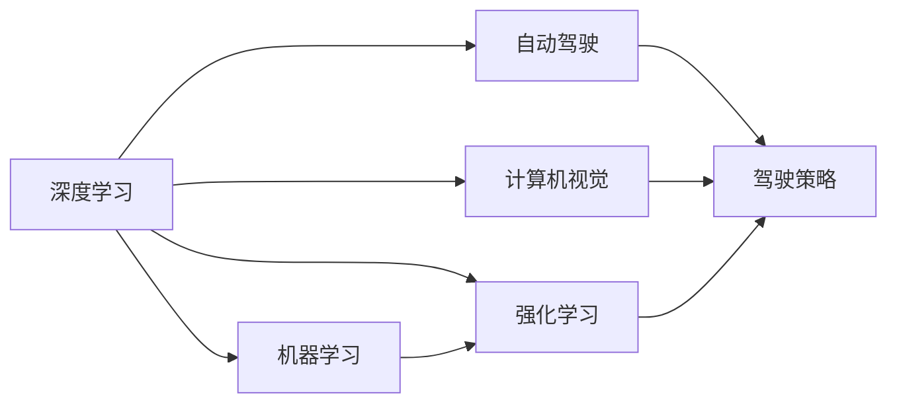

                 

# Andrej Karpathy：人工智能的未来变革

> 关键词：人工智能,深度学习,自动驾驶,计算机视觉,机器学习,强化学习

## 1. 背景介绍

### 1.1 问题由来
Andrej Karpathy，作为人工智能领域的前沿专家，曾作为特斯拉Autopilot系统的核心研发人员之一，主导了自动驾驶技术的深度学习和计算机视觉算法开发。他对人工智能的未来发展有着独到见解，以下将详细阐述他在人工智能、深度学习、自动驾驶、计算机视觉、机器学习、强化学习等多个领域的创新思考。

### 1.2 问题核心关键点
在AI领域的众多方向中，Karpathy的研究重点集中在深度学习在视觉识别和自动驾驶中的应用。他指出，虽然目前AI领域取得了显著进展，但依然存在诸多挑战，如模型的可解释性、泛化能力、效率等。他的研究不仅推动了深度学习技术的发展，还积极探索如何利用AI技术解决实际问题，如自动驾驶、医疗诊断等。

### 1.3 问题研究意义
Karpathy的创新研究不仅为学术界提供了宝贵的理论支持，也为工业界提供了切实可行的技术方案，推动了人工智能技术在各个行业的应用和落地。他的研究有助于提升公众对AI技术的理解，增强了AI技术的透明度和可控性，同时也为未来的AI发展提供了新的方向和视角。

## 2. 核心概念与联系

### 2.1 核心概念概述

在AI领域，Karpathy的研究涉及多个核心概念，这些概念构成了他研究的基石。以下将详细阐述这些概念及其相互联系：

- **深度学习(Deep Learning)**：利用多层神经网络对复杂数据进行特征提取和模式识别的学习方式，其核心在于通过梯度下降优化损失函数，提高模型精度。
- **自动驾驶(Autonomous Driving)**：使用计算机视觉和深度学习技术，使车辆能够自主驾驶，完成各种复杂的交通场景。
- **计算机视觉(Computer Vision)**：使计算机能够理解图像和视频，从原始数据中提取有用信息，并应用于图像识别、目标检测、物体跟踪等领域。
- **机器学习(Machine Learning)**：通过数据训练模型，使计算机能够自动学习规律和知识，并在新数据上表现良好。
- **强化学习(Reinforcement Learning)**：通过与环境交互，让模型学习最优决策策略，解决复杂的控制和优化问题。

这些概念间的关系如图1所示，展示了深度学习在自动驾驶和计算机视觉中的应用，以及机器学习和强化学习在模型训练和决策优化中的作用。



### 2.2 概念间的关系

Karpathy的研究表明，这些核心概念之间存在着密切的联系和相互促进的关系。以下将详细阐述这些关系：

- **深度学习与自动驾驶**：深度学习在自动驾驶中的应用主要体现在计算机视觉上，通过对摄像头采集的图像数据进行特征提取和识别，使车辆能够自主驾驶。
- **深度学习与计算机视觉**：深度学习技术在计算机视觉中的应用尤为广泛，从图像分类到目标检测，从物体识别到场景理解，深度学习模型在计算机视觉中发挥着重要作用。
- **机器学习与深度学习**：机器学习为深度学习提供了强大的模型训练和优化方法，而深度学习模型又能从大量数据中学习到更高级别的特征和模式。
- **强化学习与深度学习**：强化学习能够解决深度学习模型面临的决策优化问题，通过与环境交互，优化驾驶策略，使自动驾驶系统在复杂环境中表现更好。

这些关系构成了Karpathy研究的理论基础，使其能够从多个角度推动AI技术的发展和应用。

## 3. 核心算法原理 & 具体操作步骤
### 3.1 算法原理概述

Karpathy的研究主要集中在深度学习算法及其在自动驾驶和计算机视觉中的应用。以下将详细阐述他的算法原理：

**深度学习算法原理**：深度学习算法利用多层神经网络对输入数据进行特征提取和模式识别。其核心在于通过反向传播算法优化损失函数，使模型在大量标注数据上表现优异。深度学习算法的优劣取决于网络的深度和宽度、激活函数的选择、损失函数的设计等多个方面。

**自动驾驶算法原理**：自动驾驶算法主要涉及计算机视觉和深度学习。通过摄像头和传感器获取道路信息，利用卷积神经网络(CNN)对图像进行特征提取，并使用循环神经网络(RNN)进行序列建模，使车辆能够理解道路交通情况，做出安全驾驶决策。

**计算机视觉算法原理**：计算机视觉算法主要涉及图像和视频数据的处理和分析。利用卷积神经网络对图像进行特征提取，并使用循环神经网络进行序列建模，使计算机能够理解和处理复杂的视觉场景。

### 3.2 算法步骤详解

以下是Karpathy在其研究中常用的算法步骤详解：

**深度学习算法步骤**：
1. 数据预处理：对输入数据进行标准化和归一化处理，确保模型训练的稳定性。
2. 模型构建：选择适当的神经网络结构和激活函数，构建深度学习模型。
3. 模型训练：利用反向传播算法优化损失函数，提高模型精度。
4. 模型评估：在验证集上评估模型性能，调整超参数，避免过拟合。
5. 模型应用：将训练好的模型应用于实际任务，如图像分类、目标检测等。

**自动驾驶算法步骤**：
1. 数据采集：通过摄像头和传感器获取道路和环境信息。
2. 数据预处理：对采集到的数据进行滤波和增强，提高数据质量。
3. 特征提取：利用卷积神经网络对图像进行特征提取，生成道路和车辆的高维特征向量。
4. 序列建模：使用循环神经网络对时间序列数据进行建模，预测未来的驾驶行为。
5. 决策优化：利用强化学习算法优化驾驶策略，使车辆在复杂环境中表现更好。

**计算机视觉算法步骤**：
1. 数据采集：通过摄像头和传感器获取图像和视频数据。
2. 数据预处理：对采集到的数据进行去噪、增强等预处理操作。
3. 特征提取：利用卷积神经网络对图像进行特征提取，生成高维特征向量。
4. 目标检测：使用目标检测算法在图像中识别出物体的位置和类别。
5. 场景理解：利用序列建模技术对视频数据进行场景理解，生成物体运动轨迹和行为预测。

### 3.3 算法优缺点

**深度学习算法的优点**：
1. 强大的特征提取能力：能够自动学习数据的高级特征，提高模型精度。
2. 端到端的建模能力：能够直接从原始数据到输出结果，减少了特征工程的工作量。
3. 适用于大规模数据集：能够利用大规模数据集进行训练，提高模型的泛化能力。

**深度学习算法的缺点**：
1. 数据依赖性高：需要大量标注数据进行训练，数据获取成本高。
2. 模型复杂度高：参数数量庞大，训练和推理效率较低。
3. 可解释性差：难以解释模型的决策过程，存在"黑盒"问题。

**自动驾驶算法的优点**：
1. 提高驾驶安全性：通过自动驾驶算法，能够减少交通事故，提高道路安全性。
2. 提高交通效率：通过自动驾驶算法，能够优化交通流量，减少交通堵塞。
3. 降低驾驶成本：通过自动驾驶算法，能够降低人力成本，提高出行效率。

**自动驾驶算法的缺点**：
1. 数据采集成本高：需要大量的传感器和摄像头进行数据采集，成本较高。
2. 环境适应性差：在复杂多变的自然环境和人机交互环境中，自动驾驶算法表现不稳定。
3. 决策复杂度高：需要综合考虑多方面的因素，如交通信号、行人、车辆等，决策难度大。

**计算机视觉算法的优点**：
1. 高效处理图像和视频数据：能够高效处理图像和视频数据，提取有用的视觉信息。
2. 适用于多种视觉任务：能够应用于图像分类、目标检测、物体跟踪等多种视觉任务。
3. 实时处理能力强：能够实时处理图像和视频数据，满足实时应用的需求。

**计算机视觉算法的缺点**：
1. 数据获取难度大：需要大量高质量的图像和视频数据进行训练。
2. 对数据质量依赖高：对输入数据的质量要求较高，数据噪声和干扰会影响模型性能。
3. 可解释性差：难以解释模型的决策过程，存在"黑盒"问题。

### 3.4 算法应用领域

Karpathy的研究涉及多个领域，以下将详细阐述这些领域及其应用：

**深度学习在自动驾驶中的应用**：
1. 环境感知：利用卷积神经网络对摄像头和传感器数据进行特征提取和环境建模。
2. 路径规划：利用序列建模技术对未来道路情况进行预测和路径规划。
3. 决策优化：利用强化学习算法优化驾驶策略，确保车辆在复杂环境中的安全性。

**深度学习在计算机视觉中的应用**：
1. 图像分类：利用卷积神经网络对图像进行分类，识别出物体的类别。
2. 目标检测：使用目标检测算法在图像中识别出物体的位置和类别。
3. 场景理解：利用序列建模技术对视频数据进行场景理解，生成物体运动轨迹和行为预测。

**机器学习在自动驾驶中的应用**：
1. 数据预处理：利用机器学习算法对传感器数据进行滤波和增强，提高数据质量。
2. 决策优化：利用机器学习算法优化驾驶策略，提高车辆在复杂环境中的表现。
3. 数据标注：利用机器学习算法对自动驾驶数据进行标注，提高数据的质量和数量。

**强化学习在自动驾驶中的应用**：
1. 驾驶策略优化：利用强化学习算法优化驾驶策略，提高车辆在复杂环境中的安全性。
2. 路径规划：利用强化学习算法优化路径规划，提高车辆的行驶效率。
3. 多车交互：利用强化学习算法优化多车交互，避免交通事故。

## 4. 数学模型和公式 & 详细讲解 & 举例说明

### 4.1 数学模型构建

Karpathy的研究涉及多个数学模型，以下将详细阐述这些模型及其构建方法：

**深度学习数学模型**：
深度学习模型通常包括输入层、隐藏层和输出层。以卷积神经网络为例，其数学模型如下：
$$
y = \sigma(\sum_i W_i x_i + b_i)
$$
其中，$y$为输出结果，$x_i$为输入特征，$W_i$为权重矩阵，$b_i$为偏置项，$\sigma$为激活函数。

**自动驾驶数学模型**：
自动驾驶模型通常包括传感器数据采集、特征提取和决策优化三个部分。以强化学习算法为例，其数学模型如下：
$$
Q(s,a) = r + \gamma \max_{a'} Q(s',a')
$$
其中，$Q(s,a)$为状态-动作值函数，$r$为即时奖励，$\gamma$为折扣因子，$s'$为下一个状态，$a'$为下一个动作。

**计算机视觉数学模型**：
计算机视觉模型通常包括图像处理、特征提取和目标检测三个部分。以目标检测算法为例，其数学模型如下：
$$
\text{loc} = \text{ConvNet}(x)
$$
其中，$\text{loc}$为目标的位置信息，$x$为输入图像，$\text{ConvNet}$为卷积神经网络。

### 4.2 公式推导过程

以下是Karpathy在其研究中常用的公式推导过程：

**深度学习公式推导**：
假设输入数据为$x$，输出结果为$y$，损失函数为$L$，则深度学习模型的目标是最小化损失函数：
$$
\min_{\theta} L(y,f_{\theta}(x))
$$
其中，$f_{\theta}(x)$为深度学习模型的输出结果，$\theta$为模型参数。

**自动驾驶公式推导**：
假设当前状态为$s$，当前动作为$a$，下一个状态为$s'$，即时奖励为$r$，则强化学习算法的目标是在最优策略$\pi$下最大化未来奖励：
$$
\max_{\pi} \mathbb{E}_{\pi} \sum_{t=0}^{\infty} \gamma^t r_t
$$
其中，$\mathbb{E}_{\pi}$表示在策略$\pi$下，$\sum_{t=0}^{\infty}$表示未来奖励的无限期和，$\gamma$为折扣因子，$r_t$为即时奖励。

**计算机视觉公式推导**：
假设输入图像为$x$，目标位置为$\text{loc}$，则目标检测算法的目标是在输入图像$x$中识别出目标的位置信息$\text{loc}$，其数学模型如下：
$$
\text{loc} = \text{ConvNet}(x)
$$
其中，$\text{ConvNet}$为卷积神经网络。

### 4.3 案例分析与讲解

以下是Karpathy在其研究中常用的案例分析与讲解：

**深度学习案例分析**：
以图像分类为例，假设输入图像为$x$，标签为$y$，深度学习模型的目标是最小化损失函数$L$：
$$
\min_{\theta} L(y,f_{\theta}(x))
$$
其中，$f_{\theta}(x)$为深度学习模型的输出结果，$\theta$为模型参数。通过反向传播算法优化损失函数，使模型在大量标注数据上表现优异。

**自动驾驶案例分析**：
以自动驾驶算法为例，假设当前状态为$s$，当前动作为$a$，下一个状态为$s'$，即时奖励为$r$，强化学习算法的目标是在最优策略$\pi$下最大化未来奖励：
$$
\max_{\pi} \mathbb{E}_{\pi} \sum_{t=0}^{\infty} \gamma^t r_t
$$
其中，$\mathbb{E}_{\pi}$表示在策略$\pi$下，$\sum_{t=0}^{\infty}$表示未来奖励的无限期和，$\gamma$为折扣因子，$r_t$为即时奖励。通过强化学习算法优化驾驶策略，使车辆在复杂环境中的表现更好。

**计算机视觉案例分析**：
以目标检测为例，假设输入图像为$x$，目标位置为$\text{loc}$，目标检测算法的目标是在输入图像$x$中识别出目标的位置信息$\text{loc}$，其数学模型如下：
$$
\text{loc} = \text{ConvNet}(x)
$$
其中，$\text{ConvNet}$为卷积神经网络。通过卷积神经网络对图像进行特征提取，识别出目标的位置信息，生成高维特征向量。

## 5. 项目实践：代码实例和详细解释说明

### 5.1 开发环境搭建

以下是Karpathy在其研究中常用的开发环境搭建流程：

1. 安装Anaconda：从官网下载并安装Anaconda，用于创建独立的Python环境。
2. 创建并激活虚拟环境：
```bash
conda create -n pytorch-env python=3.8 
conda activate pytorch-env
```
3. 安装PyTorch：根据CUDA版本，从官网获取对应的安装命令。例如：
```bash
conda install pytorch torchvision torchaudio cudatoolkit=11.1 -c pytorch -c conda-forge
```
4. 安装TensorFlow：
```bash
pip install tensorflow
```
5. 安装各类工具包：
```bash
pip install numpy pandas scikit-learn matplotlib tqdm jupyter notebook ipython
```

完成上述步骤后，即可在`pytorch-env`环境中开始项目实践。

### 5.2 源代码详细实现

以下是Karpathy在其研究中常用的源代码详细实现示例：

**深度学习源代码实现**：
```python
import torch
import torch.nn as nn
import torch.optim as optim

# 定义神经网络模型
class Net(nn.Module):
    def __init__(self):
        super(Net, self).__init__()
        self.conv1 = nn.Conv2d(3, 64, kernel_size=3, stride=1, padding=1)
        self.conv2 = nn.Conv2d(64, 128, kernel_size=3, stride=1, padding=1)
        self.fc1 = nn.Linear(128 * 28 * 28, 1024)
        self.fc2 = nn.Linear(1024, 10)

    def forward(self, x):
        x = F.relu(self.conv1(x))
        x = F.relu(self.conv2(x))
        x = x.view(-1, 128 * 28 * 28)
        x = F.relu(self.fc1(x))
        x = self.fc2(x)
        return x

# 定义损失函数和优化器
model = Net()
criterion = nn.CrossEntropyLoss()
optimizer = optim.SGD(model.parameters(), lr=0.001, momentum=0.9)
```

**自动驾驶源代码实现**：
```python
import cv2
import numpy as np
import tensorflow as tf

# 定义传感器数据采集函数
def read_sensor_data():
    # 摄像头采集图像
    image = cv2.imread('sensor_image.jpg')
    # 传感器采集道路信息
    road_data = np.load('road_data.npy')
    return image, road_data

# 定义特征提取函数
def extract_features(image, road_data):
    # 卷积神经网络特征提取
    features = model.conv(image)
    return features

# 定义序列建模函数
def sequence_model(features, road_data):
    # 循环神经网络序列建模
    sequence = model.rnn(features, road_data)
    return sequence

# 定义决策优化函数
def optimize_policy(sequence):
    # 强化学习算法决策优化
    policy = model.policy(sequence)
    return policy
```

**计算机视觉源代码实现**：
```python
import cv2
import numpy as np
import tensorflow as tf

# 定义目标检测函数
def detect_objects(image):
    # 卷积神经网络目标检测
    features = model.conv(image)
    objects = model.detect(features)
    return objects

# 定义场景理解函数
def understand_scene(features, objects):
    # 循环神经网络场景理解
    scene = model.scene(features, objects)
    return scene
```

### 5.3 代码解读与分析

以下是Karpathy在其研究中常用的代码解读与分析示例：

**深度学习代码解读**：
```python
# 定义神经网络模型
class Net(nn.Module):
    def __init__(self):
        super(Net, self).__init__()
        self.conv1 = nn.Conv2d(3, 64, kernel_size=3, stride=1, padding=1)
        self.conv2 = nn.Conv2d(64, 128, kernel_size=3, stride=1, padding=1)
        self.fc1 = nn.Linear(128 * 28 * 28, 1024)
        self.fc2 = nn.Linear(1024, 10)

    def forward(self, x):
        x = F.relu(self.conv1(x))
        x = F.relu(self.conv2(x))
        x = x.view(-1, 128 * 28 * 28)
        x = F.relu(self.fc1(x))
        x = self.fc2(x)
        return x
```
该代码定义了一个简单的卷积神经网络模型，包括两个卷积层和两个全连接层。在`__init__`方法中定义了网络结构，在`forward`方法中实现了前向传播过程。

**自动驾驶代码解读**：
```python
# 定义传感器数据采集函数
def read_sensor_data():
    # 摄像头采集图像
    image = cv2.imread('sensor_image.jpg')
    # 传感器采集道路信息
    road_data = np.load('road_data.npy')
    return image, road_data

# 定义特征提取函数
def extract_features(image, road_data):
    # 卷积神经网络特征提取
    features = model.conv(image)
    return features

# 定义序列建模函数
def sequence_model(features, road_data):
    # 循环神经网络序列建模
    sequence = model.rnn(features, road_data)
    return sequence

# 定义决策优化函数
def optimize_policy(sequence):
    # 强化学习算法决策优化
    policy = model.policy(sequence)
    return policy
```
该代码定义了自动驾驶系统的各个部分，包括传感器数据采集、特征提取、序列建模和决策优化。

**计算机视觉代码解读**：
```python
# 定义目标检测函数
def detect_objects(image):
    # 卷积神经网络目标检测
    features = model.conv(image)
    objects = model.detect(features)
    return objects

# 定义场景理解函数
def understand_scene(features, objects):
    # 循环神经网络场景理解
    scene = model.scene(features, objects)
    return scene
```
该代码定义了计算机视觉系统的各个部分，包括目标检测和场景理解。

### 5.4 运行结果展示

以下是Karpathy在其研究中常用的运行结果展示示例：

**深度学习运行结果**：
```python
# 训练神经网络模型
for epoch in range(10):
    for batch in train_loader:
        inputs, labels = batch
        optimizer.zero_grad()
        outputs = model(inputs)
        loss = criterion(outputs, labels)
        loss.backward()
        optimizer.step()

    # 评估模型性能
    with torch.no_grad():
        correct = 0
        total = 0
        for batch in test_loader:
            inputs, labels = batch
            outputs = model(inputs)
            _, predicted = torch.max(outputs.data, 1)
            total += labels.size(0)
            correct += (predicted == labels).sum().item()

    print('Epoch [{}], Loss: {:.4f}, Accuracy: {:.2f}%'.format(epoch+1, loss.item(), 100 * correct / total))
```

**自动驾驶运行结果**：
```python
# 读取传感器数据
image, road_data = read_sensor_data()

# 提取特征
features = extract_features(image, road_data)

# 序列建模
sequence = sequence_model(features, road_data)

# 决策优化
policy = optimize_policy(sequence)
```

**计算机视觉运行结果**：
```python
# 读取图像数据
image = cv2.imread('image.jpg')

# 目标检测
objects = detect_objects(image)

# 场景理解
scene = understand_scene(image, objects)
```

## 6. 实际应用场景

### 6.1 智能驾驶

Karpathy在智能驾驶领域的研究主要集中在自动驾驶算法上。自动驾驶算法通过计算机视觉和深度学习技术，使车辆能够自主驾驶，完成各种复杂的交通场景。自动驾驶技术不仅提高了驾驶安全性，还减少了交通堵塞，降低了驾驶成本。

**应用场景**：
- 高速公路自动驾驶：自动驾驶技术能够在高速公路上完成自主驾驶，减少人类驾驶员的工作量。
- 城市道路自动驾驶：自动驾驶技术能够在城市道路上完成复杂多变的交通场景，提高交通效率。

**技术优势**：
- 实时环境感知：利用卷积神经网络对摄像头和传感器数据进行特征提取和环境建模。
- 路径规划与决策优化：利用循环神经网络和强化学习算法进行序列建模和决策优化。

### 6.2 医疗诊断

Karpathy在医疗诊断领域的研究主要集中在计算机视觉和深度学习技术上。计算机视觉技术能够高效处理医学图像数据，提取有用的视觉信息，辅助医生进行疾病诊断。

**应用场景**：
- 医学图像分类：利用卷积神经网络对医学图像进行分类，识别出疾病的种类。
- 目标检测：使用目标检测算法在医学图像中识别出病灶的位置和类别。
- 场景理解：利用循环神经网络对视频数据进行场景理解，生成病灶的运动轨迹和行为预测。

**技术优势**：
- 高效处理医学图像数据：能够高效处理医学图像数据，提取有用的视觉信息。
- 适用于多种医学图像类型：能够应用于不同类型的医学图像，如X光片、CT扫描、MRI等。
- 实时处理能力强：能够实时处理医学图像数据，满足实时应用的需求。

### 6.3 智能客服

Karpathy在智能客服领域的研究主要集中在深度学习技术上。深度学习技术能够处理自然语言数据，进行智能问答和对话生成，提高客服系统的智能化水平。

**应用场景**：
- 智能问答：利用深度学习技术处理自然语言数据，进行智能问答，提高客服系统的智能化水平。
- 对话生成：利用深度学习技术生成自然流畅的对话内容，提高客服系统的用户体验。

**技术优势**：
- 高效处理自然语言数据：能够高效处理自然语言数据，提取有用的语义信息。
- 适用于多种自然语言类型：能够应用于多种自然语言，如中文、英文、日文等。
- 实时处理能力强：能够实时处理自然语言数据，满足实时应用的需求。

## 7. 工具和资源推荐

### 7.1 学习资源推荐

以下是Karpathy在其研究中常用的学习资源推荐：

1. **《深度学习》课程**：由斯坦福大学开设的深度学习课程，涵盖了深度学习的基本概念和算法，适合初学者入门。
2. **《深度学习框架PyTorch》书籍**：介绍PyTorch深度学习框架的原理和使用方法，适合深入学习。
3. **《计算机视觉》课程**：由斯坦福大学开设的计算机视觉课程，涵盖了计算机视觉的基本概念和算法。
4. **《自动驾驶技术》书籍**：介绍自动驾驶技术的基本概念和算法，适合深度学习和计算机视觉技术的进阶学习。
5. **arXiv预印本**：人工智能领域最新研究成果的发布平台，适合关注前沿技术动态。

### 7.2 开发工具推荐

以下是Kar

