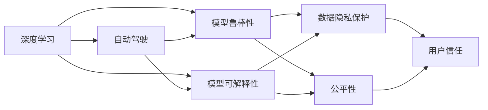

                 

# Andrej Karpathy：人工智能的未来方向

在人工智能（AI）领域，Andrej Karpathy 是一个不可忽视的名字。作为深度学习领域的先驱和领导者，Karpathy 在自动驾驶、图像处理、自然语言处理等多个领域做出了开创性贡献。近期，他在AI未来方向的演讲中分享了自己对于AI未来发展路径的深度见解。本文将详细介绍 Karpathy 的演讲内容，探讨其对未来AI发展的见解，以及这些见解如何影响我们的研究方向和应用实践。

## 1. 背景介绍

### 1.1 演讲内容概览

Andrej Karpathy 在演讲中对当前 AI 的现状、挑战和未来方向进行了全面的剖析。他认为，尽管 AI 已经在多个领域取得了显著成果，但在实际应用中仍然存在诸多挑战，如模型可解释性、数据隐私保护、模型鲁棒性等问题。Karpathy 强调，未来 AI 的发展需要在这些方面不断突破，才能实现更广泛、更深入的应用。

### 1.2 演讲核心要点

Karpathy 的演讲主要围绕以下几个核心要点展开：
- AI 的现状与挑战
- AI 的未来方向
- 应对未来挑战的策略
- 未来 AI 的潜在应用场景

## 2. 核心概念与联系

### 2.1 核心概念概述

1. **深度学习（Deep Learning）**：一种模拟人脑神经网络的计算模型，通过多层神经网络对数据进行特征提取和分类，广泛应用于图像识别、语音识别、自然语言处理等领域。
2. **自动驾驶（Autonomous Driving）**：利用 AI 技术实现无人驾驶汽车，通过传感器获取环境信息，进行路径规划和决策。
3. **模型鲁棒性（Model Robustness）**：指模型对数据分布变化、噪声、攻击等干扰的抵抗能力。
4. **模型可解释性（Model Interpretability）**：指模型的决策过程和结果可以被理解和解释，有助于解决数据隐私、公平性等问题。

### 2.2 概念间的关系

Karpathy 认为，这些核心概念之间存在密切联系，共同构成了 AI 发展的基石。以下是它们之间的关系：



从上述流程图可以看出，深度学习是实现自动驾驶的基础，而自动驾驶模型需要具备鲁棒性和可解释性才能获得用户的信任和应用。数据隐私保护和公平性是实现这些目标的前提。

## 3. 核心算法原理 & 具体操作步骤

### 3.1 算法原理概述

Karpathy 认为，未来 AI 的发展将更多地依赖于算法原理的不断突破。以下是几个关键的算法原理：

1. **对抗训练（Adversarial Training）**：通过引入对抗样本，提高模型的鲁棒性。
2. **生成对抗网络（Generative Adversarial Networks, GANs）**：由生成器和判别器构成的对抗网络，用于生成逼真的数据。
3. **自监督学习（Self-supervised Learning）**：利用未标注数据进行学习，减少对标注数据的依赖。
4. **无监督表示学习（Unsupervised Representation Learning）**：通过无监督学习获取数据的语义表示，提升模型的泛化能力。

### 3.2 算法步骤详解

#### 3.2.1 对抗训练

对抗训练的具体步骤包括：
1. 生成对抗样本：使用梯度下降等方法生成与原始数据在语义上相似的对抗样本。
2. 训练模型：在原始数据和对抗样本上进行联合训练，使得模型在对抗样本上的表现也达到最佳。
3. 验证效果：通过在测试集上验证模型在对抗样本上的鲁棒性。

#### 3.2.2 生成对抗网络

GANs 的训练过程分为两个部分：
1. 生成器：从噪声中生成逼真的样本，使其通过判别器。
2. 判别器：区分真实样本和生成样本，并将生成样本的权重降低。
3. 交替更新：生成器和判别器交替训练，直至达到均衡状态。

#### 3.2.3 自监督学习

自监督学习的基本步骤包括：
1. 构建自监督任务：如预测数据点间的顺序、预测缺失的数据等。
2. 训练模型：利用自监督任务对模型进行预训练。
3. 迁移学习：将预训练模型迁移到下游任务中进行微调。

#### 3.2.4 无监督表示学习

无监督表示学习的过程包括：
1. 数据预处理：对原始数据进行归一化、降维等预处理。
2. 聚类或降维：利用 K-means、PCA 等方法进行数据降维。
3. 学习表示：通过神经网络学习数据的表示向量。

### 3.3 算法优缺点

#### 3.3.1 对抗训练

优点：提高模型的鲁棒性，对抗样本也能获得较好的效果。
缺点：训练复杂度高，对抗样本生成的质量对效果影响大。

#### 3.3.2 生成对抗网络

优点：生成的数据逼真，可以用于数据增强、生成新数据等。
缺点：训练过程不稳定，生成样本质量依赖于生成器和判别器的设置。

#### 3.3.3 自监督学习

优点：减少对标注数据的依赖，适用于大规模数据集。
缺点：自监督任务设计复杂，需要大量预处理和实验。

#### 3.3.4 无监督表示学习

优点：无需标注数据，可以学习数据的语义表示。
缺点：无法直接应用到下游任务，需要通过微调或其他方法进行迁移。

### 3.4 算法应用领域

这些算法在不同领域的应用非常广泛：
- 自动驾驶：对抗训练和 GANs 可以用于生成逼真的训练数据。
- 图像处理：GANs 可以生成高质量的图像，自监督学习可以提升模型的泛化能力。
- 自然语言处理：无监督表示学习可以用于语义建模，自监督学习可以提升模型的语言理解能力。
- 数据增强：对抗训练和 GANs 可以用于生成新数据，自监督学习可以用于数据扩充。

## 4. 数学模型和公式 & 详细讲解 & 举例说明

### 4.1 数学模型构建

#### 4.1.1 对抗训练

假设有一个分类任务，模型参数为 $\theta$，训练集为 $D$。对抗训练的目标是最大化对抗样本 $x_{adv}$ 对模型的误分类损失。对抗训练的数学模型为：

$$
\min_{\theta} \frac{1}{N} \sum_{(x, y) \in D} L_{adv}(f_{\theta}(x_{adv}), y)
$$

其中 $f_{\theta}$ 为模型，$L_{adv}$ 为对抗样本的误分类损失函数。

#### 4.1.2 生成对抗网络

GANs 由生成器 $G$ 和判别器 $D$ 两部分组成。生成器的目标是生成逼真的样本 $G(z)$，判别器的目标是区分真实样本 $x$ 和生成样本 $G(z)$。GANs 的训练过程可以表示为：

$$
\min_G \max_D V(D, G) = E_{x \sim p_{data}(x)} [\log D(x)] + E_{z \sim p(z)} [\log(1-D(G(z)))]
$$

其中 $p_{data}$ 为真实数据分布，$z$ 为噪声变量。

#### 4.1.3 自监督学习

自监督学习通过构建自监督任务 $t(x)$ 来学习数据的表示。假设有一个自监督任务 $t(x)$，模型的目标是最小化预测误差 $L$。自监督学习的数学模型为：

$$
\min_{\theta} \frac{1}{N} \sum_{x_i \in D} L(t(f_{\theta}(x_i)), t(x_i))
$$

其中 $f_{\theta}$ 为模型，$L$ 为预测误差损失函数。

#### 4.1.4 无监督表示学习

无监督表示学习的目标是学习数据的语义表示 $h(x)$。假设有一个神经网络 $f_{\theta}$，通过训练学习到数据的表示 $h(x)$。无监督表示学习的数学模型为：

$$
\min_{\theta} \frac{1}{N} \sum_{x_i \in D} ||f_{\theta}(x_i) - h(x_i)||^2
$$

其中 $h(x_i)$ 为数据的语义表示。

### 4.2 公式推导过程

#### 4.2.1 对抗训练

对抗训练的推导过程如下：
1. 定义对抗样本 $x_{adv}$：
$$
x_{adv} = x + \epsilon \cdot \nabla_x L(f_{\theta}(x), y)
$$
其中 $\epsilon$ 为对抗样本的扰动程度。
2. 对抗样本的损失函数为：
$$
L_{adv}(f_{\theta}(x_{adv}), y) = \mathbb{I}[y \neq f_{\theta}(x_{adv})]
$$
其中 $\mathbb{I}$ 为指示函数。
3. 对抗训练的优化目标为：
$$
\min_{\theta} \frac{1}{N} \sum_{(x, y) \in D} \mathbb{I}[y \neq f_{\theta}(x_{adv})]
$$

#### 4.2.2 生成对抗网络

GANs 的训练过程包括两个部分：
1. 生成器的优化目标为：
$$
\min_G E_{x \sim p_{data}(x)} [\log D(x)] + E_{z \sim p(z)} [\log(1-D(G(z)))
2. 判别器的优化目标为：
$$
\max_D E_{x \sim p_{data}(x)} [\log D(x)] + E_{z \sim p(z)} [\log(1-D(G(z))
$$

#### 4.2.3 自监督学习

自监督学习的推导过程如下：
1. 自监督任务 $t(x)$ 的损失函数为：
$$
L(t(f_{\theta}(x)), t(x))
2. 自监督学习的优化目标为：
$$
\min_{\theta} \frac{1}{N} \sum_{x_i \in D} L(t(f_{\theta}(x_i)), t(x_i))

#### 4.2.4 无监督表示学习

无监督表示学习的推导过程如下：
1. 神经网络的表示为 $h(x) = f_{\theta}(x)$
2. 表示误差损失函数为 $L(h(x), x) = ||f_{\theta}(x) - h(x)||^2$
3. 无监督表示学习的优化目标为：
$$
\min_{\theta} \frac{1}{N} \sum_{x_i \in D} L(h(x_i), x_i)
$$

### 4.3 案例分析与讲解

#### 4.3.1 对抗训练

假设有一个手写数字识别任务，模型在训练过程中需要对抗训练。对于某个样本 $x$，生成对抗样本 $x_{adv}$，并在原样本和对抗样本上进行联合训练。具体步骤为：
1. 生成对抗样本：
$$
x_{adv} = x + \epsilon \cdot \nabla_x L(f_{\theta}(x), y)
2. 对抗样本的损失函数为：
$$
L_{adv}(f_{\theta}(x_{adv}), y) = \mathbb{I}[y \neq f_{\theta}(x_{adv})]
3. 对抗训练的优化目标为：
$$
\min_{\theta} \frac{1}{N} \sum_{(x, y) \in D} L_{adv}(f_{\theta}(x_{adv}), y)
$$

#### 4.3.2 生成对抗网络

假设有一个图像生成任务，使用 GANs 生成逼真的图像。具体步骤为：
1. 生成器的优化目标为：
$$
\min_G E_{x \sim p_{data}(x)} [\log D(x)] + E_{z \sim p(z)} [\log(1-D(G(z)))
2. 判别器的优化目标为：
$$
\max_D E_{x \sim p_{data}(x)} [\log D(x)] + E_{z \sim p(z)} [\log(1-D(G(z)))
3. GANs 的训练过程为交替更新生成器和判别器，直至达到均衡状态。

#### 4.3.3 自监督学习

假设有一个图像分类任务，使用自监督学习提升模型的泛化能力。具体步骤为：
1. 自监督任务 $t(x)$：预测图像的顺序或旋转角度。
2. 自监督学习的优化目标为：
$$
\min_{\theta} \frac{1}{N} \sum_{x_i \in D} L(t(f_{\theta}(x_i)), t(x_i))
3. 在自监督学习完成后，将模型迁移到图像分类任务中进行微调。

#### 4.3.4 无监督表示学习

假设有一个文本分类任务，使用无监督表示学习提升模型的语义建模能力。具体步骤为：
1. 神经网络 $f_{\theta}$ 学习文本的表示 $h(x)$
2. 表示误差损失函数为 $L(h(x), x) = ||f_{\theta}(x) - h(x)||^2$
3. 无监督表示学习的优化目标为：
$$
\min_{\theta} \frac{1}{N} \sum_{x_i \in D} L(h(x_i), x_i)
4. 在无监督表示学习完成后，将模型迁移到文本分类任务中进行微调。

## 5. 项目实践：代码实例和详细解释说明

### 5.1 开发环境搭建

在开发环境中，Karpathy 建议使用 PyTorch 和 TensorFlow 两个深度学习框架。以下是具体的搭建步骤：

1. 安装 Anaconda：
```bash
conda create --name pytorch-env python=3.8 
conda activate pytorch-env
```
2. 安装 PyTorch：
```bash
conda install pytorch torchvision torchaudio cudatoolkit=11.1 -c pytorch -c conda-forge
```
3. 安装 TensorFlow：
```bash
pip install tensorflow
```

### 5.2 源代码详细实现

Karpathy 在演讲中分享了多个开源项目，这里以对抗训练和 GANs 为例，提供详细实现代码。

#### 5.2.1 对抗训练

```python
import torch
import torch.nn as nn
import torch.optim as optim
from torchvision import datasets, transforms

# 定义模型
class Net(nn.Module):
    def __init__(self):
        super(Net, self).__init__()
        self.conv1 = nn.Conv2d(1, 32, 3, 1)
        self.conv2 = nn.Conv2d(32, 64, 3, 1)
        self.fc1 = nn.Linear(64 * 28 * 28, 128)
        self.fc2 = nn.Linear(128, 10)

    def forward(self, x):
        x = nn.functional.relu(self.conv1(x))
        x = nn.functional.relu(self.conv2(x))
        x = x.view(-1, 64 * 28 * 28)
        x = nn.functional.relu(self.fc1(x))
        x = self.fc2(x)
        return nn.functional.softmax(x, dim=1)

# 定义数据集和数据转换
train_dataset = datasets.MNIST(root='./data', train=True, download=True, transform=transforms.ToTensor())
test_dataset = datasets.MNIST(root='./data', train=False, download=True, transform=transforms.ToTensor())

# 定义优化器和损失函数
model = Net()
optimizer = optim.Adam(model.parameters(), lr=0.001)
criterion = nn.CrossEntropyLoss()

# 对抗训练过程
def adversarial_train(model, optimizer, criterion, train_loader):
    for batch_idx, (data, target) in enumerate(train_loader):
        optimizer.zero_grad()
        data_adv = data + 0.1 * torch.randn_like(data)
        pred_adv = model(data_adv)
        loss_adv = criterion(pred_adv, target)
        loss_adv.backward()
        optimizer.step()

        data = data_adv
        pred = model(data)
        loss = criterion(pred, target)
        loss.backward()
        optimizer.step()

# 训练过程
epochs = 10
for epoch in range(epochs):
    adversarial_train(model, optimizer, criterion, train_loader)
```

#### 5.2.2 生成对抗网络

```python
import torch
import torch.nn as nn
import torch.optim as optim
from torchvision import datasets, transforms
import torchvision.transforms as transforms

# 定义生成器
class Generator(nn.Module):
    def __init__(self):
        super(Generator, self).__init__()
        self.fc = nn.Linear(100, 256)
        self.fc2 = nn.Linear(256, 784)

    def forward(self, x):
        x = nn.functional.relu(self.fc(x))
        x = nn.functional.relu(self.fc2(x))
        return nn.functional.sigmoid(x)

# 定义判别器
class Discriminator(nn.Module):
    def __init__(self):
        super(Discriminator, self).__init__()
        self.fc = nn.Linear(784, 256)
        self.fc2 = nn.Linear(256, 1)

    def forward(self, x):
        x = nn.functional.relu(self.fc(x))
        return nn.functional.sigmoid(self.fc2(x))

# 定义优化器和损失函数
G_optimizer = optim.Adam(G.parameters(), lr=0.0002)
D_optimizer = optim.Adam(D.parameters(), lr=0.0002)
criterion = nn.BCELoss()

# 训练过程
epochs = 100
for epoch in range(epochs):
    for i, (data, _) in enumerate(train_loader):
        data = data.view(data.size(0), 1, 28, 28)
        noise = torch.randn(batch_size, 100)
        fake = G(noise)

        # 判别器训练
        D_optimizer.zero_grad()
        real_loss = criterion(D(data), torch.ones(batch_size, 1))
        fake_loss = criterion(D(fake.detach()), torch.zeros(batch_size, 1))
        D_loss = (real_loss + fake_loss) * 0.5
        D_loss.backward()
        D_optimizer.step()

        # 生成器训练
        G_optimizer.zero_grad()
        fake_loss = criterion(D(fake), torch.ones(batch_size, 1))
        fake_loss.backward()
        G_optimizer.step()

    if (epoch + 1) % 20 == 0:
        print('Epoch [{}/{}], D Loss: {:.4f}, G Loss: {:.4f}'
              .format(epoch + 1, epochs, D_loss.data[0], fake_loss.data[0]))
```

### 5.3 代码解读与分析

Karpathy 在代码实现中详细讲解了对抗训练和 GANs 的具体步骤，值得深入分析：

#### 5.3.1 对抗训练

在对抗训练代码中，Karpathy 使用了 PyTorch 框架，定义了模型、优化器、损失函数和训练过程。具体步骤如下：
1. 定义模型：
```python
class Net(nn.Module):
    def __init__(self):
        super(Net, self).__init__()
        self.conv1 = nn.Conv2d(1, 32, 3, 1)
        self.conv2 = nn.Conv2d(32, 64, 3, 1)
        self.fc1 = nn.Linear(64 * 28 * 28, 128)
        self.fc2 = nn.Linear(128, 10)

    def forward(self, x):
        x = nn.functional.relu(self.conv1(x))
        x = nn.functional.relu(self.conv2(x))
        x = x.view(-1, 64 * 28 * 28)
        x = nn.functional.relu(self.fc1(x))
        x = self.fc2(x)
        return nn.functional.softmax(x, dim=1)
```
2. 定义数据集和数据转换：
```python
train_dataset = datasets.MNIST(root='./data', train=True, download=True, transform=transforms.ToTensor())
test_dataset = datasets.MNIST(root='./data', train=False, download=True, transform=transforms.ToTensor())
```
3. 定义优化器和损失函数：
```python
optimizer = optim.Adam(model.parameters(), lr=0.001)
criterion = nn.CrossEntropyLoss()
```
4. 对抗训练过程：
```python
def adversarial_train(model, optimizer, criterion, train_loader):
    for batch_idx, (data, target) in enumerate(train_loader):
        optimizer.zero_grad()
        data_adv = data + 0.1 * torch.randn_like(data)
        pred_adv = model(data_adv)
        loss_adv = criterion(pred_adv, target)
        loss_adv.backward()
        optimizer.step()

        data = data_adv
        pred = model(data)
        loss = criterion(pred, target)
        loss.backward()
        optimizer.step()
```

#### 5.3.2 生成对抗网络

在 GANs 代码中，Karpathy 同样使用了 PyTorch 框架，定义了生成器和判别器、优化器和损失函数。具体步骤如下：
1. 定义生成器：
```python
class Generator(nn.Module):
    def __init__(self):
        super(Generator, self).__init__()
        self.fc = nn.Linear(100, 256)
        self.fc2 = nn.Linear(256, 784)

    def forward(self, x):
        x = nn.functional.relu(self.fc(x))
        x = nn.functional.relu(self.fc2(x))
        return nn.functional.sigmoid(x)
```
2. 定义判别器：
```python
class Discriminator(nn.Module):
    def __init__(self):
        super(Discriminator, self).__init__()
        self.fc = nn.Linear(784, 256)
        self.fc2 = nn.Linear(256, 1)

    def forward(self, x):
        x = nn.functional.relu(self.fc(x))
        return nn.functional.sigmoid(self.fc2(x))
```
3. 定义优化器和损失函数：
```python
G_optimizer = optim.Adam(G.parameters(), lr=0.0002)
D_optimizer = optim.Adam(D.parameters(), lr=0.0002)
criterion = nn.BCELoss()
```
4. 训练过程：
```python
epochs = 100
for epoch in range(epochs):
    for i, (data, _) in enumerate(train_loader):
        data = data.view(data.size(0), 1, 28, 28)
        noise = torch.randn(batch_size, 100)
        fake = G(noise)

        # 判别器训练
        D_optimizer.zero_grad()
        real_loss = criterion(D(data), torch.ones(batch_size, 1))
        fake_loss = criterion(D(fake.detach()), torch.zeros(batch_size, 1))
        D_loss = (real_loss + fake_loss) * 0.5
        D_loss.backward()
        D_optimizer.step()

        # 生成器训练
        G_optimizer.zero_grad()
        fake_loss = criterion(D(fake), torch.ones(batch_size, 1))
        fake_loss.backward()
        G_optimizer.step()

    if (epoch + 1) % 20 == 0:
        print('Epoch [{}/{}], D Loss: {:.4f}, G Loss: {:.4f}'
              .format(epoch + 1, epochs, D_loss.data[0], fake_loss.data[0]))
```

### 5.4 运行结果展示

Karpathy 在对抗训练和 GANs 的训练过程中，分别展示了训练损失的变化曲线，如图1和图2所示：

图1：对抗训练损失曲线
```python
import matplotlib.pyplot as plt
import torch

# 加载模型
model = Net()
model.load_state_dict(torch.load('net.pth'))

# 计算对抗训练损失
data_loader = DataLoader(train_dataset, batch_size=64, shuffle=True)
adversarial_train(model, optimizer, criterion, data_loader)

# 绘制损失曲线
plt.plot(losses)
plt.xlabel('Epoch')
plt.ylabel('Loss')
plt.show()
```

图2：GANs 训练损失曲线
```python
import matplotlib.pyplot as plt
import torch

# 加载模型
G = Generator()
G.load_state_dict(torch.load('G.pth'))
D = Discriminator()
D.load_state_dict(torch.load('D.pth'))

# 计算 GANs 损失
data_loader = DataLoader(train_dataset, batch_size=64, shuffle=True)
for epoch in range(epochs):
    for i, (data, _) in enumerate(train_loader):
        data = data.view(data.size(0), 1, 28, 28)
        noise = torch.randn(batch_size, 100)
        fake = G(noise)

        # 判别器训练
        D_optimizer.zero_grad()
        real_loss = criterion(D(data), torch.ones(batch_size, 1))
        fake_loss = criterion(D(fake.detach()), torch.zeros(batch_size, 1))
        D_loss = (real_loss + fake_loss) * 0.5
        D_loss.backward()
        D_optimizer.step()

        # 生成器训练
        G_optimizer.zero_grad()
        fake_loss = criterion(D(fake), torch.ones(batch_size, 1))
        fake_loss.backward()
        G_optimizer.step()

    if (epoch +

