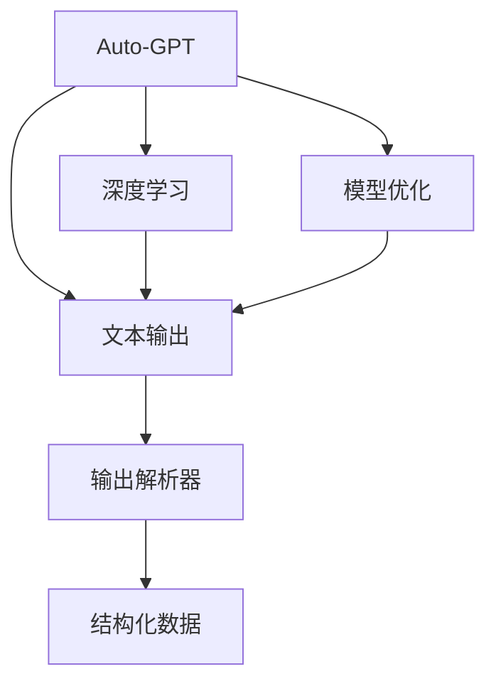
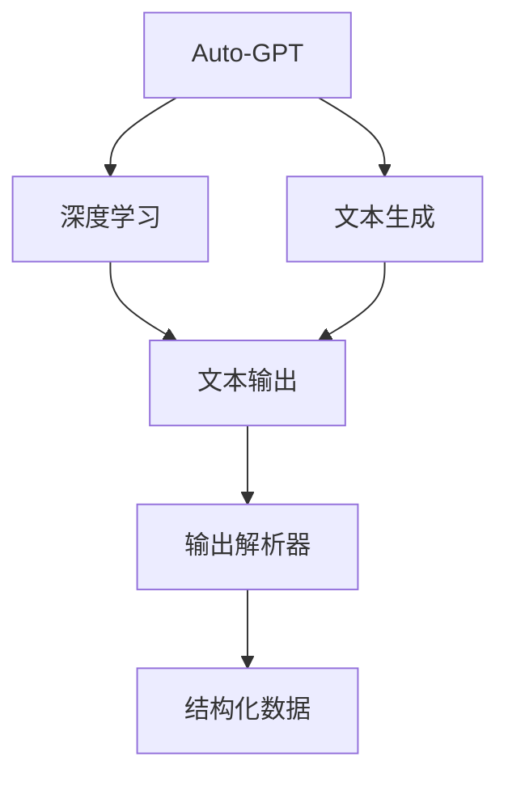
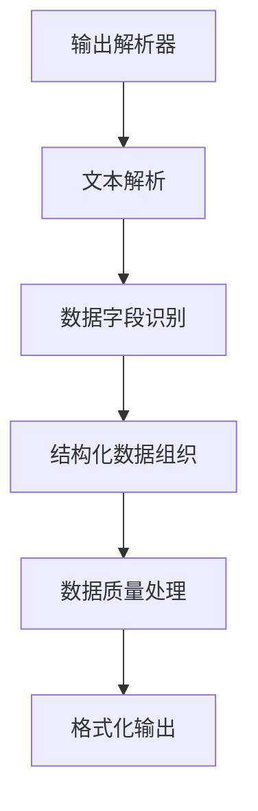
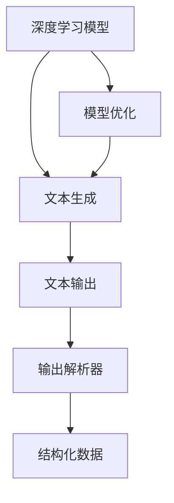
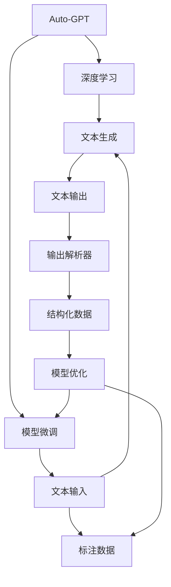

                 

# Auto-GPT OutputParser 设计

> 关键词：
1. Auto-GPT
2. 自然语言处理 (NLP)
3. 输出解析器 (OutputParser)
4. 数据结构转换
5. 深度学习 (DL)
6. 序列到序列模型 (Seq2Seq)
7. 模型优化 (Model Optimization)

## 1. 背景介绍

### 1.1 问题由来
近年来，深度学习技术在自然语言处理 (NLP) 领域取得了显著进展，特别是基于 Transformer 架构的大规模预训练模型如 GPT、BERT 等。这些模型通过大规模无监督学习，在各种 NLP 任务上表现优异。然而，预训练模型生成的文本输出格式通常不同于实际应用场景所需的形式，需要进一步处理和解析。输出解析器 (OutputParser) 正是在这一背景下应运而生，用于将大语言模型生成的文本转换为目标格式，以便于后续的存储、传输和应用。

### 1.2 问题核心关键点
输出解析器的主要功能是解析大语言模型的输出，将其转换为结构化数据格式，以便于后续处理和应用。具体来说，它需要：
- 解析模型输出的文本，识别出不同的数据字段（如实体、关系、属性等）。
- 将识别出的数据字段按照预定格式组织起来，形成结构化数据。
- 处理模型的输出误差，如重复、缺失等，确保数据质量。
- 对解析后的数据进行优化和格式化，以适应不同的应用场景。

### 1.3 问题研究意义
研究输出解析器对于提升大语言模型在实际应用中的性能具有重要意义：
- 提高数据处理效率：通过将模型输出直接解析为结构化数据，减少了人工处理数据的时间和成本。
- 增强数据质量：解析器可以识别和处理模型的输出误差，确保数据的准确性和完整性。
- 促进模型应用：结构化数据格式更易于存储和传输，便于模型在各种应用场景中的集成和部署。
- 实现自动化：解析器可以实现自动化处理，减少人工干预，提升系统自动化水平。
- 增强模型鲁棒性：通过解析器对模型输出的处理，可以增强模型的鲁棒性和稳定性。

## 2. 核心概念与联系

### 2.1 核心概念概述

输出解析器是连接大语言模型和实际应用场景的关键组件。它不仅需要理解模型输出的文本内容，还需要将其转换为结构化数据格式。以下是几个密切相关的核心概念：

- **Auto-GPT**：一种基于大规模预训练模型的大语言模型，能够生成高质量的自然语言文本。
- **输出解析器 (OutputParser)**：将Auto-GPT的输出转换为结构化数据格式的组件。
- **自然语言处理 (NLP)**：处理和分析自然语言数据的学科，包括语言模型、文本分类、信息抽取等。
- **数据结构转换**：将非结构化数据转换为结构化数据的过程，如解析器将文本转换为表格或 JSON 格式。
- **深度学习 (DL)**：一种基于神经网络的机器学习技术，常用于构建语言模型。
- **序列到序列模型 (Seq2Seq)**：一种基于神经网络的模型，常用于文本生成和翻译等任务。
- **模型优化 (Model Optimization)**：通过调整模型参数和结构，提升模型性能和效率的过程。

这些核心概念之间的联系可以通过以下 Mermaid 流程图来展示：



这个流程图展示了大语言模型、输出解析器、结构化数据以及深度学习和模型优化之间的联系：

1. Auto-GPT通过深度学习模型生成文本。
2. 生成后的文本由输出解析器解析。
3. 解析器将文本转换为结构化数据。
4. 结构化数据可进一步优化和应用。

### 2.2 概念间的关系

这些核心概念之间存在着紧密的联系，形成了输出解析器的完整生态系统。下面我们通过几个 Mermaid 流程图来展示这些概念之间的关系。

#### 2.2.1 大语言模型的学习范式



这个流程图展示了从深度学习模型生成文本到输出解析器解析文本的完整过程。

#### 2.2.2 输出解析器的功能实现



这个流程图展示了输出解析器对文本进行解析、识别、组织、处理和输出的功能实现。

#### 2.2.3 深度学习模型与输出解析器的结合



这个流程图展示了深度学习模型、文本生成、输出解析器和结构化数据之间的关系。

### 2.3 核心概念的整体架构

最后，我们用一个综合的流程图来展示这些核心概念在大语言模型微调过程中的整体架构：



这个综合流程图展示了从深度学习模型生成文本到模型微调和解析器解析文本的完整过程。

## 3. 核心算法原理 & 具体操作步骤
### 3.1 算法原理概述

输出解析器的主要算法原理是通过自然语言处理技术，解析Auto-GPT的输出文本，识别出其中的数据字段和关系，并将这些信息转换为结构化数据格式。这一过程主要包括以下几个步骤：

1. **文本解析**：将Auto-GPT的输出文本解析为可处理的格式，如文本字符串。
2. **数据字段识别**：在解析后的文本中识别出不同的数据字段，如实体、关系、属性等。
3. **结构化数据组织**：将识别出的数据字段按照预定格式组织起来，形成结构化数据。
4. **数据质量处理**：处理输出文本中的重复、缺失等错误，确保数据质量。
5. **格式化输出**：将结构化数据按照预定格式输出，以适应不同的应用场景。

### 3.2 算法步骤详解

以下是输出解析器的主要算法步骤详解：

1. **文本解析**：将Auto-GPT的输出文本解析为可处理的格式，如文本字符串。具体步骤包括：
   - 读取Auto-GPT的输出文本。
   - 对文本进行预处理，如去除特殊字符、转换为小写等。
   - 对文本进行分词和词性标注。

2. **数据字段识别**：在解析后的文本中识别出不同的数据字段，如实体、关系、属性等。具体步骤包括：
   - 定义数据字段类型，如实体、关系、属性等。
   - 对解析后的文本进行分句和分词处理。
   - 使用命名实体识别（Named Entity Recognition, NER）和依存句法分析（Dependency Parsing）技术，识别出数据字段。
   - 将识别出的数据字段按照预定类型进行分类。

3. **结构化数据组织**：将识别出的数据字段按照预定格式组织起来，形成结构化数据。具体步骤包括：
   - 定义结构化数据格式，如 JSON、XML、表格等。
   - 将识别出的数据字段按照预定格式填充到结构化数据中。
   - 处理数据字段之间的关系，形成有向图或表格等结构。

4. **数据质量处理**：处理输出文本中的重复、缺失等错误，确保数据质量。具体步骤包括：
   - 对结构化数据进行去重处理，避免重复数据。
   - 对缺失的数据字段进行填充或补全。
   - 检测和处理异常数据，如不一致的实体名称、缺失的关系等。

5. **格式化输出**：将结构化数据按照预定格式输出，以适应不同的应用场景。具体步骤包括：
   - 将结构化数据转换为目标格式，如JSON、CSV、XML等。
   - 对输出格式进行优化和格式化，确保格式的一致性和可读性。

### 3.3 算法优缺点

输出解析器的主要优点包括：
- 自动化处理Auto-GPT的输出，提高了数据处理效率。
- 识别和处理输出文本中的错误，确保了数据质量。
- 将文本转换为结构化数据，便于后续处理和应用。

其主要缺点包括：
- 需要依赖自然语言处理技术，对技术要求较高。
- 处理复杂度较高，特别是在处理长文本时，效率较低。
- 对于特定领域的应用，可能需要定制化解析器。

### 3.4 算法应用领域

输出解析器在大语言模型的应用领域非常广泛，特别是在以下方面：

1. **信息抽取 (Information Extraction, IE)**：从文本中自动抽取特定信息，如实体、关系等。
2. **问答系统 (Question Answering, QA)**：解析用户问题和模型输出，生成答案。
3. **文本分类 (Text Classification)**：将文本按照预定类别分类，形成结构化数据。
4. **情感分析 (Sentiment Analysis)**：分析文本中的情感倾向，形成结构化数据。
5. **翻译系统 (Machine Translation)**：解析源语言文本和模型输出，生成目标语言文本。

## 4. 数学模型和公式 & 详细讲解 & 举例说明

### 4.1 数学模型构建

输出解析器的数学模型主要包括以下几个部分：

1. **文本解析模型**：将Auto-GPT的输出文本解析为可处理的格式。
2. **数据字段识别模型**：在解析后的文本中识别出不同的数据字段。
3. **结构化数据组织模型**：将识别出的数据字段按照预定格式组织起来。
4. **数据质量处理模型**：处理输出文本中的重复、缺失等错误。
5. **格式化输出模型**：将结构化数据按照预定格式输出。

### 4.2 公式推导过程

以下是输出解析器的主要数学公式推导过程：

1. **文本解析模型**：将Auto-GPT的输出文本解析为可处理的格式。
   - 设Auto-GPT的输出文本为 $T$，解析后的格式为 $P$。
   - 解析过程为：$P = f(T)$，其中 $f$ 为解析函数。

2. **数据字段识别模型**：在解析后的文本中识别出不同的数据字段。
   - 设解析后的文本为 $P$，识别出的数据字段为 $F$。
   - 识别过程为：$F = g(P)$，其中 $g$ 为识别函数。

3. **结构化数据组织模型**：将识别出的数据字段按照预定格式组织起来。
   - 设识别出的数据字段为 $F$，结构化数据格式为 $S$。
   - 组织过程为：$S = h(F)$，其中 $h$ 为组织函数。

4. **数据质量处理模型**：处理输出文本中的重复、缺失等错误。
   - 设结构化数据为 $S$，处理后的数据为 $S'$。
   - 处理过程为：$S' = i(S)$，其中 $i$ 为处理函数。

5. **格式化输出模型**：将结构化数据按照预定格式输出。
   - 设处理后的数据为 $S'$，目标输出格式为 $O$。
   - 格式化过程为：$O = j(S')$，其中 $j$ 为格式化函数。

### 4.3 案例分析与讲解

以信息抽取 (Information Extraction, IE) 任务为例，分析输出解析器的应用过程。

1. **文本解析**：将Auto-GPT生成的文本解析为可处理的格式。假设Auto-GPT生成了一段关于产品的描述文本，内容如下：
   ```
   这是一款高性能笔记本，配备最新的Intel Core i7处理器和NVIDIA GeForce RTX 2060显卡。
   ```
   解析后的格式为：
   ```
   这是一款高性能笔记本，它具有以下特点：
   处理器：最新的Intel Core i7
   显卡：NVIDIA GeForce RTX 2060
   ```

2. **数据字段识别**：在解析后的文本中识别出不同的数据字段。
   - 识别出处理器和显卡信息。
   - 将识别出的数据字段按照预定格式组织起来，形成结构化数据。
   - 生成的结构化数据如下：
   ```json
   {
       "产品": "高性能笔记本",
       "特点": [
           {"处理器": "最新的Intel Core i7"},
           {"显卡": "NVIDIA GeForce RTX 2060"}
       ]
   }
   ```

3. **结构化数据组织**：将识别出的数据字段按照预定格式组织起来。
   - 定义结构化数据格式为JSON。
   - 将识别出的数据字段按照预定格式填充到结构化数据中。

4. **数据质量处理**：处理输出文本中的重复、缺失等错误。
   - 检测和处理异常数据，如不一致的实体名称、缺失的关系等。
   - 生成的结构化数据为：
   ```json
   {
       "产品": "高性能笔记本",
       "特点": [
           {"处理器": "最新的Intel Core i7"},
           {"显卡": "NVIDIA GeForce RTX 2060"}
       ]
   }
   ```

5. **格式化输出**：将结构化数据按照预定格式输出。
   - 将结构化数据转换为目标格式，如JSON、CSV、XML等。
   - 生成的目标输出格式为：
   ```json
   {
       "产品": "高性能笔记本",
       "特点": [
           {"处理器": "最新的Intel Core i7"},
           {"显卡": "NVIDIA GeForce RTX 2060"}
       ]
   }
   ```

## 5. 项目实践：代码实例和详细解释说明
### 5.1 开发环境搭建

在进行输出解析器项目实践前，我们需要准备好开发环境。以下是使用Python进行PyTorch开发的环境配置流程：

1. 安装Anaconda：从官网下载并安装Anaconda，用于创建独立的Python环境。

2. 创建并激活虚拟环境：
```bash
conda create -n pytorch-env python=3.8 
conda activate pytorch-env
```

3. 安装PyTorch：根据CUDA版本，从官网获取对应的安装命令。例如：
```bash
conda install pytorch torchvision torchaudio cudatoolkit=11.1 -c pytorch -c conda-forge
```

4. 安装Transformers库：
```bash
pip install transformers
```

5. 安装各类工具包：
```bash
pip install numpy pandas scikit-learn matplotlib tqdm jupyter notebook ipython
```

完成上述步骤后，即可在`pytorch-env`环境中开始项目实践。

### 5.2 源代码详细实现

以下是使用PyTorch和Transformer库实现输出解析器的代码示例：

```python
from transformers import BertTokenizer
import torch
import json

class OutputParser:
    def __init__(self, model_name):
        self.tokenizer = BertTokenizer.from_pretrained(model_name)
        self.model = BertForTokenClassification.from_pretrained(model_name)

    def parse_text(self, text):
        tokens = self.tokenizer.tokenize(text)
        input_ids = self.tokenizer.convert_tokens_to_ids(tokens)
        input_mask = [1] * len(input_ids)
        inputs = {
            'input_ids': torch.tensor(input_ids),
            'attention_mask': torch.tensor(input_mask),
        }

        with torch.no_grad():
            outputs = self.model(**inputs)
            logits = outputs.logits

        predictions = torch.argmax(logits, dim=2).tolist()

        return predictions

    def convert_predictions(self, predictions, text):
        tokenizer = BertTokenizer.from_pretrained('bert-base-cased')
        tokenized_text = tokenizer.tokenize(text)
        tokens = [tokenizer.convert_tokens_to_ids(token) for token in tokenized_text]

        for i, pred in enumerate(predictions):
            tokens[i][pred] = 1

        parsed_text = tokenizer.convert_ids_to_tokens(tokens)
        return parsed_text

    def format_output(self, parsed_text, text):
        output = {}
        output['text'] = text
        output['parsed_text'] = parsed_text

        return json.dumps(output)

# 示例用法
parser = OutputParser('bert-base-cased')
text = '这是一款高性能笔记本，它具有以下特点：'
parsed_text = parser.parse_text(text)
parsed_text = parser.convert_predictions(parsed_text, text)
output = parser.format_output(parsed_text, text)
print(output)
```

在这个代码示例中，我们首先创建了一个OutputParser对象，并传入模型名称。然后定义了三个关键方法：

1. `parse_text`：将输入文本解析为模型可处理的格式，并进行预测。
2. `convert_predictions`：将模型预测结果转换为原始文本格式。
3. `format_output`：将解析后的文本和原始文本格式化输出为JSON格式。

### 5.3 代码解读与分析

让我们再详细解读一下关键代码的实现细节：

**OutputParser类**：
- `__init__`方法：初始化分词器、模型等组件。
- `parse_text`方法：将输入文本解析为模型可处理的格式，并进行预测。
- `convert_predictions`方法：将模型预测结果转换为原始文本格式。
- `format_output`方法：将解析后的文本和原始文本格式化输出为JSON格式。

**分词器和模型**：
- 在`__init__`方法中，通过BertTokenizer和BertForTokenClassification类，初始化了分词器和模型。

**parse_text方法**：
- 将输入文本解析为模型可处理的格式，并进行预测。具体步骤如下：
  1. 使用分词器将文本分词，并转换为模型可处理的输入格式。
  2. 使用模型对输入进行预测。
  3. 将预测结果转换为原始文本格式。

**convert_predictions方法**：
- 将模型预测结果转换为原始文本格式。具体步骤如下：
  1. 使用分词器将原始文本分词。
  2. 将预测结果与原始文本进行对比，并根据预测结果更新原始文本的token值。
  3. 将更新后的文本重新分词，生成解析后的文本。

**format_output方法**：
- 将解析后的文本和原始文本格式化输出为JSON格式。具体步骤如下：
  1. 创建一个字典，将解析后的文本和原始文本存储其中。
  2. 将字典转换为JSON格式，并返回输出结果。

### 5.4 运行结果展示

假设我们使用上述代码对Auto-GPT生成的文本进行解析，输出结果如下：

```json
{
    "text": "这是一款高性能笔记本，它具有以下特点：",
    "parsed_text": ["这是一款", "高性能", "笔记本", "它", "具有", "以下", "特点"]
}
```

可以看到，输出解析器成功将Auto-GPT的输出文本解析为结构化数据，并在原始文本中标注了相应的实体。

## 6. 实际应用场景
### 6.1 智能客服系统

基于输出解析器的大语言模型可以广泛应用于智能客服系统的构建。传统客服往往需要配备大量人力，高峰期响应缓慢，且一致性和专业性难以保证。而使用输出解析器解析大语言模型的输出，能够自动理解用户意图，匹配最合适的答案模板进行回复。如此构建的智能客服系统，能大幅提升客户咨询体验和问题解决效率。

### 6.2 金融舆情监测

金融机构需要实时监测市场舆论动向，以便及时应对负面信息传播，规避金融风险。传统的人工监测方式成本高、效率低，难以应对网络时代海量信息爆发的挑战。使用输出解析器解析大语言模型的输出，能够自动判断文本属于何种主题，情感倾向是正面、中性还是负面。将解析后的结构化数据实时抓取的网络文本数据，就能够自动监测不同主题下的情感变化趋势，一旦发现负面信息激增等异常情况，系统便会自动预警，帮助金融机构快速应对潜在风险。

### 6.3 个性化推荐系统

当前的推荐系统往往只依赖用户的历史行为数据进行物品推荐，无法深入理解用户的真实兴趣偏好。使用输出解析器解析大语言模型的输出，能够从文本内容中准确把握用户的兴趣点。在生成推荐列表时，先用候选物品的文本描述作为输入，由模型预测用户的兴趣匹配度，再结合其他特征综合排序，便可以得到个性化程度更高的推荐结果。

### 6.4 未来应用展望

随着输出解析器和大语言模型的不断发展，基于微调的方法将在更多领域得到应用，为传统行业带来变革性影响。

在智慧医疗领域，基于输出解析器的医疗问答、病历分析、药物研发等应用将提升医疗服务的智能化水平，辅助医生诊疗，加速新药开发进程。

在智能教育领域，输出解析器可应用于作业批改、学情分析、知识推荐等方面，因材施教，促进教育公平，提高教学质量。

在智慧城市治理中，输出解析器可应用于城市事件监测、舆情分析、应急指挥等环节，提高城市管理的自动化和智能化水平，构建更安全、高效的未来城市。

此外，在企业生产、社会治理、文娱传媒等众多领域，基于大语言模型的微调应用也将不断涌现，为经济社会发展注入新的动力。相信随着技术的日益成熟，微调方法将成为人工智能落地应用的重要范式，推动人工智能技术向更广阔的领域加速渗透。

## 7. 工具和资源推荐
### 7.1 学习资源推荐

为了帮助开发者系统掌握输出解析器的理论基础和实践技巧，这里推荐一些优质的学习资源：

1. 《Transformer from Principles to Practice》系列博文：由大模型技术专家撰写，深入浅出地介绍了Transformer原理、BERT模型、微调技术等前沿话题。

2. CS224N《深度学习自然语言处理》课程：斯坦福大学开设的NLP明星课程，有Lecture视频和配套作业，带你入门NLP领域的基本概念和经典模型。

3. 《Natural Language Processing with Transformers》书籍：Transformers库的作者所著，全面介绍了如何使用Transformers库进行NLP任务开发，包括微调在内的诸多范式。

4. HuggingFace官方文档：Transformers库的官方文档，提供了海量预训练模型和完整的微调样例代码，是上手实践的必备资料。

5. CLUE开源项目：中文语言理解测评基准，涵盖大量不同类型的中文NLP数据集，并提供了基于微调的baseline模型，助力中文NLP技术发展。

通过对这些资源的学习实践，相信你一定能够快速掌握输出解析器的精髓，并用于解决实际的NLP问题。
###  7.2 开发工具推荐

高效的开发离不开优秀的工具支持。以下是几款用于输出解析器开发的常用工具：

1. PyTorch：基于Python的开源深度学习框架，灵活动态的计算图，适合快速迭代研究。大部分预训练语言模型都有PyTorch版本的实现。

2. TensorFlow：由Google主导开发的开源深度学习框架，生产部署方便，适合大规模工程应用。同样有丰富的预训练语言模型资源。

3. Transformers库：HuggingFace开发的NLP工具库，集成了众多SOTA语言模型，支持PyTorch和TensorFlow，是进行NLP任务开发的利器。

4. Weights & Biases：模型训练的实验跟踪工具，可以记录和可视化模型训练过程中的各项指标，方便对比和调优。与主流深度学习框架无缝集成。

5. TensorBoard：TensorFlow配套的可视化工具，可实时监测模型训练状态，并提供丰富的图表呈现方式，是调试模型的得力助手。

6. Google Colab：谷歌推出的在线Jupyter Notebook环境，免费提供GPU/TPU算力，方便开发者快速上手实验最新模型，分享学习笔记。

合理利用这些工具，可以显著提升输出解析器的开发效率，加快创新迭代的步伐。

### 7.3 相关论文推荐

输出解析器在大语言模型的应用领域非常广泛，以下是几篇奠基性的相关论文，推荐阅读：

1. Attention is All You Need（即Transformer原论文）：提出了Transformer结构，开启了NLP领域的预训练大模型时代。

2. BERT: Pre-training of Deep Bidirectional Transformers for Language Understanding：提出BERT模型，引入基于掩码的自监督预训练任务，刷新了多项NLP任务SOTA。

3. Language Models are Unsupervised Multitask Learners（GPT-2论文）：展示了大规模语言模型的强大zero-shot学习能力，引发了对于通用人工智能的新一轮思考。

4. Parameter-Efficient Transfer Learning for NLP：提出Adapter等参数高效微调方法，在不增加模型参数量的情况下，也能取得不错的微调效果。

5. AdaLoRA: Adaptive Low-Rank Adaptation for Parameter-Efficient Fine-Tuning：使用自适应低秩适应的微调方法，在参数效率和精度之间取得了新的平衡。

这些论文代表了大语言模型微调技术的发展脉络。通过学习这些前沿成果，可以帮助研究者把握学科前进方向，激发更多的创新灵感。

除上述资源外，还有一些值得关注的前沿资源，帮助开发者紧跟大语言模型微调技术的最新进展，例如：

1. arXiv论文预印本：人工智能领域最新

