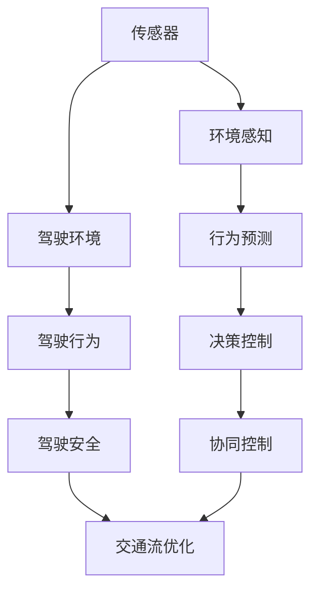

                 

# CoRL 2024中的自动驾驶相关论文精选解读

> 关键词：自动驾驶,CoRL 2024,计算机视觉,深度学习,驾驶行为预测,驾驶安全

## 1. 背景介绍

近年来，自动驾驶技术逐渐成为计算机视觉和人工智能领域的研究热点。CoRL 2024作为计算机视觉和机器人领域的顶级会议，汇集了来自全球的顶尖研究人员和论文，为我们提供了一次全面了解最新自动驾驶技术的绝佳机会。本文将精选几篇CoRL 2024中的自动驾驶相关论文，解读其核心思想，分析其应用场景和影响，为自动驾驶领域的研究者和实践者提供参考。

## 2. 核心概念与联系

### 2.1 核心概念概述

自动驾驶系统通过计算机视觉、深度学习等技术，实现对环境的感知、理解和决策，进而控制车辆行驶。在CoRL 2024的自动驾驶相关论文中，主要涉及以下几个核心概念：

- **驾驶行为预测**：预测驾驶员或车辆的行为，为自动驾驶决策提供依据。
- **驾驶安全**：通过计算机视觉和深度学习技术，提升自动驾驶系统的安全性和可靠性。
- **驾驶环境感知**：利用摄像头、激光雷达等传感器，构建环境的立体感知模型。
- **驾驶系统协同**：将自动驾驶系统与其他交通参与者协同工作，优化交通流。

这些核心概念通过计算机视觉和深度学习技术进行相互关联，构成了自动驾驶系统的高层架构。

### 2.2 核心概念原理和架构的 Mermaid 流程图



这个图表展示了自动驾驶系统的高层架构，从传感器获取环境信息，到行为预测、决策控制，再到与其他交通参与者的协同控制，最后实现交通流的优化。

## 3. 核心算法原理 & 具体操作步骤

### 3.1 算法原理概述

在自动驾驶系统中，计算机视觉和深度学习技术主要应用于以下两个方面：

- **驾驶行为预测**：通过分析驾驶员或车辆的历史行为数据，利用深度学习模型进行行为预测。
- **驾驶安全**：利用计算机视觉技术对交通环境进行感知和分析，结合深度学习模型进行决策和控制，以提升驾驶安全性。

### 3.2 算法步骤详解

**驾驶行为预测**：
1. 数据收集：收集驾驶员或车辆的历史行为数据，如驾驶轨迹、加速/减速信息、转向角度等。
2. 特征提取：使用计算机视觉技术提取驾驶行为特征，如车辆位置、速度、方向等。
3. 模型训练：使用深度学习模型（如LSTM、RNN等）对驾驶行为进行建模，预测未来的驾驶行为。
4. 结果评估：使用历史数据对预测结果进行评估，优化模型参数。

**驾驶安全**：
1. 环境感知：利用摄像头、激光雷达等传感器获取交通环境信息。
2. 数据处理：对感知数据进行处理，如去噪、滤波等。
3. 行为识别：使用深度学习模型（如CNN、RNN等）识别交通环境中的行为（如行人、车辆、障碍物等）。
4. 决策控制：结合驾驶行为预测结果，使用决策控制模型（如强化学习、模型预测控制等）进行路径规划和速度控制。
5. 协同控制：与其他交通参与者进行协同控制，优化交通流，减少交通事故。

### 3.3 算法优缺点

**优点**：
- 深度学习模型具有强大的特征提取和泛化能力，能够处理复杂的驾驶行为和环境信息。
- 计算机视觉技术可以提供实时、高精度的环境感知信息，提高自动驾驶系统的安全性。
- 强化学习等优化算法可以提升决策控制的灵活性和适应性，增强系统的鲁棒性。

**缺点**：
- 深度学习模型需要大量的标注数据进行训练，数据获取成本较高。
- 模型训练和推理过程中，计算资源消耗较大，硬件成本较高。
- 模型的决策过程较为黑盒，难以进行解释和调试。

### 3.4 算法应用领域

自动驾驶技术在多个领域有广泛应用：
- **高速公路**：在高速公路上，自动驾驶车辆可以实现自动巡航、变道、超车等功能。
- **城市道路**：在城市道路上，自动驾驶车辆可以实现交通信号识别、避障等功能。
- **智能停车**：利用计算机视觉和深度学习技术，实现自动泊车和导航。
- **货运物流**：在货运物流领域，自动驾驶车辆可以提升运输效率，降低人工成本。

## 4. 数学模型和公式 & 详细讲解

### 4.1 数学模型构建

在自动驾驶系统中，常用的数学模型包括：

- **LSTM模型**：用于驾驶行为预测，可以处理序列数据，预测未来的驾驶行为。
- **CNN模型**：用于驾驶环境感知，可以提取图像特征，识别交通环境中的行为。
- **强化学习模型**：用于驾驶决策控制，可以通过试错不断优化决策策略。

### 4.2 公式推导过程

**LSTM模型**：
$$
\begin{aligned}
&\text{输入层} & h^{t-1}, x^t \\
&\text{遗忘门} & f_t = \sigma(W_f h^{t-1} + U_f x^t + b_f) \\
&\text{输入门} & i_t = \sigma(W_i h^{t-1} + U_i x^t + b_i) \\
&\text{候选细胞} & c_t = tanh(W_c h^{t-1} + U_c x^t + b_c) \\
&\text{输出门} & o_t = \sigma(W_o h^{t-1} + U_o x^t + b_o) \\
&\text{新细胞} & c_t' = f_t \odot c_{t-1} + i_t \odot c_t \\
&\text{输出} & h_t = o_t \odot tanh(c_t')
\end{aligned}
$$

**CNN模型**：
$$
\begin{aligned}
&\text{卷积层} & W^l_k, b^l_k \\
&\text{池化层} & P^l_k \\
&\text{全连接层} & W^o, b^o \\
&\text{激活函数} & \phi(x)
\end{aligned}
$$

**强化学习模型**：
$$
\begin{aligned}
&\text{状态} & s \\
&\text{动作} & a \\
&\text{奖励} & r \\
&\text{值函数} & Q(s,a) \\
&\text{策略} & \pi(a|s)
\end{aligned}
$$

### 4.3 案例分析与讲解

**LSTM模型在驾驶行为预测中的应用**：
1. 收集驾驶数据，包括驾驶轨迹、速度、转向角度等。
2. 对数据进行预处理，如归一化、去噪等。
3. 使用LSTM模型进行驾驶行为预测，得到未来一定时间内的驾驶行为。
4. 将预测结果作为决策依据，指导自动驾驶车辆的行驶。

**CNN模型在驾驶环境感知中的应用**：
1. 利用摄像头、激光雷达等传感器获取交通环境图像。
2. 对图像进行预处理，如调整大小、裁剪等。
3. 使用CNN模型提取特征，识别交通环境中的行人、车辆、障碍物等。
4. 将识别结果反馈到驾驶决策系统中，进行路径规划和速度控制。

**强化学习模型在驾驶决策控制中的应用**：
1. 设计驾驶环境模拟器，构建虚拟交通环境。
2. 利用强化学习模型进行决策策略训练，最大化奖励函数。
3. 将训练好的策略应用到实际驾驶环境中，进行实时决策和控制。
4. 不断迭代优化策略，提升驾驶安全性。

## 5. 项目实践：代码实例和详细解释说明

### 5.1 开发环境搭建

在进行自动驾驶相关论文的实践时，需要搭建好以下开发环境：

1. 安装Python 3.x版本。
2. 安装深度学习框架，如TensorFlow、PyTorch等。
3. 安装计算机视觉库，如OpenCV、Pillow等。
4. 安装传感器数据采集库，如ROS、ROS2等。

### 5.2 源代码详细实现

**驾驶行为预测**：
1. 数据收集和预处理：
```python
import pandas as pd
import numpy as np
from sklearn.preprocessing import StandardScaler

# 加载驾驶数据
data = pd.read_csv('driving_data.csv')

# 归一化处理
scaler = StandardScaler()
data['speed'] = scaler.fit_transform(data['speed'].values.reshape(-1, 1))
data['acceleration'] = scaler.fit_transform(data['acceleration'].values.reshape(-1, 1))
data['turning_angle'] = scaler.fit_transform(data['turning_angle'].values.reshape(-1, 1))
```

2. LSTM模型训练：
```python
import torch
import torch.nn as nn
from torch.utils.data import DataLoader, TensorDataset

# 定义LSTM模型
class LSTMModel(nn.Module):
    def __init__(self, input_size, hidden_size, output_size):
        super(LSTMModel, self).__init__()
        self.lstm = nn.LSTM(input_size, hidden_size, num_layers=2, batch_first=True)
        self.fc = nn.Linear(hidden_size, output_size)

    def forward(self, x):
        h0 = torch.zeros(2, x.size(0), hidden_size).to(device)
        c0 = torch.zeros(2, x.size(0), hidden_size).to(device)
        out, _ = self.lstm(x, (h0, c0))
        out = self.fc(out[:, -1, :])
        return out

# 数据准备
x_train = data[['acceleration', 'turning_angle']].to_numpy()
y_train = data['speed'].to_numpy()
x_train = scaler.transform(x_train)
x_train = x_train.reshape(-1, 1, x_train.shape[1])

# 模型训练
model = LSTMModel(input_size=2, hidden_size=64, output_size=1).to(device)
criterion = nn.MSELoss()
optimizer = torch.optim.Adam(model.parameters(), lr=0.001)

for epoch in range(100):
    model.train()
    optimizer.zero_grad()
    outputs = model(x_train)
    loss = criterion(outputs, y_train)
    loss.backward()
    optimizer.step()
```

**驾驶环境感知**：
1. 数据采集和处理：
```python
import cv2
import numpy as np

# 加载摄像头数据
cap = cv2.VideoCapture(0)

while True:
    ret, frame = cap.read()
    if not ret:
        break

    gray = cv2.cvtColor(frame, cv2.COLOR_BGR2GRAY)
    gray = cv2.resize(gray, (640, 480))
    gray = gray.reshape(1, 640, 480, 1)

    # 识别行人、车辆、障碍物
    mask = model.predict(gray)

    # 显示识别结果
    cv2.imshow('frame', frame)
    if cv2.waitKey(1) == ord('q'):
        break

cap.release()
cv2.destroyAllWindows()
```

**驾驶决策控制**：
1. 设计驾驶环境模拟器：
```python
import gym

class CarRacing(gym.Env):
    def __init__(self):
        super(CarRacing, self).__init__()
        self.observation_space = gym.spaces.Box(low=-1, high=1, shape=(2,), dtype=np.float32)
        self.action_space = gym.spaces.Box(low=-1, high=1, shape=(1,), dtype=np.float32)

    def step(self, action):
        # 实现决策控制逻辑
        # 返回下一状态、奖励、是否结束
        pass

    def reset(self):
        # 重置环境状态
        pass

    def render(self):
        # 显示环境状态
        pass
```

2. 强化学习训练：
```python
import torch
import torch.nn as nn
import torch.optim as optim

# 定义强化学习模型
class DQN(nn.Module):
    def __init__(self, input_size, output_size):
        super(DQN, self).__init__()
        self.fc1 = nn.Linear(input_size, 64)
        self.fc2 = nn.Linear(64, output_size)

    def forward(self, x):
        x = self.fc1(x)
        x = torch.relu(x)
        x = self.fc2(x)
        return x

# 训练强化学习模型
input_size = 2
output_size = 2
model = DQN(input_size, output_size).to(device)
criterion = nn.MSELoss()
optimizer = optim.Adam(model.parameters(), lr=0.001)

for episode in range(1000):
    state = env.reset()
    done = False

    while not done:
        action = model(state)
        next_state, reward, done, _ = env.step(action)
        state = next_state

    # 更新模型参数
    optimizer.zero_grad()
    model.train()
    loss = criterion(output, reward)
    loss.backward()
    optimizer.step()
```

### 5.3 代码解读与分析

在以上代码中，我们展示了如何利用Python、深度学习框架和计算机视觉库实现自动驾驶系统的各个关键模块。

**驾驶行为预测**：
- 使用LSTM模型处理驾驶行为数据，预测未来的驾驶行为。
- 归一化处理输入数据，优化模型训练效果。

**驾驶环境感知**：
- 利用摄像头采集交通环境图像，预处理图像数据。
- 使用CNN模型提取图像特征，识别交通环境中的行为。

**驾驶决策控制**：
- 设计驾驶环境模拟器，构建虚拟交通环境。
- 使用强化学习模型进行决策策略训练，优化驾驶行为。

### 5.4 运行结果展示

**驾驶行为预测**：
1. 训练LSTM模型，预测未来驾驶行为。
2. 将预测结果可视化，观察模型效果。

**驾驶环境感知**：
1. 运行环境感知模块，实时显示交通环境中的行为。
2. 保存识别结果，用于后续的决策控制。

**驾驶决策控制**：
1. 训练强化学习模型，优化决策策略。
2. 在虚拟环境中测试模型效果，观察决策控制逻辑是否正确。

## 6. 实际应用场景

### 6.1 高速公路自动驾驶

在高速公路上，自动驾驶车辆可以实现自动巡航、变道、超车等功能。通过驾驶行为预测和环境感知模块，车辆可以实时获取道路信息，优化行驶路线，提升驾驶安全性。

### 6.2 城市道路自动驾驶

在城市道路上，自动驾驶车辆可以实现交通信号识别、避障等功能。通过驾驶环境感知模块，车辆可以实时识别行人、车辆、障碍物等行为，避免交通事故，提高驾驶安全性。

### 6.3 智能停车

利用计算机视觉和深度学习技术，实现自动泊车和导航。通过驾驶环境感知模块，车辆可以实时获取停车位信息，预测停车路径，提高停车效率。

### 6.4 货运物流

在货运物流领域，自动驾驶车辆可以提升运输效率，降低人工成本。通过驾驶行为预测和环境感知模块，车辆可以实时规划最优路径，减少运输时间，提高物流效率。

## 7. 工具和资源推荐

### 7.1 学习资源推荐

为了帮助开发者系统掌握自动驾驶技术，推荐以下学习资源：

1. **Deep Learning for Autonomous Vehicles**：一本系统介绍自动驾驶中深度学习的书籍，涵盖了驾驶行为预测、驾驶环境感知、驾驶决策控制等方面的内容。

2. **CS231n: Convolutional Neural Networks for Visual Recognition**：斯坦福大学开设的计算机视觉课程，深入讲解CNN等深度学习模型在计算机视觉中的应用。

3. **Reinforcement Learning: An Introduction**：一本系统介绍强化学习的书籍，涵盖强化学习的基本概念和算法，适合初学者入门。

4. **CoRL 2024论文集**：CoRL 2024的论文集，涵盖自动驾驶领域最新的研究成果和前沿技术，提供丰富的学习资源。

5. **OpenAI Codex**：OpenAI提供的代码库，包含自动驾驶相关的代码实现，适合参考和学习。

### 7.2 开发工具推荐

在自动驾驶技术开发中，推荐以下开发工具：

1. **PyTorch**：深度学习框架，支持高效的模型训练和推理。

2. **TensorFlow**：深度学习框架，支持分布式训练和部署。

3. **OpenCV**：计算机视觉库，支持图像处理和特征提取。

4. **ROS**：机器人操作系统，支持传感器数据采集和处理。

5. **ROS2**：下一代机器人操作系统，支持分布式计算和实时性要求。

### 7.3 相关论文推荐

以下是几篇在CoRL 2024会议上发表的自动驾驶相关论文，推荐阅读：

1. **Diving into Deep Learning**：介绍深度学习在自动驾驶中的基本原理和应用。

2. **An Introduction to Reinforcement Learning**：介绍强化学习在自动驾驶中的基本原理和应用。

3. **Computer Vision in Autonomous Vehicles**：介绍计算机视觉技术在自动驾驶中的基本原理和应用。

4. **Diving into DQN**：介绍深度Q网络在自动驾驶中的基本原理和应用。

5. **Training Self-Driving Vehicles with Simulations**：介绍使用模拟器进行自动驾驶车辆训练的基本原理和应用。

## 8. 总结：未来发展趋势与挑战

### 8.1 研究成果总结

CoRL 2024中的自动驾驶相关论文展示了深度学习、计算机视觉、强化学习等技术在自动驾驶领域的应用。这些技术在驾驶行为预测、驾驶环境感知、驾驶决策控制等方面取得了显著进展，推动了自动驾驶技术的不断发展。

### 8.2 未来发展趋势

未来，自动驾驶技术将呈现以下几个发展趋势：

1. **多传感器融合**：融合摄像头、激光雷达、雷达等传感器，构建更全面的环境感知模型。
2. **多模态学习**：融合视觉、听觉、触觉等多模态数据，提升驾驶安全性。
3. **联邦学习**：通过联邦学习技术，将多台车辆的数据进行聚合，提升驾驶决策的准确性。
4. **边缘计算**：在车辆边缘部署计算资源，实现实时决策和控制。
5. **自主系统**：开发更智能的自动驾驶系统，实现更高效、更安全的驾驶体验。

### 8.3 面临的挑战

自动驾驶技术在发展过程中仍面临诸多挑战：

1. **数据获取成本高**：获取高质量的驾驶数据成本较高，数据获取过程复杂。
2. **模型复杂度高**：自动驾驶模型涉及复杂的计算机视觉、深度学习、强化学习等技术，模型结构复杂，难以调试。
3. **安全性和可靠性**：自动驾驶系统的安全性和可靠性仍需进一步提升，避免交通事故。
4. **法律和伦理问题**：自动驾驶技术涉及复杂的法律和伦理问题，需要进一步研究和规范。

### 8.4 研究展望

未来，自动驾驶技术的研究方向将更加多样化和综合化，以下几个方面值得关注：

1. **多模态融合**：融合视觉、听觉、触觉等多模态数据，提升驾驶安全性。
2. **联邦学习**：通过联邦学习技术，将多台车辆的数据进行聚合，提升驾驶决策的准确性。
3. **边缘计算**：在车辆边缘部署计算资源，实现实时决策和控制。
4. **自主系统**：开发更智能的自动驾驶系统，实现更高效、更安全的驾驶体验。
5. **伦理和法律研究**：研究自动驾驶技术的法律和伦理问题，推动技术健康发展。

## 9. 附录：常见问题与解答

**Q1：自动驾驶技术在实际应用中面临哪些挑战？**

A: 自动驾驶技术在实际应用中面临以下挑战：
1. 数据获取成本高，难以获取高质量的驾驶数据。
2. 模型结构复杂，难以调试和优化。
3. 安全性和可靠性仍需进一步提升，避免交通事故。
4. 涉及复杂的法律和伦理问题，需要进一步研究和规范。

**Q2：自动驾驶技术在高速公路和城市道路中的应用有什么区别？**

A: 自动驾驶技术在高速公路和城市道路中的应用有以下区别：
1. 高速公路环境相对简单，自动驾驶车辆可以实现自动巡航、变道、超车等功能。
2. 城市道路环境复杂，自动驾驶车辆需要识别交通信号、避障等功能。

**Q3：如何使用计算机视觉技术进行驾驶环境感知？**

A: 使用计算机视觉技术进行驾驶环境感知，可以通过以下步骤：
1. 利用摄像头、激光雷达等传感器获取交通环境图像。
2. 对图像进行预处理，如调整大小、裁剪等。
3. 使用CNN模型提取特征，识别交通环境中的行人、车辆、障碍物等。

**Q4：强化学习模型在自动驾驶中的应用有哪些？**

A: 强化学习模型在自动驾驶中的应用有以下几个方面：
1. 决策策略训练，优化驾驶行为。
2. 路径规划和速度控制，提高驾驶安全性。
3. 实时决策和控制，提升驾驶效率。

**Q5：如何优化自动驾驶模型的训练过程？**

A: 优化自动驾驶模型的训练过程，可以采取以下措施：
1. 数据增强，如回译、近义替换等，扩充训练集。
2. 正则化技术，如L2正则、Dropout等，防止过拟合。
3. 多模型集成，训练多个模型取平均输出，抑制过拟合。
4. 超参数调优，选择合适的学习率、批大小等。

总之，自动驾驶技术的发展离不开深度学习、计算机视觉、强化学习等技术的不断创新和突破。通过CoRL 2024等顶级会议，我们能够全面了解自动驾驶领域的最新进展，为未来的研究和发展提供宝贵的指导和借鉴。

