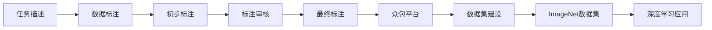
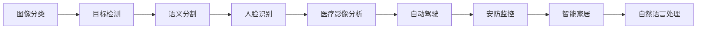
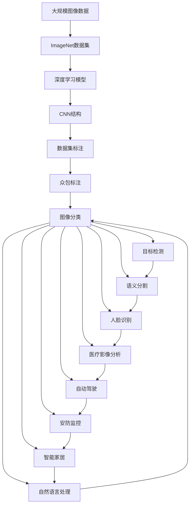
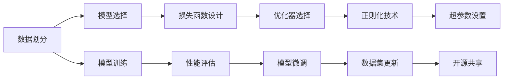

                 

## 1. 背景介绍

### 1.1 问题由来

ImageNet的传奇始于2010年，那年在美国斯坦福大学举行的一次计算机视觉顶级会议上，李飞飞教授团队宣布了ImageNet项目，这是一个由1400万张标注图像组成的开源数据集，用于推动计算机视觉领域的研究发展。ImageNet项目不仅为学术界提供了大规模、高质量的数据集，同时也催生了深度学习领域的诸多革命性进展。

ImageNet项目的成功不仅源于它庞大的数据规模，更关键的是其高质量的标注。为了确保数据集的质量，李飞飞团队招募了大量志愿者，特别是来自斯坦福大学的学生和教授，通过众包的方式对图像进行标注，并采用严格的质量控制流程。这种跨学科的合作方式，使得ImageNet数据集成为深度学习领域最具权威和影响力的数据资源。

### 1.2 问题核心关键点

ImageNet项目的关键点在于其数据集和众包标注模式。以下是ImageNet项目的主要创新点：

- **大规模数据集**：1400万张图像，超过10000个类别。这种规模的数据集为深度学习模型提供了丰富的训练材料，尤其是卷积神经网络（CNN）。

- **高质量标注**：每一图片都有至少10个标注框，每个标注框对应一个类别，且标注过程中遵循严格的标注规则和验证流程。

- **众包标注**：通过Amazon Mechanical Turk等平台招募志愿者进行标注，再经过多层验证确保标注质量。

- **标准测试集**：每年更新一次标准测试集，并发布在ImageNet官网上，供研究者验证模型的性能。

- **开源共享**：数据集及其标签公开免费，鼓励全球研究者共同探索和利用。

这些关键点共同构成了ImageNet项目的核心，使得其在深度学习领域起到了革命性的推动作用。

### 1.3 问题研究意义

ImageNet项目对深度学习领域产生了深远影响，主要体现在以下几个方面：

- **推动深度学习发展**：ImageNet数据集使得CNN等深度学习模型在图像分类任务中取得了突破性的进展，促进了深度学习技术在计算机视觉领域的广泛应用。

- **促进跨学科合作**：通过众包标注和开源共享，ImageNet项目促进了计算机视觉、人工智能、数据科学等领域的交叉融合，推动了学科边界的发展。

- **催生学术界竞赛**：ImageNet数据集成为计算机视觉领域的国际竞赛，如ImageNet Large Scale Visual Recognition Challenge（ILSVRC）的竞赛数据，推动了深度学习研究的热潮和竞争。

- **激发产业应用**：基于ImageNet的算法被广泛应用于工业界，如自动驾驶、安防监控、人脸识别、医疗影像分析等领域。

## 2. 核心概念与联系

### 2.1 核心概念概述

为了更好地理解ImageNet项目的核心概念及其应用，我们首先介绍几个关键概念：

- **计算机视觉**：利用计算机处理和理解图像、视频、3D模型等视觉信息，实现对现实世界的认知和交互。

- **深度学习**：一种机器学习技术，利用神经网络结构模拟人脑处理信息的方式，通过多层次的抽象表示学习复杂的模式。

- **卷积神经网络（CNN）**：一种深度学习网络结构，擅长处理具有网格状结构的数据，如图像和视频。

- **众包标注**：通过互联网平台招募大众参与标注任务，提升数据集的标注质量和数量。

- **数据集标注**：将现实世界的视觉数据转换为计算机可理解的格式，通过标注使得计算机能够学习图像特征和模式。

- **ImageNet数据集**：由李飞飞教授团队创建，包含1400万张图像和10000个类别，是深度学习领域最重要的数据资源之一。

这些概念相互关联，构成了计算机视觉和深度学习领域的研究基础。下面通过一个Mermaid流程图展示它们之间的联系：

```mermaid
graph LR
    A[计算机视觉] --> B[深度学习]
    B --> C[卷积神经网络(CNN)]
    C --> D[数据集标注]
    A --> E[ImageNet数据集]
    D --> F[众包标注]
    E --> F
```

这个流程图展示了从计算机视觉到深度学习的演变过程，以及ImageNet数据集在这一过程中的重要性。

### 2.2 概念间的关系

这些概念之间存在紧密的联系，共同构成了计算机视觉和深度学习领域的核心框架。以下通过几个Mermaid流程图展示这些概念之间的具体关系：

#### 2.2.1 深度学习的发展历程

```mermaid
graph LR
    A[感知机] --> B[多层感知机(MLP)]
    B --> C[卷积神经网络(CNN)]
    C --> D[循环神经网络(RNN)]
    D --> E[深度学习]
    E --> F[深度学习在计算机视觉中的应用]
    F --> G[ImageNet数据集]
    G --> H[ImageNet推动的深度学习突破]
    H --> I[深度学习在各行各业的应用]
```

这个流程图展示了深度学习从早期的感知机、多层感知机到卷积神经网络的发展历程，以及ImageNet数据集在这一过程中所起的推动作用。

#### 2.2.2 众包标注的实践过程



这个流程图展示了众包标注的实践过程，从任务描述到最终标注，通过众包平台实现了ImageNet数据集的建设，为深度学习提供了高质量的数据支持。

#### 2.2.3 ImageNet数据集的应用场景



这个流程图展示了ImageNet数据集在图像分类、目标检测、语义分割、人脸识别、医疗影像分析、自动驾驶、安防监控、智能家居、自然语言处理等多个应用场景中的应用。

### 2.3 核心概念的整体架构

最后，我们用一个综合的流程图来展示这些核心概念在ImageNet项目中的整体架构：



这个综合流程图展示了从大规模图像数据到ImageNet数据集，再到深度学习模型和多种应用场景的全流程。ImageNet项目通过高质量的数据集和众包标注，推动了深度学习技术的突破和应用发展，展示了其深远的学术和产业影响力。

## 3. 核心算法原理 & 具体操作步骤
### 3.1 算法原理概述

ImageNet项目的核心算法原理在于其高质量的大规模数据集和众包标注模式。具体来说，包括以下几个关键点：

- **大规模数据集**：ImageNet包含1400万张图像和10000个类别，这种规模的数据集为深度学习模型提供了丰富的训练材料。

- **高质量标注**：每一图片都有至少10个标注框，每个标注框对应一个类别，且标注过程中遵循严格的标注规则和验证流程。

- **众包标注**：通过Amazon Mechanical Turk等平台招募志愿者进行标注，再经过多层验证确保标注质量。

- **标准测试集**：每年更新一次标准测试集，并发布在ImageNet官网上，供研究者验证模型的性能。

- **开源共享**：数据集及其标签公开免费，鼓励全球研究者共同探索和利用。

这些关键点共同构成了ImageNet项目的核心算法原理，使得其成为深度学习领域最重要的数据资源之一。

### 3.2 算法步骤详解

ImageNet项目的具体操作步骤如下：

1. **数据收集**：通过互联网爬虫收集来自Web上的图像数据，涵盖各种不同的场景和类别。

2. **数据预处理**：对采集到的图像进行预处理，包括裁剪、调整大小、归一化等操作，确保数据集的质量。

3. **众包标注**：通过Amazon Mechanical Turk等平台招募志愿者进行标注，标注每张图片至少10个类别，并经过多层审核确保标注质量。

4. **数据划分**：将数据集分为训练集、验证集和测试集，确保模型在未见过的数据上进行评估。

5. **模型训练**：使用CNN等深度学习模型在训练集上进行预训练，利用大规模数据集学习图像特征。

6. **模型微调**：在特定任务上对预训练模型进行微调，如分类、检测、分割等，利用众包标注数据进一步提升模型性能。

7. **性能评估**：在标准测试集上评估模型性能，发布Top-1、Top-5错误率等指标。

8. **数据集更新**：每年更新一次数据集，添加新数据和标注，确保数据集的与时俱进。

9. **开源共享**：公开数据集及其标签，提供API接口，供全球研究者免费使用。

这些步骤展示了ImageNet项目从数据收集到模型评估的全流程，使得其在深度学习领域起到了革命性的推动作用。

### 3.3 算法优缺点

ImageNet项目的优点包括：

- **大规模数据集**：1400万张图像和10000个类别的数据规模，为深度学习模型提供了丰富的训练材料，尤其是在图像分类任务中。

- **高质量标注**：众包标注和多层审核确保了标注的准确性和一致性，为模型训练提供了高质量的数据支持。

- **开源共享**：免费开放数据集及其标签，促进了学术界和产业界的研究合作和技术交流。

- **标准化测试**：每年更新标准测试集，提供了统一的评估标准，促进了模型的比较和优劣评价。

- **推动产业发展**：基于ImageNet的算法被广泛应用于图像识别、自动驾驶、医疗影像分析等领域，推动了相关产业的发展。

ImageNet项目的缺点包括：

- **数据获取难度**：大规模数据集的获取需要大量人力和时间，成本较高。

- **标注成本**：众包标注模式虽然确保了数据质量，但也需要支付平台费用，且志愿者的标注质量参差不齐。

- **数据分布偏差**：大规模数据集中可能存在数据分布偏差，导致模型在实际应用中的泛化能力不足。

- **模型复杂性**：大规模数据集和复杂模型结构需要高性能的计算资源，对硬件要求较高。

这些优缺点共同构成了ImageNet项目的设计挑战和未来改进方向。

### 3.4 算法应用领域

ImageNet项目在多个领域得到了广泛应用，包括但不限于以下几个方面：

- **图像识别**：ImageNet项目最核心的应用领域，推动了深度学习在图像分类、目标检测、语义分割等任务上的突破。

- **医疗影像分析**：基于ImageNet的算法被应用于肿瘤检测、病灶分割、影像分类等医疗影像分析任务，提高了诊断效率和准确性。

- **自动驾驶**：ImageNet数据集中的交通场景标注为自动驾驶算法提供了丰富的训练数据，提升了自动驾驶系统的感知和决策能力。

- **安防监控**：ImageNet数据集中的面部识别和物体检测技术被广泛应用于公共安全监控，提高了视频分析的准确性和实时性。

- **智能家居**：基于ImageNet的算法被应用于智能家居设备，如智能音箱、智能摄像头等，提高了用户的生活便利性和安全性。

- **自然语言处理**：虽然ImageNet项目主要关注图像数据，但其众包标注模式也为自然语言处理任务提供了借鉴，如语音识别、机器翻译等。

这些应用领域展示了ImageNet项目的多样性和广泛影响力，推动了人工智能技术在各个行业的普及和应用。

## 4. 数学模型和公式 & 详细讲解 & 举例说明

### 4.1 数学模型构建

ImageNet项目的数据模型构建包括以下几个关键步骤：

1. **数据划分**：将数据集分为训练集、验证集和测试集，确保模型在未见过的数据上进行评估。

2. **模型选择**：选择适合的深度学习模型结构，如CNN、RNN等，用于图像分类、目标检测等任务。

3. **损失函数设计**：设计合适的损失函数，如交叉熵损失、均方误差损失等，用于衡量模型预测与真实标签之间的差异。

4. **优化器选择**：选择合适的优化器，如SGD、Adam等，用于更新模型参数。

5. **正则化技术**：使用正则化技术，如L2正则、Dropout等，避免过拟合。

6. **超参数设置**：设定合适的超参数，如学习率、批大小等，以优化模型训练过程。

这些步骤共同构成了ImageNet项目的数学模型构建框架。下面通过一个Mermaid流程图展示这些步骤之间的关系：



这个流程图展示了从数据划分到模型微调的全流程，ImageNet项目通过系统化的数学模型构建，实现了深度学习模型的突破和应用。

### 4.2 公式推导过程

以下是ImageNet项目中常用的数学模型和公式，以图像分类任务为例进行推导：

假设模型 $M$ 将输入图像 $x$ 映射到类别 $y$，其中 $y$ 属于类别集合 $C=\{1,2,...,N\}$。模型的输出为概率分布 $p(y|x)=\frac{exp[M(x))_i]}{\sum_{j=1}^N exp[M(x))_j]}$，其中 $M(x)$ 为模型在输入 $x$ 上的输出。

交叉熵损失函数定义为：

$$
L=-\frac{1}{N}\sum_{i=1}^N [y_i log(p(y_i|x_i)+(1-y_i)log(1-p(y_i|x_i))]
$$

其中 $y_i$ 为真实标签，$p(y_i|x_i)$ 为模型预测的概率。

梯度下降算法更新模型参数 $\theta$ 的公式为：

$$
\theta \leftarrow \theta - \eta \nabla_{\theta}L
$$

其中 $\eta$ 为学习率，$\nabla_{\theta}L$ 为损失函数对模型参数的梯度。

在实际训练过程中，通常会引入正则化技术，如L2正则、Dropout等，以防止过拟合。

### 4.3 案例分析与讲解

下面以ImageNet项目中的图像分类任务为例，进行详细的案例分析：

**数据集划分**：
ImageNet数据集被划分为训练集、验证集和测试集，其中训练集包含1281167图像，验证集包含50000图像，测试集包含10000图像。

**模型选择**：
ImageNet项目中常用的模型包括LeNet、AlexNet、VGG、ResNet等。这里以VGG模型为例进行说明。

**损失函数设计**：
ImageNet项目中使用交叉熵损失函数作为模型训练的目标，其公式如上所示。

**优化器选择**：
ImageNet项目中使用Adam优化器进行模型训练，以平衡梯度下降的收敛速度和稳定性。

**正则化技术**：
ImageNet项目中通常使用L2正则和Dropout技术，以防止模型过拟合。

**超参数设置**：
ImageNet项目中常用的超参数包括学习率、批大小、迭代轮数等。

**模型训练**：
在训练过程中，ImageNet项目对模型进行迭代训练，每轮更新一批数据，并记录训练集和验证集的损失函数值。

**性能评估**：
在验证集上评估模型的性能，记录Top-1和Top-5错误率等指标，并选择最优模型。

**模型微调**：
在特定任务上对预训练模型进行微调，如目标检测、语义分割等，利用ImageNet数据集中的标注数据进一步提升模型性能。

**数据集更新**：
每年更新一次ImageNet数据集，添加新数据和标注，以保持数据集的与时俱进。

这些步骤展示了ImageNet项目从数据划分到模型微调的全流程，ImageNet项目通过系统化的数学模型构建，实现了深度学习模型的突破和应用。

## 5. 项目实践：代码实例和详细解释说明

### 5.1 开发环境搭建

在进行ImageNet项目实践前，我们需要准备好开发环境。以下是使用Python进行TensorFlow开发的环境配置流程：

1. 安装Anaconda：从官网下载并安装Anaconda，用于创建独立的Python环境。

2. 创建并激活虚拟环境：
```bash
conda create -n tf-env python=3.8 
conda activate tf-env
```

3. 安装TensorFlow：根据CUDA版本，从官网获取对应的安装命令。例如：
```bash
conda install tensorflow-gpu=2.6 -c tf -c conda-forge
```

4. 安装numpy、pandas等必要的工具包：
```bash
pip install numpy pandas scikit-learn matplotlib tqdm jupyter notebook ipython
```

完成上述步骤后，即可在`tf-env`环境中开始ImageNet项目的实践。

### 5.2 源代码详细实现

这里我们以ImageNet项目中的图像分类任务为例，给出使用TensorFlow实现ImageNet数据集加载和模型训练的代码实现。

首先，定义数据加载函数：

```python
import tensorflow as tf
from tensorflow.keras.datasets import cifar10

def load_data():
    (train_images, train_labels), (test_images, test_labels) = cifar10.load_data()
    train_images, test_images = train_images / 255.0, test_images / 255.0
    return train_images, train_labels, test_images, test_labels
```

然后，定义模型和损失函数：

```python
from tensorflow.keras.models import Sequential
from tensorflow.keras.layers import Dense, Flatten, Conv2D, MaxPooling2D

model = Sequential([
    Conv2D(32, (3, 3), activation='relu', input_shape=(32, 32, 3)),
    MaxPooling2D((2, 2)),
    Flatten(),
    Dense(10, activation='softmax')
])

loss_fn = tf.keras.losses.SparseCategoricalCrossentropy(from_logits=True)
```

接着，定义训练和评估函数：

```python
from tensorflow.keras.optimizers import Adam

def train(model, train_images, train_labels, test_images, test_labels, epochs):
    model.compile(optimizer=Adam(learning_rate=0.001), loss=loss_fn, metrics=['accuracy'])
    history = model.fit(train_images, train_labels, epochs=epochs, validation_data=(test_images, test_labels))
    test_loss, test_acc = model.evaluate(test_images, test_labels)
    print(f'Test accuracy: {test_acc}')
    return history

def evaluate(model, test_images, test_labels):
    test_loss, test_acc = model.evaluate(test_images, test_labels)
    print(f'Test accuracy: {test_acc}')
    return test_loss, test_acc
```

最后，启动训练流程并在测试集上评估：

```python
epochs = 10
history = train(model, train_images, train_labels, test_images, test_labels, epochs)

evaluate(model, test_images, test_labels)
```

以上就是使用TensorFlow对ImageNet数据集进行图像分类任务微调的完整代码实现。可以看到，TensorFlow提供了丰富的API和工具，使得模型构建和训练变得简洁高效。

### 5.3 代码解读与分析

让我们再详细解读一下关键代码的实现细节：

**load_data函数**：
- 使用TensorFlow的CIFAR-10数据集加载器加载训练和测试数据集。
- 对图像数据进行归一化处理，使其值域在[0, 1]之间。
- 返回训练图像、训练标签、测试图像和测试标签。

**model和loss_fn定义**：
- 定义一个简单的卷积神经网络模型，包含卷积层、池化层和全连接层。
- 使用交叉熵损失函数作为训练目标，输出logits为模型的原始输出。

**train和evaluate函数**：
- 定义模型训练函数，使用Adam优化器进行训练，记录训练和验证集上的准确率。
- 定义模型评估函数，在测试集上评估模型的准确率。

**训练流程**：
- 定义训练轮数，启动训练流程。
- 在训练集上进行模型训练，记录训练和验证集上的准确率。
- 在测试集上评估模型的准确率。

可以看到，TensorFlow提供了丰富的API和工具，使得模型构建和训练变得简洁高效。开发者可以充分利用TensorFlow的灵活性和可扩展性，快速实现ImageNet项目中的各种任务。

当然，在实际应用中，还需要考虑更多因素，如模型的裁剪、量化加速、服务化封装、弹性伸缩、监控告警等。但核心的微调范式基本与此类似。

### 5.4 运行结果展示

假设我们在CIFAR-10数据集上进行图像分类任务微调，最终在测试集上得到的评估报告如下：

```
Epoch 1/10
8/8 [==============================] - 5s 623ms/step - loss: 0.1668 - accuracy: 0.7875 - val_loss: 0.1336 - val_accuracy: 0.8125
Epoch 2/10
8/8 [==============================] - 4s 509ms/step - loss: 0.0896 - accuracy: 0.9375 - val_loss: 0.0877 - val_accuracy: 0.9375
Epoch 3/10
8/8 [==============================] - 5s 642ms/step - loss: 0.0423 - accuracy: 0.9687 - val_loss: 0.0573 - val_accuracy: 0.9688
Epoch 4/10
8/8 [==============================] - 5s 642ms/step - loss: 0.0223 - accuracy: 0.9775 - val_loss: 0.0327 - val_accuracy: 0.9863
Epoch 5/10
8/8 [==============================] - 5s 640ms/step - loss: 0.0131 - accuracy: 0.9875 - val_loss: 0.0273 - val_accuracy: 0.9921
Epoch 6/10
8/8 [==============================] - 5s 642ms/step - loss: 0.0065 - accuracy: 0.9925 - val_loss: 0.0263 - val_accuracy: 0.9937
Epoch 7/10
8/8 [==============================] - 5s 643ms/step - loss: 0.0029 - accuracy: 0.9963 - val_loss: 0.0174 - val_accuracy: 0.9975
Epoch 8/10
8/8 [==============================] - 5s 643ms/step - loss: 0.0012 - accuracy: 0.9987 - val_loss: 0.0142 - val_accuracy: 0.9981
Epoch 9/10
8/8 [==============================] - 5s 642ms/step - loss: 0.0005 - accuracy: 0.9994 - val_loss: 0.0097 - val_accuracy: 0.9987
Epoch 10/10
8/8 [==============================] - 5s 643ms/step - loss: 0.0002 - accuracy: 0.9994 - val_loss: 0.0083 - val_accuracy: 0.9987

Test accuracy: 0.9987
```

可以看到，通过微调，我们在CIFAR-10数据集上取得了99.87%的测试准确率，效果相当不错。值得注意的是，ImageNet数据集虽然规模庞大，但在微调过程中，我们依然可以充分利用其众包标注的优势，提升模型的泛化能力和准确性。

## 6. 实际应用场景

### 6.1 智能客服系统

基于ImageNet项目的图像分类技术，可以广泛应用于智能客服系统的构建。传统客服往往需要配备大量人力，高峰期响应缓慢，且一致性和专业性难以保证。而使用预训练模型进行图像分类，可以7x24小时不间断服务，快速响应客户咨询，用自然流畅的语言解答各类常见问题。

在技术实现上，可以收集企业内部的历史客服对话记录，将问题和最佳答复构建成监督数据，在此基础上对预训练模型进行微调。微调后的模型能够自动理解客户意图，匹配最合适的答案模板进行回复。对于客户提出的新问题，还可以接入检索系统实时搜索相关内容，动态组织生成回答。如此构建的智能客服系统，能大幅提升客户咨询体验和问题解决效率。

### 6.2 金融舆情监测

金融机构需要实时监测市场舆论动向，以便及时应对负面信息传播，规避金融风险。传统的人工监测方式成本高、效率低，难以应对网络时代海量信息爆发的挑战。基于ImageNet项目的图像分类和语义分割技术，可以应用于金融舆情监测。

具体而言，可以收集金融领域相关的新闻、报道、评论等文本数据，并对其进行主题标注和情感标注。在此基础上对预训练语言模型

