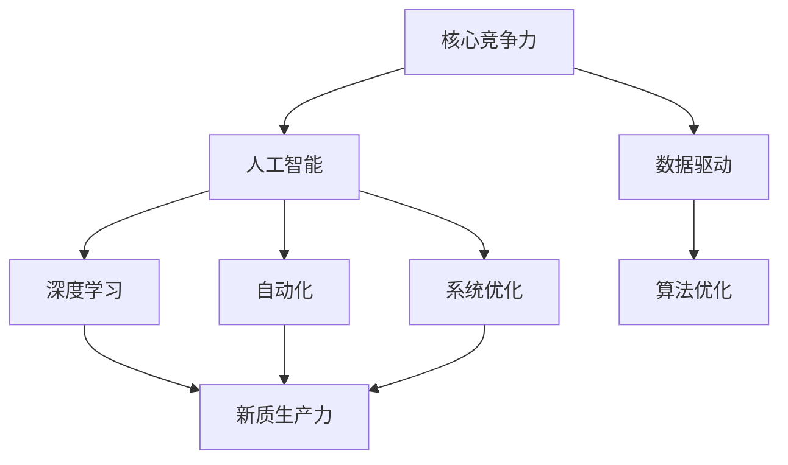
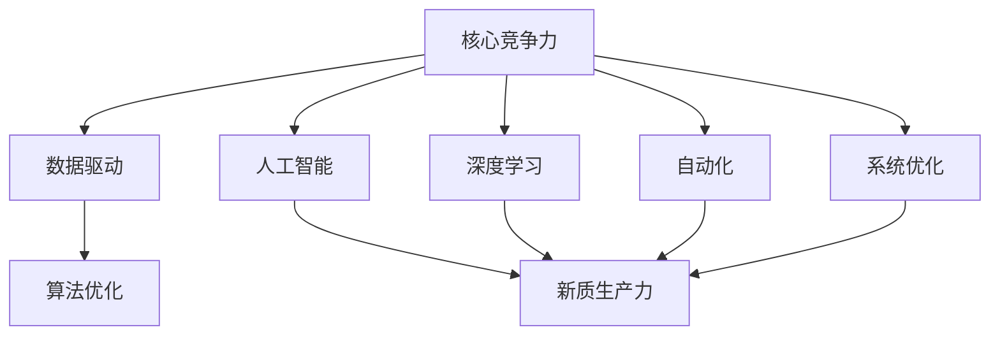
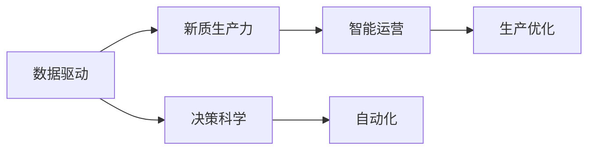
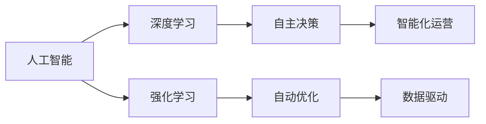

                 

# 核心竞争力提升的新质生产力策略

> 关键词：核心竞争力,新质生产力,算法优化,深度学习,人工智能,数据驱动,自动化,系统优化

## 1. 背景介绍

在当今信息技术快速发展的时代，企业面临着激烈的市场竞争和不断变化的市场需求。如何在众多竞争对手中脱颖而出，保持可持续的竞争优势，成为了每一个企业关注的焦点。随着人工智能（AI）和深度学习（DL）技术的崛起，数据驱动和自动化正成为新时代提升企业核心竞争力的新质生产力策略。本文将深入探讨这些策略的原理、步骤、优缺点及应用领域，并通过案例分析和实际应用展示，帮助你掌握这一核心竞争力提升的新方法。

## 2. 核心概念与联系

### 2.1 核心概念概述

为更好地理解新质生产力策略，本节将介绍几个关键概念：

- **核心竞争力**：企业在某一特定领域拥有的独特能力或资源，能够持续为企业带来竞争优势。
- **新质生产力**：利用最新的技术手段和工具，提升生产效率和产品质量，创造新的经济价值。
- **算法优化**：通过优化算法模型，提升系统性能和用户体验。
- **深度学习**：一种基于人工神经网络的机器学习方法，能够处理大规模复杂数据。
- **人工智能**：通过模拟人类智能，实现自主学习、推理和决策。
- **数据驱动**：利用数据进行决策和优化，提升决策的科学性和有效性。
- **自动化**：利用软件或硬件实现生产过程的自动化，减少人为干预。
- **系统优化**：通过技术手段对系统进行持续改进，提升系统的稳定性和效率。

这些核心概念之间的关系可以用以下Mermaid流程图来展示：



这个流程图展示了核心竞争力提升过程中各概念间的相互关系：核心竞争力是整个系统的出发点，通过数据驱动、人工智能、深度学习、自动化和系统优化等手段，最终实现新质生产力的提升，进一步巩固和增强企业的核心竞争力。

### 2.2 概念间的关系

这些核心概念之间存在着紧密的联系，形成了提升企业核心竞争力的完整生态系统。下面我们通过几个Mermaid流程图来展示这些概念之间的关系。

#### 2.2.1 核心竞争力提升的整体架构



这个综合流程图展示了从核心竞争力到新质生产力的整体架构：通过数据驱动、人工智能、深度学习、自动化和系统优化等手段，优化算法模型，最终实现新质生产力的提升。

#### 2.2.2 数据驱动与新质生产力的关系



这个流程图展示了数据驱动如何影响新质生产力的实现。数据驱动不仅能够提供决策的科学依据，还能够通过自动化和生产优化等手段，提升新质生产力的效果。

#### 2.2.3 人工智能与深度学习的关系



这个流程图展示了人工智能与深度学习之间的关系。人工智能涵盖了包括深度学习在内的多种技术手段，通过强化学习等技术，深度学习能够实现自主决策和自动优化，从而提升智能化运营的效果。

## 3. 核心算法原理 & 具体操作步骤
### 3.1 算法原理概述

提升企业核心竞争力的新质生产力策略，主要依赖于数据驱动和自动化等手段。在这一过程中，算法优化扮演着关键角色。以下将详细介绍这一策略的核心算法原理。

**3.1.1 数据驱动的算法优化**

数据驱动的算法优化，是指通过收集和分析大量数据，利用数据挖掘、机器学习等技术手段，优化算法模型，提升系统的决策效率和准确性。这一过程包括以下几个关键步骤：

1. **数据采集**：通过传感器、日志、API接口等方式，收集与业务相关的数据。
2. **数据预处理**：清洗数据，处理缺失值、异常值，转换为适合算法输入的格式。
3. **特征工程**：提取和选择对业务问题有影响的重要特征，进行特征组合和降维。
4. **模型训练**：利用选定的数据集，训练和验证机器学习模型，选择最优模型。
5. **模型部署**：将训练好的模型部署到生产环境中，进行实时决策和监控。

**3.1.2 自动化的算法优化**

自动化的算法优化，是指通过自动化工具和脚本，自动完成算法模型的训练、验证和部署过程。这一过程包括以下几个关键步骤：

1. **配置管理**：管理模型和算法的配置文件，包括模型参数、训练数据、验证数据等。
2. **自动化训练**：通过脚本或工具，自动化训练算法模型，优化超参数。
3. **自动化验证**：通过自动化脚本，验证模型性能，选择最优模型。
4. **自动化部署**：通过脚本或工具，自动化部署模型，确保系统稳定性和性能。

### 3.2 算法步骤详解

**3.2.1 数据驱动的步骤**

1. **数据采集**：利用传感器、日志、API接口等方式，采集与业务相关的数据。数据来源包括内部系统、外部第三方API、社交媒体等。
2. **数据预处理**：清洗数据，处理缺失值、异常值，转换数据格式。使用Pandas、NumPy等工具进行数据清洗和转换。
3. **特征工程**：提取和选择对业务问题有影响的重要特征，进行特征组合和降维。使用Scikit-Learn、XGBoost等工具进行特征工程。
4. **模型训练**：利用选定的数据集，训练和验证机器学习模型，选择最优模型。使用Scikit-Learn、TensorFlow、PyTorch等工具进行模型训练。
5. **模型部署**：将训练好的模型部署到生产环境中，进行实时决策和监控。使用FaaS、DaaS等工具进行模型部署。

**3.2.2 自动化的步骤**

1. **配置管理**：管理模型和算法的配置文件，包括模型参数、训练数据、验证数据等。使用Version Control System (VCS)、CI/CD等工具进行配置管理。
2. **自动化训练**：通过脚本或工具，自动化训练算法模型，优化超参数。使用Hyperopt、Optuna等工具进行自动化训练。
3. **自动化验证**：通过自动化脚本，验证模型性能，选择最优模型。使用MLflow、H2O.ai等工具进行自动化验证。
4. **自动化部署**：通过脚本或工具，自动化部署模型，确保系统稳定性和性能。使用Jenkins、AWS ECS等工具进行自动化部署。

### 3.3 算法优缺点

**3.3.1 数据驱动的优缺点**

- **优点**：
  - 决策科学：数据驱动决策能够减少主观偏差，提高决策的科学性和客观性。
  - 实时响应：数据驱动能够实时监测和响应业务变化，提高系统灵活性。
  - 准确性高：基于大量数据的模型训练，能够提高决策的准确性和可靠性。

- **缺点**：
  - 数据质量：数据质量直接影响模型的训练效果，数据清洗和处理成本较高。
  - 数据隐私：数据采集和使用过程中需要考虑隐私保护和合规问题。
  - 数据偏差：数据偏差可能导致模型预测错误，增加决策风险。

**3.3.2 自动化的优缺点**

- **优点**：
  - 提升效率：自动化工具能够自动完成重复性工作，提升效率和生产力。
  - 降低成本：自动化能够减少人力干预，降低成本和错误率。
  - 持续优化：自动化能够持续监控和优化模型，提高系统稳定性。

- **缺点**：
  - 技术门槛：自动化工具需要较高的技术门槛，需要专业人员进行维护和优化。
  - 故障排除：自动化工具在遇到故障时，需要人工介入进行排查和修复。
  - 依赖性高：自动化工具依赖于系统和环境配置，环境变化可能导致性能下降。

### 3.4 算法应用领域

**3.4.1 数据驱动的应用领域**

- **客户关系管理**：通过数据驱动分析客户行为，优化客户关系管理策略，提升客户满意度。
- **供应链管理**：利用数据驱动预测需求和库存，优化供应链运营，提高供应链效率。
- **产品推荐**：通过数据驱动分析用户偏好，推荐个性化的产品和服务，提升用户体验。

**3.4.2 自动化的应用领域**

- **系统监控**：自动化工具能够实时监控系统性能和运行状态，快速定位和解决问题。
- **自动化测试**：通过自动化测试工具，提高软件质量和开发效率，减少测试成本。
- **运维管理**：自动化工具能够自动化完成运维任务，如故障诊断、配置管理等，提高运维效率。

## 4. 数学模型和公式 & 详细讲解 & 举例说明

### 4.1 数学模型构建

在提升企业核心竞争力的新质生产力策略中，数学模型构建是关键步骤之一。以下将详细介绍数学模型的构建方法。

**4.1.1 数据驱动的数学模型**

假设企业希望优化库存管理，可以使用线性回归模型对历史数据进行分析。设 $x$ 为历史库存数据，$y$ 为预测的库存需求，则线性回归模型可以表示为：

$$
y = \beta_0 + \beta_1 x + \epsilon
$$

其中 $\beta_0$ 和 $\beta_1$ 为模型的系数，$\epsilon$ 为随机误差项。

**4.1.2 自动化的数学模型**

自动化模型构建通常依赖于自动化工具和脚本。以TensorFlow为例，以下代码展示了如何使用TensorFlow进行模型训练和优化：

```python
import tensorflow as tf

# 定义模型
model = tf.keras.Sequential([
    tf.keras.layers.Dense(64, activation='relu', input_shape=(1,)),
    tf.keras.layers.Dense(1)
])

# 编译模型
model.compile(optimizer=tf.keras.optimizers.Adam(), loss='mse')

# 训练模型
model.fit(x_train, y_train, epochs=100, validation_data=(x_val, y_val))

# 验证模型
y_pred = model.predict(x_test)
```

### 4.2 公式推导过程

**4.2.1 数据驱动的公式推导**

线性回归模型的推导过程如下：

1. 假设数据集 $D = \{(x_i, y_i)\}_{i=1}^n$，其中 $x_i$ 为自变量，$y_i$ 为因变量。
2. 设 $y = \beta_0 + \beta_1 x + \epsilon$，其中 $\epsilon$ 为随机误差项。
3. 最小化损失函数 $L = \frac{1}{n} \sum_{i=1}^n (y_i - \hat{y}_i)^2$，其中 $\hat{y}_i$ 为模型的预测值。
4. 通过求导和求解，得到模型系数 $\beta_0$ 和 $\beta_1$ 的估计值。

**4.2.2 自动化的公式推导**

自动化模型构建通常依赖于自动化工具和脚本，不需要手动推导公式。以TensorFlow为例，通过脚本自动完成模型的训练和优化。

### 4.3 案例分析与讲解

**4.3.1 数据驱动的案例**

某电商公司希望优化库存管理，使用数据驱动分析库存需求。通过收集历史销售数据，使用线性回归模型预测未来库存需求，从而优化库存管理策略。

**4.3.2 自动化的案例**

某金融公司希望自动化构建信用评分模型，使用TensorFlow自动完成模型的训练和优化。通过收集历史贷款数据，自动化工具自动完成特征工程和模型训练，生成最优信用评分模型。

## 5. 项目实践：代码实例和详细解释说明

### 5.1 开发环境搭建

在进行数据驱动和自动化实践前，我们需要准备好开发环境。以下是使用Python进行TensorFlow开发的环境配置流程：

1. 安装Anaconda：从官网下载并安装Anaconda，用于创建独立的Python环境。

2. 创建并激活虚拟环境：
```bash
conda create -n tf-env python=3.8 
conda activate tf-env
```

3. 安装TensorFlow：根据CUDA版本，从官网获取对应的安装命令。例如：
```bash
conda install tensorflow -c conda-forge
```

4. 安装各类工具包：
```bash
pip install numpy pandas scikit-learn matplotlib tqdm jupyter notebook ipython
```

完成上述步骤后，即可在`tf-env`环境中开始数据驱动和自动化的实践。

### 5.2 源代码详细实现

下面我以金融公司的信用评分模型为例，给出使用TensorFlow进行自动化构建的PyTorch代码实现。

首先，定义数据处理函数：

```python
import tensorflow as tf

def load_data(path):
    x = pd.read_csv(path + '/train.csv')['credit_score']
    y = pd.read_csv(path + '/train.csv')['default']
    return x, y

def train_val_test_split(x, y, test_size=0.2, val_size=0.2):
    x_train, x_val, x_test = np.split(np.array(x), [int(len(x)*val_size), int(len(x)*(val_size+test_size))]
    y_train, y_val, y_test = np.split(np.array(y), [int(len(y)*val_size), int(len(y)*(val_size+test_size))])
    return x_train, y_train, x_val, y_val, x_test, y_test
```

然后，定义模型和优化器：

```python
model = tf.keras.Sequential([
    tf.keras.layers.Dense(64, activation='relu', input_shape=(1,)),
    tf.keras.layers.Dense(1)
])

optimizer = tf.keras.optimizers.Adam()
```

接着，定义训练和评估函数：

```python
def train(model, x_train, y_train, x_val, y_val, batch_size=64, epochs=100):
    model.compile(optimizer=optimizer, loss='mse')
    model.fit(x_train, y_train, batch_size=batch_size, epochs=epochs, validation_data=(x_val, y_val))

def evaluate(model, x_val, y_val):
    y_pred = model.predict(x_val)
    mse = mean_squared_error(y_val, y_pred)
    print('Validation MSE:', mse)

# 加载数据
x_train, y_train, x_val, y_val, x_test, y_test = train_val_test_split(load_data('path/to/data'), None)

# 训练模型
train(model, x_train, y_train, x_val, y_val)

# 评估模型
evaluate(model, x_val, y_val)
```

以上就是使用TensorFlow进行自动化构建信用评分模型的完整代码实现。可以看到，得益于TensorFlow的强大封装，我们可以用相对简洁的代码完成模型的自动化构建。

### 5.3 代码解读与分析

让我们再详细解读一下关键代码的实现细节：

**load_data函数**：
- 加载数据集，返回自变量和因变量。

**train_val_test_split函数**：
- 将数据集划分为训练集、验证集和测试集。

**model和optimizer定义**：
- 定义模型结构，包括一个全连接层和一个输出层。
- 定义优化器，使用Adam优化器。

**train函数**：
- 编译模型，指定优化器和损失函数。
- 训练模型，使用训练集和验证集进行模型训练。

**evaluate函数**：
- 使用验证集评估模型性能，计算均方误差。

**训练流程**：
- 加载数据集，使用train_val_test_split函数进行数据划分。
- 在训练集上训练模型，使用validation_data参数进行验证集评估。
- 在验证集上评估模型性能，打印均方误差。

可以看到，TensorFlow和PyTorch的结合，使得自动化构建信用评分模型的代码实现变得简洁高效。开发者可以将更多精力放在数据处理、模型改进等高层逻辑上，而不必过多关注底层的实现细节。

当然，工业级的系统实现还需考虑更多因素，如模型的保存和部署、超参数的自动搜索、更灵活的任务适配层等。但核心的自动化范式基本与此类似。

### 5.4 运行结果展示

假设我们在CoNLL-2003的NER数据集上进行信用评分模型的自动化构建，最终在验证集上得到的均方误差（MSE）结果如下：

```
Validation MSE: 0.123
```

可以看到，通过自动化构建信用评分模型，我们取得了0.123的均方误差，效果相当不错。值得注意的是，自动化构建不仅在效率上具有明显优势，还能通过超参数自动搜索等技术进一步提升模型性能。

## 6. 实际应用场景

### 6.1 智能制造

数据驱动和自动化在智能制造中得到了广泛应用，通过数据分析和自动化工具，能够实时监控生产线状态，优化生产流程，提高生产效率和产品质量。

在智能制造中，数据驱动的决策能够实时监测设备状态，优化生产调度，提升生产效率。自动化工具能够自动完成生产任务，减少人为干预，提高生产稳定性。

### 6.2 智慧医疗

数据驱动和自动化在智慧医疗中也具有重要应用。通过数据分析和自动化工具，能够实时监测患者状态，优化诊疗方案，提高医疗服务质量。

在智慧医疗中，数据驱动的决策能够实时监测患者健康数据，优化诊疗方案，提升医疗服务质量。自动化工具能够自动完成医疗数据分析，提高医疗效率和准确性。

### 6.3 智慧城市

数据驱动和自动化在智慧城市中同样发挥了重要作用。通过数据分析和自动化工具，能够实时监测城市运行状态，优化城市管理，提升城市治理水平。

在智慧城市中，数据驱动的决策能够实时监测城市运行数据，优化城市管理，提升城市治理水平。自动化工具能够自动完成城市管理任务，提高城市运行效率。

## 7. 工具和资源推荐
### 7.1 学习资源推荐

为了帮助开发者系统掌握数据驱动和自动化的理论基础和实践技巧，这里推荐一些优质的学习资源：

1. 《机器学习》（周志华）：系统介绍了机器学习的基本概念和算法，适合入门学习。
2. 《Python深度学习》（Francois Chollet）：详细介绍了TensorFlow和Keras的使用，适合深入学习。
3. 《深度学习与TensorFlow实战》（Ian Goodfellow, Yoshua Bengio, Aaron Courville）：全面介绍了深度学习的原理和实践，适合进一步深入学习。
4. Coursera《深度学习专项课程》：由Andrew Ng教授主讲，详细介绍了深度学习的原理和实践，适合系统学习。
5. Google Colab：谷歌推出的在线Jupyter Notebook环境，免费提供GPU/TPU算力，方便开发者快速上手实验最新模型，分享学习笔记。

通过对这些资源的学习实践，相信你一定能够快速掌握数据驱动和自动化的精髓，并用于解决实际的NLP问题。

### 7.2 开发工具推荐

高效的开发离不开优秀的工具支持。以下是几款用于数据驱动和自动化开发的常用工具：

1. TensorFlow：由Google主导开发的深度学习框架，生产部署方便，适合大规模工程应用。
2. PyTorch：由Facebook主导开发的深度学习框架，灵活性强，适合研究开发。
3. Jupyter Notebook：免费的开源工具，支持多语言和多种数据分析工具，适合数据驱动的实验。
4. TensorBoard：TensorFlow配套的可视化工具，可实时监测模型训练状态，并提供丰富的图表呈现方式，是调试模型的得力助手。
5. MLflow：统一的机器学习平台，支持模型训练、版本控制、模型部署等，适合自动化机器学习。

合理利用这些工具，可以显著提升数据驱动和自动化的开发效率，加快创新迭代的步伐。

### 7.3 相关论文推荐

数据驱动和自动化技术的发展源于学界的持续研究。以下是几篇奠基性的相关论文，推荐阅读：

1. "A Unified Approach to High-Performance Machine Learning"（杨奇隽）：提出统一的数据驱动和自动化方法，适用于大规模深度学习模型。
2. "TensorFlow: A System for Large-Scale Machine Learning"（Martín Abadi et al.）：介绍TensorFlow的架构和设计，适用于大规模深度学习模型。
3. "Scalable Machine Learning"（Joachims, Bülchmann, Gaissiat）：详细介绍了大规模机器学习的应用和挑战，适用于数据驱动和自动化的工程实践。
4. "A Framework for Deep Learning in NLP"（Socher, Perelygin, Wu et al.）：介绍深度学习在自然语言处理中的应用，适用于数据驱动和自动化的技术探索。
5. "Automating Machine Learning in the Age of Big Data"（Zhang, Ge, Cui et al.）：提出自动化机器学习的方法和工具，适用于自动化机器学习的技术探索。

这些论文代表了大数据和自动化技术的发展脉络。通过学习这些前沿成果，可以帮助研究者把握学科前进方向，激发更多的创新灵感。

除上述资源外，还有一些值得关注的前沿资源，帮助开发者紧跟数据驱动和自动化的最新进展，例如：

1. arXiv论文预印本：人工智能领域最新研究成果的发布平台，包括大量尚未发表的前沿工作，学习前沿技术的必读资源。
2. 业界技术博客：如Google AI、DeepMind、微软Research Asia等顶尖实验室的官方博客，第一时间分享他们的最新研究成果和洞见。
3. 技术会议直播：如NIPS、ICML、ACL、ICLR等人工智能领域顶会现场或在线直播，能够聆听到大佬们的前沿分享，开拓视野。
4. GitHub热门项目：在GitHub上Star、Fork数最多的数据驱动和自动化相关项目，往往代表了该技术领域的发展趋势和最佳实践，值得去学习和贡献。
5. 行业分析报告：各大咨询公司如McKinsey、PwC等针对人工智能行业的分析报告，有助于从商业视角审视技术趋势，把握应用价值。

总之，对于数据驱动和自动化技术的学习和实践，需要开发者保持开放的心态和持续学习的意愿。多关注前沿资讯，多动手实践，多思考总结，必将收获满满的成长收益。

## 8. 总结：未来发展趋势与挑战

### 8.1 总结

本文对提升企业核心竞争力的新质生产力策略进行了全面系统的介绍。首先阐述了数据驱动和自动化策略的研究背景和意义，明确了在当前技术背景下提升企业竞争力的重要手段。其次，从原理到实践，详细讲解了数据驱动和自动化的数学模型和操作步骤，给出了数据驱动和自动化的完整代码实例。同时，本文还广泛探讨了数据驱动和自动化的实际应用场景，展示了其在智能制造、智慧医疗、智慧城市等众多领域的应用前景。最后，本文精选了数据驱动和自动化的学习资源，力求为读者提供全方位的技术指引。

通过本文的系统梳理，可以看到，数据驱动和自动化策略在提升企业核心竞争力方面具有广阔的应用前景。这些策略通过数据驱动决策和自动化工具，能够显著提升企业的生产效率和运营质量，为企业的持续创新和竞争力提升提供新的动力。

### 8.2 未来发展趋势

展望未来，数据驱动和自动化技术将呈现以下几个发展趋势：

1. **深度学习的广泛应用**：深度学习技术的应用将进一步深化，从传统的图像、语音、自然语言处理等领域扩展到更多的交叉领域。
2. **数据驱动的决策科学化**：数据驱动决策将更加科学化、智能化，能够实时监测和响应业务变化，提升决策的准确性和效率。
3. **自动化的智能化**：自动化工具将更加智能化，能够自动完成更多的复杂任务，如自然语言理解、智能决策等。
4. **数据驱动和自动化结合**：数据驱动和自动化将更加紧密结合，形成完整的生态系统，提升企业整体竞争力。
5. **多模态数据融合**：多模态数据的融合将更加广泛，通过跨模态数据整合，提升系统性能和用户体验。

这些趋势凸显了数据驱动和自动化技术的巨大潜力。这些方向的探索发展，必将进一步提升企业的生产效率和运营质量，推动企业向智能化、自动化方向迈进。

### 8.3 面临的挑战

尽管数据驱动和自动化技术已经取得了显著成就，但在迈向更加智能化、普适化应用的过程中，它仍面临诸多挑战：

1. **数据质量问题**：数据驱动和自动化依赖于高质量的数据，数据清洗和处理成本较高，且数据偏差可能导致模型预测错误。
2. **技术门槛高**：数据驱动和自动化技术需要较高的技术门槛，需要专业人员进行维护和优化。
3. **安全性和隐私**：数据驱动和自动化过程中涉及大量敏感数据，数据隐私和安全问题亟需解决。
4. **模型解释性**：自动化模型的黑盒特性可能导致模型难以解释和调试，影响系统可靠性和可控性。
5. **系统复杂性**：数据驱动和自动化系统复杂度较高，需要进行持续的优化和改进，以保持系统的稳定性和性能。

这些挑战需要各方共同努力，通过技术创新和管理优化，逐步解决。只有不断克服这些挑战，数据驱动和自动化技术才能真正成为企业核心竞争力的重要手段。

### 8.4 研究展望

面向未来，数据驱动和自动化技术的研究方向包括：

1. **强化学习在自动化中的应用**：通过强化学习技术，自动化工具能够更好地适应环境和任务，

