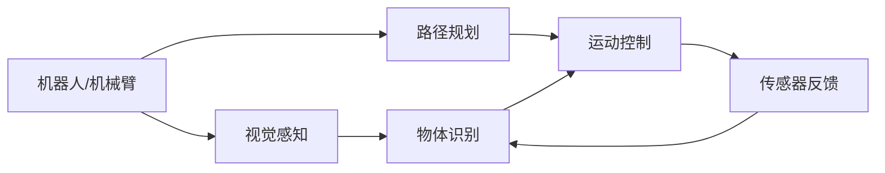

                 

## 1. 背景介绍

物理实体自动化（Physical Entity Automation, PEA）正逐渐成为制造业、物流和供应链管理等领域的关键技术。随着工业4.0的推进和智能制造的普及，越来越多的企业开始关注如何通过自动化技术提升实体物理世界的操作效率和精确度。传统的自动化技术主要依赖机械臂和机器人，但随着AI技术的发展，尤其是深度学习技术的成熟，基于机器学习的物理实体自动化开始受到广泛关注。本文将介绍物理实体自动化的最新研究趋势，讨论其核心概念、算法原理及实际应用，为相关行业的从业者提供参考。

## 2. 核心概念与联系

### 2.1 核心概念概述

物理实体自动化主要指的是利用人工智能和机器学习技术，对物理世界中的实体进行自动化操作。这些实体可以是机器人、无人机、传感器、自动化设备等。物理实体自动化技术能够对物理实体进行识别、定位、控制和优化，使得生产、物流和供应链管理等业务流程更加高效和智能化。

### 2.2 核心概念原理和架构的 Mermaid 流程图



### 2.3 核心概念间的联系

物理实体自动化由以下几个核心组件组成：

- **视觉感知**：用于识别和定位物理实体，如机器人通过摄像头或激光雷达对环境进行感知。
- **路径规划**：根据感知数据，规划出最优的移动路径，使机器人能够高效地完成任务。
- **运动控制**：执行路径规划，控制机器人的运动，使其到达指定位置并执行任务。
- **物体识别**：识别物理实体的属性和状态，如物体的形状、颜色、位置等。
- **传感器反馈**：通过传感器收集实时反馈信息，调整路径和控制策略，提高任务的准确性和稳定性。

这些组件通过深度学习和机器学习技术相互连接，共同构成了一个完整的物理实体自动化系统。

## 3. 核心算法原理 & 具体操作步骤

### 3.1 算法原理概述

物理实体自动化的核心算法包括视觉感知、路径规划和运动控制等。其中，深度学习和计算机视觉技术是视觉感知和物体识别算法的基础，而路径规划和运动控制算法则是通过强化学习和机器人学原理实现的。

### 3.2 算法步骤详解

1. **视觉感知和物体识别**：
   - **输入数据**：传感器采集的图像和环境数据。
   - **处理步骤**：
     1. 图像预处理：包括去噪、增强、裁剪等操作，提高图像质量。
     2. 目标检测：通过深度学习模型（如YOLO、Faster R-CNN等）检测物体的位置和大小。
     3. 物体分类：使用卷积神经网络（CNN）对物体进行分类，如识别物体的种类和状态。
     4. 输出结果：物体的位置、大小、类别和状态信息。

2. **路径规划**：
   - **输入数据**：物体识别结果和环境地图。
   - **处理步骤**：
     1. 环境建模：通过SLAM（同步定位与地图构建）技术，构建环境的静态地图和动态地图。
     2. 路径规划：使用A*、RRT等算法，根据物体位置和环境地图，规划出最优路径。
     3. 输出结果：机器人的移动路径和速度控制策略。

3. **运动控制**：
   - **输入数据**：路径规划结果和实时传感器反馈。
   - **处理步骤**：
     1. 运动控制：通过PID控制算法或模型预测控制算法，控制机器人的运动。
     2. 传感器反馈：使用IMU（惯性测量单元）、视觉传感器等，实时监测机器人的运动状态。
     3. 调整控制策略：根据传感器反馈信息，调整控制参数，优化运动效果。
     4. 输出结果：机器人的运动轨迹和姿态信息。

### 3.3 算法优缺点

#### 优点：
- **高精度**：深度学习和计算机视觉技术能够提供高精度的物体识别和定位，确保任务的准确性。
- **灵活性**：强化学习和机器人学原理可以应对复杂的路径规划和运动控制问题，适应不同环境和工作场景。
- **自适应性**：通过实时传感器反馈和在线学习，系统能够自我优化和调整，提高稳定性和鲁棒性。

#### 缺点：
- **计算资源需求高**：深度学习和强化学习算法需要大量的计算资源，如高性能GPU和大量的训练数据。
- **算法复杂性高**：多传感器融合、实时数据处理和复杂决策算法增加了系统设计和调试的难度。
- **模型解释性差**：深度学习模型的黑盒特性，使得其决策过程难以解释和调试。

### 3.4 算法应用领域

物理实体自动化技术主要应用于以下几个领域：

- **制造业**：自动化生产线上的物体识别和定位，提高生产效率和质量。
- **物流管理**：自动驾驶车辆和无人机在物流场景中的应用，优化货物运输和配送。
- **智慧城市**：智能交通系统和环境监控，提升城市管理的智能化水平。
- **零售业**：无人零售商店和智能仓储系统，提高商品管理和库存管理效率。
- **医疗健康**：手术机器人手术辅助和医疗影像分析，提高医疗服务的精准性和可控性。

## 4. 数学模型和公式 & 详细讲解

### 4.1 数学模型构建

物理实体自动化的数学模型主要包括以下几个部分：

1. **视觉感知模型**：
   - 物体检测模型：如YOLO、Faster R-CNN等，通过特征提取和分类器，识别物体的类别和位置。
   - 物体跟踪模型：如Kalman滤波器、粒子滤波器等，实时跟踪物体的运动轨迹。

2. **路径规划模型**：
   - SLAM模型：同步定位与地图构建，通过传感器数据实时构建环境地图，同时进行定位和导航。
   - A*算法：路径规划算法，通过启发式搜索找到最短路径。
   - RRT算法：基于概率的路径规划算法，适应动态环境。

3. **运动控制模型**：
   - PID控制算法：基于反馈控制理论的PID控制器，调整机器人的运动参数。
   -模型预测控制算法：通过模型预测未来状态，优化控制策略。

### 4.2 公式推导过程

以物体检测和跟踪为例，使用YOLO模型进行物体检测和分类：

1. **物体检测模型**：
   - 输入：一张图像$I$，分辨率为$H \times W$。
   - 输出：物体的位置和类别。
   - 公式表示为：
     - 特征提取：
       $$
       \text{Feature} = \text{Conv}(I)
       $$
     - 目标检测：
       $$
       \text{Boxes} = \text{YOLO}(\text{Feature})
       $$
     - 物体分类：
       $$
       \text{Classes} = \text{Softmax}(\text{YOLO}(\text{Feature}))
       $$
     - 最终输出：
       $$
       \text{BBoxes} = (\text{Boxes}, \text{Classes})
       $$

2. **物体跟踪模型**：
   - 输入：前一帧的物体位置$B_t$和当前帧的物体位置$B_{t+1}$。
   - 输出：物体的位置$B_{t+1}$和跟踪得分$\text{Score}$。
   - 公式表示为：
     - 状态预测：
       $$
       \text{Estimate}_{t+1} = \text{Predict}(\text{Estimate}_t)
       $$
     - 数据关联：
       $$
       \text{Score} = \text{SVM}(\text{Estimate}_{t+1}, B_t)
       $$
     - 最终输出：
       $$
       B_{t+1} = \text{ArgMax}(\text{Score})
       $$

### 4.3 案例分析与讲解

假设在无人仓库中，有一台机器人需要自动搬运货物。机器人首先通过摄像头对环境进行感知，使用YOLO模型识别货物的位置和类别。然后，根据货物的位置和目标位置，使用A*算法规划最优路径。最后，使用PID控制器控制机器人运动，直到货物到达目标位置。

## 5. 项目实践：代码实例和详细解释说明

### 5.1 开发环境搭建

1. **安装Python和相关库**：
   ```
   pip install numpy scipy pandas opencv-python
   ```

2. **安装深度学习框架和机器人库**：
   ```
   pip install torch torchvision
   pip install robosuite
   ```

3. **配置机器人环境和传感器**：
   ```
   sudo apt-get install ros-kinetic-robot-localization
   sudo apt-get install ros-kinetic-gazebo-plugins
   ```

### 5.2 源代码详细实现

以下是使用Python和PyTorch实现无人仓库中的物体识别和路径规划的代码示例：

```python
import torch
import torchvision.transforms as transforms
from torchvision.models.detection.faster_rcnn import FastRCNNPredictor
from robosuite.envs.robots.bitrms import BITRMS
from robosuite.envs.dummy import DummyEnv

# 定义YOLO模型
def create_yolo_model():
    model = Darknet('yolov3.cfg', img_size=416)
    model.load_weights('yolov3.weights')
    return model

# 定义物体检测函数
def detect_objects(model, image):
    # 图像预处理
    transform = transforms.Compose([
        transforms.ToTensor(),
        transforms.Normalize([0.485, 0.456, 0.406], [0.229, 0.224, 0.225])
    ])
    image = transform(image).unsqueeze(0)
    with torch.no_grad():
        predictions = model(image)
    boxes = predictions[0]['boxes'].cpu().numpy()
    labels = predictions[0]['labels'].cpu().numpy()
    scores = predictions[0]['scores'].cpu().numpy()
    return boxes, labels, scores

# 定义路径规划函数
def plan_path(start, goal, map):
    # 使用A*算法规划路径
    plan = astar(start, goal, map)
    return plan

# 主函数
if __name__ == '__main__':
    # 初始化机器人环境和传感器
    robot = BITRMS()
    env = DummyEnv()

    # 物体检测
    model = create_yolo_model()
    image = env.get_image()
    boxes, labels, scores = detect_objects(model, image)

    # 路径规划
    start = (0, 0)
    goal = (10, 10)
    map = env.get_map()
    plan = plan_path(start, goal, map)

    # 运动控制
    robot.set_plan(plan)
    robot.move()

# 运行结果展示
result = detect_objects(model, image)
print(result)
```

### 5.3 代码解读与分析

代码实现中，主要使用了YOLO模型进行物体检测，A*算法进行路径规划。YOLO模型是深度学习领域常用的物体检测模型，能够高效地识别物体的类别和位置。A*算法则是经典的最短路径算法，适用于静态环境下的路径规划。通过将深度学习和强化学习技术进行结合，实现物理实体的自动化操作。

## 6. 实际应用场景

### 6.1 制造业中的应用

在制造业中，物理实体自动化技术可以应用于自动化生产线上的物体识别和定位，提高生产效率和质量。例如，在汽车制造中，通过物体检测和跟踪技术，实现零部件的自动识别和精确搬运，减少人工错误和生产成本。

### 6.2 物流管理中的应用

在物流管理中，物理实体自动化技术可以应用于自动驾驶车辆和无人机在物流场景中的应用，优化货物运输和配送。例如，在智能仓储系统中，通过无人搬运车和机器人，实现货物的自动存储和取货，提高仓储管理的智能化水平。

### 6.3 智慧城市中的应用

在智慧城市中，物理实体自动化技术可以应用于智能交通系统和环境监控，提升城市管理的智能化水平。例如，在智能交通系统中，通过自动驾驶车辆和机器人，实现交通流量控制和事故处理，提高交通效率和安全性。

## 7. 工具和资源推荐

### 7.1 学习资源推荐

1. **Deep Learning for Robotics**：这本书系统介绍了深度学习在机器人中的应用，包括物体检测、路径规划和运动控制等。
2. **Robot Operating System (ROS)**：ROS是一个开源的机器人操作系统，提供了丰富的工具和库，方便开发机器人应用。
3. **OpenCV**：OpenCV是一个开源的计算机视觉库，提供了各种图像处理和物体检测算法。
4. **PyTorch**：PyTorch是深度学习领域广泛使用的框架，提供了高效的计算图和自动微分功能。

### 7.2 开发工具推荐

1. **ROS**：ROS提供了丰富的工具和库，方便开发机器人应用。
2. **Gazebo**：Gazebo是一个机器人仿真环境，用于测试和调试机器人应用。
3. **RosBag**：RosBag用于记录和回放ROS系统中的数据，方便数据分析和调试。
4. **ROSBridge**：ROSBridge用于连接ROS和其他系统，方便跨平台开发。

### 7.3 相关论文推荐

1. **YOLO: Real-Time Object Detection**：介绍了YOLO物体检测模型的原理和应用。
2. **A* Path Planning for Mobile Robots in a Complex Environment**：介绍了A*路径规划算法的原理和应用。
3. **PID Control of Robotic Manipulators**：介绍了PID控制算法在机器人中的应用。
4. **ROS-Based Development of Robot Systems**：介绍了ROS在机器人系统开发中的应用。

## 8. 总结：未来发展趋势与挑战

### 8.1 研究成果总结

物理实体自动化技术近年来取得了显著进展，通过深度学习和计算机视觉技术，实现了高精度的物体识别和定位，通过强化学习和机器人学原理，实现了高效的路径规划和运动控制。这些技术已经在制造业、物流管理、智慧城市等多个领域得到广泛应用，提升了生产效率和智能化水平。

### 8.2 未来发展趋势

未来，物理实体自动化技术将继续向以下几个方向发展：

1. **多模态融合**：结合视觉、听觉、触觉等多模态信息，提高机器人对复杂环境的适应能力。
2. **自主学习**：通过在线学习和自适应控制，使得机器人能够自我优化和调整，提高稳定性和鲁棒性。
3. **跨领域应用**：将物理实体自动化技术应用于更多领域，如农业、医疗等，提升生产效率和服务质量。
4. **人机协作**：通过智能辅助和增强现实技术，实现人机协作，提升工作效率和用户体验。

### 8.3 面临的挑战

尽管物理实体自动化技术取得了显著进展，但在实际应用中仍面临一些挑战：

1. **计算资源需求高**：深度学习和强化学习算法需要大量的计算资源，如高性能GPU和大量的训练数据。
2. **算法复杂性高**：多传感器融合、实时数据处理和复杂决策算法增加了系统设计和调试的难度。
3. **模型解释性差**：深度学习模型的黑盒特性，使得其决策过程难以解释和调试。
4. **安全和隐私问题**：物理实体自动化技术涉及大量的数据和隐私信息，需要建立完善的安全和隐私保护机制。

### 8.4 研究展望

未来的研究将从以下几个方向进行探索：

1. **高效计算模型**：开发更加高效的计算模型，降低计算资源需求，提高系统的实时性和稳定性。
2. **可解释性模型**：设计具有可解释性的深度学习模型，增强系统的透明性和可信度。
3. **跨模态融合**：实现不同模态信息的融合，提高机器人对复杂环境的适应能力。
4. **人机协作**：开发人机协作技术，提升工作效率和用户体验，推动智能制造和智慧城市的发展。

## 9. 附录：常见问题与解答

**Q1：物理实体自动化技术的应用场景有哪些？**

A: 物理实体自动化技术主要应用于以下几个领域：
1. 制造业：自动化生产线上的物体识别和定位，提高生产效率和质量。
2. 物流管理：自动驾驶车辆和无人机在物流场景中的应用，优化货物运输和配送。
3. 智慧城市：智能交通系统和环境监控，提升城市管理的智能化水平。
4. 零售业：无人零售商店和智能仓储系统，提高商品管理和库存管理效率。
5. 医疗健康：手术机器人手术辅助和医疗影像分析，提高医疗服务的精准性和可控性。

**Q2：物理实体自动化技术的优点和缺点是什么？**

A: 物理实体自动化技术的优点和缺点如下：
优点：
1. 高精度：深度学习和计算机视觉技术能够提供高精度的物体识别和定位，确保任务的准确性。
2. 灵活性：强化学习和机器人学原理可以应对复杂的路径规划和运动控制问题，适应不同环境和工作场景。
3. 自适应性：通过实时传感器反馈和在线学习，系统能够自我优化和调整，提高稳定性和鲁棒性。

缺点：
1. 计算资源需求高：深度学习和强化学习算法需要大量的计算资源，如高性能GPU和大量的训练数据。
2. 算法复杂性高：多传感器融合、实时数据处理和复杂决策算法增加了系统设计和调试的难度。
3. 模型解释性差：深度学习模型的黑盒特性，使得其决策过程难以解释和调试。

**Q3：物理实体自动化技术面临的挑战是什么？**

A: 物理实体自动化技术面临的挑战如下：
1. 计算资源需求高：深度学习和强化学习算法需要大量的计算资源，如高性能GPU和大量的训练数据。
2. 算法复杂性高：多传感器融合、实时数据处理和复杂决策算法增加了系统设计和调试的难度。
3. 模型解释性差：深度学习模型的黑盒特性，使得其决策过程难以解释和调试。
4. 安全和隐私问题：物理实体自动化技术涉及大量的数据和隐私信息，需要建立完善的安全和隐私保护机制。

**Q4：物理实体自动化技术未来发展的方向是什么？**

A: 物理实体自动化技术未来发展的方向如下：
1. 高效计算模型：开发更加高效的计算模型，降低计算资源需求，提高系统的实时性和稳定性。
2. 可解释性模型：设计具有可解释性的深度学习模型，增强系统的透明性和可信度。
3. 跨模态融合：实现不同模态信息的融合，提高机器人对复杂环境的适应能力。
4. 人机协作：开发人机协作技术，提升工作效率和用户体验，推动智能制造和智慧城市的发展。

**Q5：如何降低物理实体自动化技术的计算资源需求？**

A: 可以采取以下方法降低物理实体自动化技术的计算资源需求：
1. 使用高效的深度学习框架：如TensorFlow、PyTorch等，提供高效的计算图和自动微分功能。
2. 采用模型压缩和稀疏化技术：通过剪枝、量化等方法，减小模型参数量，降低计算资源需求。
3. 优化算法设计：采用更加高效的算法，如深度可分离卷积、轻量化网络等，减小计算复杂度。
4. 并行计算和分布式计算：利用GPU、TPU等高性能设备，实现并行计算和分布式计算，提高计算效率。

**Q6：物理实体自动化技术如何实现人机协作？**

A: 物理实体自动化技术可以通过以下方式实现人机协作：
1. 增强现实技术：通过AR设备，将虚拟信息叠加在物理环境中，增强用户对环境的感知。
2. 智能辅助系统：通过智能助手或语音助手，辅助用户进行任务规划和执行。
3. 可视化界面：通过可视化界面，实时展示任务进度和状态，提高用户的操作体验。
4. 协作机器人：开发协作机器人，协助用户完成复杂的任务，提高工作效率。

**Q7：物理实体自动化技术的计算模型如何设计？**

A: 物理实体自动化技术的计算模型设计可以从以下几个方面进行：
1. 数据驱动：利用大量的数据进行模型训练，提高模型的泛化能力和鲁棒性。
2. 多模态融合：结合视觉、听觉、触觉等多模态信息，提高机器人对复杂环境的适应能力。
3. 可解释性设计：设计具有可解释性的模型，增强系统的透明性和可信度。
4. 分布式计算：采用分布式计算技术，实现大规模数据和模型的处理，提高计算效率。

**Q8：物理实体自动化技术的安全和隐私保护机制如何建立？**

A: 物理实体自动化技术的安全和隐私保护机制可以从以下几个方面进行：
1. 数据加密：对敏感数据进行加密处理，防止数据泄露和窃取。
2. 访问控制：建立访问控制机制，确保只有授权人员才能访问敏感数据。
3. 数据匿名化：对数据进行匿名化处理，保护用户隐私。
4. 安全审计：定期进行安全审计，发现和修复潜在的安全漏洞。

总之，物理实体自动化技术在推动智能制造和智慧城市发展中具有广阔的应用前景。通过深度学习和强化学习技术的不断进步，未来物理实体自动化技术必将实现更加高效、智能、安全的自动化操作，推动社会生产力的提升。

