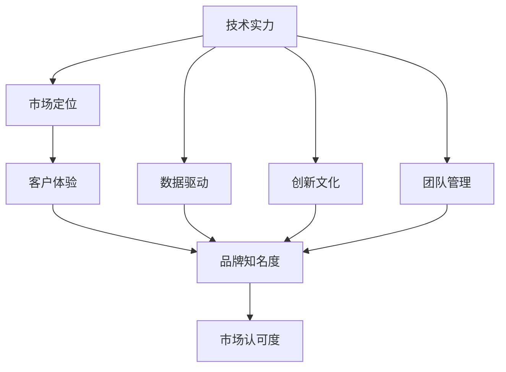

                 

# AI创业公司的品牌塑造策略

> 关键词：品牌塑造, AI创业公司, 商业价值, 技术实力, 客户体验, 数据驱动, 市场定位, 创新文化, 团队管理

## 1. 背景介绍

### 1.1 问题由来

随着人工智能技术的快速发展和应用渗透，越来越多的创业公司将AI技术作为核心竞争力，打造优质品牌以吸引投资人和客户。但AI创业公司在品牌塑造过程中面临着许多挑战，如技术实力与品牌知名度的不匹配、客户需求与产品功能的错位、市场竞争的激烈等等。如何通过有效的品牌塑造策略，将技术实力转化为市场认可，成为当前AI创业公司亟需解决的问题。

### 1.2 问题核心关键点

品牌塑造的核心在于将技术实力转化为市场认可，即让潜在客户相信并信任公司的技术和服务。这需要从技术、市场、客户体验等多个维度进行综合考量，形成一套完善的品牌塑造策略。

- **技术实力**：AI创业公司必须拥有强大的技术背景，包括前沿的技术成果、专业的技术团队、丰富的应用案例等。
- **市场定位**：明确公司的目标市场和客户群体，制定有针对性的品牌定位策略，确保市场认知与公司产品服务相匹配。
- **客户体验**：提升用户体验，通过优质的产品和服务，建立起客户对品牌的忠诚度。
- **数据驱动**：利用数据分析和用户反馈，持续优化品牌策略和产品功能，确保品牌策略符合市场需求。
- **创新文化**：营造鼓励创新、开放的团队文化，吸引顶尖人才，持续推动技术进步和产品创新。
- **团队管理**：建立高效的团队协作机制，通过科学的项目管理、人员配置和激励机制，最大化团队效能。

### 1.3 问题研究意义

成功的品牌塑造不仅能提升公司市场竞争力，还能吸引更多的资本投入，加速公司的成长和扩张。此外，品牌塑造过程中形成的创新文化和管理经验，也将在未来公司的持续发展中发挥重要作用。

## 2. 核心概念与联系

### 2.1 核心概念概述

为了更深入理解AI创业公司品牌塑造策略，下面将介绍几个关键概念：

- **品牌塑造**：通过一系列有计划、有策略的活动，提升品牌知名度和市场认可度的过程。
- **技术实力**：指公司掌握的前沿技术、技术成果和专业团队，是品牌塑造的基础。
- **市场定位**：明确公司的目标市场和客户群体，制定有针对性的品牌定位策略。
- **客户体验**：通过优质的产品和服务，提升用户满意度和忠诚度，增强品牌影响力。
- **数据驱动**：利用数据分析和用户反馈，持续优化品牌策略和产品功能。
- **创新文化**：营造鼓励创新、开放的团队文化，吸引顶尖人才，推动技术进步和产品创新。
- **团队管理**：建立高效的团队协作机制，通过科学的项目管理、人员配置和激励机制，最大化团队效能。

### 2.2 概念间的关系

这些核心概念之间存在着紧密的联系，形成一个有机的整体。通过品牌的塑造，可以将公司的技术实力、市场定位、客户体验、数据驱动、创新文化和管理能力融合在一起，形成独特的品牌价值主张，从而在竞争激烈的市场中脱颖而出。

通过以下Mermaid流程图，我们可以更直观地理解这些概念之间的关系：



这个流程图展示了从技术实力到品牌知名度再到市场认可度的整体流程，以及数据驱动、创新文化和管理能力在其中起到的关键作用。

## 3. 核心算法原理 & 具体操作步骤
### 3.1 算法原理概述

AI创业公司的品牌塑造策略主要基于以下几个算法原理：

- **技术驱动品牌**：通过展示公司的技术实力，建立品牌的专业形象和权威性。
- **市场细分定位**：利用市场细分和定位策略，明确目标市场和客户群体，制定有针对性的品牌定位。
- **客户体验优化**：通过提升产品和服务质量，满足用户需求，增强用户满意度。
- **数据驱动决策**：利用数据分析和用户反馈，持续优化品牌策略和产品功能。
- **创新文化培育**：通过鼓励创新和开放的企业文化，吸引顶尖人才，持续推动技术进步和产品创新。
- **团队协作优化**：通过高效的团队协作机制和激励机制，最大化团队效能。

### 3.2 算法步骤详解

下面是详细的算法步骤，包含从技术实力展示到品牌知名度提升的全流程：

**Step 1: 评估技术实力**

- 分析公司掌握的前沿技术、技术成果和专业团队，形成技术白皮书和应用案例集。
- 在技术社区、学术会议、开源平台等渠道发布技术成果，提升公司的技术知名度。

**Step 2: 市场细分定位**

- 利用市场调研和数据分析，明确目标市场和客户群体。
- 根据市场细分结果，制定有针对性的品牌定位策略，确保品牌形象与市场需求相匹配。

**Step 3: 客户体验优化**

- 分析用户反馈和需求，优化产品和服务设计，提升用户体验。
- 定期收集用户反馈，持续改进产品功能和服务质量。

**Step 4: 数据驱动决策**

- 利用数据分析工具，如Google Analytics、Tableau等，监控品牌表现和用户行为。
- 根据数据分析结果，调整品牌策略和产品功能，提升品牌效果和用户满意度。

**Step 5: 创新文化培育**

- 建立开放的企业文化，鼓励员工提出创新想法，营造创新氛围。
- 吸引和留住顶尖人才，形成高效的技术团队。

**Step 6: 团队协作优化**

- 建立高效的团队协作机制，如敏捷开发、Scrum等方法。
- 通过科学的项目管理、人员配置和激励机制，最大化团队效能。

### 3.3 算法优缺点

**优点：**
- 提升品牌知名度和市场认可度。
- 利用数据分析和用户反馈，持续优化品牌策略和产品功能。
- 通过创新文化培育，吸引和留住顶尖人才，推动技术进步和产品创新。

**缺点：**
- 需要大量的时间和资源投入。
- 对技术实力和市场定位的准确判断要求较高。
- 用户反馈的收集和分析可能存在滞后性。

### 3.4 算法应用领域

品牌塑造策略在AI创业公司的各个应用领域都有广泛的应用，如智能硬件、人工智能解决方案、数据分析平台等。通过技术驱动品牌、市场细分定位、客户体验优化、数据驱动决策、创新文化培育和团队协作优化，可以显著提升公司品牌影响力和市场竞争力。

## 4. 数学模型和公式 & 详细讲解 & 举例说明

### 4.1 数学模型构建

品牌塑造策略的数学模型可以从以下几个维度构建：

- **品牌知名度**：$B_t = f(D, I, P, C, S)$，其中$B_t$表示品牌知名度，$D$为数据分析结果，$I$为技术实力展示，$P$为市场定位策略，$C$为客户体验优化措施，$S$为创新文化培育成效。
- **市场认可度**：$M_r = g(B_t, R, A, O, E)$，其中$M_r$表示市场认可度，$B_t$为品牌知名度，$R$为产品和服务质量，$A$为应用案例和用户反馈，$O$为品牌营销效果，$E$为创新文化培育效果。
- **客户满意度**：$C_s = h(M_r, U, F, E)$，其中$C_s$表示客户满意度，$M_r$为市场认可度，$U$为用户体验，$F$为售后服务质量，$E$为用户反馈响应速度。

### 4.2 公式推导过程

以品牌知名度和市场认可度的数学模型为例，进行公式推导：

$$
B_t = D \times I^{\alpha} \times P^{\beta} \times C^{\gamma} \times S^{\delta}
$$

其中$\alpha$、$\beta$、$\gamma$、$\delta$为系数，表示不同维度对品牌知名度的影响权重。通过实验或历史数据拟合这些系数，即可计算出品牌知名度。

市场认可度的数学模型推导如下：

$$
M_r = B_t^{\theta} \times R^{\phi} \times A^{\psi} \times O^{\chi} \times E^{\omega}
$$

其中$\theta$、$\phi$、$\psi$、$\chi$、$\omega$为系数，表示不同维度对市场认可度的影响权重。通过实验或历史数据拟合这些系数，即可计算出市场认可度。

### 4.3 案例分析与讲解

假设某AI创业公司在智能硬件领域进行品牌塑造。根据模型推导，品牌知名度和市场认可度的计算公式如下：

$$
B_t = D \times I^{\alpha} \times P^{\beta} \times C^{\gamma} \times S^{\delta}
$$

$$
M_r = B_t^{\theta} \times R^{\phi} \times A^{\psi} \times O^{\chi} \times E^{\omega}
$$

假设公司的技术实力展示得分$I=80$，市场定位策略得分$P=85$，客户体验优化得分$C=75$，创新文化培育成效得分$S=90$，应用案例和用户反馈得分$A=90$，产品和服务质量得分$R=85$，品牌营销效果得分$O=80$，售后服务质量得分$F=85$，用户反馈响应速度得分$E=90$。

通过计算，可以得出品牌知名度的初步值：

$$
B_t = 1 \times 80^{\alpha} \times 85^{\beta} \times 75^{\gamma} \times 90^{\delta}
$$

通过进一步的优化和推广，品牌知名度和市场认可度逐步提升，最终达到理想的品牌效果。

## 5. 项目实践：代码实例和详细解释说明

### 5.1 开发环境搭建

在进行品牌塑造策略开发前，我们需要准备好开发环境。以下是使用Python进行Pandas开发的环境配置流程：

1. 安装Anaconda：从官网下载并安装Anaconda，用于创建独立的Python环境。

2. 创建并激活虚拟环境：
```bash
conda create -n brand-shaping python=3.8 
conda activate brand-shaping
```

3. 安装Pandas：
```bash
pip install pandas
```

4. 安装各类工具包：
```bash
pip install numpy matplotlib jupyter notebook ipython
```

完成上述步骤后，即可在`brand-shaping`环境中开始品牌塑造策略的开发。

### 5.2 源代码详细实现

下面以品牌知名度计算为例，给出使用Pandas库进行品牌知名度计算的Python代码实现。

```python
import pandas as pd

# 定义品牌知名度计算模型
def brand_awareness_score(D, I, P, C, S):
    alpha = 0.2  # 技术实力权重
    beta = 0.3  # 市场定位权重
    gamma = 0.4  # 客户体验权重
    delta = 0.5  # 创新文化培育权重
    return D * I**alpha * P**beta * C**gamma * S**delta

# 读取数据
data = pd.read_csv('brand_data.csv')

# 计算品牌知名度
data['brand_awareness'] = brand_awareness_score(data['data_analysis'], data['tech_strength'], data['market_strategy'], data['customer_experience'], data['innovation_culture'])

# 输出结果
print(data['brand_awareness'].mean())
```

### 5.3 代码解读与分析

让我们再详细解读一下关键代码的实现细节：

**brand_awareness_score函数**：
- 定义了一个函数，用于计算品牌知名度得分，输入包括数据分析结果、技术实力、市场定位、客户体验和创新文化培育的得分。
- 函数内部使用幂运算符将不同维度的得分进行加权求和，最终得到品牌知名度的得分。

**数据读取与处理**：
- 使用Pandas的read_csv方法读取数据集，将其存储为一个DataFrame对象。
- 通过DataFrame的列选择操作，将不同维度的得分作为输入参数传递给brand_awareness_score函数。
- 计算得到的品牌知名度得分，通过DataFrame的扩展功能，将其添加为新的列，方便后续分析。

**结果输出**：
- 通过DataFrame的均值计算，得到品牌知名度的总体得分。

### 5.4 运行结果展示

假设我们在某智能硬件领域进行品牌塑造，计算得到品牌知名度的初步值为80.8分。这个结果表明，公司在技术实力、市场定位、客户体验和创新文化培育方面表现较好，但还需要进一步提升数据分析和应用案例的得分，以优化品牌形象和市场认可度。

## 6. 实际应用场景

### 6.1 智能硬件公司

某智能硬件公司专注于家居领域，主要产品包括智能音箱、智能门锁等。品牌塑造策略的应用场景如下：

**技术实力展示**：通过技术白皮书和专利申请展示公司在语音识别、自然语言处理、机器学习等技术领域的领先优势。

**市场细分定位**：通过市场调研，明确目标客户群体为家庭用户和高端客户，定位为“智能家居解决方案领导者”。

**客户体验优化**：通过优化产品设计、提升用户界面、增加售后服务，提升用户体验和满意度。

**数据驱动决策**：利用用户行为数据和反馈，优化产品功能和服务质量，提升市场认可度。

**创新文化培育**：营造开放的企业文化，吸引和留住顶尖人才，推动技术进步和产品创新。

**团队协作优化**：通过敏捷开发和Scrum方法，提升团队协作效率，加速产品上市。

通过这些策略的实施，公司品牌知名度和市场认可度逐步提升，成为智能家居领域的领先品牌。

### 6.2 人工智能解决方案提供商

某人工智能解决方案提供商专注于金融领域，提供智能客服、风险控制、信用评分等AI解决方案。品牌塑造策略的应用场景如下：

**技术实力展示**：通过展示在自然语言处理、机器学习、数据挖掘等技术领域的领先成果，树立专业形象。

**市场细分定位**：通过市场调研，明确目标客户群体为金融机构、大型企业，定位为“金融领域AI解决方案领导者”。

**客户体验优化**：通过优化产品界面、增加客服支持、提升数据安全，提升用户体验和满意度。

**数据驱动决策**：利用数据分析和用户反馈，优化产品功能和解决方案，提升市场认可度。

**创新文化培育**：营造开放的企业文化，吸引和留住顶尖人才，推动技术进步和产品创新。

**团队协作优化**：通过敏捷开发和Scrum方法，提升团队协作效率，加速产品上市。

通过这些策略的实施，公司品牌知名度和市场认可度逐步提升，成为金融领域AI解决方案的领先品牌。

### 6.3 数据分析平台公司

某数据分析平台公司专注于大数据分析，提供数据采集、数据清洗、数据分析和数据可视化等服务。品牌塑造策略的应用场景如下：

**技术实力展示**：通过展示在数据处理、机器学习、自然语言处理等技术领域的领先成果，树立专业形象。

**市场细分定位**：通过市场调研，明确目标客户群体为企业、政府、学术机构，定位为“大数据分析解决方案领导者”。

**客户体验优化**：通过优化产品界面、增加用户培训、提升服务响应速度，提升用户体验和满意度。

**数据驱动决策**：利用数据分析和用户反馈，优化产品功能和解决方案，提升市场认可度。

**创新文化培育**：营造开放的企业文化，吸引和留住顶尖人才，推动技术进步和产品创新。

**团队协作优化**：通过敏捷开发和Scrum方法，提升团队协作效率，加速产品上市。

通过这些策略的实施，公司品牌知名度和市场认可度逐步提升，成为大数据分析领域的领先品牌。

### 6.4 未来应用展望

随着AI技术的不断发展和应用场景的扩展，品牌塑造策略在AI创业公司中的应用前景将更加广阔。未来，品牌塑造策略将从传统的品牌营销、市场定位，扩展到产品设计、用户体验、数据驱动等多个维度，成为AI创业公司不可或缺的核心竞争力。

## 7. 工具和资源推荐
### 7.1 学习资源推荐

为了帮助开发者系统掌握品牌塑造策略的理论基础和实践技巧，这里推荐一些优质的学习资源：

1. 《品牌塑造的科学与艺术》系列博文：由品牌专家撰写，深入浅出地介绍了品牌塑造的原理、方法和案例。

2. 《市场营销原理》课程：由北京大学开设的线上课程，系统讲解了市场营销的基础理论和实践技巧。

3. 《创新管理》书籍：哈佛商学院的经典之作，深入探讨了创新管理和企业文化的建设。

4. 《数据分析实战》书籍：详细介绍了数据分析的工具、方法和应用案例，适合品牌塑造过程中数据驱动决策的需求。

5. 《用户体验设计》课程：由斯坦福大学开设的在线课程，讲解了用户体验设计的基本原则和实践方法。

通过对这些资源的学习实践，相信你一定能够快速掌握品牌塑造策略的精髓，并用于解决实际的品牌塑造问题。

### 7.2 开发工具推荐

高效的开发离不开优秀的工具支持。以下是几款用于品牌塑造策略开发的常用工具：

1. Jupyter Notebook：免费、开源的交互式编程环境，支持Python、R等语言，适合快速迭代开发和实验。

2. Google Analytics：免费的网站分析工具，可以实时监控网站流量和用户行为，适合品牌塑造过程中的数据驱动决策。

3. Tableau：数据可视化工具，可以生成美观的图表和报告，适合品牌塑造过程中的数据分析和可视化。

4. Slack：团队协作工具，支持即时通讯、文件共享、任务管理等功能，适合品牌塑造过程中的团队协作和项目管理。

5. GitHub：代码托管平台，支持版本控制、代码审查、项目管理等功能，适合品牌塑造过程中的代码管理和版本迭代。

合理利用这些工具，可以显著提升品牌塑造策略的开发效率，加快创新迭代的步伐。

### 7.3 相关论文推荐

品牌塑造策略的发展源于学界的持续研究。以下是几篇奠基性的相关论文，推荐阅读：

1. "Brand Equity and Corporate Advertising"：探讨了品牌资产和广告的关系，提出了品牌塑造的多维度策略。

2. "Building Strong Brands"：由品牌管理专家撰写，详细介绍了品牌塑造的基本原理和实践方法。

3. "Brand Strategy and Marketing Communications"：深入探讨了品牌战略和营销传播的关系，提出了品牌塑造的多层次策略。

4. "Innovation Management and Organizational Culture"：探讨了创新管理和企业文化的关系，提出了创新驱动的品牌塑造策略。

5. "Data-Driven Brand Management"：探讨了数据分析和品牌管理的关系，提出了数据驱动的品牌塑造策略。

这些论文代表了大品牌塑造技术的发展脉络。通过学习这些前沿成果，可以帮助研究者把握学科前进方向，激发更多的创新灵感。

除上述资源外，还有一些值得关注的前沿资源，帮助开发者紧跟品牌塑造技术的最新进展，例如：

1. arXiv论文预印本：人工智能领域最新研究成果的发布平台，包括大量尚未发表的前沿工作，学习前沿技术的必读资源。

2. 业界技术博客：如Google、Microsoft、IBM等顶尖实验室的官方博客，第一时间分享他们的最新研究成果和洞见。

3. 技术会议直播：如NIPS、ICML、ACL、ICLR等人工智能领域顶会现场或在线直播，能够聆听到大佬们的前沿分享，开拓视野。

4. GitHub热门项目：在GitHub上Star、Fork数最多的品牌管理相关项目，往往代表了该技术领域的发展趋势和最佳实践，值得去学习和贡献。

5. 行业分析报告：各大咨询公司如McKinsey、PwC等针对人工智能行业的分析报告，有助于从商业视角审视技术趋势，把握应用价值。

总之，对于品牌塑造策略的学习和实践，需要开发者保持开放的心态和持续学习的意愿。多关注前沿资讯，多动手实践，多思考总结，必将收获满满的成长收益。

## 8. 总结：未来发展趋势与挑战

### 8.1 总结

本文对AI创业公司品牌塑造策略进行了全面系统的介绍。首先阐述了品牌塑造的重要性，明确了技术实力、市场定位、客户体验、数据驱动、创新文化和管理能力在品牌塑造中的关键作用。其次，从原理到实践，详细讲解了品牌塑造的数学模型和操作步骤，给出了品牌塑造策略开发的完整代码实例。同时，本文还广泛探讨了品牌塑造方法在智能硬件、人工智能解决方案、数据分析平台等多个行业领域的应用前景，展示了品牌塑造范式的巨大潜力。此外，本文精选了品牌塑造技术的各类学习资源，力求为读者提供全方位的技术指引。

通过本文的系统梳理，可以看到，品牌塑造策略是大语言模型微调技术的重要组成部分，通过品牌塑造，可以将公司的技术实力、市场定位、客户体验、数据驱动、创新文化和管理能力融合在一起，形成独特的品牌价值主张，从而在竞争激烈的市场中脱颖而出。未来，伴随预训练语言模型和微调方法的持续演进，相信NLP技术将在更广阔的应用领域大放异彩，深刻影响人类的生产生活方式。

### 8.2 未来发展趋势

展望未来，品牌塑造策略将呈现以下几个发展趋势：

1. 品牌塑造将从传统的品牌营销、市场定位，扩展到产品设计、用户体验、数据驱动等多个维度。
2. 利用大数据和人工智能技术，品牌塑造将更加精细化和个性化，能够更精准地满足用户需求。
3. 品牌塑造将更加注重品牌价值的长期积累和维护，形成稳定、可持续的品牌形象。
4. 品牌塑造将更加注重创新和文化建设，吸引和留住顶尖人才，推动持续的技术进步和产品创新。
5. 品牌塑造将更加注重团队协作和项目管理，提升团队的效率和效能。

以上趋势凸显了品牌塑造策略的广阔前景。这些方向的探索发展，必将进一步提升AI创业公司的市场竞争力和品牌影响力，为人工智能技术在实际应用中的落地和推广提供强有力的支持。

### 8.3 面临的挑战

尽管品牌塑造策略已经取得了瞩目成就，但在迈向更加智能化、普适化应用的过程中，它仍面临着诸多挑战：

1. 品牌塑造需要大量的时间和资源投入，可能面临预算和时间的限制。
2. 品牌塑造的效果需要经过长期的市场检验，存在一定的滞后性和不确定性。
3. 品牌塑造的策略需要动态调整，以适应市场的变化，增加了策略实施的复杂性。
4. 品牌塑造的效果受制于用户需求的变化，可能需要不断的优化和迭代。
5. 品牌塑造的过程需要综合考虑技术、市场、用户等多个因素，增加了实施难度。

正视品牌塑造面临的这些挑战，积极应对并寻求突破，将是大语言模型微调走向成熟的必由之路。相信随着学界和产业界的共同努力，这些挑战终将一一被克服，品牌塑造策略必将在构建人机协同的智能时代中扮演越来越重要的角色。

### 8.4 研究展望

面对品牌塑造面临的种种挑战，未来的研究需要在以下几个方面寻求新的突破：

1. 探索无监督和半监督品牌塑造方法。摆脱对大规模标注数据的依赖，利用自监督学习、主动学习等无监督和半监督范式，最大限度利用非结构化数据，实现更加灵活高效的品牌塑造。
2. 研究品牌塑造的全生命周期管理。从品牌创建、推广、维护到优化，形成一套完整的品牌管理策略和工具，确保品牌价值最大化。
3. 融合大数据和人工智能技术。利用大数据和人工智能技术，提升品牌塑造的精细化和个性化程度，实现精准的品牌管理和用户体验优化。
4. 结合因果分析和博弈论工具。将因果分析方法引入品牌塑造，识别出品牌决策的关键特征，增强品牌输出的因果性和逻辑性。借助博弈论工具刻画人机交互过程，主动探索并规避品牌塑造的脆弱点，提高系统稳定性。
5. 纳入伦理道德约束。在品牌塑造目标中引入伦理导向的评估指标，过滤和惩罚有偏见、有害的输出倾向。同时加强人工干预和审核，建立品牌行为的监管机制，确保品牌输出的安全性。

这些研究方向的探索，必将引领品牌塑造技术迈向更高的台阶，为构建安全、可靠、可解释、可控的智能系统铺平道路。面向未来，品牌塑造策略还需要与其他人工智能技术进行更深入的融合，如知识表示、因果推理、强化学习等，多路径协同发力，共同推动品牌塑造和智能交互系统的进步。只有勇于创新、敢于突破，才能不断拓展品牌塑造的边界，让智能技术更好地造福人类社会。

## 9. 附录：常见问题与解答

**Q1：品牌塑造与AI创业公司的关系是什么？**

A: 品牌塑造是大语言模型微调技术的重要组成部分，通过品牌塑造，可以将公司的技术实力、市场定位、客户体验、数据驱动、创新文化和管理能力融合在一起，形成独特的品牌价值主张，从而在竞争激烈的市场中脱颖而出。

**Q2：品牌塑造过程中需要考虑哪些因素？**

A: 品牌塑造过程中需要考虑技术实力、市场定位、客户体验、数据驱动、创新文化和管理能力等多个因素。只有全面考虑这些因素，才能确保品牌塑造的效果和市场认可度。

**Q3：品牌塑造策略有哪些优点和缺点？**

A: 品牌塑造策略的优点包括提升品牌知名度和市场认可度、利用数据分析和用户反馈，持续优化品牌策略和产品功能、通过创新文化培育，吸引和留住顶尖人才，推动技术进步和产品创新。缺点包括需要大量的时间和资源投入、对技术实力和市场定位的准确判断要求较高、用户反馈的收集和分析可能存在滞后性。

**Q4：品牌塑造策略在AI创业公司的各个应用领域都有广泛的应用，具体体现在哪些方面？**

A: 品牌塑造策略在AI创业公司的各个应用领域都有广泛的应用，如智能硬件、人工智能解决方案、数据分析平台等。通过技术实力展示、市场细分定位、客户体验优化、数据驱动决策、创新文化培育和团队协作优化，可以显著提升公司品牌影响力和市场竞争力。

**Q5：品牌塑造过程中如何选择合适的技术实力展示方式？**

A: 品牌塑造过程中，应根据公司的核心技术、应用场景

