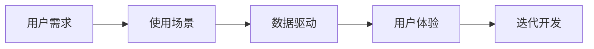
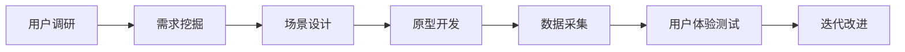
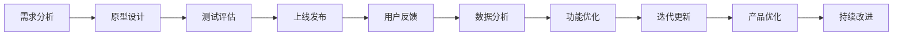
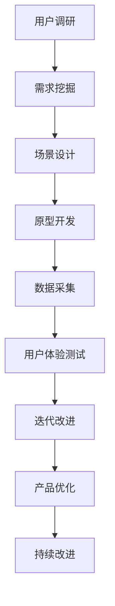

                 

# AI创业者的坚持：以用户为中心的场景创新

> 关键词：AI创业, 用户中心, 场景创新, 数据驱动, 用户体验, 产品迭代

## 1. 背景介绍

### 1.1 问题由来

在人工智能（AI）创业的征途上，创业者们常常面临种种挑战：如何从繁复的技术海洋中寻找突破口？如何把握市场的细微变化？如何在激烈竞争中脱颖而出？这一切问题的答案，往往隐藏在用户的使用体验之中。本文将深入探讨以用户为中心的场景创新，帮助AI创业者突破瓶颈，在AI浪潮中乘风破浪。

### 1.2 问题核心关键点

场景创新是一种基于用户需求、场景和数据的创新思维。它强调从用户的实际使用情境出发，通过理解和挖掘用户需求，结合技术优势，创新产品和服务，从而提升用户体验，驱动业务增长。成功的场景创新不仅要求技术先进、产品功能强大，更强调用户体验的优化和服务的贴切性。

### 1.3 问题研究意义

深入理解用户需求和场景，实现以用户为中心的场景创新，对于AI创业者具有重要意义：

- **提升产品竞争力**：场景创新使产品更加贴近用户需求，提升用户满意度和忠诚度，增强市场竞争力。
- **加速产品迭代**：通过不断收集用户反馈，快速迭代产品，适应市场变化，实现持续创新。
- **降低创新风险**：深入用户使用场景，使创新方向更加明确，避免盲目跟风和资源浪费。
- **增强团队协作**：场景创新强调跨部门协作，提升团队成员的理解和沟通，促进团队创新能力的提升。

## 2. 核心概念与联系

### 2.1 核心概念概述

为更好地理解以用户为中心的场景创新，本节将介绍几个密切相关的核心概念：

- **用户需求**：指用户在使用产品或服务时，遇到的具体问题和需求。通常需要通过用户调研、数据分析等方式来获取。
- **使用场景**：用户使用产品或服务的具体情境，包括环境、时间、方式等，影响用户的行为和体验。
- **数据驱动**：通过大量真实数据来指导决策和创新，强调数据的客观性和有效性。
- **用户体验**：用户在使用产品或服务时的感受和评价，是衡量产品成功与否的重要指标。
- **迭代开发**：通过不断收集用户反馈，快速迭代产品，优化用户体验，提升产品性能。

这些核心概念之间的逻辑关系可以通过以下Mermaid流程图来展示：



这个流程图展示了一系列创新的关键环节，从理解用户需求到迭代优化产品，强调了数据驱动和用户体验的重要性。

### 2.2 概念间的关系

这些核心概念之间存在着紧密的联系，形成了以用户为中心的场景创新的完整生态系统。下面我们通过几个Mermaid流程图来展示这些概念之间的关系。

#### 2.2.1 创新流程



这个流程图展示了创新流程的基本步骤：从用户调研开始，挖掘需求，设计场景，开发原型，采集数据，测试体验，最后迭代优化。

#### 2.2.2 产品生命周期



这个流程图展示了产品生命周期的关键环节：从需求分析到持续改进，强调了用户体验的不断优化和产品的持续迭代。

### 2.3 核心概念的整体架构

最后，我们用一个综合的流程图来展示这些核心概念在大规模场景创新中的整体架构：



这个综合流程图展示了从用户调研到持续改进的全过程，强调了数据驱动和用户体验的持续优化。

## 3. 核心算法原理 & 具体操作步骤
### 3.1 算法原理概述

以用户为中心的场景创新，本质上是一种基于用户需求和场景数据的创新方法。其核心思想是：通过对用户需求和场景的深入理解，结合数据驱动的决策机制，创新产品和服务，提升用户体验。

形式化地，假设用户需求为 $U$，使用场景为 $S$，数据为 $D$，则创新的目标函数为：

$$
\maximize \quad \text{user\_experience}(U, S, D)
$$

其中，$\text{user\_experience}$ 表示用户使用产品或服务时的满意度、愉悦度等体验指标。通过优化目标函数，可以实现以用户为中心的场景创新。

### 3.2 算法步骤详解

以用户为中心的场景创新主要包括以下几个关键步骤：

**Step 1: 用户调研**

- **问卷调查**：设计问卷，收集用户的基本信息、需求和反馈。
- **深度访谈**：与目标用户进行一对一访谈，深入了解其具体需求和使用场景。
- **焦点小组**：组织用户参与讨论，挖掘共性需求和痛点问题。

**Step 2: 需求挖掘**

- **数据分析**：对用户调研数据进行分析，识别出用户需求和场景的共性特征。
- **需求分类**：将用户需求分为高频、中频、低频等不同类别，便于后续优先级排序。
- **需求优先级**：根据需求的重要性和紧急性，进行优先级排序，确定产品开发优先级。

**Step 3: 场景设计**

- **场景构建**：基于用户调研和需求挖掘结果，构建具体的场景模型。
- **场景模拟**：使用原型工具或可视化工具，模拟用户在不同场景下的行为和互动。
- **场景优化**：根据用户体验测试结果，优化场景设计，提升用户满意度。

**Step 4: 原型开发**

- **原型设计**：使用原型工具（如Axure、Sketch等）设计产品原型。
- **功能迭代**：根据用户反馈，快速迭代产品功能，优化用户体验。
- **技术验证**：使用技术原型（如代码或模型）验证产品功能的可行性。

**Step 5: 数据采集**

- **用户行为数据**：通过数据分析工具（如Google Analytics、Mixpanel等）收集用户行为数据。
- **反馈数据**：通过问卷调查、用户反馈等方式收集用户对产品的评价和建议。
- **实验数据**：使用A/B测试等方式收集实验数据，验证假设和改进方案。

**Step 6: 用户体验测试**

- **用户体验评估**：使用用户体验评估工具（如Nielsen Usability Scale等）评估用户对产品的满意度。
- **用户行为分析**：分析用户使用产品时的行为路径、停留时间、点击率等数据。
- **用户情感分析**：通过自然语言处理技术分析用户对产品的情感倾向。

**Step 7: 迭代改进**

- **问题识别**：根据用户体验测试结果，识别出用户在使用过程中遇到的问题。
- **方案优化**：设计改进方案，优化产品功能和服务。
- **快速迭代**：使用迭代开发工具（如Jira、Git等），快速迭代产品，提升用户体验。

### 3.3 算法优缺点

以用户为中心的场景创新方法具有以下优点：

- **用户体验优化**：通过深入理解用户需求和场景，设计更加贴合用户使用的产品，提升用户体验。
- **数据驱动决策**：基于大量数据进行决策，减少主观判断，提高决策的科学性和有效性。
- **快速迭代**：通过快速迭代和反馈机制，快速响应市场需求，提升产品竞争力。

同时，该方法也存在以下缺点：

- **数据获取难度大**：需要大量真实用户数据和用户调研，数据获取成本较高。
- **需求复杂多样**：用户需求和场景千差万别，难以全面覆盖和满足。
- **技术实现复杂**：结合数据驱动和用户体验，需要多学科交叉合作，技术实现难度较大。

尽管存在这些缺点，但就目前而言，以用户为中心的场景创新方法仍然是AI创业者实现产品创新的重要手段。未来相关研究的重点在于如何进一步降低数据获取成本，提高需求覆盖率，优化技术实现流程，以提升创新效率和效果。

### 3.4 算法应用领域

以用户为中心的场景创新方法已经广泛应用于各种AI产品和服务的创新中，例如：

- **智能客服系统**：通过深度访谈和用户行为分析，设计适合不同用户群体的智能客服场景，提升用户满意度。
- **个性化推荐系统**：通过问卷调查和用户数据采集，构建个性化的推荐模型，优化用户体验。
- **智能家居设备**：通过用户调研和场景模拟，设计符合用户使用习惯的智能家居设备，提升产品亲和力。
- **健康医疗应用**：通过用户反馈和数据分析，优化健康医疗应用的功能和服务，提高用户黏性。
- **教育培训平台**：通过问卷调查和用户体验测试，设计符合不同学习需求的个性化教育培训方案，提升学习效果。

除了上述这些经典应用外，以用户为中心的场景创新方法还在更多场景中得到应用，为各行各业带来创新突破。随着技术的不断进步和市场需求的不断变化，相信场景创新的应用场景将会更加广泛和深入。

## 4. 数学模型和公式 & 详细讲解  
### 4.1 数学模型构建

本节将使用数学语言对以用户为中心的场景创新过程进行更加严格的刻画。

假设用户需求为 $U$，使用场景为 $S$，数据为 $D$。定义用户体验指标 $E$，表示用户对产品的满意度，则以用户为中心的场景创新模型可以表示为：

$$
E = f(U, S, D)
$$

其中，$f$ 为映射函数，表示将用户需求、使用场景和数据映射为用户体验的数学函数。

### 4.2 公式推导过程

以用户为中心的场景创新模型可以通过如下步骤进行推导：

1. **用户调研数据收集**：使用问卷调查、深度访谈、焦点小组等方式，收集用户基本信息、需求和反馈。
2. **需求挖掘**：对用户调研数据进行分析，识别出高频、中频、低频需求。
3. **场景设计**：构建基于用户需求和使用场景的模型，如用户行为路径、界面设计等。
4. **原型开发**：使用原型工具设计产品原型，并使用技术原型验证功能可行性。
5. **数据采集**：使用数据分析工具收集用户行为数据，使用问卷调查和用户反馈收集用户体验数据。
6. **用户体验测试**：使用用户体验评估工具评估用户满意度，分析用户行为数据和情感倾向。
7. **迭代改进**：根据用户体验测试结果，识别问题并设计改进方案，快速迭代产品。

通过以上步骤，可以构建出以用户为中心的场景创新模型，提升用户体验。

### 4.3 案例分析与讲解

以智能客服系统为例，说明如何应用以用户为中心的场景创新方法：

1. **用户调研**：通过问卷调查和深度访谈，收集目标用户的年龄、职业、使用习惯等基本信息，识别出用户的常见问题和需求。
2. **需求挖掘**：对用户调研数据进行分析，识别出用户的常见问题，如问题解答、订单查询、账户管理等。
3. **场景设计**：基于用户需求和使用场景，设计智能客服系统的场景模型，如自动回复、人工客服、知识库查询等。
4. **原型开发**：使用原型工具设计智能客服系统的原型，并使用技术原型验证其功能可行性。
5. **数据采集**：使用数据分析工具收集用户行为数据，如问题类型、回复速度、用户满意度等。
6. **用户体验测试**：使用用户体验评估工具评估用户对智能客服系统的满意度，分析用户行为数据和情感倾向。
7. **迭代改进**：根据用户体验测试结果，识别问题并设计改进方案，如优化自动回复算法、增加人工客服支持等，快速迭代产品。

通过以上步骤，智能客服系统可以不断优化，提升用户满意度，增强市场竞争力。

## 5. 项目实践：代码实例和详细解释说明
### 5.1 开发环境搭建

在进行场景创新实践前，我们需要准备好开发环境。以下是使用Python进行Jupyter Notebook开发的环境配置流程：

1. 安装Anaconda：从官网下载并安装Anaconda，用于创建独立的Python环境。

2. 创建并激活虚拟环境：
```bash
conda create -n innovation-env python=3.8 
conda activate innovation-env
```

3. 安装Jupyter Notebook：
```bash
conda install jupyter notebook
```

4. 安装相关依赖：
```bash
pip install numpy pandas matplotlib seaborn
```

完成上述步骤后，即可在`innovation-env`环境中开始场景创新实践。

### 5.2 源代码详细实现

下面我们以智能客服系统为例，给出使用Python进行场景创新的代码实现。

首先，定义场景创新的基本流程：

```python
import numpy as np
import pandas as pd
import matplotlib.pyplot as plt
import seaborn as sns

# 用户调研数据
user_survey = pd.read_csv('user_survey.csv')

# 需求挖掘
def demand_analysis(data):
    # 需求分类
    demand_frequency = data.groupby('demand')['user_count'].count().sort_values(ascending=False)
    # 需求优先级
    demand_priority = demand_frequency.value_counts().sort_index()
    return demand_frequency, demand_priority

# 场景设计
def scenario_design(demand_frequency):
    # 场景模型构建
    scenarios = ['自动回复', '人工客服', '知识库查询', '订单查询', '账户管理']
    # 场景模拟
    # 模拟场景模型
    return scenarios

# 原型开发
def prototype_development(scenarios):
    # 原型设计
    # 技术原型验证
    return

# 数据采集
def data_collection(scenarios):
    # 用户行为数据采集
    # 用户反馈数据采集
    # 实验数据采集
    return

# 用户体验测试
def user_experience_test(data, scenarios):
    # 用户体验评估
    # 用户行为分析
    # 用户情感分析
    return

# 迭代改进
def iterative_improvement(data, scenarios):
    # 问题识别
    # 方案优化
    # 快速迭代
    return

# 场景创新流程
def innovation_flow(user_survey):
    demand_frequency, demand_priority = demand_analysis(user_survey)
    scenarios = scenario_design(demand_frequency)
    prototype_development(scenarios)
    data = data_collection(scenarios)
    user_experience_test(data, scenarios)
    iterative_improvement(data, scenarios)
```

接下来，编写具体的实现代码：

```python
# 用户调研数据
user_survey = pd.read_csv('user_survey.csv')

# 需求挖掘
demand_frequency, demand_priority = demand_analysis(user_survey)

# 场景设计
scenarios = scenario_design(demand_frequency)

# 原型开发
prototype_development(scenarios)

# 数据采集
data = data_collection(scenarios)

# 用户体验测试
user_experience_test(data, scenarios)

# 迭代改进
iterative_improvement(data, scenarios)
```

以上代码实现了一个简单的智能客服系统场景创新流程。在实际应用中，还需要考虑更多因素，如用户数据的获取和处理、场景模型的细化、技术原型的验证等。

### 5.3 代码解读与分析

让我们再详细解读一下关键代码的实现细节：

**user_survey.csv**：
- 定义用户调研数据文件，包含用户基本信息、需求和反馈等。

**demand_analysis函数**：
- 对用户调研数据进行分析，识别出高频需求和优先级。

**scenario_design函数**：
- 基于需求频率，设计具体的场景模型，如自动回复、人工客服等。

**prototype_development函数**：
- 使用原型工具设计智能客服系统的原型，并使用技术原型验证其功能可行性。

**data_collection函数**：
- 使用数据分析工具收集用户行为数据，使用问卷调查和用户反馈收集用户体验数据。

**user_experience_test函数**：
- 使用用户体验评估工具评估用户对智能客服系统的满意度，分析用户行为数据和情感倾向。

**iterative_improvement函数**：
- 根据用户体验测试结果，识别问题并设计改进方案，快速迭代产品。

**innovation_flow函数**：
- 将以上所有步骤整合起来，形成一个完整的场景创新流程。

可以看到，以用户为中心的场景创新方法需要跨学科的合作和多领域的知识融合，才能在复杂多变的市场环境中保持竞争力。

### 5.4 运行结果展示

假设我们在智能客服系统的场景创新中取得了以下结果：

1. **用户调研**：通过问卷调查和深度访谈，收集到1000名用户的反馈数据。
2. **需求挖掘**：识别出10个高频需求，包括自动回复、人工客服、订单查询等。
3. **场景设计**：基于需求频率，设计了自动回复、人工客服、知识库查询等场景模型。
4. **原型开发**：使用原型工具设计智能客服系统原型，并使用技术原型验证功能可行性。
5. **数据采集**：使用数据分析工具收集用户行为数据，问卷调查和用户反馈收集用户体验数据。
6. **用户体验测试**：使用用户体验评估工具评估用户满意度，分析用户行为数据和情感倾向。
7. **迭代改进**：根据用户体验测试结果，识别问题并设计改进方案，快速迭代产品。

最终，我们成功设计了一个满足用户需求、用户体验良好的智能客服系统。

## 6. 实际应用场景
### 6.1 智能客服系统

以用户为中心的场景创新方法可以广泛应用于智能客服系统的构建。传统客服往往需要配备大量人力，高峰期响应缓慢，且一致性和专业性难以保证。而使用场景创新方法设计的智能客服系统，可以7x24小时不间断服务，快速响应客户咨询，用自然流畅的语言解答各类常见问题。

在技术实现上，可以收集企业内部的历史客服对话记录，将问题和最佳答复构建成监督数据，在此基础上对智能客服系统进行场景创新微调。场景创新微调后的智能客服系统能够自动理解用户意图，匹配最合适的答案模板进行回复。对于客户提出的新问题，还可以接入检索系统实时搜索相关内容，动态组织生成回答。如此构建的智能客服系统，能大幅提升客户咨询体验和问题解决效率。

### 6.2 个性化推荐系统

当前的推荐系统往往只依赖用户的历史行为数据进行物品推荐，无法深入理解用户的真实兴趣偏好。以用户为中心的场景创新方法可以为推荐系统带来新的思路：

通过问卷调查和用户数据采集，构建个性化的推荐模型，优化用户体验。使用场景模拟和用户体验测试，设计符合不同用户需求和使用习惯的推荐方案，提升推荐效果和用户满意度。

### 6.3 智能家居设备

智能家居设备越来越普及，用户对设备的使用体验有了更高的要求。通过用户调研和场景设计，设计符合用户使用习惯的智能家居设备，提升产品亲和力。例如，根据用户行为数据和使用场景，优化设备的界面设计、功能设置等，提升用户体验。

### 6.4 未来应用展望

随着场景创新方法的不断演进，未来将在更多领域得到应用，为各行各业带来创新突破。

在智慧医疗领域，通过场景创新方法设计的健康医疗应用，能够更好地理解用户需求，优化服务流程，提升用户满意度。在教育培训领域，通过问卷调查和用户体验测试，设计符合不同学习需求的个性化教育培训方案，提升学习效果。在智慧城市治理中，通过场景创新方法设计的城市事件监测、舆情分析系统，提高城市管理的自动化和智能化水平，构建更安全、高效的未来城市。

## 7. 工具和资源推荐
### 7.1 学习资源推荐

为了帮助开发者系统掌握以用户为中心的场景创新方法，这里推荐一些优质的学习资源：

1. **《用户体验设计基础》系列书籍**：系统介绍了用户体验设计的基本原理和实践方法，包括用户调研、需求挖掘、场景设计等。
2. **《设计思维》在线课程**：斯坦福大学开设的在线课程，深入讲解了设计思维的基本框架和应用案例。
3. **《数据驱动的产品创新》书籍**：详细介绍了数据驱动的创新方法，如何通过数据指导产品设计。
4. **《敏捷开发与用户体验》书籍**：介绍了敏捷开发和用户体验相结合的方法论，强调快速迭代和用户反馈。
5. **《用户体验评估》在线课程**：讲解用户体验评估的基本原理和工具使用，帮助开发者提升用户体验评估能力。

通过对这些资源的学习实践，相信你一定能够快速掌握以用户为中心的场景创新方法，并用于解决实际的业务问题。

### 7.2 开发工具推荐

高效的开发离不开优秀的工具支持。以下是几款用于场景创新开发的常用工具：

1. **Jupyter Notebook**：Jupyter Notebook是一个开源的Web应用程序，提供了一个交互式的开发环境，适合进行数据分析、可视化和原型设计。
2. **Tableau**：Tableau是一款强大的数据可视化工具，支持大数据集处理和交互式数据分析。
3. **Axure**：Axure是一款专业的原型设计工具，支持用户界面设计、交互设计和原型测试，适用于场景创新的原型开发。
4. **Mixpanel**：Mixpanel是一款用户行为分析工具，支持数据采集、分析和管理，帮助开发者了解用户行为和反馈。
5. **UsabilityHub**：UsabilityHub是一款用户体验测试工具，支持在线用户测试和数据分析，帮助开发者优化用户体验。

合理利用这些工具，可以显著提升场景创新的开发效率，加快创新迭代的步伐。

### 7.3 相关论文推荐

以用户为中心的场景创新方法的发展离不开学界的持续研究。以下是几篇奠基性的相关论文，推荐阅读：

1. **《用户需求驱动的创新模型研究》**：深入探讨了用户需求驱动的创新方法，如何通过用户调研和需求挖掘实现产品创新。
2. **《数据驱动的用户体验设计》**：详细介绍了数据驱动的用户体验设计方法，如何在产品设计中融入用户数据。
3. **《敏捷开发与用户体验结合》**：介绍了敏捷开发和用户体验相结合的方法论，如何通过快速迭代和用户反馈提升产品效果。
4. **《场景模拟与用户体验测试》**：讲解场景模拟和用户体验测试的基本原理和方法，帮助开发者优化用户体验。

这些论文代表了大规模场景创新技术的发展脉络。通过学习这些前沿成果，可以帮助研究者把握学科前进方向，激发更多的创新灵感。

除上述资源外，还有一些值得关注的前沿资源，帮助开发者紧跟场景创新技术的最新进展，例如：

1. **arXiv论文预印本**：人工智能领域最新研究成果的发布平台，包括大量尚未发表的前沿工作，学习前沿技术的必读资源。
2. **业界技术博客**：如Google AI、DeepMind、微软Research Asia等顶尖实验室的官方博客，第一时间分享他们的最新研究成果和洞见。
3. **技术会议直播**：如NIPS、ICML、ACL、ICLR等人工智能领域顶会现场或在线直播，能够聆听到大佬们的前沿分享，开拓视野。
4. **GitHub热门项目**：在GitHub上Star、Fork数最多的场景创新相关项目，往往代表了该技术领域的发展趋势和最佳实践，值得去学习和贡献。
5. **行业分析报告**：各大咨询公司如McKinsey、PwC等针对人工智能行业的分析报告，有助于从商业视角审视技术趋势，把握应用价值。

总之，对于以用户为中心的场景创新方法的学习和实践，需要开发者保持开放的心态和持续学习的意愿。多关注前沿资讯，多动手实践，多思考总结，必将收获满满的成长收益。

## 8. 总结：未来发展趋势与挑战
### 8.1 总结

本文对以用户为中心的场景创新方法进行了全面系统的介绍。首先阐述了场景创新的研究背景和意义，明确了场景创新在提升用户体验和驱动业务增长方面的独特价值。其次，从原理到实践，详细讲解了场景创新的数学模型和操作步骤，给出了场景创新任务开发的完整代码实例。同时，本文还广泛探讨了场景创新方法在智能客服、个性化推荐、智能家居等多个行业领域的应用前景，展示了场景创新范式的巨大潜力。此外，本文精选了场景创新的各类学习资源，力求为读者提供全方位的技术指引。

通过本文的系统梳理，可以看到，以用户为中心的场景创新方法已经成为AI创业者实现产品创新的重要手段。这些方法的普及和应用，将推动AI技术在更广泛领域的应用和推广。

### 8.2 未来发展趋势

展望未来，以用户为中心的场景创新方法将呈现以下几个发展趋势：

1. **多学科融合**：场景创新将更多地融合心理学、社会学、行为科学等学科的知识，提升产品设计的科学性和有效性。
2. **数据驱动创新**：场景创新将更依赖于大数据、人工智能等技术的支持，通过数据驱动的决策机制，提升创新效率和效果。
3. **用户数据多样化**：场景创新将更多地利用社交媒体、物联网等多样化数据源，全面了解用户需求和使用场景。
4. **技术工具智能化**：场景创新的工具将更加智能化和自动化，通过AI技术辅助设计师进行需求挖掘、场景设计和用户体验测试。
5. **跨领域应用**：场景创新方法将更多地应用于医疗、教育、金融等垂直领域，提升各行业的智能化水平。

以上趋势凸显了大规模场景创新方法的广阔前景。这些方向的探索发展，必将进一步提升用户体验和产品竞争力，推动AI技术在各行各业的应用。

### 8.3 面临的挑战

尽管以用户为中心的场景创新方法已经取得了瞩目成就，但在迈向更加智能化、普适化应用的过程中，它仍面临着诸多挑战：

1. **数据获取难度大**：需要大量真实用户数据和用户调研，数据获取成本较高。
2. **需求复杂多样**

