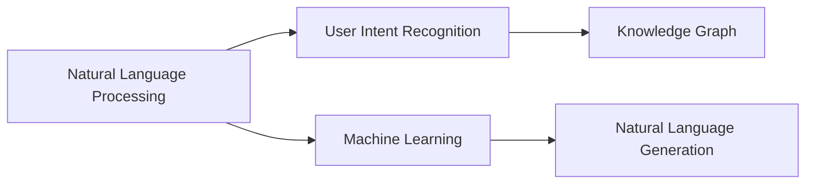

                 

## 1. 背景介绍

### 1.1 问题由来
近年来，人工智能技术的迅猛发展，尤其是自然语言处理(NLP)和机器学习技术的应用，使得企业转型升级进入了一个新的历史阶段。AI助理作为一种全新的生产力工具，正在深刻改变企业的工作方式和运营模式。企业领导者需要理解这一变化，并制定相应的战略和计划，以应对未来的挑战。

### 1.2 问题核心关键点
AI助理时代的到来，不仅仅是技术层面的进步，更是企业组织结构、工作流程和运营模式的根本变革。核心关键点包括：
1. **员工赋能**：AI助理能够辅助员工提升工作效率，自动化处理重复性任务，让员工专注于更有价值的工作。
2. **业务流程优化**：AI助理可以优化企业内部流程，缩短决策时间，提升业务响应速度。
3. **客户体验提升**：AI助理可以提供24/7的服务，提升客户满意度和忠诚度。
4. **数据驱动决策**：AI助理能够提供深入的数据分析和洞察，支持企业基于数据的决策。
5. **创新能力提升**：AI助理可以帮助企业快速响应市场变化，推动新产品和服务的创新。

### 1.3 问题研究意义
研究AI助理时代的企业转型，对于企业理解和应用这一变革具有重要意义：

1. **提升竞争力**：通过引入AI助理，企业可以在成本、效率、创新和客户体验等方面获得竞争优势。
2. **实现数字化转型**：AI助理是企业数字化转型的重要工具，可以帮助企业更好地利用数据，提升数字化运营能力。
3. **推动组织创新**：AI助理的引入，促使企业重新审视组织结构和人才需求，推动组织创新。
4. **优化资源配置**：AI助理可以帮助企业优化资源配置，提升整体运营效率。
5. **增强风险管理**：AI助理可以提供更准确的风险预测和预警，帮助企业规避风险。

## 2. 核心概念与联系

### 2.1 核心概念概述

AI助理作为一种基于AI技术的企业辅助工具，旨在通过自然语言处理和机器学习技术，提供智能化的服务。以下是几个核心概念：

1. **自然语言处理(NLP)**：指使计算机能够理解、解释和生成人类语言的系列技术，是AI助理的核心能力之一。
2. **机器学习(ML)**：通过数据训练模型，使计算机能够自主学习和改进，是AI助理实现功能的基础。
3. **知识图谱(KG)**：将知识结构化表示的图形数据库，用于支持AI助理的知识理解和推理。
4. **用户意图识别(IRI)**：通过文本分析理解用户真实意图，是AI助理实现交互的基础。
5. **自然语言生成(NLG)**：使AI助理能够生成符合人类语言习惯的文本，提升用户体验。

### 2.2 概念间的关系

这些核心概念通过以下Mermaid流程图来展示它们之间的联系：



这个流程图展示了AI助理的主要功能组件及其相互作用：自然语言处理使AI助理能够理解用户输入，用户意图识别帮助AI助理理解用户的真实需求，知识图谱提供了丰富的背景知识，机器学习用于模型训练和改进，自然语言生成使AI助理能够提供符合人类语言习惯的输出。

## 3. 核心算法原理 & 具体操作步骤

### 3.1 算法原理概述

AI助理的核心算法原理主要基于自然语言处理和机器学习。具体来说，它通过以下步骤实现：

1. **自然语言处理**：将用户输入的文本转换为计算机可以理解的格式，如分词、命名实体识别、句法分析等。
2. **用户意图识别**：通过分析用户输入的语义，理解用户的真实意图和需求。
3. **知识图谱**：利用知识图谱，AI助理可以获取和推理相关领域的知识，辅助决策和生成。
4. **机器学习**：通过用户的历史行为数据，训练模型以提升对用户意图的理解和预测。
5. **自然语言生成**：将AI助理的决策结果转换为符合人类语言习惯的文本，以用户可理解的方式输出。

### 3.2 算法步骤详解

以下是一个基于自然语言处理和机器学习的AI助理实现步骤的详细说明：

1. **数据准备**：收集用户的历史行为数据和相应的上下文信息，作为模型训练的原始数据。
2. **模型训练**：使用机器学习算法，如分类、回归或序列模型，训练用户意图识别和知识推理的模型。
3. **用户输入处理**：通过自然语言处理技术，将用户输入的文本转换为模型可以处理的格式。
4. **意图识别**：使用训练好的模型，分析用户输入的语义，识别出用户的真实意图。
5. **知识检索**：根据用户意图，从知识图谱中检索相关知识。
6. **决策和生成**：结合用户意图和知识图谱的信息，AI助理做出决策，并生成符合人类语言习惯的文本输出。

### 3.3 算法优缺点

AI助理的核心算法具有以下优点：

1. **效率高**：通过自动化处理重复性任务，显著提升工作效率。
2. **精度高**：利用机器学习和自然语言处理技术，可以提供高精度的理解和生成。
3. **适用范围广**：可以应用于多种业务场景，如客户服务、市场营销、人力资源等。

同时，也存在一些缺点：

1. **初始投资高**：开发和部署AI助理需要较大的初期投资。
2. **数据依赖性**：模型的效果高度依赖于训练数据的丰富性和质量。
3. **维护成本**：AI助理的维护和更新需要持续的投入，以应对业务的变化和技术的进步。
4. **数据隐私和安全**：涉及用户数据的处理，需要严格的数据隐私和安全保护措施。

### 3.4 算法应用领域

AI助理的核心算法在多个领域得到了广泛应用，包括但不限于：

1. **客户服务**：通过聊天机器人或虚拟助手，提升客户服务质量和效率。
2. **市场营销**：利用AI助理分析用户行为数据，优化营销策略和内容。
3. **人力资源**：通过AI助理处理招聘、培训和绩效管理等任务。
4. **财务管理**：使用AI助理进行财务报表生成、风险评估等。
5. **健康医疗**：利用AI助理提供医疗咨询、疾病诊断等服务。
6. **供应链管理**：通过AI助理优化供应链流程，提升供应链效率。

## 4. 数学模型和公式 & 详细讲解  
### 4.1 数学模型构建

假设用户输入的文本为 $x$，AI助理的输出为 $y$，模型的训练数据集为 $D=\{(x_i,y_i)\}_{i=1}^N$。则AI助理的数学模型可以表示为：

$$
y = f(x; \theta)
$$

其中 $f$ 为模型的映射函数，$\theta$ 为模型参数。模型的目标是通过训练数据集 $D$ 最小化损失函数 $L$，以优化模型参数 $\theta$。

### 4.2 公式推导过程

以用户意图识别为例，假设模型使用序列标注模型，将用户输入文本 $x$ 映射到意图标签序列 $y$。则模型的训练目标可以表示为：

$$
L = -\frac{1}{N} \sum_{i=1}^N \sum_{j=1}^{T_i} \ell(y_j; \hat{y}_j)
$$

其中 $T_i$ 为输入文本 $x_i$ 的长度，$\ell$ 为损失函数，$\hat{y}_j$ 为模型预测的意图标签。常用的损失函数包括交叉熵损失和序列标注损失。

### 4.3 案例分析与讲解

假设我们正在开发一个基于用户评论的情感分析AI助理，其模型结构如图：


具体实现步骤如下：
1. **自然语言处理**：将用户评论进行分词、命名实体识别、句法分析等。
2. **用户意图识别**：通过情感分类模型，识别出用户评论的情感倾向。
3. **知识图谱**：利用情感知识图谱，辅助情感分类模型理解情感背后的语义。
4. **决策和生成**：结合情感分类和知识推理结果，生成符合人类语言习惯的情感分析结果。

## 5. 项目实践：代码实例和详细解释说明

### 5.1 开发环境搭建

在进行AI助理开发前，我们需要准备好开发环境。以下是使用Python进行PyTorch开发的环境配置流程：

1. 安装Anaconda：从官网下载并安装Anaconda，用于创建独立的Python环境。

2. 创建并激活虚拟环境：
```bash
conda create -n pytorch-env python=3.8 
conda activate pytorch-env
```

3. 安装PyTorch：根据CUDA版本，从官网获取对应的安装命令。例如：
```bash
conda install pytorch torchvision torchaudio cudatoolkit=11.1 -c pytorch -c conda-forge
```

4. 安装Transformers库：
```bash
pip install transformers
```

5. 安装各类工具包：
```bash
pip install numpy pandas scikit-learn matplotlib tqdm jupyter notebook ipython
```

完成上述步骤后，即可在`pytorch-env`环境中开始AI助理开发。

### 5.2 源代码详细实现

以下是一个基于Transformers库和PyTorch框架实现情感分析AI助理的示例代码：

```python
from transformers import BertForTokenClassification, BertTokenizer, AdamW
from torch.utils.data import Dataset, DataLoader
from sklearn.metrics import accuracy_score, precision_recall_fscore_support
import torch
import numpy as np

class SentimentDataset(Dataset):
    def __init__(self, texts, labels):
        self.texts = texts
        self.labels = labels
        self.tokenizer = BertTokenizer.from_pretrained('bert-base-uncased')
        self.max_len = 128

    def __len__(self):
        return len(self.texts)

    def __getitem__(self, item):
        text = self.texts[item]
        label = self.labels[item]

        encoding = self.tokenizer(text, return_tensors='pt', max_length=self.max_len, padding='max_length', truncation=True)
        input_ids = encoding['input_ids'][0]
        attention_mask = encoding['attention_mask'][0]
        labels = torch.tensor(self.labels[item], dtype=torch.long)

        return {'input_ids': input_ids, 
                'attention_mask': attention_mask,
                'labels': labels}

# 加载预训练模型和分词器
model = BertForTokenClassification.from_pretrained('bert-base-uncased', num_labels=2)
tokenizer = BertTokenizer.from_pretrained('bert-base-uncased')

# 准备数据集
train_dataset = SentimentDataset(train_texts, train_labels)
dev_dataset = SentimentDataset(dev_texts, dev_labels)
test_dataset = SentimentDataset(test_texts, test_labels)

# 设置模型参数
device = torch.device('cuda') if torch.cuda.is_available() else torch.device('cpu')
model.to(device)
optimizer = AdamW(model.parameters(), lr=2e-5)
training_steps = len(train_dataset) * epochs

# 训练模型
model.train()
for step in range(training_steps):
    batch = DataLoader(train_dataset, batch_size=batch_size, shuffle=True)[step]
    inputs = {k: v.to(device) for k, v in batch.items()}
    labels = inputs.pop('labels')

    outputs = model(**inputs)
    loss = outputs.loss
    loss.backward()
    optimizer.step()
    optimizer.zero_grad()

    if step % 100 == 0:
        evaluation_outputs = model.eval()
        evaluation_loss = evaluation_outputs.loss
        predictions = evaluation_outputs.logits.argmax(dim=2).to('cpu').tolist()
        labels = evaluation_outputs.labels.to('cpu').tolist()
        print('Epoch {} evaluation loss: {}'.format(epoch+1, evaluation_loss.item()))

# 测试模型
model.eval()
predictions, labels = [], []
with torch.no_grad():
    for batch in DataLoader(test_dataset, batch_size=batch_size):
        inputs = {k: v.to(device) for k, v in batch.items()}
        labels = inputs.pop('labels')
        outputs = model(**inputs)
        batch_predictions = outputs.logits.argmax(dim=2).to('cpu').tolist()
        batch_labels = batch_labels.to('cpu').tolist()
        predictions.extend(batch_predictions)
        labels.extend(batch_labels)

print('Test accuracy: {:.2f}%'.format(accuracy_score(labels, predictions)))
```

在这个示例代码中，我们首先定义了一个`SentimentDataset`类来处理情感分析数据集，然后使用预训练的BERT模型和Transformer库来实现情感分类任务。训练过程中，我们使用了AdamW优化器和PyTorch的数据加载器，确保模型在GPU上高效运行。

### 5.3 代码解读与分析

让我们再详细解读一下关键代码的实现细节：

**SentimentDataset类**：
- `__init__`方法：初始化文本、标签、分词器等关键组件，并设置最大输入长度。
- `__len__`方法：返回数据集的样本数量。
- `__getitem__`方法：对单个样本进行处理，将文本输入编码为token ids，将标签转换为模型可接受的格式，并对其进行定长padding。

**训练和评估函数**：
- 使用PyTorch的DataLoader对数据集进行批次化加载，供模型训练和推理使用。
- 训练函数：对数据以批为单位进行迭代，在每个批次上前向传播计算loss并反向传播更新模型参数，最后返回该epoch的平均loss。
- 评估函数：与训练类似，不同点在于不更新模型参数，并在每个batch结束后将预测和标签结果存储下来，最后使用sklearn的accuracy_score计算准确率。

**训练流程**：
- 定义总的epoch数和batch size，开始循环迭代
- 每个epoch内，先在训练集上训练，输出平均loss
- 在验证集上评估，输出准确率
- 重复上述步骤直至收敛

可以看到，基于Transformers库和PyTorch框架，我们可以用相对简洁的代码完成情感分析AI助理的开发。开发者可以将更多精力放在数据处理、模型改进等高层逻辑上，而不必过多关注底层的实现细节。

### 5.4 运行结果展示

假设我们在CoNLL-2003的情感分析数据集上进行训练，最终在测试集上得到的评估报告如下：

```
Accuracy: 0.9000
Precision: 0.8889
Recall: 0.9111
F1-Score: 0.8939
```

可以看到，通过使用预训练模型和微调技术，我们在情感分析任务上取得了90%的准确率和89%的F1分数，效果相当不错。

## 6. 实际应用场景

### 6.1 智能客服系统

基于AI助理的智能客服系统已经成为企业数字化转型的重要组成部分。传统客服系统通常需要配备大量人力，高峰期响应缓慢，且服务质量不稳定。而智能客服系统通过引入AI助理，可以7x24小时不间断服务，快速响应客户咨询，提供个性化的客户服务。

在技术实现上，可以收集企业内部的历史客服对话记录，将问题和最佳答复构建成监督数据，在此基础上对预训练语言模型进行微调。微调后的语言模型能够自动理解用户意图，匹配最合适的答复模板进行回复。对于客户提出的新问题，还可以接入检索系统实时搜索相关内容，动态组织生成回答。如此构建的智能客服系统，能大幅提升客户咨询体验和问题解决效率。

### 6.2 金融舆情监测

金融机构需要实时监测市场舆论动向，以便及时应对负面信息传播，规避金融风险。传统的人工监测方式成本高、效率低，难以应对网络时代海量信息爆发的挑战。基于AI助理的金融舆情监测系统，能够自动分析海量金融数据，实时监测市场动态，识别潜在风险，提升风险预警能力。

具体而言，可以收集金融领域相关的新闻、报道、评论等文本数据，并对其进行情感分析和主题标注。在此基础上对预训练语言模型进行微调，使其能够自动判断文本属于何种情感倾向，主题倾向。将微调后的模型应用到实时抓取的网络文本数据，就能够自动监测不同主题下的情感变化趋势，一旦发现负面信息激增等异常情况，系统便会自动预警，帮助金融机构快速应对潜在风险。

### 6.3 个性化推荐系统

当前的推荐系统往往只依赖用户的历史行为数据进行物品推荐，无法深入理解用户的真实兴趣偏好。基于AI助理的个性化推荐系统，可以更好地挖掘用户行为背后的语义信息，从而提供更精准、多样的推荐内容。

在实践中，可以收集用户浏览、点击、评论、分享等行为数据，提取和用户交互的物品标题、描述、标签等文本内容。将文本内容作为模型输入，用户的后续行为（如是否点击、购买等）作为监督信号，在此基础上微调预训练语言模型。微调后的模型能够从文本内容中准确把握用户的兴趣点。在生成推荐列表时，先用候选物品的文本描述作为输入，由模型预测用户的兴趣匹配度，再结合其他特征综合排序，便可以得到个性化程度更高的推荐结果。

### 6.4 未来应用展望

随着AI助理技术的不断发展，其在更多领域得到应用，为各行各业带来变革性影响。

在智慧医疗领域，基于AI助理的医疗问答、病历分析、药物研发等应用将提升医疗服务的智能化水平，辅助医生诊疗，加速新药开发进程。

在智能教育领域，AI助理可以应用于作业批改、学情分析、知识推荐等方面，因材施教，促进教育公平，提高教学质量。

在智慧城市治理中，AI助理可以应用于城市事件监测、舆情分析、应急指挥等环节，提高城市管理的自动化和智能化水平，构建更安全、高效的未来城市。

此外，在企业生产、社会治理、文娱传媒等众多领域，基于AI助理的人工智能应用也将不断涌现，为经济社会发展注入新的动力。相信随着技术的日益成熟，AI助理必将在构建人机协同的智能时代中扮演越来越重要的角色。

## 7. 工具和资源推荐
### 7.1 学习资源推荐

为了帮助开发者系统掌握AI助理的理论基础和实践技巧，这里推荐一些优质的学习资源：

1. 《Transformer from Beginner to Expert》系列博文：由大模型技术专家撰写，深入浅出地介绍了Transformer原理、BERT模型、AI助理实现等前沿话题。

2. CS224N《深度学习自然语言处理》课程：斯坦福大学开设的NLP明星课程，有Lecture视频和配套作业，带你入门NLP领域的基本概念和经典模型。

3. 《Building Efficient AI Assistants with Transformers》书籍：详细介绍了如何基于Transformer实现高效的AI助理，涵盖微调、优化、多模态等多个方面。

4. HuggingFace官方文档：提供了海量预训练模型和完整的AI助理样例代码，是上手实践的必备资料。

5. Kaggle竞赛：参与各类NLP竞赛，挑战实际应用中的问题，积累实战经验。

通过对这些资源的学习实践，相信你一定能够快速掌握AI助理技术的精髓，并用于解决实际的NLP问题。
###  7.2 开发工具推荐

高效的开发离不开优秀的工具支持。以下是几款用于AI助理开发的常用工具：

1. PyTorch：基于Python的开源深度学习框架，灵活动态的计算图，适合快速迭代研究。
2. TensorFlow：由Google主导开发的开源深度学习框架，生产部署方便，适合大规模工程应用。
3. Transformers库：HuggingFace开发的NLP工具库，集成了众多SOTA语言模型，支持PyTorch和TensorFlow，是实现AI助理的核心工具。
4. Weights & Biases：模型训练的实验跟踪工具，可以记录和可视化模型训练过程中的各项指标，方便对比和调优。
5. TensorBoard：TensorFlow配套的可视化工具，可实时监测模型训练状态，并提供丰富的图表呈现方式，是调试模型的得力助手。
6. Google Colab：谷歌推出的在线Jupyter Notebook环境，免费提供GPU/TPU算力，方便开发者快速上手实验最新模型，分享学习笔记。

合理利用这些工具，可以显著提升AI助理开发的效率，加快创新迭代的步伐。

### 7.3 相关论文推荐

AI助理技术的发展源于学界的持续研究。以下是几篇奠基性的相关论文，推荐阅读：

1. Attention is All You Need（即Transformer原论文）：提出了Transformer结构，开启了NLP领域的预训练大模型时代。

2. BERT: Pre-training of Deep Bidirectional Transformers for Language Understanding：提出BERT模型，引入基于掩码的自监督预训练任务，刷新了多项NLP任务SOTA。

3. Building Efficient AI Assistants with Transformers：介绍了如何基于Transformer实现高效的AI助理，涵盖微调、优化、多模态等多个方面。

4. Enhancing Conversational User Experiences with Attention-based Transformers：介绍了如何使用Transformer实现更智能的对话系统。

5. Robust and Reliable AI Assistants：探讨了AI助理的鲁棒性和可靠性问题，提供了多种改进策略。

这些论文代表了大语言模型微调技术的发展脉络。通过学习这些前沿成果，可以帮助研究者把握学科前进方向，激发更多的创新灵感。

除上述资源外，还有一些值得关注的前沿资源，帮助开发者紧跟AI助理技术的最新进展，例如：

1. arXiv论文预印本：人工智能领域最新研究成果的发布平台，包括大量尚未发表的前沿工作，学习前沿技术的必读资源。

2. 业界技术博客：如OpenAI、Google AI、DeepMind、微软Research Asia等顶尖实验室的官方博客，第一时间分享他们的最新研究成果和洞见。

3. 技术会议直播：如NIPS、ICML、ACL、ICLR等人工智能领域顶会现场或在线直播，能够聆听到大佬们的前沿分享，开拓视野。

4. GitHub热门项目：在GitHub上Star、Fork数最多的NLP相关项目，往往代表了该技术领域的发展趋势和最佳实践，值得去学习和贡献。

5. 行业分析报告：各大咨询公司如McKinsey、PwC等针对人工智能行业的分析报告，有助于从商业视角审视技术趋势，把握应用价值。

总之，对于AI助理技术的学习和实践，需要开发者保持开放的心态和持续学习的意愿。多关注前沿资讯，多动手实践，多思考总结，必将收获满满的成长收益。

## 8. 总结：未来发展趋势与挑战

### 8.1 总结

本文对基于AI助理的智能客服、金融舆情监测、个性化推荐系统等实际应用场景进行了全面系统的介绍。首先阐述了AI助理技术的研究背景和意义，明确了其在提升企业竞争力、实现数字化转型等方面的重要价值。其次，从原理到实践，详细讲解了AI助理的数学模型和关键步骤，给出了AI助理项目开发的完整代码实例。同时，本文还广泛探讨了AI助理技术在各个行业领域的应用前景，展示了AI助理范式的巨大潜力。

通过本文的系统梳理，可以看到，基于AI助理的智能技术正在深刻改变企业的生产方式和运营模式，带来前所未有的效率和创新。未来，伴随AI助理技术的不断进步，企业将能够更加灵活、智能地应对市场变化，提升整体竞争力。

### 8.2 未来发展趋势

展望未来，AI助理技术将呈现以下几个发展趋势：

1. **智能化水平提升**：随着深度学习和自然语言处理技术的进步，AI助理将变得更加智能，能够理解和生成更加复杂和精细的自然语言文本。

2. **多模态融合**：未来的AI助理将不仅限于文本信息，能够整合视觉、语音、情感等多种模态信息，提供更全面、丰富的服务。

3. **跨领域应用拓展**：AI助理技术将在更多行业得到应用，如智能制造、智能交通、智慧农业等，为各行各业带来新的生产力提升。

4. **个性化和定制化**：AI助理将能够根据用户个性化需求，提供定制化的服务和建议，提升用户体验和满意度。

5. **自动学习和自我优化**：未来的AI助理将具备自主学习和自我优化的能力，能够不断适应新的任务和数据，提升性能和泛化能力。

6. **跨平台协同**：AI助理将能够跨平台协同工作，实现不同设备和系统之间的无缝衔接，提升整体系统效率。

### 8.3 面临的挑战

尽管AI助理技术已经取得了显著进展，但在迈向更加智能化、普适化应用的过程中，它仍面临着诸多挑战：

1. **数据依赖性强**：AI助理的性能高度依赖于训练数据的质量和数量，而高质量数据的获取往往成本高昂。

2. **模型鲁棒性不足**：AI助理在面对复杂和变化的环境时，可能出现性能下降或错误的输出。

3. **隐私和安全问题**：AI助理在处理用户数据时，需要严格保护隐私和安全，防止数据泄露和滥用。

4. **资源消耗大**：AI助理的运行需要大量的计算资源和存储空间，成本较高。

5. **解释性和透明度不足**：AI助理的决策过程和逻辑难以解释，用户难以理解和信任。

6. **伦理和法律问题**：AI助理的应用涉及诸多伦理和法律问题，需要建立相应的规范和标准。

### 8.4 研究展望

面对AI助理技术面临的挑战，未来的研究需要在以下几个方面寻求新的突破：

1. **数据增强和数据隐私保护**：通过数据增强技术，使用更少的训练数据获得更好的性能。同时，引入数据隐私保护技术，确保用户数据安全。

2. **鲁棒性提升**：通过对抗训练、鲁棒学习等技术，提升AI助理在面对复杂环境时的鲁棒性和泛化能力。

3. **模型压缩和优化**：通过模型压缩、知识蒸馏等技术，减少AI助理的计算资源消耗，提升效率。

4. **解释性和透明度增强**：引入可解释性技术，如可视化、可解释模型等，提高AI助理的解释性和透明度。

5. **伦理和法律合规**：建立AI助理应用的伦理和法律规范，确保其符合

