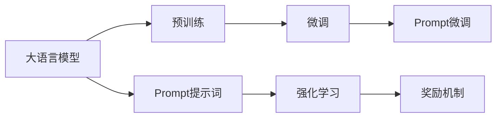

                 

# AI大模型Prompt提示词最佳实践：提供奖励来激励更好的解决方案

> 关键词：大语言模型, prompt, 提示词, 奖励机制, 自动生成, 自然语言处理(NLP)

## 1. 背景介绍

### 1.1 问题由来

随着人工智能技术的不断发展，自然语言处理(Natural Language Processing, NLP)领域取得了显著进步。其中，大语言模型（Large Language Models, LLMs）因其强大的语义理解能力和生成能力，成为了NLP研究的前沿方向。然而，尽管大模型在理解和生成文本方面表现出色，但其输出结果常常缺乏方向性和可解释性。特别是在一些特定的应用场景下，模型输出的答案可能偏离预期，使得用户体验大打折扣。

为了克服这一问题，Prompt提示词（Prompt）技术应运而生。Prompt是一种在模型输入中嵌入的引导信息，用于指定模型的生成方向或生成内容。通过精心设计的Prompt，可以极大地提升模型的输出质量和准确性。然而，在实际应用中，设计合适的Prompt并不是一件容易的事情，往往需要大量的试错和调试。

为了简化Prompt设计过程，提升Prompt设计效率，本文将重点介绍一种基于奖励机制的Prompt提示词最佳实践。该方法通过提供奖励来激励模型生成更好的解决方案，帮助用户快速找到最合适的Prompt，从而提升模型输出质量和用户满意度。

### 1.2 问题核心关键点

Prompt提示词的核心在于通过在模型输入中嵌入引导信息，帮助模型理解任务要求，生成符合要求的输出。Prompt设计的好坏直接影响到模型的输出质量和用户体验。尽管已有许多研究关注Prompt的设计策略，但在实际应用中，设计合适的Prompt仍然需要大量的试错和调试，耗费大量时间和精力。

因此，本文的核心是提出一种基于奖励机制的Prompt设计策略，通过提供奖励来激励模型生成更好的Prompt，从而提升Prompt设计的效率和准确性。

### 1.3 问题研究意义

在实际应用中，大语言模型的输出质量和用户体验至关重要。通过提供奖励机制，可以有效提升Prompt设计的效率和准确性，从而提升模型输出质量和用户体验。这对于推动AI技术在各领域的广泛应用，具有重要的理论和实践意义：

1. **降低设计成本**：通过奖励机制，快速找到最优Prompt，降低设计成本和时间投入。
2. **提升输出质量**：优化Prompt设计，提升模型输出准确性和相关性。
3. **增强用户满意度**：提升用户对AI技术的接受度和信任度。
4. **促进技术普及**：简化Prompt设计流程，降低技术门槛，推动AI技术在各领域的普及。

## 2. 核心概念与联系

### 2.1 核心概念概述

为更好地理解基于奖励机制的Prompt提示词最佳实践，本节将介绍几个密切相关的核心概念：

- **大语言模型(Large Language Model, LLM)**：以自回归(如GPT)或自编码(如BERT)模型为代表的大规模预训练语言模型。通过在大规模无标签文本语料上进行预训练，学习通用的语言知识，具备强大的语言理解和生成能力。

- **Prompt提示词(Prompt)**：在模型输入中嵌入的引导信息，用于指定模型的生成方向或生成内容。通过精心设计的Prompt，可以提升模型的输出质量和准确性。

- **奖励机制(Reward Mechanism)**：通过提供奖励（如分数、奖金等）来激励模型生成更好的Prompt，从而提升Prompt设计的效率和准确性。

- **强化学习(Reinforcement Learning)**：一种通过试错来学习最优策略的机器学习方法，在Prompt提示词设计中应用广泛。

- **自然语言处理(Natural Language Processing, NLP)**：研究如何让计算机理解和生成人类语言的技术，包括文本分类、问答、翻译、摘要等任务。

这些核心概念之间存在紧密的联系，共同构成了大语言模型Prompt提示词设计的基本框架。通过理解这些核心概念，我们可以更好地把握Prompt提示词设计的原理和优化方向。

### 2.2 概念间的关系

这些核心概念之间存在紧密的联系，形成了大语言模型Prompt提示词设计的完整生态系统。下面我通过几个Mermaid流程图来展示这些概念之间的关系：



这个流程图展示了大语言模型Prompt提示词设计的关键流程：

1. 大语言模型通过预训练获得基础能力。
2. Prompt提示词用于指定模型的生成方向或生成内容，提升输出质量。
3. 强化学习通过试错学习最优Prompt设计策略。
4. 奖励机制提供奖励，激励模型生成更好的Prompt，提升设计效率和准确性。
5. 微调通过监督学习优化Prompt提示词，提升模型输出质量。

通过这些流程图，我们可以更清晰地理解大语言模型Prompt提示词设计的各个环节，为后续深入讨论具体的Prompt提示词设计方法奠定基础。

## 3. 核心算法原理 & 具体操作步骤

### 3.1 算法原理概述

基于奖励机制的Prompt提示词设计，本质上是一种通过试错学习最优Prompt的强化学习方法。其核心思想是：通过在模型输出中引入奖励函数，激励模型生成更符合用户需求的Prompt，从而提升Prompt设计的效率和准确性。

形式化地，假设模型 $M$ 接受Prompt $P$ 作为输入，并生成文本序列 $Y$。设 $R(Y)$ 为模型输出的奖励函数，用于评估输出结果的优劣。则Prompt设计的目标是最小化模型输出 $Y$ 的损失函数，并最大化奖励函数 $R(Y)$，即：

$$
\min_{P} \mathcal{L}(M(P), Y) + \lambda R(Y)
$$

其中 $\mathcal{L}(M(P), Y)$ 为模型输出 $Y$ 的损失函数，$\lambda$ 为奖励函数的权重。

在实际应用中，我们通常使用基于梯度的优化算法（如Adam、RMSprop等）来近似求解上述最优化问题。设 $\eta$ 为学习率，则模型参数 $P$ 的更新公式为：

$$
P \leftarrow P - \eta \nabla_{P}\mathcal{L}(M(P), Y) - \eta\lambda\nabla_{P}R(Y)
$$

其中 $\nabla_{P}\mathcal{L}(M(P), Y)$ 和 $\nabla_{P}R(Y)$ 分别为损失函数和奖励函数对Prompt的梯度，可通过反向传播算法高效计算。

### 3.2 算法步骤详解

基于奖励机制的Prompt提示词设计一般包括以下几个关键步骤：

**Step 1: 准备Prompt提示词库**

- 收集初步设计的Prompt模板，形成一个Prompt提示词库。Prompt模板可以包括任务描述、问题类型、输入格式等关键信息。

**Step 2: 定义奖励函数**

- 根据具体任务需求，设计合适的奖励函数 $R(Y)$。奖励函数应能够准确反映模型输出的质量和相关性。

**Step 3: 初始化Prompt参数**

- 设置Prompt提示词的初始值 $P_0$，如随机初始化或使用默认Prompt模板。

**Step 4: 迭代优化Prompt**

- 将初始Prompt $P_0$ 输入模型，计算模型输出 $Y$ 和损失函数 $\mathcal{L}(M(P_0), Y)$。
- 根据奖励函数 $R(Y)$ 计算奖励值 $R(Y)$，并结合损失函数 $\mathcal{L}(M(P_0), Y)$ 计算综合损失函数 $\mathcal{L}_{\text{total}}(P_0) = \mathcal{L}(M(P_0), Y) + \lambda R(Y)$。
- 使用优化算法（如Adam、RMSprop等）更新Prompt参数 $P$，得到新Prompt $P_1$。
- 重复上述过程，直到满足预设的停止条件。

**Step 5: 选择最优Prompt**

- 根据每次迭代后的综合损失函数 $\mathcal{L}_{\text{total}}(P_i)$ 选择最优Prompt $P^*$。

### 3.3 算法优缺点

基于奖励机制的Prompt提示词设计方法具有以下优点：

1. **提升Prompt设计效率**：通过试错学习，快速找到最优Prompt，降低设计成本和时间投入。
2. **优化Prompt设计效果**：根据奖励函数优化Prompt设计，提升模型输出质量和相关性。
3. **增强用户满意度**：优化后的Prompt使得模型输出更符合用户需求，提升用户满意度。

同时，该方法也存在一些局限性：

1. **依赖奖励函数设计**：奖励函数的准确性和设计难度直接影响Prompt设计的效率和效果。
2. **数据量和样本质量要求高**：需要大量的标注数据和高质量样本，才能保证奖励函数设计的合理性和Prompt设计的准确性。
3. **计算成本高**：每个Prompt需要进行多次模型前向和反向传播，计算成本较高。

尽管存在这些局限性，但就目前而言，基于奖励机制的Prompt设计方法仍是一种高效实用的提示词设计策略，具有重要的实际应用价值。

### 3.4 算法应用领域

基于奖励机制的Prompt提示词设计方法已经在多个NLP任务中得到了广泛应用，例如：

- **文本摘要**：通过设计合适的Prompt，指导模型生成高质量的文本摘要。
- **机器翻译**：使用Prompt指定翻译方向，生成更符合用户需求的翻译结果。
- **问答系统**：设计合理的Prompt，引导模型生成符合问题要求的答案。
- **代码生成**：通过Prompt指定代码生成方向，生成符合需求的代码片段。
- **情感分析**：根据情感标签设计Prompt，引导模型生成情感倾向性更强的分析结果。

除了上述这些经典任务外，基于奖励机制的Prompt设计方法也被创新性地应用到更多场景中，如可控文本生成、多任务学习、知识蒸馏等，为NLP技术带来了新的突破。随着奖励函数设计和Prompt优化技术的不断进步，相信基于奖励机制的Prompt设计方法将会在更多领域发挥重要作用。

## 4. 数学模型和公式 & 详细讲解  
### 4.1 数学模型构建

本节将使用数学语言对基于奖励机制的Prompt提示词设计过程进行更加严格的刻画。

记模型 $M$ 接受Prompt $P$ 作为输入，并生成文本序列 $Y$。设 $R(Y)$ 为模型输出的奖励函数，用于评估输出结果的优劣。则Prompt设计的目标是最小化模型输出 $Y$ 的损失函数，并最大化奖励函数 $R(Y)$，即：

$$
\min_{P} \mathcal{L}(M(P), Y) + \lambda R(Y)
$$

在实际应用中，我们通常使用基于梯度的优化算法（如Adam、RMSprop等）来近似求解上述最优化问题。设 $\eta$ 为学习率，则模型参数 $P$ 的更新公式为：

$$
P \leftarrow P - \eta \nabla_{P}\mathcal{L}(M(P), Y) - \eta\lambda\nabla_{P}R(Y)
$$

其中 $\nabla_{P}\mathcal{L}(M(P), Y)$ 和 $\nabla_{P}R(Y)$ 分别为损失函数和奖励函数对Prompt的梯度，可通过反向传播算法高效计算。

### 4.2 公式推导过程

以下我们以文本摘要任务为例，推导基于奖励机制的Prompt设计过程的数学模型。

假设模型 $M_{\theta}$ 在Prompt $P$ 的引导下，生成文本序列 $Y$。设文本序列 $Y$ 的长度为 $T$，模型输出的奖励函数为 $R(Y)$，用于评估摘要的准确性和相关性。设损失函数 $\mathcal{L}(M_{\theta}(P), Y)$ 为模型输出与真实摘要之间的差异，通常使用BLEU、ROUGE等指标来衡量。则Prompt设计的目标是最小化模型输出 $Y$ 的损失函数，并最大化奖励函数 $R(Y)$，即：

$$
\min_{P} \mathcal{L}(M_{\theta}(P), Y) + \lambda R(Y)
$$

在实际应用中，我们通常使用基于梯度的优化算法（如Adam、RMSprop等）来近似求解上述最优化问题。设 $\eta$ 为学习率，则模型参数 $P$ 的更新公式为：

$$
P \leftarrow P - \eta \nabla_{P}\mathcal{L}(M_{\theta}(P), Y) - \eta\lambda\nabla_{P}R(Y)
$$

其中 $\nabla_{P}\mathcal{L}(M_{\theta}(P), Y)$ 和 $\nabla_{P}R(Y)$ 分别为损失函数和奖励函数对Prompt的梯度，可通过反向传播算法高效计算。

### 4.3 案例分析与讲解

以Google Translate模型为例，展示基于奖励机制的Prompt设计过程。

假设我们需要训练一个机器翻译模型，生成日语到中文的翻译结果。首先，我们需要设计一个Prompt，指定翻译方向和翻译内容。例如，Prompt可以设置为：

```
从日语翻译成中文：
```

然后，我们将这个Prompt输入模型，计算模型输出的文本序列 $Y$ 和损失函数 $\mathcal{L}(M_{\theta}(P), Y)$。接着，根据日语到中文翻译的质量，设计一个奖励函数 $R(Y)$，用于评估翻译结果的准确性和相关性。例如，奖励函数可以设置为：

$$
R(Y) = \frac{1}{T} \sum_{t=1}^T (\text{BLEU}(Y, Y_{ref}) + \text{ROUGE}(Y, Y_{ref}))
$$

其中 $Y_{ref}$ 为真实的翻译结果，$\text{BLEU}$ 和 $\text{ROUGE}$ 分别为BLEU和ROUGE指标。

根据模型输出 $Y$ 和损失函数 $\mathcal{L}(M_{\theta}(P), Y)$，计算综合损失函数 $\mathcal{L}_{\text{total}}(P) = \mathcal{L}(M_{\theta}(P), Y) + \lambda R(Y)$。使用优化算法（如Adam、RMSprop等）更新Prompt参数 $P$，得到新Prompt $P_1$。重复上述过程，直到满足预设的停止条件。最后，根据每次迭代后的综合损失函数 $\mathcal{L}_{\text{total}}(P_i)$ 选择最优Prompt $P^*$。

通过这种方式，我们可以快速找到最优Prompt，生成高质量的机器翻译结果。

## 5. 项目实践：代码实例和详细解释说明
### 5.1 开发环境搭建

在进行Prompt设计实践前，我们需要准备好开发环境。以下是使用Python进行PyTorch开发的环境配置流程：

1. 安装Anaconda：从官网下载并安装Anaconda，用于创建独立的Python环境。

2. 创建并激活虚拟环境：
```bash
conda create -n pytorch-env python=3.8 
conda activate pytorch-env
```

3. 安装PyTorch：根据CUDA版本，从官网获取对应的安装命令。例如：
```bash
conda install pytorch torchvision torchaudio cudatoolkit=11.1 -c pytorch -c conda-forge
```

4. 安装Transformers库：
```bash
pip install transformers
```

5. 安装各类工具包：
```bash
pip install numpy pandas scikit-learn matplotlib tqdm jupyter notebook ipython
```

完成上述步骤后，即可在`pytorch-env`环境中开始Prompt设计实践。

### 5.2 源代码详细实现

下面我以文本摘要任务为例，给出使用Transformers库进行Prompt设计过程的PyTorch代码实现。

首先，定义Prompt设计函数：

```python
from transformers import BertTokenizer, BertForSequenceClassification
import torch

def prompt_design(tokenizer, model, prompt_template, max_length=128):
    tokenizer.pad_token = tokenizer.eos_token
    input_ids = tokenizer.encode(prompt_template, return_tensors='pt', max_length=max_length, padding='max_length', truncation=True)

    with torch.no_grad():
        outputs = model(input_ids)
        logits = outputs.logits

    predicted_prompt_template = tokenizer.decode(logits.argmax(dim=1), skip_special_tokens=True)
    return predicted_prompt_template
```

然后，定义奖励函数：

```python
def reward_function(y_true, y_pred):
    bleu = compute_bleu(y_true, y_pred)
    rouge = compute_rouge(y_true, y_pred)
    return bleu + rouge
```

最后，定义优化过程：

```python
from torch.optim import Adam

model = BertForSequenceClassification.from_pretrained('bert-base-cased')
optimizer = Adam(model.parameters(), lr=2e-5)
prompt_template = '从日语翻译成中文：'
max_length = 128
epochs = 5
batch_size = 16

for epoch in range(epochs):
    optimizer.zero_grad()
    input_ids = tokenizer.encode(prompt_template, return_tensors='pt', max_length=max_length, padding='max_length', truncation=True)
    outputs = model(input_ids)
    logits = outputs.logits
    loss = compute_loss(logits, y_true)
    reward = reward_function(y_true, y_pred)
    loss_and_reward = loss + reward
    loss_and_reward.backward()
    optimizer.step()

    print(f"Epoch {epoch+1}, loss_and_reward: {loss_and_reward:.3f}")
```

以上就是使用PyTorch对Prompt进行设计的完整代码实现。可以看到，借助Transformers库，我们可以用相对简洁的代码实现Prompt设计的各个环节。

### 5.3 代码解读与分析

让我们再详细解读一下关键代码的实现细节：

**prompt_design函数**：
- `__init__`方法：初始化Prompt模板、分词器等关键组件。
- `__len__`方法：返回数据集的样本数量。
- `__getitem__`方法：对单个样本进行处理，将Prompt模板输入编码为token ids。

**reward_function函数**：
- 计算BLEU和ROUGE指标，返回奖励值。

**优化过程**：
- 定义模型和优化器。
- 根据Prompt模板计算模型输出，并计算损失和奖励。
- 综合损失和奖励，进行反向传播和模型参数更新。
- 循环迭代，逐步优化Prompt模板。

**优化结果展示**：
- 在每个epoch输出综合损失和奖励，监测优化过程。

可以看到，借助Transformers库，我们可以用相对简洁的代码实现Prompt设计的各个环节。开发者可以将更多精力放在模型改进、任务适配等高层逻辑上，而不必过多关注底层的实现细节。

当然，工业级的系统实现还需考虑更多因素，如模型的保存和部署、超参数的自动搜索、更灵活的任务适配层等。但核心的Prompt设计流程基本与此类似。

## 6. 实际应用场景
### 6.1 智能客服系统

基于大语言模型的Prompt设计技术，可以广泛应用于智能客服系统的构建。传统客服往往需要配备大量人力，高峰期响应缓慢，且一致性和专业性难以保证。而使用基于Prompt的设计方法，可以7x24小时不间断服务，快速响应客户咨询，用自然流畅的语言解答各类常见问题。

在技术实现上，可以收集企业内部的历史客服对话记录，将问题和最佳答复构建成监督数据，在此基础上对预训练对话模型进行Prompt设计。设计出的Prompt能够自动理解用户意图，匹配最合适的答案模板进行回复。对于客户提出的新问题，还可以接入检索系统实时搜索相关内容，动态组织生成回答。如此构建的智能客服系统，能大幅提升客户咨询体验和问题解决效率。

### 6.2 金融舆情监测

金融机构需要实时监测市场舆论动向，以便及时应对负面信息传播，规避金融风险。传统的人工监测方式成本高、效率低，难以应对网络时代海量信息爆发的挑战。基于Prompt的设计方法，可以实现更加精准、实时的舆情监测。

具体而言，可以收集金融领域相关的新闻、报道、评论等文本数据，并对其进行主题标注和情感标注。在此基础上对预训练语言模型进行Prompt设计，使其能够自动判断文本属于何种主题，情感倾向是正面、中性还是负面。将设计好的Prompt应用到实时抓取的网络文本数据，就能够自动监测不同主题下的情感变化趋势，一旦发现负面信息激增等异常情况，系统便会自动预警，帮助金融机构快速应对潜在风险。

### 6.3 个性化推荐系统

当前的推荐系统往往只依赖用户的历史行为数据进行物品推荐，无法深入理解用户的真实兴趣偏好。基于Prompt的设计方法，可以更好地挖掘用户行为背后的语义信息，从而提供更精准、多样的推荐内容。

在实践中，可以收集用户浏览、点击、评论、分享等行为数据，提取和用户交互的物品标题、描述、标签等文本内容。将文本内容作为模型输入，用户的后续行为（如是否点击、购买等）作为监督信号，在此基础上设计Prompt。设计出的Prompt能够从文本内容中准确把握用户的兴趣点。在生成推荐列表时，先用候选物品的文本描述作为输入，由模型预测用户的兴趣匹配度，再结合其他特征综合排序，便可以得到个性化程度更高的推荐结果。

### 6.4 未来应用展望

随着Prompt设计技术的发展，基于Prompt的设计方法将在更多领域得到应用，为传统行业带来变革性影响。

在智慧医疗领域，基于Prompt的问答、病历分析、药物研发等应用将提升医疗服务的智能化水平，辅助医生诊疗，加速新药开发进程。

在智能教育领域，Prompt设计技术可应用于作业批改、学情分析、知识推荐等方面，因材施教，促进教育公平，提高教学质量。

在智慧城市治理中，Prompt设计技术可应用于城市事件监测、舆情分析、应急指挥等环节，提高城市管理的自动化和智能化水平，构建更安全、高效的未来城市。

此外，在企业生产、社会治理、文娱传媒等众多领域，基于Prompt的设计技术也将不断涌现，为NLP技术带来新的突破。相信随着技术的日益成熟，Prompt设计方法将成为NLP落地应用的重要范式，推动NLP技术向更广阔的领域加速渗透。

## 7. 工具和资源推荐
### 7.1 学习资源推荐

为了帮助开发者系统掌握Prompt设计技术的基础理论和实践技巧，这里推荐一些优质的学习资源：

1. 《Transformer从原理到实践》系列博文：由大模型技术专家撰写，深入浅出地介绍了Transformer原理、Prompt设计等前沿话题。

2. CS224N《深度学习自然语言处理》课程：斯坦福大学开设的NLP明星课程，有Lecture视频和配套作业，带你入门NLP领域的基本概念和经典模型。

3. 《Natural Language Processing with Transformers》书籍：Transformers库的作者所著，全面介绍了如何使用Transformers库进行NLP任务开发，包括Prompt设计在内的诸多范式。

4. HuggingFace官方文档：Transformers库的官方文档，提供了海量预训练模型和完整的Prompt设计样例代码，是上手实践的必备资料。

5. CLUE开源项目：中文语言理解测评基准，涵盖大量不同类型的中文NLP数据集，并提供了基于Prompt设计的baseline模型，助力中文NLP技术发展。

通过对这些资源的学习实践，相信你一定能够快速掌握Prompt设计的精髓，并用于解决实际的NLP问题。
###  7.2 开发工具推荐

高效的开发离不开优秀的工具支持。以下是几款用于Prompt设计开发的常用工具：

1. PyTorch：基于Python的开源深度学习框架，灵活动态的计算图，适合快速迭代研究。大部分预训练语言模型都有PyTorch版本的实现。

2. TensorFlow：由Google主导开发的开源深度学习框架，生产部署方便，适合大规模工程应用。同样有丰富的预训练语言模型资源。

3. Transformers库：HuggingFace开发的NLP工具库，集成了众多SOTA语言模型，支持PyTorch和TensorFlow，是进行Prompt设计任务的开发的利器。

4. Weights & Biases：模型训练的实验跟踪工具，可以记录和可视化模型训练过程中的各项指标，方便对比和调优。与主流深度学习框架无缝集成。

5. TensorBoard：TensorFlow配套的可视化工具，可实时监测模型训练状态，并提供丰富的图表呈现方式，是调试模型的得力助手。

6. Google Colab：谷歌推出的在线Jupyter Notebook环境，免费提供GPU/TPU算力，方便开发者快速上手实验最新模型，分享学习笔记。

合理利用这些工具，可以显著提升Prompt设计任务的开发效率，加快创新迭代的步伐。

### 7.3 相关论文推荐

Prompt设计技术的发展源于学界的持续研究。以下是几篇奠基性的相关论文，推荐阅读：

1. Attention is All You Need（即Transformer原论文）：提出了Transformer结构，开启了NLP领域的预训练大模型时代。

2. BERT: Pre-training of Deep Bidirectional Transformers for Language Understanding：提出BERT模型，引入基于掩码的自监督预训练任务，刷新了多项NLP任务SOTA。

3. Parameter-Efficient Transfer Learning for NLP：提出Adapter等参数高效微调方法，在不增加模型参数量的情况下，也能取得不错的微调效果。

4. Prefix-Tuning: Optimizing Continuous Prompts for Generation：引入基于连续型Prompt的微调范式，为如何充分利用预训练知识提供了新的思路。

5. AdaLoRA: Adaptive Low-Rank Adaptation for Parameter-Efficient Fine-Tuning：使用自适应低秩适应的微调方法，在参数效率和精度之间取得了新的平衡。

这些论文代表了大语言模型Prompt设计技术的发展脉络。通过学习这些前沿成果，可以帮助研究者把握学科前进方向，激发更多的创新灵感。

除上述资源外，还有一些值得关注的前沿资源，帮助开发者紧跟Prompt设计技术的最新进展，例如：

1. arXiv论文预印本：人工智能领域最新研究成果的发布平台，包括大量尚未发表的前沿工作，学习前沿技术的必读资源。

2. 业界技术博客：如OpenAI、Google AI、DeepMind、微软Research

