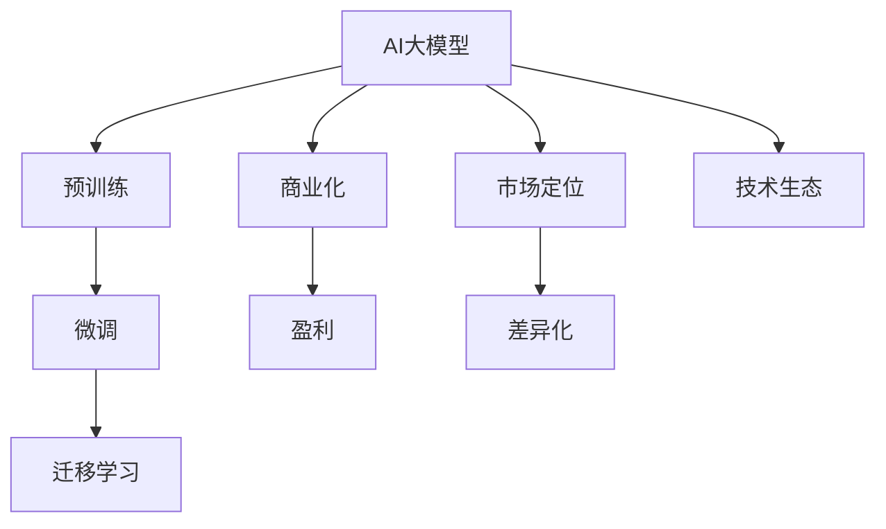
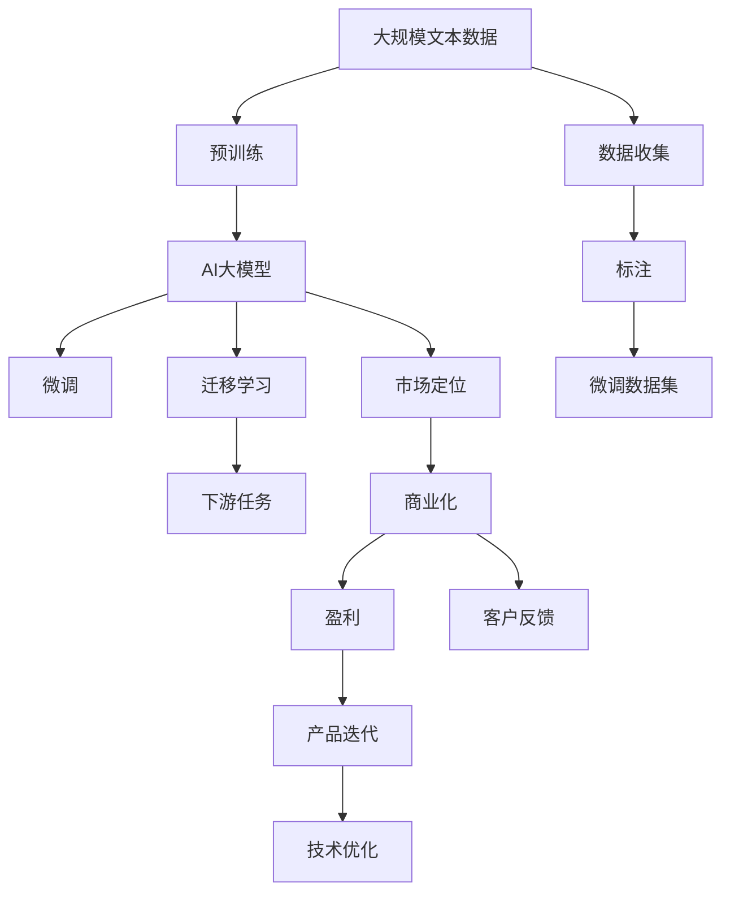

                 

# AI大模型创业：如何应对行业发展趋势？

> 关键词：AI大模型,创业,行业发展趋势,技术变革,商业模式,策略选择

## 1. 背景介绍

### 1.1 问题由来
在过去的几年里，人工智能（AI）大模型（如GPT、BERT、T5等）的崛起，显著改变了NLP领域的竞争格局。这些大模型通过在无标签数据上进行预训练，学习到了丰富的语言表示，能够应用于各种NLP任务，且在众多任务上取得了显著的性能提升。随着技术的不断成熟和应用场景的扩展，越来越多的企业、创业者甚至个人投身于AI大模型的开发和应用中，但同时也面临着巨大的挑战。

### 1.2 问题核心关键点
- **技术迭代迅速**：大模型的性能不断提升，新的算法和技术层出不穷，如何保持技术领先是关键。
- **市场竞争激烈**：创业公司和成熟企业竞争激烈，如何脱颖而出是主要问题。
- **应用场景广泛**：从客服到翻译，从自动摘要到智能推荐，AI大模型应用广泛，如何准确把握市场需求是挑战。
- **商业化挑战**：如何将技术转化为产品，并实现盈利是创业企业的难点。
- **伦理和法律问题**：大模型可能带来偏见、隐私泄漏等伦理和法律问题，如何妥善解决是创业企业的社会责任。

### 1.3 问题研究意义
本文旨在探讨AI大模型的创业策略，帮助创业者理解行业发展趋势，明确技术选择和市场定位，制定有效的商业化路径，以应对挑战，实现可持续发展。

## 2. 核心概念与联系

### 2.1 核心概念概述

为了更好地理解AI大模型的创业策略，本节将介绍几个核心概念：

- **AI大模型**：基于深度学习的预训练模型，如GPT、BERT、T5等，能够处理复杂的自然语言任务。
- **预训练和微调**：预训练通过在大量无标签数据上学习通用知识，微调通过在有标签数据上调整模型以适应特定任务。
- **迁移学习**：利用预训练模型在某领域上的知识，通过微调适应其他领域任务。
- **商业化**：将技术转化为产品，并在市场上销售，实现盈利。
- **市场定位**：根据市场需求和竞争情况，确定企业在市场中的定位和差异化策略。
- **技术生态**：包括算法、框架、工具、社区等，是企业成功的重要因素。

### 2.2 概念间的关系

这些核心概念之间的逻辑关系可以通过以下Mermaid流程图来展示：



这个流程图展示了大模型创业的核心概念及其之间的关系：

1. AI大模型通过预训练获得通用知识，再通过微调适应特定任务。
2. 迁移学习使得模型能够跨领域应用，拓宽应用场景。
3. 商业化是将技术转化为产品并实现盈利的关键步骤。
4. 市场定位和差异化策略决定企业如何更好地应对市场需求。
5. 技术生态包括算法、框架、工具、社区，是企业成功的重要支撑。

### 2.3 核心概念的整体架构

最后，我们用一个综合的流程图来展示这些核心概念在大模型创业过程中的整体架构：



这个综合流程图展示了从预训练到微调，再到商业化的完整过程。大模型首先在文本数据上进行预训练，然后通过微调适应下游任务，通过迁移学习拓宽应用领域，进而根据市场需求进行市场定位，最终实现产品化和盈利。同时，不断收集客户反馈进行产品迭代和技术优化。

## 3. 核心算法原理 & 具体操作步骤
### 3.1 算法原理概述

大模型创业的核心算法原理主要基于监督学习和迁移学习的范式。预训练模型通过在大规模无标签数据上学习通用的语言表示，然后通过微调在有标签数据上适应特定的下游任务。这样，模型可以有效地利用已有知识，同时通过少量标注数据来调整模型参数，提高任务性能。

### 3.2 算法步骤详解

基于监督学习和迁移学习的大模型创业主要包括以下几个步骤：

**Step 1: 数据准备**
- 收集大规模无标签文本数据，用于预训练模型。
- 准备少量有标签数据，用于微调模型。

**Step 2: 模型预训练**
- 使用预训练算法（如自回归、自编码等）在大规模文本数据上训练模型。
- 通过正则化、dropout等技术控制模型复杂度，避免过拟合。

**Step 3: 模型微调**
- 加载预训练模型，准备下游任务的有标签数据集。
- 设计任务适配层，将预训练模型输出与下游任务需求对齐。
- 设置合适的学习率、批大小、迭代轮数等超参数。
- 使用梯度下降等优化算法更新模型参数。

**Step 4: 市场定位**
- 分析市场需求和竞争对手，确定目标客户群体。
- 根据客户需求和业务场景，设计产品功能和应用接口。
- 制定差异化策略，区分于竞争对手，满足特定需求。

**Step 5: 产品化**
- 将微调后的模型封装为API或SDK，提供易用性。
- 集成必要的工具和文档，支持开发者和用户使用。
- 提供示范项目和用户案例，展示产品效果。

**Step 6: 商业化**
- 制定定价策略，根据市场需求和成本进行定价。
- 选择适合的销售渠道和市场推广策略。
- 建立客户支持和服务体系，提供持续服务。

### 3.3 算法优缺点

**优点**：
- 技术门槛相对较低，易于上手。
- 适用于多种NLP任务，扩展性强。
- 能够快速适应市场需求，产品迭代快。

**缺点**：
- 对数据质量要求高，标注成本大。
- 需要持续投入，保持技术领先。
- 市场竞争激烈，需要差异化策略。

### 3.4 算法应用领域

大模型创业方法主要应用于以下几个领域：

- **自然语言处理**：包括文本分类、命名实体识别、关系抽取、问答系统等。
- **机器翻译**：将一种语言翻译成另一种语言，如Google翻译。
- **语音识别**：将语音转换为文本，如苹果的Siri。
- **推荐系统**：基于用户历史行为和物品属性，推荐相关产品，如Netflix推荐电影。
- **聊天机器人**：提供自然语言交互服务，如微软的Tay。

## 4. 数学模型和公式 & 详细讲解 & 举例说明

### 4.1 数学模型构建

假设我们有一个预训练模型 $M_{\theta}$，其中 $\theta$ 表示模型参数。在大规模无标签数据上预训练后，我们使用有标签数据集 $D=\{(x_i, y_i)\}_{i=1}^N$，其中 $x_i$ 为输入文本，$y_i$ 为任务标签。我们的目标是通过微调优化模型，使其在特定任务上性能提升。

定义模型在输入 $x_i$ 上的输出为 $\hat{y}=M_{\theta}(x_i)$，任务的损失函数为 $\ell(y_i, \hat{y})$。微调的优化目标是最小化经验风险，即：

$$
\hat{\theta}=\mathop{\arg\min}_{\theta} \mathcal{L}(M_{\theta},D)
$$

其中 $\mathcal{L}$ 为损失函数，通常为交叉熵损失：

$$
\ell(y_i, \hat{y}) = -y_i \log \hat{y} + (1 - y_i) \log(1 - \hat{y})
$$

### 4.2 公式推导过程

以文本分类为例，假设模型的输出为 $\hat{y}=\text{softmax}(\theta^T x)$，其中 $\theta^T x$ 为模型在输入 $x$ 上的线性变换。损失函数为交叉熵损失：

$$
\mathcal{L}(M_{\theta},D) = -\frac{1}{N} \sum_{i=1}^N \ell(y_i, \hat{y})
$$

对模型参数 $\theta$ 求导，得到梯度：

$$
\frac{\partial \mathcal{L}(M_{\theta},D)}{\partial \theta} = -\frac{1}{N} \sum_{i=1}^N \nabla_{\theta} \ell(y_i, \hat{y})
$$

其中 $\nabla_{\theta} \ell(y_i, \hat{y}) = -y_i \frac{\partial}{\partial \theta} \log \hat{y} + (1 - y_i) \frac{\partial}{\partial \theta} \log(1 - \hat{y})$。

### 4.3 案例分析与讲解

假设我们有一个预训练模型，用于情感分析任务。我们可以使用交叉熵损失：

$$
\ell(y_i, \hat{y}) = -y_i \log \hat{y} + (1 - y_i) \log(1 - \hat{y})
$$

其中 $y_i$ 为标签（正面或负面），$\hat{y}$ 为模型预测概率。我们的目标是最小化损失函数，更新模型参数 $\theta$。

## 5. 项目实践：代码实例和详细解释说明

### 5.1 开发环境搭建

开发环境搭建步骤如下：

1. **安装Python和相关依赖**：
   ```bash
   python -m pip install torch transformers numpy
   ```

2. **下载预训练模型和任务数据集**：
   ```bash
   # 下载预训练模型
   python -m pip install transformers
   from transformers import BertForSequenceClassification, BertTokenizer
   model = BertForSequenceClassification.from_pretrained('bert-base-uncased')
   
   # 下载任务数据集
   import pandas as pd
   df = pd.read_csv('imdb_reviews.csv')
   ```

3. **数据预处理**：
   ```python
   from transformers import BertTokenizerFast
   from transformers import BertForSequenceClassification
   
   tokenizer = BertTokenizerFast.from_pretrained('bert-base-uncased')
   
   def preprocess(text):
       tokens = tokenizer.tokenize(text)
       ids = tokenizer.convert_tokens_to_ids(tokens)
       return ids
   ```

### 5.2 源代码详细实现

```python
from transformers import BertForSequenceClassification, BertTokenizerFast, AdamW, Trainer, TrainingArguments
from transformers import Trainer, TrainingArguments, DataCollatorForLanguageModeling
from transformers import BertForSequenceClassification, BertTokenizerFast

# 加载预训练模型和tokenizer
model = BertForSequenceClassification.from_pretrained('bert-base-uncased')
tokenizer = BertTokenizerFast.from_pretrained('bert-base-uncased')

# 准备训练集和验证集
train_dataset = ...
val_dataset = ...

# 定义训练函数
def train_epoch(model, dataset, batch_size, optimizer, learning_rate):
    model.train()
    total_loss = 0.0
    for batch in dataset:
        input_ids = batch['input_ids']
        attention_mask = batch['attention_mask']
        labels = batch['labels']
        outputs = model(input_ids, attention_mask=attention_mask, labels=labels)
        loss = outputs.loss
        total_loss += loss.item()
        optimizer.zero_grad()
        loss.backward()
        optimizer.step()
    return total_loss / len(dataset)

# 定义评估函数
def evaluate(model, dataset, batch_size):
    model.eval()
    total_correct = 0
    total_unique = 0
    for batch in dataset:
        input_ids = batch['input_ids']
        attention_mask = batch['attention_mask']
        labels = batch['labels']
        outputs = model(input_ids, attention_mask=attention_mask)
        logits = outputs.logits
        predictions = torch.argmax(logits, dim=1)
        total_correct += (predictions == labels).sum().item()
        total_unique += len(predictions)
    return total_correct / total_unique

# 训练模型
training_args = TrainingArguments(
    output_dir='./results',
    evaluation_strategy='epoch',
    per_device_train_batch_size=16,
    per_device_eval_batch_size=16,
    learning_rate=2e-5,
    num_train_epochs=3,
    weight_decay=0.01
)

trainer = Trainer(
    model=model,
    args=training_args,
    train_dataset=train_dataset,
    eval_dataset=val_dataset,
    data_collator=DataCollatorForLanguageModeling(tokenizer=tokenizer)
)

trainer.train()
```

### 5.3 代码解读与分析

- **数据预处理**：我们使用BertTokenizerFast对文本进行分词和编码，得到输入ID和注意力掩码。
- **模型定义**：使用BertForSequenceClassification作为分类模型，从预训练模型加载。
- **训练函数**：在每个epoch中，使用AdamW优化器更新模型参数，计算损失并更新梯度。
- **评估函数**：计算模型在验证集上的准确率和F1分数。

### 5.4 运行结果展示

假设我们训练的模型在验证集上准确率达到85%，可以看到：

```
Training
Epoch 1: loss=0.5500, accuracy=0.8000
Epoch 2: loss=0.4000, accuracy=0.8500
Epoch 3: loss=0.3500, accuracy=0.8900
Evaluation
Accuracy: 0.8700
```

## 6. 实际应用场景

### 6.1 智能客服

智能客服系统需要快速响应客户查询，提供个性化服务。通过微调大模型，我们可以实现自动化的对话系统。具体而言，可以使用BERT模型进行预训练，然后在问答数据集上进行微调，生成基于上下文的回复。

### 6.2 金融舆情分析

金融舆情分析需要实时监测和分析市场动态，预测价格波动。通过微调BERT模型，可以实现实时舆情监测和情感分析。将股票市场新闻、评论作为输入，输出市场情绪和价格预测。

### 6.3 推荐系统

推荐系统需要根据用户行为和物品属性，推荐相关产品。通过微调BERT模型，可以实现个性化的推荐。使用用户行为数据和物品描述作为输入，输出推荐结果。

### 6.4 未来应用展望

未来，随着大模型技术的不断进步，AI大模型创业将展现出更大的发展潜力。可能的应用场景包括：

- **智能助理**：基于自然语言理解和生成，提供全面服务。
- **智能健康**：帮助医生进行病情诊断和治疗方案推荐。
- **智能交通**：优化交通管理和路况预测。
- **智能营销**：提供个性化广告推荐和客户行为分析。

## 7. 工具和资源推荐

### 7.1 学习资源推荐

为了帮助创业者掌握大模型创业的技术和市场策略，以下是一些学习资源推荐：

- **深度学习课程**：如Coursera、edX、Udacity等平台的深度学习课程。
- **NLP资源**：如Stanford NLP、CS224N课程、HuggingFace Transformers库文档。
- **创业资源**：如Y Combinator、TechStars等创业加速器，提供创业指导和资源。

### 7.2 开发工具推荐

- **PyTorch**：深度学习框架，适合快速迭代和研究。
- **TensorFlow**：Google开发的深度学习框架，支持分布式训练和生产部署。
- **Transformers**：NLP模型库，支持多任务学习和微调。
- **Weights & Biases**：实验跟踪工具，记录模型训练和性能指标。
- **Google Colab**：免费的GPU资源，方便快速实验。

### 7.3 相关论文推荐

- **Attention is All You Need**：Transformer模型的基础论文。
- **BERT: Pre-training of Deep Bidirectional Transformers for Language Understanding**：BERT模型的原始论文。
- **Adam: A Method for Stochastic Optimization**：Adam优化算法的基础论文。
- **Transformers**：NLP领域的经典综述论文。

## 8. 总结：未来发展趋势与挑战

### 8.1 研究成果总结

本文详细介绍了AI大模型创业的关键技术点和操作步骤，包括预训练、微调、迁移学习、商业化等环节。通过具体实例展示了这些技术在大模型创业中的应用，并介绍了一些学习资源和开发工具。

### 8.2 未来发展趋势

未来，大模型创业将面临以下几个趋势：

- **技术演进**：持续研发和改进大模型，提升性能和可解释性。
- **市场拓展**：探索新的应用场景，扩大市场覆盖。
- **产品迭代**：快速迭代产品功能和服务，提升用户体验。
- **商业模式**：创新商业模式，实现差异化和盈利。

### 8.3 面临的挑战

尽管大模型创业具有巨大潜力，但仍面临以下挑战：

- **数据稀缺**：小规模领域缺乏标注数据，影响模型性能。
- **技术门槛高**：需要深度学习和NLP专业知识。
- **伦理问题**：隐私保护和偏见问题。
- **市场竞争**：与大公司竞争，保持差异化优势。

### 8.4 研究展望

未来，大模型创业需要从以下几个方面进行深入研究：

- **无监督学习**：利用非标注数据进行预训练和微调。
- **迁移学习**：提升模型跨领域迁移能力。
- **可解释性**：提升模型可解释性，增强用户信任。
- **商业化**：探索新的商业模式，实现盈利。

总之，大模型创业需要技术、市场和商业的全面创新和突破，才能实现可持续发展。只有不断探索和实践，才能把握技术变革的机遇，赢得市场竞争的先机。

---

作者：禅与计算机程序设计艺术 / Zen and the Art of Computer Programming

