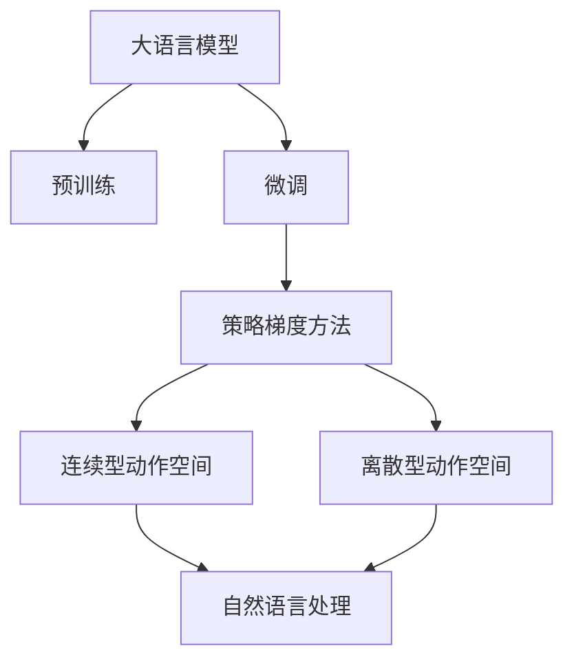
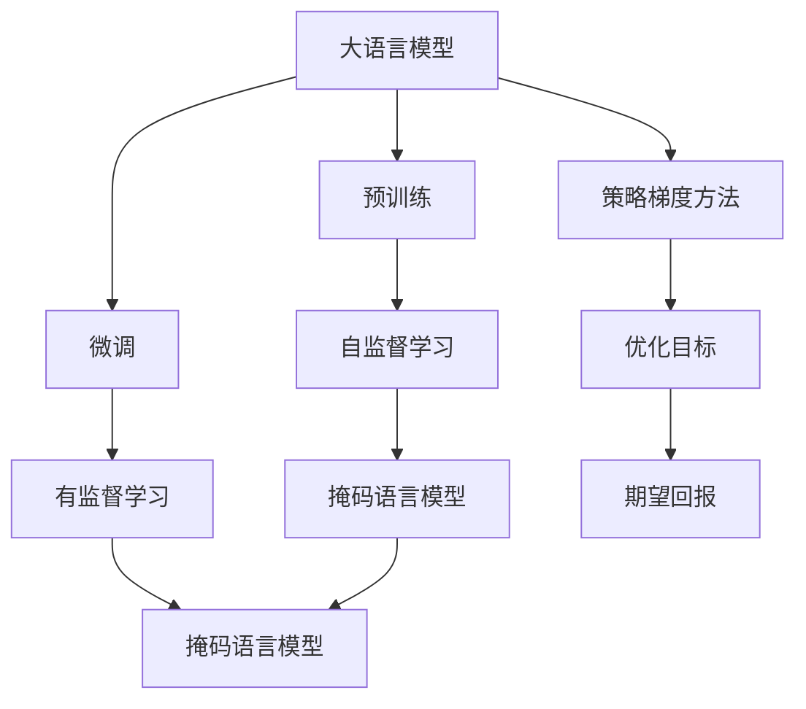
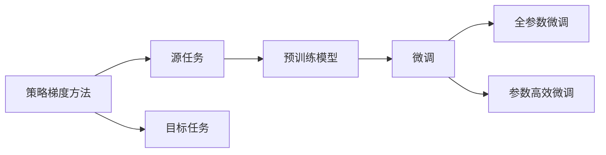
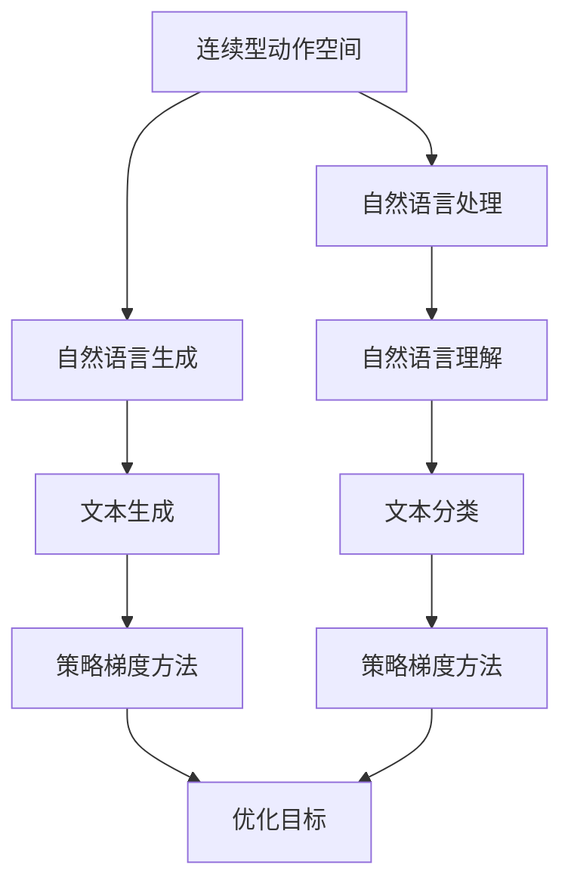
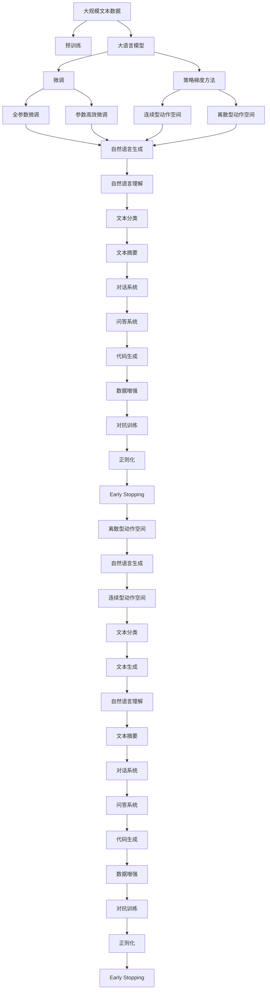

                 

# 大语言模型原理与工程实践：策略梯度方法

> 关键词：大语言模型,策略梯度,强化学习,深度强化学习,连续型动作空间,离散型动作空间

## 1. 背景介绍

### 1.1 问题由来
随着深度学习技术的不断进步，大语言模型（Large Language Models, LLMs）在自然语言处理（Natural Language Processing, NLP）领域取得了显著的突破。这些模型通过在大规模无标签文本数据上进行预训练，学习到了丰富的语言知识和常识，能够在各种下游任务中展现出强大的性能。然而，预训练模型通常只能适应特定领域或特定任务，无法很好地泛化到新的领域或任务上。为了提升模型的泛化能力，研究人员开始探索基于策略梯度方法的微调方法，这种技术可以在有限的标注数据下，通过学习最优的策略来实现模型性能的提升。

### 1.2 问题核心关键点
策略梯度方法是一种在强化学习中广泛使用的优化方法，用于优化参数化的策略函数，使其能够在给定的环境中最大化期望回报。在大语言模型的微调中，策略梯度方法可以用于优化模型的参数，使得模型在特定任务上的表现最大化。

策略梯度方法的核心思想是通过计算策略梯度来更新模型参数，策略梯度表示了在当前状态下采取特定行动的期望回报的梯度。与传统的梯度下降不同，策略梯度方法能够处理连续型动作空间，避免了对动作空间离散化的需求。这种优势使得策略梯度方法在大语言模型的微调中表现出色，能够更灵活地处理复杂的自然语言问题。

### 1.3 问题研究意义
基于策略梯度方法的微调技术能够显著提升大语言模型在特定任务上的性能，降低对标注数据的需求，同时能够处理连续型动作空间，具有较强的泛化能力。这种微调方法在NLP领域得到了广泛的应用，如文本生成、对话系统、问答系统等，为NLP技术的发展提供了新的方向。

策略梯度方法的另一个重要意义在于，它能够优化模型的决策策略，使得模型更加符合用户的期望，提升用户体验。这在对话系统和问答系统中尤为重要，能够使模型更好地理解用户意图，提供更加自然、流畅的交互。

## 2. 核心概念与联系

### 2.1 核心概念概述

为了更好地理解基于策略梯度方法的大语言模型微调方法，本节将介绍几个关键概念：

- 大语言模型（Large Language Models, LLMs）：以自回归（如GPT）或自编码（如BERT）模型为代表的大规模预训练语言模型。通过在大规模无标签文本数据上进行预训练，学习通用的语言表示，具备强大的语言理解和生成能力。

- 预训练（Pre-training）：指在大规模无标签文本数据上，通过自监督学习任务训练通用语言模型的过程。常见的预训练任务包括掩码语言模型、下一句预测等。预训练使得模型学习到语言的通用表示。

- 微调（Fine-tuning）：指在预训练模型的基础上，使用下游任务的少量标注数据，通过有监督学习优化模型在特定任务上的性能。通常只需要调整顶层分类器或解码器，并以较小的学习率更新全部或部分的模型参数。

- 策略梯度方法（Policy Gradient Methods）：一种在强化学习中广泛使用的优化方法，用于优化参数化的策略函数，使其能够在给定的环境中最大化期望回报。策略梯度方法通过计算策略梯度来更新模型参数，使得模型在特定任务上的表现最大化。

- 连续型动作空间（Continuous Action Spaces）：指在强化学习中，动作空间是连续的，如控制机械臂的位置、速度等。在自然语言处理中，连续型动作空间通常指生成文本的字符序列。

- 离散型动作空间（Discrete Action Spaces）：指在强化学习中，动作空间是离散的，如选择某个单词、句子等。在自然语言处理中，离散型动作空间通常指选择某个词汇、标签等。

- 强化学习（Reinforcement Learning, RL）：一种通过与环境交互，学习最优决策策略的机器学习方法。在强化学习中，模型通过与环境的交互获得奖励，并根据奖励来调整策略，最终实现最大化期望回报的目标。

这些核心概念之间的逻辑关系可以通过以下Mermaid流程图来展示：



这个流程图展示了大语言模型的核心概念及其之间的关系：

1. 大语言模型通过预训练获得基础能力。
2. 微调是对预训练模型进行任务特定的优化，可以分为全参数微调和参数高效微调（PEFT）。
3. 策略梯度方法用于优化微调的策略函数，使得模型在特定任务上的表现最大化。
4. 连续型动作空间和离散型动作空间分别指代自然语言处理中不同的优化场景。

这些概念共同构成了大语言模型的学习和应用框架，使其能够在各种场景下发挥强大的语言理解和生成能力。通过理解这些核心概念，我们可以更好地把握大语言模型的工作原理和优化方向。

### 2.2 概念间的关系

这些核心概念之间存在着紧密的联系，形成了大语言模型微调的完整生态系统。下面我们通过几个Mermaid流程图来展示这些概念之间的关系。

#### 2.2.1 大语言模型的学习范式



这个流程图展示了大语言模型的三种主要学习范式：预训练、微调和策略梯度方法。预训练主要采用自监督学习方法，而微调则是有监督学习的过程。策略梯度方法用于优化微调的策略函数，使得模型在特定任务上的表现最大化。

#### 2.2.2 策略梯度方法与微调的关系



这个流程图展示了策略梯度方法的基本原理，以及它与微调的关系。策略梯度方法通过优化模型的策略函数，使得模型在特定任务上的表现最大化。微调则是在预训练模型的基础上，使用下游任务的少量标注数据，通过有监督学习优化模型在特定任务上的性能。

#### 2.2.3 连续型动作空间与离散型动作空间



这个流程图展示了连续型动作空间和离散型动作空间在大语言模型中的应用。连续型动作空间通常指生成文本的字符序列，适用于自然语言生成任务。离散型动作空间通常指选择某个词汇、标签等，适用于自然语言理解任务。策略梯度方法在两种场景中都有应用，使得模型能够灵活应对不同的优化需求。

### 2.3 核心概念的整体架构

最后，我们用一个综合的流程图来展示这些核心概念在大语言模型微调过程中的整体架构：



这个综合流程图展示了从预训练到微调，再到策略梯度方法应用的完整过程。大语言模型首先在大规模文本数据上进行预训练，然后通过微调（包括全参数微调和参数高效微调）或策略梯度方法，实现模型性能的优化。策略梯度方法可以应用于连续型动作空间和离散型动作空间，分别对应自然语言生成和自然语言理解任务。微调过程可以通过多种技术手段进行优化，如数据增强、对抗训练、正则化等。这些概念共同构成了大语言模型的微调生态系统，使得模型能够适应各种自然语言处理任务。

## 3. 核心算法原理 & 具体操作步骤
### 3.1 算法原理概述

基于策略梯度方法的微调方法，本质上是一种强化学习中的策略优化问题。其核心思想是通过计算策略梯度来更新模型参数，使得模型在特定任务上的表现最大化。

形式化地，假设预训练模型为 $M_{\theta}$，其中 $\theta$ 为预训练得到的模型参数。给定下游任务 $T$ 的标注数据集 $D=\{(x_i, y_i)\}_{i=1}^N$，微调的目标是找到最优策略 $\pi$，使得在策略 $\pi$ 下，模型在任务 $T$ 上的期望回报最大化：

$$
\pi^* = \mathop{\arg\max}_{\pi} \mathbb{E}_{s_0 \sim P, a \sim \pi} [R_0(s_0, a)]
$$

其中 $P$ 为状态分布，$R_0(s_0, a)$ 为起点 $s_0$ 和动作 $a$ 的回报，$\pi$ 为策略函数。

通过梯度上升等优化算法，微调过程不断更新模型参数 $\theta$，最大化期望回报，使得模型在特定任务上的表现逼近最优。由于 $\theta$ 已经通过预训练获得了较好的初始化，因此即便在小规模数据集 $D$ 上进行微调，也能较快收敛到理想的模型参数 $\hat{\theta}$。

### 3.2 算法步骤详解

基于策略梯度方法的微调方法一般包括以下几个关键步骤：

**Step 1: 准备预训练模型和数据集**
- 选择合适的预训练语言模型 $M_{\theta}$ 作为初始化参数，如 BERT、GPT 等。
- 准备下游任务 $T$ 的标注数据集 $D$，划分为训练集、验证集和测试集。一般要求标注数据与预训练数据的分布不要差异过大。

**Step 2: 设计策略函数**
- 根据任务类型，设计合适的策略函数 $\pi$。对于文本生成任务，策略函数可以表示为选择下一个字符的概率分布。对于文本分类任务，策略函数可以表示为选择某一类别的概率分布。

**Step 3: 设置微调超参数**
- 选择合适的优化算法及其参数，如 Adam、SGD 等，设置学习率、批大小、迭代轮数等。
- 设置策略函数的更新策略，如策略梯度方法中的熵正则化、策略混合等。
- 确定冻结预训练参数的策略，如仅微调顶层，或全部参数都参与微调。

**Step 4: 执行策略梯度训练**
- 将训练集数据分批次输入模型，前向传播计算策略函数输出的期望回报。
- 反向传播计算策略函数的梯度，根据设定的优化算法和学习率更新策略函数参数。
- 周期性在验证集上评估模型性能，根据性能指标决定是否触发 Early Stopping。
- 重复上述步骤直到满足预设的迭代轮数或 Early Stopping 条件。

**Step 5: 测试和部署**
- 在测试集上评估微调后策略函数 $\pi$ 的性能，对比微调前后的期望回报提升。
- 使用微调后的策略函数 $\pi$ 对新样本进行推理预测，集成到实际的应用系统中。
- 持续收集新的数据，定期重新微调策略函数 $\pi$，以适应数据分布的变化。

以上是基于策略梯度方法的微调范式的一般流程。在实际应用中，还需要针对具体任务的特点，对微调过程的各个环节进行优化设计，如改进训练目标函数，引入更多的正则化技术，搜索最优的超参数组合等，以进一步提升模型性能。

### 3.3 算法优缺点

基于策略梯度方法的微调方法具有以下优点：
1. 简单高效。只需准备少量标注数据，即可对预训练模型进行快速适配，获得较大的性能提升。
2. 通用适用。适用于各种NLP下游任务，包括分类、匹配、生成等，策略函数设计简单的微调方法即可实现。
3. 参数高效。利用参数高效微调技术，在固定大部分预训练参数的情况下，仍可取得不错的提升。
4. 策略优化能力强。策略梯度方法能够处理连续型动作空间，适用于自然语言生成任务，能够更灵活地处理复杂的自然语言问题。

同时，该方法也存在一定的局限性：
1. 依赖标注数据。微调的效果很大程度上取决于标注数据的质量和数量，获取高质量标注数据的成本较高。
2. 策略函数设计复杂。设计高效的策略函数需要专业知识，且对数据集分布的要求较高。
3. 策略梯度方法训练不稳定。策略梯度方法容易陷入局部最优解，且训练过程中需要更多的样本和计算资源。
4. 模型鲁棒性有限。当目标任务与预训练数据的分布差异较大时，策略梯度方法的效果提升有限。

尽管存在这些局限性，但就目前而言，基于策略梯度方法的微调方法仍是大语言模型应用的最主流范式。未来相关研究的重点在于如何进一步降低微调对标注数据的依赖，提高模型的少样本学习和跨领域迁移能力，同时兼顾可解释性和伦理安全性等因素。

### 3.4 算法应用领域

基于策略梯度方法的微调方法在NLP领域已经得到了广泛的应用，覆盖了几乎所有常见任务，例如：

- 文本分类：如情感分析、主题分类、意图识别等。通过微调使模型学习文本-标签映射。
- 命名实体识别：识别文本中的人名、地名、机构名等特定实体。通过微调使模型掌握实体边界和类型。
- 关系抽取：从文本中抽取实体之间的语义关系。通过微调使模型学习实体-关系三元组。
- 问答系统：对自然语言问题给出答案。将问题-答案对作为微调数据，训练模型学习匹配答案。
- 机器翻译：将源语言文本翻译成目标语言。通过微调使模型学习语言-语言映射。
- 文本摘要：将长文本压缩成简短摘要。将文章-摘要对作为微调数据，使模型学习抓取要点。
- 对话系统：使机器能够与人自然对话。将多轮对话历史作为上下文，微调模型进行回复生成。

除了上述这些经典任务外，策略梯度方法也被创新性地应用到更多场景中，如可控文本生成、常识推理、代码生成、数据增强等，为NLP技术带来了全新的突破。随着预训练模型和微调方法的不断进步，相信NLP技术将在更广阔的应用领域大放异彩。

## 4. 数学模型和公式 & 详细讲解  
### 4.1 数学模型构建

本节将使用数学语言对基于策略梯度方法的微调过程进行更加严格的刻画。

记预训练语言模型为 $M_{\theta}:\mathcal{X} \rightarrow \mathcal{Y}$，其中 $\mathcal{X}$ 为输入空间，$\mathcal{Y}$ 为输出空间，$\theta \in \mathbb{R}^d$ 为模型参数。假设微调任务的训练集为 $D=\{(x_i, y_i)\}_{i=1}^N, x_i \in \mathcal{X}, y_i \in \mathcal{Y}$。

定义策略函数 $\pi$ 在输入 $x$ 上的策略梯度为：

$$
\frac{\partial \log \pi(a|x)}{\partial \theta} = \frac{\partial \log \pi(a|x)}{\partial M_{\theta}(x)} \frac{\partial M_{\theta}(x)}{\partial \theta}
$$

其中 $a$ 为模型在输入 $x$ 上的动作输出，$M_{\theta}(x)$ 为模型在输入 $x$ 上的输出，$\pi(a|x)$ 为策略函数在输入 $x$ 上选择动作 $a$ 的概率。

在策略梯度方法中，期望回报 $R$ 定义为：

$$
R = \mathbb{E}_{x \sim P, a \sim \pi} [R(x,a)]
$$

其中 $P$ 为状态分布，$R(x,a)$ 为状态-动作对的回报。

微调的目标是最小化策略梯度，使得模型在特定任务上的表现最大化：

$$
\min_{\theta} \mathbb{E}_{x \sim P, a \sim \pi} \left[ \log \pi(a|x) - R(x,a) \right]
$$

在实践中，我们通常使用基于梯度的优化算法（如Adam、SGD等）来近似求解上述最优化问题。设 $\eta$ 为学习率，$\lambda$ 为正则化系数，则参数的更新公式为：

$$
\theta \leftarrow \theta - \eta \nabla_{\theta}\mathcal{L}(\theta) - \eta\lambda\theta
$$

其中 $\nabla_{\theta}\mathcal{L}(\theta)$ 为损失函数对参数 $\theta$ 的梯度，可通过反向传播算法高效计算。

### 4.2 公式推导过程

以下我们以二分类任务为例，推导策略梯度方法中的熵正则化项及其梯度的计算公式。

假设模型 $M_{\theta}$ 在输入 $x$ 上的输出为 $\hat{y}=M_{\theta}(x) \in [0,1]$，表示样本属于正类的概率。真实标签 $y \in \{0,1\}$。则二分类任务中的策略梯度定义为：

$$
\frac{\partial \log \pi(y|x)}{\partial M_{\theta}(x)} = \frac{\partial \log \pi(y|x)}{\partial \hat{y}} \frac{\partial \hat{y}}{\partial M_{\theta}(x)}
$$

其中 $\pi(y|x)$ 为策略函数在输入 $x$ 上选择标签 $y$ 的概率。

将 $\pi(y|x)$ 表示为sigmoid函数的形式：

$$
\pi(y|x) = \sigma(\beta^T M_{\theta}(x))
$$

其中 $\beta$ 为logit向量，$\sigma$ 为sigmoid函数。

则熵正则化项 $H$ 定义为：

$$
H = -\mathbb{E}_{x \sim P} [\sum_y \pi(y|x) \log \pi(y|x)]
$$

在二分类任务中，$\pi(y|x)$ 可以看作伯努利分布，则熵正则化项可以简化为：

$$
H = -\mathbb{E}_{x \sim P} [\pi(1|x) \log \pi(1|x) + \pi(0|x) \log \pi(0|x)]
$$

通过链式法则，熵正则化项的梯度为：

$$
\frac{\partial H}{\partial \beta} = -\mathbb{E}_{x \sim P} \left[ \frac{\partial \pi(1|x)}{\partial \beta} \log \pi(1|x) + \frac{\partial \pi(0|x)}{\partial \beta} \log \pi(0|x) \right]
$$

在二分类任务中，$\pi(y|x)$ 为伯努利分布，其梯度为：

$$
\frac{\partial \pi(y|x)}{\partial \beta} = \frac{\partial \sigma(\beta^T M_{\theta}(x))}{\partial \beta} = \pi(y|x) (1-\pi(y|x)) M_{\theta}(x)
$$

则熵正则化项的梯度可以表示为：

$$
\frac{\partial H}{\partial \beta} = -\mathbb{E}_{x \sim P} \left[ \pi(1|x) (1-\pi(1|x)) M_{\theta}(x) \log \pi(1|x) + \pi(0|x) (1-\pi(0|x)) M_{\theta}(x) \log \pi(0|x) \right]
$$

在微调过程中，将熵正则化项与损失函数结合，定义总损失函数 $\mathcal{L}$：

$$
\mathcal{L}(\theta) = \mathbb{E}_{x \sim P, a \sim \pi} [\log \pi(a|x) - R(x,a)] + \lambda H
$$

在微调过程中，不断更新模型参数 $\theta$，最小化总损失函数 $\mathcal{L}$，使得模型在特定任务上的表现逼近最优。

## 5. 项目实践：代码实例和详细解释说明
### 5.1 开发环境搭建

在进行微调实践前，我们需要准备好开发环境。以下是使用Python进行PyTorch开发的环境配置流程：

1. 安装Anaconda：从官网下载并安装Anaconda，用于创建独立的Python环境。

2. 创建并激活虚拟环境：
```bash
conda create -n pytorch-env python=3.8 
conda activate pytorch-env
```

3. 安装PyTorch：根据CUDA版本，从官网获取对应的安装命令。例如：
```bash
conda install pytorch torchvision torchaudio cudatoolkit=11.1 -c pytorch -c conda-forge
```

4. 安装Transformers库：
```bash
pip install transformers
```

5. 安装各类工具包：
```bash
pip install numpy pandas scikit-learn matplotlib tqdm jupyter notebook ipython
```

完成上述步骤后，即可在`pytorch-env`环境中开始微调实践。

### 5.2 源代码详细实现

这里我们以命名实体识别(NER)任务为例，给出使用Transformers库对BERT模型进行策略梯度微调的PyTorch代码实现。

首先，定义NER任务的数据处理函数：

```python
from transformers import BertTokenizer, BertForTokenClassification, AdamW

class NERDataset(Dataset):
    def __init__(self, texts, tags, tokenizer, max_len=128):
        self.texts = texts
        self.tags = tags
        self.tokenizer = tokenizer
        self.max_len = max_len
        
    def __len__(self):
        return len(self.texts)
    
    def __getitem__(self, item):
        text = self.texts[item]
        tags = self.tags[item]
        
        encoding = self.tokenizer(text, return_tensors='pt', max_length=self.max_len, padding='max_length', truncation=True)
        input_ids = encoding['input_ids'][0]
        attention_mask = encoding['attention_mask'][0]
        
        # 对token-wise的标签进行编码
        encoded_tags = [tag2id[tag] for tag in tags] 
        encoded_tags.extend([tag2id['O']] * (self.max_len - len(encoded_tags)))
        labels = torch.tensor(encoded_tags, dtype=torch.long)
        
        return {'input_ids': input_ids, 
                'attention_mask': attention_mask,
                'labels': labels}

# 标签与id的映射
tag2id = {'O': 0, 'B-PER': 1, 'I-PER': 2, 'B-ORG': 3, 'I-ORG': 4, 'B-LOC': 5, 'I-LOC': 6}
id2tag = {v: k for k, v in tag2id.items()}

# 创建dataset
tokenizer = BertTokenizer.from_pretrained('bert-base-cased')

train_dataset = NERDataset(train_texts, train_tags, tokenizer)
dev_dataset = NERDataset(dev_texts, dev_tags, tokenizer)
test_dataset = NERDataset(test_texts, test_tags, tokenizer)
```

然后，定义模型和优化器：

```python
from transformers import BertForTokenClassification, AdamW

model = BertForTokenClassification.from_pretrained('bert-base-cased', num_labels=len(tag2id))

optimizer = AdamW(model.parameters(), lr=2e-5)
```

接着，定义训练和评估函数：

```python
from torch.utils.data import DataLoader
from tqdm import

