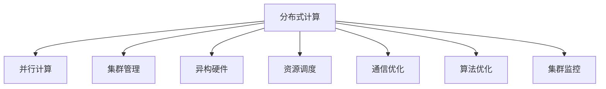

                 

# 分布式AI训练:技术挑战与人才需求

> 关键词：分布式AI, 大规模训练, 并行计算, 集群管理, 异构硬件, 资源调度, 算法优化, 人才需求

## 1. 背景介绍

### 1.1 问题由来
随着人工智能技术的高速发展，尤其是深度学习在图像、自然语言处理、语音识别等领域的突破，分布式AI训练成为了提高模型性能、加速模型迭代的关键技术。面对海量数据和高计算需求，单台计算机已难以满足深度学习模型的训练要求。通过分布式并行训练，可以显著提升训练速度，加速模型开发和上线。

当前，许多大型企业和技术公司如Google、Facebook、Microsoft等都在大规模部署分布式AI训练系统，以支撑其AI产品的研发和部署。然而，分布式AI训练不仅是一个技术挑战，更是一个涉及多个学科领域的复杂工程问题。需要在大规模数据集、高性能计算资源、高效通信网络、算法优化等多个方面进行系统设计和优化。同时，分布式AI训练还需要大量高水平人才进行运维和优化，以确保系统的高效稳定运行。

### 1.2 问题核心关键点
分布式AI训练的核心挑战包括：

- 数据分布和管理：如何在分布式环境下高效地进行数据划分和管理。
- 计算资源调度：如何动态分配和优化计算资源，实现负载均衡。
- 通信效率提升：如何优化数据传输和通信，减少网络延迟和带宽消耗。
- 算法优化与加速：如何设计高效的并行算法和加速技术，提升训练效率。
- 集群管理与监控：如何构建高效、稳定、可扩展的分布式计算集群，并实时监控系统状态。
- 人才需求与培养：如何培养具备多领域知识的高水平人才，满足分布式AI训练系统的高要求。

本文将从技术挑战和人才需求两个方面，对分布式AI训练进行深入分析和探讨。

## 2. 核心概念与联系

### 2.1 核心概念概述

为更好地理解分布式AI训练的技术体系和架构，本节将介绍几个关键概念：

- 分布式计算：将计算任务分布到多个计算节点上并行执行，提升计算效率。
- 并行计算：在单个计算节点内部，通过多线程或多进程并行处理，加速单个任务的处理速度。
- 集群管理：对多个计算节点进行统一管理和调度，确保集群的高效运行。
- 异构硬件：不同性能、不同类型（如GPU、CPU、FPGA）的计算资源。
- 资源调度：根据任务需求动态分配和调度计算资源，优化计算性能。
- 通信优化：优化数据传输和通信，减少网络延迟和带宽消耗。
- 算法优化：设计高效的并行算法和加速技术，提升训练效率。
- 集群监控：实时监控集群状态和性能指标，及时发现和解决问题。

这些核心概念之间的逻辑关系可以通过以下Mermaid流程图来展示：



这个流程图展示了大规模分布式AI训练的主要技术组件和它们之间的关系。

### 2.2 概念间的关系

这些核心概念之间存在着紧密的联系，形成了分布式AI训练的技术生态系统。下面是几个关键概念之间的关系：

- **分布式计算与并行计算**：分布式计算是并行计算的一种扩展，通过将任务分布到多个计算节点上执行，可以实现更强的计算能力和更高的资源利用率。
- **集群管理与资源调度**：集群管理是资源调度的基础，集群管理确保了资源的统一管理和调度，从而实现高效资源利用和负载均衡。
- **异构硬件与通信优化**：异构硬件带来了更高的计算能力和更大的并行性，但也对通信提出了更高要求。通信优化可以减少网络延迟和带宽消耗，提升整体系统效率。
- **算法优化与集群监控**：算法优化和集群监控是确保系统高效运行的重要手段。算法优化可以提升训练效率，集群监控可以帮助及时发现和解决问题，保障系统的稳定运行。

通过这些概念的相互配合，可以构建高效、稳定的分布式AI训练系统。

## 3. 核心算法原理 & 具体操作步骤
### 3.1 算法原理概述

分布式AI训练的核心算法原理是将大规模模型参数和数据划分为多个小块，分配到不同的计算节点上进行并行计算。通过优化通信和计算资源调度，以及设计高效的并行算法，实现高吞吐量、低延迟的模型训练。

具体来说，分布式AI训练的过程包括数据分布、参数分布、计算节点分配和任务调度等多个步骤。下面将详细介绍这些关键步骤。

### 3.2 算法步骤详解

#### 3.2.1 数据分布

数据分布是将训练数据集划分为多个小块，分配到不同的计算节点上进行处理。常见的数据分布方式包括：

- **按样本分布**：将数据集按样本均匀或按类别分布到多个节点上，适用于每个样本的计算开销基本相同的情况。
- **按特征分布**：将数据集的特征（如图像像素、文本词向量）均匀地分配到不同节点上，适用于特征之间的计算开销不同。
- **混合分布**：结合样本和特征分布，根据实际需求灵活选择数据分布方式。

#### 3.2.2 参数分布

参数分布是将模型参数划分为多个小块，分配到不同的计算节点上进行并行计算。常见的参数分布方式包括：

- **按层分布**：将模型按照层进行划分，每个节点负责计算部分层。适用于模型层数较多的情况。
- **按参数分布**：将模型参数按大小或重要性进行划分，分配到不同节点上。适用于资源不均衡的情况。
- **混合分布**：结合按层和按参数分布，根据实际需求灵活选择参数分布方式。

#### 3.2.3 计算节点分配

计算节点分配是根据任务需求动态分配和调度计算资源，实现负载均衡。常见的节点分配方式包括：

- **静态分配**：在训练前固定分配计算节点，适用于训练过程不变的情况。
- **动态分配**：根据任务需求动态分配计算节点，适用于任务需求变化的情况。
- **混合分配**：结合静态和动态分配，根据实际需求灵活选择节点分配方式。

#### 3.2.4 任务调度

任务调度是分配任务给计算节点并协调节点间的通信和计算过程。常见的任务调度方式包括：

- **按顺序调度**：依次将任务分配给计算节点，适用于任务间依赖性不大的情况。
- **按优先级调度**：根据任务优先级分配计算节点，适用于资源有限的情况。
- **混合调度**：结合顺序和优先级调度，根据实际需求灵活选择任务调度方式。

### 3.3 算法优缺点

分布式AI训练的优点包括：

- **高吞吐量**：通过并行计算，可以显著提升训练速度，缩短训练时间。
- **资源利用率高**：多台计算节点并行工作，可以充分利用计算资源，提升资源利用率。
- **可扩展性强**：通过增加计算节点，可以线性扩展系统的计算能力。

同时，分布式AI训练也存在一些缺点：

- **通信开销大**：数据和参数在不同节点间传输会带来较大的通信开销。
- **复杂度高**：需要设计高效的并行算法和调度策略，增加系统复杂度。
- **容错性差**：一个节点的故障可能影响整个训练过程。
- **资源管理困难**：多个计算节点之间的资源分配和管理复杂，容易出现资源浪费或不足的情况。

### 3.4 算法应用领域

分布式AI训练在多个领域都有广泛应用，例如：

- 深度学习：大规模模型训练，如图像识别、自然语言处理等。
- 数据挖掘：大规模数据分析和处理，如推荐系统、社交网络分析等。
- 科学计算：大规模计算任务，如天气预测、药物设计等。
- 金融分析：大规模数据集和模型训练，如风险评估、市场预测等。
- 工业控制：复杂系统仿真和优化，如自动驾驶、智能制造等。

## 4. 数学模型和公式 & 详细讲解  
### 4.1 数学模型构建

分布式AI训练的数学模型通常包括数据分布、参数分布、计算节点分配和任务调度等多个部分。下面以一个简单的分布式训练为例，展示其数学模型构建过程。

假设一个深度学习模型 $M$ 在 $n$ 个计算节点上进行分布式训练，每个节点使用部分数据和参数进行计算。设每个节点计算的数据量为 $D_i$，模型参数量为 $P_i$，节点的计算能力为 $C_i$，则整个系统的训练速度为：

$$
V = \sum_{i=1}^n \frac{D_i \cdot P_i}{C_i}
$$

其中 $V$ 为整个系统的训练速度，$D_i$ 为每个节点计算的数据量，$P_i$ 为每个节点计算的模型参数量，$C_i$ 为每个节点的计算能力。

### 4.2 公式推导过程

为了最大化训练速度 $V$，需要设计合适的数据分布、参数分布和任务调度策略。常见的优化策略包括：

- **数据并行**：将数据分布到多个节点上，每个节点使用相同的数据集进行计算。这样可以将数据读取和传输的开销降到最低，提高训练速度。
- **模型并行**：将模型参数分布到多个节点上，每个节点计算部分参数。这样可以将模型参数的更新时间降低到最小，提高训练速度。
- **混合并行**：结合数据并行和模型并行，根据实际需求灵活选择并行方式。

### 4.3 案例分析与讲解

下面以一个实际案例来详细分析分布式AI训练的数学模型和优化策略。

假设一个深度学习模型 $M$ 在 4 个计算节点上进行分布式训练，每个节点计算的数据量为 $D_i$，模型参数量为 $P_i$，节点的计算能力为 $C_i$，则整个系统的训练速度为：

$$
V = \frac{D_1 \cdot P_1}{C_1} + \frac{D_2 \cdot P_2}{C_2} + \frac{D_3 \cdot P_3}{C_3} + \frac{D_4 \cdot P_4}{C_4}
$$

假设数据和模型参数在节点之间平均分配，即 $D_i = D/4$，$P_i = P/4$，$C_i = C$，则有：

$$
V = \frac{D}{4C} + \frac{D}{4C} + \frac{D}{4C} + \frac{D}{4C} = \frac{D}{C}
$$

可以看出，通过数据并行和模型并行，可以将训练速度提高 4 倍。但实际应用中，需要根据具体任务和数据特点进行更加精细的优化设计。

## 5. 项目实践：代码实例和详细解释说明
### 5.1 开发环境搭建

在进行分布式AI训练实践前，我们需要准备好开发环境。以下是使用Python进行PyTorch分布式训练的环境配置流程：

1. 安装Anaconda：从官网下载并安装Anaconda，用于创建独立的Python环境。

2. 创建并激活虚拟环境：
```bash
conda create -n pytorch-env python=3.8 
conda activate pytorch-env
```

3. 安装PyTorch：根据CUDA版本，从官网获取对应的安装命令。例如：
```bash
conda install pytorch torchvision torchaudio cudatoolkit=11.1 -c pytorch -c conda-forge
```

4. 安装PyTorch分布式包：
```bash
pip install torch.distributed
```

5. 安装各类工具包：
```bash
pip install numpy pandas scikit-learn matplotlib tqdm jupyter notebook ipython
```

完成上述步骤后，即可在`pytorch-env`环境中开始分布式训练实践。

### 5.2 源代码详细实现

下面以一个简单的图像分类任务为例，给出使用PyTorch进行分布式训练的PyTorch代码实现。

```python
import torch
import torch.distributed as dist
from torchvision import datasets, transforms
from torch.nn import DistributedDataParallel as DDP

# 定义数据处理函数
transform = transforms.Compose([
    transforms.ToTensor(),
    transforms.Normalize((0.5, 0.5, 0.5), (0.5, 0.5, 0.5))
])

# 加载数据集
train_dataset = datasets.CIFAR10(root='./data', train=True, download=True, transform=transform)
train_sampler = torch.utils.data.distributed.DistributedSampler(train_dataset, num_replicas=world_size, rank=rank)
train_loader = torch.utils.data.DataLoader(train_dataset, batch_size=batch_size, shuffle=False, num_workers=workers, pin_memory=True)

# 初始化分布式环境
world_size = int(os.environ.get('WORLD_SIZE', 1))
rank = int(os.environ.get('RANK', 0))
torch.cuda.set_device(rank)
torch.distributed.init_process_group(backend='nccl', init_method=f'tcp://{host}:{port}')

# 定义模型
model = MyModel()

# 将模型包装成DistributedDataParallel
model = DDP(model)

# 定义损失函数和优化器
criterion = torch.nn.CrossEntropyLoss()
optimizer = torch.optim.SGD(model.parameters(), lr=0.01, momentum=0.9)

# 开始训练
for epoch in range(num_epochs):
    # 每个节点负责训练不同的数据
    for data in train_loader:
        inputs, labels = data
        inputs = inputs.to(device)
        labels = labels.to(device)
        optimizer.zero_grad()
        outputs = model(inputs)
        loss = criterion(outputs, labels)
        loss.backward()
        optimizer.step()
```

在上述代码中，我们首先定义了数据处理函数、加载了CIFAR-10数据集，并初始化了分布式环境。接着，将模型包装成DistributedDataParallel（DDP），实现了模型参数的分布式训练。最后，定义了损失函数和优化器，并开始进行训练。

### 5.3 代码解读与分析

让我们再详细解读一下关键代码的实现细节：

- **DistributedDataParallel（DDP）**：是PyTorch中常用的分布式训练工具，可以将模型参数复制并分配到多个节点上，实现模型并行训练。
- **DistributedSampler**：是PyTorch中用于处理数据集分割的工具，可以确保每个节点得到相同比例的数据。
- **torch.distributed.init_process_group**：是初始化分布式环境的关键函数，通过设置通信后端和初始化方法，构建多机多卡的分布式训练环境。
- **CIFAR-10**：是一个经典的图像分类数据集，包含60000个32x32像素的彩色图像，分为10个类别。

## 6. 实际应用场景
### 6.1 大规模模型训练

分布式AI训练的核心应用场景之一是训练大规模深度学习模型。当前，深度学习模型参数量动辄几十亿、上百亿，单台计算机难以满足训练需求。通过分布式并行训练，可以显著提高训练速度和模型性能。

例如，在Google的ResNet模型训练中，使用分布式AI训练系统将训练时间从原来的7天缩短至2小时，大幅提升了模型训练效率。在Facebook的GPT-3模型训练中，使用分布式AI训练系统将训练时间从原来的数月缩短至数天，成功训练出当前最先进的语言模型。

### 6.2 实时数据处理

分布式AI训练在实时数据处理中也具有重要应用。例如，在金融风控系统中，实时分析大量交易数据，检测异常交易行为。通过分布式并行处理，可以快速计算出风险概率，提高系统响应速度。

在医疗系统中，实时分析大量患者数据，诊断疾病。通过分布式并行计算，可以显著提升数据分析速度，及时发现病情变化，提高医疗服务质量。

### 6.3 科学计算

分布式AI训练在科学计算中也具有广泛应用。例如，在天气预测系统中，需要处理和分析大量气象数据，模拟气候变化。通过分布式并行计算，可以显著提高计算速度，提高预测精度。

在药物设计中，需要模拟分子结构和药物反应，进行药物筛选。通过分布式并行计算，可以加速计算过程，发现更多有效的药物分子。

### 6.4 未来应用展望

随着AI技术的不断发展，分布式AI训练的应用场景将越来越广泛。未来，分布式AI训练将在以下几个方面发挥重要作用：

- **AI开发平台**：构建集成了分布式训练功能的AI开发平台，支持模型的快速训练和迭代。
- **边缘计算**：在边缘设备上进行分布式训练，提高计算效率和实时性。
- **数据中心**：优化数据中心资源调度和管理，提高计算资源利用率。
- **AI芯片**：在AI芯片上进行分布式训练，提升计算速度和资源利用率。
- **跨平台协同**：实现不同平台和系统的协同计算，提高整体系统效率。

## 7. 工具和资源推荐
### 7.1 学习资源推荐

为了帮助开发者系统掌握分布式AI训练的理论基础和实践技巧，这里推荐一些优质的学习资源：

1. 《分布式深度学习》系列博文：由分布式AI专家撰写，深入浅出地介绍了分布式深度学习的基础原理和实践方法。

2. CS446《分布式系统》课程：斯坦福大学开设的分布式系统经典课程，涵盖了分布式计算、通信协议、资源调度等多个方面。

3. 《深度学习框架设计与实现》书籍：作者为Google AI的深度学习架构师，介绍了深度学习框架的分布式设计思路。

4. 《高性能计算与分布式系统》书籍：作者为ACM Turing奖获得者，介绍了高性能计算和分布式系统的理论基础和实践方法。

5. Weights & Biases：模型训练的实验跟踪工具，可以记录和可视化模型训练过程中的各项指标，方便对比和调优。与主流深度学习框架无缝集成。

6. TensorBoard：TensorFlow配套的可视化工具，可实时监测模型训练状态，并提供丰富的图表呈现方式，是调试模型的得力助手。

合理利用这些工具，可以显著提升分布式AI训练的开发效率，加快创新迭代的步伐。

### 7.2 开发工具推荐

高效的开发离不开优秀的工具支持。以下是几款用于分布式AI训练开发的常用工具：

1. PyTorch：基于Python的开源深度学习框架，灵活动态的计算图，适合快速迭代研究。

2. TensorFlow：由Google主导开发的开源深度学习框架，生产部署方便，适合大规模工程应用。

3. Horovod：一个开源的分布式深度学习训练框架，支持多种深度学习框架和分布式环境。

4. Parameter Server：一个用于大规模分布式训练的参数服务器，提供高效的参数更新和通信功能。

5. Tesseract：一个高性能的分布式计算框架，支持多种编程语言和计算模式。

6. Apache Spark：一个开源的大数据处理框架，支持分布式计算和数据处理。

通过这些工具，可以显著提升分布式AI训练的开发效率，加快创新迭代的步伐。

### 7.3 相关论文推荐

分布式AI训练的研究源于学界的持续研究。以下是几篇奠基性的相关论文，推荐阅读：

1. "Communication-efficient Distributed Deep Learning with Secure Aggregations"：提出基于安全聚合的分布式深度学习算法，提高了通信效率和安全性。

2. "PowerSGD: Distributed Optimization for Deep Learning"：提出PowerSGD算法，改进分布式优化器，提高了训练速度和收敛性。

3. "DeepSpeed: General-purpose Distributed Deep Learning Library"：一个开源的分布式深度学习库，提供了多种分布式训练框架和工具。

4. "Optimizing Distributed Deep Learning Jobs on Heterogeneous Cloud"：提出异构云上分布式深度学习优化方法，提高了资源利用率和训练效率。

5. "Scaling Distributed Deep Neural Networks with Fast Distributed Optimization Algorithms"：提出多种分布式优化算法，提高了训练速度和资源利用率。

这些论文代表了大规模分布式AI训练的发展脉络。通过学习这些前沿成果，可以帮助研究者把握学科前进方向，激发更多的创新灵感。

除上述资源外，还有一些值得关注的前沿资源，帮助开发者紧跟分布式AI训练技术的最新进展，例如：

1. arXiv论文预印本：人工智能领域最新研究成果的发布平台，包括大量尚未发表的前沿工作，学习前沿技术的必读资源。

2. 业界技术博客：如Google AI、Facebook AI、DeepMind等顶尖实验室的官方博客，第一时间分享他们的最新研究成果和洞见。

3. 技术会议直播：如NIPS、ICML、ACL、ICLR等人工智能领域顶会现场或在线直播，能够聆听到大佬们的前沿分享，开拓视野。

4. GitHub热门项目：在GitHub上Star、Fork数最多的分布式AI相关项目，往往代表了该技术领域的发展趋势和最佳实践，值得去学习和贡献。

5. 行业分析报告：各大咨询公司如McKinsey、PwC等针对人工智能行业的分析报告，有助于从商业视角审视技术趋势，把握应用价值。

总之，对于分布式AI训练技术的学习和实践，需要开发者保持开放的心态和持续学习的意愿。多关注前沿资讯，多动手实践，多思考总结，必将收获满满的成长收益。

## 8. 总结：未来发展趋势与挑战

### 8.1 总结

本文对分布式AI训练的技术挑战和人才需求进行了全面系统的介绍。首先阐述了分布式AI训练的研究背景和意义，明确了分布式AI训练在提升模型性能、加速模型迭代方面的重要价值。其次，从技术挑战和人才需求两个方面，详细讲解了分布式AI训练的数学模型和优化策略，给出了分布式训练的完整代码实例。同时，本文还探讨了分布式AI训练在多个行业领域的应用前景，展示了其广阔的发展空间。

通过本文的系统梳理，可以看到，分布式AI训练技术正在快速发展，成为现代深度学习模型的重要技术支持。未来，伴随预训练模型和微调方法的持续演进，分布式AI训练必将在更多领域得到应用，为人工智能技术的产业化进程提供强大的动力。

### 8.2 未来发展趋势

展望未来，分布式AI训练技术将呈现以下几个发展趋势：

1. **模型规模持续增大**：随着算力成本的下降和数据规模的扩张，分布式AI训练系统将支撑更大规模的深度学习模型训练，提高计算效率和资源利用率。

2. **计算资源调度优化**：分布式AI训练系统将引入更多智能调度算法，动态调整计算资源分配，实现高效资源利用和负载均衡。

3. **通信效率提升**：分布式AI训练系统将引入更多通信优化技术，如缓存、数据压缩等，减少网络延迟和带宽消耗，提高整体系统效率。

4. **算法优化与加速**：分布式AI训练系统将引入更多并行算法和加速技术，如混合并行、异步计算等，提升训练速度和资源利用率。

5. **集群监控与运维**：分布式AI训练系统将引入更多实时监控和运维技术，及时发现和解决问题，保障系统的稳定运行。

6. **跨平台协同**：分布式AI训练系统将支持多种计算平台和设备，实现跨平台协同计算，提高整体系统效率。

以上趋势凸显了分布式AI训练技术的广阔前景。这些方向的探索发展，必将进一步提升分布式AI训练系统的性能和应用范围，为人工智能技术的发展提供新的动力。

### 8.3 面临的挑战

尽管分布式AI训练技术已经取得了瞩目成就，但在迈向更加智能化、普适化应用的过程中，它仍面临着诸多挑战：

1. **通信开销大**：数据和参数在不同节点间传输会带来较大的通信开销，如何优化通信效率，减少网络延迟和带宽消耗，是当前研究的热点问题。

2. **算法复杂度高**：分布式AI训练系统需要设计高效的并行算法和调度策略，增加系统复杂度，如何降低算法复杂度，提高系统稳定性，是未来的重要研究方向。

3. **资源管理困难**：多个计算节点之间的资源分配和管理复杂，容易出现资源浪费或不足的情况，如何优化资源管理，提高资源利用率，是未来的重要研究方向。

4. **系统容错性差**：一个节点的故障可能影响整个训练过程，如何提高系统容错性，保障系统的高可靠性，是未来的重要研究方向。

5. **系统稳定性差**：分布式AI训练系统需要高水平人才进行运维和优化，如何培养具备多领域知识的高水平人才，满足分布式AI训练系统的高要求，是未来的重要研究方向。

6. **算法和数据隐私保护**：分布式AI训练系统需要处理大量的敏感数据，如何保护数据隐私，防止数据泄露，是未来的重要研究方向。

正视分布式AI训练面临的这些挑战，积极应对并寻求突破，将是推动分布式AI训练技术迈向成熟的必由之路。相信随着学界和产业界的共同努力，这些挑战终将一一被克服，分布式AI训练必将在构建人机协同的智能时代中扮演越来越重要的角色。

### 8.4 研究展望

面对分布式AI训练所面临的种种挑战，未来的研究需要在以下几个方面寻求新的突破：

1. **探索分布式优化算法**：设计高效的分布式优化算法，降低算法复杂度，提高系统稳定性。

2. **引入分布式调度策略**：设计智能化的资源调度算法，优化计算资源分配，实现高效资源利用和负载均衡。

3. **优化通信架构**：引入数据压缩、缓存等通信优化技术，减少网络延迟和带宽消耗，提高整体系统效率。

4. **引入协同计算技术**：实现不同平台和设备之间的协同计算，提高整体系统效率。

5. **加强系统监控和运维**

