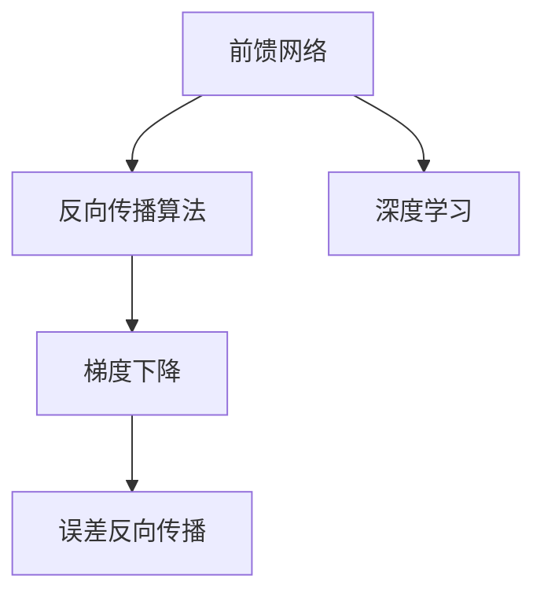
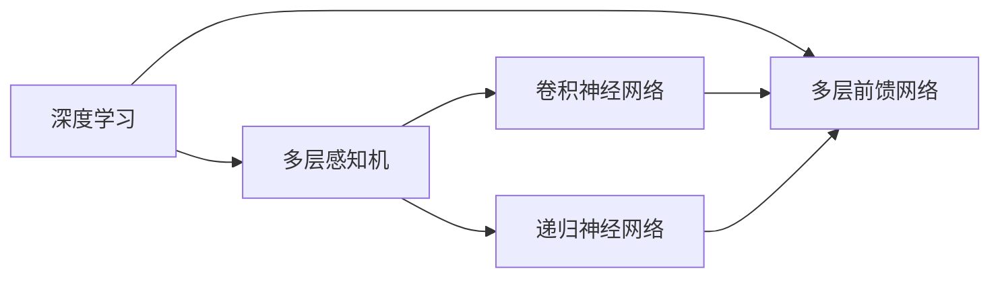
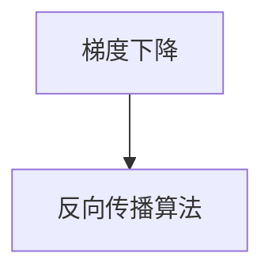
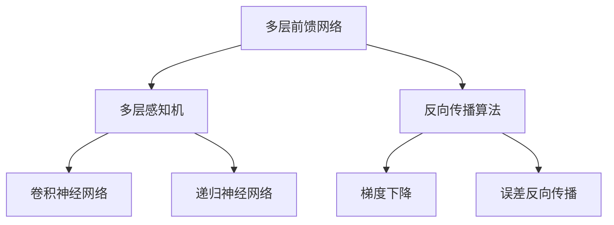

                 

# 前馈网络在AI模型中的应用

> 关键词：前馈网络, 深度学习, 神经网络, 梯度下降, 反向传播, 反向传播算法, 误差反向传播

## 1. 背景介绍

### 1.1 问题由来

在前馈网络（Feedforward Network）发展初期，其在处理复杂、高维度的数据时，展现了强大的优势。从最初的感知机（Perceptron）模型到多层的深度神经网络（Deep Neural Networks），前馈网络一直是机器学习和人工智能的核心技术之一。

如今，在前馈网络的基础上，许多前沿的技术被提出，如卷积神经网络（CNN）、递归神经网络（RNN）和Transformer等。尽管这些技术的诞生丰富了人工智能的模型库，但是前馈网络依旧承担着重要的角色，尤其对于深度学习初学者的理解和入门来说，前馈网络是极佳的入门模型。

### 1.2 问题核心关键点

1. 前馈网络：一种用于解决分类、回归等问题的深度学习模型。其核心原理是输入层将输入数据线性变换为输出层，并经过一系列中间层进行非线性变换，最终输出结果。
2. 反向传播算法：前馈网络的优化算法，通过计算目标函数的梯度，反向传播误差，更新权重和偏置，使得模型能够拟合数据。
3. 梯度下降：优化算法的一种，通过不断调整权重和偏置，使目标函数的值逐渐减小，即最小化误差。
4. 神经网络：由多个前馈网络（或前馈网络的变种）组成的复杂模型，其中每个前馈网络对应一个层次，整个网络具有多层次、非线性的特点。
5. 深度学习：一种基于神经网络的机器学习方法，通过多层次的复杂网络结构和大量数据训练，使得模型可以处理复杂、高维度的数据。
6. 反向传播算法：深度学习的核心算法，用于通过梯度下降法来优化模型参数。
7. 误差反向传播：通过计算目标函数的梯度，反向传播误差，更新权重和偏置，使得模型能够拟合数据。

### 1.3 问题研究意义

研究前馈网络的应用，对于理解深度学习的基础模型、掌握深度学习的优化算法，以及为后续的学习更高级的深度学习模型奠定了基础。此外，前馈网络在各种实际应用中都有广泛的应用，如自然语言处理、计算机视觉、语音识别等。通过对前馈网络的研究，可以进一步提升人工智能在实际应用中的效果。

## 2. 核心概念与联系

### 2.1 核心概念概述

为更好地理解前馈网络的应用，本节将介绍几个密切相关的核心概念：

- 前馈网络（Feedforward Network）：一种神经网络结构，其中数据从前向后流动，没有循环连接。常见的例子包括单层神经网络、多层感知机（MLP）、卷积神经网络（CNN）、递归神经网络（RNN）等。
- 反向传播算法（Backpropagation）：一种优化算法，用于前馈网络通过计算目标函数的梯度，反向传播误差，更新权重和偏置，使得模型能够拟合数据。
- 梯度下降（Gradient Descent）：一种优化算法，通过不断调整权重和偏置，使目标函数的值逐渐减小，即最小化误差。
- 深度学习（Deep Learning）：一种基于神经网络的机器学习方法，通过多层次的复杂网络结构和大量数据训练，使得模型可以处理复杂、高维度的数据。
- 误差反向传播（Error Backpropagation）：通过计算目标函数的梯度，反向传播误差，更新权重和偏置，使得模型能够拟合数据。

这些核心概念之间的逻辑关系可以通过以下Mermaid流程图来展示：



这个流程图展示了几何前馈网络的相关概念及其之间的关系：

1. 前馈网络通过反向传播算法和梯度下降法不断优化参数，使得目标函数最小化。
2. 深度学习是由多个前馈网络组成的多层次、非线性的复杂模型。
3. 误差反向传播是反向传播算法的核心，用于计算目标函数的梯度，并更新权重和偏置。

### 2.2 概念间的关系

这些核心概念之间存在着紧密的联系，形成了深度学习的完整生态系统。下面我们通过几个Mermaid流程图来展示这些概念之间的关系。

#### 2.2.1 前馈网络的深度学习范式



这个流程图展示了深度学习中不同类型的前馈网络：

1. 多层感知机是前馈网络的一种。
2. 卷积神经网络是多层感知机的变种，适用于处理图像数据。
3. 递归神经网络是前馈网络的变种，适用于处理序列数据。
4. 多层前馈网络是深度学习的核心。

#### 2.2.2 反向传播算法与前馈网络的关系


这个流程图展示了反向传播算法和前馈网络的关系：

1. 前馈网络使用反向传播算法进行参数更新。
2. 反向传播算法是多层感知机的核心优化算法。

#### 2.2.3 梯度下降法与反向传播算法的关系



这个流程图展示了梯度下降法和反向传播算法的关系：

1. 反向传播算法使用梯度下降法进行参数更新。

#### 2.2.4 误差反向传播与前馈网络的关系


这个流程图展示了误差反向传播和前馈网络的关系：

1. 误差反向传播是反向传播算法的核心。
2. 反向传播算法使用梯度下降法进行参数更新。

### 2.3 核心概念的整体架构

最后，我们用一个综合的流程图来展示这些核心概念在前馈网络中的整体架构：



这个综合流程图展示了前馈网络的完整结构：

1. 多层前馈网络是深度学习的核心。
2. 多层感知机是前馈网络的一种。
3. 卷积神经网络是多层感知机的变种，适用于处理图像数据。
4. 递归神经网络是前馈网络的变种，适用于处理序列数据。
5. 反向传播算法用于前馈网络通过梯度下降法不断优化参数。
6. 梯度下降法用于计算目标函数的梯度。
7. 误差反向传播是反向传播算法的核心，用于计算目标函数的梯度。

通过这些流程图，我们可以更清晰地理解前馈网络的应用过程中各个核心概念的关系和作用，为后续深入讨论具体的模型优化和应用提供了基础。

## 3. 核心算法原理 & 具体操作步骤

### 3.1 算法原理概述

前馈网络的优化过程主要依赖于反向传播算法和梯度下降法。其核心原理是：

1. 将输入数据通过一系列线性变换和非线性变换，最终输出结果。
2. 通过计算目标函数的梯度，反向传播误差，更新权重和偏置，使得模型能够拟合数据。
3. 通过不断调整权重和偏置，使目标函数的值逐渐减小，即最小化误差。

具体来说，前馈网络的优化步骤如下：

1. 将输入数据 $x$ 通过网络的前向传播过程，得到输出结果 $y$。
2. 计算输出结果 $y$ 与真实标签 $t$ 之间的误差 $e$。
3. 使用反向传播算法计算误差 $e$ 对网络参数 $\theta$ 的梯度 $\nabla_e\theta$。
4. 使用梯度下降法更新网络参数 $\theta$，使得误差 $e$ 逐渐减小。

### 3.2 算法步骤详解

前馈网络的优化过程主要包括以下几个关键步骤：

**Step 1: 准备数据和模型**

- 收集训练数据，并划分为训练集、验证集和测试集。
- 选择合适的前馈网络结构，如多层感知机、卷积神经网络等。
- 使用随机梯度下降法（SGD）、Adam等优化算法，设定学习率等参数。

**Step 2: 前向传播**

- 将训练数据输入前馈网络，得到网络的输出结果。
- 使用softmax函数将输出结果转化为概率分布，即 $\hat{y}$。

**Step 3: 计算误差**

- 使用交叉熵等损失函数计算预测结果 $\hat{y}$ 与真实标签 $y$ 之间的误差 $e$。
- 通过反向传播算法计算误差 $e$ 对网络参数 $\theta$ 的梯度 $\nabla_e\theta$。

**Step 4: 参数更新**

- 使用梯度下降法，根据损失函数梯度 $\nabla_e\theta$ 更新网络参数 $\theta$。
- 在每个epoch后，使用验证集评估模型性能，根据性能指标决定是否继续训练。

**Step 5: 测试和评估**

- 在测试集上评估模型的性能，如准确率、精确率、召回率等指标。
- 使用测试集的结果，决定模型是否继续训练或使用。

### 3.3 算法优缺点

前馈网络具有以下优点：

1. 结构简单，易于理解和实现。
2. 适用于各种类型的输入数据，包括图像、文本等。
3. 可以处理高维度的数据，适用于大规模数据集。
4. 具有较高的泛化能力，能够适应各种复杂的任务。

同时，前馈网络也存在以下缺点：

1. 需要大量的数据进行训练，训练时间较长。
2. 容易过拟合，需要采用正则化等方法进行优化。
3. 对于序列数据，如时间序列数据，处理能力有限。
4. 对于长尾数据，即小样本数据，效果不佳。

### 3.4 算法应用领域

前馈网络在许多实际应用中都得到了广泛的应用，例如：

- 图像分类：使用卷积神经网络对图像进行分类，如LeNet、AlexNet等。
- 自然语言处理：使用多层感知机对文本进行分类和序列建模，如LSTM、GRU等。
- 语音识别：使用多层感知机或卷积神经网络对语音信号进行特征提取和分类，如DeepSpeech、Wav2Letter等。
- 游戏AI：使用多层感知机或卷积神经网络进行游戏策略的建模和优化，如AlphaGo等。
- 推荐系统：使用多层感知机或卷积神经网络进行用户行为分析和物品推荐，如YouTube推荐系统等。

除了上述这些应用，前馈网络还在医疗、金融、物流等领域得到了广泛应用，为各行业提供了强大的技术支持。

## 4. 数学模型和公式 & 详细讲解 & 举例说明

### 4.1 数学模型构建

假设前馈网络包含 $n$ 层，第 $i$ 层的输入为 $x_i$，输出为 $h_i$。定义损失函数为 $L(\theta)$，其中 $\theta$ 为前馈网络的参数。前馈网络的优化目标是最小化损失函数 $L(\theta)$。

前馈网络的前向传播过程如下：

$$
h_1 = w_1x + b_1
$$

$$
h_2 = w_2h_1 + b_2
$$

$$
\vdots
$$

$$
h_n = w_nh_{n-1} + b_n
$$

其中，$w$ 和 $b$ 分别为权重和偏置。

前馈网络的反向传播过程如下：

$$
\frac{\partial L}{\partial w_n} = \frac{\partial L}{\partial h_n} \frac{\partial h_n}{\partial w_n} = \frac{\partial L}{\partial h_n} w_{n-1}^T
$$

$$
\frac{\partial L}{\partial b_n} = \frac{\partial L}{\partial h_n} \frac{\partial h_n}{\partial b_n} = \frac{\partial L}{\partial h_n}
$$

$$
\frac{\partial L}{\partial w_i} = \frac{\partial L}{\partial h_i} \frac{\partial h_i}{\partial w_i} = \frac{\partial L}{\partial h_i} w_{i-1}^T
$$

$$
\frac{\partial L}{\partial b_i} = \frac{\partial L}{\partial h_i} \frac{\partial h_i}{\partial b_i} = \frac{\partial L}{\partial h_i}
$$

其中，$\frac{\partial L}{\partial h_i}$ 为误差 $e$ 对 $h_i$ 的梯度，$\frac{\partial h_i}{\partial w_i}$ 和 $\frac{\partial h_i}{\partial b_i}$ 分别为权重和偏置对 $h_i$ 的偏导数。

### 4.2 公式推导过程

以下是前馈网络优化过程的详细公式推导：

假设前馈网络的输出结果为 $\hat{y}$，真实标签为 $y$，使用交叉熵损失函数，定义损失函数为 $L(\theta)$。

定义 $\hat{y} = sigmoid(w_nh_{n-1} + b_n)$，其中 $sigmoid$ 为 sigmoid 函数。

$$
L(\theta) = -\frac{1}{N} \sum_{i=1}^N(y_i \log \hat{y_i} + (1-y_i) \log (1-\hat{y_i}))
$$

其中，$N$ 为样本数，$y_i \in \{0, 1\}$ 表示样本的真实标签，$\hat{y_i} \in [0, 1]$ 表示模型预测的概率。

前馈网络的输出结果 $\hat{y}$ 可以表示为：

$$
\hat{y} = sigmoid(w_nh_{n-1} + b_n)
$$

其中，$w_n$ 和 $b_n$ 为最后一层的权重和偏置，$h_{n-1}$ 为最后一层的输入。

定义误差 $e = y - \hat{y}$，则误差反向传播过程如下：

$$
\frac{\partial L}{\partial h_n} = \frac{\partial L}{\partial \hat{y}} \frac{\partial \hat{y}}{\partial h_n} = (y - \hat{y}) \hat{y} (1-\hat{y})
$$

$$
\frac{\partial L}{\partial w_n} = \frac{\partial L}{\partial h_n} w_{n-1}^T
$$

$$
\frac{\partial L}{\partial b_n} = \frac{\partial L}{\partial h_n}
$$

$$
\frac{\partial L}{\partial h_{n-1}} = \frac{\partial L}{\partial h_n} w_n^T
$$

$$
\frac{\partial L}{\partial w_{n-1}} = \frac{\partial L}{\partial h_{n-1}} h_{n-2}^T
$$

$$
\frac{\partial L}{\partial b_{n-1}} = \frac{\partial L}{\partial h_{n-1}}
$$

依此类推，可以不断向前传播误差，直到第一层。

### 4.3 案例分析与讲解

以多层感知机（MLP）为例，使用sigmoid激活函数。

假设输入数据为 $x = [x_1, x_2, x_3]$，第一层权重为 $w_1 = [w_{11}, w_{12}, w_{13}]$，偏置为 $b_1 = b_{11}$，第二层权重为 $w_2 = [w_{21}, w_{22}, w_{23}]$，偏置为 $b_2 = b_{22}$，输出结果为 $\hat{y}$。

前向传播过程如下：

$$
h_1 = w_1x + b_1
$$

$$
h_2 = w_2h_1 + b_2
$$

$$
\hat{y} = sigmoid(h_2)
$$

其中，$h_1 = [w_{11}x_1 + w_{12}x_2 + w_{13}x_3 + b_{11}]$，$h_2 = [w_{21}h_1 + w_{22}h_1 + w_{23}h_1 + b_{22}]$。

定义误差 $e = y - \hat{y}$，则误差反向传播过程如下：

$$
\frac{\partial L}{\partial h_2} = (y - \hat{y}) \hat{y} (1-\hat{y})
$$

$$
\frac{\partial L}{\partial w_2} = \frac{\partial L}{\partial h_2} w_1^T
$$

$$
\frac{\partial L}{\partial b_2} = \frac{\partial L}{\partial h_2}
$$

$$
\frac{\partial L}{\partial h_1} = \frac{\partial L}{\partial h_2} w_2^T
$$

$$
\frac{\partial L}{\partial w_1} = \frac{\partial L}{\partial h_1} x^T
$$

$$
\frac{\partial L}{\partial b_1} = \frac{\partial L}{\partial h_1}
$$

通过上述公式，可以不断向前传播误差，更新每个层的权重和偏置，最终得到优化后的前馈网络。

## 5. 项目实践：代码实例和详细解释说明

### 5.1 开发环境搭建

在进行前馈网络实践前，我们需要准备好开发环境。以下是使用Python进行TensorFlow开发的环境配置流程：

1. 安装Anaconda：从官网下载并安装Anaconda，用于创建独立的Python环境。

2. 创建并激活虚拟环境：
```bash
conda create -n tensorflow-env python=3.8 
conda activate tensorflow-env
```

3. 安装TensorFlow：根据CUDA版本，从官网获取对应的安装命令。例如：
```bash
conda install tensorflow -c tensorflow -c conda-forge
```

4. 安装各类工具包：
```bash
pip install numpy pandas scikit-learn matplotlib tqdm jupyter notebook ipython
```

完成上述步骤后，即可在`tensorflow-env`环境中开始前馈网络实践。

### 5.2 源代码详细实现

下面我们以多层感知机（MLP）为例，给出使用TensorFlow进行前馈网络的代码实现。

首先，定义数据处理函数：

```python
import tensorflow as tf
from tensorflow.keras.datasets import mnist
from tensorflow.keras.utils import to_categorical

(train_images, train_labels), (test_images, test_labels) = mnist.load_data()

train_images = train_images / 255.0
test_images = test_images / 255.0

train_labels = to_categorical(train_labels, num_classes=10)
test_labels = to_categorical(test_labels, num_classes=10)
```

然后，定义模型和优化器：

```python
from tensorflow.keras import Sequential
from tensorflow.keras.layers import Dense, Activation

model = Sequential()
model.add(Dense(64, input_dim=784))
model.add(Activation('relu'))
model.add(Dense(10))
model.add(Activation('softmax'))

optimizer = tf.keras.optimizers.Adam(learning_rate=0.001)
```

接着，定义训练和评估函数：

```python
from tensorflow.keras import compile, fit

model.compile(optimizer=optimizer, loss='categorical_crossentropy', metrics=['accuracy'])

history = model.fit(train_images, train_labels, epochs=10, batch_size=32, validation_data=(test_images, test_labels))
```

最后，启动训练流程并在测试集上评估：

```python
test_loss, test_acc = model.evaluate(test_images, test_labels)
print('Test accuracy:', test_acc)
```

以上就是使用TensorFlow对多层感知机进行前馈网络训练的完整代码实现。可以看到，TensorFlow提供了丰富的API和工具，使得模型开发和训练变得简洁高效。

### 5.3 代码解读与分析

让我们再详细解读一下关键代码的实现细节：

**数据处理函数**：
- 使用TensorFlow的内置API加载MNIST数据集，并进行归一化处理。
- 将标签转化为one-hot编码，方便后续的损失函数计算。

**模型定义**：
- 使用TensorFlow的Sequential模型容器定义多层感知机。
- 添加输入层（Dense），激活函数（Activation），输出层等组件。

**优化器定义**：
- 选择Adam优化器，并设置学习率等参数。

**训练和评估函数**：
- 使用compile方法定义模型的损失函数和评估指标。
- 使用fit方法进行模型训练，并记录训练过程中的各项指标。
- 在测试集上评估模型的性能。

**运行结果展示**：
- 使用evaluate方法在测试集上计算模型的准确率。

可以看到，TensorFlow提供了丰富的工具和API，使得前馈网络的训练和评估变得简洁高效。开发者可以将更多精力放在模型设计和优化上，而不必过多关注底层实现细节。

当然，工业级的系统实现还需考虑更多因素，如模型的保存和部署、超参数的自动搜索、更灵活的任务适配层等。但核心的前馈网络训练流程基本与此类似。

## 6. 实际应用场景

前馈网络在许多实际应用中都得到了广泛的应用，例如：

- 图像分类：使用卷积神经网络对图像进行分类，如LeNet、AlexNet等。
- 自然语言处理：使用多层感知机对文本进行分类和序列建模，如LSTM、GRU等。
- 语音识别：使用多层感知机或卷积神经网络对语音信号进行特征提取和分类，如DeepSpeech、Wav2Letter等。
- 游戏AI：使用多层感知机或卷积神经网络进行游戏策略的建模和优化，如AlphaGo等。
- 推荐系统：使用多层感知机或卷积神经网络进行用户行为分析和物品推荐，如YouTube推荐系统等。

除了上述这些应用，前馈网络还在医疗、金融、物流等领域得到了广泛应用，为各行业提供了强大的技术支持。

## 7. 工具和资源推荐

### 7.1 学习资源推荐

为了帮助开发者系统掌握前馈网络的基础理论和实践技巧，这里推荐一些优质的学习资源：

1. 《深度学习》系列书籍：由Ian Goodfellow、Yoshua Bengio、Aaron Courville所著，深入浅出地介绍了深度学习的各个方面，包括前馈网络的原理和应用。

2. CS231n《卷积神经网络》课程：斯坦福大学开设的计算机视觉课程，有Lecture视频和配套作业，带你入门深度学习中的前馈网络。

3. CS224n《自然语言处理》课程：斯坦福大学开设的自然语言处理课程，有Lecture视频和配套作业，涵盖前馈网络在NLP中的应用。

4. TensorFlow官方文档：TensorFlow的官方文档，提供了丰富的API和示例代码，是学习前馈网络的最佳资源。

5. PyTorch官方文档：PyTorch的官方文档，提供了丰富的API和示例代码，是学习前馈网络的最佳资源。

6. Keras官方文档：Keras的官方文档，提供了丰富的API和示例代码，是学习前馈网络的最佳资源。

通过对这些资源的学习实践，相信你一定能够快速掌握前馈网络的精髓，并用于解决实际的深度学习问题。

### 7.2 开发工具推荐

高效的开发离不开优秀的工具支持。以下是几款用于前馈网络开发的常用工具：

1. TensorFlow：由Google主导开发的开源深度学习框架，生产部署方便，适合大规模工程应用。

2. PyTorch：基于Python的开源深度学习框架，灵活动态的计算图，适合快速迭代研究。

3. Keras：一个高级神经网络API，可以在TensorFlow、Theano等后端框架上运行，易于上手。

4. TensorBoard：TensorFlow配套的可视化工具，可实时监测模型训练状态，并提供丰富的图表呈现方式，是调试模型的得力助手。

5. Weights & Biases：模型训练的实验跟踪工具，可以记录和可视化模型训练过程中的各项指标，方便对比和调优。

6. Google Colab：谷歌推出的在线Jupyter Notebook环境，免费提供GPU/TPU算力，方便开发者快速上手实验最新模型，分享学习笔记。

合理利用这些工具，可以显著提升前馈网络的开发效率，加快创新迭代的步伐。

### 7.3 相关论文推荐

前馈网络在深度学习中的研究源于学界的持续研究。以下是几篇奠基性的相关论文，推荐阅读：

1. A Framework for Learning Invariant Representations（Jordan 1997）：提出了反向传播算法的基本原理，奠定了深度学习的基础。

2. Deep Learning（Goodfellow 2016）：全面介绍了深度学习的基本概念和算法，包括前馈网络的原理和应用。

3. ImageNet Classification with Deep Convolutional Neural Networks（Krizhevsky 2012）：提出了卷积神经网络的结构，展示了其在图像分类任务中的优势。

4. Deep

