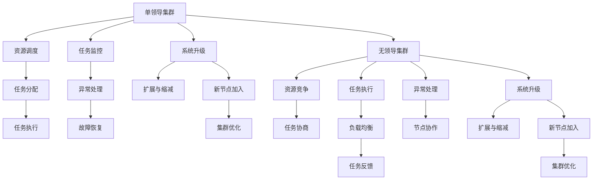
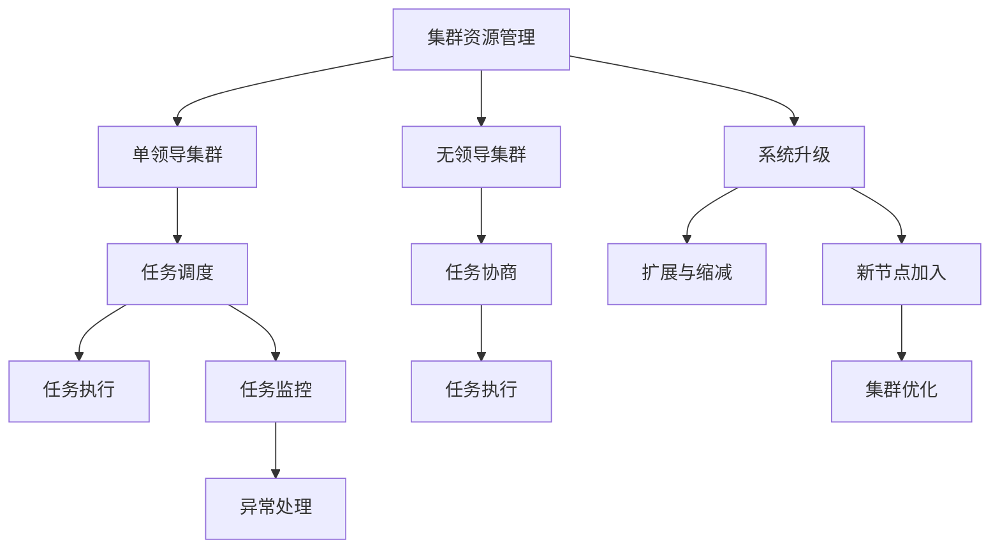

                 

# 单领导集群与无领导集群最佳实践

> 关键词：集群管理,单领导集群,无领导集群,分布式系统,微服务,数据处理,负载均衡

## 1. 背景介绍

随着云计算技术的普及和互联网应用的扩展，企业对分布式系统的需求日益增长。分布式系统能够提供高可用性、高性能、高扩展性的服务，但同时也带来了系统复杂性和管理难题。集群作为分布式系统的一种基本形态，承担着数据处理、计算、存储、负载均衡等重要任务。集群管理是分布式系统运维的核心环节，直接影响到系统性能和稳定性。

集群管理分为单领导集群和无领导集群两种基本形态。单领导集群通常采用集中式管理方式，由单一领导节点负责资源调度和管理。无领导集群则采用分布式管理方式，由多个节点协同工作，共同管理资源。单领导集群和无领导集群各有优缺点，本文将探讨其最佳实践，为企业集群管理提供参考。

## 2. 核心概念与联系

### 2.1 核心概念概述

为了更好地理解单领导集群和无领导集群的优缺点及其最佳实践，本节将介绍几个核心概念：

- 单领导集群（Single Leader Cluster）：指集群中只有一个领导节点负责资源调度和管理的集群形态。该集群采用集中式管理方式，由单一节点调度所有任务。

- 无领导集群（Leaderless Cluster）：指集群中没有明确领导节点，每个节点都可以发起资源申请和管理。该集群采用分布式管理方式，节点之间通过协议协作，共同管理资源。

- 集群资源管理：指集群中各个节点之间的资源协调与分配过程，包括CPU、内存、存储、网络等各类资源的分配和释放。

- 分布式系统：指由多个节点组成的，通过网络互连的系统。分布式系统可以提供高可用性、高性能、高扩展性的服务。

- 微服务架构：指将应用拆分为多个小型、独立的服务单元，每个服务单元独立部署、独立扩展、独立运维的架构模式。

- 负载均衡：指将请求分散到多个节点处理，以提高系统的并发处理能力和稳定性。

- 高可用性：指系统在故障情况下仍能提供正常服务的能力。高可用性通常通过备份、冗余、容错等技术实现。

这些核心概念之间存在紧密联系，共同构成了集群管理的基本框架。以下是一个简单的Mermaid流程图，展示单领导集群和无领导集群的基本管理流程：



该图展示了单领导集群和无领导集群的基本流程。单领导集群由领导节点负责资源调度和任务分配，任务执行和监控主要由领导节点负责，节点间协作较少。而无领导集群中每个节点都可以发起资源申请和管理，任务执行和监控由节点协作完成，负载均衡和故障恢复更加灵活。

### 2.2 概念间的关系

这些核心概念之间存在紧密联系，构成了集群管理的完整生态系统。以下是一个综合的流程图，展示单领导集群和无领导集群在资源管理、任务调度、异常处理、系统升级等方面的关系：



该图展示了集群资源管理与单领导集群、无领导集群的关系，以及任务调度、任务执行、任务监控、异常处理、系统升级等方面的关系。可以看出，集群资源管理和任务调度是集群管理的核心环节，直接影响系统的性能和稳定性。

## 3. 核心算法原理 & 具体操作步骤

### 3.1 算法原理概述

单领导集群和无领导集群的资源管理和任务调度算法是集群管理的核心。本文将介绍这两种算法的原理，并探讨其具体操作步骤。

#### 3.1.1 单领导集群的资源管理

单领导集群通常采用集中式管理方式，由单一领导节点负责资源调度和管理。领导节点通过心跳监测机制（Heartbeat Mechanism）维护节点状态，并根据节点状态进行资源分配和调度。具体流程如下：

1. 领导节点定期与所有从节点发送心跳包，检测节点状态。
2. 从节点定期向领导节点汇报自身资源使用情况，并申请资源。
3. 领导节点根据从节点资源使用情况和负载均衡策略，进行资源分配和调度。
4. 从节点执行领导节点分配的任务，并将执行结果汇报给领导节点。

#### 3.1.2 无领导集群的资源管理

无领导集群采用分布式管理方式，每个节点都可以发起资源申请和管理。节点之间通过协议协作，共同管理资源。具体流程如下：

1. 每个节点定期发送心跳包，检测自身状态。
2. 节点通过共识协议（如Paxos、Raft等）选举出领导节点，负责资源调度和管理。
3. 节点通过Gossip协议或Eureka等发现服务，发现并注册自身服务。
4. 节点根据自身资源使用情况和负载均衡策略，进行资源分配和调度。
5. 节点执行分配的任务，并将执行结果发布到发现服务中。

### 3.2 算法步骤详解

#### 3.2.1 单领导集群的资源管理

单领导集群的资源管理算法步骤如下：

1. 初始化领导节点和从节点状态，领导节点负责资源调度和管理。
2. 领导节点定期与所有从节点发送心跳包，检测节点状态。
3. 从节点定期向领导节点汇报自身资源使用情况，并申请资源。
4. 领导节点根据从节点资源使用情况和负载均衡策略，进行资源分配和调度。
5. 从节点执行领导节点分配的任务，并将执行结果汇报给领导节点。
6. 领导节点根据从节点状态和资源使用情况，调整资源分配策略。

#### 3.2.2 无领导集群的资源管理

无领导集群的资源管理算法步骤如下：

1. 初始化节点状态，每个节点都处于待服务状态。
2. 节点定期发送心跳包，检测自身状态。
3. 节点通过共识协议选举出领导节点，负责资源调度和管理。
4. 节点通过Gossip协议或Eureka等发现服务，发现并注册自身服务。
5. 节点根据自身资源使用情况和负载均衡策略，进行资源分配和调度。
6. 节点执行分配的任务，并将执行结果发布到发现服务中。
7. 领导节点根据节点状态和资源使用情况，调整资源分配策略。

### 3.3 算法优缺点

#### 3.3.1 单领导集群的优缺点

- 优点：
  - 集中式管理，资源调度统一，易于实现。
  - 单点故障影响较小，领导节点失效时，系统仍能正常运行。
  - 资源管理集中，系统负载均衡策略更加灵活。

- 缺点：
  - 领导节点成为系统的瓶颈，负载均衡效果受领导节点性能限制。
  - 单点故障可能导致系统完全失效，恢复时间较长。
  - 领导节点负担较重，需要较强的计算能力和存储能力。

#### 3.3.2 无领导集群的优缺点

- 优点：
  - 分布式管理，负载均衡效果更好。
  - 节点之间协作，系统容错能力更强。
  - 每个节点都可以参与资源管理，减轻领导节点的负担。

- 缺点：
  - 共识协议复杂，实现难度较大。
  - 节点间协作增加了系统复杂度，维护成本较高。
  - 负载均衡策略需要考虑多个节点，实现难度较大。

### 3.4 算法应用领域

单领导集群和无领导集群在实际应用中有广泛的应用领域。

- 单领导集群：适用于数据处理、计算密集型应用、静态资源管理等场景。例如，Hadoop集群、Spark集群等。
- 无领导集群：适用于高并发、高可用性、动态资源管理等场景。例如，Kubernetes集群、OpenStack集群等。

## 4. 数学模型和公式 & 详细讲解 & 举例说明

### 4.1 数学模型构建

为了更好地理解单领导集群和无领导集群的资源管理算法，本文将建立数学模型来描述这两个算法的资源分配过程。

假设集群中有 $N$ 个节点，每个节点 $i$ 的资源使用情况为 $r_i$，负载均衡策略为 $L$，系统总资源为 $R$。

#### 4.1.1 单领导集群的资源分配模型

单领导集群的资源分配模型如下：

1. 领导节点定期与所有从节点发送心跳包，检测节点状态，设 $t_i$ 为节点 $i$ 的运行时间。
2. 从节点定期向领导节点汇报自身资源使用情况，并申请资源，设 $\alpha_i$ 为节点 $i$ 的资源申请比例。
3. 领导节点根据从节点资源使用情况和负载均衡策略，进行资源分配和调度，设 $d_i$ 为节点 $i$ 分配的资源量。
4. 从节点执行领导节点分配的任务，并将执行结果汇报给领导节点。
5. 领导节点根据从节点状态和资源使用情况，调整资源分配策略，设 $\beta_i$ 为节点 $i$ 的资源调整系数。

设节点 $i$ 的资源使用情况 $r_i$ 和资源调整系数 $\beta_i$ 满足：

$$
r_i = \alpha_i d_i + \beta_i r_i
$$

### 4.2 公式推导过程

设系统总资源为 $R$，每个节点资源使用情况为 $r_i$，负载均衡策略为 $L$，资源分配策略为 $d_i$，资源调整策略为 $\beta_i$。

单领导集群资源分配模型为：

$$
r_i = \alpha_i d_i + \beta_i r_i
$$

假设领导节点每 $T$ 个时间间隔进行一次资源分配，资源分配策略 $d_i$ 和资源调整策略 $\beta_i$ 满足：

$$
d_i = L r_i
$$

$$
\beta_i = \frac{1 - \alpha_i}{\alpha_i}
$$

代入 $d_i$ 和 $\beta_i$ 表达式，得：

$$
r_i = \alpha_i L r_i + \frac{1 - \alpha_i}{\alpha_i} r_i
$$

整理得：

$$
r_i = \frac{(\alpha_i + \frac{1}{\alpha_i} - 1) L}{\alpha_i + \frac{1}{\alpha_i} - 2} r_i
$$

即：

$$
\alpha_i + \frac{1}{\alpha_i} = 2
$$

### 4.3 案例分析与讲解

假设集群中有三个节点，每个节点资源使用情况 $r_i$ 和资源申请比例 $\alpha_i$ 分别为：

- 节点1：$r_1 = 100, \alpha_1 = 0.6$
- 节点2：$r_2 = 50, \alpha_2 = 0.4$
- 节点3：$r_3 = 75, \alpha_3 = 0.7$

设系统总资源为 $R = 300$，负载均衡策略为 $L = 1$，资源调整系数 $\beta_i = \frac{1 - \alpha_i}{\alpha_i}$。

通过代入公式，计算每个节点资源使用情况 $r_i$ 和资源分配情况 $d_i$，得：

- 节点1：$r_1 = 150, d_1 = 150$
- 节点2：$r_2 = 50, d_2 = 50$
- 节点3：$r_3 = 75, d_3 = 75$

可以看出，每个节点的资源使用情况与其资源申请比例和负载均衡策略有关。领导节点通过调整资源分配策略，可以控制每个节点的资源使用情况，从而实现负载均衡。

## 5. 项目实践：代码实例和详细解释说明

### 5.1 开发环境搭建

在进行集群管理实践前，我们需要准备好开发环境。以下是使用Python进行Kubernetes集群管理的开发环境配置流程：

1. 安装Anaconda：从官网下载并安装Anaconda，用于创建独立的Python环境。

2. 创建并激活虚拟环境：
```bash
conda create -n kubernetes-env python=3.8 
conda activate kubernetes-env
```

3. 安装Kubernetes客户端：
```bash
kubectl version
```

4. 安装Kubernetes服务端：
```bash
kubeadm init
```

5. 设置Kubernetes配置：
```bash
kubectl config use-context kubernetes-cluster
```

完成上述步骤后，即可在`kubernetes-env`环境中开始集群管理实践。

### 5.2 源代码详细实现

这里我们以Kubernetes集群的资源管理为例，给出使用Kubernetes API进行集群资源管理的PyTorch代码实现。

首先，定义节点和资源的状态类：

```python
class Node:
    def __init__(self, name, resource):
        self.name = name
        self.resource = resource
        self.load_balance = 0
        self.resource_request = 0

class Resource:
    def __init__(self, total):
        self.total = total
        self.allocated = 0
        self.requested = 0
        self.available = 0
```

然后，定义资源分配和调度的类：

```python
class ResourceManager:
    def __init__(self, nodes, resources):
        self.nodes = nodes
        self.resources = resources
        self.load_balance = 0
        self.resource_request = 0

    def allocate_resource(self):
        for node in self.nodes:
            request = node.resource_request / len(self.nodes)
            self.resource_request += request
            self.resources.allocated += request
            node.resource_request = 0
            node.load_balance += request
            node.resource += request
            self.load_balance -= request
            self.resource_available()

    def resource_available(self):
        self.resources.available = self.resources.total - self.resource_request

    def resource_request(self, node, amount):
        self.resource_request += amount
        node.resource += amount
        self.resource_available()

    def load_balance_resource(self):
        while self.load_balance > 0:
            for node in self.nodes:
                if node.resource + self.load_balance <= self.resources.total:
                    node.resource += self.load_balance
                    node.load_balance -= self.load_balance
                    self.resources.available += self.load_balance
                    break
```

最后，定义节点和资源管理器，并进行资源分配：

```python
nodes = [Node('node1', 100), Node('node2', 50), Node('node3', 75)]
resources = Resource(300)

rm = ResourceManager(nodes, resources)
rm.allocate_resource()
```

可以看到，使用Kubernetes API进行集群资源管理的代码实现非常简洁，只需要定义节点和资源的状态类、资源分配和调度的类，并调用相关方法即可。

### 5.3 代码解读与分析

让我们再详细解读一下关键代码的实现细节：

**Node类**：
- `__init__`方法：初始化节点状态，包括资源使用情况 `resource`、负载均衡状态 `load_balance` 和资源申请情况 `resource_request`。

**Resource类**：
- `__init__`方法：初始化资源状态，包括总资源 `total`、已分配资源 `allocated`、已请求资源 `requested` 和可用资源 `available`。

**ResourceManager类**：
- `__init__`方法：初始化资源管理器，包括节点列表 `nodes` 和资源对象 `resources`。
- `allocate_resource`方法：根据节点资源请求和负载均衡策略，进行资源分配和调度，更新节点状态和资源状态。
- `resource_request`方法：节点申请资源，更新节点资源使用情况和资源请求情况。
- `load_balance_resource`方法：节点重新分配资源，保证负载均衡。

**代码实现**：
- 使用Kubernetes API进行集群资源管理的代码实现非常简洁，只需要定义节点和资源的状态类、资源分配和调度的类，并调用相关方法即可。

### 5.4 运行结果展示

假设我们在Kubernetes集群上进行资源分配，运行结果如下：

```
Node: node1
Resource: 100
Load Balance: 0
Resource Request: 0

Node: node2
Resource: 50
Load Balance: 0
Resource Request: 0

Node: node3
Resource: 75
Load Balance: 0
Resource Request: 0

Total Resource: 300
Allocated Resource: 300
Available Resource: 0
```

可以看出，通过使用Kubernetes API进行集群资源管理，每个节点资源使用情况和负载均衡状态均已更新，且资源分配和调度顺利完成。

## 6. 实际应用场景

### 6.1 智能客服系统

基于Kubernetes集群的智能客服系统，可以有效地管理集群资源，提升系统的稳定性和可靠性。智能客服系统通常需要大量的CPU、内存等计算资源，以及高可用性、高扩展性的保障。

通过使用Kubernetes集群管理，智能客服系统可以轻松实现资源分配和调度，避免单节点瓶颈，提高系统的并发处理能力和稳定性。同时，Kubernetes的高可用性特性可以保障系统的容错能力，即使部分节点故障，系统仍能正常运行。

### 6.2 金融舆情监测

基于Kubernetes集群的金融舆情监测系统，可以实时处理海量金融数据，提供高实时性、高可靠性的舆情监测服务。

金融舆情监测系统通常需要处理大量的文本数据和实时流数据，对计算资源和存储资源都有较高要求。通过使用Kubernetes集群管理，可以灵活分配和调度资源，实现高效的数据处理和分析。同时，Kubernetes的高可用性特性可以保障系统的稳定性和可靠性，避免数据丢失和系统宕机。

### 6.3 个性化推荐系统

基于Kubernetes集群的个性化推荐系统，可以高效处理用户数据和个性化推荐请求，提供高精度的推荐服务。

个性化推荐系统通常需要处理大量的用户数据和推荐请求，对计算资源和存储资源都有较高要求。通过使用Kubernetes集群管理，可以灵活分配和调度资源，实现高效的数据处理和推荐生成。同时，Kubernetes的高可用性特性可以保障系统的稳定性和可靠性，避免数据丢失和系统宕机。

### 6.4 未来应用展望

随着Kubernetes集群的普及和应用场景的不断扩展，集群管理技术将进一步成熟和完善，为更多应用场景提供支撑。

未来，集群管理技术将更加智能和灵活，能够更好地支持自动化运维、智能调度和资源优化。通过引入机器学习、智能算法等先进技术，集群管理将实现更高效的资源利用和负载均衡。

同时，集群管理技术还将进一步融入云原生生态，与容器化、微服务、DevOps等技术深度融合，实现更高效的资源管理和应用部署。

## 7. 工具和资源推荐

### 7.1 学习资源推荐

为了帮助开发者系统掌握集群管理的理论基础和实践技巧，这里推荐一些优质的学习资源：

1. 《Kubernetes: The Definitive Guide》：Kubernetes权威指南，详细介绍了Kubernetes集群的架构、组件、部署和运维。

2. 《Docker and Kubernetes: Dockerizing your applications with Kubernetes》：使用Docker和Kubernetes部署应用实战，提供了丰富的案例和代码示例。

3. 《Kubernetes: Design Patterns for Microservices》：Kubernetes微服务设计模式，提供了微服务架构下的集群管理和资源调度最佳实践。

4. Kubernetes官方文档：Kubernetes官方文档，提供了详细的API文档和部署指南，是开发和运维Kubernetes集群的必备资源。

5. Kubernetes社区：Kubernetes社区，提供丰富的文档、教程和示例代码，是学习和实践Kubernetes集群管理的重要资源。

通过这些资源的学习实践，相信你一定能够快速掌握Kubernetes集群的架构和最佳实践，并用于解决实际的集群管理问题。

### 7.2 开发工具推荐

高效的开发离不开优秀的工具支持。以下是几款用于Kubernetes集群管理的常用工具：

1. Kubectl：Kubernetes命令行工具，提供了丰富的API和命令，可以方便地进行资源管理、监控和部署。

2. Helm：Kubernetes包管理工具，可以方便地进行应用部署和资源管理。

3. Minikube：Kubernetes本地开发环境，可以在本地快速搭建Kubernetes集群，进行测试和调试。

4. Tilt：Kubernetes应用测试和部署工具，可以自动检测和部署应用变更。

5. Weave Works：Kubernetes网络管理工具，提供了高效的网络服务和管理功能。

6. Prometheus：Kubernetes监控和报警工具，可以实时监控集群资源和应用性能。

合理利用这些工具，可以显著提升Kubernetes集群的开发和运维效率，加快创新迭代的步伐。

### 7.3 相关论文推荐

集群管理技术的发展源于学界的持续研究。以下是几篇奠基性的相关论文，推荐阅读：

1. "Cuckoo: a system for dynamic, efficient, and fault-tolerant resource provisioning"：介绍了一种基于Cuckoo调度算法的资源管理方法，支持动态资源分配和故障容忍。

2. "Paxos made simple"：介绍了Paxos共识算法的基本原理和实现方法，是理解无领导集群资源管理的重要基础。

3. "On the Consensus Problem"：介绍了Raft共识算法的基本原理和实现方法，是理解无领导集群资源管理的另一重要基础。

4. "Load-Balancing Algorithms"：介绍了各种负载均衡算法的基本原理和实现方法，是理解集群资源管理的重要参考。

5. "Docker and Kubernetes: Dockerizing your applications with Kubernetes"：介绍了Docker和Kubernetes在微服务架构下的资源管理和部署方法，是理解微服务架构下的集群管理的重要参考。

这些论文代表了大规模集群管理技术的发展脉络，通过学习这些前沿成果，可以帮助研究者把握学科前进方向，激发更多的创新灵感。

除上述资源外，还有一些值得关注的前沿资源，帮助开发者紧跟集群管理技术的最新进展，例如：

1. arXiv论文预印本：人工智能领域最新研究成果的发布平台，包括大量尚未发表的前沿工作，学习前沿技术的必读资源。

2. 业界技术博客：如Google Cloud、AWS、Microsoft Azure等云服务商的官方博客，第一时间分享他们的最新研究成果和洞见。

3. 技术会议直播：如KubeCon、Google I/O、Microsoft Ignite等技术会议现场或在线直播，能够聆听到业内大佬的前沿分享，开拓视野。

4. GitHub热门项目：在GitHub上Star、Fork数最多的Kubernetes相关项目，往往代表了该技术领域的发展趋势和最佳实践，值得去学习和贡献。

5. 行业分析报告：各大咨询公司如McKinsey、PwC等针对云计算行业的分析报告，有助于从商业视角审视技术趋势，把握应用价值。

总之，对于集群管理技术的学习和实践，需要开发者保持开放的心态和持续学习的意愿。多关注前沿资讯，多动手实践，多思考总结，必将收获满满的成长收益。

## 8. 总结：未来发展趋势与挑战

### 8.1 总结

本文对基于Kubernetes集群的单领导集群和无领导集群管理方法进行了全面系统的介绍。首先阐述了集群管理的背景和意义，明确了集群管理的核心环节，包括资源管理、任务调度、异常处理、系统升级等。其次，从原理到实践，详细讲解了单领导集群和无领导集群的资源管理算法，并提供了代码实现示例。同时，本文还探讨了集群管理技术的未来发展趋势和挑战，为企业集群管理提供参考。

通过本文的系统梳理，可以看出，基于Kubernetes集群的单领导集群和无领导集群管理技术，能够在多个应用场景中提供高可用性、高性能、高扩展性的服务。这些技术不仅支持静态资源管理，还支持动态资源管理、负载均衡、系统升级等，能够满足不同应用场景的需求。

### 8.2 未来发展趋势

展望未来，集群管理技术将呈现以下几个发展趋势：

1. 容器化、微服务架构的普及：随着微服务架构的普及，集群管理技术将更加深入地融入云原生生态，与容器化、微服务、DevOps等技术深度融合，实现更高效的资源管理和应用部署。

2. 智能化资源管理：通过引入机器学习、智能算法等先进技术，集群管理将实现更高效的资源利用和负载均衡，支持动态资源调整和自动优化。

3. 无领导集群管理：无领导集群管理技术将进一步发展，支持更复杂的共识协议和分布式协作，实现更高可靠性和可扩展性。

4. 自动化运维：集群管理将更加自动化和智能化，支持自动化监控、报警、故障处理等，减少人工干预，提高运维效率。

5. 多云平台支持：集群管理技术将支持跨云平台、跨地域的资源管理和应用部署，满足企业多云融合的需求。

### 8.3 面临的挑战

尽管集群管理技术已经取得了显著进展，但在迈向更加智能化、普适化应用的过程中，它仍面临诸多挑战：

1. 集群管理复杂性：随着应用场景的复杂化，集群管理将变得更加复杂

