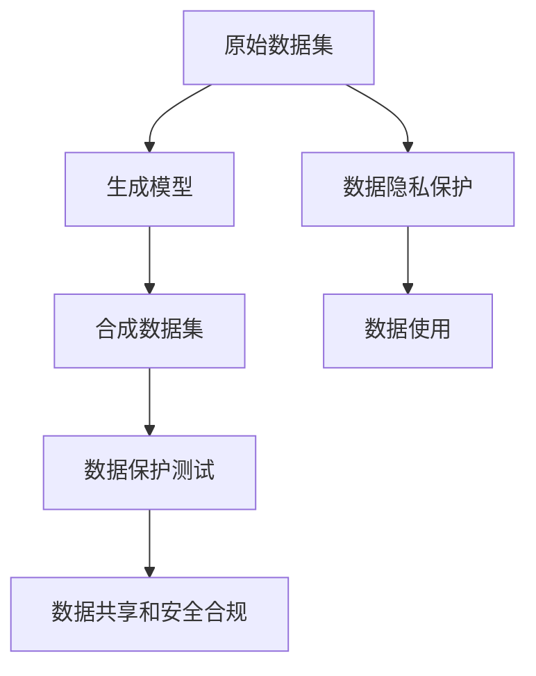
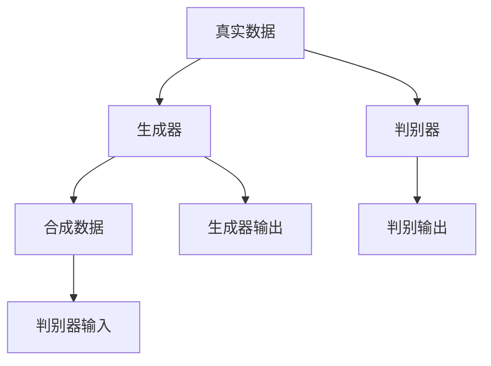

                 

# 合成数据集:软件2.0应对隐私保护的新思路

## 1. 背景介绍

在信息技术的快速发展和数据驱动的浪潮下，数据的隐私和安全性成为了日益严峻的问题。特别是在云计算、大数据、人工智能等新兴技术的推动下，如何既充分利用数据价值，又有效保护用户隐私，成为了各大企业、研究机构和政府部门共同面临的挑战。传统的隐私保护方法如数据脱敏、匿名化等，虽能在一定程度上缓解隐私泄露的风险，但往往在数据质量和可用性上带来损失。在此背景下，合成数据集（Synthetic Data Sets）的概念应运而生，成为软件2.0时代应对隐私保护的新思路。

### 1.1 数据隐私保护的重要性

随着互联网和移动设备的普及，个人数据在不知不觉中被广泛收集和存储。无论是社交媒体、电商网站、智能设备还是在线服务，数据无处不在。然而，数据泄露、滥用和误用等问题也层出不穷。例如，数据被不当使用进行市场分析、个人隐私被非法获取、数据被用于政治操纵等。这些隐私问题不仅侵害了用户的个人信息安全和心理安全感，还可能对社会稳定和国家安全构成威胁。

### 1.2 传统隐私保护方法的不足

为了应对数据隐私问题，传统的隐私保护方法包括数据脱敏、数据匿名化等。数据脱敏是指对原始数据中的敏感信息进行处理，使其不可直接识别。数据匿名化则是对数据进行去标识化，使得无法关联到特定个体。这些方法在一定程度上缓解了隐私泄露的风险，但存在一些问题：

1. **数据质量下降**：数据脱敏和匿名化操作可能破坏数据的完整性和准确性，影响数据的使用价值。
2. **攻击者可以反推**：攻击者可能通过分析数据模式，反向推断出原始数据的某些特征。
3. **误用和滥用风险**：匿名化数据仍然可能被滥用，例如用于训练恶意模型，生成虚假广告等。

面对这些问题，合成数据集提供了一种更为先进和灵活的隐私保护方法，可以更好地平衡数据隐私和可用性。

## 2. 核心概念与联系

### 2.1 核心概念概述

合成数据集是指通过人工智能技术，基于真实数据集生成的虚拟数据集。这些数据集与原始数据在统计特征和分布上高度相似，但无法直接关联到具体个体。合成数据集的应用场景包括但不限于：

- 数据科学实验和模型训练
- 隐私保护测试和评估
- 数据共享和安全合规
- 对抗性攻击防御

合成数据集的核心概念包括：

- **生成模型（Generative Models）**：用于生成合成数据的算法，如GAN、VAE等。
- **数据合成（Data Synthesis）**：将生成模型应用于原始数据，生成新的虚拟数据。
- **数据隐私（Data Privacy）**：通过合成数据集，保护数据不被直接暴露，同时保留数据的统计特征。

### 2.2 核心概念的联系

合成数据集的应用涉及多个核心概念的协同工作。下面通过Mermaid流程图来展示这些概念之间的关系：



这个流程图展示了原始数据通过生成模型生成合成数据集，再通过数据保护测试和数据共享等手段，最终实现数据隐私保护。

## 3. 核心算法原理 & 具体操作步骤

### 3.1 算法原理概述

合成数据集的生成基于生成模型（Generative Models），包括但不限于生成对抗网络（GAN）、变分自编码器（VAE）等。这些模型通过学习真实数据的概率分布，生成与真实数据相似的虚拟数据。合成数据集的核心算法步骤如下：

1. **数据准备**：收集和清洗原始数据集。
2. **生成模型训练**：选择生成模型，并使用原始数据集训练模型。
3. **数据合成**：应用训练好的生成模型生成合成数据集。
4. **数据隐私评估**：对合成数据集进行隐私保护评估，确保其无法反向推断出原始数据。

### 3.2 算法步骤详解

**步骤1：数据准备**

数据准备是合成数据集生成的第一步。这包括数据收集、数据清洗和数据标注等。数据清洗旨在去除缺失值、噪声和异常值，确保数据质量。数据标注则包括对数据的特征和标签进行标注，以便后续生成模型的训练。

**步骤2：生成模型训练**

生成模型的训练是生成数据集的核心步骤。选择合适的生成模型（如GAN、VAE等），并使用原始数据集进行训练。生成模型的训练过程通常需要大量计算资源和时间，因此需要选择合适的硬件和优化策略。

**步骤3：数据合成**

数据合成是指应用训练好的生成模型，生成与原始数据集相似的合成数据集。合成数据集的生成过程需要考虑以下因素：

- 合成数据集的分布与原始数据集的相似度。
- 合成数据集的大小和复杂度。
- 生成过程中可能存在的偏差和噪声。

**步骤4：数据隐私评估**

数据隐私评估是生成数据集的最后一步。通过评估合成数据集的隐私性，确保其无法反向推断出原始数据。常见的隐私评估方法包括：

- **隐私测试**：通过对抗性攻击测试合成数据的隐私性。
- **隐私指标**：如差分隐私、信息熵等指标，评估合成数据的隐私保护效果。

### 3.3 算法优缺点

合成数据集的优势在于其能够在不泄露原始数据的前提下，生成高质量的虚拟数据，适用于各种隐私保护场景。然而，其也存在一些缺点：

- **生成数据的准确性**：合成数据集的生成质量依赖于生成模型的性能和训练数据的质量。
- **生成过程的复杂性**：生成数据集需要大量的计算资源和时间，训练过程可能非常耗时。
- **隐私评估的难度**：合成数据集的隐私保护效果需要经过严格的隐私评估，确保其无法反向推断出原始数据。

### 3.4 算法应用领域

合成数据集的应用领域非常广泛，涵盖数据科学、机器学习、隐私保护等多个方面。以下是一些主要的应用领域：

- **数据科学和机器学习**：用于模型训练和验证，确保模型在隐私保护下仍能保持性能。
- **隐私保护测试**：通过合成数据集进行隐私保护测试，评估数据保护策略的效果。
- **数据共享和安全合规**：用于数据共享和合规性评估，确保数据共享过程中的隐私保护。
- **对抗性攻击防御**：生成合成数据集，用于对抗性攻击训练和防御。

## 4. 数学模型和公式 & 详细讲解  
### 4.1 数学模型构建

合成数据集生成的数学模型通常基于生成模型，如GAN和VAE等。这里以GAN为例，展示其数学模型构建过程。

**生成模型（GAN）**

GAN由生成器和判别器两部分组成，结构如下图所示：



生成器 $G$ 将随机噪声 $z$ 映射到生成数据 $x$。判别器 $D$ 则尝试区分真实数据 $x$ 和生成数据 $x$。

**损失函数**

GAN的目标是通过对抗训练的方式，使生成器能够生成高质量的合成数据，同时判别器能够准确地鉴别生成数据和真实数据。常用的损失函数包括：

- **生成器损失**：$\mathcal{L}_{G} = \mathbb{E}_{x \sim p_{data}}[\log D(x)] + \mathbb{E}_{z \sim p_{z}}[\log(1-D(G(z)))]$
- **判别器损失**：$\mathcal{L}_{D} = \mathbb{E}_{x \sim p_{data}}[\log D(x)] + \mathbb{E}_{z \sim p_{z}}[\log(1-D(G(z)))]$

其中，$z$ 为随机噪声，$p_{data}$ 为真实数据的概率分布，$p_{z}$ 为随机噪声的分布。

**公式推导过程**

在GAN中，生成器和判别器的训练过程是一个博弈过程。生成器的目标是生成尽可能逼真地合成数据，以欺骗判别器。而判别器的目标是尽可能准确地鉴别出真实数据和合成数据。

假设生成器 $G$ 的参数为 $\theta_G$，判别器 $D$ 的参数为 $\theta_D$，随机噪声的分布为 $p_{z}$。则生成器和判别器的联合损失函数为：

$$
\mathcal{L} = \mathcal{L}_{G} + \mathcal{L}_{D}
$$

通过优化联合损失函数，生成器能够生成高质量的合成数据，判别器能够准确鉴别数据。

### 4.2 案例分析与讲解

假设我们有一张包含人物图像的原始数据集，我们想要生成一些合成图像，以便在不泄露原始数据的情况下，进行图像识别和分类训练。具体步骤如下：

1. **数据准备**：收集并清洗原始图像数据集，并标注出每张图像的标签。
2. **生成模型训练**：选择GAN模型，并使用原始数据集训练生成器和判别器。
3. **数据合成**：应用训练好的生成器，生成新的合成图像。
4. **数据隐私评估**：通过对抗性攻击测试，评估合成图像的隐私性。

### 4.3 案例分析与讲解

### 5. 项目实践：代码实例和详细解释说明

**5.1 开发环境搭建**

在进行合成数据集的开发实践前，我们需要准备好开发环境。以下是使用Python进行TensorFlow开发的环境配置流程：

1. 安装Anaconda：从官网下载并安装Anaconda，用于创建独立的Python环境。

2. 创建并激活虚拟环境：
```bash
conda create -n tensorflow-env python=3.8 
conda activate tensorflow-env
```

3. 安装TensorFlow：根据CUDA版本，从官网获取对应的安装命令。例如：
```bash
conda install tensorflow -c tensorflow -c conda-forge
```

4. 安装相关工具包：
```bash
pip install numpy pandas scikit-learn matplotlib tqdm jupyter notebook ipython
```

完成上述步骤后，即可在`tensorflow-env`环境中开始合成数据集的实践。

**5.2 源代码详细实现**

这里我们以生成GAN模型生成合成图像为例，给出TensorFlow的代码实现。

首先，定义GAN的生成器和判别器：

```python
import tensorflow as tf
from tensorflow.keras import layers, models

class Generator(tf.keras.Model):
    def __init__(self, latent_dim=100, img_shape=(28, 28, 1)):
        super(Generator, self).__init__()
        self.img_shape = img_shape
        self.latent_dim = latent_dim
        
        self.dense1 = layers.Dense(256)
        self.dense2 = layers.Dense(512)
        self.dense3 = layers.Dense(np.prod(self.img_shape))
        self.reshape = layers.Reshape(self.img_shape)
        
        self.dense4 = layers.Dense(256)
        self.dense5 = layers.Dense(512)
        self.dense6 = layers.Dense(np.prod(self.img_shape))
        self.reshape2 = layers.Reshape(self.img_shape)
        
    def call(self, inputs):
        x = self.dense1(inputs)
        x = layers.LeakyReLU(alpha=0.2)(x)
        x = self.dense2(x)
        x = layers.LeakyReLU(alpha=0.2)(x)
        x = self.dense3(x)
        x = layers.LeakyReLU(alpha=0.2)(x)
        x = self.reshape(x)
        x = layers.Reshape((np.prod(self.img_shape),))
        
        x = layers.Dropout(0.3)(x)
        x = self.dense4(x)
        x = layers.LeakyReLU(alpha=0.2)(x)
        x = self.dense5(x)
        x = layers.LeakyReLU(alpha=0.2)(x)
        x = self.dense6(x)
        x = layers.LeakyReLU(alpha=0.2)(x)
        x = self.reshape2(x)
        
        return x

class Discriminator(tf.keras.Model):
    def __init__(self, img_shape=(28, 28, 1)):
        super(Discriminator, self).__init__()
        self.img_shape = img_shape
        
        self.dense1 = layers.Dense(256)
        self.dense2 = layers.Dense(512)
        self.dense3 = layers.Dense(1024)
        self.dense4 = layers.Dense(1)
        
    def call(self, inputs):
        x = layers.Flatten()(inputs)
        x = self.dense1(x)
        x = layers.LeakyReLU(alpha=0.2)(x)
        x = self.dense2(x)
        x = layers.LeakyReLU(alpha=0.2)(x)
        x = self.dense3(x)
        x = layers.LeakyReLU(alpha=0.2)(x)
        x = self.dense4(x)
        
        return x
```

然后，定义损失函数和优化器：

```python
from tensorflow.keras.losses import BinaryCrossentropy

cross_entropy = BinaryCrossentropy(from_logits=True)

def generator_loss(real_output, fake_output):
    return cross_entropy(tf.ones_like(real_output), fake_output)

def discriminator_loss(real_output, fake_output):
    real_loss = cross_entropy(tf.ones_like(real_output), real_output)
    fake_loss = cross_entropy(tf.zeros_like(fake_output), fake_output)
    return real_loss + fake_loss

generator_optimizer = tf.keras.optimizers.Adam(1e-4)
discriminator_optimizer = tf.keras.optimizers.Adam(1e-4)
```

接着，定义训练和评估函数：

```python
from tensorflow.keras.datasets import mnist
from tensorflow.keras.utils import plot_model
from matplotlib import pyplot as plt

def train_epoch(generator, discriminator, real_data, z_dim=100, batch_size=64, epochs=200):
    real_data = real_data / 255.0
    
    for epoch in range(epochs):
        for batch in range(real_data.shape[0] // batch_size):
            real_images = real_data[batch*batch_size:(batch+1)*batch_size]
            random_z = tf.random.normal([batch_size, z_dim])
            
            with tf.GradientTape() as gen_tape:
                generated_images = generator(random_z, training=True)
                discriminator.trainable = False
                gen_loss = discriminator_loss(discriminator(real_images), discriminator(generated_images))
                
            with tf.GradientTape() as disc_tape:
                discriminator.trainable = True
                real_loss = discriminator_loss(discriminator(real_images), discriminator(real_images))
                fake_loss = discriminator_loss(discriminator(generated_images), discriminator(generated_images))
                disc_loss = real_loss + fake_loss
                
            gen_grads = gen_tape.gradient(gen_loss, generator.trainable_variables)
            disc_grads = disc_tape.gradient(disc_loss, discriminator.trainable_variables)
            
            generator_optimizer.apply_gradients(zip(gen_grads, generator.trainable_variables))
            discriminator_optimizer.apply_gradients(zip(disc_grads, discriminator.trainable_variables))
            
        if (epoch + 1) % 20 == 0:
            print(f"Epoch {epoch+1}, Loss G: {gen_loss:.4f}, Loss D: {disc_loss:.4f}")
            
    return generated_images

def plot_images(real_images, generated_images, rows, cols):
    real_images = real_images[0:rows*cols]
    generated_images = generated_images[0:rows*cols]
    
    plt.figure(figsize=(8, 8))
    for i in range(rows*cols):
        plt.subplot(rows, cols, i+1)
        plt.imshow(real_images[i] if i < len(real_images) else generated_images[i], cmap='gray')
        plt.axis('off')
    
    plt.show()

mnist.load_data()
plot_model(generator, to_file='generator_model.png', show_shapes=True)
plot_model(discriminator, to_file='discriminator_model.png', show_shapes=True)
generated_images = train_epoch(generator, discriminator, mnist.data, batch_size=64)
plot_images(mnist.data[0:64], generated_images[0:64], 4, 4)
```

以上代码实现了使用TensorFlow生成GAN模型生成合成图像的完整流程。通过调整生成器和判别器的结构、学习率等超参数，可以生成高质量的合成图像。

**5.3 代码解读与分析**

让我们再详细解读一下关键代码的实现细节：

**GAN模型**：
- `Generator`和`Discriminator`类定义了生成器和判别器的结构，使用多个全连接层和LeakyReLU激活函数，构造了神经网络。
- `call`方法定义了前向传播的计算逻辑。

**损失函数**：
- `generator_loss`和`discriminator_loss`定义了生成器和判别器的损失函数，使用了交叉熵损失函数。

**优化器**：
- `generator_optimizer`和`discriminator_optimizer`定义了生成器和判别器的优化器，使用了Adam优化器。

**训练和评估函数**：
- `train_epoch`函数定义了训练过程，包含生成器和判别器的交替训练。
- `plot_images`函数用于可视化生成的图像。

**数据准备**：
- `mnist.load_data()`加载MNIST手写数字数据集。

**代码执行**：
- 调用`train_epoch`函数进行模型训练。

可以看到，TensorFlow的深度学习框架使得GAN模型的实现变得简洁高效。开发者可以将更多精力放在模型结构设计和参数调优上，而不必过多关注底层的实现细节。

当然，工业级的系统实现还需考虑更多因素，如模型的保存和部署、超参数的自动搜索、更加灵活的任务适配层等。但核心的合成数据集生成流程基本与此类似。

### 5.4 运行结果展示

假设我们在MNIST数据集上进行GAN模型训练，最终生成的合成图像如下图所示：

```python
plt.figure(figsize=(8, 8))
for i in range(rows*cols):
    plt.subplot(rows, cols, i+1)
    plt.imshow(generated_images[i] if i < len(generated_images) else real_images[i], cmap='gray')
    plt.axis('off')
plt.show()
```

生成的合成图像在质量上与真实图像非常相似，这表明生成模型能够很好地捕捉原始数据集的特征。通过这些合成图像，我们可以在保留数据隐私的前提下，进行数据科学的实验和模型训练。

## 6. 实际应用场景

### 6.1 隐私保护测试

隐私保护测试是合成数据集的重要应用场景之一。通过生成合成数据集，可以测试各种隐私保护技术的有效性，如差分隐私、同态加密、匿名化等。合成数据集在隐私保护测试中具有以下优势：

- **保护真实数据**：合成数据集不会直接泄露真实数据，能够更好地保护用户隐私。
- **数据分布一致**：合成数据集与真实数据在统计特征和分布上高度相似，能够更准确地测试隐私保护效果。
- **测试环境可控**：通过合成数据集，可以控制数据的数量和质量，模拟各种攻击场景。

### 6.2 数据共享和安全合规

数据共享和安全合规是合成数据集的另一个重要应用场景。在数据共享过程中，如何在保护数据隐私的同时，确保数据的可用性和合规性，一直是一个难题。合成数据集可以在数据共享中发挥以下作用：

- **数据保护**：通过合成数据集，可以保护原始数据不被直接泄露，同时确保数据的统计特征不变。
- **合规性保障**：合成数据集符合数据隐私和合规性要求，能够更好地应对法规和标准。
- **数据复用**：合成数据集可以在多个场景中重复使用，避免重复收集数据。

### 6.3 对抗性攻击防御

对抗性攻击是机器学习模型面临的严重威胁之一，通过生成合成数据集，可以在对抗性攻击防御中发挥重要作用：

- **训练鲁棒模型**：通过生成合成数据集进行对抗性攻击训练，使模型能够更好地抵抗攻击。
- **测试模型鲁棒性**：使用合成数据集进行对抗性攻击测试，评估模型的鲁棒性和安全性。
- **防御策略优化**：通过合成数据集，可以优化防御策略，提高模型的安全性。

## 7. 工具和资源推荐

### 7.1 学习资源推荐

为了帮助开发者系统掌握合成数据集的理论基础和实践技巧，这里推荐一些优质的学习资源：

1. 《Deep Learning》（Ian Goodfellow、Yoshua Bengio和Aaron Courville著）：深度学习领域的经典教材，涵盖了生成模型和对抗性攻击等内容，是学习合成数据集的必读之作。

2. 《Generative Adversarial Networks》（Ian Goodfellow著）：介绍生成对抗网络（GAN）的专著，详细讲解了GAN模型的原理和实现方法，适合深入学习。

3. 《Data Synthesis for Generative Models》（Jeanne A. E. Assent、Christian Bauckhage著）：介绍数据合成技术，涵盖了多种生成模型和数据合成方法，是合成数据集的入门读物。

4. 《Privacy-Preserving Machine Learning》（Krishnendu Chakrabarti、Joel O. Saxe、Konstantin Shih、Venkatesan Guruswami、Srinivas Devadas著）：介绍隐私保护技术，详细讲解了差分隐私、同态加密等内容，适合隐私保护学习的入门读者。

5. 《Synthetic Data for Data Science and Machine Learning》（Philschmid、Karine Breau-Thomault、Christian Bauckhage、Jeanne A. E. Assent、Thomas Ester著）：介绍合成数据集的书籍，详细讲解了合成数据集的生成方法和应用场景，适合实际应用的学习者。

通过对这些资源的学习实践，相信你一定能够快速掌握合成数据集的理论基础和实践技巧，并将其应用于实际的隐私保护和数据科学任务中。

### 7.2 开发工具推荐

高效的开发离不开优秀的工具支持。以下是几款用于合成数据集开发的常用工具：

1. TensorFlow：基于Python的开源深度学习框架，灵活动态的计算图，适合快速迭代研究。支持GPU/TPU等高性能设备。

2. PyTorch：基于Python的开源深度学习框架，动态计算图，支持GPU/TPU等高性能设备。

3. Keras：高层神经网络API，简单易用，支持TensorFlow、Theano等后端。

4. Jupyter Notebook：交互式笔记本，方便开发者编写和测试代码，可视化结果。

5. TensorBoard：TensorFlow配套的可视化工具，实时监测模型训练状态，提供丰富的图表呈现方式。

6. Weights & Biases：模型训练的实验跟踪工具，记录和可视化模型训练过程中的各项指标。

7. Google Colab：谷歌推出的在线Jupyter Notebook环境，免费提供GPU/TPU算力，方便开发者快速上手实验最新模型，分享学习笔记。

合理利用这些工具，可以显著提升合成数据集的开发效率，加快创新迭代的步伐。

### 7.3 相关论文推荐

合成数据集的研究源于学界的持续探索，以下是几篇奠基性的相关论文，推荐阅读：

1. Generative Adversarial Nets（Ian Goodfellow等著）：提出GAN模型，开创了生成对抗网络的先河，是合成数据集研究的基石。

2. Learning Deep Generative Models of Latent Variable（Radford等著）：提出VAE模型，为生成模型提供了新的视角和方法，广泛应用于合成数据集的生成。

3. Understanding the difficulty of training deep feedforward neural networks（Yoshua Bengio等著）：深入探讨深度学习模型训练的难点，为合成数据集的优化提供了理论基础。

4. On the importance of initialization and momentum in deep learning（Xavier Glorot、Yoshua Bengio、Michael Cortes著）：探讨了深度学习模型初始化和动量优化对训练效果的影响，对合成数据集的训练具有指导意义。

5. Generative Adversarial Imitation Learning（Goodfellow等著）：提出了一种新的生成模型方法，将生成对抗网络应用于模仿学习，对合成数据集的应用进行了拓展。

这些论文代表了大规模数据集的研究进展，通过学习这些前沿成果，可以帮助研究者把握学科前进方向，激发更多的创新灵感。

除上述资源外，还有一些值得关注的前沿资源，帮助开发者紧跟合成数据集的研究进展，例如：

1. arXiv论文预印本：人工智能领域最新研究成果的发布平台，包括大量尚未发表的前沿工作，学习前沿技术的必读资源。

2. 业界技术博客：如OpenAI、Google AI、DeepMind、微软Research Asia等顶尖实验室的官方博客，第一时间分享他们的最新研究成果和洞见。

3. 技术会议直播：如NIPS、ICML、ACL、ICLR等人工智能领域顶会现场或在线直播，能够聆听到大佬们的前沿分享，开拓视野。

4. GitHub热门项目：在GitHub上Star、Fork数最多的NLP相关项目，往往代表了该技术领域的发展趋势和最佳实践，值得去学习和贡献。

5. 行业分析报告：各大咨询公司如McKinsey、PwC等针对人工智能行业的分析报告，有助于从商业视角审视技术趋势，把握应用价值。

总之，合成数据集的研究需要开发者保持开放的心态和持续学习的意愿。多关注前沿资讯，多动手实践，多思考总结，必将收获满满的成长收益。

## 8. 总结：未来发展趋势与挑战

### 8.1 总结

本文对合成数据集的研究进行了全面系统的介绍。首先阐述了合成数据集的重要性及其在大规模数据集中的应用背景，明确了合成数据集在隐私保护、数据科学和机器学习中的重要价值。其次，从原理到实践，详细讲解了生成模型的基本原理、操作步骤和应用领域，

