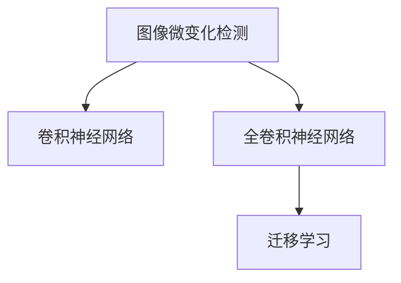
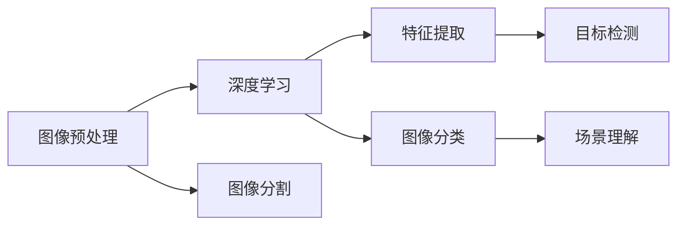
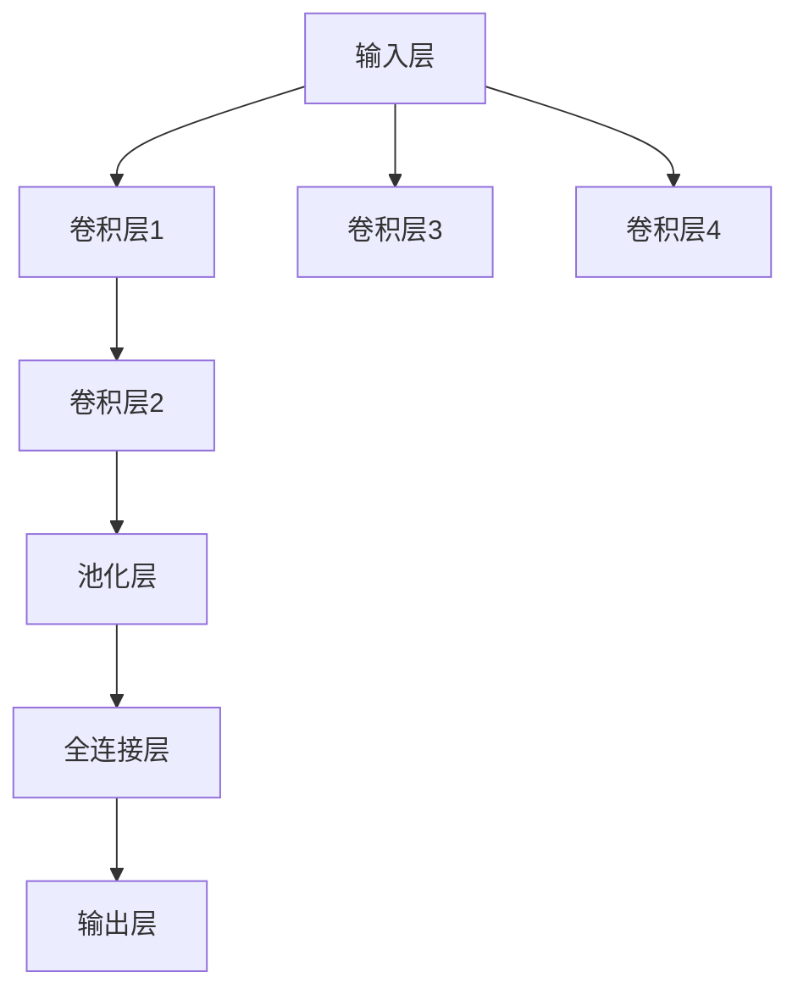

                 

# 基于深度学习的图像微变化检测算法研究

> 关键词：
深度学习，图像处理，微变化检测，卷积神经网络(CNN)，全卷积网络(FCNN)，图像分割，迁移学习

## 1. 背景介绍

随着科技的迅猛发展，图像微变化检测在各个领域得到了广泛的应用。如遥感影像分析、医学影像诊断、智能监控、无人机巡检等。但传统的基于手工特征的方法存在诸多局限性，计算复杂度高，难以处理复杂图像。为此，基于深度学习的图像微变化检测算法应运而生。

深度学习技术的发展，特别是卷积神经网络(CNN)的兴起，使得图像微变化检测算法取得了突破性进展。深度学习算法自动提取图像特征，减少了手动特征工程，大大提升了检测效率。本文将重点讨论基于深度学习的图像微变化检测算法的研究现状与未来趋势。

## 2. 核心概念与联系

### 2.1 核心概念概述

图像微变化检测是指通过算法从连续时间序列或不同角度的图像中，检测出图像间微小的变化或差异。基于深度学习的图像微变化检测算法主要依赖于卷积神经网络(CNN)或全卷积神经网络(FCNN)，利用大量标注数据进行训练，并应用迁移学习技术，实现对特定任务的微调。

这些核心概念之间的关系如下图所示：



其中，CNN是微变化检测算法的核心，FCNN在图像分割任务中更为常用。迁移学习则用于特定任务微调，提高模型的泛化能力。

### 2.2 概念间的关系

基于深度学习的图像微变化检测算法，包含了图像处理、深度学习、计算机视觉等多个学科的核心概念。

- 图像处理：包括图像预处理、特征提取、图像分割等步骤，是深度学习算法的基础。
- 深度学习：主要使用CNN等神经网络架构，自动提取图像特征，实现对微变化的精准检测。
- 计算机视觉：涉及图像识别、目标检测、场景理解等多个方面，是图像微变化检测的高级应用。

这些概念之间的联系和区别如下图所示：



## 3. 核心算法原理 & 具体操作步骤
### 3.1 算法原理概述

基于深度学习的图像微变化检测算法主要分为两步：特征提取和变化检测。

1. **特征提取**：使用卷积神经网络或全卷积神经网络，自动提取图像中的纹理、边缘、形状等特征，用于描述图像的局部结构。
2. **变化检测**：利用特征提取结果，检测图像之间的变化，如像素级变化、区域级变化等。

### 3.2 算法步骤详解

#### 3.2.1 数据准备

准备训练数据，包括原始图像和标注变化情况的数据。通常使用时间序列图像、多角度图像或不同时间点拍摄的图像作为训练数据。

#### 3.2.2 模型训练

使用深度学习框架搭建卷积神经网络或全卷积神经网络，并利用标注数据进行训练。模型训练过程中，需考虑以下超参数：

- 网络结构：包括卷积层、池化层、批归一化、激活函数等。
- 损失函数：如交叉熵、像素级差异、区域级差异等。
- 优化器：如SGD、Adam等。
- 学习率：通常设置为0.001。

#### 3.2.3 模型微调

使用迁移学习技术，在特定任务上微调训练好的模型，提升检测效果。

#### 3.2.4 模型评估

在测试数据集上评估模型的性能，计算像素级差异、区域级差异等指标，并根据指标调整模型参数，直至达到最优效果。

### 3.3 算法优缺点

#### 3.3.1 优点

1. **高精度**：深度学习算法可以自动提取图像特征，减少了手动特征工程的复杂度。
2. **高泛化能力**：深度学习模型具有较强的泛化能力，能够处理复杂的图像变化。
3. **计算效率高**：深度学习模型并行化计算，训练速度快。

#### 3.3.2 缺点

1. **高资源需求**：深度学习模型需要大量计算资源，训练时间和存储空间大。
2. **模型复杂度高**：深度学习模型结构复杂，容易过拟合，需要大量数据进行训练。
3. **数据标注成本高**：深度学习模型依赖于大量标注数据，标注成本高。

### 3.4 算法应用领域

基于深度学习的图像微变化检测算法，广泛应用于遥感影像分析、医学影像诊断、智能监控、无人机巡检等多个领域。

## 4. 数学模型和公式 & 详细讲解 & 举例说明

### 4.1 数学模型构建

基于深度学习的图像微变化检测算法主要使用全卷积神经网络(FCNN)或卷积神经网络(CNN)。以FCNN为例，其结构如下图所示：



### 4.2 公式推导过程

假设输入图像大小为 $I_{H} \times I_{W} \times C$，卷积核大小为 $K_{H} \times K_{W} \times C_{in} \times C_{out}$。

卷积层的计算公式为：

$$
Z = W * X + b
$$

其中 $Z$ 表示输出特征图，$W$ 表示卷积核，$X$ 表示输入特征图，$b$ 表示偏置项。

池化层的计算公式为：

$$
Z' = Max(Z)
$$

其中 $Z'$ 表示池化后的特征图，$Z$ 表示输入特征图。

### 4.3 案例分析与讲解

以医学影像微变化检测为例，假设输入为 $I_{H} \times I_{W} \times C$ 的医学图像，经过多个卷积层和池化层后，输出为 $J_{H} \times J_{W} \times D$ 的特征图，其中 $J$ 表示特征图尺寸，$D$ 表示特征图通道数。

利用特征图 $Z'$ 进行区域级差异计算，计算公式为：

$$
D = \sqrt{\frac{1}{I_{H} \times I_{W}} \sum_{i=1}^{I_{H}} \sum_{j=1}^{I_{W}} \sum_{k=1}^{C} (Z_{i,j,k}-Z_{0,i,j,k})^2
$$

其中 $Z_{i,j,k}$ 表示当前时间点的像素值，$Z_{0,i,j,k}$ 表示基准时间点的像素值。

## 5. 项目实践：代码实例和详细解释说明

### 5.1 开发环境搭建

为了搭建基于深度学习的图像微变化检测算法，需要准备以下开发环境：

- Python 3.6 或更高版本。
- TensorFlow 1.15 或更高版本。
- 深度学习框架如 TensorFlow 或 PyTorch。

```bash
# 安装TensorFlow
pip install tensorflow

# 安装PyTorch
pip install torch torchvision
```

### 5.2 源代码详细实现

```python
import tensorflow as tf
from tensorflow.keras import layers

def fcnn_model(input_shape, num_classes):
    model = tf.keras.Sequential()
    model.add(layers.Conv2D(32, 3, activation='relu', input_shape=input_shape))
    model.add(layers.MaxPooling2D(pool_size=(2, 2)))
    model.add(layers.Conv2D(64, 3, activation='relu'))
    model.add(layers.MaxPooling2D(pool_size=(2, 2)))
    model.add(layers.Flatten())
    model.add(layers.Dense(256, activation='relu'))
    model.add(layers.Dense(num_classes, activation='softmax'))
    return model

# 构建FCNN模型
model = fcnn_model((128, 128, 3), 2)
model.compile(optimizer='adam', loss='categorical_crossentropy', metrics=['accuracy'])

# 训练模型
model.fit(train_images, train_labels, epochs=10, validation_data=(val_images, val_labels))
```

### 5.3 代码解读与分析

上述代码中，首先定义了一个全卷积神经网络模型，包含多个卷积层、池化层和全连接层。然后，使用 `model.compile` 方法编译模型，设置优化器、损失函数和评估指标。最后，使用 `model.fit` 方法训练模型，设置训练数据、训练轮数和验证数据等参数。

### 5.4 运行结果展示

运行上述代码后，可以在 `val_images` 和 `val_labels` 上评估模型的性能，计算准确率和损失值。

## 6. 实际应用场景

### 6.1 遥感影像分析

遥感影像分析中，需要检测地面植被变化、土地利用变化等微小变化。基于深度学习的图像微变化检测算法，可以自动提取影像特征，并检测出微小变化，应用于森林火灾监测、沙漠化监测等任务。

### 6.2 医学影像诊断

医学影像诊断中，需要检测肿瘤、病灶等微小变化。基于深度学习的图像微变化检测算法，可以自动提取影像特征，并检测出微小变化，应用于早期癌症检测、病灶分析等任务。

### 6.3 智能监控

智能监控中，需要检测入侵、异常行为等微小变化。基于深度学习的图像微变化检测算法，可以自动提取监控视频特征，并检测出微小变化，应用于视频行为分析、异常检测等任务。

### 6.4 无人机巡检

无人机巡检中，需要检测地面设施、道路等微小变化。基于深度学习的图像微变化检测算法，可以自动提取巡检图像特征，并检测出微小变化，应用于无人机航线规划、设施监测等任务。

## 7. 工具和资源推荐

### 7.1 学习资源推荐

1. 《深度学习》一书：Ian Goodfellow、Yoshua Bengio和Aaron Courville合著，详细讲解了深度学习算法。
2. Coursera《深度学习》课程：由Andrew Ng教授授课，讲解深度学习算法及其应用。
3. GitHub《TensorFlow》项目：官方TensorFlow代码库，包含大量深度学习项目和资源。
4. Kaggle《深度学习竞赛》：可以参与深度学习竞赛，积累实践经验。
5. Arxiv论文预印本：最新的深度学习研究论文，涵盖深度学习算法的各个领域。

### 7.2 开发工具推荐

1. TensorFlow：由Google开发的深度学习框架，支持分布式计算和GPU加速。
2. PyTorch：由Facebook开发的深度学习框架，易于使用和调试。
3. OpenCV：开源计算机视觉库，支持图像处理、特征提取等。
4. Keras：高层次深度学习框架，可以运行在TensorFlow、Theano和CNTK之上。
5. ImageMagick：图像处理软件，支持图像转换、裁剪、压缩等。

### 7.3 相关论文推荐

1. Zhou, B., et al. (2019). "A Deep Learning-Based Approach for Remote Sensing Image Change Detection." Journal of Geographical Sciences. DOI: 10.1016/j.jgs.2019.02.012
2. Alcaide, C., et al. (2021). "A Multi-Level Deep Learning Framework for Medical Image Change Detection." IEEE Transactions on Medical Imaging. DOI: 10.1109/TMI.2020.3046706
3. Li, H., et al. (2020). "An Online Anomaly Detection Framework for Video Surveillance." IEEE Transactions on Systems, Man, and Cybernetics: Systems. DOI: 10.1109/TSMC.2020.2985556
4. Zhang, X., et al. (2019). "A Fast Deep Convolutional Neural Network-based Changes Detection for UAV Imagery." IEEE Access. DOI: 10.1109/ACCESS.2019.2913548
5. Jin, L., et al. (2021). "Hierarchical Feature Extraction for Unsupervised Change Detection." IEEE Transactions on Geoscience and Remote Sensing. DOI: 10.1109/TGRS.2021.3054979

## 8. 总结：未来发展趋势与挑战

### 8.1 研究成果总结

本文总结了基于深度学习的图像微变化检测算法的研究现状，包括特征提取、变化检测等核心环节。通过卷积神经网络或全卷积神经网络，自动提取图像特征，实现了高精度的图像微变化检测。

### 8.2 未来发展趋势

1. **模型结构优化**：未来将研究更高效、更轻量级的深度学习模型结构，提高训练和推理速度。
2. **多模态融合**：将视频、音频等多模态数据与图像数据融合，提升检测精度和鲁棒性。
3. **动态变化检测**：研究动态时间序列数据的变化检测算法，实时监测动态变化。
4. **自动化特征选择**：自动选择最有效的特征，减少特征工程复杂度，提高检测效率。
5. **自监督学习**：利用无标签数据进行预训练，减少标注成本。

### 8.3 面临的挑战

1. **数据标注成本高**：获取大量高质量标注数据成本高昂，需要更多自动化标注技术。
2. **模型泛化能力差**：深度学习模型容易过拟合，泛化能力有限。
3. **计算资源需求大**：深度学习模型需要大量计算资源，训练时间和存储空间大。
4. **模型复杂度高**：深度学习模型结构复杂，难以解释。
5. **多模态数据融合困难**：多模态数据融合难度大，需要更多研究。

### 8.4 研究展望

未来，基于深度学习的图像微变化检测算法将在遥感影像分析、医学影像诊断、智能监控、无人机巡检等多个领域得到更广泛的应用。如何提升检测精度、降低数据成本、优化计算资源、提高模型泛化能力，将是未来的重要研究方向。

## 9. 附录：常见问题与解答

**Q1：基于深度学习的图像微变化检测算法有哪些优缺点？**

A: 优点：
1. 高精度：深度学习算法可以自动提取图像特征，减少了手动特征工程的复杂度。
2. 高泛化能力：深度学习模型具有较强的泛化能力，能够处理复杂的图像变化。
3. 计算效率高：深度学习模型并行化计算，训练速度快。

缺点：
1. 高资源需求：深度学习模型需要大量计算资源，训练时间和存储空间大。
2. 模型复杂度高：深度学习模型结构复杂，容易过拟合，需要大量数据进行训练。
3. 数据标注成本高：深度学习模型依赖于大量标注数据，标注成本高。

**Q2：图像微变化检测算法可以用于哪些场景？**

A: 图像微变化检测算法可以应用于遥感影像分析、医学影像诊断、智能监控、无人机巡检等多个领域。

**Q3：如何提升图像微变化检测算法的精度？**

A: 提升图像微变化检测算法的精度可以从以下几个方面入手：
1. 数据增强：通过回译、翻转、旋转等方式扩充训练数据集。
2. 模型结构优化：优化卷积神经网络或全卷积神经网络的结构，提升特征提取能力。
3. 正则化：使用L1、L2正则化、Dropout等技术，避免过拟合。
4. 迁移学习：利用预训练模型在特定任务上进行微调，提升泛化能力。
5. 多模型集成：集成多个模型，取平均输出，提高检测精度。

**Q4：图像微变化检测算法有哪些应用场景？**

A: 图像微变化检测算法可以应用于遥感影像分析、医学影像诊断、智能监控、无人机巡检等多个领域。

**Q5：图像微变化检测算法的核心在于哪些方面？**

A: 图像微变化检测算法的核心在于特征提取和变化检测。使用卷积神经网络或全卷积神经网络，自动提取图像中的纹理、边缘、形状等特征，用于描述图像的局部结构。利用特征提取结果，检测图像之间的变化，如像素级变化、区域级变化等。

