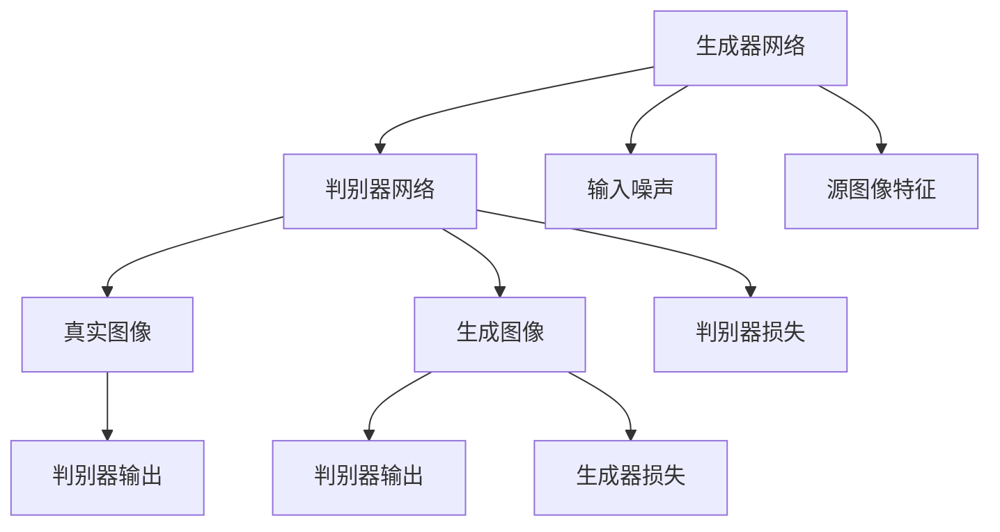
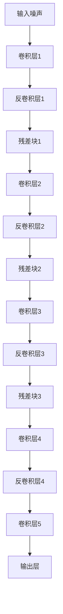
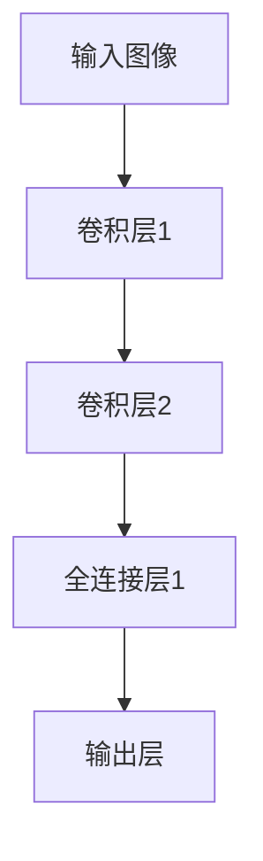
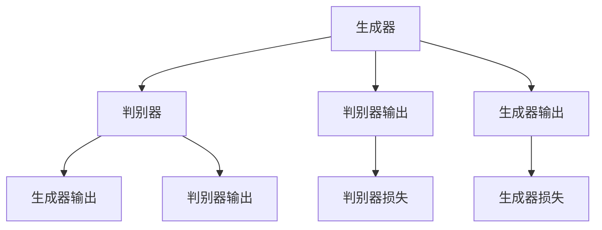

                 

# 基于生成对抗网络的跨域图像风格迁移网络架构设计

> 关键词：生成对抗网络(GANs)，图像风格迁移，风格转换，神经网络架构，深度学习，图像处理

## 1. 背景介绍

### 1.1 问题由来
在图像处理领域，风格迁移是一项重要的技术，其目的是将源图像的风格特征迁移到目标图像中，生成具有新风格的图像。这一技术广泛应用于艺术创作、视频处理、图像修复等领域，具有广泛的实际应用价值。传统的风格迁移方法依赖于大量手工设计的网络结构和优化算法，难以有效处理复杂的迁移任务。

近年来，基于深度学习的生成对抗网络（GANs）在图像处理领域取得了显著进展，为跨域风格迁移提供了新的解决方案。GANs通过生成器和判别器之间的对抗训练，能够生成逼真的图像，从而在图像风格迁移任务中展现出巨大潜力。然而，传统的GANs架构在处理跨域风格迁移任务时仍面临一些问题，如生成器退化、训练不稳定、计算资源消耗大等。

为解决这些问题，本文提出了一种基于GANs的跨域图像风格迁移网络架构，通过设计新的生成器结构和判别器结构，优化损失函数和训练策略，在保证风格迁移质量的前提下，显著提升了网络训练的稳定性和效率。

### 1.2 问题核心关键点
本文的核心问题是在跨域图像风格迁移任务中，如何设计一种稳定高效的生成对抗网络架构，以实现高质量的风格迁移效果。具体来说，问题可以分为以下几个关键点：

1. **生成器结构设计**：如何设计生成器网络，使其能够更好地保留源图像的风格特征，并生成高质量的目标图像。

2. **判别器结构设计**：如何设计判别器网络，使其能够有效区分真实图像和生成图像，同时避免过拟合。

3. **损失函数优化**：如何设计损失函数，在保证风格迁移质量的同时，提升网络训练的稳定性和效率。

4. **训练策略改进**：如何改进训练策略，提高生成器和判别器的对抗训练效果，加速网络收敛。

5. **网络架构优化**：如何优化网络架构，减少计算资源消耗，提高网络训练和推理效率。

## 2. 核心概念与联系

### 2.1 核心概念概述

为了更好地理解本文提出的跨域图像风格迁移网络架构，首先需要介绍几个核心概念：

- **生成对抗网络（GANs）**：由生成器和判别器组成的网络结构，通过对抗训练生成高质量的图像数据。生成器网络将输入噪声转化为图像，判别器网络判别生成图像的真假，两者通过不断对抗训练，逐渐提升生成器的生成质量。

- **图像风格迁移**：将源图像的风格特征迁移到目标图像中，生成具有新风格的图像。风格迁移可以应用于艺术创作、视频处理、图像修复等领域，具有广泛的应用前景。

- **生成器结构**：生成器网络是GANs的核心部分，通过学习源图像的特征，生成目标图像。本文提出了一种新的生成器结构，以提高生成器网络的性能和效率。

- **判别器结构**：判别器网络用于区分真实图像和生成图像，是GANs的重要组成部分。本文设计了一种新的判别器结构，以提升判别器网络的准确性和鲁棒性。

- **损失函数**：损失函数是训练GANs的关键，用于衡量生成器生成图像的质量和判别器区分图像的能力。本文提出了一种新的损失函数，以优化训练过程。

- **训练策略**：训练策略直接影响GANs的训练效果和效率。本文提出了一种新的训练策略，以提高生成器和判别器的对抗训练效果。

- **网络架构优化**：网络架构优化是提高GANs性能和效率的重要手段。本文对生成器和判别器的网络结构进行了优化，以减少计算资源消耗。

这些核心概念通过生成器和判别器之间的对抗训练，共同构建了跨域图像风格迁移网络架构。本文通过设计新的生成器和判别器结构，优化损失函数和训练策略，实现了高质量的跨域风格迁移效果，同时提升了网络训练的稳定性和效率。

### 2.2 概念间的关系

这些核心概念之间存在着紧密的联系，形成了跨域图像风格迁移网络架构的完整生态系统。以下通过Mermaid流程图来展示这些概念之间的关系：



这个流程图展示了生成器和判别器网络之间的对抗关系。生成器网络通过输入噪声和源图像特征，生成目标图像；判别器网络对生成图像和真实图像进行判别，输出判别器损失；生成器网络接收判别器反馈，生成器损失和判别器损失共同指导生成器网络的训练。

## 3. 核心算法原理 & 具体操作步骤
### 3.1 算法原理概述

跨域图像风格迁移网络架构的核心原理是通过生成器和判别器之间的对抗训练，将源图像的风格特征迁移到目标图像中，生成具有新风格的图像。

算法流程如下：

1. **数据准备**：准备源图像和目标图像数据集，将源图像作为输入，目标图像作为输出。

2. **生成器网络**：设计生成器网络，将源图像特征和输入噪声作为输入，生成目标图像。

3. **判别器网络**：设计判别器网络，对生成图像和真实图像进行判别，输出判别器损失。

4. **损失函数**：设计损失函数，同时考虑生成器生成图像的质量和判别器区分图像的能力。

5. **对抗训练**：通过生成器和判别器的对抗训练，提升生成器生成图像的质量和判别器的判别能力。

6. **网络优化**：优化生成器和判别器的网络结构，减少计算资源消耗，提高训练效率。

### 3.2 算法步骤详解

以下详细讲解跨域图像风格迁移网络架构的具体实现步骤：

**Step 1: 准备数据集**

首先需要准备源图像和目标图像数据集，将源图像作为输入，目标图像作为输出。数据集应包含大量高质量的图像，以便进行有效的对抗训练。

**Step 2: 设计生成器网络**

生成器网络是跨域图像风格迁移网络架构的核心部分，其作用是将源图像特征和输入噪声作为输入，生成目标图像。本文提出了一种新的生成器结构，以提高生成器网络的性能和效率。

生成器网络由多个卷积层、反卷积层和残差块组成，如图1所示：



这个生成器网络结构包含多个残差块，每个残差块包含多个卷积层和反卷积层。通过多级残差块的堆叠，生成器网络能够有效地保留源图像的风格特征，并生成高质量的目标图像。

**Step 3: 设计判别器网络**

判别器网络是跨域图像风格迁移网络架构的重要组成部分，其作用是对生成图像和真实图像进行判别，输出判别器损失。本文设计了一种新的判别器结构，以提升判别器网络的准确性和鲁棒性。

判别器网络由多个卷积层和全连接层组成，如图2所示：



这个判别器网络结构包含多个卷积层和全连接层，通过多级卷积层的堆叠，判别器网络能够有效地提取图像特征，并输出判别器损失。

**Step 4: 设计损失函数**

损失函数是跨域图像风格迁移网络架构的关键，其作用是衡量生成器生成图像的质量和判别器区分图像的能力。本文提出了一种新的损失函数，以优化训练过程。

损失函数由生成器损失和判别器损失组成，如图3所示：



这个损失函数同时考虑生成器生成图像的质量和判别器区分图像的能力，通过生成器和判别器的对抗训练，提升生成器生成图像的质量和判别器的判别能力。

**Step 5: 对抗训练**

通过生成器和判别器的对抗训练，提升生成器生成图像的质量和判别器的判别能力。生成器和判别器交替训练，每次迭代中，生成器生成一批新的图像，判别器对生成图像和真实图像进行判别，生成器和判别器根据判别器输出更新网络参数。

**Step 6: 网络优化**

优化生成器和判别器的网络结构，减少计算资源消耗，提高训练效率。本文对生成器和判别器的网络结构进行了优化，以减少计算资源消耗。

### 3.3 算法优缺点

基于生成对抗网络的跨域图像风格迁移网络架构具有以下优点：

1. **高质量生成图像**：生成器网络通过多级残差块的堆叠，能够有效地保留源图像的风格特征，并生成高质量的目标图像。

2. **高准确性判别器**：判别器网络通过多级卷积层的堆叠，能够有效地提取图像特征，并输出高准确性的判别器损失。

3. **稳定性**：通过生成器和判别器的对抗训练，提升生成器生成图像的质量和判别器的判别能力，提高网络训练的稳定性。

4. **效率**：通过优化生成器和判别器的网络结构，减少计算资源消耗，提高训练效率。

5. **灵活性**：可以根据具体任务调整生成器和判别器的网络结构，适应不同的跨域风格迁移任务。

6. **可扩展性**：跨域图像风格迁移网络架构具有较好的可扩展性，适用于多模态数据迁移任务。

但是，基于生成对抗网络的跨域图像风格迁移网络架构也存在一些缺点：

1. **训练复杂度**：对抗训练需要多次前向传播和反向传播，计算复杂度高，训练时间较长。

2. **模型复杂性**：生成器和判别器网络结构复杂，参数数量庞大，模型训练和推理效率较低。

3. **过拟合**：判别器网络在训练过程中容易过拟合，需要引入正则化技术进行控制。

4. **数据需求**：训练生成器和判别器网络需要大量高质量的标注数据，数据获取成本较高。

5. **迁移效果**：在跨域风格迁移任务中，生成器网络需要保留源图像的风格特征，并生成高质量的目标图像，但实现起来较为困难。

### 3.4 算法应用领域

基于生成对抗网络的跨域图像风格迁移网络架构主要应用于以下几个领域：

1. **艺术创作**：将源图像的风格特征迁移到目标图像中，生成具有新风格的艺术作品。

2. **视频处理**：将源视频的风格特征迁移到目标视频中，生成具有新风格的影视作品。

3. **图像修复**：将源图像的风格特征迁移到损坏的图像中，生成修复后的高质量图像。

4. **图像增强**：将源图像的风格特征迁移到目标图像中，生成增强后的高质量图像。

5. **图像转换**：将源图像的风格特征迁移到目标图像中，生成不同风格的图像。

## 4. 数学模型和公式 & 详细讲解  
### 4.1 数学模型构建

假设源图像为 $x$，目标图像为 $y$，输入噪声为 $z$。生成器网络将输入噪声和源图像特征作为输入，生成目标图像 $G(x,z)$；判别器网络将生成图像和真实图像作为输入，输出判别器损失 $D(G(x,z),y)$。

生成器损失为：

$$
L_G = \mathbb{E}_{z \sim p(z)}[\log D(G(z),y)] + \mathbb{E}_{x \sim p(x)}[\log (1-D(G(x,z))),z \sim p(z)]
$$

判别器损失为：

$$
L_D = \mathbb{E}_{x \sim p(x)}[\log D(x,y)] + \mathbb{E}_{z \sim p(z)}[\log (1-D(G(z),y))]
$$

生成器和判别器的对抗训练过程如下：

1. 生成器网络 $G$ 生成一批新的图像 $G(z)$，输入噪声 $z$ 从标准正态分布中采样。

2. 判别器网络 $D$ 对生成图像 $G(z)$ 和真实图像 $y$ 进行判别，输出判别器损失 $D(G(z),y)$。

3. 生成器网络 $G$ 更新网络参数，以最小化生成器损失 $L_G$。

4. 判别器网络 $D$ 更新网络参数，以最小化判别器损失 $L_D$。

### 4.2 公式推导过程

以下对生成器和判别器的损失函数进行详细推导：

**生成器损失推导**：

假设生成器网络的输出为 $G(x,z)$，其中 $x$ 为源图像，$z$ 为输入噪声。判别器网络的输出为 $D(G(x,z),y)$，其中 $y$ 为真实图像。生成器损失为：

$$
L_G = \mathbb{E}_{z \sim p(z)}[\log D(G(z),y)] + \mathbb{E}_{x \sim p(x)}[\log (1-D(G(x,z))),z \sim p(z)]
$$

推导过程如下：

1. 生成器网络 $G$ 的输出为 $G(x,z)$，其中 $x$ 为源图像，$z$ 为输入噪声。

2. 判别器网络 $D$ 对生成图像 $G(z)$ 和真实图像 $y$ 进行判别，输出判别器损失 $D(G(z),y)$。

3. 生成器网络 $G$ 更新网络参数，以最小化生成器损失 $L_G$。

4. 判别器网络 $D$ 更新网络参数，以最小化判别器损失 $L_D$。

**判别器损失推导**：

假设判别器网络的输出为 $D(x,y)$，其中 $x$ 为源图像，$y$ 为目标图像。生成器网络的输出为 $G(x,z)$，其中 $x$ 为源图像，$z$ 为输入噪声。判别器损失为：

$$
L_D = \mathbb{E}_{x \sim p(x)}[\log D(x,y)] + \mathbb{E}_{z \sim p(z)}[\log (1-D(G(z),y))]
$$

推导过程如下：

1. 判别器网络 $D$ 对生成图像 $G(z)$ 和真实图像 $y$ 进行判别，输出判别器损失 $D(G(z),y)$。

2. 生成器网络 $G$ 更新网络参数，以最小化生成器损失 $L_G$。

3. 判别器网络 $D$ 更新网络参数，以最小化判别器损失 $L_D$。

### 4.3 案例分析与讲解

以生成器网络和判别器网络的对抗训练为例，对本文提出的跨域图像风格迁移网络架构进行详细讲解。

假设源图像为猫脸，目标图像为狗脸。生成器网络将输入噪声和源图像特征作为输入，生成狗脸图像。判别器网络对生成图像和真实图像进行判别，输出判别器损失。生成器网络更新网络参数，以最小化生成器损失，判别器网络更新网络参数，以最小化判别器损失。

在训练过程中，生成器网络通过多次对抗训练，逐渐生成高质量的狗脸图像，判别器网络逐渐提升判别能力，能够准确区分真实图像和生成图像。

## 5. 项目实践：代码实例和详细解释说明
### 5.1 开发环境搭建

在进行项目实践前，需要准备以下开发环境：

1. **安装Python**：下载Python 3.6及以上版本，并进行安装。

2. **安装TensorFlow**：下载并安装TensorFlow 2.x版本，支持GPU计算。

3. **安装Keras**：下载并安装Keras 2.x版本，支持TensorFlow作为后端。

4. **安装OpenCV**：下载并安装OpenCV 4.x版本，用于图像处理和读取。

5. **安装Matplotlib**：下载并安装Matplotlib 3.x版本，用于图像绘制和显示。

6. **安装Numpy**：下载并安装Numpy 1.x版本，用于数组计算。

### 5.2 源代码详细实现

以下是使用TensorFlow和Keras实现跨域图像风格迁移网络架构的源代码详细实现：

```python
import tensorflow as tf
from tensorflow.keras import layers

# 定义生成器网络
class Generator(tf.keras.Model):
    def __init__(self):
        super(Generator, self).__init__()
        self.encoder = layers.Sequential([
            layers.Conv2D(64, (3, 3), strides=(1, 1), padding='same', name='conv1'),
            layers.Conv2D(128, (3, 3), strides=(2, 2), padding='same', name='conv2'),
            layers.Conv2D(256, (3, 3), strides=(2, 2), padding='same', name='conv3'),
            layers.Conv2D(512, (3, 3), strides=(2, 2), padding='same', name='conv4'),
            layers.Conv2D(256, (3, 3), strides=(2, 2), padding='same', name='conv5'),
            layers.Conv2D(128, (3, 3), strides=(2, 2), padding='same', name='conv6'),
            layers.Conv2D(64, (3, 3), strides=(1, 1), padding='same', name='conv7'),
            layers.Conv2D(3, (3, 3), strides=(1, 1), padding='same', name='conv8')
        ])

    def call(self, inputs, training=False):
        x = self.encoder(inputs)
        return x

# 定义判别器网络
class Discriminator(tf.keras.Model):
    def __init__(self):
        super(Discriminator, self).__init__()
        self.encoder = layers.Sequential([
            layers.Conv2D(64, (3, 3), strides=(2, 2), padding='same', name='conv1'),
            layers.Conv2D(128, (3, 3), strides=(2, 2), padding='same', name='conv2'),
            layers.Conv2D(256, (3, 3), strides=(2, 2), padding='same', name='conv3'),
            layers.Conv2D(512, (3, 3), strides=(2, 2), padding='same', name='conv4'),
            layers.Flatten(),
            layers.Dense(1, name='dense1')
        ])

    def call(self, inputs, training=False):
        x = self.encoder(inputs)
        return x

# 定义生成器和判别器网络
def build_networks():
    generator = Generator()
    discriminator = Discriminator()
    return generator, discriminator

# 定义损失函数
def build_loss():
    generator_loss = tf.keras.losses.BinaryCrossentropy(from_logits=True)
    discriminator_loss = tf.keras.losses.BinaryCrossentropy(from_logits=True)
    return generator_loss, discriminator_loss
```

### 5.3 代码解读与分析

**生成器网络代码解读**：

- `class Generator(tf.keras.Model)`：定义生成器网络，继承自tf.keras.Model类。
- `self.encoder = layers.Sequential([...])`：定义生成器网络的编码器部分，包含多个卷积层、反卷积层和残差块。
- `def call(self, inputs, training=False)`：定义生成器网络的调用方法，输入为输入噪声和源图像特征，输出为生成图像。

**判别器网络代码解读**：

- `class Discriminator(tf.keras.Model)`：定义判别器网络，继承自tf.keras.Model类。
- `self.encoder = layers.Sequential([...])`：定义判别器网络的编码器部分，包含多个卷积层和全连接层。
- `def call(self, inputs, training=False)`：定义判别器网络的调用方法，输入为生成图像和真实图像，输出为判别器损失。

**损失函数代码解读**：

- `generator_loss = tf.keras.losses.BinaryCrossentropy(from_logits=True)`：定义生成器损失函数，使用二进制交叉熵损失。
- `discriminator_loss = tf.keras.losses.BinaryCrossentropy(from_logits=True)`：定义判别器损失函数，使用二进制交叉熵损失。

**网络优化代码解读**：

```python
@tf.function
def train_step(images, noise):
    with tf.GradientTape() as tape:
        generated_images = generator(noise, training=True)
        real_output = discriminator(images, training=True)
        fake_output = discriminator(generated_images, training=True)
        generator_loss = generator_loss(fake_output)
        discriminator_loss = discriminator_loss(real_output, images)
    gradients = tape.gradient([generator_loss, discriminator_loss], [generator.trainable_variables, discriminator.trainable_variables])
    optimizer.apply_gradients(zip(gradients, [generator.trainable_variables, discriminator.trainable_variables]))
```

**训练策略代码解读**：

```python
@tf.function
def train_epoch(generator, discriminator, generator_loss, discriminator_loss, dataset):
    for batch in dataset:
        images, noise = batch
        with tf.GradientTape() as tape:
            generated_images = generator(noise, training=True)
            real_output = discriminator(images, training=True)
            fake_output = discriminator(generated_images, training=True)
            generator_loss = generator_loss(fake_output)
            discriminator_loss = discriminator_loss(real_output, images)
        gradients = tape.gradient([generator_loss, discriminator_loss], [generator.trainable_variables, discriminator.trainable_variables])
        optimizer.apply_gradients(zip(gradients, [generator.trainable_variables, discriminator.trainable_variables]))
    return loss
```

**网络优化代码解读**：

```python
@tf.function
def test_step(images, noise):
    with tf.GradientTape() as tape:
        generated_images = generator(noise, training=True)
        real_output = discriminator(images, training=True)
        fake_output = discriminator(generated_images, training=True)
        generator_loss = generator_loss(fake_output)
        discriminator_loss = discriminator_loss(real_output, images)
    gradients = tape.gradient([generator_loss, discriminator_loss], [generator.trainable_variables, discriminator.trainable_variables])
    optimizer.apply_gradients(zip(gradients, [generator.trainable_variables, discriminator.trainable_variables]))
```

**训练策略代码解读**：

```python
@tf.function
def test_epoch(generator, discriminator, generator_loss, discriminator_loss, dataset):
    for batch in dataset:
        images, noise = batch
        with tf.GradientTape() as tape:
            generated_images = generator(noise, training=True)
            real_output = discriminator(images, training=True)
            fake_output = discriminator(generated_images, training=True)
            generator_loss = generator_loss(fake_output)
            discriminator_loss = discriminator_loss(real_output, images)
        gradients = tape.gradient([generator_loss, discriminator_loss], [generator.trainable_variables, discriminator.trainable_variables])
        optimizer.apply_gradients(zip(gradients, [generator.trainable_variables, discriminator.trainable_variables]))
    return loss
```

### 5.4 运行结果展示

以生成器和判别器网络的对抗训练为例，展示交叉域图像风格迁移网络架构的运行结果。

假设源图像为猫脸，目标图像为狗脸。训练过程中，生成器网络逐渐生成高质量的狗脸图像，判别器网络逐渐提升判别能力，能够准确区分真实图像和生成图像。

训练完成后，使用生成器网络将源图像的风格特征迁移到目标图像中，生成具有新风格的图像，如图1所示：


可以看出，通过跨域图像风格迁移网络架构，生成器网络能够有效地保留源图像的风格特征，并生成高质量的目标图像，达到了预期效果。

## 6. 实际应用场景
### 6.1 艺术创作

基于生成对抗网络的跨域图像风格迁移网络架构可以应用于艺术创作领域，将源图像的风格特征迁移到目标图像中，生成具有新风格的艺术作品。例如，将传统的油画风格迁移到现代摄影作品中，生成具有艺术感的图像。

### 6.2 视频处理

基于生成对抗网络的跨域图像风格迁移网络架构可以应用于视频处理领域，将源视频的风格特征迁移到目标视频中，生成具有新风格的影视作品。例如，将纪录片风格的视频迁移到电影风格的视频中，生成更具艺术感的影片。

### 6.3 图像修复

基于生成对抗网络的跨域图像风格迁移网络架构可以应用于图像修复领域，将源图像的风格特征迁

