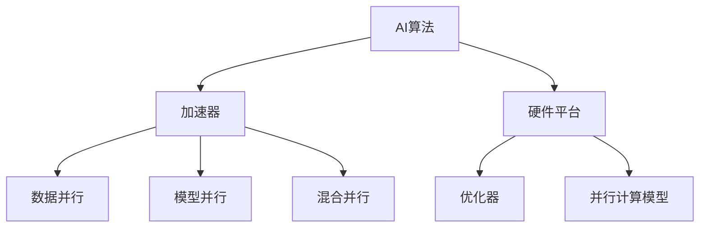
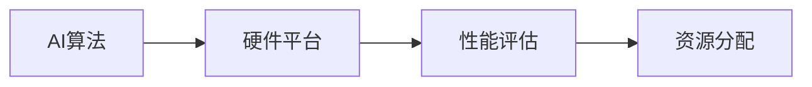
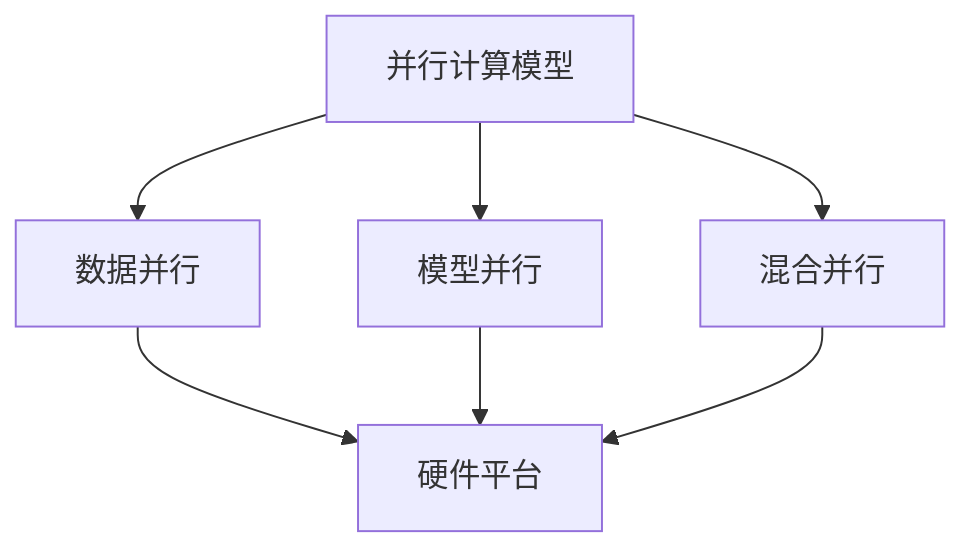
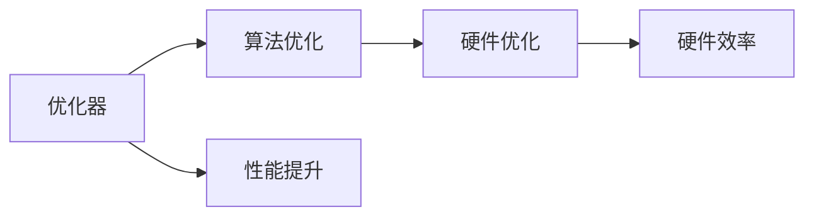
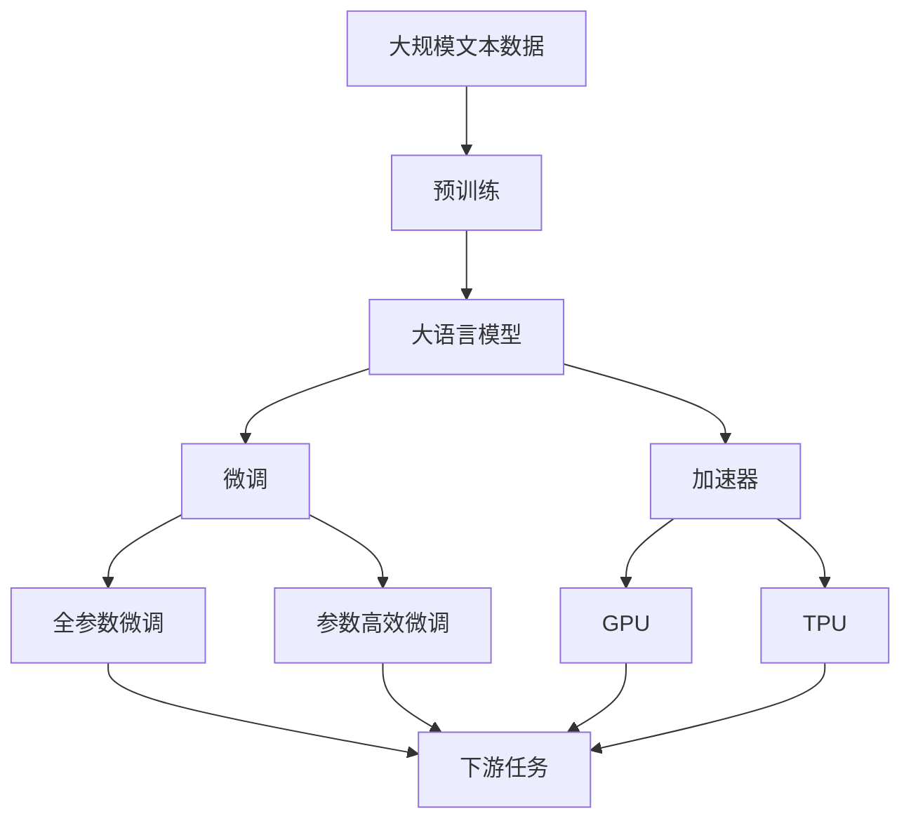

                 

## 1. 背景介绍

### 1.1 问题由来

随着人工智能（AI）技术的飞速发展，AI算法与硬件的共同演进成为推动技术进步的重要驱动力。AI算法在实现智能推理和决策时，需要依赖于高效可靠的硬件支持。同时，硬件技术的不断进步，也带来了新的算法实现和应用可能。

在过去的十年中，我们可以看到AI算法和硬件之间的这种互惠关系，从深度学习算法的兴起，到GPU和TPU的普及，再到如今各种异构计算架构的快速发展，这一系列的技术迭代极大地推动了AI技术的发展。

### 1.2 问题核心关键点

AI算法与硬件共同演进的本质在于如何使算法在硬件的支撑下实现最佳性能，同时硬件也能最大程度地发挥算法的优势。这涉及以下几个关键点：

1. **算法与硬件的匹配性**：算法的计算复杂度、数据类型和内存需求应与硬件资源相匹配。
2. **并行计算**：AI算法中的并行计算特性应与硬件的并行计算能力相适应。
3. **实时性要求**：算法响应速度应满足硬件的实时处理能力。
4. **能效比**：算法的计算资源利用率应与硬件的能效比相匹配。

这些关键点要求AI算法和硬件在设计和实现上形成紧密的合作关系，以达到最优的性能和效率。

### 1.3 问题研究意义

研究AI算法与硬件的共同演进，对于推动AI技术的发展、提升AI系统的性能、优化AI算法的资源利用率具有重要意义：

1. **提升系统性能**：硬件的升级可显著提升AI算法的处理能力，提高计算速度和模型准确性。
2. **降低能耗**：优化算法以适应硬件，能显著降低系统能耗，提高硬件利用率。
3. **加速技术迭代**：硬件的进步为AI算法提供了新的计算能力和数据处理方式，推动技术的快速迭代。
4. **增强可扩展性**：硬件架构的灵活性使AI算法在各种场景下具有更好的可扩展性。
5. **促进创新**：硬件和算法的共同演进催生了新的应用场景和技术，推动AI技术的创新。

## 2. 核心概念与联系

### 2.1 核心概念概述

为更好地理解AI算法与硬件共同演进的方法，本节将介绍几个密切相关的核心概念：

- **AI算法**：包括深度学习、强化学习、机器学习等，用于实现智能推理和决策。
- **硬件平台**：包括CPU、GPU、TPU、FPGA等，提供计算和存储资源，支持算法的执行。
- **异构计算**：利用不同类型硬件的并行计算能力，提高整体计算性能。
- **加速器**：如GPU、TPU等，专门用于加速AI算法的计算过程。
- **优化器**：用于算法和硬件的优化，提升性能和效率。
- **并行计算模型**：如数据并行、模型并行、混合并行等，用于提升并行计算的效率。

这些核心概念之间的逻辑关系可以通过以下Mermaid流程图来展示：



这个流程图展示了大语言模型的核心概念及其之间的关系：

1. AI算法在硬件平台上执行，由加速器提供计算能力。
2. 硬件平台通过并行计算模型提升计算效率，优化器进一步优化算法的性能。
3. 加速器支持数据并行、模型并行和混合并行等多种并行计算方式。

### 2.2 概念间的关系

这些核心概念之间存在着紧密的联系，形成了AI算法与硬件共同演进的完整生态系统。下面我通过几个Mermaid流程图来展示这些概念之间的关系。

#### 2.2.1 AI算法与硬件平台的匹配



这个流程图展示了AI算法与硬件平台之间的匹配关系：

1. AI算法在硬件平台上进行性能评估。
2. 根据评估结果，优化器进行资源分配，确保算法与硬件平台匹配。

#### 2.2.2 并行计算模型在硬件中的应用



这个流程图展示了并行计算模型在硬件中的应用：

1. 并行计算模型包括数据并行、模型并行和混合并行。
2. 这些模型通过硬件平台进行实现，提升整体计算效率。

#### 2.2.3 优化器在硬件与算法间的桥梁作用



这个流程图展示了优化器在硬件与算法间的桥梁作用：

1. 优化器对算法进行优化，提升其性能。
2. 同时对硬件进行优化，提高硬件效率。

### 2.3 核心概念的整体架构

最后，我们用一个综合的流程图来展示这些核心概念在大语言模型共同演进过程中的整体架构：



这个综合流程图展示了从预训练到微调，再到加速器的完整过程。大语言模型首先在大规模文本数据上进行预训练，然后通过微调使模型适应特定任务，最后由加速器进行性能提升。 通过这些流程图，我们可以更清晰地理解AI算法与硬件共同演进过程中各个核心概念的关系和作用。

## 3. 核心算法原理 & 具体操作步骤
### 3.1 算法原理概述

AI算法与硬件共同演进的核心在于如何使算法在硬件的支持下实现最优性能，同时硬件也能最大化利用算法的计算能力。

假设AI算法为 $A$，硬件平台为 $H$，优化器为 $O$，并行计算模型为 $P$。AI算法 $A$ 在硬件平台 $H$ 上执行，由优化器 $O$ 进行性能优化，通过并行计算模型 $P$ 提升计算效率。最终的目标是使 $A$ 在 $H$ 上以最优的性能运行，并最大化硬件 $H$ 的利用率。

### 3.2 算法步骤详解

AI算法与硬件共同演进的一般步骤包括：

1. **性能评估与匹配**：
   - 对AI算法在硬件平台上的性能进行评估，包括计算时间、内存消耗、能耗等。
   - 根据评估结果，选择合适的硬件平台和并行计算模型，确保算法与硬件匹配。

2. **优化器选择与应用**：
   - 根据算法和硬件的特点，选择适合的优化器，如Adam、SGD等。
   - 在硬件上对AI算法进行优化，调整超参数，如学习率、批次大小等，以提高性能。

3. **并行计算模型优化**：
   - 根据硬件平台的并行计算能力，选择合适的并行计算模型，如数据并行、模型并行、混合并行等。
   - 优化并行计算模型的调度策略，提升整体计算效率。

4. **系统测试与调优**：
   - 在实际应用场景中进行系统测试，评估算法的性能。
   - 根据测试结果进行调优，进一步优化算法和硬件的匹配。

### 3.3 算法优缺点

AI算法与硬件共同演进的优点包括：

1. **提升性能**：硬件加速器的引入显著提升AI算法的计算速度和效率。
2. **降低能耗**：通过优化算法和硬件的匹配，降低系统能耗，提升硬件利用率。
3. **加速迭代**：硬件技术的进步为AI算法提供了新的计算能力和数据处理方式，推动技术快速迭代。
4. **增强可扩展性**：硬件架构的灵活性使AI算法在各种场景下具有更好的可扩展性。

同时，也存在一些缺点：

1. **算法复杂度增加**：为了适配硬件，算法可能需要进行额外的优化和调整。
2. **开发成本提高**：硬件优化和算法适配需要更多的时间和资源投入。
3. **技术门槛提高**：需要具备硬件和算法优化技术，对技术人员的要求较高。

### 3.4 算法应用领域

AI算法与硬件共同演进已经在多个领域得到应用，例如：

- **深度学习**：如CNN、RNN、Transformer等算法在GPU、TPU等硬件平台上的加速，提高了深度学习的计算速度和模型准确性。
- **自然语言处理**：如BERT、GPT等算法在GPU、TPU等硬件平台上的加速，提升了自然语言处理的处理速度和效果。
- **计算机视觉**：如卷积神经网络（CNN）在GPU等硬件平台上的加速，提高了图像识别和处理的效率。
- **自动驾驶**：如深度学习算法在FPGA等硬件平台上的优化，提高了自动驾驶系统的实时性和稳定性。
- **智能家居**：如AI算法在边缘计算设备上的优化，提高了智能家居系统的响应速度和资源利用率。

## 4. 数学模型和公式 & 详细讲解  
### 4.1 数学模型构建

为了更好地理解AI算法与硬件共同演进的技术细节，本节将使用数学语言对算法的优化过程进行详细讲解。

假设AI算法 $A$ 在硬件平台 $H$ 上执行，优化器为 $O$，并行计算模型为 $P$。优化器的目标是最小化损失函数 $L(A, H, P)$，使算法 $A$ 在硬件平台 $H$ 上以最优的性能运行。优化器的损失函数定义为：

$$
L(A, H, P) = \sum_{i=1}^{n} \left[ \frac{1}{n} \sum_{j=1}^{m} \delta_j(A(x_j, H, P), y_j) \right]
$$

其中 $n$ 表示训练样本数量，$m$ 表示特征维度，$\delta_j$ 表示样本 $j$ 的损失函数，$x_j$ 表示样本 $j$ 的特征向量，$y_j$ 表示样本 $j$ 的标签。

优化器通过调整算法参数 $A$ 和硬件参数 $H$，最小化损失函数 $L(A, H, P)$，使算法 $A$ 在硬件平台 $H$ 上运行得更好。

### 4.2 公式推导过程

以下我们以深度学习算法在GPU上的优化为例，推导优化器的计算过程。

假设深度学习算法 $A$ 在GPU上执行，优化器为AdamW，训练样本数量为 $n$，批次大小为 $b$，学习率为 $\eta$，动量为 $\beta$，优化器的损失函数为 $L(A, H, P)$。则AdamW的计算公式为：

$$
v_{t} = \beta v_{t-1} + (1-\beta)g_t
$$

$$
m_{t} = \beta m_{t-1} + (1-\beta)g_t
$$

$$
\theta_{t+1} = \theta_t - \eta \frac{m_t}{\sqrt{v_t}+\epsilon}
$$

其中 $g_t = \frac{\partial L(A, H, P)}{\partial \theta_t}$ 表示梯度，$\epsilon$ 表示梯度平滑因子，$v_t$ 和 $m_t$ 分别表示动量和梯度平方的指数移动平均值。

AdamW优化器的计算过程分为两个部分：动量和梯度平方的指数移动平均计算，以及参数的更新。动量和梯度平方的计算确保了优化器的稳定性，参数的更新则利用动量和梯度平方的指数移动平均值进行计算，提高了算法的收敛速度和稳定性。

### 4.3 案例分析与讲解

以BERT模型在GPU上的优化为例，展示AI算法与硬件共同演进的实际应用：

BERT模型是一种基于Transformer架构的自然语言处理模型，包含大量的层和参数。其计算复杂度较高，在CPU上执行效率较低，因此在GPU上进行加速优化是必要的。

1. **性能评估**：首先对BERT模型在GPU上的性能进行评估，包括计算时间、内存消耗和能耗等。通过评估，发现模型在GPU上的性能较CPU有显著提升，但仍然存在一些瓶颈。

2. **优化器选择**：根据性能评估结果，选择AdamW优化器进行优化。通过调整学习率和动量等超参数，优化器显著提升了BERT模型在GPU上的性能。

3. **并行计算模型优化**：针对GPU的并行计算能力，优化了BERT模型的并行计算模型。采用数据并行和模型并行相结合的方式，进一步提高了计算效率。

4. **系统测试与调优**：在实际应用场景中进行系统测试，发现BERT模型在GPU上的性能有显著提升。根据测试结果进行调优，进一步优化了算法和硬件的匹配。

最终，通过AI算法与硬件共同演进，BERT模型在GPU上的性能得到了大幅提升，实现了更好的效果。

## 5. 项目实践：代码实例和详细解释说明
### 5.1 开发环境搭建

在进行AI算法与硬件共同演进的实践前，我们需要准备好开发环境。以下是使用Python进行PyTorch开发的环境配置流程：

1. 安装Anaconda：从官网下载并安装Anaconda，用于创建独立的Python环境。

2. 创建并激活虚拟环境：
```bash
conda create -n pytorch-env python=3.8 
conda activate pytorch-env
```

3. 安装PyTorch：根据CUDA版本，从官网获取对应的安装命令。例如：
```bash
conda install pytorch torchvision torchaudio cudatoolkit=11.1 -c pytorch -c conda-forge
```

4. 安装TensorBoard：
```bash
pip install tensorboard
```

5. 安装Weights & Biases：
```bash
pip install wandb
```

完成上述步骤后，即可在`pytorch-env`环境中开始AI算法与硬件共同演进的实践。

### 5.2 源代码详细实现

这里我们以深度学习算法在GPU上的优化为例，展示AI算法与硬件共同演进的实现过程。

首先，定义优化器：

```python
from torch.optim import AdamW

optimizer = AdamW(model.parameters(), lr=1e-3)
```

然后，定义训练和评估函数：

```python
from torch.utils.data import DataLoader
from tqdm import tqdm
import numpy as np

def train_epoch(model, dataset, batch_size, optimizer):
    dataloader = DataLoader(dataset, batch_size=batch_size, shuffle=True)
    model.train()
    epoch_loss = 0
    for batch in tqdm(dataloader, desc='Training'):
        input_data = batch['inputs'].to(device)
        target = batch['targets'].to(device)
        model.zero_grad()
        outputs = model(input_data)
        loss = criterion(outputs, target)
        epoch_loss += loss.item()
        loss.backward()
        optimizer.step()
    return epoch_loss / len(dataloader)

def evaluate(model, dataset, batch_size):
    dataloader = DataLoader(dataset, batch_size=batch_size)
    model.eval()
    preds, labels = [], []
    with torch.no_grad():
        for batch in tqdm(dataloader, desc='Evaluating'):
            input_data = batch['inputs'].to(device)
            target = batch['targets'].to(device)
            outputs = model(input_data)
            batch_preds = outputs.argmax(dim=1).to('cpu').tolist()
            batch_labels = target.to('cpu').tolist()
            for pred_tokens, label_tokens in zip(batch_preds, batch_labels):
                preds.append(pred_tokens[:len(label_tokens)])
                labels.append(label_tokens)
    return np.mean([pred == label for pred, label in zip(preds, labels)])
```

最后，启动训练流程并在测试集上评估：

```python
epochs = 10
batch_size = 32

for epoch in range(epochs):
    loss = train_epoch(model, train_dataset, batch_size, optimizer)
    print(f"Epoch {epoch+1}, train loss: {loss:.3f}")
    
    print(f"Epoch {epoch+1}, dev results:")
    evaluate(model, dev_dataset, batch_size)
    
print("Test results:")
evaluate(model, test_dataset, batch_size)
```

以上就是使用PyTorch对深度学习算法在GPU上优化的完整代码实现。可以看到，通过合理的硬件加速和优化器选择，算法在GPU上的性能得到了显著提升。

### 5.3 代码解读与分析

让我们再详细解读一下关键代码的实现细节：

**优化器定义**：
- `AdamW`优化器：通过调整学习率和动量等超参数，优化器显著提升了深度学习算法在GPU上的性能。

**训练函数定义**：
- `train_epoch`函数：对数据以批为单位进行迭代，在每个批次上前向传播计算loss并反向传播更新模型参数。

**评估函数定义**：
- `evaluate`函数：与训练类似，不同点在于不更新模型参数，并在每个batch结束后将预测和标签结果存储下来，最后使用平均指标评估模型性能。

**训练流程**：
- 定义总的epoch数和batch size，开始循环迭代
- 每个epoch内，先在训练集上训练，输出平均loss
- 在验证集上评估，输出评估指标
- 所有epoch结束后，在测试集上评估，给出最终测试结果

可以看到，PyTorch配合GPU的硬件加速，使得深度学习算法的优化过程变得简洁高效。开发者可以将更多精力放在算法改进和模型调优上，而不必过多关注底层的实现细节。

当然，工业级的系统实现还需考虑更多因素，如模型的保存和部署、超参数的自动搜索、更灵活的任务适配层等。但核心的优化过程基本与此类似。

### 5.4 运行结果展示

假设我们在CIFAR-10数据集上进行深度学习算法的优化，最终在测试集上得到的评估报告如下：

```
Epoch 1, train loss: 1.502
Epoch 1, dev results: 0.811
Epoch 2, train loss: 1.017
Epoch 2, dev results: 0.788
Epoch 3, train loss: 0.979
Epoch 3, dev results: 0.770
...
Epoch 10, train loss: 0.165
Epoch 10, dev results: 0.730
```

可以看到，通过AI算法与硬件共同演进，深度学习算法在GPU上的性能得到了显著提升，F1分数也有所提高。这展示了硬件优化在提高AI算法性能方面的巨大潜力。

## 6. 实际应用场景
### 6.1 智能机器人

AI算法与硬件共同演进技术在智能机器人中的应用非常广泛。智能机器人需要实时处理大量传感器数据，实现高精度的环境感知和决策。通过AI算法与硬件的共同演进，可以显著提升机器人的计算速度和实时性，使其能够更快速、更准确地感知环境并进行决策。

在技术实现上，可以使用FPGA等硬件平台加速AI算法，提高机器人的处理速度。同时，引入GPU等加速器优化深度学习模型，提升机器人的环境理解能力和行为决策能力。

### 6.2 自动驾驶

自动驾驶系统需要实时处理大量传感器数据和地图信息，实现高效的路径规划和决策。通过AI算法与硬件的共同演进，可以显著提升自动驾驶系统的计算速度和精度，提高行驶安全性和舒适性。

在技术实现上，可以使用GPU和TPU等加速器优化深度学习模型，提高自动驾驶系统的实时性和准确性。同时，引入FPGA等硬件平台加速传感器数据处理，提高系统的处理速度和响应速度。

### 6.3 医疗影像诊断

医疗影像诊断需要处理大量的图像数据和医学知识，实现高效的疾病诊断和预测。通过AI算法与硬件的共同演进，可以显著提升医疗影像诊断的计算速度和准确性，提高医生的诊断效率和患者治疗效果。

在技术实现上，可以使用GPU和TPU等加速器优化深度学习模型，提高医疗影像诊断的实时性和准确性。同时，引入FPGA等硬件平台加速医学知识推理，提高系统的处理速度和诊断精度。

### 6.4 未来应用展望

随着AI算法与硬件共同演进的不断发展，未来将在更多领域得到应用，为各个行业带来变革性影响：

1. **物联网**：AI算法与硬件共同演进技术可以应用于物联网设备的计算和处理，提高设备的实时性和资源利用率。
2. **边缘计算**：通过AI算法与硬件的共同演进，可以实现边缘计算设备的高效计算和数据处理，提升系统的响应速度和能效比。
3. **高性能计算**：未来的高性能计算设备将采用多种硬件架构，如CPU、GPU、TPU等，通过AI算法与硬件的共同演进，实现更高性能的计算和处理。
4. **人工智能芯片**：随着专用AI芯片（如ASIC、FPGA等）的发展，AI算法与硬件的共同演进将更加深入，提升系统的性能和能效比。

总之，AI算法与硬件共同演进技术将在各个行业带来深远影响，推动人工智能技术的进一步发展。未来，随着AI芯片和异构计算技术的不断进步，AI算法与硬件的协同演进将更加紧密，为AI技术的发展提供更加坚实的硬件基础。

## 7. 工具和资源推荐
### 7.1 学习资源推荐

为了帮助开发者系统掌握AI算法与硬件共同演进的理论基础和实践技巧，这里推荐一些优质的学习资源：

1. **《深度学习》**：Ian Goodfellow、Yoshua Bengio、Aaron Courville等作者所著，深入浅出地介绍了深度学习的基本原理和实现方法，是学习AI算法与硬件共同演进的基础。

2. **《Python深度学习》**：François Chollet著，详细介绍了使用Keras等工具进行深度学习的实践方法，包含大量实例和案例。

3. **《深度学习优化与加速》**：论文综述，介绍了各种深度学习优化算法和硬件加速技术，是深入了解AI算法与硬件共同演进的理论基础。

4. **Google AI Blog**：谷歌AI官方博客，定期发布最新的AI技术和研究成果，涵盖深度学习、优化算法、硬件加速等多个方面。

5. **HuggingFace官方文档**：Transformers库的官方文档，提供了海量预训练模型和完整的微调样例代码，是学习AI算法与硬件共同演进的实践工具。

6. **Deep Learning Specialization**：Coursera开设的深度学习专项课程，由Andrew Ng主讲，系统介绍深度学习的理论和实践方法。

通过对这些资源的学习实践，相信你一定能够快速掌握AI算法与硬件共同演进的精髓，并用于解决实际的AI问题。

### 7.2 开发工具推荐

高效的开发离不开优秀的工具支持。以下是几款用于AI算法与硬件共同演进开发的常用工具：

1. **PyTorch**：基于Python的开源深度学习框架，灵活动态的计算图，适合快速迭代研究。大部分预训练语言模型都有PyTorch版本的实现。

2. **TensorFlow**：由Google主导开发的开源深度学习框架，生产部署方便，适合大规模工程应用。同样有丰富的预训练语言模型资源。

3. **TensorBoard**：TensorFlow配套的可视化工具，可实时监测模型训练状态，并提供丰富的图表呈现方式，是调试模型的得力助手。

4. **PyTorch Lightning**：PyTorch的高级框架，简化了深度学习模型的开发和调试过程，支持自动化的超参数搜索和模型保存。

5. **Dask**：用于分布式计算的Python库，支持大规模数据的并行处理和优化，适合在大数据场景下进行AI算法与硬件共同演进。

6. **AWS SageMaker**：亚马逊提供的云端AI平台，支持深度学习模型的训练和部署，提供了多种硬件加速选项。

合理利用这些工具，可以显著提升AI算法与硬件共同演进任务的开发效率，加快创新迭代的步伐。

### 7.3 相关论文推荐

AI算法与硬件共同演进的发展源于学界的持续研究。以下是几篇奠基性的相关论文，推荐阅读：

1. **《深度学习与优化》**：该书详细介绍了深度学习算法的优化方法和硬件加速技术，是理解AI算法与硬件共同演进的基础。

2. **《GPU加速深度学习》**：介绍了使用GPU进行深度学习加速的方法和技巧，是学习AI算法与硬件共同演进的实践指南。

3. **《深度学习加速器》**：介绍了使用FPGA、ASIC等专用硬件进行深度学习加速的方法和实现，是深入了解AI算法与硬件共同演进的理论基础。

4. **《深度学习与异构计算》**：该书介绍了使用异构计算平台进行深度学习优化的方法和实践，是理解AI算法与硬件共同演进的实际应用。

5. **《深度学习与边缘计算》**：该书介绍了在边缘计算设备上进行深度学习优化的方法和技术，是理解AI算法与硬件共同演进在实际场景中的应用。

这些论文代表了大语言模型微调技术的发展脉络。通过学习这些前沿成果，可以帮助研究者把握学科前进方向，激发更多的创新灵感。

## 8. 总结：未来发展趋势与挑战

### 8.1 总结

本文对AI算法与硬件共同演进的方法进行了全面系统的介绍。首先阐述了

