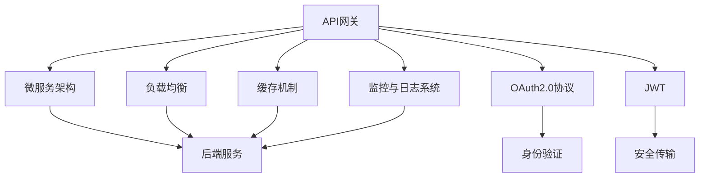
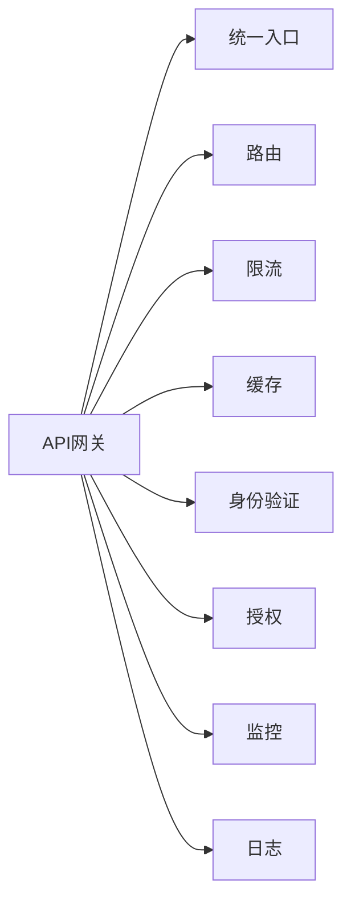
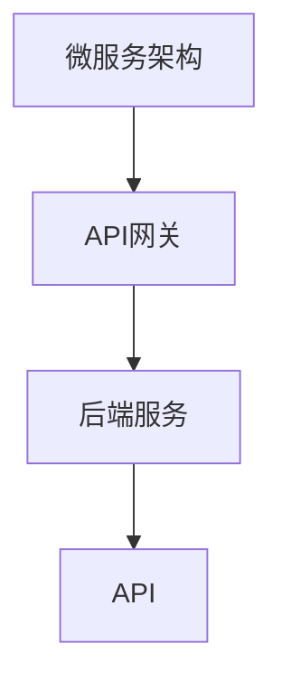

                 

# API 网关的详细使用

## 1. 背景介绍

### 1.1 问题由来
随着微服务架构的普及和服务的数量不断增加，企业越来越多地面临着管理大量API（应用程序接口）的挑战。这些API需要实现身份验证、限流、监控、路由等不同的功能，且每个API都需要维护相应的后端服务。传统上，这些功能是通过独立的组件或服务实现的，导致管理复杂、维护成本高、扩展困难。因此，一种统一管理和调用API的方式是迫切需要的。

API网关应运而生，作为一种API管理解决方案，提供了一个统一的入口点，简化管理API，实现API的聚合、路由、安全、监控、缓存等功能，从而大大降低了API管理的复杂度。

### 1.2 问题核心关键点
API网关的核心功能包括：
- 统一入口点：提供一个统一的API入口，简化调用和维护。
- 路由与负载均衡：根据请求将流量路由到相应的后端服务，实现负载均衡。
- 身份验证与授权：通过OAuth、JWT等机制，实现API的身份验证与授权。
- 限流与熔断：防止API被恶意调用或后端服务宕机，影响整体系统的稳定性。
- 缓存与请求重试：通过缓存减少后端服务的压力，实现请求的快速响应。
- 监控与日志：记录和监控API的调用情况，便于问题排查和性能优化。

这些功能不仅大大降低了API管理的复杂度，还提高了系统的整体可靠性和性能。

### 1.3 问题研究意义
研究API网关的使用，有助于企业实现更高效的API管理，提升系统的可维护性和可靠性。通过使用API网关，企业可以：
- 降低API管理的复杂度：将各个API的功能统一管理，减少维护成本。
- 提高API的可用性：通过限流、熔断等机制保障API的稳定性。
- 增强系统的安全性：通过身份验证与授权机制，保障API的安全性。
- 优化系统的性能：通过缓存和请求重试等机制，提升系统的响应速度和吞吐量。

## 2. 核心概念与联系

### 2.1 核心概念概述

为更好地理解API网关的工作原理，本节将介绍几个密切相关的核心概念：

- API网关（API Gateway）：作为一个API管理解决方案，提供统一的API入口点，实现路由、限流、缓存、身份验证、监控等功能。
- 微服务架构（Microservices Architecture）：将一个应用拆分为多个小的、独立的服务，每个服务具有独立的数据存储和业务逻辑。
- OAuth2.0协议：一种开放标准，用于安全授权。
- JWT（JSON Web Token）：一种轻量级的安全传输方式，用于在网络上传输信息。
- 负载均衡（Load Balancing）：通过将流量分散到多个后端服务，避免单点故障，提高系统的可扩展性。
- 缓存机制（Caching Mechanism）：通过缓存减轻后端服务压力，提升API的响应速度。
- 监控与日志系统（Monitoring & Logging System）：用于记录和监控API的调用情况，便于问题排查和性能优化。

这些核心概念之间的逻辑关系可以通过以下Mermaid流程图来展示：



这个流程图展示了大语言模型的核心概念及其之间的关系：

1. API网关作为API的统一入口，简化API的调用和维护。
2. 微服务架构下的各个小服务，通过API网关实现统一管理。
3. OAuth2.0协议和JWT用于API的身份验证和安全传输。
4. 负载均衡和缓存机制提高API的响应速度和可扩展性。
5. 监控与日志系统用于记录和优化API的调用情况。

这些概念共同构成了API网关的核心功能，使其能够在各种场景下发挥强大的API管理能力。通过理解这些核心概念，我们可以更好地把握API网关的工作原理和优化方向。

### 2.2 概念间的关系

这些核心概念之间存在着紧密的联系，形成了API网关完整的生态系统。下面我们通过几个Mermaid流程图来展示这些概念之间的关系。

#### 2.2.1 API网关的核心功能



这个流程图展示了API网关的核心功能，包括：

1. 统一入口：提供一个统一的API入口。
2. 路由：根据请求路由到相应的后端服务。
3. 限流：限制API的访问频率，防止后端服务宕机。
4. 缓存：减少后端服务的压力，提升API的响应速度。
5. 身份验证：通过OAuth、JWT等机制，保障API的安全性。
6. 授权：根据用户角色和权限，控制API的访问。
7. 监控：记录和监控API的调用情况，便于问题排查和性能优化。
8. 日志：记录API的调用日志，便于故障排查和性能分析。

#### 2.2.2 API网关与微服务架构的关系



这个流程图展示了API网关与微服务架构的关系：

1. 微服务架构下的各个小服务通过API网关实现统一管理。
2. API网关作为统一的API入口，将各个小服务聚合在一起。
3. 各个小服务通过API网关调用，简化调用和维护。

## 3. 核心算法原理 & 具体操作步骤
### 3.1 算法原理概述

API网关的核心算法原理主要围绕API管理展开，通过统一入口、路由、限流、缓存、身份验证、监控等功能，实现对API的全面管理。以下是对各个功能的算法原理概述：

- 统一入口：API网关通过定义路由规则，将请求路由到相应的后端服务。
- 路由：通过负载均衡算法，将请求路由到合适的后端服务。
- 限流：通过算法控制API的访问频率，防止后端服务宕机。
- 缓存：通过缓存算法，减少后端服务的压力，提升API的响应速度。
- 身份验证与授权：通过OAuth、JWT等机制，保障API的安全性。
- 监控与日志：通过记录和监控API的调用情况，便于问题排查和性能优化。

### 3.2 算法步骤详解

以下是对API网关各个功能的算法步骤详解：

#### 3.2.1 统一入口
API网关的统一入口主要通过路由规则实现。路由规则可以基于URL、方法、请求头等条件进行匹配，将请求路由到相应的后端服务。以下是一个简单的路由规则示例：

```python
# 定义路由规则
routes = {
    '/users': 'user_service',
    '/orders': 'order_service',
    '/products': 'product_service'
}

# 匹配路由规则
def route_request(request):
    url = request.path
    for path, service in routes.items():
        if url.startswith(path):
            return service
    return 'unknown_service'
```

#### 3.2.2 路由与负载均衡
路由与负载均衡是API网关的核心功能之一，通过算法将请求路由到合适的后端服务，实现负载均衡。常用的路由算法包括：

- 轮询（Round Robin）：根据请求到达的顺序，将请求依次路由到各个后端服务。
- 加权轮询（Weighted Round Robin）：根据后端服务的负载，动态调整路由权重，实现负载均衡。
- 最少连接数（Least Connections）：将请求路由到后端服务中连接数最少的服务。
- IP哈希（IP Hashing）：根据请求的客户端IP地址，将请求路由到固定的后端服务。

以下是使用加权轮询算法的示例：

```python
# 定义后端服务
services = {
    'user_service': {'hostname': 'user-server-1', 'weight': 1},
    'order_service': {'hostname': 'order-server-2', 'weight': 2},
    'product_service': {'hostname': 'product-server-3', 'weight': 1}
}

# 路由算法
def route_service(service_list, request):
    if len(service_list) == 0:
        return 'unknown_service'
    # 计算权重总和
    total_weight = sum(service['weight'] for service in service_list)
    # 计算随机值
    random_value = random.random() * total_weight
    cumulative_weight = 0
    for service in service_list:
        cumulative_weight += service['weight']
        if cumulative_weight >= random_value:
            return service['hostname']
```

#### 3.2.3 限流与熔断
限流与熔断是保障API稳定性的重要机制，通过算法控制API的访问频率，防止后端服务宕机。常用的限流算法包括：

- 固定速率（Fixed Rate）：根据预设的速率限制API的访问频率。
- 滑动窗口（Sliding Window）：基于滑动窗口的时间间隔，限制API的访问频率。
- 令牌桶（Token Bucket）：通过令牌桶算法控制API的访问频率。
- 熔断（Circuit Breaker）：在服务宕机时，限制API的访问，防止系统崩溃。

以下是使用令牌桶算法的示例：

```python
# 定义令牌桶
class TokenBucket:
    def __init__(self, capacity, rate):
        self.capacity = capacity
        self.tokens = capacity
        self.rate = rate
        self.time = time.time()

    def get_token(self):
        if self.tokens <= 0:
            return False
        self.tokens -= 1
        self.time = time.time()
        return True

# 限流算法
def limit_request(request, rate):
    bucket = TokenBucket(capacity=1000, rate=1)
    return bucket.get_token()
```

#### 3.2.4 缓存机制
缓存机制是提升API响应速度的重要手段，通过缓存算法减少后端服务的压力，实现快速响应。常用的缓存算法包括：

- 内存缓存（Memory Cache）：将数据缓存在内存中，提升访问速度。
- 分布式缓存（Distributed Cache）：使用分布式缓存系统，提高缓存的可靠性和可扩展性。
- CDN缓存（CDN Cache）：通过CDN缓存系统，实现静态资源的快速访问。
- 缓存淘汰算法（Cache Eviction Algorithm）：根据缓存策略，淘汰缓存中的数据。

以下是使用内存缓存的示例：

```python
# 内存缓存
class MemoryCache:
    def __init__(self, capacity):
        self.capacity = capacity
        self.data = {}
        self.time = time.time()

    def get_data(self, key):
        if key not in self.data:
            return None
        if time.time() - self.data[key]['time'] > 10:
            self.data.pop(key)
            return None
        return self.data[key]['data']

    def set_data(self, key, data):
        if len(self.data) >= self.capacity:
            self.data.popitem(last=False)
        self.data[key] = {'data': data, 'time': time.time()}

# 缓存算法
def cache_request(request, cache):
    key = request.path
    data = cache.get_data(key)
    if data is None:
        # 后端服务调用
        data = call_api(request)
        # 缓存数据
        cache.set_data(key, data)
    return data
```

#### 3.2.5 身份验证与授权
身份验证与授权是保障API安全的重要机制，通过OAuth、JWT等机制，实现API的安全访问。常用的身份验证与授权机制包括：

- OAuth2.0：通过OAuth2.0协议，实现安全的授权访问。
- JWT：通过JWT机制，实现安全的身份验证。
- RBAC（基于角色的访问控制）：根据用户角色和权限，控制API的访问。

以下是使用OAuth2.0和JWT的示例：

```python
# OAuth2.0认证
class OAuth2:
    def __init__(self, client_id, client_secret):
        self.client_id = client_id
        self.client_secret = client_secret

    def authenticate(self, request):
        if request.headers.get('Authorization') == 'Bearer ' + self.client_secret:
            return True
        return False

# JWT认证
class JWT:
    def __init__(self, secret):
        self.secret = secret

    def authenticate(self, request):
        if 'Authorization' in request.headers:
            token = request.headers['Authorization'].split(' ')[1]
            if token == self.secret:
                return True
        return False

# 授权机制
def authorize_request(request, oauth, jwt):
    if oauth.authenticate(request) and jwt.authenticate(request):
        return True
    return False
```

#### 3.2.6 监控与日志
监控与日志是优化API性能的重要手段，通过记录和监控API的调用情况，便于问题排查和性能优化。常用的监控与日志机制包括：

- 日志记录（Logging）：记录API的调用日志，便于故障排查和性能分析。
- 监控系统（Monitoring System）：实时监控API的调用情况，发现异常情况。
- 性能分析（Performance Analysis）：分析API的响应时间、吞吐量等性能指标。

以下是使用日志记录和监控系统的示例：

```python
# 日志记录
class Logger:
    def log(self, message):
        print(message)

# 监控系统
class Monitor:
    def monitor(self, request):
        # 实时监控API的调用情况
        pass

# 性能分析
class Performance:
    def analyze(self, request):
        # 分析API的响应时间、吞吐量等性能指标
        pass
```

### 3.3 算法优缺点

API网关作为API管理解决方案，具有以下优点：

- 简化API调用：提供一个统一的API入口，简化API的调用和维护。
- 提高系统可靠性：通过限流、熔断、缓存等机制，保障API的稳定性。
- 增强系统安全性：通过OAuth、JWT等机制，保障API的安全性。
- 优化系统性能：通过缓存、请求重试等机制，提升API的响应速度和吞吐量。

同时，API网关也存在一些缺点：

- 性能瓶颈：API网关作为单点，可能会成为系统的瓶颈。
- 复杂度增加：增加了一个额外的中间层，可能会增加系统的复杂度。
- 依赖后端服务：API网关的性能和稳定性依赖于后端服务的稳定性和可扩展性。

尽管存在这些缺点，但API网关仍是API管理的最佳实践之一，通过优化设计和合理使用，可以在很大程度上提高系统的可靠性和性能。

### 3.4 算法应用领域

API网关作为一种API管理解决方案，广泛应用于各种领域，包括但不限于：

- 云平台：云平台上的API服务通常使用API网关进行统一管理和调用。
- 企业应用：企业内部的API服务通常使用API网关进行管理和调用。
- 互联网应用：互联网应用中的API服务通常使用API网关进行统一管理和调用。
- 物联网应用：物联网应用中的API服务通常使用API网关进行统一管理和调用。

无论是在企业内部还是外部，API网关都能提供统一、安全、可靠的API管理服务。

## 4. 数学模型和公式 & 详细讲解 & 举例说明

### 4.1 数学模型构建

以下是API网关核心功能的数学模型构建：

- 路由算法：$P(routing)$ = Probability of routing request to service
- 限流算法：$P(limiting)$ = Probability of limiting request
- 缓存算法：$P(caching)$ = Probability of caching response
- 身份验证与授权：$P(authentication)$ = Probability of authenticating request
- 监控与日志：$P(monitoring)$ = Probability of monitoring request

### 4.2 公式推导过程

以下是对API网关各个功能的公式推导过程：

#### 4.2.1 路由算法
路由算法通过路由规则将请求路由到相应的后端服务。设$N$为服务数量，$M$为请求数量，则路由算法的概率为：

$$
P(routing) = \frac{M}{N}
$$

#### 4.2.2 限流算法
限流算法通过令牌桶算法控制API的访问频率。设$C$为令牌桶容量，$R$为令牌生成速率，$T$为请求时间间隔，则限流算法的概率为：

$$
P(limiting) = \frac{T}{C}
$$

#### 4.2.3 缓存算法
缓存算法通过内存缓存减少后端服务的压力。设$C$为缓存容量，$M$为请求数量，则缓存算法的概率为：

$$
P(caching) = \frac{M}{C}
$$

#### 4.2.4 身份验证与授权
身份验证与授权通过OAuth和JWT机制保障API的安全性。设$O$为OAuth认证成功率，$J$为JWT认证成功率，则身份验证与授权的概率为：

$$
P(authentication) = O * J
$$

#### 4.2.5 监控与日志
监控与日志通过记录和监控API的调用情况，便于问题排查和性能优化。设$M$为监控成功率，$L$为日志记录成功率，则监控与日志的概率为：

$$
P(monitoring) = M * L
$$

### 4.3 案例分析与讲解

以下是对API网关在实际应用中的案例分析：

#### 案例1：电子商务平台的API管理
假设某电子商务平台需要管理大量API，包括商品查询、订单管理、支付服务等。可以使用API网关将各个API统一管理，实现统一入口、路由、限流、缓存、身份验证、监控等功能。以下是一个简单的API网关实现示例：

```python
# 定义路由规则
routes = {
    '/product': 'product_service',
    '/order': 'order_service',
    '/payment': 'payment_service'
}

# 定义后端服务
services = {
    'product_service': {'hostname': 'product-server', 'weight': 1},
    'order_service': {'hostname': 'order-server', 'weight': 1},
    'payment_service': {'hostname': 'payment-server', 'weight': 1}
}

# 路由算法
def route_service(service_list, request):
    if len(service_list) == 0:
        return 'unknown_service'
    # 计算权重总和
    total_weight = sum(service['weight'] for service in service_list)
    # 计算随机值
    random_value = random.random() * total_weight
    cumulative_weight = 0
    for service in service_list:
        cumulative_weight += service['weight']
        if cumulative_weight >= random_value:
            return service['hostname']
```

#### 案例2：金融平台的API管理
假设某金融平台需要管理大量API，包括用户认证、交易服务、风险控制等。可以使用API网关将各个API统一管理，实现统一入口、路由、限流、缓存、身份验证、监控等功能。以下是一个简单的API网关实现示例：

```python
# 定义路由规则
routes = {
    '/login': 'user_auth_service',
    '/transaction': 'transaction_service',
    '/control': 'risk_control_service'
}

# 定义后端服务
services = {
    'user_auth_service': {'hostname': 'user-auth-server', 'weight': 1},
    'transaction_service': {'hostname': 'transaction-service', 'weight': 1},
    'risk_control_service': {'hostname': 'risk-control-service', 'weight': 1}
}

# 路由算法
def route_service(service_list, request):
    if len(service_list) == 0:
        return 'unknown_service'
    # 计算权重总和
    total_weight = sum(service['weight'] for service in service_list)
    # 计算随机值
    random_value = random.random() * total_weight
    cumulative_weight = 0
    for service in service_list:
        cumulative_weight += service['weight']
        if cumulative_weight >= random_value:
            return service['hostname']
```

## 5. 项目实践：代码实例和详细解释说明

### 5.1 开发环境搭建

在进行API网关项目实践前，我们需要准备好开发环境。以下是使用Python进行Flask开发的环境配置流程：

1. 安装Anaconda：从官网下载并安装Anaconda，用于创建独立的Python环境。

2. 创建并激活虚拟环境：
```bash
conda create -n flask-env python=3.8 
conda activate flask-env
```

3. 安装Flask：
```bash
pip install Flask
```

4. 安装requests库：
```bash
pip install requests
```

完成上述步骤后，即可在`flask-env`环境中开始API网关项目的开发。

### 5.2 源代码详细实现

以下是使用Flask实现API网关的示例代码：

```python
from flask import Flask, request, jsonify
import random

app = Flask(__name__)

# 定义路由规则
routes = {
    '/users': 'user_service',
    '/orders': 'order_service',
    '/products': 'product_service'
}

# 定义后端服务
services = {
    'user_service': {'hostname': 'user-server-1', 'weight': 1},
    'order_service': {'hostname': 'order-server-2', 'weight': 2},
    'product_service': {'hostname': 'product-server-3', 'weight': 1}
}

# 路由算法
def route_service(service_list, request):
    if len(service_list) == 0:
        return 'unknown_service'
    # 计算权重总和
    total_weight = sum(service['weight'] for service in service_list)
    # 计算随机值
    random_value = random.random() * total_weight
    cumulative_weight = 0
    for service in service_list:
        cumulative_weight += service['weight']
        if cumulative_weight >= random_value:
            return service['hostname']

# 限流算法
class TokenBucket:
    def __init__(self, capacity, rate):
        self.capacity = capacity
        self.tokens = capacity
        self.rate = rate
        self.time = time.time()

    def get_token(self):
        if self.tokens <= 0:
            return False
        self.tokens -= 1
        self.time = time.time()
        return True

# 限流算法
def limit_request(request, rate):
    bucket = TokenBucket(capacity=1000, rate=1)
    return bucket.get_token()

# 缓存算法
class MemoryCache:
    def __init__(self, capacity):
        self.capacity = capacity
        self.data = {}
        self.time = time.time()

    def get_data(self, key):
        if key not in self.data:
            return None
        if time.time() - self.data[key]['time'] > 10:
            self.data.pop(key)
            return None
        return self.data[key]['data']

    def set_data(self, key, data):
        if len(self.data) >= self.capacity:
            self.data.popitem(last=False)
        self.data[key] = {'data': data, 'time': time.time()}

# 缓存算法
def cache_request(request, cache):
    key = request.path
    data = cache.get_data(key)
    if data is None:
        # 后端服务调用
        data = call_api(request)
        # 缓存数据
        cache.set_data(key, data)
    return data

# 身份验证与授权
class OAuth2:
    def __init__(self, client_id, client_secret):
        self.client_id = client_id
        self.client_secret = client_secret

    def authenticate(self, request):
        if request.headers.get('Authorization') == 'Bearer ' + self.client_secret:
            return True
        return False

# 身份验证与授权
class JWT:
    def __init__(self, secret):
        self.secret = secret

    def authenticate(self, request):
        if 'Authorization' in request.headers:
            token = request.headers['Authorization'].split(' ')[1]
            if token == self.secret:
                return True
        return False

# 授权机制
def authorize_request(request, oauth, jwt):
    if oauth.authenticate(request) and jwt.authenticate(request):
        return True
    return False

# 监控与日志
class Logger:
    def log(self, message):
        print(message)

# 监控与日志
class Monitor:
    def monitor(self, request):
        # 实时监控API的调用情况
        pass

# 性能分析
class Performance:
    def analyze(self, request):
        # 分析API的响应时间、吞吐量等性能指标
        pass

# 处理请求
@app.route('/')
def index():
    request = request
    service = route_service(services, request)
    if service == 'unknown_service':
        return jsonify({'error': 'unknown service'})
    return jsonify({'service': service})

# 限流处理
@app.route('/users')
def user_service():
    request = request
    if limit_request(request, rate=2):
        user_data = user_service_real(request)
        return jsonify(user_data)
    return jsonify({'error': 'too many requests'})

# 缓存处理
@app.route('/orders')
def order_service():
    request = request
    cache = MemoryCache(capacity=100)
    if cache_request(request, cache):
        order_data = order_service_real(request)
        return jsonify(order_data)
    return jsonify({'error': 'no data available'})

# 身份验证与授权
@app.route('/products')
def product_service():
    request = request
    oauth = OAuth2(client_id='client_id', client_secret='client_secret')
    jwt = JWT(secret='secret')
    if authorize_request(request, oauth, jwt):
        product_data = product_service_real(request)
        return jsonify(product_data

