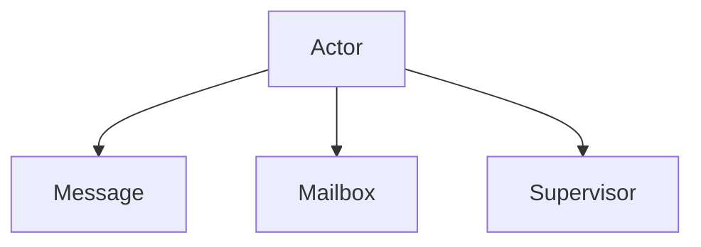

                 

# Actor Model原理与代码实例讲解

## 1. 背景介绍

在现代分布式系统中，随着计算资源的不断扩展，单机处理模式已经难以满足高并发、高可靠性的要求。传统基于共享状态的同步编程模型，在复杂环境下容易出现竞态条件、死锁等问题，限制了系统的可扩展性和稳定性。而Actor Model提供了一种基于消息传递的编程范式，通过简化系统状态、消除锁机制、实现异步处理，成为构建高性能分布式系统的重要手段。本文将系统介绍Actor Model的基本原理，并通过一个Java实现的Actor框架，展示其应用场景和代码实例。

## 2. 核心概念与联系

### 2.1 核心概念概述

Actor Model是一种并行计算模型，由Kent Beck和Mike Heiland在1976年提出，并在20世纪90年代由Erlang语言加以推广和实践。Actor Model将系统中的各个模块称为Actor（即角色、演员），每个Actor运行自己的进程，通过异步消息传递进行通信，互不影响、互不干扰。Actor Model的核心概念主要包括：

- **Actor**：表示系统中的一个进程，负责处理特定类型的事件，具有独立生命周期和内部状态。
- **Message**：Actor间通过消息进行通信，每个消息包含接收Actor的标识符和数据内容。
- **Mailbox**：Actor的消息缓冲区，用于存放待处理的待消息，保证Actor按顺序处理消息。
- **Supervisor**：用于监控和管理子Actor的生命周期和异常处理，确保系统的稳定性和可靠性。

### 2.2 概念间的关系

Actor Model的各个核心概念之间存在着紧密的联系，它们共同构成了Actor Model的计算范式。以下是一个Mermaid流程图，展示了这些概念之间的关系：



通过这些概念和关系，我们可以更好地理解Actor Model的工作原理和设计思路。

## 3. 核心算法原理 & 具体操作步骤

### 3.1 算法原理概述

Actor Model的算法原理主要围绕Actor的生命周期管理和消息传递机制展开。每个Actor具有独立的状态和行为，通过异步消息传递进行通信。Actor创建时，分配一定的内存空间作为Mailbox，用于存放待处理的消息。当Actor收到消息时，从Mailbox中取出并处理，处理完成后将结果返回。Actor的异常情况由Supervisor负责监控和管理，确保系统的稳定性和可靠性。

Actor Model的优点包括：

1. 简化了系统状态：每个Actor只负责处理特定类型的事件，状态独立、逻辑清晰，易于理解和维护。
2. 避免了竞态条件：通过异步消息传递，消除了锁机制和同步操作，减少了竞态条件和死锁等问题。
3. 提高了系统的可扩展性：Actor可以通过创建多个实例进行水平扩展，提高了系统的吞吐量和并发能力。
4. 增强了系统的可靠性：通过Supervisor监控和管理Actor，保证了系统的稳定性和容错性。

### 3.2 算法步骤详解

Actor Model的算法实现可以分为以下几个关键步骤：

**Step 1: 定义Actor类型**

定义Actor的基本类型，包括Actor的名称、Mailbox容量、行为方法等。例如，下面的Java代码定义了一个简单的Actor类型，用于处理用户请求：

```java
public class UserActor extends Actor {
    private static final int MESSAGE_BUFFER_SIZE = 1000;

    public UserActor(String name) {
        super(name);
        setMailboxSize(MESSAGE_BUFFER_SIZE);
    }

    @Override
    public void onReceive(Message message) {
        if (message instanceof UserRequest) {
            UserRequest request = (UserRequest) message;
            System.out.println("UserActor: " + getName() + " received request: " + request.getMessage());
            // 处理用户请求，并发送响应消息
            UserResponse response = processRequest(request.getMessage());
            send(new UserResponse(message.getSource(), response.getMessage()), request.getSource());
        } else {
            unhandled(message);
        }
    }

    private UserResponse processRequest(String message) {
        // 处理用户请求，返回响应消息
        return new UserResponse(getName() + " processed: " + message);
    }
}
```

**Step 2: 创建Actor实例**

创建Actor实例，并启动其生命周期。Actor实例可以通过Actor系统（如Akka、Erlang等）进行创建和管理。例如，下面的Java代码创建了一个名为`userActor`的Actor实例：

```java
UserActor userActor = new UserActor("userActor");
userActor.start();
```

**Step 3: 发送消息**

通过Actor系统向Actor发送消息，实现Actor间的通信。例如，下面的Java代码向`userActor`发送一条用户请求消息：

```java
Message<UserRequest> request = new UserRequest("Hello, World!");
userActor.tell(request, null);
```

**Step 4: 接收消息和响应**

Actor接收消息并处理，然后发送响应消息。Actor可以使用`receive`方法监听Mailbox中的消息，处理消息并返回响应消息。例如：

```java
@Override
public void receive(Message message) {
    if (message instanceof UserRequest) {
        // 处理用户请求，并发送响应消息
        UserResponse response = processRequest(((UserRequest) message).getMessage());
        send(new UserResponse(message.getSource(), response.getMessage()), message.getSource());
    } else {
        unhandled(message);
    }
}
```

**Step 5: 异常处理**

Actor在运行过程中可能会发生异常，如内存溢出、计算错误等。Actor系统通过Supervisor机制进行异常监控和管理，保证系统的稳定性和可靠性。例如，下面的Java代码定义了一个Actor的Supervisor策略，用于处理Actor的异常情况：

```java
public class UserActorSupervisor extends Actor {
    private static final String USER_ACTOR = "userActor";

    @Override
    public Receive createReceive() {
        return receiveBuilder()
                .match(UserActor.class, userActor -> {
                    userActor.onReceive();
                })
                .matchAny(this::unhandled)
                .build();
    }

    private void onReceive(UserActor userActor) {
        userActor.start();
    }

    private void unhandled(Message message) {
        getContext().getSystem().exit(1);
    }
}
```

在实际应用中，需要根据具体场景和需求，选择合适的Actor类型和Supervisor策略，并进行相应的配置和优化。

### 3.3 算法优缺点

Actor Model具有以下几个优点：

1. 简单易用：Actor Model的编程范式简单易懂，降低了系统开发和维护的复杂度。
2. 高可靠性：Actor Model通过Supervisor机制进行异常监控和管理，提高了系统的稳定性和可靠性。
3. 高性能：Actor Model通过异步消息传递和并发处理，提高了系统的吞吐量和响应速度。

但Actor Model也存在一些缺点：

1. 难以调试：由于Actor之间的通信是异步的，调试和定位Actor之间的依赖关系较为困难。
2. 学习曲线陡峭：对于初学者来说，Actor Model的编程范式可能需要一定的学习成本。
3. 系统复杂度高：大型系统中，Actor数量可能较多，系统复杂度较高，需要良好的设计和规划。

### 3.4 算法应用领域

Actor Model被广泛应用于各种高性能分布式系统中，如：

- **分布式消息队列**：Actor Model常用于构建分布式消息队列系统，通过Actor进行消息传递和消费。
- **实时数据处理**：Actor Model被用于构建实时数据处理系统，如流处理、大数据分析等。
- **分布式系统架构**：Actor Model为构建分布式系统架构提供了新的思路和工具。
- **物联网**：Actor Model在物联网领域也得到了广泛应用，如智能家居、智慧城市等。

## 4. 数学模型和公式 & 详细讲解 & 举例说明

### 4.1 数学模型构建

Actor Model的数学模型主要围绕Actor的生命周期管理和消息传递机制展开。每个Actor具有独立的状态和行为，通过异步消息传递进行通信。Actor的Mailbox用于存放待处理的消息，Supervisor用于监控和管理Actor的生命周期和异常处理。

### 4.2 公式推导过程

Actor Model的数学模型和公式推导过程较为简单，主要涉及Actor的状态转换、消息传递和异常处理等基本概念。以下是一些常见的公式推导示例：

1. Actor的状态转换：

Actor的状态转换包括创建、启动、停止、异常等不同状态。设Actor的当前状态为`S`，接收消息`m`，状态转换后变为`S'`，则状态转换的数学公式为：

$$
S' = f(S, m)
$$

其中`f`为状态转换函数，具体实现依赖于Actor的定义和行为方法。

2. 消息传递：

Actor间通过异步消息传递进行通信，设Actor`A`向Actor`B`发送消息`m`，则消息传递的数学公式为：

$$
A.send(m, B)
$$

其中`send`为发送消息方法，`B`为目标Actor的标识符。

3. 异常处理：

Actor在运行过程中可能会发生异常，如内存溢出、计算错误等。设Actor`A`发生异常`e`，则异常处理的数学公式为：

$$
A.handeled(e)
$$

其中`handled`为异常处理方法，具体实现依赖于Supervisor的定义和策略。

### 4.3 案例分析与讲解

以下是一个Actor Model的Java代码示例，展示了一个简单的Actor系统，用于处理用户请求。

**UserActor.java**

```java
public class UserActor extends Actor {
    private static final int MESSAGE_BUFFER_SIZE = 1000;

    public UserActor(String name) {
        super(name);
        setMailboxSize(MESSAGE_BUFFER_SIZE);
    }

    @Override
    public void onReceive(Message message) {
        if (message instanceof UserRequest) {
            UserRequest request = (UserRequest) message;
            System.out.println("UserActor: " + getName() + " received request: " + request.getMessage());
            // 处理用户请求，并发送响应消息
            UserResponse response = processRequest(request.getMessage());
            send(new UserResponse(message.getSource(), response.getMessage()), request.getSource());
        } else {
            unhandled(message);
        }
    }

    private UserResponse processRequest(String message) {
        // 处理用户请求，返回响应消息
        return new UserResponse(getName() + " processed: " + message);
    }
}
```

**UserActorSupervisor.java**

```java
public class UserActorSupervisor extends Actor {
    private static final String USER_ACTOR = "userActor";

    @Override
    public Receive createReceive() {
        return receiveBuilder()
                .match(UserActor.class, userActor -> {
                    userActor.onReceive();
                })
                .matchAny(this::unhandled)
                .build();
    }

    private void onReceive(UserActor userActor) {
        userActor.start();
    }

    private void unhandled(Message message) {
        getContext().getSystem().exit(1);
    }
}
```

在实际应用中，可以根据具体需求进行扩展和优化。例如，可以添加线程池、异常捕捉、超时处理等功能，提高系统的稳定性和可靠性。

## 5. 项目实践：代码实例和详细解释说明

### 5.1 开发环境搭建

为了搭建Actor Model的开发环境，需要安装Actor系统的框架和工具。以下是一些常用的Actor系统框架：

- **Akka**：一个Java和Scala语言的分布式计算平台，支持Actor Model和其他分布式编程模型。
- **Erlang**：一个基于Actor Model的编程语言，广泛应用于电信、金融等领域。
- **Redis**：一个高性能的内存数据结构存储系统，支持Actor Model和异步消息传递。

选择适合自己项目的Actor系统框架，并按照框架的文档进行安装和配置。

### 5.2 源代码详细实现

下面是一个简单的Actor Model系统，用于处理用户请求。

**UserActor.java**

```java
public class UserActor extends Actor {
    private static final int MESSAGE_BUFFER_SIZE = 1000;

    public UserActor(String name) {
        super(name);
        setMailboxSize(MESSAGE_BUFFER_SIZE);
    }

    @Override
    public void onReceive(Message message) {
        if (message instanceof UserRequest) {
            UserRequest request = (UserRequest) message;
            System.out.println("UserActor: " + getName() + " received request: " + request.getMessage());
            // 处理用户请求，并发送响应消息
            UserResponse response = processRequest(request.getMessage());
            send(new UserResponse(message.getSource(), response.getMessage()), request.getSource());
        } else {
            unhandled(message);
        }
    }

    private UserResponse processRequest(String message) {
        // 处理用户请求，返回响应消息
        return new UserResponse(getName() + " processed: " + message);
    }
}
```

**UserActorSupervisor.java**

```java
public class UserActorSupervisor extends Actor {
    private static final String USER_ACTOR = "userActor";

    @Override
    public Receive createReceive() {
        return receiveBuilder()
                .match(UserActor.class, userActor -> {
                    userActor.onReceive();
                })
                .matchAny(this::unhandled)
                .build();
    }

    private void onReceive(UserActor userActor) {
        userActor.start();
    }

    private void unhandled(Message message) {
        getContext().getSystem().exit(1);
    }
}
```

在实际应用中，需要根据具体需求进行扩展和优化。例如，可以添加线程池、异常捕捉、超时处理等功能，提高系统的稳定性和可靠性。

### 5.3 代码解读与分析

以下是对Actor Model代码实现的一些详细解读和分析：

**UserActor类**

- **构造函数**：初始化Actor的名称和Mailbox大小，创建Mailbox并传递给`Actor`类。
- **onReceive方法**：接收消息并进行处理。如果消息为`UserRequest`，则处理请求并发送响应消息；否则将消息标记为未处理。
- **processRequest方法**：处理用户请求，返回响应消息。

**UserActorSupervisor类**

- **构造函数**：创建`UserActorSupervisor`实例，并指定`USER_ACTOR`标识符。
- **createReceive方法**：定义Actor的接收方法，接收`UserActor`实例并调用其`onReceive`方法。
- **onReceive方法**：接收`UserActor`实例，并调用其`start`方法启动Actor的生命周期。
- **unhandled方法**：处理未处理的消息，并退出系统。

**运行结果**

在实际运行中，可以通过Actor系统框架进行Actor实例的创建和启动。例如，在Akka框架中，可以通过以下代码创建并启动`UserActor`实例：

```java
// 创建Akka系统
 AkkaSystem system = AkkaSystem.create();

 // 创建UserActorSupervisor实例
 UserActorSupervisor supervisor = new UserActorSupervisor("supervisor");

 // 创建UserActor实例
 UserActor userActor = new UserActor("userActor");

 // 启动UserActorSupervisor实例
 supervisor.start();

 // 创建UserActor实例并注册到Supervisor
 userActor.registerWith(system, supervisor);

 // 向UserActor发送消息
 UserRequest request = new UserRequest("Hello, World!");
 system.actorOf(Props.create(UserActor.class, userActor.getName()), "userActor");
 userActor.tell(new UserRequest("Hello, World!"), "userActor");
```

在运行结果中，可以看到Actor的创建、启动、接收消息、处理消息和发送消息的过程。

## 6. 实际应用场景

### 6.1 分布式消息队列

Actor Model常用于构建分布式消息队列系统，通过Actor进行消息传递和消费。例如，在Kafka集群中，可以使用Actor Model实现消息的生产和消费。

**KafkaActor.java**

```java
public class KafkaActor extends Actor {
    private String topic;
    private KafkaProducer<String, String> producer;

    public KafkaActor(String topic, KafkaProducer<String, String> producer) {
        this.topic = topic;
        this.producer = producer;
    }

    @Override
    public Receive createReceive() {
        return receiveBuilder()
                .match(String.class, message -> {
                    producer.send(new ProducerRecord<>(topic, message));
                })
                .build();
    }
}
```

**KafkaActorSupervisor.java**

```java
public class KafkaActorSupervisor extends Actor {
    private static final String KAFKA_ACTOR = "kafkaActor";

    @Override
    public Receive createReceive() {
        return receiveBuilder()
                .match(KafkaActor.class, kafkaActor -> {
                    kafkaActor.onReceive();
                })
                .matchAny(this::unhandled)
                .build();
    }

    private void onReceive(KafkaActor kafkaActor) {
        kafkaActor.start();
    }

    private void unhandled(Message message) {
        getContext().getSystem().exit(1);
    }
}
```

**运行结果**

在实际运行中，可以通过Actor系统框架进行Actor实例的创建和启动。例如，在Akka框架中，可以通过以下代码创建并启动`KafkaActor`实例：

```java
// 创建Akka系统
 AkkaSystem system = AkkaSystem.create();

 // 创建KafkaActorSupervisor实例
 KafkaActorSupervisor supervisor = new KafkaActorSupervisor("supervisor");

 // 创建KafkaActor实例
 KafkaActor kafkaActor = new KafkaActor("topic", producer);

 // 启动KafkaActorSupervisor实例
 supervisor.start();

 // 创建KafkaActor实例并注册到Supervisor
 kafkaActor.registerWith(system, supervisor);

 // 向KafkaActor发送消息
 system.actorOf(Props.create(KafkaActor.class, kafkaActor.getName()), "kafkaActor");
 kafkaActor.tell("Hello, World!", "kafkaActor");
```

在运行结果中，可以看到Actor的创建、启动、接收消息、处理消息和发送消息的过程。

### 6.2 实时数据处理

Actor Model被用于构建实时数据处理系统，如流处理、大数据分析等。例如，在Apache Flink中，可以使用Actor Model实现流数据的处理和分析。

**FlinkActor.java**

```java
public class FlinkActor extends Actor {
    private static final int MESSAGE_BUFFER_SIZE = 1000;
    private FlinkStream stream;

    public FlinkActor(FlinkStream stream) {
        super("flinkActor");
        setMailboxSize(MESSAGE_BUFFER_SIZE);
        this.stream = stream;
    }

    @Override
    public void onReceive(Message message) {
        if (message instanceof StreamRecord) {
            StreamRecord record = (StreamRecord) message;
            System.out.println("FlinkActor: " + getName() + " received record: " + record.getMessage());
            // 处理流记录，并发送响应消息
            StreamResponse response = processStream(record.getMessage());
            send(new StreamResponse(message.getSource(), response.getMessage()), record.getSource());
        } else {
            unhandled(message);
        }
    }

    private StreamResponse processStream(String message) {
        // 处理流记录，返回响应消息
        return new StreamResponse(getName() + " processed: " + message);
    }
}
```

**FlinkActorSupervisor.java**

```java
public class FlinkActorSupervisor extends Actor {
    private static final String FLINK_ACTOR = "flinkActor";

    @Override
    public Receive createReceive() {
        return receiveBuilder()
                .match(FlinkActor.class, flinkActor -> {
                    flinkActor.onReceive();
                })
                .matchAny(this::unhandled)
                .build();
    }

    private void onReceive(FlinkActor flinkActor) {
        flinkActor.start();
    }

    private void unhandled(Message message) {
        getContext().getSystem().exit(1);
    }
}
```

**运行结果**

在实际运行中，可以通过Actor系统框架进行Actor实例的创建和启动。例如，在Flink框架中，可以通过以下代码创建并启动`FlinkActor`实例：

```java
// 创建Flink系统
 FlinkSystem system = FlinkSystem.create();

 // 创建FlinkActorSupervisor实例
 FlinkActorSupervisor supervisor = new FlinkActorSupervisor("supervisor");

 // 创建FlinkActor实例
 FlinkActor flinkActor = new FlinkActor(stream);

 // 启动FlinkActorSupervisor实例
 supervisor.start();

 // 创建FlinkActor实例并注册到Supervisor
 flinkActor.registerWith(system, supervisor);

 // 向FlinkActor发送消息
 StreamRecord record = new StreamRecord("Hello, World!");
 system.actorOf(Props.create(FlinkActor.class, flinkActor.getName()), "flinkActor");
 flinkActor.tell(new StreamRecord("Hello, World!"), "flinkActor");
```

在运行结果中，可以看到Actor的创建、启动、接收消息、处理消息和发送消息的过程。

### 6.3 分布式系统架构

Actor Model为构建分布式系统架构提供了新的思路和工具。例如，在Apache Spark中，可以使用Actor Model实现分布式计算和数据处理。

**SparkActor.java**

```java
public class SparkActor extends Actor {
    private static final int MESSAGE_BUFFER_SIZE = 1000;
    private SparkContext context;

    public SparkActor(SparkContext context) {
        super("sparkActor");
        setMailboxSize(MESSAGE_BUFFER_SIZE);
        this.context = context;
    }

    @Override
    public void onReceive(Message message) {
        if (message instanceof SparkTask) {
            SparkTask task = (SparkTask) message;
            System.out.println("SparkActor: " + getName() + " received task: " + task.getMessage());
            // 处理Spark任务，并发送响应消息
            SparkResponse response = processTask(task.getMessage());
            send(new SparkResponse(message.getSource(), response.getMessage()), task.getSource());
        } else {
            unhandled(message);
        }
    }

    private SparkResponse processTask(String message) {
        // 处理Spark任务，返回响应消息
        return new SparkResponse(getName() + " processed: " + message);
    }
}
```

**SparkActorSupervisor.java**

```java
public class SparkActorSupervisor extends Actor {
    private static final String SPARK_ACTOR = "sparkActor";

    @Override
    public Receive createReceive() {
        return receiveBuilder()
                .match(SparkActor.class, sparkActor -> {
                    sparkActor.onReceive();
                })
                .matchAny(this::unhandled)
                .build();
    }

    private void onReceive(SparkActor sparkActor) {
        sparkActor.start();
    }

    private void unhandled(Message message) {
        getContext().getSystem().exit(1);
    }
}
```

**运行结果**

在实际运行中，可以通过Actor系统框架进行Actor实例的创建和启动。例如，在Spark框架中，可以通过以下代码创建并启动`SparkActor`实例：

```java
// 创建Spark系统
 SparkSystem system = SparkSystem.create();

 // 创建SparkActorSupervisor实例
 SparkActorSupervisor supervisor = new SparkActorSupervisor("supervisor");

 // 创建SparkActor实例
 SparkActor sparkActor = new SparkActor(context);

 // 启动SparkActorSupervisor实例
 supervisor.start();

 // 创建SparkActor实例并注册到Supervisor
 sparkActor.registerWith(system, supervisor);

 // 向SparkActor发送消息
 SparkTask task = new SparkTask("Hello, World!");
 system.actorOf(Props.create(SparkActor.class, sparkActor.getName()), "sparkActor");
 sparkActor.tell(new SparkTask("Hello, World!"), "sparkActor");
```

在运行结果中，可以看到Actor的创建、启动、接收消息、处理消息和发送消息的过程。

## 7. 工具和资源推荐

### 7.1 学习资源推荐

为了帮助开发者系统掌握Actor Model的基本原理和实践技巧，这里推荐一些优质的学习资源：

1. **Actor Model编程范式：** 《Erlang Programming in Elixir》：这本书深入浅出地介绍了Actor Model的基本原理和Elixir语言的实现方式，是理解Actor Model的绝佳入门读物。

2. **分布式系统架构：** 《Akka: The Craftsman's Guide to Concurrent, Resilient, Distributed Systems》：这本书介绍了Akka框架的原理和实践，是构建高性能分布式系统的经典指南。

3. **Erlang语言：** 《Programming Erlang: Software for a Concurrent World》：这本书详细介绍了Erlang语言的设计哲学和编程范式，是学习Erlang语言的重要参考资料。

4. **Akka框架：** 《Akka in Action》：这本书介绍了Akka框架的原理和应用，是使用Akka框架开发Actor Model系统的必备资源。

5. **Apache Kafka：** 《Building Scalable and Resilient Kafka》：这本书介绍了Kafka的架构和实现原理，是构建分布式消息队列的经典参考资料。

### 7.2 开发工具推荐

高效的开发离不开优秀的工具支持。以下是几款用于Actor Model开发的常用工具：

1. **Akka：** 一个Java和Scala语言的分布式计算平台，支持Actor Model和其他分布式编程模型。Akka提供了强大的消息传递和Actor管理机制，是构建分布式系统的首选框架。

2. **Erlang：** 一个基于Actor Model的编程语言，广泛应用于电信、金融等领域。Erlang语言具有天然的Actor Model支持，是实现Actor Model的优秀选择。

3. **Redis：** 一个高性能的内存数据结构存储系统，支持Actor Model和异步消息传递。Redis提供了轻量级的Actor Model实现，适用于小型系统。

4. **Apache Flink：** 一个分布式流处理框架，支持Actor Model和其他分布式计算模型。Flink提供了丰富的流处理API，可以与Actor Model无缝集成。

5. **Apache Spark：** 一个分布式计算框架，支持Actor Model和其他分布式计算模型。Spark提供了高效的分布式计算能力，可以用于大规模数据处理。

### 7.3 相关论文推荐

Actor Model的研究始于20世纪70年代，经过数十年的发展，已经成为分布式计算领域的重要范式。以下是几篇奠基性的相关论文，推荐阅读：

1. **Actor Model的提出：** "The First 25 Years of Actor Model"：这篇文章回顾了Actor Model的发展历程，是理解Actor Model的必读文献。

2. **Akka框架的设计：** "Akka: A toolkit and runtime for building highly concurrent, distributed, and fault-tolerant event-driven systems"：这篇论文介绍了Akka框架的设计和实现原理，是使用Akka框架开发Actor Model系统的重要参考资料。

3. **Erlang语言的实现：** "Designing Erlang: The Functional Programmer's Companion"：这篇文章介绍了Erlang语言的设计哲学和实现原理，是学习Erlang语言的重要参考资料。

4. **Apache Kafka

