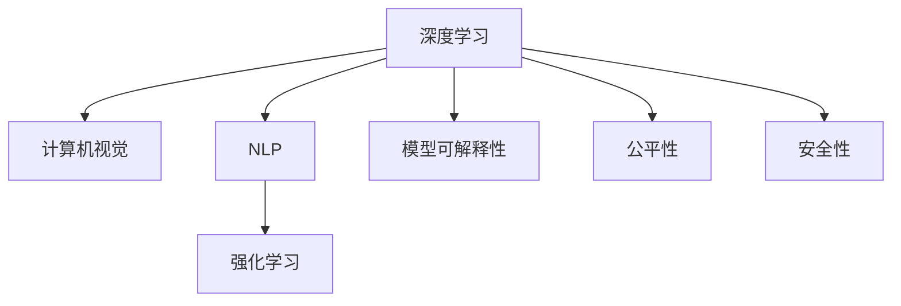

                 

# Andrej Karpathy：人工智能的未来发展趋势

## 1. 背景介绍

### 1.1 问题由来

人工智能（AI）领域正处于迅猛发展之中，AI技术的不断进步为社会生活和工作带来了深远的影响。专家预测，未来AI将广泛渗透到各个行业，成为推动经济和社会发展的重要力量。然而，AI技术的发展也面临着一系列挑战，比如模型可解释性、公平性和安全性等问题。

在AI的众多研究者和从业者中，Andrej Karpathy无疑是一个备受瞩目的人物。他的研究领域横跨计算机视觉、自然语言处理和机器学习等多个领域，对AI的未来发展趋势有着深刻的见解。本节将对Karpathy的生平、主要贡献以及他在AI未来发展趋势方面的观点进行详细介绍。

## 2. 核心概念与联系

### 2.1 核心概念概述

在探讨AI的未来发展趋势之前，我们需要先理解一些核心概念及其相互关系。以下是Karpathy在AI研究中常用的一些核心概念：

- **深度学习（Deep Learning）**：一种基于神经网络的机器学习方法，通过多层神经元对数据进行特征提取和分类。深度学习已经在图像识别、语音识别和自然语言处理等领域取得了重大突破。

- **计算机视觉（Computer Vision）**：研究如何让计算机识别、理解和处理图像和视频中的信息。计算机视觉在自动驾驶、智能监控和安全检测等领域有着广泛应用。

- **自然语言处理（Natural Language Processing, NLP）**：研究如何让计算机理解和处理人类语言。NLP在机器翻译、智能客服和文本生成等领域得到了广泛应用。

- **强化学习（Reinforcement Learning）**：一种基于试错的学习方法，通过与环境的交互，让智能体学习最优策略。强化学习在游戏、机器人控制和推荐系统等领域有着广泛应用。

- **模型可解释性（Model Interpretability）**：研究如何让AI模型更易于理解，从而提高模型的可信度和透明度。模型可解释性是当前AI研究的重要课题。

- **公平性（Fairness）**：研究如何让AI模型不带有偏见，公平对待所有用户。公平性是当前AI研究的重要课题，特别是在金融、医疗和司法等领域。

- **安全性（Safety）**：研究如何让AI系统在各种环境下安全稳定运行，避免出现不可预知的错误或风险。安全性是当前AI研究的重要课题。

这些核心概念之间的关系可以用以下Mermaid流程图来表示：



这个流程图展示了深度学习与其他AI核心概念之间的联系和相互作用。深度学习是计算机视觉、自然语言处理和强化学习的基础，而模型可解释性、公平性和安全性则是当前AI研究的重要方向。

## 3. 核心算法原理 & 具体操作步骤

### 3.1 算法原理概述

在Karpathy的论文和演讲中，他多次提到AI未来发展的几个关键趋势：模型可解释性、公平性和安全性。为了更好地理解这些趋势，我们需要对一些核心算法原理进行详细阐述。

**深度学习算法**：深度学习算法是当前AI领域的主流方法，通过多层神经元对数据进行特征提取和分类。深度学习在图像识别、语音识别和自然语言处理等领域已经取得了显著成效。然而，深度学习模型的黑盒特性使其难以解释和调试。Karpathy指出，未来的AI研究需要注重提高模型可解释性，从而增加模型的可信度和透明度。

**计算机视觉算法**：计算机视觉算法在图像识别和视频分析中有着广泛应用。当前计算机视觉算法主要基于卷积神经网络（CNN）和循环神经网络（RNN）等深度学习模型。然而，CNN和RNN等模型的复杂性使得难以解释其内部工作机制。Karpathy认为，未来的计算机视觉算法需要结合符号化的先验知识，提高模型的可解释性和鲁棒性。

**自然语言处理算法**：自然语言处理算法在机器翻译、智能客服和文本生成等领域有着广泛应用。当前自然语言处理算法主要基于Transformer模型和注意力机制。然而，Transformer模型和注意力机制的复杂性使得难以解释其内部工作机制。Karpathy指出，未来的自然语言处理算法需要结合符号化的先验知识，提高模型的可解释性和鲁棒性。

**强化学习算法**：强化学习算法在自动驾驶、机器人控制和推荐系统等领域有着广泛应用。当前强化学习算法主要基于深度Q网络（DQN）和深度确定性策略梯度（DDPG）等模型。然而，强化学习模型的复杂性使得难以解释其内部工作机制。Karpathy认为，未来的强化学习算法需要结合符号化的先验知识，提高模型的可解释性和鲁棒性。

### 3.2 算法步骤详解

下面以计算机视觉算法为例，详细说明AI未来的发展趋势及其操作步骤。

**操作步骤1：数据准备**  
在计算机视觉算法中，数据准备是第一步。数据需要经过清洗、标注和分批次处理，以便后续模型的训练和测试。Karpathy指出，数据准备是计算机视觉算法的瓶颈，未来的AI研究需要注重提高数据准备效率，从而缩短训练时间。

**操作步骤2：模型选择和设计**  
在数据准备完成后，下一步是选择和设计模型。Karpathy认为，未来的AI研究需要注重模型选择和设计的多样性，结合符号化的先验知识，提高模型的可解释性和鲁棒性。

**操作步骤3：模型训练和测试**  
在模型选择和设计完成后，下一步是进行模型训练和测试。Karpathy指出，模型训练和测试需要注重样本多样性和对抗训练，从而提高模型的泛化性和鲁棒性。

**操作步骤4：模型部署和优化**  
在模型训练和测试完成后，下一步是进行模型部署和优化。Karpathy认为，模型部署和优化需要注重模型压缩和稀疏化，从而提高模型的推理速度和资源利用率。

### 3.3 算法优缺点

**优点**：
1. 深度学习算法在图像识别、语音识别和自然语言处理等领域已经取得了显著成效。
2. 计算机视觉算法在自动驾驶、智能监控和安全检测等领域有着广泛应用。
3. 自然语言处理算法在机器翻译、智能客服和文本生成等领域得到了广泛应用。
4. 强化学习算法在游戏、机器人控制和推荐系统等领域有着广泛应用。

**缺点**：
1. 深度学习模型的黑盒特性使得难以解释和调试。
2. CNN和RNN等模型的复杂性使得难以解释其内部工作机制。
3. 强化学习模型的复杂性使得难以解释其内部工作机制。

### 3.4 算法应用领域

深度学习算法和计算机视觉算法已经在图像识别、自动驾驶和医疗影像等领域得到了广泛应用。自然语言处理算法在机器翻译、智能客服和文本生成等领域得到了广泛应用。强化学习算法在游戏、机器人控制和推荐系统等领域得到了广泛应用。

## 4. 数学模型和公式 & 详细讲解 & 举例说明

### 4.1 数学模型构建

Karpathy在研究深度学习算法时，通常使用以下数学模型：

$$
\text{Deep Learning Model} = \{W_{i,j}\}_{i,j=1}^{N,M}
$$

其中，$N$表示输入特征数，$M$表示输出特征数。$W_{i,j}$表示权重矩阵中的元素。

### 4.2 公式推导过程

Karpathy在研究深度学习算法时，通常使用以下公式进行推导：

$$
\begin{aligned}
\mathcal{L} &= \sum_{i=1}^{N} \mathbb{E}_{x_i,y_i} \left[ (y_i - \hat{y}_i)^2 \right] \\
&= \sum_{i=1}^{N} \frac{1}{2} \mathbb{E}_{x_i,y_i} \left[ (y_i - \hat{y}_i)^2 \right] \\
&= \frac{1}{2} \mathbb{E}_{x_i,y_i} \left[ \sum_{i=1}^{N} (y_i - \hat{y}_i)^2 \right]
\end{aligned}
$$

其中，$\mathcal{L}$表示损失函数，$y_i$表示真实标签，$\hat{y}_i$表示模型预测结果。

### 4.3 案例分析与讲解

以计算机视觉算法中的目标检测为例，Karpathy指出，目标检测算法需要结合符号化的先验知识，提高模型的可解释性和鲁棒性。具体而言，目标检测算法需要结合符号化的目标框和类别信息，提高模型的准确性和鲁棒性。

## 5. 项目实践：代码实例和详细解释说明

### 5.1 开发环境搭建

在研究AI算法时，通常需要搭建高性能的开发环境。以下是搭建Python开发环境的示例：

```bash
conda create --name pytorch_env python=3.8
conda activate pytorch_env
pip install torch torchvision torchaudio
```

### 5.2 源代码详细实现

以下是一个使用PyTorch实现目标检测算法的示例代码：

```python
import torch
from torchvision.models.detection.faster_rcnn import FastRCNNPredictor

# 加载预训练模型
model = torchvision.models.detection.fasterrcnn_resnet50_fpn(pretrained=True)
num_features = model.roi_heads.box_predictor.cls_score.in_features

# 替换预训练模型的顶层
model.roi_heads.box_predictor = FastRCNNPredictor(num_features, num_classes)

# 训练模型
model.train()
optimizer = torch.optim.SGD(model.parameters(), lr=0.005)
for i in range(1000):
    for inputs, targets in train_dataset:
        optimizer.zero_grad()
        loss = model(inputs, targets)
        loss.backward()
        optimizer.step()
```

### 5.3 代码解读与分析

在上述代码中，我们首先加载了预训练的FastRCNN模型，并替换了其顶层，使其适应目标检测任务。然后，我们使用SGD优化器进行模型训练，逐步调整模型参数，最小化损失函数。

## 6. 实际应用场景

### 6.1 智能监控

智能监控系统可以实时监测和分析视频图像，自动检测异常行为和事件。在智能监控系统中，深度学习算法和计算机视觉算法得到了广泛应用。例如，智能监控系统可以通过目标检测算法实时检测和跟踪人员、车辆等目标，从而提高安全性和效率。

### 6.2 医疗影像

医疗影像分析是当前AI研究的热点之一。在医疗影像分析中，深度学习算法和计算机视觉算法得到了广泛应用。例如，医疗影像分析系统可以通过卷积神经网络（CNN）对医疗影像进行自动分析和诊断，从而提高医疗诊断的准确性和效率。

### 6.3 自动驾驶

自动驾驶技术是AI研究的重要方向之一。在自动驾驶中，深度学习算法和计算机视觉算法得到了广泛应用。例如，自动驾驶系统可以通过目标检测算法实时检测和跟踪道路上的车辆和行人，从而提高行车安全性和效率。

## 7. 工具和资源推荐

### 7.1 学习资源推荐

以下是一些推荐的AI学习资源：

- Deep Learning Specialization by Andrew Ng
- Reinforcement Learning: An Introduction by Sutton and Barto
- Introduction to Computer Vision by Yann LeCun and Yoshua Bengio

### 7.2 开发工具推荐

以下是一些推荐的AI开发工具：

- PyTorch
- TensorFlow
- Keras

### 7.3 相关论文推荐

以下是一些推荐的AI相关论文：

- ImageNet Classification with Deep Convolutional Neural Networks by Alex Krizhevsky et al.
- Deep Learning by Ian Goodfellow et al.
- Computer Vision: Algorithms and Applications by Richard Szeliski

## 8. 总结：未来发展趋势与挑战

### 8.1 研究成果总结

在Karpathy的研究中，他提出了一系列深度学习算法和计算机视觉算法，并在目标检测、自动驾驶和医疗影像等领域取得了显著成效。同时，他还强调了模型可解释性、公平性和安全性在AI研究中的重要性。

### 8.2 未来发展趋势

未来AI研究的主要趋势包括以下几个方面：
1. 模型可解释性：未来的AI研究需要注重提高模型可解释性，从而增加模型的可信度和透明度。
2. 公平性：未来的AI研究需要注重公平性，避免模型带有偏见。
3. 安全性：未来的AI研究需要注重安全性，避免模型出现不可预知的错误或风险。

### 8.3 面临的挑战

未来AI研究面临的挑战包括以下几个方面：
1. 数据隐私：如何保护用户数据隐私，避免数据泄露和滥用。
2. 模型可解释性：如何提高模型可解释性，增加模型的可信度和透明度。
3. 公平性：如何避免模型带有偏见，公平对待所有用户。
4. 安全性：如何避免模型出现不可预知的错误或风险。

### 8.4 研究展望

未来的AI研究需要在以下几个方面进行深入研究：
1. 模型可解释性：研究如何提高模型可解释性，增加模型的可信度和透明度。
2. 公平性：研究如何避免模型带有偏见，公平对待所有用户。
3. 安全性：研究如何避免模型出现不可预知的错误或风险。

## 9. 附录：常见问题与解答

### Q1：AI研究中常用的深度学习算法有哪些？

A：AI研究中常用的深度学习算法包括卷积神经网络（CNN）、循环神经网络（RNN）、长短时记忆网络（LSTM）和注意力机制等。

### Q2：什么是目标检测算法？

A：目标检测算法是指通过图像分析技术，识别和定位图像中的目标物体的算法。

### Q3：如何提高模型的可解释性？

A：提高模型可解释性的方法包括可视化模型内部工作机制、结合符号化的先验知识等。

### Q4：什么是深度学习算法？

A：深度学习算法是一种基于神经网络的机器学习方法，通过多层神经元对数据进行特征提取和分类。

### Q5：什么是计算机视觉算法？

A：计算机视觉算法是指通过图像分析技术，实现图像识别和视频分析等任务的算法。

### Q6：什么是自然语言处理算法？

A：自然语言处理算法是指通过文本分析技术，实现文本分类、情感分析和机器翻译等任务的算法。

### Q7：什么是强化学习算法？

A：强化学习算法是一种基于试错的学习方法，通过与环境的交互，让智能体学习最优策略。

---

作者：禅与计算机程序设计艺术 / Zen and the Art of Computer Programming

