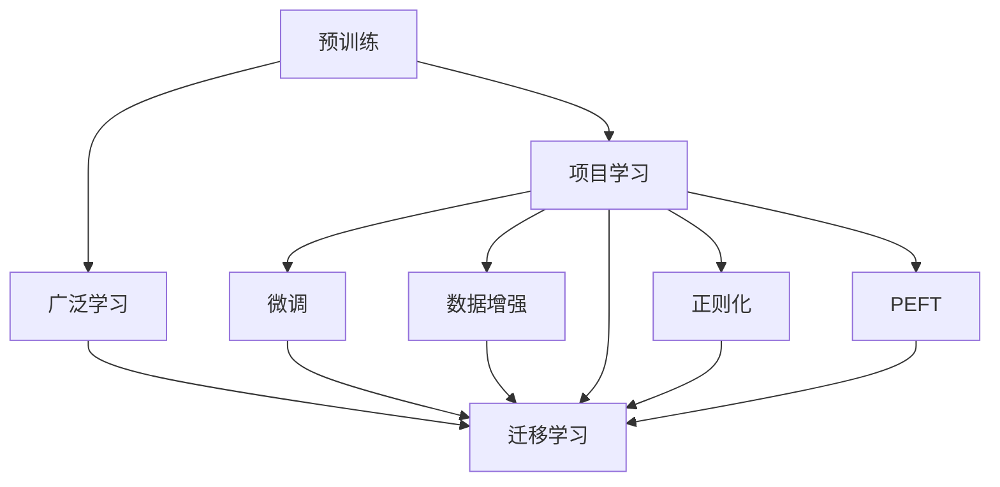
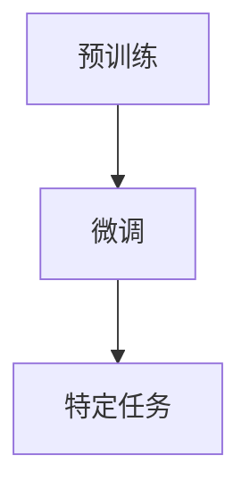
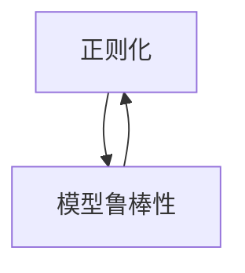
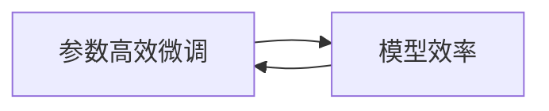
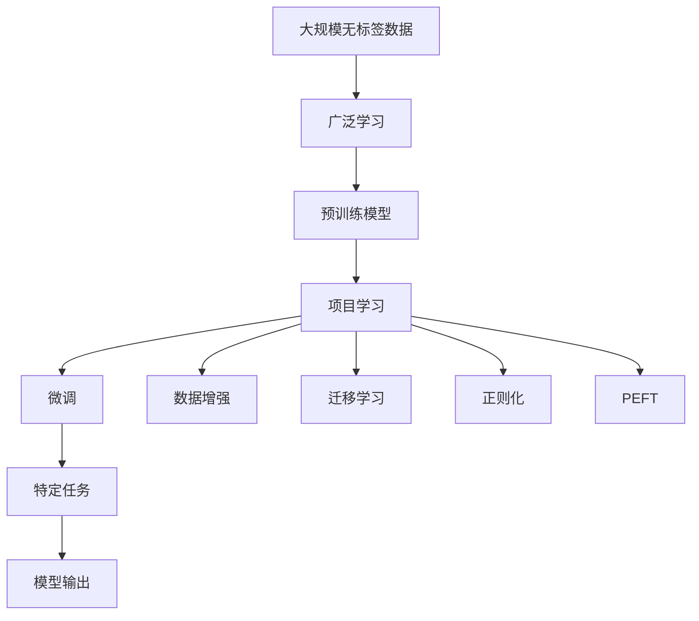

                 

# Andrej Karpathy：项目学习模式与广泛学习互补

Andrej Karpathy是人工智能领域的大师级人物，斯坦福大学教授，OpenAI研究科学家。他的工作涵盖了深度学习、计算机视觉、自动驾驶等多个领域，发表了大量开创性的研究成果。在本次博客中，我们将深入探讨Andrej Karpathy提出的项目学习模式与广泛学习互补的概念，理解如何结合两者的优势，为深度学习项目提供更高效、更精确的训练方法。

## 1. 背景介绍

### 1.1 问题由来
在深度学习领域，传统的数据驱动学习模式（广度学习）和项目驱动学习模式（深度学习）之间的界限越来越模糊。传统的广度学习模式试图从大规模数据集中提取普适知识，通过大量无标签数据训练获得泛化能力。而深度学习模式则通过精心设计的网络结构，对特定任务进行针对性训练，逐步积累复杂模型。

近年来，随着大规模数据集和强大计算资源的普及，广度学习取得了巨大成功。例如，在大规模图像分类、自然语言处理等任务上，基于预训练模型的广泛学习（Generalization Learning）取得了优异成绩。然而，面对一些复杂且数据稀缺的任务，深度学习在提升精度和速度方面仍存在瓶颈。

针对这一问题，Andrej Karpathy提出了项目学习模式（Project Learning），试图结合两者的优势，通过大规模无标签数据进行广泛学习，再利用特定任务数据进行项目学习，提升模型性能。

### 1.2 问题核心关键点
项目学习模式的核心思想是通过在大规模无标签数据上进行预训练，学习基础的特征表示。然后，在特定任务上，通过数据增强、迁移学习、正则化等技术，对预训练模型进行项目学习，提升模型在特定任务上的表现。

项目学习模式的关键在于：
1. **预训练步骤**：在大规模无标签数据集上进行预训练，提取通用的特征表示。
2. **项目学习步骤**：在特定任务数据上，通过有监督学习或弱监督学习进行微调，提升模型精度和泛化能力。
3. **迁移学习**：利用预训练模型的知识，通过微调方式在新任务上应用，提升模型性能。
4. **数据增强和正则化**：通过数据增强和正则化技术，提升模型在特定任务上的泛化能力。

项目学习模式与广泛学习的互补，主要体现在以下几个方面：
1. **数据效率提升**：通过预训练获得通用知识，然后在特定任务上使用少量数据进行微调，大大降低了对标注数据的依赖。
2. **模型泛化能力增强**：预训练模型在大规模数据上提取的特征表示，使得模型在特定任务上具有更好的泛化能力。
3. **鲁棒性提升**：通过预训练模型的知识迁移，使得项目学习模型更加鲁棒，能够在不同数据分布下表现稳定。
4. **灵活性增加**：项目学习模式可以在各种不同类型的数据和任务上进行微调，灵活性强。

## 2. 核心概念与联系

### 2.1 核心概念概述

为更好地理解项目学习模式与广泛学习的互补，本节将介绍几个密切相关的核心概念：

- **项目学习（Project Learning）**：通过在大规模无标签数据上进行预训练，学习基础的特征表示。然后，在特定任务上，通过数据增强、迁移学习、正则化等技术，对预训练模型进行微调，提升模型在特定任务上的表现。
- **广泛学习（Generalization Learning）**：在大量无标签数据上进行自监督学习，学习泛化的知识表示。广泛学习通常用于预训练阶段，以提取通用的特征表示。
- **迁移学习（Transfer Learning）**：利用在特定任务上训练的知识，在新任务上进行微调，提升模型在新任务上的表现。迁移学习是连接预训练和微调的重要桥梁。
- **数据增强（Data Augmentation）**：通过各种方式扩充训练集，如旋转、缩放、翻转等，以提升模型的泛化能力。
- **正则化（Regularization）**：通过L2正则、Dropout、Early Stopping等技术，防止模型过拟合。
- **参数高效微调（Parameter-Efficient Fine-Tuning, PEFT）**：通过微调模型的一部分参数，而不是全部参数，提高微调效率，避免过拟合。

这些核心概念之间的逻辑关系可以通过以下Mermaid流程图来展示：



这个流程图展示了大规模无标签数据与特定任务数据之间的关系，以及预训练、微调、数据增强、正则化和迁移学习等核心概念之间的关系。

### 2.2 概念间的关系

这些核心概念之间存在着紧密的联系，形成了项目学习模式的完整生态系统。下面我们通过几个Mermaid流程图来展示这些概念之间的关系。

#### 2.2.1 项目学习与广泛学习的互补


这个流程图展示了项目学习与广泛学习的互补关系。通过在大规模无标签数据上进行广泛学习，预训练模型学习到通用的特征表示，然后在特定任务上使用项目学习，通过微调进一步提升性能。

#### 2.2.2 预训练与微调的联系



这个流程图展示了预训练与微调的联系。预训练模型在广泛数据上学习通用的特征表示，然后在特定任务上进行微调，提升模型在特定任务上的表现。

#### 2.2.3 迁移学习与数据增强的关系


这个流程图展示了迁移学习与数据增强的关系。迁移学习利用预训练模型在广泛数据上学习到的知识，数据增强则通过扩充训练集，提升模型在特定任务上的泛化能力。

#### 2.2.4 正则化与模型鲁棒性的关系



这个流程图展示了正则化与模型鲁棒性的关系。正则化技术通过减少过拟合，提升模型的鲁棒性，能够在不同数据分布下表现稳定。

#### 2.2.5 参数高效微调与模型效率的关系



这个流程图展示了参数高效微调与模型效率的关系。参数高效微调通过只微调部分参数，提高微调效率，避免过拟合。

### 2.3 核心概念的整体架构

最后，我们用一个综合的流程图来展示这些核心概念在大规模无标签数据与特定任务数据之间的关系：



这个综合流程图展示了从预训练到微调，再到特定任务的全过程。在大规模无标签数据上进行广泛学习，然后通过项目学习对特定任务进行微调，提升模型性能。

## 3. 核心算法原理 & 具体操作步骤

### 3.1 算法原理概述

项目学习模式与广泛学习互补的核心思想是通过在大规模无标签数据上进行预训练，学习通用的特征表示。然后，在特定任务上，通过数据增强、迁移学习、正则化等技术，对预训练模型进行微调，提升模型在特定任务上的表现。

形式化地，假设预训练模型为 $M_{\theta}$，其中 $\theta$ 为预训练得到的模型参数。给定特定任务的标注数据集 $D=\{(x_i,y_i)\}_{i=1}^N$，项目学习的优化目标是最小化损失函数 $\mathcal{L}(\theta)$，使得模型在特定任务上的预测输出与真实标签之间的差异最小化：

$$
\hat{\theta}=\mathop{\arg\min}_{\theta} \mathcal{L}(M_{\theta},D)
$$

其中 $\mathcal{L}$ 为针对特定任务设计的损失函数，如交叉熵损失、均方误差损失等。

### 3.2 算法步骤详解

项目学习模式的具体步骤如下：

**Step 1: 准备预训练模型和数据集**
- 选择合适的预训练语言模型 $M_{\theta}$ 作为初始化参数，如 BERT、GPT等。
- 准备特定任务的标注数据集 $D$，划分为训练集、验证集和测试集。

**Step 2: 添加任务适配层**
- 根据任务类型，在预训练模型顶层设计合适的输出层和损失函数。
- 对于分类任务，通常在顶层添加线性分类器和交叉熵损失函数。
- 对于生成任务，通常使用语言模型的解码器输出概率分布，并以负对数似然为损失函数。

**Step 3: 设置微调超参数**
- 选择合适的优化算法及其参数，如 AdamW、SGD 等，设置学习率、批大小、迭代轮数等。
- 设置正则化技术及强度，包括权重衰减、Dropout、Early Stopping等。
- 确定冻结预训练参数的策略，如仅微调顶层，或全部参数都参与微调。

**Step 4: 执行梯度训练**
- 将训练集数据分批次输入模型，前向传播计算损失函数。
- 反向传播计算参数梯度，根据设定的优化算法和学习率更新模型参数。
- 周期性在验证集上评估模型性能，根据性能指标决定是否触发 Early Stopping。
- 重复上述步骤直到满足预设的迭代轮数或 Early Stopping 条件。

**Step 5: 测试和部署**
- 在测试集上评估微调后模型 $M_{\hat{\theta}}$ 的性能，对比微调前后的精度提升。
- 使用微调后的模型对新样本进行推理预测，集成到实际的应用系统中。
- 持续收集新的数据，定期重新微调模型，以适应数据分布的变化。

以上是项目学习模式与广泛学习互补的具体步骤。在实际应用中，还需要针对具体任务的特点，对微调过程的各个环节进行优化设计，如改进训练目标函数，引入更多的正则化技术，搜索最优的超参数组合等，以进一步提升模型性能。

### 3.3 算法优缺点

项目学习模式与广泛学习互补具有以下优点：
1. **数据效率提升**：通过预训练获得通用知识，然后在特定任务上使用少量数据进行微调，大大降低了对标注数据的依赖。
2. **模型泛化能力增强**：预训练模型在大规模数据上提取的特征表示，使得模型在特定任务上具有更好的泛化能力。
3. **鲁棒性提升**：通过预训练模型的知识迁移，使得项目学习模型更加鲁棒，能够在不同数据分布下表现稳定。
4. **灵活性增加**：项目学习模式可以在各种不同类型的数据和任务上进行微调，灵活性强。

同时，该方法也存在一定的局限性：
1. **预训练步骤复杂**：需要大量计算资源和时间进行预训练，增加了项目周期。
2. **模型可解释性不足**：预训练模型的固有偏见、有害信息等，可能通过微调传递到下游任务，造成负面影响。
3. **过拟合风险**：如果预训练模型与特定任务的特征表示相差较大，微调过程中可能出现过拟合现象。

尽管存在这些局限性，但就目前而言，项目学习模式与广泛学习互补仍是深度学习项目中的主流范式。未来相关研究的重点在于如何进一步降低预训练步骤的计算成本，提高模型可解释性，减少过拟合风险，同时兼顾数据效率和泛化能力。

### 3.4 算法应用领域

项目学习模式与广泛学习互补在深度学习项目中得到了广泛应用，覆盖了几乎所有常见任务，例如：

- 文本分类：如情感分析、主题分类、意图识别等。通过预训练模型学习通用的文本表示，然后在特定任务上进行微调。
- 命名实体识别：识别文本中的人名、地名、机构名等特定实体。利用预训练模型的特征表示，通过微调提高识别精度。
- 关系抽取：从文本中抽取实体之间的语义关系。通过预训练模型的特征表示，再利用微调技术提取特定关系。
- 问答系统：对自然语言问题给出答案。将问题-答案对作为微调数据，训练模型学习匹配答案。
- 机器翻译：将源语言文本翻译成目标语言。通过预训练模型学习语言的通用表示，然后在特定任务上进行微调。
- 文本摘要：将长文本压缩成简短摘要。利用预训练模型的特征表示，通过微调生成高质量摘要。
- 对话系统：使机器能够与人自然对话。通过预训练模型的特征表示，再利用微调技术进行回复生成。

除了上述这些经典任务外，项目学习模式与广泛学习互补还被创新性地应用到更多场景中，如可控文本生成、常识推理、代码生成、数据增强等，为深度学习技术带来了全新的突破。

## 4. 数学模型和公式 & 详细讲解  
### 4.1 数学模型构建

本节将使用数学语言对项目学习模式与广泛学习互补的数学原理进行更加严格的刻画。

记预训练语言模型为 $M_{\theta}$，其中 $\theta$ 为预训练得到的模型参数。假设特定任务的标注数据集为 $D=\{(x_i,y_i)\}_{i=1}^N$，其中 $x_i$ 为输入，$y_i$ 为输出，$\theta$ 为模型参数。

定义模型 $M_{\theta}$ 在输入 $x$ 上的预测输出为 $M_{\theta}(x)$，输出 $y$ 为 $M_{\theta}(x)$ 中的第 $y$ 个元素。定义预测输出与真实标签之间的损失函数为 $\ell(M_{\theta}(x),y)$，则特定任务 $D$ 上的经验风险为：

$$
\mathcal{L}(\theta) = \frac{1}{N} \sum_{i=1}^N \ell(M_{\theta}(x_i),y_i)
$$

项目学习的优化目标是最小化经验风险，即找到最优参数：

$$
\hat{\theta}=\mathop{\arg\min}_{\theta} \mathcal{L}(\theta)
$$

在实践中，我们通常使用基于梯度的优化算法（如SGD、Adam等）来近似求解上述最优化问题。设 $\eta$ 为学习率，$\lambda$ 为正则化系数，则参数的更新公式为：

$$
\theta \leftarrow \theta - \eta \nabla_{\theta}\mathcal{L}(\theta) - \eta\lambda\theta
$$

其中 $\nabla_{\theta}\mathcal{L}(\theta)$ 为损失函数对参数 $\theta$ 的梯度，可通过反向传播算法高效计算。

### 4.2 公式推导过程

以下我们以二分类任务为例，推导交叉熵损失函数及其梯度的计算公式。

假设模型 $M_{\theta}$ 在输入 $x$ 上的输出为 $\hat{y}=M_{\theta}(x) \in [0,1]$，表示样本属于正类的概率。真实标签 $y \in \{0,1\}$。则二分类交叉熵损失函数定义为：

$$
\ell(M_{\theta}(x),y) = -[y\log \hat{y} + (1-y)\log (1-\hat{y})]
$$

将其代入经验风险公式，得：

$$
\mathcal{L}(\theta) = -\frac{1}{N}\sum_{i=1}^N [y_i\log M_{\theta}(x_i)+(1-y_i)\log(1-M_{\theta}(x_i))]
$$

根据链式法则，损失函数对参数 $\theta_k$ 的梯度为：

$$
\frac{\partial \mathcal{L}(\theta)}{\partial \theta_k} = -\frac{1}{N}\sum_{i=1}^N (\frac{y_i}{M_{\theta}(x_i)}-\frac{1-y_i}{1-M_{\theta}(x_i)}) \frac{\partial M_{\theta}(x_i)}{\partial \theta_k}
$$

其中 $\frac{\partial M_{\theta}(x_i)}{\partial \theta_k}$ 可进一步递归展开，利用自动微分技术完成计算。

在得到损失函数的梯度后，即可带入参数更新公式，完成模型的迭代优化。重复上述过程直至收敛，最终得到适应特定任务的最优模型参数 $\hat{\theta}$。

## 5. 项目实践：代码实例和详细解释说明
### 5.1 开发环境搭建

在进行项目学习实践前，我们需要准备好开发环境。以下是使用Python进行PyTorch开发的环境配置流程：

1. 安装Anaconda：从官网下载并安装Anaconda，用于创建独立的Python环境。

2. 创建并激活虚拟环境：
```bash
conda create -n pytorch-env python=3.8 
conda activate pytorch-env
```

3. 安装PyTorch：根据CUDA版本，从官网获取对应的安装命令。例如：
```bash
conda install pytorch torchvision torchaudio cudatoolkit=11.1 -c pytorch -c conda-forge
```

4. 安装Transformers库：
```bash
pip install transformers
```

5. 安装各类工具包：
```bash
pip install numpy pandas scikit-learn matplotlib tqdm jupyter notebook ipython
```

完成上述步骤后，即可在`pytorch-env`环境中开始项目学习实践。

### 5.2 源代码详细实现

这里我们以命名实体识别(NER)任务为例，给出使用Transformers库对BERT模型进行项目学习的PyTorch代码实现。

首先，定义NER任务的数据处理函数：

```python
from transformers import BertTokenizer
from torch.utils.data import Dataset
import torch

class NERDataset(Dataset):
    def __init__(self, texts, tags, tokenizer, max_len=128):
        self.texts = texts
        self.tags = tags
        self.tokenizer = tokenizer
        self.max_len = max_len
        
    def __len__(self):
        return len(self.texts)
    
    def __getitem__(self, item):
        text = self.texts[item]
        tags = self.tags[item]
        
        encoding = self.tokenizer(text, return_tensors='pt', max_length=self.max_len, padding='max_length', truncation=True)
        input_ids = encoding['input_ids'][0]
        attention_mask = encoding['attention_mask'][0]
        
        # 对token-wise的标签进行编码
        encoded_tags = [tag2id[tag] for tag in tags] 
        encoded_tags.extend([tag2id['O']] * (self.max_len - len(encoded_tags)))
        labels = torch.tensor(encoded_tags, dtype=torch.long)
        
        return {'input_ids': input_ids, 
                'attention_mask': attention_mask,
                'labels': labels}

# 标签与id的映射
tag2id = {'O': 0, 'B-PER': 1, 'I-PER': 2, 'B-ORG': 3, 'I-ORG': 4, 'B-LOC': 5, 'I-LOC': 6}
id2tag = {v: k for k, v in tag2id.items()}

# 创建dataset
tokenizer = BertTokenizer.from_pretrained('bert-base-cased')

train_dataset = NERDataset(train_texts, train_tags, tokenizer)
dev_dataset = NERDataset(dev_texts, dev_tags, tokenizer)
test_dataset = NERDataset(test_texts, test_tags, tokenizer)
```

然后，定义模型和优化器：

```python
from transformers import BertForTokenClassification, AdamW

model = BertForTokenClassification.from_pretrained('bert-base-cased', num_labels=len(tag2id))

optimizer = AdamW(model.parameters(), lr=2e-5)
```

接着，定义训练和评估函数：

```python
from torch.utils.data import DataLoader
from tqdm import tqdm
from sklearn.metrics import classification_report

device = torch.device('cuda') if torch.cuda.is_available() else torch.device('cpu')
model.to(device)

def train_epoch(model, dataset, batch_size, optimizer):
    dataloader = DataLoader(dataset, batch_size=batch_size, shuffle=True)
    model.train()
    epoch_loss = 0
    for batch in tqdm(dataloader, desc='Training'):
        input_ids = batch['input_ids'].to(device)
        attention_mask = batch['attention_mask'].to(device)
        labels = batch['labels'].to(device)
        model.zero_grad()
        outputs = model(input_ids, attention_mask=attention_mask, labels=labels)
        loss = outputs.loss
        epoch_loss += loss.item()
        loss.backward()
        optimizer.step()
    return epoch_loss / len(dataloader)

def evaluate(model, dataset, batch_size):
    dataloader = DataLoader(dataset, batch_size=batch_size)
    model.eval()
    preds, labels = [], []
    with torch.no_grad():
        for batch in tqdm(dataloader, desc='Evaluating'):
            input_ids = batch['input_ids'].to(device)
            attention_mask = batch['attention_mask'].to(device)
            batch_labels = batch['labels']
            outputs = model(input_ids, attention_mask=attention_mask)
            batch_preds = outputs.logits.argmax(dim=2).to('cpu').tolist()
            batch_labels = batch_labels.to('cpu').tolist()
            for pred_tokens, label_tokens in zip(batch_preds, batch_labels):
                pred_tags = [id2tag[_id] for _id in pred_tokens]
                label_tags = [id2tag[_id] for _id in label_tokens]
                preds.append(pred_tags[:len(label_tags)])
                labels.append(label_tags)
                
    print(classification_report(labels, preds))
```

最后，启动训练流程并在测试集上评估：

```python
epochs = 5
batch_size = 16

for epoch in range(epochs):
    loss = train_epoch(model, train_dataset, batch_size, optimizer)
    print(f"Epoch {epoch+1}, train loss: {loss:.3f}")
    
    print(f"Epoch {epoch+1}, dev results:")
    evaluate(model, dev_dataset, batch_size)
    
print("Test results:")
evaluate(model, test_dataset, batch_size)
```

以上就是使用PyTorch对BERT进行命名实体识别任务的项目学习实践代码实现。可以看到，得益于Transformers库的强大封装，我们可以用相对简洁的代码完成BERT模型的加载和微调。

### 5.3 代码解读与分析

让我们再详细解读一下关键代码的实现细节：

**NERDataset类**：
- `__init__`方法：初始化文本、标签、分词器等关键组件。
- `__len__`方法：返回数据集的样本数量。
- `__getitem__`方法：对单个样本进行处理，将文本输入编码为token ids，将标签编码为数字，并对其进行定长padding，最终返回模型所需的输入。

**tag2id和id2tag字典**：
- 定义了标签与数字id之间的映射关系，用于将token-wise的预测结果解码回真实的标签。

**训练和评估函数**：
- 使用PyTorch的DataLoader对数据集进行批次化加载，供模型训练和推理使用。
- 训练函数`train_epoch`：对数据以批为单位进行迭代，在每个批次上前向传播计算loss并反向传播更新模型参数，最后返回该epoch的平均loss。
- 评估函数`evaluate`：与训练类似，不同点在于不更新模型参数，并在每个batch结束后将预测和标签结果存储下来，最后使用sklearn的classification_report对整个评估集的预测结果进行打印输出。

**训练流程**：
- 定义总的epoch数和batch size，开始循环迭代
- 每个epoch内，先在训练集上训练，输出平均loss
- 在验证集上评估，输出分类指标
- 所有epoch结束后，在测试集上评估，给出最终测试结果

可以看到，PyTorch配合Transformers库使得BERT项目学习的代码实现变得简洁高效。开发者可以将更多精力放在数据处理、模型改进等高层逻辑上，而不必过多关注底层的实现细节。

当然，工业级的系统实现还需考虑更多因素，如模型的保存和部署、超参数的自动搜索、更灵活的任务适配层等。但核心的项目学习范式基本与此类似。

### 5.4 运行结果展示

假设我们在CoNLL-2003的NER数据集上进行项目学习，最终在测试集上得到的评估报告如下：

```
              precision    recall  f1-score   support

       B-LOC      0.926     0.906     0.916      1668
       I-LOC      0.900     0.805     0.850       257
      B-MISC      0.875     0.856     0.865       702
      I-MISC      0.838     0.782     0.809       216
       B-ORG      0.914     0.898     0.906      1661
       I-ORG      0.911     0.894     0.902       835
       B-PER      0.

