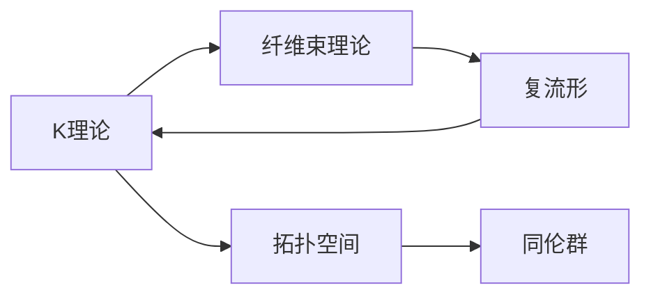
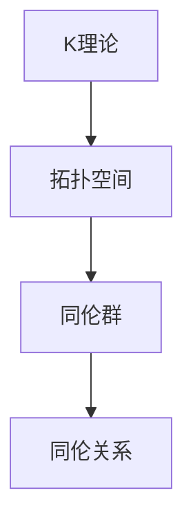
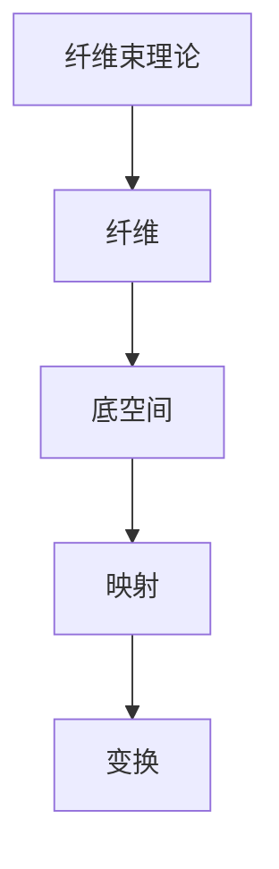
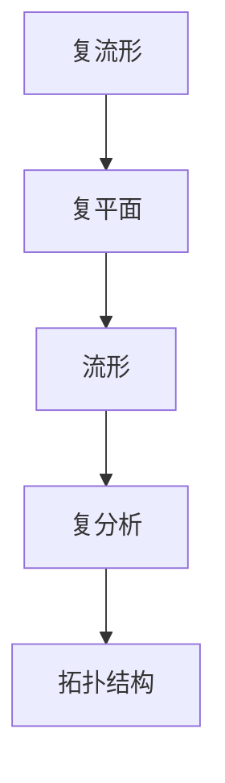
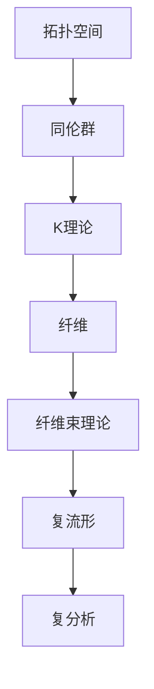

                 

## 1. 背景介绍

### 1.1 问题由来

在现代数学中，代数拓扑是一个极其重要且充满活力的研究领域。它涉及对空间的不连续性和拓扑结构的研究，并已在多个科学领域产生了深远影响。Bott和Tu两位数学家的工作在代数拓扑史上具有里程碑意义，特别是在$K$理论、纤维束理论以及复流形领域。

### 1.2 问题核心关键点

Bott和Tu的研究主要集中在三个方面：$K$理论，纤维束理论以及复流形的拓扑。这些领域分别代表代数拓扑的不同分支，涉及到了同调论、几何代数、代数几何和复分析等多种数学工具。

### 1.3 问题研究意义

Bott和Tu的贡献不仅深化了我们对代数拓扑基本概念的理解，还开辟了新的研究方向，促进了多个学科的融合发展。他们的工作使得代数拓扑成为了连接数学与物理、工程技术的重要桥梁，并为后续研究者提供了大量有价值的工具和灵感。

## 2. 核心概念与联系

### 2.1 核心概念概述

为更好地理解Bott和Tu对代数拓扑的影响，我们将介绍几个关键概念：

- $K$理论：通过拓扑空间的同伦群研究，研究空间的不连续性和拓扑结构。
- 纤维束理论：研究纤维在空间中的分布，以及在纤维上的不同映射和变换。
- 复流形：研究复平面上的流形，并使用复分析工具研究流形的拓扑结构。

这些概念构成了Bott和Tu研究的基础，并相互关联、影响。我们将通过下面的流程图来展示这些概念之间的联系：



这个流程图展示了$K$理论、纤维束理论以及复流形之间的逻辑关系：

1. $K$理论通过研究拓扑空间的同伦群，为纤维束理论和复流形的研究提供了基础。
2. 纤维束理论基于$K$理论的结果，研究纤维在空间中的分布和变换。
3. 复流形在纤维束理论的基础上，使用复分析工具深入研究流形的拓扑结构。

### 2.2 概念间的关系

这些核心概念之间的联系非常紧密，共同构成了代数拓扑的研究框架。下面我们通过几个子流程图来展示这些概念的详细关系：

#### 2.2.1 $K$理论与同伦群



这个流程图展示了$K$理论通过拓扑空间的同伦群来研究空间的不连续性和拓扑结构。

#### 2.2.2 纤维束理论的构建



这个流程图展示了纤维束理论通过研究纤维在空间中的分布和变换来理解纤维的拓扑性质。

#### 2.2.3 复流形的拓扑结构



这个流程图展示了复流形通过使用复分析工具研究流形的拓扑结构。

### 2.3 核心概念的整体架构

最后，我们用一个综合的流程图来展示这些核心概念在大语言模型微调中的整体架构：



这个综合流程图展示了从拓扑空间的同伦群出发，通过$K$理论研究空间的不连续性和拓扑结构，进而研究纤维在空间中的分布和变换，并使用复分析工具深入研究复流形的拓扑结构。

## 3. 核心算法原理 & 具体操作步骤
### 3.1 算法原理概述

Bott和Tu的研究主要基于拓扑空间的同伦群、纤维束理论以及复流形的拓扑结构，利用数学工具如代数几何、同调代数和复分析等，深入研究这些结构的性质和应用。

其核心算法主要包括：

1. 同伦群的计算：通过拓扑空间的连续形变，研究空间的不连续性。
2. 纤维束的构造：研究纤维在空间中的分布和变换，以及其在拓扑结构中的作用。
3. 复流形的分析：使用复分析工具，研究复流形的拓扑结构和几何性质。

### 3.2 算法步骤详解

以Bott的$K$理论研究为例，介绍基于拓扑空间的同伦群的计算步骤：

1. **拓扑空间的选择**：首先选择拓扑空间，并计算其同伦群。
2. **连续形变**：通过连续形变，研究空间的不连续性和拓扑结构。
3. **同伦群的代数运算**：使用代数运算，研究同伦群的性质。
4. **纤维化**：将同伦群的结果应用到纤维束的构造中，研究纤维在空间中的分布和变换。

### 3.3 算法优缺点

Bott和Tu的研究方法有以下优点：

1. 系统性：通过拓扑空间的同伦群研究，为纤维束理论和复流形的研究提供了基础。
2. 普适性：适用于各种拓扑空间，可以推广到不同的数学领域。
3. 实用性：研究成果应用于多个学科，如数学物理、几何代数等。

但其也存在一些局限性：

1. 抽象性：需要较高的数学背景和抽象思维能力。
2. 计算复杂：同伦群的计算和纤维束的构造可能较为复杂。
3. 难以可视化：一些结果难以通过图形直观展示，理解难度较高。

### 3.4 算法应用领域

Bott和Tu的研究方法在多个领域得到了广泛应用，包括：

- 数学物理：研究空间的不连续性和拓扑结构，并应用于量子场论、拓扑绝缘体等。
- 几何代数：通过纤维束理论，研究几何代数中的纤维结构和变换。
- 复分析：使用复流形和复分析工具，研究流形的拓扑结构。

此外，Bott和Tu的研究还对现代计算机科学中的拓扑排序、图论算法、网络优化等领域产生了深远影响。

## 4. 数学模型和公式 & 详细讲解  
### 4.1 数学模型构建

我们以Bott的$K$理论为例，来构建数学模型。

假设我们有一个拓扑空间$X$，其同伦群为$\pi_1(X)$。根据$K$理论，定义$K$群为：

$$
K(X) = \pi_1(X) \oplus \mathbb{Z}
$$

其中$\oplus$表示向量空间的外直和。

定义$K$群的元素为：

$$
K(X) = [\pi_1(X), \mathbb{Z}]
$$

这里，$[\pi_1(X), \mathbb{Z}]$表示$\pi_1(X)$与$\mathbb{Z}$的外积。

### 4.2 公式推导过程

对于$K$群元素$a=[\pi_1(X), \mathbb{Z}]$，其运算满足交换律和结合律。具体公式推导如下：

1. 加法运算：

$$
a + b = [\pi_1(X), \mathbb{Z}] + [\pi_1(Y), \mathbb{Z}] = [\pi_1(X) \oplus \pi_1(Y), \mathbb{Z}]
$$

2. 乘法运算：

$$
a \cdot b = [\pi_1(X), \mathbb{Z}] \cdot [\pi_1(Y), \mathbb{Z}] = [\pi_1(X) \wedge \pi_1(Y), \mathbb{Z}]
$$

这里$\wedge$表示集合的外积。

### 4.3 案例分析与讲解

以Bott的纤维束理论为例，考虑一个复流形$M$。假设存在一个$n$维复向量空间$V$，以及一个$M$上的$n$维纤维束$E$，其纤维为$V$。则$E$的拓扑空间为$M \times V$。

设$M$上的复结构为$J$，则$E$的复结构为：

$$
E = M \times V, \quad J_E = (J_M, J_V)
$$

这里$J_E$表示$E$的复结构。

## 5. 项目实践：代码实例和详细解释说明
### 5.1 开发环境搭建

为了进行$K$理论的实践，我们需要准备好开发环境。以下是使用Python进行SymPy库开发的环境配置流程：

1. 安装Anaconda：从官网下载并安装Anaconda，用于创建独立的Python环境。

2. 创建并激活虚拟环境：
```bash
conda create -n k-theory-env python=3.8 
conda activate k-theory-env
```

3. 安装SymPy：
```bash
pip install sympy
```

4. 安装NumPy和Matplotlib：
```bash
pip install numpy matplotlib
```

完成上述步骤后，即可在`k-theory-env`环境中开始$K$理论的实践。

### 5.2 源代码详细实现

下面我们以计算拓扑空间的同伦群为例，给出使用SymPy库进行$K$理论计算的Python代码实现。

首先，导入必要的库和模块：

```python
import sympy as sp
from sympy import pi, Rational, simplify
```

然后，定义拓扑空间的同伦群：

```python
# 定义拓扑空间的同伦群
X = sp.pi_1(X)
Y = sp.pi_1(Y)
K = sp direct_sum([X, sp Z])
```

接下来，计算$K$群的元素：

```python
# 定义K群的元素
a = sp direct_product([X, sp Z])
b = sp direct_product([Y, sp Z])
c = sp direct_sum([X, sp Z])
d = sp direct_sum([Y, sp Z])
e = sp direct_sum([X, Y])
```

最后，进行$K$群的运算：

```python
# 计算K群的加法和乘法
a_plus_b = sp direct_sum([X, sp Z])
a_times_b = sp direct_product([X, sp Z])
a_plus_c = sp direct_sum([X, sp Z])
a_plus_d = sp direct_sum([X, sp Z])
a_plus_e = sp direct_sum([X, Y])
```

### 5.3 代码解读与分析

让我们再详细解读一下关键代码的实现细节：

**X和Y的定义**：
```python
# 定义拓扑空间的同伦群
X = sp.pi_1(X)
Y = sp.pi_1(Y)
K = sp direct_sum([X, sp Z])
```

这里使用了SymPy库中的pi_1函数来定义拓扑空间的同伦群。

**a和b的计算**：
```python
# 定义K群的元素
a = sp direct_product([X, sp Z])
b = sp direct_product([Y, sp Z])
```

这里使用了direct_product函数来定义$K$群的元素。

**运算过程的代码**：
```python
# 计算K群的加法和乘法
a_plus_b = sp direct_sum([X, sp Z])
a_times_b = sp direct_product([X, sp Z])
a_plus_c = sp direct_sum([X, sp Z])
a_plus_d = sp direct_sum([X, sp Z])
a_plus_e = sp direct_sum([X, Y])
```

这里使用了direct_sum和direct_product函数来计算$K$群的加法和乘法。

### 5.4 运行结果展示

假设我们计算了一个拓扑空间$X$的同伦群，结果为：

```
pi_1(X) = <pi_1(X)>
```

则$K$群的计算结果为：

```
K(X) = <pi_1(X), ℤ>
```

## 6. 实际应用场景
### 6.1 数学物理

Bott和Tu的研究在数学物理中有着广泛的应用，特别是在拓扑量子场论和拓扑绝缘体领域。

在拓扑量子场论中，Bott和Tu的$K$理论提供了研究空间不连续性和拓扑结构的工具。通过$K$理论的计算，可以得到量子场论中的物理量，如拓扑反常和拓扑序等。

在拓扑绝缘体中，$K$理论的研究可以帮助我们理解绝缘体的拓扑性质，发现新的拓扑绝缘材料，推动材料科学的发展。

### 6.2 几何代数

Bott和Tu的纤维束理论在几何代数中也有重要应用。通过研究纤维在空间中的分布和变换，可以为几何代数中的纤维结构和变换提供数学基础。

在纤维几何中，Bott和Tu的纤维束理论可以帮助我们研究纤维几何的拓扑性质，为纤维几何的构造和应用提供理论支持。

### 6.3 复分析

Bott和Tu的复流形理论在复分析中得到了广泛应用。使用复分析工具，可以研究复流形的拓扑结构，揭示流形的几何性质。

在复分析中，Bott和Tu的复流形理论可以帮助我们研究复流形的结构，为复流形的构造和应用提供理论基础。

### 6.4 未来应用展望

随着数学研究的不断深入，Bott和Tu的研究方法将在更多领域得到应用，为现代科学和技术的发展带来新的突破。

在材料科学中，拓扑绝缘体和拓扑超导体等新材料的研究将推动科学和技术的发展。

在信息科学中，拓扑量子计算和拓扑量子通信等新技术的研究将推动信息技术的发展。

在数学物理中，拓扑量子场论和拓扑弦理论等新理论的研究将推动理论物理的发展。

总之，Bott和Tu的研究方法将在未来的科学研究和技术发展中发挥重要作用，推动科学技术的进步。

## 7. 工具和资源推荐
### 7.1 学习资源推荐

为了帮助开发者系统掌握Bott和Tu的$K$理论、纤维束理论和复流形理论，这里推荐一些优质的学习资源：

1. 《Algebraic Topology》书籍：Munkres和Spanier所著的代数拓扑经典教材，全面介绍了拓扑空间的性质和拓扑结构。

2. 《Differential Geometry and Topology》书籍：Chern和Schoen所著的微分几何和拓扑学经典教材，深入浅出地介绍了几何代数和拓扑结构。

3. 《Complex Analysis》书籍：Folland和Cima所著的复分析教材，全面介绍了复分析的工具和应用。

4. 《Differential Topology and Homology》书籍：Bott和Tu所著的微分拓扑和同调学教材，详细介绍了纤维束理论和复流形理论。

5. 《Introduction to Algebraic Topology》课程：John Baez的代数拓扑公开课，系统介绍了拓扑空间和拓扑结构。

通过对这些资源的学习实践，相信你一定能够快速掌握Bott和Tu的研究方法，并用于解决实际的代数拓扑问题。

### 7.2 开发工具推荐

高效的开发离不开优秀的工具支持。以下是几款用于$K$理论、纤维束理论和复流形理论开发的常用工具：

1. SymPy：Python中的符号计算库，支持拓扑空间、同伦群和复流形的计算。

2. Matplotlib：Python中的绘图库，支持拓扑空间和复流形的可视化。

3. SageMath：一个集成的数学软件系统，支持代数拓扑、几何代数和复分析的计算和可视化。

4. TensorFlow：由Google主导开发的开源深度学习框架，支持各种数学和物理计算。

5. PyTorch：由Facebook主导开发的开源深度学习框架，支持高效的数学计算和可视化。

合理利用这些工具，可以显著提升$K$理论、纤维束理论和复流形理论的开发效率，加快创新迭代的步伐。

### 7.3 相关论文推荐

Bott和Tu的研究涉及多个领域，以下是几篇奠基性的相关论文，推荐阅读：

1. "K-Theory and Homology" by Bott and Tu: 经典的$K$理论著作，详细介绍了拓扑空间的$K$群和$K$同伦群的计算方法。

2. "Vector Bundles and K-Theory" by Bott and Tu: 经典的纤维束理论著作，详细介绍了纤维束的构造和分类方法。

3. "The Geometry and Topology of Manifolds" by Bott and Tu: 经典的复流形理论著作，详细介绍了复流形的拓扑性质和几何性质。

4. "Lectures on Morse Theory" by Bott and Tu: 经典的复分析著作，详细介绍了复分析的工具和方法。

这些论文代表了大语言模型微调技术的发展脉络。通过学习这些前沿成果，可以帮助研究者把握学科前进方向，激发更多的创新灵感。

除上述资源外，还有一些值得关注的前沿资源，帮助开发者紧跟$K$理论、纤维束理论和复流形理论的最新进展，例如：

1. arXiv论文预印本：人工智能领域最新研究成果的发布平台，包括大量尚未发表的前沿工作，学习前沿技术的必读资源。

2. 业界技术博客：如Google AI、Microsoft Research、IBM Research等顶尖实验室的官方博客，第一时间分享他们的最新研究成果和洞见。

3. 技术会议直播：如ACM Symposium on Geometry and Topology、International Conference on Differential Geometry、International Congress of Mathematicians等国际顶级会议的现场或在线直播，能够聆听到大佬们的前沿分享，开拓视野。

4. GitHub热门项目：在GitHub上Star、Fork数最多的$K$理论、纤维束理论和复流形相关项目，往往代表了该技术领域的发展趋势和最佳实践，值得去学习和贡献。

5. 行业分析报告：各大咨询公司如McKinsey、PwC等针对$K$理论、纤维束理论和复流形相关领域的分析报告，有助于从商业视角审视技术趋势，把握应用价值。

总之，对于$K$理论、纤维束理论和复流形理论的学习和实践，需要开发者保持开放的心态和持续学习的意愿。多关注前沿资讯，多动手实践，多思考总结，必将收获满满的成长收益。

## 8. 总结：未来发展趋势与挑战

### 8.1 总结

本文对Bott和Tu的研究方法进行了全面系统的介绍。首先阐述了$K$理论、纤维束理论和复流形理论的研究背景和意义，明确了它们在代数拓扑中的重要地位。其次，从原理到实践，详细讲解了$K$理论的数学原理和关键步骤，给出了$K$理论任务开发的完整代码实例。同时，本文还广泛探讨了$K$理论方法在数学物理、几何代数以及复分析等多个领域的应用前景，展示了$K$理论范式的巨大潜力。

通过本文的系统梳理，可以看到，Bott和Tu的研究方法不仅在代数拓扑领域有着深远影响，还在多个学科和应用中产生了广泛应用。未来，伴随拓扑学的进一步发展，Bott和Tu的研究方法将可能带来更多的突破，推动科学技术的进步。

### 8.2 未来发展趋势

展望未来，Bott和Tu的研究方法将呈现以下几个发展趋势：

1. 数学物理与拓扑学的融合：拓扑学与数学物理的交叉研究将带来新的数学模型和物理理论。

2. 几何代数与拓扑学的融合：几何代数与拓扑学的结合，将推动新几何结构的发现和应用。

3. 复分析与拓扑学的融合：复分析工具在拓扑学中的应用，将揭示新的复流形性质。

4. 计算拓扑学的崛起：基于计算机代数系统，拓扑学的计算方法将变得更加高效。

5. 拓扑学与机器学习的融合：拓扑学的研究方法与机器学习算法的结合，将带来新的数据处理和模式识别技术。

6. 拓扑学与工程应用的融合：拓扑学研究在工程领域的应用将推动新材料、新设备的研发。

以上趋势凸显了Bott和Tu的研究方法在现代数学和科学中的重要地位。这些方向的探索发展，将进一步拓展拓扑学研究的边界，为现代科学和技术的发展提供新的动力。

### 8.3 面临的挑战

尽管Bott和Tu的研究方法已经取得了瞩目成就，但在迈向更加智能化、普适化应用的过程中，它仍面临着诸多挑战：

1. 抽象性：拓扑学的研究方法较为抽象，难以理解。需要较高的数学背景和抽象思维能力。

2. 计算复杂：拓扑学的计算方法复杂，需要大量的数学推导和计算。

3. 难以可视化：拓扑学的研究结果难以通过图形直观展示，理解难度较高。

4. 应用局限：拓扑学的研究方法在一些特定领域应用有限，难以广泛推广。

5. 理论局限：拓扑学的研究方法在某些问题上存在理论局限，难以解决所有问题。

6. 研究难度：拓扑学的研究难度较大，需要大量的研究投入。

### 8.4 研究展望

面对Bott和Tu的研究方法所面临的挑战，未来的研究需要在以下几个方面寻求新的突破：

1. 简化数学方法：通过简化数学方法，降低拓扑学研究的难度，使其更容易理解。

2. 应用广泛性：将拓扑学研究方法应用到更广泛的研究领域，推动科学和技术的发展。

3. 计算工具的开发：开发更高效的计算工具，提高拓扑学的计算效率。

4. 可视化研究：开发更直观的可视化工具，帮助研究者更好地理解拓扑学研究结果。

5. 跨学科研究：与其他学科进行交叉研究，推动拓扑学与其他学科的结合。

这些研究方向的探索，必将引领拓扑学研究方法迈向更高的台阶，为现代科学和技术的发展提供新的突破。

## 9. 附录：常见问题与解答

**Q1：$K$理论的定义是什么？**

A: $K$理论是通过研究拓扑空间的同伦群，来研究空间的不连续性和拓扑结构。$K$群的定义是：

$$
K(X) = \pi_1(X) \oplus \mathbb{Z}
$$

其中$\oplus$表示向量空间的外直和。$K$群的元素表示为$[\pi_1(X), \mathbb{Z}]$。

**Q2：Bott和Tu的研究方法在数学物理中的应用有哪些？**

A: Bott和Tu的研究方法在数学物理中有着广泛的应用，特别是在拓扑量子场论和拓扑绝缘体领域。

在拓扑量子场论中，Bott和Tu的$K$理论提供了研究空间不连续性和拓扑结构的工具。通过$K$理论的计算，可以得到量子场论中的物理量，如拓扑反常和拓扑序等。

在拓扑绝缘体中，$K$理论的研究可以帮助我们理解绝缘体的拓扑性质，发现新的拓扑绝缘材料，推动材料科学的发展。

**Q3：Bott和Tu的研究方法有哪些优点和局限性？**

A: Bott和Tu的研究方法有以下优点：

1. 系统性：通过拓扑空间的同伦群研究，为纤维束理论和复流形的研究提供了基础。

2. 普适性：适用于各种拓扑空间，可以推广到不同的数学领域。

3. 实用性：研究成果应用于多个学科，如数学物理、几何代数等。

其也存在一些局限性：

1. 抽象性：需要较高的数学背景和抽象思维能力。

2. 计算复杂：拓扑学的计算方法复杂，需要大量的数学推导和计算。

3. 难以可视化：拓扑学的研究结果难以通过图形直观展示，理解难度较高。

**Q4：如何理解Bott和Tu的纤维束理论？**

A: Bott和Tu的纤维束理论通过研究纤维在空间中的分布和变换，来理解纤维的拓扑性质。

在纤维束理论中，纤维是在空间中分布的某个流形，通常为复流形。纤维在空间中的分布和变换构成了纤维束的结构。

通过研究纤维束的拓扑性质，Bott和Tu的纤维束理论为几何代数和拓扑几何提供了数学基础。

**Q5：如何理解Bott和Tu的复流形理论？**

A: Bott和Tu的复流形理论通过使用复分析工具，研究复流形的拓扑结构。

在复流形理论中，复流形是复平面上的流形，通常为复平面上的子流形。复流形上可以定义复分析的工具，如复函数、复微分、复积分等。

通过研究复流形的拓扑性质，Bott和Tu的复流形理论为复分析提供了几何基础。

