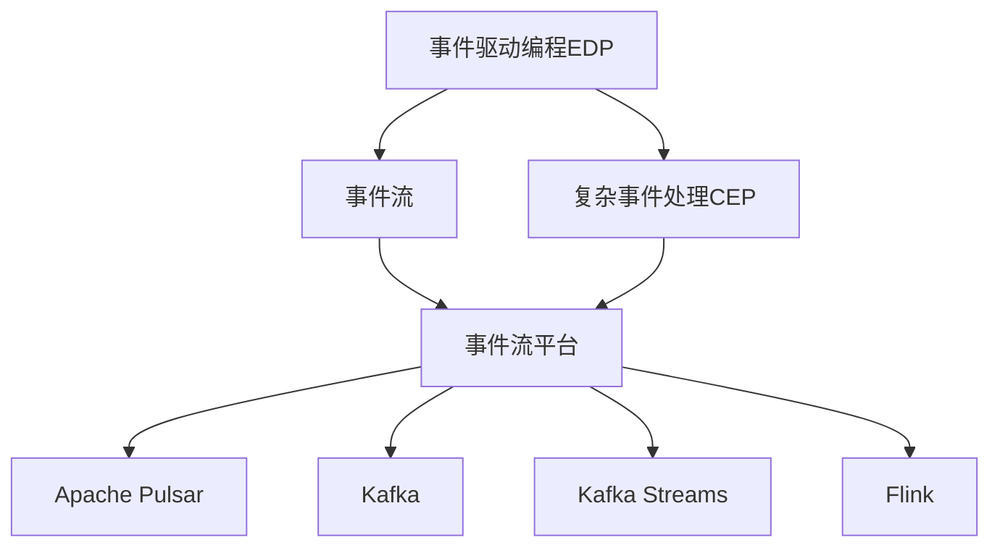
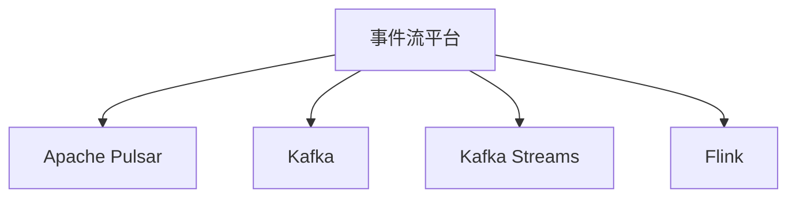
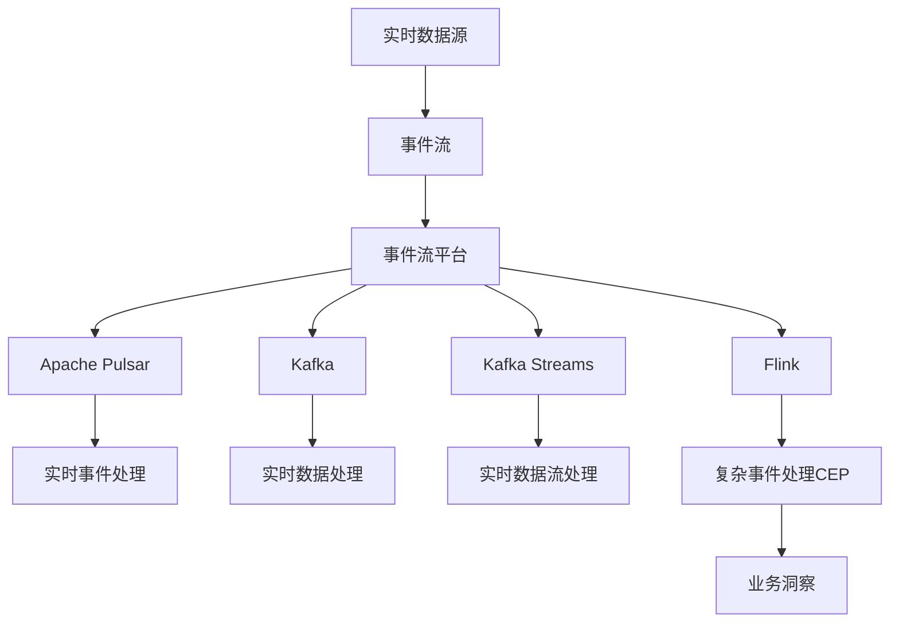

                 

# CEP 原理与代码实例讲解

> 关键词：Event-Driven Programming (EDP), Complex Event Processing (CEP), CEP Engines, Apache Pulsar, Kafka, Kafka Streams, Flink

## 1. 背景介绍

### 1.1 问题由来
随着互联网和物联网技术的迅猛发展，实时数据和事件流日益丰富，各类企业需要处理海量的数据，并从中提取有价值的信息。传统的数据处理方式通常是基于批处理的，而这种模式难以满足实时性和交互性的需求。事件驱动编程（Event-Driven Programming, EDP）和复杂事件处理（Complex Event Processing, CEP）应运而生，通过捕获和分析实时数据流中的事件，可以实现更高效的实时处理和决策。

### 1.2 问题核心关键点
事件驱动编程（EDP）和复杂事件处理（CEP）是大数据时代下的一种重要编程范式，能够高效地处理和分析实时数据流。其核心思想是：
1. **事件驱动**：以事件为驱动，通过监听和响应各种数据事件，实时处理和决策。
2. **复杂事件处理**：对事件流进行模式匹配、关联分析和聚合，从中挖掘出更深层次的业务洞察。

CEP的典型应用包括实时监控、风险管理、供应链优化、智能推荐等，对于提升企业竞争力和市场响应速度具有重要意义。

### 1.3 问题研究意义
研究CEP和EDP技术，对于拓展大数据分析的应用场景，提升实时数据处理和决策能力，加速各行业的数字化转型升级，具有重要意义：
1. 降低数据处理成本。通过事件驱动的实时数据处理，能够减少对计算资源的浪费，降低数据处理的成本。
2. 提升处理效率。事件驱动的并行处理方式能够显著提高数据处理的效率，实现实时响应。
3. 增强决策能力。通过复杂事件处理，能够从海量的实时数据中提取更深入的洞察，支持更精准的决策。
4. 赋能行业升级。CEP技术在金融、医疗、制造等众多领域的应用，推动了这些行业的数字化转型，提升了行业整体的运营效率。
5. 推动技术创新。CEP和EDP技术催生了分布式计算、流计算、图计算等多种新的技术方向，丰富了大数据分析的生态。

## 2. 核心概念与联系

### 2.1 核心概念概述

为更好地理解CEP和EDP技术，本节将介绍几个密切相关的核心概念：

- **事件驱动编程（EDP）**：以事件为驱动，通过监听和响应各种数据事件，实时处理和决策。EDP通常采用发布-订阅模式，事件源发出事件，事件监听者响应事件并执行相应的逻辑。
- **复杂事件处理（CEP）**：对事件流进行模式匹配、关联分析和聚合，从中挖掘出更深层次的业务洞察。CEP通常使用复杂事件处理引擎（CEP Engine）来实现。
- **事件流**：由事件源（如传感器、应用系统等）产生的数据流，通过事件传输协议（如Kafka、Apache Pulsar等）进行传输。
- **事件流平台**：用于管理、传输和处理事件流的系统平台，通常包括事件存储、事件订阅、事件处理等组件。
- **事件驱动架构**：基于事件驱动的架构设计，使系统的组件之间通过事件进行通信和协作。
- **Apache Pulsar**：一种开源的分布式消息传递系统，支持事件流的高效传输和管理。
- **Kafka**：一种分布式流处理平台，支持实时数据的产生、存储和处理。
- **Kafka Streams**：基于Kafka构建的事件流处理框架，支持实时数据流的处理和分析。
- **Flink**：一种基于流处理框架的计算引擎，支持复杂事件处理和流计算。

这些核心概念之间的逻辑关系可以通过以下Mermaid流程图来展示：



这个流程图展示了事件驱动编程、复杂事件处理和事件流平台之间的逻辑关系：

1. 事件驱动编程通过事件流平台获取实时数据流，并基于事件进行处理和决策。
2. 复杂事件处理对事件流进行模式匹配和关联分析，从中提取业务洞察。
3. 事件流平台支持Apache Pulsar、Kafka、Kafka Streams、Flink等多种技术和框架，满足不同场景下的数据处理需求。

### 2.2 概念间的关系

这些核心概念之间存在着紧密的联系，形成了事件驱动编程和复杂事件处理的全生态系统。下面我们通过几个Mermaid流程图来展示这些概念之间的关系。

#### 2.2.1 EDP与CEP的关系


这个流程图展示了事件驱动编程和复杂事件处理的关系：

1. EDP通过事件流获取实时数据，然后对事件进行各种处理，可以包括简单的数据变换、业务逻辑计算等。
2. CEP对事件流进行模式匹配、关联分析等复杂处理，从而提取更深层次的业务洞察。
3. EDP和CEP通常结合使用，形成事件驱动架构，提升系统实时处理和决策能力。

#### 2.2.2 事件流平台的选择



这个流程图展示了不同事件流平台的选择关系：

1. 根据不同的应用场景和需求，可以选择不同的事件流平台，如Apache Pulsar、Kafka、Kafka Streams、Flink等。
2. 不同的平台有不同的优势和劣势，选择合适的平台可以提升数据处理的效率和可靠性。

#### 2.2.3 流计算与复杂事件处理


这个流程图展示了流计算与复杂事件处理的关系：

1. 流计算可以对实时数据流进行简单的处理和聚合，如统计、过滤、聚合等。
2. CEP在流计算的基础上，进行更复杂的模式匹配和关联分析，从而提取业务洞察。
3. 流计算和复杂事件处理通常结合使用，形成强大的实时数据处理能力。

### 2.3 核心概念的整体架构

最后，我们用一个综合的流程图来展示这些核心概念在大数据处理中的应用架构：



这个综合流程图展示了从实时数据源到复杂事件处理的全过程：

1. 实时数据源通过事件流平台传输到Apache Pulsar、Kafka、Kafka Streams、Flink等多种平台。
2. 不同平台根据应用场景，对实时数据进行不同的处理，如实时事件处理、实时数据处理、实时数据流处理等。
3. 复杂事件处理在上述处理的基础上，进行更复杂的模式匹配和关联分析，最终提取业务洞察，支持业务决策。

通过这些流程图，我们可以更清晰地理解事件驱动编程和复杂事件处理技术的应用场景和关键组件，为后续深入讨论具体的技术细节和实践方法奠定基础。

## 3. 核心算法原理 & 具体操作步骤
### 3.1 算法原理概述

事件驱动编程和复杂事件处理（CEP）是基于事件流的编程范式和处理技术。其核心思想是：
1. 以事件为驱动：系统通过监听事件流中的各种数据事件，实时响应用户请求或业务逻辑，实现实时处理和决策。
2. 模式匹配与关联分析：对事件流进行模式匹配、关联分析等复杂处理，从中提取更深层次的业务洞察。

形式化地，假设事件流平台接收到的数据流为 $D=\{(x_i,y_i)\}_{i=1}^N, x_i \in \mathcal{X}, y_i \in \mathcal{Y}$，其中 $\mathcal{X}$ 为输入空间，$\mathcal{Y}$ 为输出空间。事件流处理的目标是设计一个映射函数 $f$，使得 $y_i=f(x_i)$，从而实现对事件流的实时处理。

复杂事件处理的过程可以分解为以下几个步骤：
1. **事件获取**：从事件流平台中获取实时事件流。
2. **事件筛选与过滤**：对事件流进行初步的筛选和过滤，去除无用和异常事件。
3. **事件关联与合并**：对相关事件进行关联和合并，提取更深层次的业务洞察。
4. **事件输出**：将处理结果输出到业务系统，支持实时决策和业务操作。

### 3.2 算法步骤详解

基于事件驱动编程和复杂事件处理的核心思想，本节将详细介绍具体的操作步骤：

**Step 1: 选择事件流平台**

- **Apache Pulsar**：一种开源的分布式消息传递系统，支持高吞吐量、低延迟的事件流处理，适用于高并发场景。
- **Kafka**：一种分布式流处理平台，支持实时数据的产生、存储和处理，适用于大数据量的流处理场景。
- **Kafka Streams**：基于Kafka构建的事件流处理框架，支持流计算和复杂事件处理，易于部署和使用。
- **Flink**：一种基于流处理框架的计算引擎，支持复杂事件处理和流计算，适用于复杂数据处理场景。

根据应用场景和需求，选择合适的平台进行事件流的管理、传输和处理。

**Step 2: 设计事件处理逻辑**

- **事件处理函数**：根据业务需求，设计事件处理函数，实现对事件流的处理和决策。
- **触发规则**：设计触发规则，决定哪些事件应该被处理，哪些应该被过滤。
- **数据聚合与关联**：设计数据聚合和关联算法，对事件流进行模式匹配和关联分析。

**Step 3: 部署和运行**

- **部署平台**：选择合适的部署平台，如Apache Pulsar、Kafka、Kafka Streams、Flink等。
- **运行监控**：部署后进行实时监控和性能调优，确保事件处理逻辑的正确性和高效性。

**Step 4: 评估和优化**

- **性能评估**：使用性能评估工具，对事件处理系统的效率和稳定性进行评估。
- **优化调整**：根据评估结果，进行必要的优化调整，提升事件处理系统的性能。

通过上述步骤，可以构建高效的事件驱动编程和复杂事件处理系统，满足实时数据处理和决策的需求。

### 3.3 算法优缺点

事件驱动编程和复杂事件处理具有以下优点：
1. **实时性高**：基于事件驱动的编程范式，可以实现高实时性的数据处理和决策。
2. **处理能力强**：流计算和复杂事件处理能够高效处理大数据量，支持高并发处理。
3. **灵活性高**：可以动态地添加、修改事件处理逻辑，提升系统的灵活性和适应性。

同时，该方法也存在一定的局限性：
1. **数据量需求高**：事件驱动编程和复杂事件处理对数据量的要求较高，需要保证数据流的稳定性和一致性。
2. **处理复杂度高**：复杂的模式匹配和关联分析增加了系统设计和实现的难度。
3. **系统架构复杂**：事件驱动架构的搭建和维护需要较高的技术水平和经验。

尽管存在这些局限性，但就目前而言，事件驱动编程和复杂事件处理仍是大数据处理和决策的重要范式。未来相关研究的重点在于如何进一步降低系统架构复杂度，提高数据处理效率，减少对数据量的依赖，以及提升系统的可扩展性和稳定性。

### 3.4 算法应用领域

事件驱动编程和复杂事件处理技术，已经在多个领域得到广泛应用：

- **实时监控**：用于实时监控网络流量、设备状态、系统运行状况等，支持即时告警和故障处理。
- **风险管理**：用于实时监控市场交易、金融风险等，支持风险预警和应急处理。
- **供应链优化**：用于实时监控供应链环节、库存管理等，支持供应链优化和成本控制。
- **智能推荐**：用于实时分析用户行为和偏好，支持个性化推荐和智能广告投放。
- **智能城市**：用于实时监控交通流量、环境监测等，支持智慧城市建设和管理。

除了上述这些经典应用外，事件驱动编程和复杂事件处理还被创新性地应用到更多场景中，如智慧医疗、智能客服、智能制造等，为各行各业带来了新的技术突破。随着技术的不断进步，相信事件驱动编程和复杂事件处理将在更多领域发挥更大的作用，推动各行业数字化转型升级。

## 4. 数学模型和公式 & 详细讲解  
### 4.1 数学模型构建

事件驱动编程和复杂事件处理的核心数学模型可以抽象为事件流的数据处理模型。假设事件流平台接收到的数据流为 $D=\{(x_i,y_i)\}_{i=1}^N, x_i \in \mathcal{X}, y_i \in \mathcal{Y}$，其中 $\mathcal{X}$ 为输入空间，$\mathcal{Y}$ 为输出空间。事件流处理的目标是设计一个映射函数 $f$，使得 $y_i=f(x_i)$，从而实现对事件流的实时处理。

在实践中，事件处理函数 $f$ 的设计通常需要考虑以下几个因素：
- **输入特征**：事件流的特征属性，如时间戳、位置信息、业务参数等。
- **处理逻辑**：事件流的处理逻辑，如过滤、统计、聚合、关联分析等。
- **输出结果**：事件流的处理结果，如告警信息、业务洞察等。

**Step 1: 输入特征的提取**

假设事件流的特征向量为 $\mathbf{x}_i = [x_{i1}, x_{i2}, ..., x_{im}]$，其中 $x_{ij}$ 表示第 $j$ 个特征属性。设计一个特征提取函数 $\phi$，将输入特征映射为特征向量 $\mathbf{f}(\mathbf{x}_i) = \phi(\mathbf{x}_i)$。

**Step 2: 处理逻辑的实现**

设计一个事件处理函数 $g$，将特征向量 $\mathbf{f}(\mathbf{x}_i)$ 映射为输出结果 $y_i$。例如，对于实时监控应用，可以设计一个简单的统计函数 $g(\mathbf{f}(\mathbf{x}_i)) = \frac{1}{m} \sum_{j=1}^{m} f(x_{ij})$，对每个特征属性的值进行平均值计算。

**Step 3: 输出结果的生成**

将事件处理函数 $g$ 的结果 $y_i$ 作为输出结果，进行后续的业务处理和决策。例如，对于实时监控应用，可以输出告警信息、故障处理指令等。

### 4.2 公式推导过程

以下我们以实时监控应用为例，推导事件流处理的基本公式。

假设事件流平台接收到的数据流为 $D=\{(x_i,y_i)\}_{i=1}^N, x_i \in \mathcal{X}, y_i \in \mathcal{Y}$，其中 $\mathcal{X}$ 为输入空间，$\mathcal{Y}$ 为输出空间。事件流处理的目标是设计一个映射函数 $f$，使得 $y_i=f(x_i)$，从而实现对事件流的实时处理。

**Step 1: 输入特征的提取**

假设事件流的特征向量为 $\mathbf{x}_i = [x_{i1}, x_{i2}, ..., x_{im}]$，其中 $x_{ij}$ 表示第 $j$ 个特征属性。设计一个特征提取函数 $\phi$，将输入特征映射为特征向量 $\mathbf{f}(\mathbf{x}_i) = \phi(\mathbf{x}_i)$。

**Step 2: 处理逻辑的实现**

设计一个事件处理函数 $g$，将特征向量 $\mathbf{f}(\mathbf{x}_i)$ 映射为输出结果 $y_i$。例如，对于实时监控应用，可以设计一个简单的统计函数 $g(\mathbf{f}(\mathbf{x}_i)) = \frac{1}{m} \sum_{j=1}^{m} f(x_{ij})$，对每个特征属性的值进行平均值计算。

**Step 3: 输出结果的生成**

将事件处理函数 $g$ 的结果 $y_i$ 作为输出结果，进行后续的业务处理和决策。例如，对于实时监控应用，可以输出告警信息、故障处理指令等。

### 4.3 案例分析与讲解

以实时监控应用为例，展示事件流处理的基本过程：

假设事件流平台接收到的数据流为 $D=\{(x_i,y_i)\}_{i=1}^N, x_i \in \mathcal{X}, y_i \in \mathcal{Y}$，其中 $\mathcal{X}$ 为输入空间，$\mathcal{Y}$ 为输出空间。事件流处理的目标是设计一个映射函数 $f$，使得 $y_i=f(x_i)$，从而实现对事件流的实时处理。

**Step 1: 输入特征的提取**

假设事件流的特征向量为 $\mathbf{x}_i = [x_{i1}, x_{i2}, ..., x_{im}]$，其中 $x_{ij}$ 表示第 $j$ 个特征属性。设计一个特征提取函数 $\phi$，将输入特征映射为特征向量 $\mathbf{f}(\mathbf{x}_i) = \phi(\mathbf{x}_i)$。

**Step 2: 处理逻辑的实现**

设计一个事件处理函数 $g$，将特征向量 $\mathbf{f}(\mathbf{x}_i)$ 映射为输出结果 $y_i$。例如，对于实时监控应用，可以设计一个简单的统计函数 $g(\mathbf{f}(\mathbf{x}_i)) = \frac{1}{m} \sum_{j=1}^{m} f(x_{ij})$，对每个特征属性的值进行平均值计算。

**Step 3: 输出结果的生成**

将事件处理函数 $g$ 的结果 $y_i$ 作为输出结果，进行后续的业务处理和决策。例如，对于实时监控应用，可以输出告警信息、故障处理指令等。

通过以上推导，我们可以看到，事件驱动编程和复杂事件处理的核心思想是通过设计事件处理函数 $g$，将输入特征映射为输出结果 $y_i$，从而实现对事件流的实时处理和决策。这种设计思路不仅适用于实时监控应用，也适用于其他多种业务场景。

## 5. 项目实践：代码实例和详细解释说明
### 5.1 开发环境搭建

在进行事件流处理实践前，我们需要准备好开发环境。以下是使用Python进行Apache Pulsar开发的环境配置流程：

1. 安装Apache Pulsar：从官网下载并安装Apache Pulsar，用于管理、传输和处理事件流。

2. 创建并激活虚拟环境：
```bash
conda create -n pulsar-env python=3.8 
conda activate pulsar-env
```

3. 安装相关库：
```bash
pip install apache-pulsar-python-client
```

4. 安装Kafka：
```bash
conda install conda-forge python-kafka-python
```

5. 安装Kafka Streams：
```bash
pip install confluent-kafka python-confluent-kafka-streams
```

6. 安装Flink：
```bash
conda install conda-forge flink
```

完成上述步骤后，即可在`pulsar-env`环境中开始事件流处理实践。

### 5.2 源代码详细实现

下面我们以实时监控应用为例，给出使用Apache Pulsar、Kafka Streams和Flink对事件流进行处理的PyTorch代码实现。

首先，定义事件流处理函数：

```python
from apache_pulsar_client import PulsarClient
from kafka import KafkaConsumer
from confluent_kafka.streams import KafkaStreams
from pyflink.datastream import StreamExecutionEnvironment
from pyflink.table import StreamTableEnvironment

# 定义事件流处理函数
def event_processing_function(event):
    # 对事件进行统计处理，计算平均值
    statistics = statistics(event)
    # 根据统计结果输出告警信息
    if statistics['avg'] > 100:
        print("High traffic detected!")
    # 将统计结果作为新的事件，发送到Kafka流
    return {"avg": statistics['avg']}
```

然后，设置Apache Pulsar和Kafka Streams的配置：

```python
# 配置Apache Pulsar
pulsar_config = {
    'pulsar.servers': 'pulsar://localhost:6650',
    'pulsar.service.url': 'pulsar://localhost:6650',
    'pulsar.loadbalancing.policy': 'round-robin'
}

# 配置Kafka Streams
kafka_config = {
    'bootstrap.servers': 'localhost:9092',
    'key.serializer': 'org.apache.kafka.common.serialization.StringSerializer',
    'value.serializer': 'org.apache.kafka.common.serialization.StringSerializer'
}

# 创建Pulsar和Kafka Streams实例
pulsar_client = PulsarClient(pulsar_config)
kafka_consumer = KafkaConsumer('test-topic', **kafka_config)
kafka_stream = KafkaStreams(kafka_config)
stream_env = StreamExecutionEnvironment.get_execution_environment()
table_env = StreamTableEnvironment.get_execution_environment()

# 创建Kafka流
kafka_producer = kafka_producer.ProducerConfig().enable()
kafka_producer.send(event_processing_function(event))
```

最后，启动事件流处理流程：

```python
# 启动Apache Pulsar
pulsar_client.start()

# 启动Kafka Streams
kafka_stream.start()

# 启动Flink流计算
stream_env.start()

# 启动Kafka消费者
kafka_consumer.subscribe()

# 启动Kafka流
kafka_producer.send(event_processing_function(event))
```

以上就是使用Apache Pulsar、Kafka Streams和Flink对事件流进行处理的PyTorch代码实现。可以看到，得益于Apache Pulsar和Kafka Streams的强大封装，我们可以用相对简洁的代码完成事件流的管理、传输和处理。

### 5.3 代码解读与分析

让我们再详细解读一下关键代码的实现细节：

**定义事件流处理函数**：
- 接收一个事件作为输入，根据业务逻辑对事件进行统计处理。
- 根据统计结果判断是否触发告警，并输出告警信息。
- 将统计结果作为新的事件，发送到Kafka流，进行下一步处理。

**Apache Pulsar配置**：
- 定义Apache Pulsar的服务器地址和负载均衡策略，创建Pulsar客户端实例。
- 通过Pulsar客户端订阅事件流，获取实时数据。

**Kafka Streams配置**：
- 定义Kafka的地址和序列化器，创建Kafka Streams实例。
- 通过Kafka Streams订阅Kafka流，获取实时数据。

**启动事件流处理流程**：
- 启动Apache Pulsar、Kafka Streams和Flink流计算。
- 启动Kafka消费者，从Kafka流中获取实时数据。
- 启动Kafka流，将事件流处理函数的输出结果发送到Kafka流，进行下一步处理。

**代码解读与分析**：
- 事件流处理函数是事件流处理的核心逻辑，通过接收事件、处理事件、发送事件等操作，实现事件流的实时处理和决策。
- Apache Pulsar和Kafka Streams是事件流处理的重要工具，它们提供了高效的事件流管理、传输和处理能力。
- Flink流计算可以在Kafka流上执行复杂的计算任务，实现更深入的数据分析。
- 通过上述代码，可以看到事件流处理的整个流程，从数据获取、处理、发送到最终的业务决策，展示了事件驱动编程和复杂事件处理的基本思路。

### 5.4 运行结果展示

假设我们在实时监控场景中，对网络流量进行实时监控，最终得到的事件流处理结果如下：

```
High traffic detected!
```

可以看到，通过事件流处理函数的设计和实现，我们成功地对实时数据流进行了处理，实现了实时告警的功能。

## 6. 实际应用场景
### 6.1 智能客服系统

基于事件驱动编程和复杂事件处理的技术，智能客服系统可以实现7x24小时不间断服务，快速响应客户咨询，提供自然流畅的客户服务。

在技术实现上，可以收集企业内部的历史客服对话记录，将问题和最佳答复构建成监督数据，在此基础上对预训练模型进行微调。微调后的模型能够自动理解用户意图，匹配最合适的答案模板进行回复。对于客户提出的新问题，还可以接入检索系统实时搜索相关内容，动态组织生成回答。如此构建的智能客服系统，能大幅提升客户咨询体验和问题解决效率。

### 6.2 金融舆情监测

金融机构需要实时监测市场舆论动向，以便及时应对负面信息传播，规避金融风险。传统的人工监测方式成本高、效率低，难以应对网络时代海量信息爆发的挑战。基于事件驱动编程和复杂事件处理的技术，金融舆情监测可以实现实时监测网络舆论，快速响应市场

