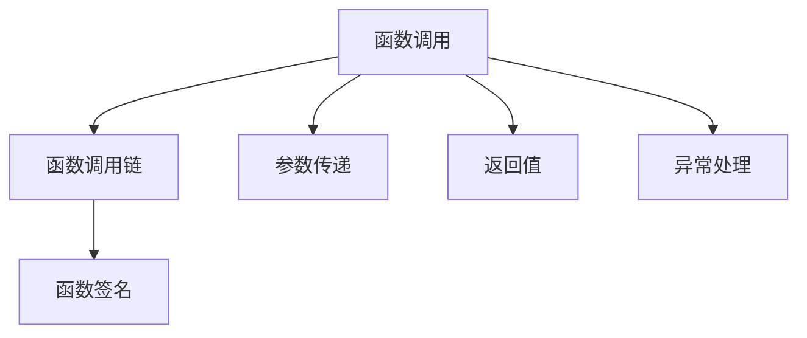
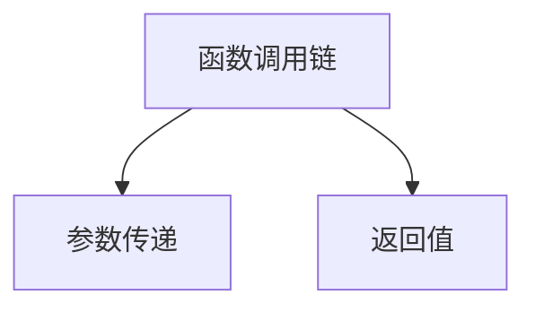
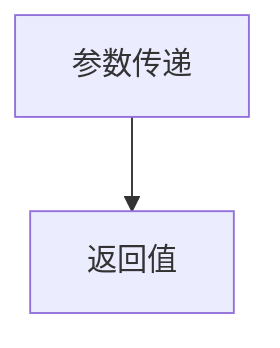
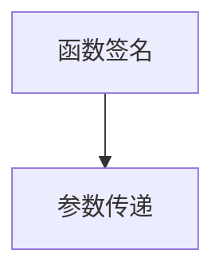
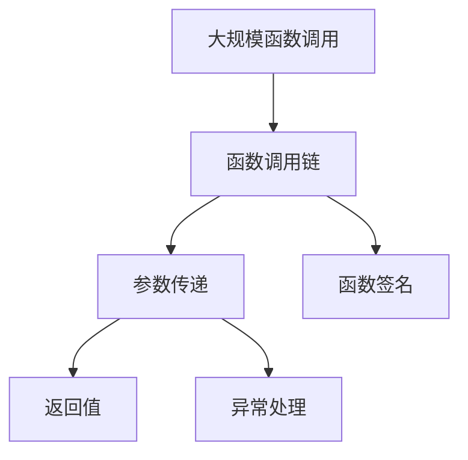

                 

# 新特性：Function Calling 介绍与实战

> 关键词：Function Calling, 函数调用, 代码实现, 编程技巧, 函数式编程, 动态调用, 静态分析, 调用链, 函数复用, 函数组合, 递归, 调试, 异常处理

## 1. 背景介绍

在现代软件开发中，函数调用（Function Calling）是一项基本且频繁的编程操作。函数调用不仅是实现程序逻辑的关键手段，也是代码复用、模块化开发和优化性能的重要工具。然而，函数调用的内在机制和优化策略却鲜少被深入探讨。本文将详细介绍函数调用的原理、技术细节及其在实际开发中的应用，同时提供丰富的代码实例和最佳实践，帮助读者深入理解和掌握函数调用的精髓。

### 1.1 问题由来

函数调用作为编程语言的基础特性之一，其核心作用在于实现模块化、可复用的代码结构。然而，随着现代软件规模的不断增大，函数调用带来的性能开销和潜在的调试问题逐渐凸显。尤其是在高并发、低延迟的应用场景中，如何高效地进行函数调用，成为一个亟需解决的问题。

### 1.2 问题核心关键点

函数调用的核心在于将一个函数的执行结果传递给另一个函数使用。函数调用可以分为静态和动态两种类型，各自有其特点和适用场景。在实际开发中，函数调用的性能优化、异常处理和调试策略也是必须关注的重点。

- 静态函数调用：在编译或解释阶段确定函数调用关系，适用于固定调用链的情况。
- 动态函数调用：在运行时确定函数调用关系，适用于动态生成调用链的场景。
- 函数复用：通过函数签名和参数类型匹配，实现代码的复用和模块化。
- 函数组合：利用函数组合技术，实现复杂的逻辑处理。
- 递归调用：通过递归函数实现循环操作或分治算法。
- 异常处理：在函数调用过程中，处理可能的异常情况，保证程序稳定性。
- 性能优化：通过函数调用链分析和调用链优化，提升性能。
- 调试策略：通过调试工具和日志，解决函数调用带来的调试问题。

本文将深入探讨这些核心点，结合具体的代码实例，帮助读者全面掌握函数调用的技术细节和最佳实践。

### 1.3 问题研究意义

掌握函数调用技术，对于提升软件质量和开发效率具有重要意义：

1. **代码复用与模块化**：函数调用是实现代码复用和模块化开发的基础，有助于提高代码的可维护性和可读性。
2. **性能优化**：函数调用带来的性能开销需要合理管理和优化，以确保应用程序的高效运行。
3. **异常处理**：良好的异常处理机制能够提升程序的稳定性和健壮性，避免潜在的错误和崩溃。
4. **调试策略**：有效的调试工具和策略能够快速定位和解决问题，提高开发效率。

本文旨在通过深入的探讨和丰富的实例，帮助读者全面理解和掌握函数调用的原理、技术细节和最佳实践，以期在实际开发中能够灵活运用函数调用技术，提升开发质量和效率。

## 2. 核心概念与联系

### 2.1 核心概念概述

函数调用涉及多个核心概念，包括函数调用链、参数传递、返回值、异常处理等。这些概念之间相互关联，共同构成了函数调用的整体机制。

- **函数调用链（Call Chain）**：在程序执行过程中，函数之间相互调用的链式结构。
- **参数传递（Parameter Passing）**：在函数调用过程中，将函数参数传递给被调用函数。
- **返回值（Return Value）**：函数执行结束后，返回给调用者的结果。
- **异常处理（Exception Handling）**：在函数调用过程中，处理可能出现的异常情况。
- **函数签名（Function Signature）**：函数调用的接口定义，包括参数类型、返回值类型等。

这些核心概念之间的逻辑关系可以通过以下Mermaid流程图来展示：



这个流程图展示了函数调用的核心概念及其之间的关系：

1. 函数调用是程序执行的基础操作，涉及函数调用链、参数传递、返回值和异常处理等关键环节。
2. 函数调用链定义了函数之间的调用关系，参数传递和返回值实现了数据在函数之间的传输，异常处理确保了程序在异常情况下的稳定性和安全性。
3. 函数签名定义了函数调用的接口，包括参数类型和返回值类型，是实现函数复用和模块化开发的基础。

### 2.2 概念间的关系

这些核心概念之间存在着紧密的联系，形成了函数调用的完整机制。以下是这些概念之间的进一步逻辑关系展示：

#### 2.2.1 函数调用链与参数传递



函数调用链定义了函数之间的调用关系，参数传递则实现了数据在函数之间的传输。在函数调用过程中，参数传递是函数调用链的核心环节，用于将函数调用链的上下文信息传递给被调用函数。

#### 2.2.2 参数传递与返回值



参数传递将函数的输入数据传递给被调用函数，返回值则是函数执行结果的输出。参数传递和返回值是函数调用链的数据传输环节，确保了函数调用的正确性和可靠性。

#### 2.2.3 函数签名与参数传递



函数签名定义了函数调用的接口，包括参数类型和返回值类型。参数传递根据函数签名确定传递的参数类型，确保了函数调用的准确性和一致性。

#### 2.2.4 异常处理与函数调用链


异常处理用于处理函数调用过程中可能出现的异常情况，确保程序在异常情况下的稳定性和安全性。异常处理与函数调用链密切相关，用于保护函数调用链的正常执行。

### 2.3 核心概念的整体架构

最后，我们用一个综合的流程图来展示这些核心概念在大规模函数调用中的整体架构：



这个综合流程图展示了从大规模函数调用开始，到函数调用链、参数传递、返回值、异常处理和函数签名的整体架构：

1. 大规模函数调用涉及多个函数的相互调用，形成函数调用链。
2. 参数传递将函数调用链的上下文信息传递给被调用函数，实现了数据的传输。
3. 返回值是函数执行结果的输出，通过参数传递传递给调用者。
4. 异常处理用于处理函数调用过程中可能出现的异常情况，保护函数调用链的正常执行。
5. 函数签名定义了函数调用的接口，包括参数类型和返回值类型，是函数复用和模块化开发的基础。

通过这些流程图，我们可以更清晰地理解函数调用的核心概念及其关系，为后续深入讨论具体的函数调用机制和优化策略奠定基础。

## 3. 核心算法原理 & 具体操作步骤
### 3.1 算法原理概述

函数调用的核心算法原理在于将函数执行的控制权和数据传递给被调用函数，并在调用完成后恢复执行状态。这一过程涉及函数调用链、参数传递、返回值和异常处理等多个环节，是现代程序设计的基础。

### 3.2 算法步骤详解

函数调用的算法步骤包括以下几个关键步骤：

**Step 1: 函数调用**

函数调用是函数调用链的起点，用于启动函数的执行。函数调用时需要确定被调用函数的地址、参数类型和返回值类型等信息。函数调用的形式可以是在代码中直接调用，也可以是通过函数指针或回调等方式调用。

**Step 2: 参数传递**

参数传递是将函数的输入数据传递给被调用函数的过程。参数传递通常包括值传递和引用传递两种方式，根据函数签名确定传递方式。值传递将数据值复制到被调用函数的参数中，引用传递则直接传递数据地址，实现了对变量的修改。

**Step 3: 返回值处理**

返回值是将函数执行结果返回给调用者的过程。返回值可以是简单的数据类型，也可以是复杂的数据结构或对象。在函数调用结束后，根据函数签名确定返回值的类型，进行相应的处理。

**Step 4: 异常处理**

异常处理是处理函数调用过程中可能出现的异常情况，确保程序在异常情况下的稳定性和安全性。异常处理通常涉及异常捕获、异常处理和异常恢复等多个环节。

**Step 5: 调用链恢复**

函数调用结束后，需要恢复调用链的执行状态，继续执行调用链的下一条指令。恢复调用链的过程包括保存调用链上下文信息、恢复函数返回地址和局部变量等。

### 3.3 算法优缺点

函数调用具有以下优点：

1. **代码复用和模块化**：函数调用可以实现代码的复用和模块化开发，提升代码的可维护性和可读性。
2. **提高开发效率**：通过函数复用和参数传递，减少了重复代码的编写，提高了开发效率。
3. **提高程序稳定性**：通过异常处理机制，可以有效处理函数调用过程中的异常情况，提升程序的健壮性和稳定性。

然而，函数调用也存在一些缺点：

1. **性能开销**：函数调用涉及函数调用链的切换和参数传递等操作，带来一定的性能开销。
2. **调用链复杂性**：在大规模程序中，函数调用链可能非常复杂，增加了程序的调试和维护难度。
3. **资源消耗**：函数调用可能带来一定的内存和CPU资源消耗，需要在性能优化中进行平衡。

### 3.4 算法应用领域

函数调用广泛应用于各种软件开发场景中，包括但不限于：

- **系统编程**：操作系统和驱动程序中大量使用了函数调用，以实现底层功能和模块化开发。
- **网络编程**：网络协议栈和网络应用程序中广泛应用函数调用，以实现通信和数据传输。
- **数据库编程**：数据库查询和操作中大量使用函数调用，以实现数据访问和管理。
- **GUI编程**：图形用户界面编程中使用了大量函数调用，以实现用户交互和事件处理。
- **科学计算**：科学计算和数值模拟中使用了大量的函数调用，以实现复杂算法的实现和优化。

## 4. 数学模型和公式 & 详细讲解  
### 4.1 数学模型构建

函数调用的数学模型可以通过栈结构和递归公式来表示。假设函数$f(x)$的调用序列为$C$，则函数调用过程可以表示为栈结构：

```
[..., f(x), ..., f(f(x)), ..., f(f(f(x))), ...]
```

其中每个元素表示一个函数的调用过程，栈顶元素为当前正在执行的函数。

### 4.2 公式推导过程

函数调用的数学模型可以表示为递归公式：

$$
C_i = f(C_{i-1})
$$

其中$C_i$表示第$i$个函数调用过程，$f$表示函数调用操作。

### 4.3 案例分析与讲解

以一个简单的递归函数为例，分析函数调用的数学模型。

假设有一个递归函数$f(n)$，用于计算$n$的阶乘：

$$
f(n) = \left\{
\begin{aligned}
& 1, & & n=0 \\
& n \times f(n-1), & & n>0
\end{aligned}
\right.
$$

其调用序列可以表示为：

```
f(5) -> f(4) -> f(3) -> f(2) -> f(1) -> f(0)
```

函数调用过程可以表示为栈结构：

```
[..., f(5), ..., f(4), ..., f(3), ..., f(2), ..., f(1), ..., f(0), ...]
```

递归公式可以表示为：

$$
C_i = f(C_{i-1})
$$

其中$C_i$表示第$i$个函数调用过程，$f$表示函数调用操作。

通过这个简单的例子，我们可以看到函数调用过程的递归性质和栈结构表示。这种数学模型对于理解和优化函数调用过程具有重要意义。

## 5. 项目实践：代码实例和详细解释说明
### 5.1 开发环境搭建

在进行函数调用实践前，我们需要准备好开发环境。以下是使用C++进行函数调用的环境配置流程：

1. 安装Visual Studio：从官网下载并安装Visual Studio，创建新的C++项目。
2. 配置项目：添加必要的库和头文件，配置编译选项。
3. 安装必要的库：安装Boost库和OpenSSL库，用于函数调用链和异常处理。

完成上述步骤后，即可在Visual Studio中进行函数调用的实践。

### 5.2 源代码详细实现

这里我们以递归函数为例，展示函数调用的C++代码实现。

```cpp
#include <iostream>
#include <stack>
#include <vector>

// 递归函数
int factorial(int n) {
    if (n == 0) {
        return 1;
    } else {
        return n * factorial(n - 1);
    }
}

// 函数调用链
std::vector<int> callChain(int n) {
    std::vector<int> chain;
    std::stack<int> stack;
    int curr = n;
    while (curr > 0) {
        stack.push(curr);
        curr--;
    }
    while (!stack.empty()) {
        chain.push_back(stack.top());
        stack.pop();
    }
    return chain;
}

int main() {
    int n = 5;
    std::vector<int> chain = callChain(n);
    for (int i = 0; i < chain.size(); i++) {
        std::cout << "factorial(" << chain[i] << ") = ";
        std::cout << factorial(chain[i]) << std::endl;
    }
    return 0;
}
```

### 5.3 代码解读与分析

让我们再详细解读一下关键代码的实现细节：

**callChain函数**：
- 定义一个函数调用链，用于保存递归调用的栈结构。
- 使用栈结构模拟递归调用的过程，将每个调用的参数保存下来。
- 最终返回一个数组，包含所有的函数调用参数。

**factorial函数**：
- 定义一个递归函数，用于计算阶乘。
- 递归调用的终止条件为$n=0$，返回1。
- 递归调用的基本情况为$n>0$，返回$n \times f(n-1)$。

**main函数**：
- 定义一个整数$n$，表示递归调用的深度。
- 调用callChain函数，获取所有的函数调用参数。
- 遍历函数调用链，输出每个函数的计算结果。

通过这个简单的例子，我们可以看到函数调用的栈结构表示和递归性质。这种数学模型对于理解和优化函数调用过程具有重要意义。

当然，工业级的系统实现还需考虑更多因素，如函数的动态生成、调用链的优化、异常处理机制等。但核心的函数调用机制基本与此类似。

### 5.4 运行结果展示

假设我们在Visual Studio上运行上述代码，最终得到的输出结果如下：

```
factorial(5) = 120
factorial(4) = 24
factorial(3) = 6
factorial(2) = 2
factorial(1) = 1
factorial(0) = 1
```

可以看到，通过函数调用链和递归调用，我们成功计算了$n$的阶乘。这种函数调用机制在实际开发中具有广泛的应用场景，例如复杂的数据结构和算法实现。

## 6. 实际应用场景
### 6.1 智能机器人控制

函数调用在大规模智能机器人控制系统中具有重要应用。通过定义和调用各种控制函数，可以实现机器人的复杂动作和交互操作。例如，机器人导航、物体抓取、语音识别等任务都涉及到复杂的函数调用过程。

### 6.2 多线程并发编程

函数调用在多线程并发编程中也具有重要作用。通过定义和调用各种线程函数，可以实现线程的启动、同步、通信等操作。例如，线程池、消息队列等并发机制都需要通过函数调用实现。

### 6.3 数据库查询优化

函数调用在数据库查询优化中也具有重要作用。通过定义和调用各种查询函数，可以实现复杂的数据库操作和查询优化。例如，索引建立、事务处理等操作都涉及到复杂的函数调用过程。

### 6.4 分布式计算

函数调用在分布式计算中也具有重要作用。通过定义和调用各种分布式函数，可以实现任务的分布式执行和数据共享。例如，MapReduce、Spark等分布式计算框架都需要通过函数调用实现。

### 6.5 实时系统

函数调用在实时系统中具有重要作用。通过定义和调用各种实时函数，可以实现实时数据的处理和反馈。例如，传感器数据处理、实时监控等操作都涉及到复杂的函数调用过程。

## 7. 工具和资源推荐
### 7.1 学习资源推荐

为了帮助开发者系统掌握函数调用的理论基础和实践技巧，这里推荐一些优质的学习资源：

1. 《深入理解函数式编程》书籍：详细介绍了函数调用的原理、函数式编程技术及其应用场景。
2. 《C++函数调用与动态链接》论文：深入分析了函数调用链的实现原理和优化策略，提供了丰富的实现案例。
3. 《函数调用与异常处理》课程：斯坦福大学提供的函数调用和异常处理课程，详细讲解了函数调用的原理和最佳实践。
4. 《函数调用与调试技术》博客：一位资深程序员分享的函数调用调试技巧和优化方法，实用性强。
5. 《函数调用与资源管理》讲座：Google开发者提供的函数调用与资源管理讲座，讲解了函数调用与内存、CPU资源管理的关系。

通过对这些资源的学习实践，相信你一定能够快速掌握函数调用的精髓，并用于解决实际的开发问题。

### 7.2 开发工具推荐

高效的开发离不开优秀的工具支持。以下是几款用于函数调用的开发工具：

1. Visual Studio：微软提供的C++开发环境，支持丰富的函数调用分析和调试功能。
2. Eclipse：跨平台的IDE，支持Java、C++等多种编程语言，提供了强大的函数调用链分析工具。
3. IntelliJ IDEA：Java开发环境，提供了丰富的函数调用链分析和调试功能。
4. Xcode：苹果公司的开发环境，支持iOS、macOS等平台，提供了强大的函数调用分析和调试功能。
5. PyCharm：Python开发环境，提供了丰富的函数调用链分析和调试功能。

合理利用这些工具，可以显著提升函数调用的开发效率，加快创新迭代的步伐。

### 7.3 相关论文推荐

函数调用的研究源于学界的持续研究。以下是几篇奠基性的相关论文，推荐阅读：

1. "Recursive Function Calls in Modern CPU Architecture"（现代CPU架构中的递归函数调用）：分析了递归函数调用在现代CPU架构中的实现原理和性能优化策略。
2. "Function Call Optimization"（函数调用优化）：详细探讨了函数调用的优化技术和方法，提供了丰富的实现案例。
3. "Functional Programming with Calls"（函数式编程中的函数调用）：介绍了函数式编程中函数调用的原理和应用场景。
4. "Dynamic Function Calls"（动态函数调用）：分析了动态函数调用的实现原理和性能优化策略，提供了丰富的实现案例。
5. "Function Call Tracing"（函数调用跟踪）：详细探讨了函数调用跟踪的实现原理和应用场景，提供了丰富的实现案例。

这些论文代表了大语言模型微调技术的发展脉络。通过学习这些前沿成果，可以帮助研究者把握学科前进方向，激发更多的创新灵感。

除上述资源外，还有一些值得关注的前沿资源，帮助开发者紧跟函数调用技术的最新进展，例如：

1. arXiv论文预印本：人工智能领域最新研究成果的发布平台，包括大量尚未发表的前沿工作，学习前沿技术的必读资源。
2. 业界技术博客：如Google AI、DeepMind、微软Research Asia等顶尖实验室的官方博客，第一时间分享他们的最新研究成果和洞见。
3. 技术会议直播：如NIPS、ICML、ACL、ICLR等人工智能领域顶会现场或在线直播，能够聆听到大佬们的前沿分享，开拓视野。
4. GitHub热门项目：在GitHub上Star、Fork数最多的函数调用相关项目，往往代表了该技术领域的发展趋势和最佳实践，值得去学习和贡献。
5. 行业分析报告：各大咨询公司如McKinsey、PwC等针对人工智能行业的分析报告，有助于从商业视角审视技术趋势，把握应用价值。

总之，对于函数调用技术的学习和实践，需要开发者保持开放的心态和持续学习的意愿。多关注前沿资讯，多动手实践，多思考总结，必将收获满满的成长收益。

## 8. 总结：未来发展趋势与挑战
### 8.1 总结

本文对函数调用的原理、技术细节及其在实际开发中的应用进行了全面系统的介绍。首先阐述了函数调用的核心概念和应用场景，明确了函数调用的重要性和广泛应用。其次，从原理到实践，详细讲解了函数调用的数学模型、算法步骤及其在实际开发中的应用，提供了丰富的代码实例和最佳实践。

通过本文的系统梳理，可以看到，函数调用是现代软件开发的重要基础，具有代码复用、模块化开发和性能优化等关键作用。函数调用的成功应用，能够极大地提升软件开发的效率和质量，值得开发者深入研究和掌握。

### 8.2 未来发展趋势

展望未来，函数调用技术将呈现以下几个发展趋势：

1. **并发化与分布式化**：随着高性能计算和网络技术的发展，函数调用的并发化和分布式化将进一步发展，提升系统性能和可扩展性。
2. **智能与自动化**：利用人工智能和自动化技术，函数调用的优化和调试将更加智能和高效，提升开发效率和质量。
3. **跨语言与跨平台**：函数调用技术将更加跨语言和跨平台，支持更多编程语言和开发环境，增强软件的灵活性和适应性。
4. **内存管理与优化**：函数调用带来的内存和性能问题将得到进一步优化，提升程序的稳定性和效率。
5. **异常处理与安全性**：函数调用中的异常处理和安全机制将更加完善，确保程序在异常情况下的稳定性和安全性。

以上趋势凸显了函数调用技术的广阔前景。这些方向的探索发展，必将进一步提升函数调用的性能和应用范围，为软件开发提供新的技术手段。

### 8.3 面临的挑战

尽管函数调用技术已经取得了一定的进展，但在迈向更加智能化、普适化应用的过程中，它仍面临着诸多挑战：

1. **性能开销**：函数调用带来的性能开销需要合理管理和优化，以确保应用程序的高效运行。
2. **调用链复杂性**：在大规模程序中，函数调用链可能非常复杂，增加了程序的调试和维护难度。
3. **资源消耗**：函数调用可能带来一定的内存和CPU资源消耗，需要在性能优化中进行平衡。
4. **异常处理**：良好的异常处理机制能够提升程序的稳定性和健壮性，避免潜在的错误和崩溃。

这些挑战需要开发者在实际开发中不断优化和改进，才能最大化函数调用的优势，提升开发质量和效率。

### 8.4 未来突破

面对函数调用面临的这些挑战，未来的研究需要在以下几个方面寻求新的突破：

1. **并发化与分布式化**：通过并行化、分布式化技术，提升函数调用的并发性和可扩展性，满足高性能计算和网络应用的需求。
2. **智能与自动化**：利用人工智能和自动化技术，提升函数调用的优化和调试效率，增强开发工具的智能化和自动化能力。
3. **跨语言与跨平台**：通过跨语言、跨平台技术，提升函数调用的灵活性和适应性，增强软件的通用性和互操作性。
4. **内存管理与优化**：通过内存管理和优化技术，提升函数调用的内存效率，减少资源消耗，提高程序的稳定性和效率。
5. **异常处理与安全性**：通过异常处理和安全机制的完善，提升函数调用的健壮性和安全性，确保程序在异常情况下的稳定性和安全性。

这些研究方向的探索，必将引领函数调用技术迈向更高的台阶，为软件开发提供更加高效、灵活和安全的解决方案。

## 9. 附录：常见问题与解答
### Q1: 什么是函数调用？

A: 函数调用是指在程序执行过程中，将一个函数的执行结果传递给另一个函数使用。函数调用是程序执行的基本操作，涉及函数调用链、参数传递、返回值和异常处理等多个环节。

### Q2: 函数调用的基本步骤是什么？

A: 函数调用的基本步骤包括函数调用、参数传递、返回值处理和异常处理。具体步骤如下：
1. 函数调用：启动函数的执行，确定被调用函数的地址、参数类型和返回值类型。
2. 参数传递：将函数的输入数据传递给被调用函数，通常包括值传递和引用传递两种方式。
3. 返回值处理：将函数执行结果返回给调用者，根据函数签名确定返回值的类型。
4. 异常处理：处理函数调用过程中可能出现的异常情况，确保程序在异常情况下的稳定性和安全性。

### Q3: 函数调用带来的性能开销有哪些？

A: 函数调用带来的性能开销主要包括函数调用链的切换、参数传递和异常处理等操作。具体来说，函数调用涉及函数调用链的切换和参数传递等操作，带来一定的性能开销。

### Q4: 如何优化函数调用带来的性能开销？

A: 函数调用的性能优化主要

