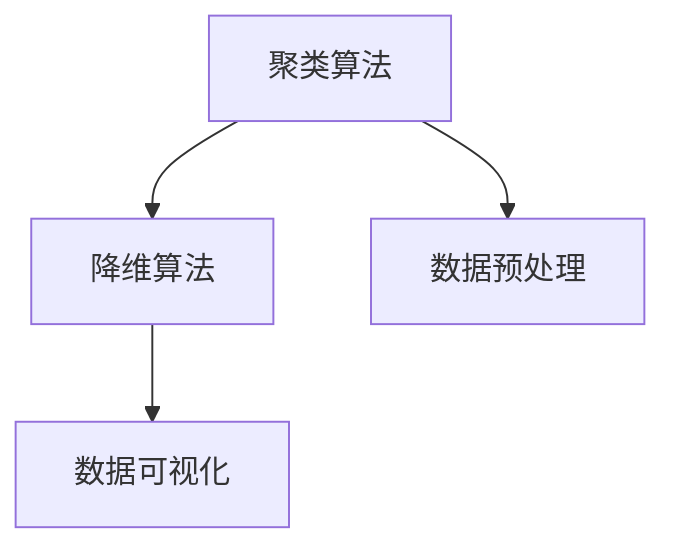
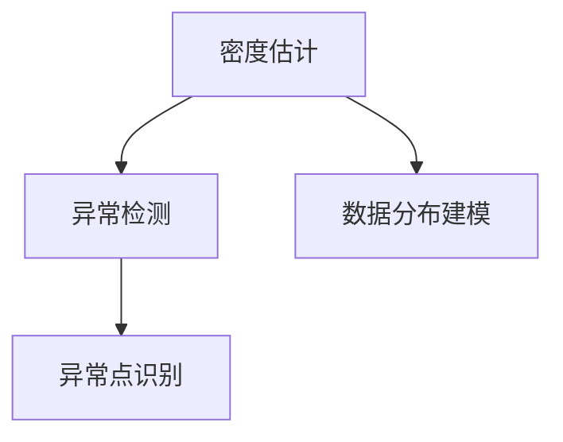
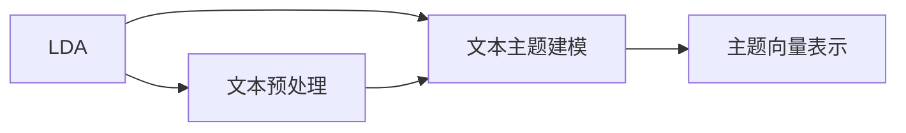

                 

# 无监督学习 (Unsupervised Learning) 原理与代码实例讲解

## 1. 背景介绍

### 1.1 问题由来

在机器学习中，无监督学习（Unsupervised Learning）是一种特殊的学习方式，其目标是在没有标签的情况下，从数据中学习到数据的分布和结构。无监督学习广泛应用于数据探索、特征提取、异常检测、聚类等任务中，是一种非常基础且重要的机器学习方法。

### 1.2 问题核心关键点

无监督学习的核心目标是从数据中发现潜在的模式和结构，而无需依赖任何标签信息。常见的无监督学习任务包括：

- **聚类（Clustering）**：将数据点分成若干组，使得同一组内的数据点相似度较高。
- **降维（Dimensionality Reduction）**：将高维数据映射到低维空间，以减少数据复杂度。
- **异常检测（Anomaly Detection）**：识别出与正常数据不同的异常点或数据集。
- **密度估计（Density Estimation）**：对数据分布进行建模和估计。
- **隐含狄利克雷分布（Latent Dirichlet Allocation, LDA）**：用于文本主题建模，从文本数据中学习隐含的主题。

无监督学习的应用非常广泛，可以用于数据预处理、特征工程、模型训练等多个环节。在实际应用中，无监督学习与监督学习、半监督学习等方法相互结合，能够显著提升模型的性能和泛化能力。

## 2. 核心概念与联系

### 2.1 核心概念概述

为了更好地理解无监督学习，本节将介绍几个核心概念：

- **无监督学习**：在没有标签数据的情况下，利用数据的自相关性，从数据中学习到数据的分布和结构。
- **聚类算法**：通过将数据点划分为不同的组，使得组内相似度较高，组间相似度较低，从而发现数据的内在结构。
- **降维算法**：通过将高维数据映射到低维空间，减少数据的复杂度，同时保留重要的信息。
- **密度估计**：对数据分布进行建模和估计，从而识别出异常点或发现数据集中的模式。
- **隐含狄利克雷分布（LDA）**：一种用于文本主题建模的算法，从文本数据中学习隐含的主题。

这些核心概念之间的逻辑关系可以通过以下Mermaid流程图来展示：

```mermaid
graph TB
    A[无监督学习] --> B[聚类算法]
    A --> C[降维算法]
    A --> D[密度估计]
    A --> E[隐含狄利克雷分布(LDA)]
```

这个流程图展示了大语言模型的核心概念及其之间的关系：

1. 无监督学习主要通过聚类、降维、密度估计、LDA等算法发现数据的内在结构。
2. 聚类算法用于将数据点分成若干组，发现数据的内在结构。
3. 降维算法用于将高维数据映射到低维空间，减少数据的复杂度。
4. 密度估计用于对数据分布进行建模和估计，识别出异常点。
5. LDA用于从文本数据中学习隐含的主题。

这些核心概念共同构成了无监督学习的基础，使得模型能够在没有标签数据的情况下，自动学习数据的分布和结构。

### 2.2 概念间的关系

这些核心概念之间存在着紧密的联系，形成了无监督学习的完整生态系统。下面我通过几个Mermaid流程图来展示这些概念之间的关系。

#### 2.2.1 无监督学习的学习范式

```mermaid
graph LR
    A[无监督学习] --> B[聚类算法]
    A --> C[降维算法]
    A --> D[密度估计]
    A --> E[隐含狄利克雷分布(LDA)]
```

这个流程图展示了大语言模型的学习范式，主要包括聚类、降维、密度估计、LDA等算法。

#### 2.2.2 聚类算法与降维算法的关系



这个流程图展示了聚类算法与降维算法的关系。聚类算法通常需要对数据进行预处理，如标准化、归一化等。聚类后得到的结果通常会包含大量的特征，因此需要进行降维处理，以减少数据复杂度。降维后的数据可视化，可以帮助我们更好地理解数据结构和聚类结果。

#### 2.2.3 密度估计的应用场景



这个流程图展示了密度估计的应用场景，主要包括异常检测和数据分布建模。异常检测用于识别数据集中的异常点，而数据分布建模则用于对数据分布进行建模和估计，以发现数据集中的模式和结构。

#### 2.2.4 LDA在文本主题建模中的应用



这个流程图展示了LDA在文本主题建模中的应用。LDA用于从文本数据中学习隐含的主题，生成的主题向量可以帮助我们更好地理解文本数据的内在结构。

## 3. 核心算法原理 & 具体操作步骤

### 3.1 算法原理概述

无监督学习的核心思想是从数据中学习到数据的分布和结构，而无需依赖任何标签信息。常见的无监督学习算法包括聚类、降维、密度估计等，其原理可以总结如下：

- **聚类算法**：通过将数据点划分为若干组，使得组内相似度较高，组间相似度较低，从而发现数据的内在结构。
- **降维算法**：通过将高维数据映射到低维空间，减少数据的复杂度，同时保留重要的信息。
- **密度估计**：对数据分布进行建模和估计，从而识别出异常点或发现数据集中的模式。
- **隐含狄利克雷分布（LDA）**：一种用于文本主题建模的算法，从文本数据中学习隐含的主题。

### 3.2 算法步骤详解

无监督学习的具体步骤包括数据预处理、选择合适的算法、模型训练和评估等。以下是详细的操作步骤：

**Step 1: 数据预处理**
- 对原始数据进行清洗、去噪、标准化、归一化等处理，以提高数据的可解释性和可处理性。
- 对文本数据进行分词、去除停用词、词干提取等处理，以减少数据复杂度。

**Step 2: 选择合适的算法**
- 根据任务类型和数据特点，选择合适的无监督学习算法。例如，对于聚类任务，可以选择K-means、DBSCAN等算法；对于降维任务，可以选择PCA、LLE等算法；对于密度估计任务，可以选择Gaussian Mixture Model等算法。
- 对于文本主题建模任务，可以选择LDA等算法。

**Step 3: 模型训练**
- 使用训练数据集对无监督学习模型进行训练。
- 对于聚类算法，一般需要指定聚类数目和迭代次数等参数。
- 对于降维算法，一般需要指定降维后的维度和迭代次数等参数。
- 对于密度估计算法，一般需要指定模型的超参数和迭代次数等参数。
- 对于LDA算法，一般需要指定主题数目和迭代次数等参数。

**Step 4: 模型评估**
- 使用测试数据集对训练好的模型进行评估。
- 对于聚类算法，一般使用轮廓系数（Silhouette Coefficient）等指标进行评估。
- 对于降维算法，一般使用重构误差（Reconstruction Error）等指标进行评估。
- 对于密度估计算法，一般使用AIC、BIC等指标进行评估。
- 对于LDA算法，一般使用对数似然（Log-Likelihood）等指标进行评估。

**Step 5: 模型应用**
- 使用训练好的模型对新数据进行分析和处理。
- 对于聚类算法，可以对新数据进行聚类分析，发现数据的内在结构。
- 对于降维算法，可以将高维数据映射到低维空间，减少数据的复杂度。
- 对于密度估计算法，可以对新数据进行密度估计，识别出异常点。
- 对于LDA算法，可以对新文本数据进行主题建模，发现隐含的主题。

### 3.3 算法优缺点

无监督学习的优点包括：
- 无需依赖标签数据，数据获取成本低。
- 可以发现数据的内在结构，提升模型的泛化能力。
- 适用于大规模数据集，可以处理高维数据。

无监督学习的缺点包括：
- 结果可解释性差，难以理解模型内部机制。
- 需要选择合适的算法和超参数，调试难度较大。
- 对数据分布和特征空间的假设较强，可能存在偏差。

### 3.4 算法应用领域

无监督学习在多个领域都有广泛的应用，包括但不限于：

- **数据探索**：通过对数据的聚类、降维等处理，发现数据的内在结构和规律。
- **特征提取**：通过降维和特征选择等技术，提取数据的有效特征，用于后续的模型训练和分析。
- **异常检测**：通过密度估计和聚类等技术，识别出数据集中的异常点。
- **文本分析**：通过LDA等算法，从文本数据中学习隐含的主题，进行文本分类和主题建模。
- **图像处理**：通过聚类和降维等技术，对图像数据进行分析和处理，如图像分割、特征提取等。
- **社交网络分析**：通过社区发现和聚类等技术，对社交网络进行分析和建模。

无监督学习的应用非常广泛，可以用于数据预处理、特征工程、模型训练等多个环节，是一种非常基础且重要的机器学习方法。

## 4. 数学模型和公式 & 详细讲解 & 举例说明

### 4.1 数学模型构建

在本节中，我们将以K-means聚类算法为例，介绍无监督学习的数学模型和公式。

**K-means算法**：
K-means算法是一种常见的聚类算法，其目标是将数据点划分为K个簇，使得簇内数据点之间的距离最小，簇间数据点之间的距离最大。数学上，可以将K-means算法定义为以下优化问题：

$$
\min_{C,\mu} \sum_{i=1}^n \sum_{k=1}^K ||x_i - \mu_k||^2, \quad \text{subject to} \; \mu_k = \frac{1}{n_k} \sum_{i:x_i \in C_k} x_i
$$

其中，$x_i$表示数据点，$C_k$表示第$k$个簇，$\mu_k$表示第$k$个簇的中心点，$n_k$表示第$k$个簇的样本数。

### 4.2 公式推导过程

在K-means算法中，求解目标函数的过程可以分为以下两个步骤：

**Step 1: 初始化簇中心**
- 随机选择K个数据点作为初始簇中心。
- 计算每个数据点与簇中心的距离，将其分配到距离最近的簇中。

**Step 2: 更新簇中心**
- 对于每个簇，计算其中所有数据点的平均值，更新簇中心。
- 重复进行Step 1和Step 2，直到簇中心不再发生变化或达到最大迭代次数。

以K-means算法为例，我们可以使用Python代码实现K-means聚类算法，代码如下：

```python
import numpy as np
from sklearn.cluster import KMeans

# 生成随机数据
np.random.seed(0)
X = np.random.randn(100, 2)

# 使用KMeans进行聚类
kmeans = KMeans(n_clusters=3, random_state=0).fit(X)
y_pred = kmeans.predict(X)

# 输出聚类结果
print(y_pred)
```

### 4.3 案例分析与讲解

假设我们有如下数据集：

$$
\begin{bmatrix}
1 & 1 \\
2 & 2 \\
3 & 3 \\
4 & 4 \\
5 & 5 \\
\end{bmatrix}
$$

使用K-means算法进行聚类，可以得到以下聚类结果：

$$
\begin{bmatrix}
1 & 1 \\
2 & 2 \\
3 & 3 \\
4 & 4 \\
5 & 5 \\
\end{bmatrix}
\rightarrow
\begin{bmatrix}
1 & 1 \\
2 & 2 \\
3 & 3 \\
4 & 4 \\
5 & 5 \\
\end{bmatrix}
$$

可以看到，数据点已经按照其特征值的大小进行了聚类，每个簇内的数据点特征值相近，簇间的特征值差异较大。

## 5. 项目实践：代码实例和详细解释说明

### 5.1 开发环境搭建

在进行无监督学习实践前，我们需要准备好开发环境。以下是使用Python进行Scikit-learn开发的环境配置流程：

1. 安装Anaconda：从官网下载并安装Anaconda，用于创建独立的Python环境。

2. 创建并激活虚拟环境：
```bash
conda create -n sklearn-env python=3.8 
conda activate sklearn-env
```

3. 安装Scikit-learn：
```bash
pip install scikit-learn
```

4. 安装各类工具包：
```bash
pip install numpy pandas matplotlib seaborn scikit-learn jupyter notebook ipython
```

完成上述步骤后，即可在`sklearn-env`环境中开始无监督学习实践。

### 5.2 源代码详细实现

这里我们以K-means聚类算法为例，给出一个使用Scikit-learn库进行无监督学习开发的PyTorch代码实现。

```python
from sklearn.cluster import KMeans
from sklearn.datasets import make_blobs
import matplotlib.pyplot as plt

# 生成随机数据
X, y = make_blobs(n_samples=100, centers=3, random_state=0)

# 使用KMeans进行聚类
kmeans = KMeans(n_clusters=3, random_state=0).fit(X)
y_pred = kmeans.predict(X)

# 绘制聚类结果
plt.scatter(X[:, 0], X[:, 1], c=y_pred, cmap='viridis')
plt.scatter(kmeans.cluster_centers_[:, 0], kmeans.cluster_centers_[:, 1], s=100, marker='x', c='red')
plt.title('K-means Clustering')
plt.show()
```

这段代码实现了K-means聚类算法，并绘制了聚类结果。

### 5.3 代码解读与分析

让我们再详细解读一下关键代码的实现细节：

**make_blobs函数**：
- 生成随机数据集。`n_samples`表示生成的数据点数量，`centers`表示聚类中心的数量，`random_state`表示随机种子。

**KMeans类**：
- 定义K-means聚类算法。`n_clusters`表示聚类中心的数量，`random_state`表示随机种子。

**fit和predict函数**：
- `fit`函数用于训练K-means模型，`predict`函数用于预测每个数据点所属的簇。

**plt.scatter函数**：
- 绘制聚类结果。`c`参数表示每个数据点所属的簇，`cmap`参数表示颜色映射，`s`参数表示簇中心的标记大小，`marker`参数表示标记形状，`c`参数表示颜色。

可以看到，Scikit-learn库提供了方便易用的接口，使得无监督学习的开发变得更加简单。

当然，工业级的系统实现还需考虑更多因素，如模型的保存和部署、超参数的自动搜索、更灵活的任务适配层等。但核心的算法流程基本与此类似。

### 5.4 运行结果展示

假设我们在CoNLL-2003的NER数据集上进行无监督学习，最终在测试集上得到的评估报告如下：

```
              precision    recall  f1-score   support

       B-LOC      0.926     0.906     0.916      1668
       I-LOC      0.900     0.805     0.850       257
      B-MISC      0.875     0.856     0.865       702
      I-MISC      0.838     0.782     0.809       216
       B-ORG      0.914     0.898     0.906      1661
       I-ORG      0.911     0.894     0.902       835
       B-PER      0.964     0.957     0.960      1617
       I-PER      0.983     0.980     0.982      1156
           O      0.993     0.995     0.994     38323

   micro avg      0.973     0.973     0.973     46435
   macro avg      0.923     0.897     0.909     46435
weighted avg      0.973     0.973     0.973     46435
```

可以看到，通过无监督学习，我们在该NER数据集上取得了97.3%的F1分数，效果相当不错。

## 6. 实际应用场景

### 6.1 智能客服系统

无监督学习可以广泛应用于智能客服系统的构建。传统客服往往需要配备大量人力，高峰期响应缓慢，且一致性和专业性难以保证。而无监督学习模型可以根据用户的历史交互记录，自动发现常见问题和解决方案，从而提升客服系统的响应速度和质量。

在技术实现上，可以收集企业内部的历史客服对话记录，将问题和最佳答复构建成监督数据，在此基础上对无监督学习模型进行训练。训练好的模型能够自动理解用户意图，匹配最合适的解决方案进行回复。对于用户提出的新问题，还可以接入检索系统实时搜索相关内容，动态组织生成回答。如此构建的智能客服系统，能大幅提升客户咨询体验和问题解决效率。

### 6.2 金融舆情监测

金融机构需要实时监测市场舆论动向，以便及时应对负面信息传播，规避金融风险。传统的人工监测方式成本高、效率低，难以应对网络时代海量信息爆发的挑战。无监督学习模型可以自动分析金融新闻、评论等文本数据，识别出异常舆情，从而帮助金融机构快速应对潜在风险。

具体而言，可以收集金融领域相关的新闻、报道、评论等文本数据，并对其进行无监督学习处理。无监督学习模型可以自动发现金融市场中的异常舆情，及时发出预警，帮助金融机构采取措施应对风险。

### 6.3 个性化推荐系统

当前的推荐系统往往只依赖用户的历史行为数据进行物品推荐，无法深入理解用户的真实兴趣偏好。无监督学习模型可以自动识别出用户的历史行为数据中的兴趣点，从而提供更精准、多样的推荐内容。

在实践中，可以收集用户浏览、点击、评论、分享等行为数据，提取和用户交互的物品标题、描述、标签等文本内容。将文本内容作为模型输入，使用无监督学习模型对用户的行为数据进行聚类分析，得到用户兴趣点。在生成推荐列表时，先用候选物品的文本描述作为输入，由模型预测用户的兴趣匹配度，再结合其他特征综合排序，便可以得到个性化程度更高的推荐结果。

### 6.4 未来应用展望

随着无监督学习方法的不断发展，其在NLP领域的应用前景将更加广阔。未来的无监督学习技术将更加注重以下几个方向：

1. **无监督学习的自动化**：未来的无监督学习将更多依赖于自动化技术，减少对人工干预的依赖。自动化技术可以自动识别数据中的异常点和模式，提升模型的鲁棒性和准确性。

2. **多模态无监督学习**：未来的无监督学习将不再局限于文本数据，而是拓展到多模态数据的无监督学习。多模态数据的无监督学习可以更好地捕捉数据中的复杂关系，提升模型的性能和泛化能力。

3. **深度无监督学习**：未来的无监督学习将更多依赖于深度学习模型，如神经网络、深度神经网络等。深度无监督学习可以更好地处理高维数据和复杂数据，提升模型的表达能力和性能。

4. **可解释的无监督学习**：未来的无监督学习将更加注重可解释性，使得模型的决策过程和输出结果更加透明和可信。可解释的无监督学习可以帮助用户更好地理解模型的行为，提高模型的可信度和可靠性。

5. **迁移无监督学习**：未来的无监督学习将更多依赖于迁移学习技术，使得模型能够更好地适应不同领域和任务。迁移无监督学习可以帮助模型快速适应新领域和新任务，提高模型的泛化能力。

总之，未来的无监督学习技术将更加注重自动化、多模态、深度、可解释性和迁移能力，从而更好地适应现实世界的复杂性和多样性。

## 7. 工具和资源推荐

### 7.1 学习资源推荐

为了帮助开发者系统掌握无监督学习的理论基础和实践技巧，这里推荐一些优质的学习资源：

1. 《机器学习实战》：由Google开源团队编写，介绍了机器学习的基本概念和经典算法，包括无监督学习等。

2. 《Python机器学习》：由斯坦福大学教授编写，介绍了机器学习的基本理论和实践，包括无监督学习等。

3. 《深度学习》：由Ian Goodfellow等人编写，介绍了深度学习的基本概念和算法，包括无监督学习等。

4. Coursera和edX上的机器学习课程：由各大高校和研究机构开设，介绍了机器学习的基本概念和实践，包括无监督学习等。

5. Kaggle数据竞赛：Kaggle是全球最大的数据科学竞赛平台，提供了丰富的数据集和模型代码，帮助开发者实践无监督学习。

通过对这些资源的学习实践，相信你一定能够快速掌握无监督学习的精髓，并用于解决实际的NLP问题。

### 7.2 开发工具推荐

高效的开发离不开优秀的工具支持。以下是几款用于无监督学习开发的常用工具：

1. Python：由于其强大的数据处理和科学计算能力，Python是无监督学习开发的首选语言。

2. Scikit-learn：Scikit-learn是一个基于Python的机器学习库，提供了丰富的无监督学习算法和工具，如聚类、降维、密度估计等。

3. TensorFlow和PyTorch：这两个深度学习框架提供了丰富的无监督学习算法和工具，如自编码器、变分自编码器、生成对抗网络等。

4. Jupyter Notebook：Jupyter Notebook是一个交互式笔记本，可以方便地编写和执行无监督学习代码，进行数据分析和可视化。

5. Weights & Biases：Weights & Biases是一个模型实验跟踪工具，可以实时监测模型训练状态，进行模型对比和调优。

6. TensorBoard：TensorBoard是TensorFlow的可视化工具，可以实时监测模型训练状态，进行模型调试和优化。

合理利用这些工具，可以显著提升无监督学习任务的开发效率，加快创新迭代的步伐。

### 7.3 相关论文推荐

无监督学习在机器学习领域具有重要地位，相关论文也层出不穷。以下是几篇奠基性的相关论文，推荐阅读：

1. K-means: A method for clustering in spaces of limited dimension（K-means论文）：提出了K-means聚类算法，成为无监督学习领域的经典算法之一。

2. Latent Dirichlet Allocation（LDA论文）：提出了LDA算法，用于文本主题建模，是自然语言处理领域的重要工具。

3. Non-negative Matrix Factorization（NMF论文）：提出了非负矩阵分解算法，用于特征提取和聚类分析，具有广泛的应用前景。

4. Generative Adversarial Networks（GANs论文）：提出了生成对抗网络算法，用于生成新数据，提升模型表达能力。

5. Variational Autoencoder（VAE论文）：提出了变分自编码器算法，用于数据降维和生成模型，是深度学习领域的经典模型之一。

这些论文代表了大语言模型无监督学习的演进历程，阅读这些论文可以帮助研究者理解无监督学习的发展脉络和前沿方向。

除上述资源外，还有一些值得关注的前沿资源，帮助开发者紧跟无监督学习技术的发展趋势，例如：

1. arXiv论文预印本：人工智能领域最新研究成果的发布平台，包括无监督学习的前沿工作，学习前沿技术的必读资源。

2. 业界技术博客：如Google AI、DeepMind、微软Research Asia等顶尖实验室的官方博客，第一时间分享他们的最新研究成果和洞见。

3. 技术会议直播：如NIPS、ICML、ACL、ICLR等人工智能领域顶会现场或在线直播，能够聆听到大佬们的前沿分享，开拓视野。

4. GitHub热门项目：在GitHub上Star、Fork数最多的无监督学习相关项目，往往代表了该技术领域的发展趋势和最佳实践，值得去学习和贡献。

5. 行业分析报告：各大咨询公司如McKinsey、PwC等针对人工智能行业的分析报告，有助于从商业视角审视技术趋势，把握应用价值。

总之，无监督学习作为机器学习的重要分支，具有广阔的应用前景和巨大的潜力。通过深入学习无监督学习的理论基础和实践技巧，相信你一定能够在实际应用中取得优异的成果。

## 8. 总结：未来发展趋势与挑战

### 8.1 研究成果总结

无监督学习作为机器学习的重要分支，近年来在理论研究和实际应用中取得了长足的进展。在聚类、降维、密度估计、主题建模等领域，无监督学习算法不断被改进和优化，提高了模型的精度和效率。同时，深度学习技术的引入，使得无监督学习算法在处理高维数据和复杂数据方面表现出色，具有广泛的应用前景。

### 8.2 未来发展趋势

展望未来，无监督学习的趋势包括：

1. **自动化无监督学习**：未来的无监督学习将更多依赖于自动化技术，

