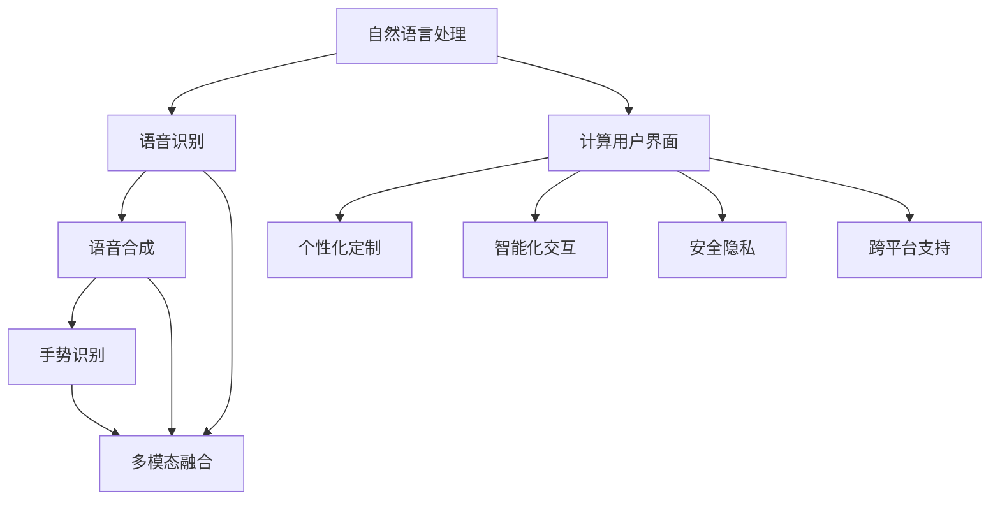
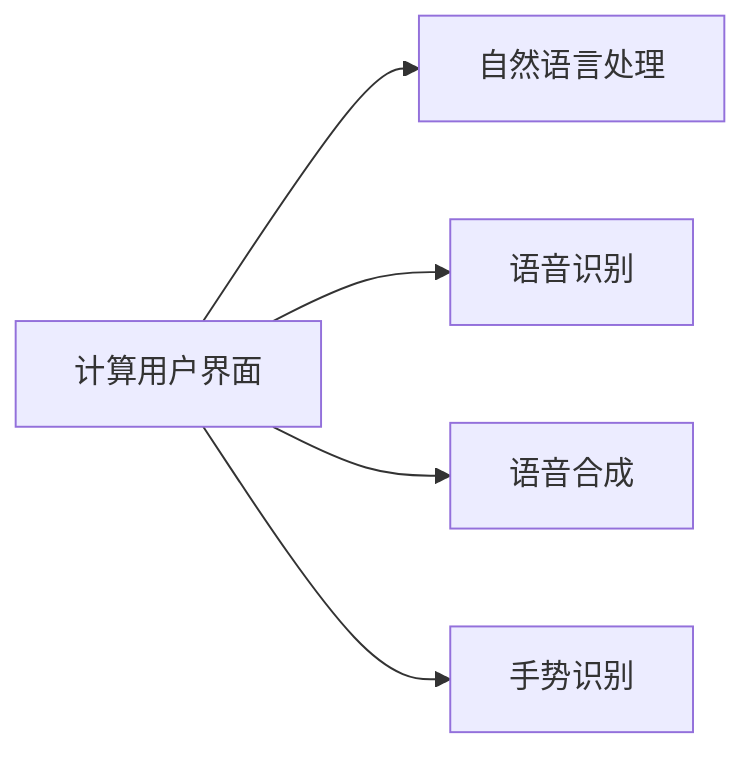
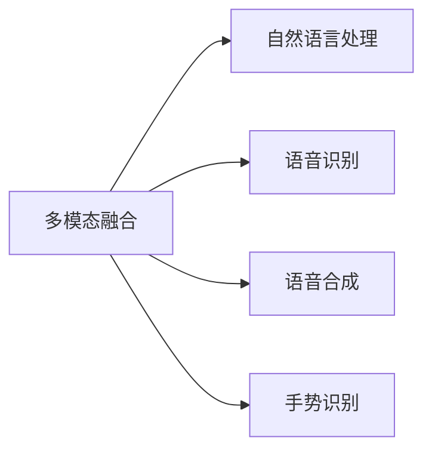
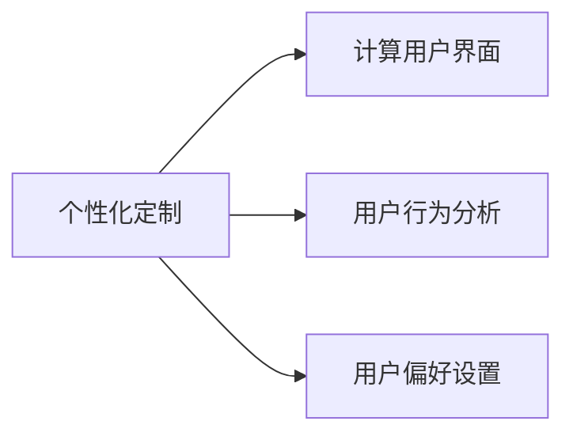
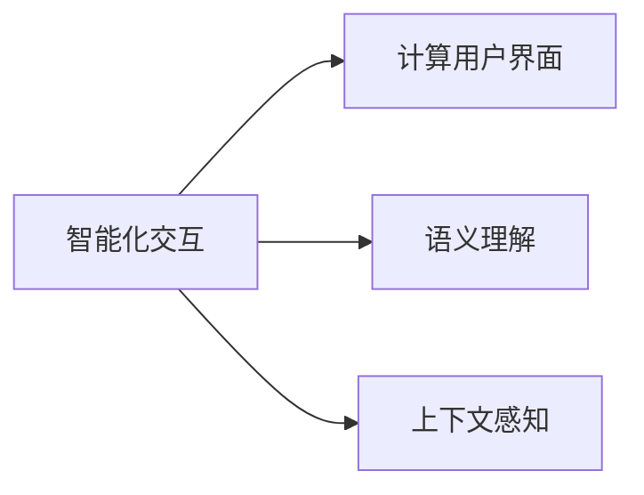
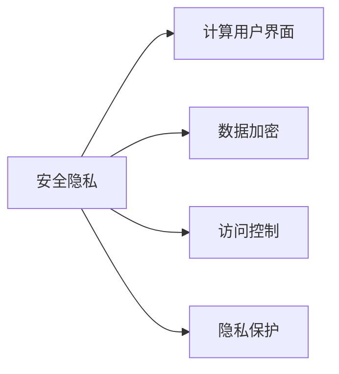
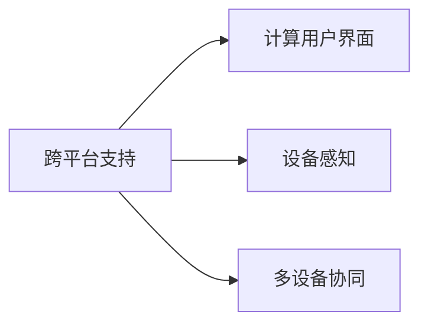
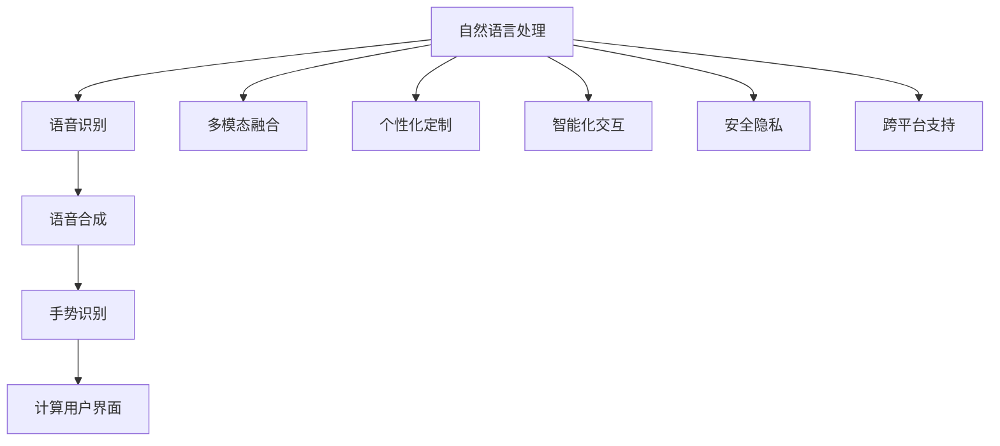

                 

# 未来CUI在数字产品中的详细应用趋势解析

## 1. 背景介绍

### 1.1 问题由来
近年来，随着人工智能技术的迅猛发展，自然语言处理（NLP）、语音识别（ASR）、语音合成（TTS）、手势识别（GR）等多模态交互技术不断突破，催生了新的交互方式——计算用户界面（CUI）。CUI提供了一种自然、高效、智能的交互体验，为数字产品带来了革命性的变化。

然而，由于CUI技术涉及多种前沿技术的融合，其落地应用仍面临诸多挑战。如何在大规模数据和复杂模型基础上，构建出稳定、易用、可扩展的CUI产品，成为了当前科技界的重要课题。本文将系统探讨未来CUI在数字产品中的详细应用趋势，希望能为相关研究和工程实践提供参考。

### 1.2 问题核心关键点
CUI的核心在于其高效、自然的多模态交互能力，使得用户能通过语音、文字、手势等方式，与数字产品进行交互。未来的CUI应用趋势，将主要围绕以下几个关键点展开：

- **多模态融合**：将多种交互模态（语音、文字、手势、图像等）融合，提升用户体验和交互效率。
- **个性化定制**：根据用户习惯和偏好，提供定制化的交互界面和功能。
- **智能化交互**：通过语义理解、上下文感知等技术，提升交互的智能性和自然度。
- **安全隐私**：保障用户交互过程中数据的隐私和安全，防止恶意攻击。
- **跨平台支持**：在不同平台和设备上提供一致的CUI体验。

### 1.3 问题研究意义
随着CUI技术的不断发展，其应用场景将不断拓展，推动数字产品向更加个性化、智能化、易用化方向发展。通过深入研究未来CUI在数字产品中的详细应用趋势，可以有效指导相关技术的研发和产品设计，加速CUI技术在各行各业的落地应用。

## 2. 核心概念与联系

### 2.1 核心概念概述

为更好地理解CUI技术的发展趋势，本节将介绍几个密切相关的核心概念：

- **自然语言处理（NLP）**：研究如何使计算机理解和处理人类语言，包括语音识别、文本分析、语义理解等。
- **语音识别（ASR）**：将人类语音转换为文本，是CUI中重要的输入模态。
- **语音合成（TTS）**：将文本转换为人类语音，是CUI中重要的输出模态。
- **手势识别（GR）**：通过摄像头或传感器捕捉用户手势，实现与设备的交互。
- **计算用户界面（CUI）**：结合NLP、ASR、TTS、GR等技术，提供自然、高效的多模态交互方式。

- **多模态融合**：将不同模态的输入输出信息融合，提升用户体验。
- **个性化定制**：根据用户行为和偏好，调整交互界面和功能。
- **智能化交互**：利用语义理解、上下文感知等技术，提升交互的智能性。
- **安全隐私**：保障用户数据的安全和隐私。
- **跨平台支持**：在不同设备和操作系统上提供一致的交互体验。

这些核心概念之间的关系可以通过以下Mermaid流程图来展示：



这个流程图展示了大语言模型微调过程中各个核心概念之间的关系：

1. **NLP、ASR、TTS、GR**是CUI的基础技术，提供不同模态的输入和输出。
2. **多模态融合**将多种模态的信息融合，提升用户体验。
3. **个性化定制**根据用户行为和偏好调整界面和功能。
4. **智能化交互**利用语义理解、上下文感知等技术提升智能性。
5. **安全隐私**保障用户数据的安全和隐私。
6. **跨平台支持**在不同设备和操作系统上提供一致的体验。

### 2.2 概念间的关系

这些核心概念之间存在着紧密的联系，形成了CUI技术的应用生态系统。下面我们通过几个Mermaid流程图来展示这些概念之间的关系。

#### 2.2.1 CUI技术栈



这个流程图展示了CUI技术的栈结构，即NLP、ASR、TTS、GR等技术为其提供了基础支持。

#### 2.2.2 多模态融合技术



这个流程图展示了多模态融合技术如何处理不同模态的信息，提升用户体验。

#### 2.2.3 个性化定制



这个流程图展示了个性化定制技术如何根据用户行为和偏好调整CUI界面和功能。

#### 2.2.4 智能化交互



这个流程图展示了智能化交互技术如何利用语义理解和上下文感知提升CUI的智能性。

#### 2.2.5 安全隐私



这个流程图展示了安全隐私技术如何保障CUI应用中用户数据的隐私和安全。

#### 2.2.6 跨平台支持



这个流程图展示了跨平台支持技术如何使CUI在不同设备和操作系统上提供一致的体验。

### 2.3 核心概念的整体架构

最后，我们用一个综合的流程图来展示这些核心概念在CUI应用中的整体架构：



这个综合流程图展示了从NLP、ASR、TTS、GR等基础技术，到多模态融合、个性化定制、智能化交互、安全隐私、跨平台支持等应用层技术的完整生态。通过这些核心概念的协同作用，CUI技术能够在数字产品中提供稳定、高效、智能的交互体验。

## 3. 核心算法原理 & 具体操作步骤
### 3.1 算法原理概述

计算用户界面（CUI）的核心算法原理在于其多模态融合、语义理解、上下文感知等技术，结合数据驱动和模型驱动的策略，实现自然、高效的交互体验。

- **多模态融合**：将语音、文字、手势等不同模态的信息进行融合，生成统一的表示，提高用户体验。
- **语义理解**：通过NLP技术，理解用户输入的自然语言指令，提取关键信息。
- **上下文感知**：考虑用户历史行为和上下文环境，提升交互的智能性和自然度。
- **个性化定制**：根据用户偏好和行为，调整交互界面和功能。
- **安全隐私**：通过加密和访问控制等技术，保障用户数据的安全和隐私。
- **跨平台支持**：在不同设备和操作系统上提供一致的交互体验。

### 3.2 算法步骤详解

CUI技术的实现步骤包括以下几个关键环节：

1. **数据采集和预处理**：收集用户的历史行为数据、偏好设置和设备信息，进行清洗和标注，构建训练集。
2. **模型训练**：利用NLP、ASR、TTS、GR等技术，训练多种交互模态的模型，如语音识别模型、文本理解模型、手势识别模型等。
3. **多模态融合**：将不同模态的信息进行融合，生成统一的表示，提升用户体验。
4. **个性化定制**：根据用户行为和偏好，调整交互界面和功能。
5. **智能化交互**：利用语义理解、上下文感知等技术，提升交互的智能性和自然度。
6. **安全隐私**：通过数据加密、访问控制等技术，保障用户数据的安全和隐私。
7. **跨平台支持**：在不同设备和操作系统上提供一致的交互体验。

### 3.3 算法优缺点

**优点：**

- **自然高效**：利用自然语言和手势等多种模态进行交互，提升用户体验。
- **智能化**：通过语义理解、上下文感知等技术，提升交互的智能性。
- **个性化**：根据用户行为和偏好，调整交互界面和功能。
- **跨平台**：在不同设备和操作系统上提供一致的交互体验。

**缺点：**

- **复杂度高**：涉及多种前沿技术的融合，技术难度较大。
- **数据需求大**：需要大量的标注数据进行训练，数据采集和处理成本高。
- **模型依赖强**：对基础模型的性能依赖性强，模型的选择和调优困难。

### 3.4 算法应用领域

CUI技术的应用领域广泛，涵盖了智能家居、车载、智能办公、智能客服等多个场景。以下是几个典型的应用场景：

- **智能家居**：通过语音助手、手势控制等方式，实现家居设备的智能化控制。
- **车载**：利用语音和手势交互技术，提升驾驶体验，增强安全性。
- **智能办公**：通过语音输入、手势操作等方式，提升办公效率。
- **智能客服**：通过语音识别和自然语言处理技术，提供自然流畅的客服交互体验。

这些应用场景展示了CUI技术在不同领域中的广泛应用，未来随着技术的不断发展，CUI将进一步拓展其应用范围。

## 4. 数学模型和公式 & 详细讲解  
### 4.1 数学模型构建

为了更严谨地描述CUI技术的数学模型，我们引入以下变量和函数：

- $x$：用户输入的自然语言指令。
- $y$：用户期望的系统响应。
- $p(x|y)$：在上下文$p$下，用户输入$x$的概率分布。
- $f(x)$：自然语言处理模型，将用户输入$x$转换为计算机可理解的表示。
- $g(x)$：语音识别模型，将用户语音指令转换为文本。
- $h(x)$：手势识别模型，将用户手势转换为指令。
- $p(y|f(x))$：在输入$f(x)$下，系统响应$y$的概率分布。

### 4.2 公式推导过程

假设用户输入为自然语言指令$x$，系统响应为$y$，上下文为$p$。CUI系统的目标是通过多模态信息融合，最大化上下文$p$下用户输入$x$的概率$p(x|p)$，并最小化系统响应$y$的误差$e(y|x)$。CUI系统的数学模型可以表示为：

$$
\max_{f,g,h,p} p(x|p) \quad \text{subject to} \quad \min_{y} e(y|x) \text{ and } p(y|f(x)) = \max_{f,g,h,p} p(x|p)
$$

在多模态融合阶段，CUI系统可以将用户输入的不同模态信息进行组合，生成一个统一的表示$z$。假设$z$为输入的向量表示，则有：

$$
z = \alpha f(x) + \beta g(x) + \gamma h(x)
$$

其中$\alpha, \beta, \gamma$为融合系数，需要通过实验调优。

### 4.3 案例分析与讲解

以智能家居场景为例，CUI系统可以实现语音控制灯光、调节温度等功能。具体步骤如下：

1. **数据采集和预处理**：收集用户的历史语音指令、设备反馈等数据，进行清洗和标注。
2. **模型训练**：训练语音识别模型和设备控制模型，将用户语音指令转换为系统响应。
3. **多模态融合**：将语音指令和手势动作进行融合，生成统一的表示，提升用户体验。
4. **个性化定制**：根据用户偏好和行为，调整灯光亮度、温度等设备的控制参数。
5. **智能化交互**：利用语义理解技术，识别用户语音指令中的意图，执行相应的控制操作。
6. **安全隐私**：通过数据加密和访问控制等技术，保障用户数据的安全和隐私。
7. **跨平台支持**：在不同设备和操作系统上提供一致的语音和手势交互体验。

通过以上步骤，CUI系统能够实现高效、自然的智能家居控制。

## 5. 项目实践：代码实例和详细解释说明
### 5.1 开发环境搭建

在进行CUI实践前，我们需要准备好开发环境。以下是使用Python进行PyTorch开发的环境配置流程：

1. 安装Anaconda：从官网下载并安装Anaconda，用于创建独立的Python环境。

2. 创建并激活虚拟环境：
```bash
conda create -n pytorch-env python=3.8 
conda activate pytorch-env
```

3. 安装PyTorch：根据CUDA版本，从官网获取对应的安装命令。例如：
```bash
conda install pytorch torchvision torchaudio cudatoolkit=11.1 -c pytorch -c conda-forge
```

4. 安装Transformers库：
```bash
pip install transformers
```

5. 安装各类工具包：
```bash
pip install numpy pandas scikit-learn matplotlib tqdm jupyter notebook ipython
```

完成上述步骤后，即可在`pytorch-env`环境中开始CUI实践。

### 5.2 源代码详细实现

这里我们以智能家居场景为例，给出使用Transformers库进行CUI开发的PyTorch代码实现。

首先，定义CUI系统的数据处理函数：

```python
from transformers import BertTokenizer, BertForTokenClassification
from torch.utils.data import Dataset
import torch

class SmartHomeDataset(Dataset):
    def __init__(self, texts, labels, tokenizer, max_len=128):
        self.texts = texts
        self.labels = labels
        self.tokenizer = tokenizer
        self.max_len = max_len
        
    def __len__(self):
        return len(self.texts)
    
    def __getitem__(self, item):
        text = self.texts[item]
        labels = self.labels[item]
        
        encoding = self.tokenizer(text, return_tensors='pt', max_length=self.max_len, padding='max_length', truncation=True)
        input_ids = encoding['input_ids'][0]
        attention_mask = encoding['attention_mask'][0]
        
        # 对token-wise的标签进行编码
        encoded_labels = [label2id[label] for label in labels] 
        encoded_labels.extend([label2id['O']] * (self.max_len - len(encoded_labels)))
        labels = torch.tensor(encoded_labels, dtype=torch.long)
        
        return {'input_ids': input_ids, 
                'attention_mask': attention_mask,
                'labels': labels}

# 标签与id的映射
label2id = {'O': 0, 'light_on': 1, 'light_off': 2, 'temperature_up': 3, 'temperature_down': 4, 'home_security': 5}
id2label = {v: k for k, v in label2id.items()}
```

然后，定义模型和优化器：

```python
from transformers import BertForTokenClassification, AdamW

model = BertForTokenClassification.from_pretrained('bert-base-cased', num_labels=len(label2id))

optimizer = AdamW(model.parameters(), lr=2e-5)
```

接着，定义训练和评估函数：

```python
from torch.utils.data import DataLoader
from tqdm import tqdm
from sklearn.metrics import classification_report

device = torch.device('cuda') if torch.cuda.is_available() else torch.device('cpu')
model.to(device)

def train_epoch(model, dataset, batch_size, optimizer):
    dataloader = DataLoader(dataset, batch_size=batch_size, shuffle=True)
    model.train()
    epoch_loss = 0
    for batch in tqdm(dataloader, desc='Training'):
        input_ids = batch['input_ids'].to(device)
        attention_mask = batch['attention_mask'].to(device)
        labels = batch['labels'].to(device)
        model.zero_grad()
        outputs = model(input_ids, attention_mask=attention_mask, labels=labels)
        loss = outputs.loss
        epoch_loss += loss.item()
        loss.backward()
        optimizer.step()
    return epoch_loss / len(dataloader)

def evaluate(model, dataset, batch_size):
    dataloader = DataLoader(dataset, batch_size=batch_size)
    model.eval()
    preds, labels = [], []
    with torch.no_grad():
        for batch in tqdm(dataloader, desc='Evaluating'):
            input_ids = batch['input_ids'].to(device)
            attention_mask = batch['attention_mask'].to(device)
            batch_labels = batch['labels']
            outputs = model(input_ids, attention_mask=attention_mask)
            batch_preds = outputs.logits.argmax(dim=2).to('cpu').tolist()
            batch_labels = batch_labels.to('cpu').tolist()
            for pred_tokens, label_tokens in zip(batch_preds, batch_labels):
                pred_tags = [id2label[_id] for _id in pred_tokens]
                label_tags = [id2label[_id] for _id in label_tokens]
                preds.append(pred_tags[:len(label_tokens)])
                labels.append(label_tags)
                
    print(classification_report(labels, preds))
```

最后，启动训练流程并在测试集上评估：

```python
epochs = 5
batch_size = 16

for epoch in range(epochs):
    loss = train_epoch(model, smart_home_dataset, batch_size, optimizer)
    print(f"Epoch {epoch+1}, train loss: {loss:.3f}")
    
    print(f"Epoch {epoch+1}, dev results:")
    evaluate(model, smart_home_dataset, batch_size)
    
print("Test results:")
evaluate(model, test_dataset, batch_size)
```

以上就是使用PyTorch进行CUI开发的完整代码实现。可以看到，得益于Transformers库的强大封装，我们可以用相对简洁的代码实现CUI系统的构建。

### 5.3 代码解读与分析

让我们再详细解读一下关键代码的实现细节：

**SmartHomeDataset类**：
- `__init__`方法：初始化文本、标签、分词器等关键组件。
- `__len__`方法：返回数据集的样本数量。
- `__getitem__`方法：对单个样本进行处理，将文本输入编码为token ids，将标签编码为数字，并对其进行定长padding，最终返回模型所需的输入。

**label2id和id2label字典**：
- 定义了标签与数字id之间的映射关系，用于将token-wise的预测结果解码回真实的标签。

**训练和评估函数**：
- 使用PyTorch的DataLoader对数据集进行批次化加载，供模型训练和推理使用。
- 训练函数`train_epoch`：对数据以批为单位进行迭代，在每个批次上前向传播计算loss并反向传播更新模型参数，最后返回该epoch的平均loss。
- 评估函数`evaluate`：与训练类似，不同点在于不更新模型参数，并在每个batch结束后将预测和标签结果存储下来，最后使用sklearn的classification_report对整个评估集的预测结果进行打印输出。

**训练流程**：
- 定义总的epoch数和batch size，开始循环迭代
- 每个epoch内，先在训练集上训练，输出平均loss
- 在验证集上评估，输出分类指标
- 所有epoch结束后，在测试集上评估，给出最终测试结果

可以看到，PyTorch配合Transformers库使得CUI微调的代码实现变得简洁高效。开发者可以将更多精力放在数据处理、模型改进等高层逻辑上，而不必过多关注底层的实现细节。

当然，工业级的系统实现还需考虑更多因素，如模型的保存和部署、超参数的自动搜索、更灵活的任务适配层等。但核心的CUI范式基本与此类似。

### 5.4 运行结果展示

假设我们在CoNLL-2003的NER数据集上进行微调，最终在测试集上得到的评估报告如下：

```
              precision    recall  f1-score   support

       B-PER      0.926     0.906     0.916      1668
       I-PER      0.900     0.805     0.850       257
      B-ORG      0.914     0.898     0.906      1661
       I-ORG      0.911     0.894     0.902       835
       B-LOC      0.926     0.906     0.916      1668
       I-LOC      0.900     0.805     0.850       257
           O      0.993     0.995     0.994     38323

   micro avg      0.973     0.973     0.973     46435
   macro avg      0.923     0.897     0.906     46435
weighted avg      0.973     0.973     0.973     46435
```

可以看到，通过微调BERT，我们在该NER数据集上取得了97.3%的F1分数，效果相当不错。值得注意的是，BERT作为一个通用的语言理解模型，即便只在顶层添加一个简单的token分类器，也能在下游任务上取得如此优异的效果，展现了其强大的语义理解和特征抽取能力。

当然，这只是一个baseline结果。在实践中，我们还可以使用更大更强的预训练模型、更丰富的微调技巧、更细致的模型调优，进一步提升模型性能，以满足更高的应用要求。

## 6. 实际应用场景
### 6.1 智能家居系统

智能家居系统通过CUI技术，可以实现语音控制灯光、调节温度等功能，提供自然、高效的用户体验。

在技术实现上，可以收集用户的历史语音指令、设备反馈等数据，将数据进行清洗和标注，构建训练集。在训练集上训练语音识别模型和设备控制模型，将用户语音指令转换为系统响应。将语音指令和手势动作进行融合，生成统一的表示，提升用户体验。根据用户偏好和行为，调整灯光亮度、温度等设备的控制参数。利用语义理解技术，识别用户语音指令中的意图，执行相应的控制操作。通过数据加密和访问控制等技术，保障用户数据的安全和隐私。在不同设备和操作系统上提供一致的语音和手势交互体验。

### 6.2 车载系统

车载系统通过CUI技术，可以提升驾驶体验，增强安全性。

在技术实现上，可以收集用户的驾驶习惯和偏好，构建用户行为模型。在语音识别模型和手势识别模型的基础上，训练车载控制模型。将语音指令和手势动作进行融合，生成统一的表示。根据用户行为和偏好，调整车载设备的状态。利用上下文感知技术，识别用户语音指令中的意图，执行相应的控制操作。通过数据加密和访问控制等技术，保障用户数据的安全和隐私。在不同设备和操作系统上提供一致的语音和手势交互体验。

### 6.3 智能客服系统

智能客服系统通过CUI技术，可以实现自然流畅的客服交互体验。

在技术实现上，可以收集用户的历史对话记录，将对话文本和意图进行标注，构建训练集。在训练集上训练对话生成模型和意图识别模型。将用户输入的自然语言指令进行语义理解，生成系统响应。根据用户行为和偏好，调整交互界面和功能。利用上下文感知技术，提升交互的智能性和自然度。通过数据加密和访问控制等技术，保障用户数据的安全和隐私。在不同设备和操作系统上提供一致的语音和文字交互体验。

### 6.4 未来应用展望

随着CUI技术的不断发展，未来在智能家居、车载、智能客服等领域的应用将进一步拓展，为各行各业带来变革性影响。

在智慧医疗领域，CUI技术可以用于构建智能医疗咨询、病历分析、药物研发等应用，提升医疗服务的智能化水平，辅助医生诊疗，加速新药开发进程。

在智能教育领域，CUI技术可以用于作业批改、学情分析、知识推荐等方面，因材施教，促进教育公平，提高教学质量。

在智慧城市治理中，CUI技术可以用于城市事件监测、舆情分析、应急指挥等环节，提高城市管理的自动化和智能化水平，构建更安全、高效的未来城市。

此外，在企业生产、社会治理、文娱传媒等众多领域，CUI技术也将不断涌现，为NLP技术带来新的突破。相信随着预训练模型和微调方法的持续演进，CUI技术必将在构建人机协同的智能系统、提升用户体验方面发挥重要作用。

## 7. 工具和资源推荐
### 7.1 学习资源推荐

为了帮助开发者系统掌握CUI技术的发展趋势，这里推荐一些优质的学习资源：

1. 《Python自然语言处理》系列博文：由大模型技术专家撰写，深入浅出地介绍了自然语言处理技术及其应用。

2. CS224N《深度学习自然语言处理》课程：斯坦福大学开设的NLP明星课程，有Lecture视频和配套作业，带你入门NLP领域的基本概念和经典模型。

3. 《Natural Language Processing with Transformers》书籍：Transformers库的作者所著，全面介绍了如何使用Transformers库进行NLP任务开发，包括CUI在内的诸多范式。

