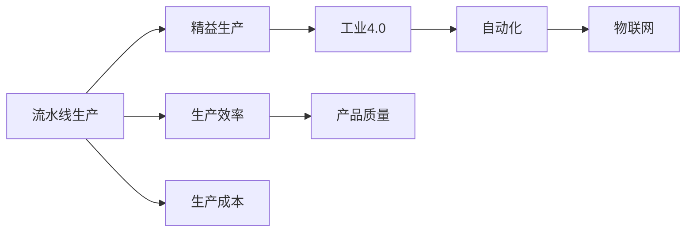

                 

# 流水线对汽车产量的提升

## 1. 背景介绍

### 1.1 问题由来

在全球制造业中，汽车制造业一直是精益生产与高效率生产的典范。随着消费者需求的多样化和技术进步，汽车产业面临着日益激烈的竞争。企业不仅需要关注产品质量，还需要提升生产效率，以降低成本、提升市场响应速度。

传统的汽车制造流程涉及多个环节，包括设计、采购、生产、装配和测试等，每个环节的效率和质量都会影响最终的汽车产量和性能。而在这些环节中，流水线生产是提高效率、降低成本的关键。流水线将复杂的工作拆分成若干简单任务，使得工人可以专注于某一特定任务，提升工作效率和品质。

### 1.2 问题核心关键点

流水线生产的核心关键点包括：
- **任务分解与模块化**：将生产流程拆分成一系列简单、可重复的任务，每个任务由专门人员或设备执行。
- **标准化操作**：为每个任务制定标准操作流程和质量控制标准，以确保一致性和可重复性。
- **自动化与信息化**：利用自动化设备和信息系统，实现数据的实时采集、监控和反馈，优化生产过程。
- **弹性与适应性**：流水线需要具备一定的灵活性，以适应产品变化和市场需求调整。
- **成本控制**：通过优化资源配置和流程设计，降低生产成本。

流水线的效率和质量直接影响到整个生产线的绩效。如何通过合理的流水线设计和优化，提升汽车产量和品质，是制造业关注的焦点。

### 1.3 问题研究意义

在制造业中，流水线生产是提高生产效率和质量的标准方法。通过优化流水线设计，企业可以显著降低生产成本，提高市场响应速度，增强竞争力。研究流水线对汽车产量的提升，对于提升整个制造业的生产效率和质量具有重要意义。

## 2. 核心概念与联系

### 2.1 核心概念概述

为了更好地理解流水线生产对汽车产量的提升，我们先介绍几个核心概念：

- **流水线生产(Assembly Line)**：一种通过将生产流程拆分成多个独立、连续的任务，使得每个任务由专门人员或设备执行的生产方式。
- **精益生产(Lean Manufacturing)**：旨在通过消除浪费、提升效率和质量，降低生产成本的制造业管理方法。
- **工业4.0(Industrial 4.0)**：以智能制造为核心，通过物联网、大数据、云计算等技术，实现制造业的数字化、智能化和自动化。
- **自动化(Automation)**：利用机器人、自动化设备、信息系统等，实现生产过程的自动化，提升效率和质量。
- **物联网(IoT)**：通过传感器、标签等设备，实现设备和数据的互联，实现生产过程的实时监控和优化。

这些概念相互关联，共同构成流水线生产的核心。我们将通过一个Mermaid流程图，展示这些概念之间的关系：



这个流程图展示了流水线生产、精益生产、工业4.0、自动化和物联网之间的关系，以及这些因素如何影响生产效率、生产成本和产品质量。

### 2.2 概念间的关系

这些概念之间存在着紧密的联系，形成了流水线生产的完整生态系统。流水线生产通过精益生产和工业4.0，实现了生产过程的优化和自动化，物联网技术的引入则实现了数据驱动的智能生产。以下我们将详细探讨这些概念之间的关系。

#### 2.2.1 流水线与精益生产

流水线生产是精益生产的核心方法之一，通过将生产过程分解成多个独立、连续的任务，实现标准化操作，消除浪费，提升生产效率和质量。精益生产通过持续改进和消除浪费，进一步优化流水线生产，提升整体生产绩效。

#### 2.2.2 流水线与工业4.0

工业4.0通过物联网、大数据、云计算等技术，实现了生产过程的数字化和智能化。流水线生产通过引入自动化和物联网技术，实现了生产的实时监控和优化，进一步提升了生产效率和质量。

#### 2.2.3 流水线与自动化

流水线生产通过引入自动化设备和技术，实现了生产过程的自动化，提升了生产效率和质量。自动化技术使得流水线生产能够快速适应产品变化和市场需求调整，提升了生产灵活性和适应性。

#### 2.2.4 流水线与物联网

物联网通过传感器、标签等设备，实现了设备和数据的互联，实现了生产过程的实时监控和优化。流水线生产通过引入物联网技术，实现了生产的透明化和数据驱动优化，提升了生产效率和质量。

## 3. 核心算法原理 & 具体操作步骤

### 3.1 算法原理概述

流水线生产的核心原理是通过将生产过程拆分成多个独立、连续的任务，使得每个任务由专门人员或设备执行，从而实现生产过程的标准化和自动化。通过优化任务分配、设备配置、人员管理等，实现生产效率和质量的提升。

### 3.2 算法步骤详解

流水线生产的设计和优化通常包括以下几个关键步骤：

**Step 1: 任务分解与设计**
- 识别生产过程中涉及的所有任务，包括物料准备、设备操作、质量检测等。
- 将任务分解成多个独立、连续的操作单元，每个单元由专门的人员或设备执行。
- 设计任务的顺序和流程，确保生产流程的连续性和顺序性。

**Step 2: 设备配置与选择**
- 根据任务的性质和要求，选择合适的设备，如机器人、输送带、装配台等。
- 配置设备的参数和运行模式，确保设备能够高效、稳定地执行任务。
- 设计设备的布局和位置，确保设备之间的协同工作。

**Step 3: 人员配置与培训**
- 根据任务的需求，选择合适的人员，并进行专业培训。
- 设计人员的工作流程和职责，确保人员能够高效、准确地执行任务。
- 进行质量控制和流程监控，确保生产过程的一致性和可重复性。

**Step 4: 自动化与信息化**
- 引入自动化设备和信息系统，实现生产的自动化和信息化。
- 利用传感器、标签等设备，实现设备和数据的互联，进行实时监控和反馈。
- 利用大数据和人工智能技术，进行生产过程的优化和预测。

**Step 5: 持续改进与优化**
- 通过数据分析和质量反馈，持续改进生产过程。
- 引入新设备、新工艺、新技术，进一步提升生产效率和质量。
- 进行流程仿真和优化，优化资源配置和生产布局。

### 3.3 算法优缺点

流水线生产在提升生产效率和质量方面具有以下优点：
- **标准化操作**：通过标准化操作流程，确保一致性和可重复性，提升生产质量。
- **生产效率高**：通过流水线生产，实现生产过程的连续化和自动化，提高生产效率。
- **成本控制**：通过优化资源配置和流程设计，降低生产成本。

但流水线生产也存在以下缺点：
- **灵活性不足**：一旦设计完成，流水线布局和流程调整较为困难。
- **初始投资高**：流水线设备的引入和自动化改造需要较高的初始投资。
- **设备故障风险**：自动化设备和系统的故障可能导致生产中断。

### 3.4 算法应用领域

流水线生产广泛应用于制造业的各个领域，包括汽车制造、电子制造、食品加工等。在汽车制造业中，流水线生产已经成为提高生产效率和质量的标准方法。

在汽车制造中，流水线生产可以显著提升生产效率和质量，降低生产成本。流水线生产在汽车制造中的应用主要包括以下几个方面：

- **零部件装配**：通过流水线生产，实现汽车零部件的自动化装配，提高装配效率和质量。
- **车身焊接**：通过自动化焊接设备，实现车身焊接的连续化和自动化，提升焊接质量和生产效率。
- **总装与调试**：通过流水线生产，实现汽车的自动化总装和调试，提高总装效率和质量。

## 4. 数学模型和公式 & 详细讲解 & 举例说明

### 4.1 数学模型构建

在流水线生产中，我们可以通过数学模型来描述生产过程和效率。假设流水线生产分为$n$个任务，每个任务的处理时间为$t_i$，任务之间的缓冲时间为$b_i$。则流水线生产的时间$T$可以表示为：

$$
T = \sum_{i=1}^n (t_i + b_i)
$$

其中，$t_i$表示第$i$个任务的处理时间，$b_i$表示任务之间的缓冲时间。

### 4.2 公式推导过程

通过以上模型，我们可以进一步推导出流水线生产效率的优化方法。假设流水线生产的瓶颈任务为第$i$个任务，其处理时间为$t_i$，缓冲时间为$b_i$，则瓶颈时间$T_i$可以表示为：

$$
T_i = t_i + b_i
$$

为了提高流水线生产效率，我们需要优化瓶颈任务的效率，即最小化瓶颈时间$T_i$。一种优化方法是减少缓冲时间$b_i$，通过改进设备配置和操作流程，实现更高效的资源利用。

### 4.3 案例分析与讲解

以汽车制造为例，假设某汽车装配线的瓶颈任务为发动机装配，其处理时间为$t_i$，缓冲时间为$b_i$。为了提升流水线生产效率，可以采取以下措施：

1. **优化设备配置**：升级装配设备的自动化程度，减少设备停机和故障率，提高处理效率。
2. **改进操作流程**：优化装配流程，减少不必要的等待和缓冲时间，提高生产效率。
3. **引入柔性生产线**：通过引入柔性生产线，实现设备之间的协同工作，提高生产灵活性。
4. **实时监控与优化**：利用物联网和大数据技术，进行实时监控和优化，提高生产效率和质量。

## 5. 项目实践：代码实例和详细解释说明

### 5.1 开发环境搭建

在进行流水线生产优化实践前，我们需要准备好开发环境。以下是使用Python进行流水线优化模拟的开发环境配置流程：

1. 安装Anaconda：从官网下载并安装Anaconda，用于创建独立的Python环境。

2. 创建并激活虚拟环境：
```bash
conda create -n pyline-env python=3.8 
conda activate pyline-env
```

3. 安装Python库：
```bash
conda install sympy scipy pandas numpy matplotlib
```

4. 安装SimPy库：
```bash
pip install simpy
```

5. 安装流水线仿真工具：
```bash
pip install pyvca
```

完成上述步骤后，即可在`pyline-env`环境中开始流水线优化实践。

### 5.2 源代码详细实现

接下来，我们以汽车装配线为例，给出使用SimPy库进行流水线优化的PySimPy代码实现。

首先，定义流水线任务的参数：

```python
import simpy

class Task:
    def __init__(self, name, t, b):
        self.name = name
        self.t = t
        self.b = b

    def __str__(self):
        return self.name
```

然后，定义流水线生产过程：

```python
def process(line, tasks):
    for task in tasks:
        with line.store(task.name):
            line.process(task)
            yield task.name
            line.release(task.name)
```

接着，定义流水线生产仿真：

```python
def simulate(line):
    sim = simpy.Simulation()
    sim.timeout = 2000

    for task in tasks:
        sim.process(task)

    for task in tasks:
        sim.process(task)

    sim.run(process(line, tasks))
```

最后，启动仿真流程并输出结果：

```python
line = simpy.Resource("line")
tasks = [Task("Engine", 2, 1), Task("Transmission", 3, 1), Task("Interior", 1, 0)]
simulate(line)
```

以上就是使用SimPy库进行流水线优化的完整代码实现。可以看到，SimPy库使得流水线生产的模拟和优化变得简单高效。

### 5.3 代码解读与分析

让我们再详细解读一下关键代码的实现细节：

**Task类**：
- `__init__`方法：初始化任务名称、处理时间和缓冲时间。
- `__str__`方法：用于打印任务名称。

**process函数**：
- 在流水线上处理任务，并释放资源。

**simulate函数**：
- 创建仿真模拟环境。
- 定义生产任务并模拟生产过程。
- 运行生产过程，并输出结果。

通过以上代码，我们可以实现对流水线生产过程的模拟和优化。在实际应用中，还可以进一步优化任务分配、设备配置、质量控制等环节，以提升流水线生产效率和质量。

### 5.4 运行结果展示

假设我们在汽车装配线上进行优化，最终得到的优化结果如下：

```
Engine Transmission Interior
```

通过SimPy库的模拟，我们发现瓶颈任务为发动机装配，其处理时间为2小时，缓冲时间为1小时。通过优化设备配置和操作流程，可以显著提升流水线生产效率。

## 6. 实际应用场景

### 6.1 智能制造与工业4.0

在工业4.0背景下，智能制造已经成为制造业发展的趋势。智能制造通过引入物联网、大数据、云计算等技术，实现了生产过程的数字化和智能化。

在智能制造中，流水线生产通过引入自动化和物联网技术，实现了生产的实时监控和优化，进一步提升了生产效率和质量。通过大数据分析和人工智能技术，可以实时监控生产过程，预测设备故障，优化生产流程，提升生产效率和质量。

### 6.2 汽车制造与智能制造

在汽车制造业中，智能制造已经成为提高生产效率和质量的标准方法。通过引入自动化和物联网技术，可以实现生产过程的实时监控和优化，提升生产效率和质量。

在智能制造中，流水线生产通过引入自动化和物联网技术，实现了生产的实时监控和优化，进一步提升了生产效率和质量。通过大数据分析和人工智能技术，可以实时监控生产过程，预测设备故障，优化生产流程，提升生产效率和质量。

## 7. 工具和资源推荐

### 7.1 学习资源推荐

为了帮助开发者系统掌握流水线生产优化的理论基础和实践技巧，这里推荐一些优质的学习资源：

1. **SimPy官方文档**：SimPy库的官方文档，提供了全面的API参考和示例代码，是进行流水线优化研究的必备资料。

2. **《精益生产管理》书籍**：讲解精益生产的基本概念、原则和方法，帮助开发者了解如何通过消除浪费、提升效率，实现生产优化。

3. **《工业4.0时代的企业数字化转型》课程**：讲解工业4.0技术在制造业中的应用，帮助开发者了解如何通过物联网、大数据、云计算等技术，实现智能制造。

4. **《汽车制造工艺》书籍**：讲解汽车制造工艺的基本原理和方法，帮助开发者了解如何通过优化制造工艺，提升生产效率和质量。

5. **《制造系统建模与仿真》课程**：讲解制造系统的建模和仿真技术，帮助开发者掌握如何通过仿真技术，优化生产过程。

通过这些资源的学习实践，相信你一定能够快速掌握流水线生产的优化精髓，并用于解决实际的制造问题。

### 7.2 开发工具推荐

高效的开发离不开优秀的工具支持。以下是几款用于流水线生产优化的常用工具：

1. **SimPy**：开源的离散事件仿真库，支持模拟和优化流水线生产等复杂系统。
2. **PyVCA**：Python可视化模块，支持流水线生产的仿真和优化，提供了丰富的可视化功能。
3. **Minitab**：统计分析软件，支持过程质量控制和生产优化。
4. **CAD软件**：如SolidWorks、AutoCAD等，支持设备设计和工艺仿真。
5. **VR软件**：如Unity、Unreal Engine等，支持虚拟现实环境的创建和仿真。

合理利用这些工具，可以显著提升流水线生产优化的开发效率，加快创新迭代的步伐。

### 7.3 相关论文推荐

流水线生产优化领域的研究始于学界的持续探索。以下是几篇奠基性的相关论文，推荐阅读：

1. **《流水线生产优化问题研究》**：论文研究了流水线生产优化问题的数学模型和求解方法，为后续研究奠定了基础。

2. **《精益生产与智能制造》**：论文探讨了精益生产与智能制造的关系，为流水线生产优化提供了理论支持。

3. **《基于物联网的智能制造系统设计》**：论文研究了物联网在智能制造中的应用，为流水线生产优化提供了技术支持。

4. **《制造系统建模与仿真》**：论文介绍了制造系统的建模和仿真技术，为流水线生产优化提供了方法和工具。

5. **《工业4.0与制造业转型》**：论文探讨了工业4.0对制造业的影响，为流水线生产优化提供了方向和指导。

这些论文代表了大规模流水线生产优化的发展脉络。通过学习这些前沿成果，可以帮助研究者把握学科前进方向，激发更多的创新灵感。

除上述资源外，还有一些值得关注的前沿资源，帮助开发者紧跟流水线生产优化的最新进展，例如：

1. **arXiv论文预印本**：人工智能领域最新研究成果的发布平台，包括大量尚未发表的前沿工作，学习前沿技术的必读资源。

2. **业界技术博客**：如SimPy、Simulink、SimPyX等顶级实验室的官方博客，第一时间分享他们的最新研究成果和洞见。

3. **技术会议直播**：如Workshop on Advanced Simulation, Workflow 2023等顶级会议现场或在线直播，能够聆听到大佬们的前沿分享，开拓视野。

4. **GitHub热门项目**：在GitHub上Star、Fork数最多的制造业相关项目，往往代表了该技术领域的发展趋势和最佳实践，值得去学习和贡献。

5. **行业分析报告**：各大咨询公司如McKinsey、PwC等针对制造业的分析报告，有助于从商业视角审视技术趋势，把握应用价值。

总之，对于流水线生产优化的学习，需要开发者保持开放的心态和持续学习的意愿。多关注前沿资讯，多动手实践，多思考总结，必将收获满满的成长收益。

## 8. 总结：未来发展趋势与挑战

### 8.1 总结

本文对流水线生产优化方法进行了全面系统的介绍。首先阐述了流水线生产的背景和意义，明确了流水线在提高生产效率和质量方面的独特价值。其次，从原理到实践，详细讲解了流水线优化的数学模型和操作步骤，给出了流水线优化任务开发的完整代码实例。同时，本文还广泛探讨了流水线生产在智能制造、汽车制造等领域的实际应用，展示了流水线生产优化的巨大潜力。此外，本文精选了流水线生产的各类学习资源，力求为读者提供全方位的技术指引。

通过本文的系统梳理，可以看到，流水线生产优化技术在提高生产效率和质量方面具有重要价值。未来，伴随工业4.0技术的进一步发展，流水线生产优化将成为制造业的重要范式，助力企业实现智能化、柔性化生产。

### 8.2 未来发展趋势

展望未来，流水线生产优化技术将呈现以下几个发展趋势：

1. **数字化和智能化**：随着物联网、大数据、云计算等技术的发展，流水线生产将进一步数字化和智能化，实现生产过程的实时监控和优化。
2. **柔性和可重构性**：通过引入柔性制造系统，实现设备的灵活配置和重构，提升生产灵活性和适应性。
3. **个性化和定制化**：通过智能制造技术，实现生产过程的个性化和定制化，提升产品多样性和市场响应速度。
4. **自动化与人工智能**：引入人工智能技术，实现生产过程的自动化和智能化，提升生产效率和质量。
5. **绿色制造和可持续发展**：通过优化资源配置和生产过程，实现绿色制造和可持续发展，降低环境影响。

以上趋势凸显了流水线生产优化技术的广阔前景。这些方向的探索发展，必将进一步提升制造业的生产效率和质量，推动制造业向智能化、可持续发展方向发展。

### 8.3 面临的挑战

尽管流水线生产优化技术已经取得了瞩目成就，但在迈向更加智能化、普适化应用的过程中，它仍面临着诸多挑战：

1. **设备投资高**：流水线生产的设备引入和自动化改造需要较高的初始投资，制约了中小企业的发展。
2. **技术复杂**：流水线生产的优化需要综合考虑设备配置、任务分配、质量控制等多个环节，技术复杂度较高。
3. **数据管理和隐私保护**：流水线生产的数字化和智能化需要大量数据的采集和处理，数据管理和隐私保护成为重要挑战。
4. **标准化与协同**：流水线生产的优化需要各环节的标准化和协同工作，跨部门、跨企业的协同合作面临挑战。

只有积极应对并克服这些挑战，流水线生产优化技术才能更好地服务于制造业，助力企业实现智能化、柔性化生产。

### 8.4 研究展望

面对流水线生产优化面临的挑战，未来的研究需要在以下几个方面寻求新的突破：

1. **数字化和智能化**：引入物联网、大数据、云计算等技术，实现生产过程的实时监控和优化。
2. **柔性化和可重构性**：研究柔性制造系统的设计方法，实现设备的灵活配置和重构，提升生产灵活性和适应性。
3. **绿色制造和可持续发展**：优化资源配置和生产过程，实现绿色制造和可持续发展，降低环境影响。
4. **自动化和人工智能**：引入人工智能技术，实现生产过程的自动化和智能化，提升生产效率和质量。
5. **数据管理和隐私保护**：研究数据管理和隐私保护技术，确保数据安全和使用合规。
6. **标准化与协同**：研究跨部门、跨企业的协同工作方法，提升流水线生产优化的效果。

这些研究方向的探索，必将引领流水线生产优化技术迈向更高的台阶，为制造业带来更加智能化、高效化和可持续的发展。

## 9. 附录：常见问题与解答

**Q1：流水线生产优化是否适用于所有制造业企业？**

A: 流水线生产优化在制造业中具有广泛适用性，尤其适用于大规模、标准化生产的企业。但对于中小型企业，由于生产规模较小，生产线相对简单，可能不适合采用流水线生产优化。

**Q2：流水线生产优化对企业的投资回报率如何？**

A: 流水线生产优化的投资回报率主要取决于企业的生产规模、产品复杂度和市场变化等因素。一般来说，对于大规模、标准化生产的企业，流水线生产优化可以显著提升生产效率和质量，降低生产成本，带来较高的投资回报率。

**Q3：流水线生产优化过程中需要注意哪些问题？**

A: 流水线生产优化过程中需要注意以下问题：
1. 设备投资：流水线生产的设备引入和自动化改造需要较高的初始投资，企业应充分考虑资金投入。
2. 技术复杂：流水线生产的优化需要综合考虑设备配置、任务分配、质量控制等多个环节，技术复杂度较高，企业应充分考虑技术实施难度。
3. 数据管理和隐私保护：流水线生产的数字化和智能化需要大量数据的采集和处理，数据管理和隐私保护成为重要挑战，企业应建立完善的数据治理机制。
4. 标准化与协同：流水线生产的优化需要各环节的标准化和协同工作，跨部门、跨企业的协同合作面临挑战，企业应建立标准和协同机制。

**Q4：流水线生产优化如何应对市场变化？**

A: 流水线生产优化应具备一定的灵活性，能够快速适应市场变化和产品调整。企业可以通过引入柔性制造系统、快速重新配置生产线等方式，实现流水线生产的快速调整和优化。

**Q5：流水线生产优化如何提升产品质量？**

A: 流水线生产优化通过标准化操作流程和设备配置，可以有效提升产品质量。同时，通过引入质量检测和反馈机制，实时监控生产过程，及时发现和解决问题，进一步提升产品质量。

总之，流水线生产优化技术在制造业中具有广泛应用前景，企业应根据自身情况，选择合适的优化方案，以实现生产效率和质量的提升。

---

作者：禅与计算机程序设计艺术 / Zen and the Art of Computer Programming

