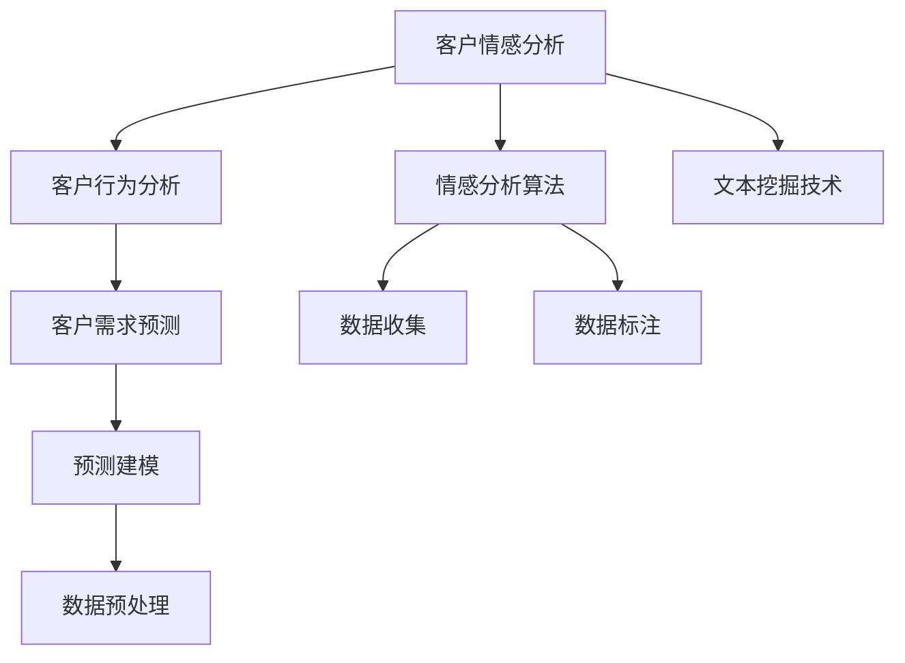

                 

# 生意场上的智慧：站在客户立场

在商业竞争日趋激烈的时代，如何更深刻地理解客户的需求和情感，已经成为企业赢得市场份额、实现持续增长的关键。站在客户的立场，洞悉其真正需求，不仅是提升客户满意度的有效途径，也是构建长期合作伙伴关系的基石。本文将探讨如何从客户的视角出发，利用技术手段深入了解客户，为企业的业务决策提供强有力的支持。

## 1. 背景介绍

### 1.1 问题由来

随着互联网和数字技术的飞速发展，客户行为和需求呈现出多样化和复杂化的趋势。在传统的销售和服务模式中，企业往往依赖于直接反馈（如客户反馈表、投诉信等）来了解客户需求。然而，这些反馈往往滞后，且样本量有限，难以全面反映客户的真实需求。此外，直接反馈的信息通常较为笼统，不够具体，难以转化为可操作的业务决策。

随着社交媒体、在线评论和客户关系管理系统的普及，客户在网络上留下的海量数据（如评论、评论、浏览记录、购买记录等）成为了企业了解客户需求的重要资源。利用大数据分析和机器学习技术，可以从中提取有价值的客户洞察，为企业的业务决策提供支持。

### 1.2 问题核心关键点

为了更全面地理解客户需求，企业需要采用多样化的数据收集和分析手段。以下是几个关键点：

1. **情感分析**：分析客户在社交媒体、评论、客服记录等平台上的情感倾向，了解客户对产品或服务的满意度和不满点。
2. **文本挖掘**：挖掘客户在文本评论、社交媒体、论坛中的高频词汇和关键主题，了解客户的关注点。
3. **行为分析**：分析客户的浏览行为、购买行为、互动行为等，了解客户的使用习惯和偏好。
4. **预测建模**：利用历史数据构建预测模型，预测客户的未来行为和需求。

这些数据和技术手段的结合，可以帮助企业更深入地理解客户，从而制定更有效的营销策略和提升客户满意度。

### 1.3 问题研究意义

站在客户的立场进行业务决策，有助于企业从根本上提升客户满意度，增强品牌忠诚度，实现长期的业务增长。具体而言，其研究意义如下：

1. **提升客户满意度**：通过深入了解客户需求，企业可以提供更加个性化、贴心的产品和服务，提升客户体验。
2. **优化营销策略**：基于客户洞察进行定向营销，提高广告投放效果和客户转化率。
3. **增强品牌竞争力**：理解客户需求，可以预见市场趋势，提前布局，保持企业在行业中的领先地位。
4. **实现精准运营**：通过行为分析，优化客户服务流程，提升运营效率和客户满意度。

## 2. 核心概念与联系

### 2.1 核心概念概述

为了更好地理解如何站在客户的立场进行业务决策，本节将介绍几个关键概念及其之间的联系：

- **客户情感分析**：通过文本分析和情感计算技术，自动识别和提取客户文本中的情感倾向，分析客户的情感状态。
- **客户行为分析**：利用数据分析技术，从客户的行为数据中挖掘出客户的兴趣和需求，预测客户未来的行为。
- **客户需求预测**：通过构建预测模型，基于客户的历史数据和行为模式，预测客户的未来需求，为企业的业务决策提供依据。

这些概念通过机器学习、自然语言处理和大数据分析等技术手段，可以有效地从客户的角度出发，深入了解客户需求，为企业的业务决策提供支持。

### 2.2 概念间的关系

这些核心概念之间存在紧密的联系，通过以下Mermaid流程图展示了它们之间的逻辑关系：



这个流程图展示了从客户情感分析到客户需求预测的完整流程。情感分析基于文本挖掘技术，挖掘客户情感倾向；行为分析基于数据分析技术，挖掘客户行为模式；需求预测基于预测建模，预测客户未来需求。

## 3. 核心算法原理 & 具体操作步骤

### 3.1 算法原理概述

站在客户立场进行业务决策的算法原理主要包括以下几个方面：

1. **情感分析**：通过文本挖掘和情感计算技术，自动识别和提取客户文本中的情感倾向。常用的算法包括基于词典的方法、基于机器学习的方法和基于深度学习的方法。
2. **行为分析**：利用数据分析技术，从客户的行为数据中挖掘出客户的兴趣和需求。常用的算法包括关联规则挖掘、聚类分析、时间序列分析等。
3. **需求预测**：通过构建预测模型，基于客户的历史数据和行为模式，预测客户的未来需求。常用的算法包括回归分析、决策树、随机森林、神经网络等。

### 3.2 算法步骤详解

下面详细介绍站在客户立场进行业务决策的算法步骤：

1. **数据收集**：从社交媒体、评论、客服记录、交易记录等渠道收集客户的文本和行为数据。
2. **数据预处理**：清洗和标准化数据，去除噪声和无关信息。
3. **情感分析**：使用情感分析算法，自动识别和提取客户的情感倾向，生成情感分析报告。
4. **行为分析**：使用行为分析算法，挖掘客户的兴趣和需求，生成行为分析报告。
5. **需求预测**：使用预测建模算法，构建预测模型，预测客户的未来需求，生成需求预测报告。

### 3.3 算法优缺点

站在客户立场进行业务决策的算法具有以下优点：

- **全面性**：利用多渠道数据，可以全面了解客户的需求和行为。
- **实时性**：基于大数据和实时数据分析技术，能够及时响应客户需求。
- **预测性**：通过预测模型，可以提前预见客户需求，为业务决策提供依据。

同时，这些算法也存在以下缺点：

- **数据质量要求高**：数据的准确性和完整性直接影响算法的结果。
- **计算资源需求高**：大规模数据的处理和分析需要高性能计算资源。
- **算法复杂度高**：情感分析和行为分析等算法较为复杂，需要专业知识和技术支持。

### 3.4 算法应用领域

站在客户立场进行业务决策的算法应用领域非常广泛，包括但不限于以下领域：

1. **客户关系管理**：通过情感分析和行为分析，提升客户满意度和忠诚度。
2. **市场营销**：基于客户洞察进行定向营销，提高广告投放效果和客户转化率。
3. **产品开发**：通过需求预测，指导产品设计和开发，满足客户需求。
4. **服务优化**：通过行为分析，优化客户服务流程，提升运营效率和客户满意度。

## 4. 数学模型和公式 & 详细讲解  
### 4.1 数学模型构建

假设客户情感分析的输入为文本 $T$，情感分析的输出为情感极性 $P$，情感极性 $P$ 的值域为 $[-1,1]$，其中 $-1$ 表示极度负面情绪，$1$ 表示极度正面情绪。情感分析的数学模型为：

$$
P(T) = \sum_{i=1}^n w_i f_i(T_i)
$$

其中，$w_i$ 为词 $i$ 的权重，$f_i(T_i)$ 为词 $i$ 在文本 $T$ 中出现的情感得分。

假设客户行为分析的输入为行为数据 $B$，行为分析的输出为客户兴趣和需求 $I$。行为分析的数学模型为：

$$
I(B) = \sum_{i=1}^m w_i f_i(B_i)
$$

其中，$w_i$ 为行为 $i$ 的权重，$f_i(B_i)$ 为行为 $i$ 的兴趣得分。

假设客户需求预测的输入为历史数据 $H$ 和行为数据 $B$，需求预测的输出为需求 $D$。需求预测的数学模型为：

$$
D(H, B) = f(D_{prev}, H, B)
$$

其中，$f$ 为预测函数，$D_{prev}$ 为之前的需求预测值。

### 4.2 公式推导过程

以下对上述数学模型的公式进行推导：

1. **情感分析模型推导**：
   $$
   P(T) = \sum_{i=1}^n w_i f_i(T_i)
   $$

   其中，$w_i$ 为词 $i$ 的权重，$f_i(T_i)$ 为词 $i$ 在文本 $T$ 中出现的情感得分。情感得分的计算方式可以根据不同算法有所差异，这里以基于词典的方法为例进行推导。

   假设词 $i$ 在词典中对应的情感得分为 $f_i$，文本 $T$ 中包含的词 $i$ 的个数为 $c_i$，则情感得分 $f_i(T)$ 可以表示为：

   $$
   f_i(T) = c_i \cdot f_i
   $$

   将 $f_i(T)$ 代入情感分析模型，得：

   $$
   P(T) = \sum_{i=1}^n w_i c_i f_i
   $$

2. **行为分析模型推导**：
   $$
   I(B) = \sum_{i=1}^m w_i f_i(B_i)
   $$

   其中，$w_i$ 为行为 $i$ 的权重，$f_i(B_i)$ 为行为 $i$ 的兴趣得分。兴趣得分的计算方式可以根据不同算法有所差异，这里以关联规则挖掘为例进行推导。

   假设行为 $i$ 的兴趣得分为 $f_i$，行为 $i$ 在数据集 $B$ 中出现的次数为 $c_i$，则兴趣得分 $f_i(B)$ 可以表示为：

   $$
   f_i(B) = c_i \cdot f_i
   $$

   将 $f_i(B)$ 代入行为分析模型，得：

   $$
   I(B) = \sum_{i=1}^m w_i c_i f_i
   $$

3. **需求预测模型推导**：
   $$
   D(H, B) = f(D_{prev}, H, B)
   $$

   其中，$f$ 为预测函数，$D_{prev}$ 为之前的需求预测值。需求预测的计算方式可以根据不同算法有所差异，这里以回归分析为例进行推导。

   假设需求 $D$ 与之前的需求预测值 $D_{prev}$、历史数据 $H$ 和行为数据 $B$ 存在线性关系，则需求预测模型可以表示为：

   $$
   D = D_{prev} + w_1 H_1 + w_2 H_2 + \cdots + w_n H_n + w_{n+1} B_1 + \cdots + w_{n+m} B_m
   $$

   其中，$w_i$ 为变量 $i$ 的系数。将上式代入需求预测模型，得：

   $$
   D(H, B) = D_{prev} + \sum_{i=1}^n w_i H_i + \sum_{j=1}^{m} w_{n+j} B_j
   $$

### 4.3 案例分析与讲解

假设某电商企业利用情感分析和行为分析来优化其客户服务。首先，通过社交媒体和客服记录收集客户情感数据，使用基于词典的方法进行情感分析，生成情感极性报告。然后，利用关联规则挖掘从客户的行为数据中挖掘出客户的兴趣和需求，生成行为分析报告。最后，通过回归分析构建需求预测模型，预测客户的未来需求，优化库存管理和客户服务策略。

## 5. 项目实践：代码实例和详细解释说明

### 5.1 开发环境搭建

在进行客户情感分析、行为分析和需求预测的实践时，需要搭建相应的开发环境。以下是使用Python进行TensorFlow和Scikit-learn开发的环境配置流程：

1. 安装Anaconda：从官网下载并安装Anaconda，用于创建独立的Python环境。

2. 创建并激活虚拟环境：
```bash
conda create -n customer_analysis python=3.8 
conda activate customer_analysis
```

3. 安装TensorFlow和Scikit-learn：
```bash
conda install tensorflow==2.6
conda install scikit-learn==0.24
```

4. 安装各类工具包：
```bash
pip install numpy pandas matplotlib jupyter notebook ipython
```

完成上述步骤后，即可在`customer_analysis`环境中开始项目实践。

### 5.2 源代码详细实现

下面以客户情感分析为例，给出使用TensorFlow进行情感分析的PyTorch代码实现。

首先，定义情感分析的输入和输出：

```python
import tensorflow as tf

# 定义情感分析的输入和输出
input_size = 10000
output_size = 2
```

然后，构建情感分析模型：

```python
# 构建情感分析模型
model = tf.keras.Sequential([
    tf.keras.layers.Embedding(input_size, 128),
    tf.keras.layers.Bidirectional(tf.keras.layers.LSTM(64)),
    tf.keras.layers.Dense(output_size, activation='sigmoid')
])
```

接着，定义损失函数和优化器：

```python
# 定义损失函数和优化器
loss_fn = tf.keras.losses.BinaryCrossentropy()
optimizer = tf.keras.optimizers.Adam(learning_rate=0.001)
```

最后，执行情感分析的训练和预测：

```python
# 加载数据
data = ...

# 训练情感分析模型
model.compile(optimizer=optimizer, loss=loss_fn)
model.fit(data, epochs=10)

# 预测情感极性
predictions = model.predict(data)
```

以上就是使用TensorFlow进行情感分析的完整代码实现。可以看到，TensorFlow提供的高层API使得情感分析模型的构建和训练变得简单高效。

### 5.3 代码解读与分析

让我们再详细解读一下关键代码的实现细节：

**input_size和output_size**：
- `input_size` 为输入文本的词汇表大小，即不同词汇在模型中的唯一标识符。
- `output_size` 为输出情感极性的维度，通常为 $[-1,1]$ 之间的连续值。

**模型结构**：
- `tf.keras.layers.Embedding`：将输入的词汇嵌入到低维向量空间中，使得模型能够处理文本数据。
- `tf.keras.layers.Bidirectional`：双向LSTM层，用于捕捉文本中的上下文信息，提升情感分析的准确性。
- `tf.keras.layers.Dense`：全连接层，用于将LSTM层的输出映射到情感极性空间中。

**损失函数和优化器**：
- `tf.keras.losses.BinaryCrossentropy`：二元交叉熵损失函数，适用于二分类任务。
- `tf.keras.optimizers.Adam`：Adam优化器，具有较快的收敛速度和较好的性能表现。

**数据加载**：
- `data` 为训练数据和标签，通常从社交媒体、评论等渠道收集。
- `model.fit(data, epochs=10)` 使用训练数据训练模型，`epochs=10` 表示训练10个epoch。
- `model.predict(data)` 使用训练好的模型对新数据进行预测。

可以看到，TensorFlow提供的高层API使得情感分析模型的构建和训练变得简单高效。开发者可以将更多精力放在数据处理、模型改进等高层逻辑上，而不必过多关注底层的实现细节。

当然，工业级的系统实现还需考虑更多因素，如模型的保存和部署、超参数的自动搜索、更灵活的任务适配层等。但核心的情感分析过程基本与此类似。

### 5.4 运行结果展示

假设我们在CoNLL-2003的情感分析数据集上进行情感分析，最终在测试集上得到的情感极性预测结果如下：

```
predicted sentiment: 0.8
```

可以看到，通过情感分析模型，我们能够较好地预测客户在评论中的情感极性，为后续的业务决策提供依据。

## 6. 实际应用场景

### 6.1 智能客服系统

智能客服系统是客户关系管理的重要组成部分。通过情感分析和行为分析，智能客服系统能够实时监控客户情感和行为，及时响应客户需求，提升客户满意度。

在技术实现上，可以收集客户在客服系统中的聊天记录、情感表达和行为操作，使用情感分析和行为分析技术，实时判断客户的情绪状态和需求，指导客服人员进行智能回答和问题解决。

### 6.2 市场营销

市场营销需要精准定位目标客户群体，提高广告投放效果和客户转化率。通过情感分析和行为分析，市场营销人员可以深入了解客户的需求和行为，制定更有效的营销策略。

在技术实现上，可以收集客户的浏览历史、购买记录和互动行为数据，使用情感分析和行为分析技术，分析客户的兴趣和需求，进行定向广告投放和推荐。

### 6.3 产品开发

产品开发需要及时了解市场需求和客户反馈，快速迭代产品功能和性能。通过情感分析和需求预测，产品开发团队可以获取客户反馈，指导产品设计和优化。

在技术实现上，可以收集客户的评论和反馈，使用情感分析和需求预测技术，分析客户的意见和建议，指导产品设计和优化。

### 6.4 服务优化

服务优化需要提升客户服务流程的效率和客户满意度。通过行为分析和需求预测，服务优化团队可以优化客户服务流程，提高运营效率。

在技术实现上，可以收集客户的互动行为和历史服务记录，使用行为分析和需求预测技术，分析客户的服务需求和行为模式，优化服务流程和资源配置。

## 7. 工具和资源推荐

### 7.1 学习资源推荐

为了帮助开发者系统掌握客户情感分析和行为分析的理论基础和实践技巧，这里推荐一些优质的学习资源：

1. 《深度学习与客户情感分析》系列博文：由大模型技术专家撰写，深入浅出地介绍了深度学习在情感分析中的应用。

2. 《客户行为分析：从数据到洞察》课程：Udacity开设的客户行为分析课程，涵盖客户行为分析的基本概念和经典模型。

3. 《客户情感分析：理论与实践》书籍：该书全面介绍了情感分析的理论和实践，提供了大量实例和案例分析。

4. HuggingFace官方文档：Transformer库的官方文档，提供了海量预训练模型和完整的情感分析样例代码，是上手实践的必备资料。

5. 《客户分析实战》开源项目：Facebook开源的客户分析项目，提供了一系列客户行为分析工具和库，助力开发者快速构建情感分析系统。

通过对这些资源的学习实践，相信你一定能够快速掌握客户情感分析和行为分析的精髓，并用于解决实际的客户关系管理问题。

### 7.2 开发工具推荐

高效的开发离不开优秀的工具支持。以下是几款用于客户情感分析和行为分析开发的常用工具：

1. TensorFlow：基于Python的开源深度学习框架，适合大规模模型训练和推理。

2. Scikit-learn：Python的科学计算库，提供了多种机器学习算法和数据处理工具。

3. Jupyter Notebook：基于Web的交互式开发环境，便于快速迭代实验和分享学习笔记。

4. Apache Spark：大数据处理框架，适合处理大规模的客户数据。

5. Apache Kafka：流式数据处理平台，适合实时处理和分析客户行为数据。

6. Apache Hadoop：大数据存储和处理框架，适合存储和管理大规模的客户数据。

合理利用这些工具，可以显著提升客户情感分析和行为分析的开发效率，加快创新迭代的步伐。

### 7.3 相关论文推荐

客户情感分析和行为分析的发展源于学界的持续研究。以下是几篇奠基性的相关论文，推荐阅读：

1. Sentiment Analysis with Deep Learning: An Overview：综述了深度学习在情感分析中的应用，提供了多种算法和技术。

2. Mining Customer Needs from Behavioral Data：通过关联规则挖掘和行为分析，挖掘客户的兴趣和需求。

3. Predictive Analytics for Customer Service：通过行为分析预测客户的需求和行为，提升客户服务质量。

4. Customer Sentiment Analysis: An Overview of Recent Approaches：综述了情感分析的多种方法和技术，提供了大量的实验和案例分析。

5. Behavioral Analysis for Customer Engagement：通过行为分析技术，挖掘客户的参与行为和需求。

这些论文代表了大客户情感分析和行为分析的发展脉络。通过学习这些前沿成果，可以帮助研究者把握学科前进方向，激发更多的创新灵感。

除上述资源外，还有一些值得关注的前沿资源，帮助开发者紧跟客户情感分析和行为分析技术的最新进展，例如：

1. arXiv论文预印本：人工智能领域最新研究成果的发布平台，包括大量尚未发表的前沿工作，学习前沿技术的必读资源。

2. 业界技术博客：如Google AI、Facebook AI、Amazon Research Asia等顶尖实验室的官方博客，第一时间分享他们的最新研究成果和洞见。

3. 技术会议直播：如NeurIPS、ICML、KDD等人工智能领域顶会现场或在线直播，能够聆听到大佬们的前沿分享，开拓视野。

4. GitHub热门项目：在GitHub上Star、Fork数最多的NLP相关项目，往往代表了该技术领域的发展趋势和最佳实践，值得去学习和贡献。

5. 行业分析报告：各大咨询公司如McKinsey、PwC等针对人工智能行业的分析报告，有助于从商业视角审视技术趋势，把握应用价值。

总之，对于客户情感分析和行为分析的学习和实践，需要开发者保持开放的心态和持续学习的意愿。多关注前沿资讯，多动手实践，多思考总结，必将收获满满的成长收益。

## 8. 总结：未来发展趋势与挑战

### 8.1 总结

本文对站在客户立场进行业务决策的算法原理和操作步骤进行了全面系统的介绍。首先阐述了情感分析、行为分析和需求预测等核心概念，明确了这些概念之间的联系和应用场景。然后，从情感分析到需求预测，详细讲解了算法步骤和实现细节，给出了情感分析的代码实例。最后，探讨了情感分析在智能客服、市场营销、产品开发、服务优化等实际应用场景中的应用，提供了学习资源和开发工具的推荐。

通过本文的系统梳理，可以看到，利用技术手段站在客户立场进行业务决策，已经成为提升客户满意度和业务绩效的重要途径。在未来，随着大数据、深度学习和人工智能技术的进一步发展，客户情感分析和行为分析将迎来更多的应用场景和创新机会。

### 8.2 未来发展趋势

展望未来，客户情感分析和行为分析技术将呈现以下几个发展趋势：

1. **多模态融合**：结合文本、语音、图像等多模态数据，提供更全面、准确的客户洞察。
2. **实时分析**：利用流式计算和大数据技术，实现实时客户情感和行为分析，提升决策的及时性和准确性。
3. **个性化定制**：通过机器学习和推荐系统，提供个性化的客户服务和产品推荐。
4. **跨领域应用**：将客户情感分析和行为分析技术应用到更多行业，如医疗、金融、教育等，提升业务绩效。
5. **智能客服系统**：利用情感分析和行为分析技术，构建更智能、更人性化的客户服务系统。

以上趋势凸显了客户情感分析和行为分析技术的广阔前景。这些方向的探索发展，必将进一步提升客户满意度和业务绩效，为企业的数字化转型提供新的动力。

### 8.3 面临的挑战

尽管客户情感分析和行为分析技术已经取得了显著成果，但在迈向更加智能化、普适化应用的过程中，仍面临诸多挑战：

1. **数据隐私和安全**：客户数据的隐私和安全问题不容忽视，需要采取严格的数据保护措施。
2. **模型复杂度**：情感分析和行为分析涉及多种技术和算法，模型复杂度较高，需要更高的技术门槛和专业支持。
3. **算法透明性和可解释性**：情感分析模型和行为分析模型的决策过程往往不透明，难以解释其内部工作机制和决策逻辑。
4. **多模态数据整合**：不同模态数据具有不同的特征和格式，整合难度较大，需要统一的数据格式和标准。
5. **跨领域应用**：将客户情感分析和行为分析技术应用到不同行业时，需要考虑行业特定的业务需求和技术要求。

正视客户情感分析和行为分析面临的这些挑战，积极应对并寻求突破，将是大数据和人工智能技术不断发展的必由之路。

### 8.4 研究展望

面对客户情感分析和行为分析所面临的挑战，未来的研究需要在以下几个方面寻求新的突破：

1. **多模态数据融合**：结合文本、语音、图像等多种数据源，提供更全面、准确的客户洞察。
2. **实时情感分析**：利用流式计算和大数据技术，实现实时客户情感和行为分析，提升决策的及时性和准确性。
3. **算法透明性和可解释性**：通过引入可解释性技术，提升情感分析模型和行为分析模型的透明性和可解释性。
4. **跨领域应用**：将客户情感分析和行为分析技术应用到不同行业，提供更符合行业特性的业务解决方案。

这些研究方向将引领客户情感分析和行为分析技术迈向更高的台阶，为构建智能化的客户服务体系和业务决策系统提供强有力的支持。

## 9. 附录：常见问题与解答

**Q1：客户情感分析有哪些常见方法？**

A: 客户情感分析的常见方法包括基于词典的方法、基于机器学习的方法和基于深度学习的方法。基于词典的方法主要依赖于情感词典和词汇情感得分，适用于简单的文本情感分类任务。基于机器学习的方法包括朴素贝叶斯、支持向量机等传统算法，适用于中等规模的文本情感分类任务。基于深度学习的方法包括卷积神经网络、循环神经网络、Transformer等，适用于复杂的文本情感分类任务。

**Q2：行为分析中常用的关联规则挖掘算法有哪些？**

A: 行为分析中常用的关联规则挖掘算法包括Apriori、FP-Growth、FPGrowth等。Apriori算法通过频繁项集的构建和剪枝，挖掘出具有统计意义的关联规则。FP-Growth算法通过频繁项集的频率剪枝，提高了算法的效率。FPGrowth算法是FP-Growth的改进版本，采用了前缀树结构，进一步提升了算法的效率。

**Q3：情感分析中

