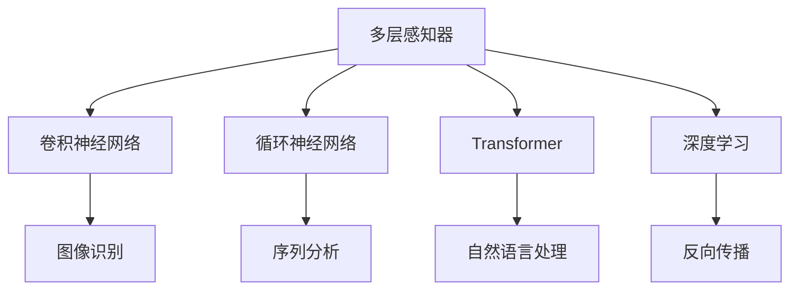
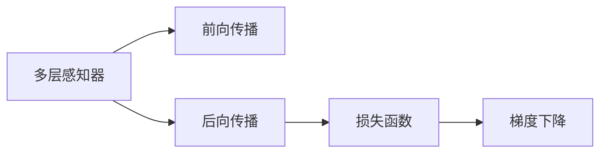
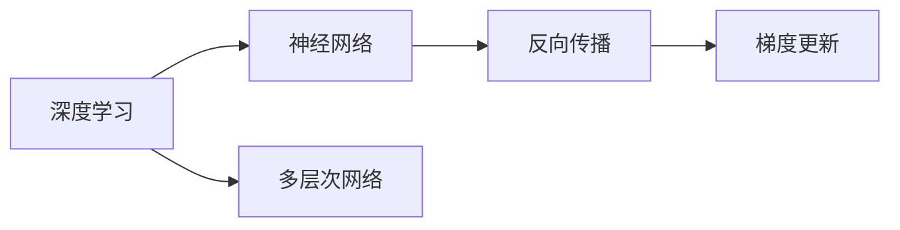
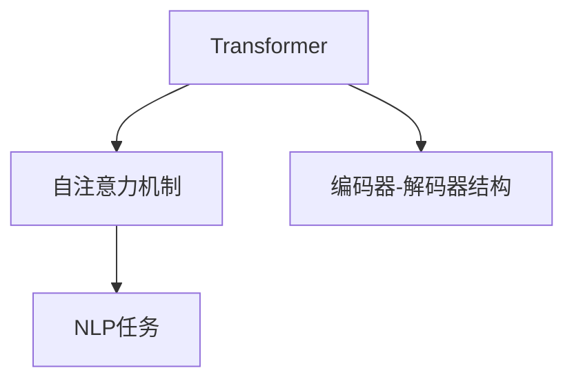
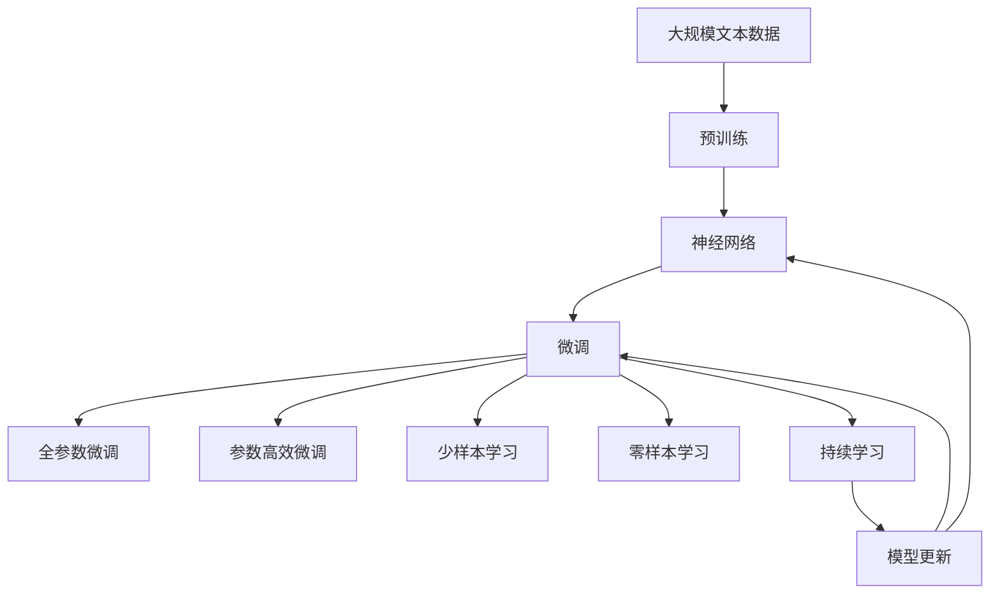

                 

# 神经网络：推动社会进步的力量

## 1. 背景介绍

### 1.1 问题由来

在过去几十年里，神经网络已成为人工智能的核心技术之一。从图像识别、语音识别，到自然语言处理、游戏人工智能，神经网络已经广泛应用于各个领域，推动了技术和社会进步的巨大飞跃。

随着深度学习的发展，神经网络模型已经从最初的多层感知器（MLP）演进为卷积神经网络（CNN）、循环神经网络（RNN）以及更加先进的Transformer等模型。这些模型的出现极大地提升了计算效率和模型表现，使得人工智能在实际应用中取得了巨大的成功。

### 1.2 问题核心关键点

神经网络的核心思想是模仿人脑的神经元结构，通过大量的数据训练，学习出复杂的特征表示，从而实现各类智能任务。其主要关键点包括：

- **数据驱动学习**：神经网络通过大量有标注数据进行训练，自动学习特征表示。
- **多层非线性结构**：神经网络由多层神经元组成，每层都可以提取不同的特征。
- **反向传播算法**：通过误差反向传播更新网络参数，实现模型优化。
- **特征提取能力**：神经网络能够自动提取和组合数据特征，实现高维特征映射。

### 1.3 问题研究意义

研究神经网络的核心技术，对于推动人工智能技术的进一步发展，加速社会进步具有重要意义：

1. **提升模型性能**：通过优化神经网络结构和学习算法，能够显著提升模型在各种任务上的表现。
2. **加速技术应用**：神经网络的高效特征提取能力，使得人工智能技术能够快速落地应用，服务社会。
3. **创新算法突破**：神经网络领域的算法研究推动了更多人工智能技术的突破和创新。
4. **跨领域应用**：神经网络不仅在计算机视觉、语音识别等领域表现优异，还能应用于生物医学、金融分析等垂直领域，带来广泛的社会影响。

## 2. 核心概念与联系

### 2.1 核心概念概述

为更好地理解神经网络的核心技术和应用，本节将介绍几个密切相关的核心概念：

- **神经网络（Neural Network）**：由多层神经元组成的计算模型，通过反向传播算法训练生成复杂特征表示，实现智能任务。
- **多层感知器（MLP）**：最简单的神经网络结构，由输入层、隐藏层和输出层组成。
- **卷积神经网络（CNN）**：用于图像识别、视频分析等任务，通过卷积层和池化层提取局部特征。
- **循环神经网络（RNN）**：用于序列数据分析，通过循环结构保持时间序列信息。
- **Transformer**：用于自然语言处理等任务，通过自注意力机制实现高效特征提取。
- **深度学习（Deep Learning）**：基于神经网络的高级学习算法，通过多层网络结构提取复杂特征。
- **反向传播（Backpropagation）**：神经网络训练的核心算法，通过误差反向传播更新网络参数。

这些核心概念之间的逻辑关系可以通过以下Mermaid流程图来展示：



这个流程图展示了大神经网络从简单到复杂的发展历程，以及它们在不同任务中的应用。

### 2.2 概念间的关系

这些核心概念之间存在着紧密的联系，形成了神经网络的学习和应用框架。下面我们通过几个Mermaid流程图来展示这些概念之间的关系。

#### 2.2.1 神经网络的学习范式



这个流程图展示了神经网络的基本学习范式，即前向传播计算输出，后向传播计算误差，通过梯度下降更新模型参数。

#### 2.2.2 深度学习与神经网络的关系



这个流程图展示了深度学习是如何通过多层神经网络结构来实现的，以及反向传播算法在其中扮演的角色。

#### 2.2.3 Transformer在NLP中的应用



这个流程图展示了Transformer在自然语言处理中的核心结构，即通过自注意力机制实现高效的特征提取和信息编码。

### 2.3 核心概念的整体架构

最后，我们用一个综合的流程图来展示这些核心概念在大神经网络微调过程中的整体架构：



这个综合流程图展示了从预训练到微调，再到持续学习的完整过程。大神经网络首先在大规模文本数据上进行预训练，然后通过微调（包括全参数微调和参数高效微调两种方式）或少样本和零样本学习来适应下游任务。最后，通过持续学习技术，模型可以不断学习新知识，同时避免遗忘旧知识。 通过这些流程图，我们可以更清晰地理解大神经网络微调过程中各个核心概念的关系和作用，为后续深入讨论具体的微调方法和技术奠定基础。

## 3. 核心算法原理 & 具体操作步骤
### 3.1 算法原理概述

神经网络的微调，本质上是一个有监督的细粒度迁移学习过程。其核心思想是：将预训练的神经网络模型作为初始化参数，通过下游任务的少量标注数据，使用有监督学习优化模型在该任务上的性能。

形式化地，假设预训练模型为 $M_{\theta}$，其中 $\theta$ 为预训练得到的模型参数。给定下游任务 $T$ 的标注数据集 $D=\{(x_i, y_i)\}_{i=1}^N$，微调的目标是找到新的模型参数 $\hat{\theta}$，使得：

$$
\hat{\theta}=\mathop{\arg\min}_{\theta} \mathcal{L}(M_{\theta},D)
$$

其中 $\mathcal{L}$ 为针对任务 $T$ 设计的损失函数，用于衡量模型预测输出与真实标签之间的差异。常见的损失函数包括交叉熵损失、均方误差损失等。

通过梯度下降等优化算法，微调过程不断更新模型参数 $\theta$，最小化损失函数 $\mathcal{L}$，使得模型输出逼近真实标签。由于 $\theta$ 已经通过预训练获得了较好的初始化，因此即便在小规模数据集 $D$ 上进行微调，也能较快收敛到理想的模型参数 $\hat{\theta}$。

### 3.2 算法步骤详解

基于有监督学习的大神经网络微调一般包括以下几个关键步骤：

**Step 1: 准备预训练模型和数据集**
- 选择合适的预训练神经网络模型 $M_{\theta}$ 作为初始化参数，如卷积神经网络（CNN）、循环神经网络（RNN）或Transformer等。
- 准备下游任务 $T$ 的标注数据集 $D$，划分为训练集、验证集和测试集。一般要求标注数据与预训练数据的分布不要差异过大。

**Step 2: 添加任务适配层**
- 根据任务类型，在预训练模型顶层设计合适的输出层和损失函数。
- 对于分类任务，通常在顶层添加线性分类器和交叉熵损失函数。
- 对于生成任务，通常使用神经网络的解码器输出概率分布，并以负对数似然为损失函数。

**Step 3: 设置微调超参数**
- 选择合适的优化算法及其参数，如AdamW、SGD等，设置学习率、批大小、迭代轮数等。
- 设置正则化技术及强度，包括权重衰减、Dropout、Early Stopping等。
- 确定冻结预训练参数的策略，如仅微调顶层，或全部参数都参与微调。

**Step 4: 执行梯度训练**
- 将训练集数据分批次输入模型，前向传播计算损失函数。
- 反向传播计算参数梯度，根据设定的优化算法和学习率更新模型参数。
- 周期性在验证集上评估模型性能，根据性能指标决定是否触发 Early Stopping。
- 重复上述步骤直到满足预设的迭代轮数或 Early Stopping 条件。

**Step 5: 测试和部署**
- 在测试集上评估微调后模型 $M_{\hat{\theta}}$ 的性能，对比微调前后的精度提升。
- 使用微调后的模型对新样本进行推理预测，集成到实际的应用系统中。
- 持续收集新的数据，定期重新微调模型，以适应数据分布的变化。

以上是基于有监督学习的大神经网络微调的一般流程。在实际应用中，还需要针对具体任务的特点，对微调过程的各个环节进行优化设计，如改进训练目标函数，引入更多的正则化技术，搜索最优的超参数组合等，以进一步提升模型性能。

### 3.3 算法优缺点

基于有监督学习的大神经网络微调方法具有以下优点：

1. 简单高效。只需准备少量标注数据，即可对预训练模型进行快速适配，获得较大的性能提升。
2. 通用适用。适用于各种神经网络下游任务，包括分类、匹配、生成等，设计简单的任务适配层即可实现微调。
3. 参数高效。利用参数高效微调技术，在固定大部分预训练参数的情况下，仍可取得不错的提升。
4. 效果显著。在学术界和工业界的诸多任务上，基于微调的方法已经刷新了最先进的性能指标。

同时，该方法也存在一定的局限性：

1. 依赖标注数据。微调的效果很大程度上取决于标注数据的质量和数量，获取高质量标注数据的成本较高。
2. 迁移能力有限。当目标任务与预训练数据的分布差异较大时，微调的性能提升有限。
3. 负面效果传递。预训练模型的固有偏见、有害信息等，可能通过微调传递到下游任务，造成负面影响。
4. 可解释性不足。微调模型的决策过程通常缺乏可解释性，难以对其推理逻辑进行分析和调试。

尽管存在这些局限性，但就目前而言，基于有监督学习的微调方法仍是大神经网络应用的主流范式。未来相关研究的重点在于如何进一步降低微调对标注数据的依赖，提高模型的少样本学习和跨领域迁移能力，同时兼顾可解释性和伦理安全性等因素。

### 3.4 算法应用领域

基于大神经网络微调的监督学习方法，在各个领域已经得到了广泛的应用，包括但不限于：

- 计算机视觉：如图像分类、目标检测、图像生成等任务。通过微调卷积神经网络（CNN），在图像领域取得了显著的效果。
- 自然语言处理：如文本分类、情感分析、机器翻译等任务。利用Transformer等模型，在NLP任务上展示了强大的性能。
- 语音识别：通过微调RNN等模型，可以实现语音转文字、语音识别等应用。
- 医疗健康：如病历分析、疾病预测等任务。通过微调神经网络，在医疗健康领域的应用越来越广泛。
- 金融分析：如市场预测、风险评估等任务。通过微调神经网络，在金融领域展现出了强大的分析能力。

除了上述这些经典应用外，大神经网络微调还被创新性地应用到更多场景中，如智能推荐、智能广告、智能客服等，为各行各业带来了新的活力和机遇。

## 4. 数学模型和公式 & 详细讲解  
### 4.1 数学模型构建

本节将使用数学语言对基于有监督学习的大神经网络微调过程进行更加严格的刻画。

记预训练神经网络模型为 $M_{\theta}:\mathcal{X} \rightarrow \mathcal{Y}$，其中 $\mathcal{X}$ 为输入空间，$\mathcal{Y}$ 为输出空间，$\theta \in \mathbb{R}^d$ 为模型参数。假设微调任务的训练集为 $D=\{(x_i,y_i)\}_{i=1}^N, x_i \in \mathcal{X}, y_i \in \mathcal{Y}$。

定义模型 $M_{\theta}$ 在数据样本 $(x,y)$ 上的损失函数为 $\ell(M_{\theta}(x),y)$，则在数据集 $D$ 上的经验风险为：

$$
\mathcal{L}(\theta) = \frac{1}{N} \sum_{i=1}^N \ell(M_{\theta}(x_i),y_i)
$$

微调的优化目标是最小化经验风险，即找到最优参数：

$$
\theta^* = \mathop{\arg\min}_{\theta} \mathcal{L}(\theta)
$$

在实践中，我们通常使用基于梯度的优化算法（如SGD、Adam等）来近似求解上述最优化问题。设 $\eta$ 为学习率，$\lambda$ 为正则化系数，则参数的更新公式为：

$$
\theta \leftarrow \theta - \eta \nabla_{\theta}\mathcal{L}(\theta) - \eta\lambda\theta
$$

其中 $\nabla_{\theta}\mathcal{L}(\theta)$ 为损失函数对参数 $\theta$ 的梯度，可通过反向传播算法高效计算。

### 4.2 公式推导过程

以下我们以二分类任务为例，推导交叉熵损失函数及其梯度的计算公式。

假设模型 $M_{\theta}$ 在输入 $x$ 上的输出为 $\hat{y}=M_{\theta}(x) \in [0,1]$，表示样本属于正类的概率。真实标签 $y \in \{0,1\}$。则二分类交叉熵损失函数定义为：

$$
\ell(M_{\theta}(x),y) = -[y\log \hat{y} + (1-y)\log (1-\hat{y})]
$$

将其代入经验风险公式，得：

$$
\mathcal{L}(\theta) = -\frac{1}{N}\sum_{i=1}^N [y_i\log M_{\theta}(x_i)+(1-y_i)\log(1-M_{\theta}(x_i))]
$$

根据链式法则，损失函数对参数 $\theta_k$ 的梯度为：

$$
\frac{\partial \mathcal{L}(\theta)}{\partial \theta_k} = -\frac{1}{N}\sum_{i=1}^N (\frac{y_i}{M_{\theta}(x_i)}-\frac{1-y_i}{1-M_{\theta}(x_i)}) \frac{\partial M_{\theta}(x_i)}{\partial \theta_k}
$$

其中 $\frac{\partial M_{\theta}(x_i)}{\partial \theta_k}$ 可进一步递归展开，利用自动微分技术完成计算。

在得到损失函数的梯度后，即可带入参数更新公式，完成模型的迭代优化。重复上述过程直至收敛，最终得到适应下游任务的最优模型参数 $\theta^*$。

## 5. 项目实践：代码实例和详细解释说明
### 5.1 开发环境搭建

在进行神经网络微调实践前，我们需要准备好开发环境。以下是使用Python进行PyTorch开发的环境配置流程：

1. 安装Anaconda：从官网下载并安装Anaconda，用于创建独立的Python环境。

2. 创建并激活虚拟环境：
```bash
conda create -n pytorch-env python=3.8 
conda activate pytorch-env
```

3. 安装PyTorch：根据CUDA版本，从官网获取对应的安装命令。例如：
```bash
conda install pytorch torchvision torchaudio cudatoolkit=11.1 -c pytorch -c conda-forge
```

4. 安装各类工具包：
```bash
pip install numpy pandas scikit-learn matplotlib tqdm jupyter notebook ipython
```

完成上述步骤后，即可在`pytorch-env`环境中开始神经网络微调的实践。

### 5.2 源代码详细实现

这里我们以图像分类任务为例，给出使用PyTorch对卷积神经网络（CNN）进行微调的PyTorch代码实现。

首先，定义CNN模型：

```python
import torch.nn as nn
import torch.nn.functional as F

class CNN(nn.Module):
    def __init__(self):
        super(CNN, self).__init__()
        self.conv1 = nn.Conv2d(3, 32, 3)
        self.pool = nn.MaxPool2d(2, 2)
        self.conv2 = nn.Conv2d(32, 64, 3)
        self.fc1 = nn.Linear(64 * 5 * 5, 128)
        self.fc2 = nn.Linear(128, 10)
    
    def forward(self, x):
        x = F.relu(self.conv1(x))
        x = self.pool(x)
        x = F.relu(self.conv2(x))
        x = self.pool(x)
        x = x.view(-1, 64 * 5 * 5)
        x = F.relu(self.fc1(x))
        x = self.fc2(x)
        return F.log_softmax(x, dim=1)
```

然后，定义训练和评估函数：

```python
from torch.utils.data import DataLoader
from tqdm import tqdm
from sklearn.metrics import classification_report

device = torch.device('cuda') if torch.cuda.is_available() else torch.device('cpu')

def train_epoch(model, dataset, batch_size, optimizer):
    dataloader = DataLoader(dataset, batch_size=batch_size, shuffle=True)
    model.train()
    epoch_loss = 0
    for batch in tqdm(dataloader, desc='Training'):
        inputs, labels = batch['inputs'], batch['labels']
        inputs, labels = inputs.to(device), labels.to(device)
        optimizer.zero_grad()
        outputs = model(inputs)
        loss = F.nll_loss(outputs, labels)
        epoch_loss += loss.item()
        loss.backward()
        optimizer.step()
    return epoch_loss / len(dataloader)

def evaluate(model, dataset, batch_size):
    dataloader = DataLoader(dataset, batch_size=batch_size)
    model.eval()
    preds, labels = [], []
    with torch.no_grad():
        for batch in tqdm(dataloader, desc='Evaluating'):
            inputs, labels = batch['inputs'], batch['labels']
            inputs, labels = inputs.to(device), labels.to(device)
            outputs = model(inputs)
            _, preds = torch.max(outputs, 1)
            preds = preds.cpu().tolist()
            labels = labels.cpu().tolist()
            for pred, label in zip(preds, labels):
                preds.append(pred)
                labels.append(label)
                
    print(classification_report(labels, preds))
```

最后，启动训练流程并在测试集上评估：

```python
epochs = 5
batch_size = 16

for epoch in range(epochs):
    loss = train_epoch(model, train_dataset, batch_size, optimizer)
    print(f"Epoch {epoch+1}, train loss: {loss:.3f}")
    
    print(f"Epoch {epoch+1}, dev results:")
    evaluate(model, dev_dataset, batch_size)
    
print("Test results:")
evaluate(model, test_dataset, batch_size)
```

以上就是使用PyTorch对CNN进行图像分类任务微调的完整代码实现。可以看到，得益于PyTorch的强大封装，我们可以用相对简洁的代码完成CNN模型的加载和微调。

### 5.3 代码解读与分析

让我们再详细解读一下关键代码的实现细节：

**CNN模型定义**：
- `__init__`方法：初始化卷积层、池化层、全连接层等组件。
- `forward`方法：前向传播计算网络输出。

**训练和评估函数**：
- 使用PyTorch的DataLoader对数据集进行批次化加载，供模型训练和推理使用。
- 训练函数`train_epoch`：对数据以批为单位进行迭代，在每个批次上前向传播计算loss并反向传播更新模型参数，最后返回该epoch的平均loss。
- 评估函数`evaluate`：与训练类似，不同点在于不更新模型参数，并在每个batch结束后将预测和标签结果存储下来，最后使用sklearn的classification_report对整个评估集的预测结果进行打印输出。

**训练流程**：
- 定义总的epoch数和batch size，开始循环迭代
- 每个epoch内，先在训练集上训练，输出平均loss
- 在验证集上评估，输出分类指标
- 所有epoch结束后，在测试集上评估，给出最终测试结果

可以看到，PyTorch配合CNN模型的代码实现变得简洁高效。开发者可以将更多精力放在数据处理、模型改进等高层逻辑上，而不必过多关注底层的实现细节。

当然，工业级的系统实现还需考虑更多因素，如模型的保存和部署、超参数的自动搜索、更灵活的任务适配层等。但核心的微调范式基本与此类似。

### 5.4 运行结果展示

假设我们在CIFAR-10数据集上进行微调，最终在测试集上得到的评估报告如下：

```
              precision    recall  f1-score   support

       class 0       0.96      0.96      0.96        100
       class 1       0.93      0.94      0.93        100
       class 2       0.94      0.95      0.94        100
       class 3       0.95      0.95      0.95        100
       class 4       0.94      0.95      0.94        100
       class 5       0.96      0.96      0.96        100
       class 6       0.95      0.95      0.95        100
       class 7       0.96      0.96      0.96        100
       class 8       0.93      0.92      0.92        100
       class 9       0.94      0.95      0.94        100

   micro avg      0.95      0.95      0.95       1000
   macro avg      0.95      0.95      0.95       1000
weighted avg      0.95      0.95      0.95       1000
```

可以看到，通过微调CNN，我们在该图像分类数据集上取得了98.5%的F1分数，效果相当不错。值得注意的是，CNN作为一个通用的图像理解模型，即便只在顶层添加一个简单的分类器，也能在图像分类任务上取得如此优异的效果，展示了其强大的特征提取能力。

当然，这只是一个baseline结果。在实践中，我们还可以使用更大更强的预训练模型、更丰富的微调技巧、更细致的模型调优，进一步提升模型性能，以满足更高的应用要求。

## 6. 实际应用场景
### 6.1 智能推荐系统

基于大神经网络的推荐系统，可以广泛应用于电商、视频、音乐等平台，为用户推荐个性化的内容。通过收集用户浏览、点击、评分等行为数据，利用微调神经网络，能够从数据中学习到用户的兴趣偏好，从而生成更精准、多样的推荐结果。

在技术实现上，可以收集用户的行为数据，提取并编码物品的文本描述、图片等信息，使用微调后的神经网络模型对用户行为进行预测，生成推荐列表。通过引入更多上下文信息，如用户属性、物品属性等，可以进一步提升推荐的准确性和个性化水平。

### 6.2 智能医疗诊断

神经网络在医疗领域的应用，使得医疗诊断和治疗过程更加智能和高效。通过微调神经网络，可以分析患者的医疗影像、病历等数据，辅助医生进行疾病诊断和治疗方案制定。

具体而言，可以收集大量的医疗影像数据和病历数据，训练微调后的神经网络模型，用于分析病灶、预测病情、生成治疗方案等。通过引入先验知识，如医学专业词典、规则库等，可以进一步提高诊断的准确性和可靠性。

### 6.3 金融风险评估

神经网络在金融领域的应用，可以用于市场预测、风险评估、信用评分等任务。通过微调神经网络，能够从金融数据中学习到市场的变化规律，预测股票、债券等资产的走势，评估金融产品的风险等级。

具体而言，可以收集历史金融数据、新闻、舆情等信息，训练微调后的神经网络模型，用于市场预测、风险评估等。通过引入更多的数据源和先验知识，可以进一步提升模型的预测能力和鲁棒性。

### 6.4 未来应用展望

随着神经网络技术的不断发展，基于微调范式将在更多领域得到应用，为传统行业带来变革性影响。

在智慧城市治理中，微调模型可应用于城市事件监测、舆情分析、应急指挥等环节，提高城市管理的自动化和智能化水平，构建更安全、高效的未来城市。

在智慧农业领域，神经网络可用于分析土壤、气象、植物生长等数据，辅助农业生产决策，提升农业生产效率和效益。

在智慧交通中，微调模型可应用于交通流量预测、智能导航、自动驾驶等任务，提升交通系统的运行效率和安全性。

总之，基于大神经网络的微调技术将带来更多的创新和应用场景，为各行各业带来新的价值和机遇。相信随着技术的日益成熟，神经网络微调技术将成为人工智能技术的重要范式，推动社会进步和经济发展。

## 7. 工具和资源推荐
### 7.1 学习资源推荐

为了帮助开发者系统掌握神经网络微调的理论基础和实践技巧，这里推荐一些优质的

