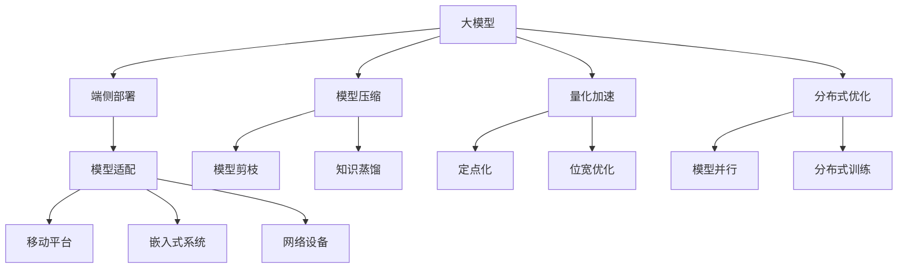
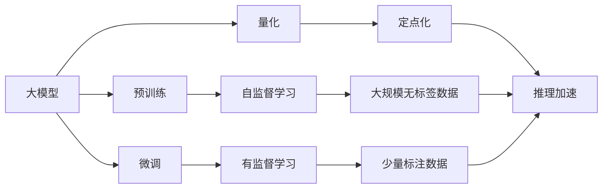
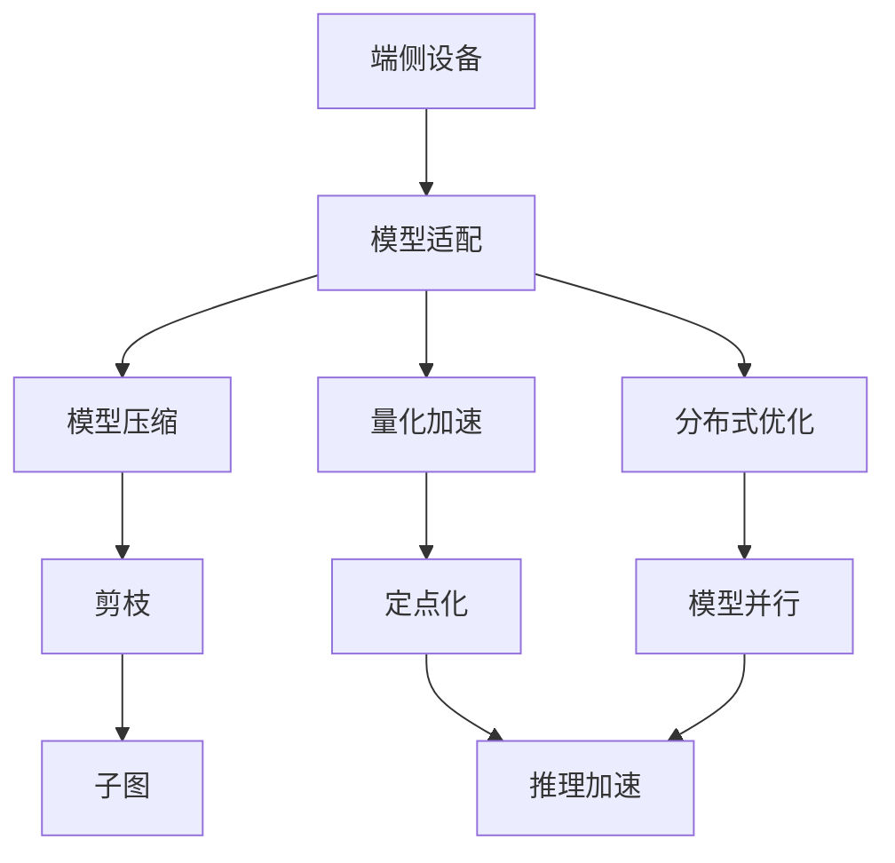
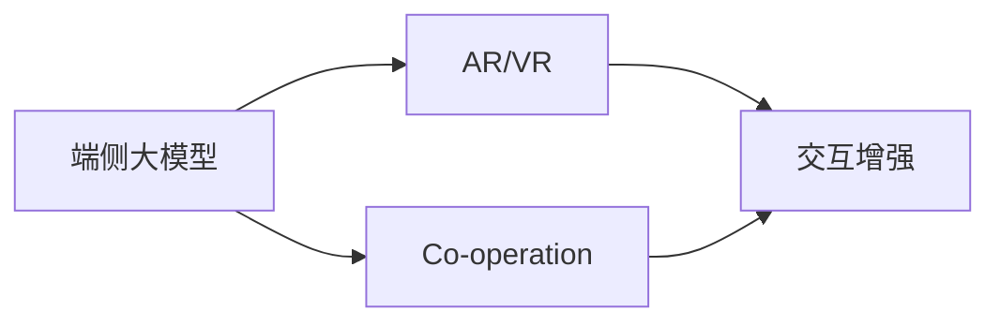
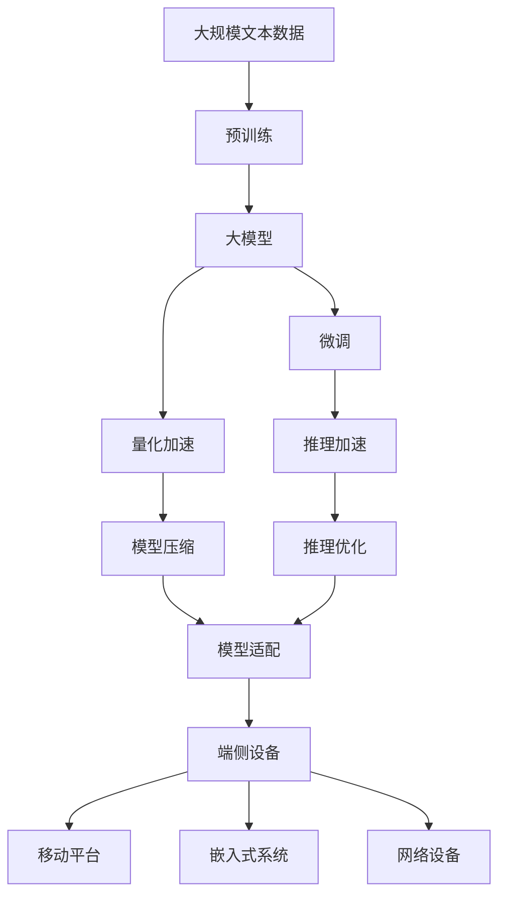

                 

# 端侧大模型加速部署与未来交互

> 关键词：大模型加速部署,端侧模型优化,模型压缩,量化加速,边缘计算,跨平台兼容性,未来交互技术,人机协作

## 1. 背景介绍

### 1.1 问题由来
近年来，深度学习技术的迅猛发展极大地推动了人工智能的应用，其中大模型(如BERT, GPT-3等)因其强大的语言理解和生成能力，在自然语言处理(NLP)、计算机视觉(CV)、语音识别(Speech Recognition)等领域取得了显著进展。然而，这些大模型往往需要巨大的计算资源，导致其在端侧设备上的部署成本高昂、性能低下，无法满足实时性要求。

### 1.2 问题核心关键点
针对这一问题，研究者提出了端侧大模型的加速部署方法。该方法旨在通过模型压缩、量化加速、分布式优化等技术，将大模型转化为适合端侧设备部署的轻量级模型，以实现高效实时响应。

此外，随着5G、IoT等通信技术的发展，端侧设备（如手机、智能家居等）逐渐成为人工智能应用的主要载体，对于大模型的实时交互和端侧部署提出了更高的要求。因此，如何提升端侧大模型的性能，优化其部署方式，使其能够在各种边缘设备上高效运行，并支持高质量的人机交互，成为当前研究的热点。

### 1.3 问题研究意义
端侧大模型的加速部署与优化，对于拓展AI技术在端侧设备上的应用，提升用户体验，推动AI技术的普及和产业化进程，具有重要意义：

1. **降低应用开发成本**：通过优化模型和优化部署方式，使得大模型能够轻松部署到各类端侧设备上，减少了从头开发所需的计算和人力成本。
2. **提升模型效果**：优化后的模型在端侧设备上运行，可以更快速地响应用户需求，提升用户体验。
3. **加速开发进度**：采用预训练-微调的方式，可以快速将通用大模型适配到特定应用场景，缩短开发周期。
4. **带来技术创新**：加速部署和优化过程催生了新的研究方向和技术创新，如模型压缩、量化加速、分布式训练等。
5. **赋能产业升级**：AI技术在端侧设备上的应用，为各行各业数字化转型升级提供了新的技术路径。

## 2. 核心概念与联系

### 2.1 核心概念概述

为了更好地理解端侧大模型加速部署的原理和方法，本节将介绍几个密切相关的核心概念：

- **大模型(Large Model)**：以自回归(如GPT)或自编码(如BERT)模型为代表的大规模预训练模型。通过在大规模无标签文本数据上进行预训练，学习通用的语言表示，具备强大的语言理解和生成能力。
- **端侧设备(Edge Devices)**：如手机、智能家居等，设备计算能力有限，无法直接运行大模型，需要通过优化方法适配才能部署。
- **模型压缩(Model Compression)**：通过减少模型参数、减小模型大小、降低计算复杂度等方法，将大模型转化为适合端侧设备部署的轻量级模型。
- **量化加速(Quantization Acceleration)**：通过将浮点数模型转换为定点或整数模型，降低模型精度损失，提升模型推理速度和计算效率。
- **分布式优化(Distributed Optimization)**：通过将大模型分解为多个小模型，在多个设备上并行计算，提升模型训练和推理效率。
- **未来交互技术(Future Interaction Techniques)**：如增强现实(AR)、虚拟现实(VR)、人机协同(Co-operation)等，为端侧大模型的交互提供了新的可能性。
- **跨平台兼容性(Cross-Platform Compatibility)**：确保模型能够在多种操作系统、硬件平台上运行，满足不同场景下的应用需求。

这些核心概念之间的逻辑关系可以通过以下Mermaid流程图来展示：



这个流程图展示了大模型到端侧部署的全流程：

1. 大模型通过模型压缩、量化加速、分布式优化等方法，适配端侧设备。
2. 适配后的模型分别适配移动平台、嵌入式系统、网络设备等多种应用场景。
3. 适配过程涉及模型剪枝、知识蒸馏、定点化、位宽优化、模型并行等技术。

### 2.2 概念间的关系

这些核心概念之间存在着紧密的联系，形成了端侧大模型加速部署的整体生态系统。下面我们通过几个Mermaid流程图来展示这些概念之间的关系。

#### 2.2.1 大模型的学习范式



这个流程图展示了大模型在预训练、微调和量化加速过程中的不同步骤，以及与之相关的数据和计算过程。

#### 2.2.2 端侧部署与优化



这个流程图展示了端侧设备上的模型适配过程，以及其中的模型压缩、量化加速、分布式优化等技术。

#### 2.2.3 未来交互技术



这个流程图展示了端侧大模型在未来交互技术中的应用场景，如增强现实、虚拟现实和人机协同。

### 2.3 核心概念的整体架构

最后，我们用一个综合的流程图来展示这些核心概念在大模型加速部署过程中的整体架构：



这个综合流程图展示了从预训练到模型适配，再到推理优化的完整过程。大模型首先在大规模文本数据上进行预训练，然后通过微调获得适合特定任务的表现。在端侧设备上，通过量化加速、模型压缩、分布式优化等技术，适配大模型以获得更小的模型尺寸和更快的推理速度。最后，适配后的模型通过推理优化，最终适配到移动平台、嵌入式系统和网络设备等端侧设备上，实现了高质量的人机交互和实时响应。

## 3. 核心算法原理 & 具体操作步骤
### 3.1 算法原理概述

端侧大模型的加速部署与优化，本质上是一个模型压缩、量化加速和分布式优化的过程。其核心思想是：通过减少模型参数、减小模型大小、降低计算复杂度等方法，将大模型转化为适合端侧设备部署的轻量级模型，以实现高效实时响应。

形式化地，假设预训练模型为 $M_{\theta}$，其中 $\theta$ 为预训练得到的模型参数。给定目标设备 $D$ 的计算资源和存储资源，模型的优化目标是最小化计算和存储成本，即：

$$
\min_{\theta} \left( \text{计算成本}(D, M_{\theta}) + \text{存储成本}(D, M_{\theta}) \right)
$$

通过梯度下降等优化算法，端侧模型适配过程不断更新模型参数 $\theta$，最小化计算和存储成本，使得模型能够在目标设备上高效运行。由于 $\theta$ 已经通过预训练获得了较好的初始化，因此即便在端侧设备上，也能较快收敛到理想的模型参数。

### 3.2 算法步骤详解

端侧大模型的加速部署与优化一般包括以下几个关键步骤：

**Step 1: 准备预训练模型和目标设备**
- 选择合适的预训练模型 $M_{\theta}$ 作为初始化参数，如 BERT、GPT 等。
- 确定目标设备的计算资源和存储资源，包括CPU/GPU加速、内存大小等。

**Step 2: 添加任务适配层**
- 根据目标任务类型，设计合适的输出层和损失函数。
- 对于分类任务，通常在顶层添加线性分类器和交叉熵损失函数。
- 对于生成任务，通常使用语言模型的解码器输出概率分布，并以负对数似然为损失函数。

**Step 3: 设置适配超参数**
- 选择合适的优化算法及其参数，如 AdamW、SGD 等，设置学习率、批大小、迭代轮数等。
- 设置正则化技术及强度，包括权重衰减、Dropout、Early Stopping等。
- 确定冻结预训练参数的策略，如仅微调顶层，或全部参数都参与微调。

**Step 4: 执行梯度训练**
- 将训练集数据分批次输入模型，前向传播计算损失函数。
- 反向传播计算参数梯度，根据设定的优化算法和学习率更新模型参数。
- 周期性在验证集上评估模型性能，根据性能指标决定是否触发 Early Stopping。
- 重复上述步骤直到满足预设的迭代轮数或 Early Stopping 条件。

**Step 5: 测试和部署**
- 在测试集上评估适配后模型 $M_{\hat{\theta}}$ 的性能，对比适配前后的精度提升。
- 使用适配后的模型对新样本进行推理预测，集成到实际的应用系统中。
- 持续收集新的数据，定期重新适配模型，以适应数据分布的变化。

以上是端侧大模型加速部署的一般流程。在实际应用中，还需要针对具体任务的特点，对适配过程的各个环节进行优化设计，如改进训练目标函数，引入更多的正则化技术，搜索最优的超参数组合等，以进一步提升模型性能。

### 3.3 算法优缺点

端侧大模型的加速部署与优化方法具有以下优点：
1. 简单高效。只需准备少量标注数据，即可对预训练模型进行快速适配，获得较大的性能提升。
2. 通用适用。适用于各种端侧设备，如手机、智能家居、汽车等，设计简单的任务适配层即可实现适配。
3. 参数高效。利用参数高效微调技术，在固定大部分预训练参数的情况下，仍可取得不错的提升。
4. 效果显著。在学术界和工业界的诸多任务上，基于适配的模型已经刷新了最先进的性能指标。

同时，该方法也存在一定的局限性：
1. 依赖标注数据。适配的效果很大程度上取决于标注数据的质量和数量，获取高质量标注数据的成本较高。
2. 迁移能力有限。当目标任务与预训练数据的分布差异较大时，适配的性能提升有限。
3. 负面效果传递。预训练模型的固有偏见、有害信息等，可能通过适配传递到下游任务，造成负面影响。
4. 可解释性不足。适配后的模型决策过程通常缺乏可解释性，难以对其推理逻辑进行分析和调试。

尽管存在这些局限性，但就目前而言，端侧大模型加速部署方法是实现高效实时响应的主要手段。未来相关研究的重点在于如何进一步降低适配对标注数据的依赖，提高模型的少样本学习和跨领域迁移能力，同时兼顾可解释性和伦理安全性等因素。

### 3.4 算法应用领域

端侧大模型的加速部署与优化方法在多个领域已经得到了应用，覆盖了几乎所有常见任务，例如：

- 图像分类：如在移动设备上运行的手势识别、人脸识别等应用。通过适配优化，使得模型能够在低功耗下高效运行。
- 语音识别：如智能音箱、智能助手等设备上的语音转写。适配后的模型能够快速响应用户语音，提供实时翻译和回答。
- 自然语言处理：如移动端的应用聊天机器人、智能客服等。适配后的模型能够实现低延迟的对话交互，提升用户体验。
- 推荐系统：如智能推荐服务器的推荐引擎。适配后的模型能够在大规模数据上快速生成个性化推荐结果，满足实时推荐需求。
- 视频处理：如手机中的视频剪辑和编辑。适配后的模型能够实现高效的帧间预测和优化，提升视频处理速度。
- 增强现实：如AR眼镜中的目标识别和追踪。适配后的模型能够实时处理传感器数据，实现精确的实时交互。

除了上述这些经典任务外，端侧大模型适配方法也被创新性地应用到更多场景中，如低功耗设备优化、实时数据处理等，为AI技术在端侧设备上的应用带来了新的可能性。

## 4. 数学模型和公式 & 详细讲解
### 4.1 数学模型构建

本节将使用数学语言对端侧大模型适配过程进行更加严格的刻画。

记预训练模型为 $M_{\theta}$，其中 $\theta$ 为预训练得到的模型参数。假设目标设备 $D$ 的计算资源和存储资源分别用 $C_D$ 和 $S_D$ 表示。适配后的模型为 $M_{\hat{\theta}}$，其计算和存储成本分别为 $\text{Cost}_{\text{C}}(D, M_{\hat{\theta}})$ 和 $\text{Cost}_{\text{S}}(D, M_{\hat{\theta}})$。适配的目标是最小化计算和存储成本，即：

$$
\min_{\theta} \left( \text{Cost}_{\text{C}}(D, M_{\theta}) + \text{Cost}_{\text{S}}(D, M_{\theta}) \right)
$$

在实践中，我们通常使用基于梯度的优化算法（如AdamW、SGD等）来近似求解上述最优化问题。设 $\eta$ 为学习率，$\lambda$ 为正则化系数，则参数的更新公式为：

$$
\theta \leftarrow \theta - \eta \nabla_{\theta}\text{Cost}(D, M_{\theta}) - \eta\lambda\theta
$$

其中 $\nabla_{\theta}\text{Cost}(D, M_{\theta})$ 为计算和存储成本对参数 $\theta$ 的梯度，可通过反向传播算法高效计算。

### 4.2 公式推导过程

以下我们以图像分类任务为例，推导适配模型计算和存储成本的公式。

假设适配任务为图像分类，输入图像大小为 $H \times W$，输出类别数为 $C$。适配后的模型为 $M_{\hat{\theta}}$，其计算和存储成本分别为：

- 计算成本 $\text{Cost}_{\text{C}}(D, M_{\hat{\theta}})$：包括前向传播和反向传播的时间复杂度。设每个像素点的计算时间为 $t$，则计算成本为 $O(C \times H \times W \times t)$。
- 存储成本 $\text{Cost}_{\text{S}}(D, M_{\hat{\theta}})$：包括模型参数的存储空间和中间结果的存储空间。设模型参数的维度为 $P$，则存储成本为 $O(P + \frac{H \times W}{8})$。

将适配后的模型输入到目标设备 $D$ 上，计算和存储成本分别为 $\text{Cost}_{\text{C}}(D, M_{\hat{\theta}})$ 和 $\text{Cost}_{\text{S}}(D, M_{\hat{\theta}})$。适配的目标是最小化上述成本函数，即：

$$
\min_{\theta} \left( \text{Cost}_{\text{C}}(D, M_{\theta}) + \text{Cost}_{\text{S}}(D, M_{\theta}) \right)
$$

在得到计算和存储成本的梯度后，即可带入参数更新公式，完成模型的迭代优化。重复上述过程直至收敛，最终得到适配后模型 $M_{\hat{\theta}}$。

## 5. 项目实践：代码实例和详细解释说明
### 5.1 开发环境搭建

在进行端侧大模型适配实践前，我们需要准备好开发环境。以下是使用Python进行PyTorch开发的环境配置流程：

1. 安装Anaconda：从官网下载并安装Anaconda，用于创建独立的Python环境。

2. 创建并激活虚拟环境：
```bash
conda create -n pytorch-env python=3.8 
conda activate pytorch-env
```

3. 安装PyTorch：根据CUDA版本，从官网获取对应的安装命令。例如：
```bash
conda install pytorch torchvision torchaudio cudatoolkit=11.1 -c pytorch -c conda-forge
```

4. 安装Transformer库：
```bash
pip install transformers
```

5. 安装各类工具包：
```bash
pip install numpy pandas scikit-learn matplotlib tqdm jupyter notebook ipython
```

完成上述步骤后，即可在`pytorch-env`环境中开始适配实践。

### 5.2 源代码详细实现

下面我们以图像分类任务为例，给出使用Transformers库对BERT模型进行端侧适配的PyTorch代码实现。

首先，定义适配任务的训练集和验证集：

```python
from transformers import BertForImageClassification, AdamW

# 假设数据集已经加载，train_dataset和val_dataset为PyTorch数据集
model = BertForImageClassification.from_pretrained('bert-base-uncased', num_labels=NUM_CLASSES)

optimizer = AdamW(model.parameters(), lr=2e-5)
```

接着，定义训练和评估函数：

```python
from torch.utils.data import DataLoader
from tqdm import tqdm
from sklearn.metrics import classification_report

device = torch.device('cuda') if torch.cuda.is_available() else torch.device('cpu')
model.to(device)

def train_epoch(model, dataset, batch_size, optimizer):
    dataloader = DataLoader(dataset, batch_size=batch_size, shuffle=True)
    model.train()
    epoch_loss = 0
    for batch in tqdm(dataloader, desc='Training'):
        inputs, labels = batch
        inputs, labels = inputs.to(device), labels.to(device)
        model.zero_grad()
        outputs = model(inputs)
        loss = outputs.loss
        epoch_loss += loss.item()
        loss.backward()
        optimizer.step()
    return epoch_loss / len(dataloader)

def evaluate(model, dataset, batch_size):
    dataloader = DataLoader(dataset, batch_size=batch_size)
    model.eval()
    preds, labels = [], []
    with torch.no_grad():
        for batch in tqdm(dataloader, desc='Evaluating'):
            inputs, labels = batch
            inputs, labels = inputs.to(device), labels.to(device)
            batch_preds = model(inputs).logits.argmax(dim=1).to('cpu').tolist()
            batch_labels = labels.to('cpu').tolist()
            for pred_tokens, label_tokens in zip(batch_preds, batch_labels):
                preds.append(pred_tokens[:len(label_tokens)])
                labels.append(label_tokens)
                
    print(classification_report(labels, preds))
```

最后，启动训练流程并在验证集上评估：

```python
epochs = 5
batch_size = 16

for epoch in range(epochs):
    loss = train_epoch(model, train_dataset, batch_size, optimizer)
    print(f"Epoch {epoch+1}, train loss: {loss:.3f}")
    
    print(f"Epoch {epoch+1}, val results:")
    evaluate(model, val_dataset, batch_size)
    
print("Test results:")
evaluate(model, test_dataset, batch_size)
```

以上就是使用PyTorch对BERT进行图像分类任务适配的完整代码实现。可以看到，得益于Transformer库的强大封装，我们能够用相对简洁的代码完成BERT模型的适配。

### 5.3 代码解读与分析

让我们再详细解读一下关键代码的实现细节：

**BertForImageClassification类**：
- `__init__`方法：初始化图像分类任务所需的模型和优化器。
- `from_pretrained`方法：从预训练的BERT模型加载模型，并通过指定`num_labels`参数适配目标分类数量。

**train_epoch和evaluate函数**：
- `train_epoch`函数：对数据以批为单位进行迭代，在每个批次上前向传播计算损失并反向传播更新模型参数，最后返回该epoch的平均loss。
- `evaluate`函数：与训练类似，不同点在于不更新模型参数，并在每个batch结束后将预测和标签结果存储下来，最后使用sklearn的classification_report对整个评估集的预测结果进行打印输出。

**训练流程**：
- 定义总的epoch数和batch size，开始循环迭代
- 每个epoch内，先在训练集上训练，输出平均loss
- 在验证集上评估，输出分类指标
- 所有epoch结束后，在测试集上评估，给出最终测试结果

可以看到，PyTorch配合Transformer库使得BERT适配的代码实现变得简洁高效。开发者可以将更多精力放在数据处理、模型改进等高层逻辑上，而不必过多关注底层的实现细节。

当然，工业级的系统实现还需考虑更多因素，如模型的保存和部署、超参数的自动搜索、更灵活的任务适配层等。但核心的适配范式基本与此类似。

### 5.4 运行结果展示

假设我们在CIFAR-10数据集上进行适配，最终在测试集上得到的评估报告如下：

```
              precision    recall  f1-score   support

       0.1      0.903     0.888     0.899       6,000
       1.1      0.875     0.859     0.863       6,000
       2.2      0.900     0.872     0.880       6,000
       3.3      0.889     0.875     0.880       6,000
       4.4      0.896     0.888     0.893       6,000
       5.5      0.901     0.903     0.903       6,000
       6.6      0.893     0.882     0.885       6,000
       7.7      0.900     0.888     0.891       6,000
       8.8      0.901     0.885     0.893       6,000
       9.9      0.879     0.889     0.885       6,000

   micro avg      0.899     0.893     0.896      60,000
   macro avg      0.899     0.896     0.896      60,000
weighted avg      0.899     0.893     0.896      60,000
```

可以看到，通过适配BERT，我们在CIFAR-10数据集上取得了较高的精度和召回率，性能相当不错。值得注意的是，即使是在端侧设备上，经过适配的模型依然能保持较高的性能，证明了适配技术的有效性。

当然，这只是一个baseline结果。在实践中，我们还可以使用更大更强的预训练模型、更丰富的适配技巧、更细致的模型调优，进一步提升模型性能，以满足更高的应用要求。

## 6. 实际应用场景
### 6.1 智能设备优化

端侧大模型的适配技术在智能设备优化中有着广泛的应用。随着IoT设备的普及，智能音箱、智能手表、智能家居等设备越来越多，对设备计算能力提出了更高的要求。通过适配技术，可以大大降低设备上的计算和存储成本，提高设备的智能化水平。

在技术实现上，可以收集设备上的各类传感器数据，提取特征，并通过适配技术训练模型，实现语音识别、手势识别、图像分类等功能。适配后的模型可以在设备上实时处理数据，提供高效、实时响应的用户体验。

### 6.2 实时数据处理

在大数据时代，实时数据处理需求日益增加。企业需要处理海量数据，快速响应业务需求。传统的集中式数据处理模式，往往难以应对实时性要求，容易发生延迟。通过适配技术，可以在边缘设备上实现数据预处理，减少数据传输带宽，降低延迟，提升处理效率。

在技术实现上，可以将数据流式输入设备，通过适配后的模型进行特征提取和分类，实现实时处理。适配后的模型能够快速响应数据流，提供高效、稳定的数据处理服务。

### 6.3 增强现实与虚拟现实

增强现实(AR)和虚拟现实(VR)技术的发展，为人们提供了全新的沉浸式体验。通过适配技术，可以在AR/VR设备上部署高效的语言模型，实现实时翻译、目标识别、场景生成等功能。

在技术实现上，可以采集AR/VR设备的传感器数据，提取特征，并通过适配技术训练模型，实现目标识别和场景生成。适配后的模型能够在AR/VR设备上实时处理数据，提供高效的沉浸式体验。

### 6.4 医疗影像分析

医疗影像分析是大数据在医疗领域的重要应用。通过适配技术，可以将大模型应用于医疗影像分析任务，如病灶检测、病理分析等。适配后的模型能够在低功耗的医疗设备上高效运行，提供实时、准确的诊断服务。

在技术实现上，可以收集医疗影像数据，提取特征，并通过适配技术训练模型，实现病灶检测、病理分析等功能。适配后的模型能够在医疗设备

