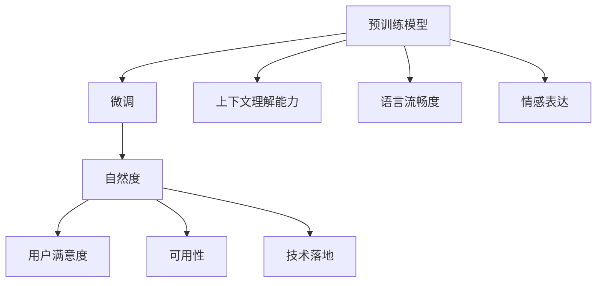
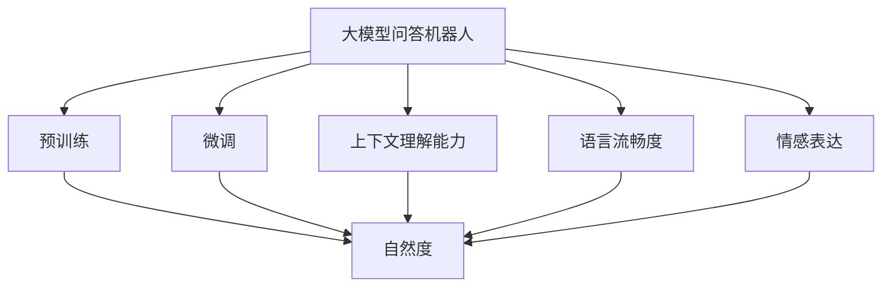
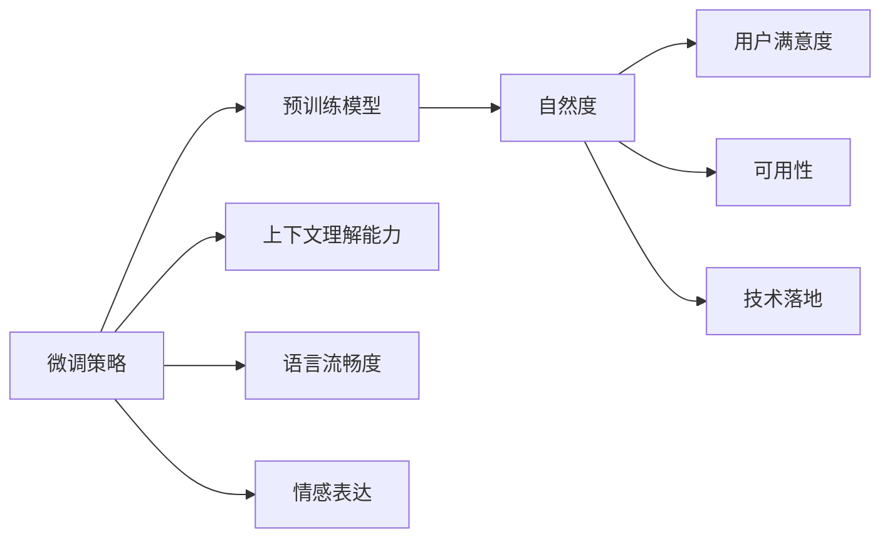
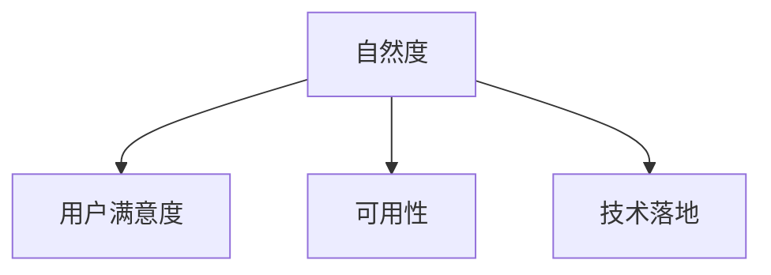

                 

# 大模型问答机器人的自然度

## 1. 背景介绍

### 1.1 问题由来

在人工智能领域，大模型问答机器人（Large Model Question Answering, LM-QA）逐渐成为智能助手领域的热门话题。这种机器人通过使用深度学习和大规模预训练的语言模型，能够理解和回答自然语言问题，为用户提供信息检索、知识问答、辅助决策等多种服务。然而，如何衡量和提升这些机器人回答问题的自然度，一直是一个具有挑战性的问题。

自然度通常用于描述问答系统输出的自然语言与人类自然语言之间的相似度，是衡量系统回答质量的重要指标。在实际应用中，自然度高的回答更贴近人类的语言习惯，流畅、连贯、无歧义，更容易被用户接受和理解。然而，当前大模型问答机器人在自然度方面仍存在一定的局限性。

### 1.2 问题核心关键点

大模型问答机器人的自然度提升涉及到多个方面，包括预训练模型选择、微调策略、上下文理解能力、语言流畅度、情感表达等方面。以下是对这些关键点的详细说明：

1. **预训练模型选择**：选择适合的预训练模型是大模型问答机器人自然度提升的基础。目前常用的预训练模型包括GPT、BERT、XLNet等，它们在各种自然语言处理任务上取得了卓越的成绩。

2. **微调策略**：微调是提升大模型问答机器人自然度的重要手段。通过针对特定任务的微调，可以使得模型更加适应特定语言环境，提高回答的自然度。

3. **上下文理解能力**：在回答问题时，机器人需要理解问题的上下文，这包括问题中的关键词、情感色彩、语言风格等。这要求模型具备良好的上下文理解能力，能够准确捕捉问题的核心内容。

4. **语言流畅度**：自然度高的回答通常语言流畅，没有语法错误，句式结构清晰。这需要模型在生成回答时，能够在语法、词汇和句式上与人类自然语言保持一致。

5. **情感表达**：在回答中，机器人需要根据问题的情感色彩，表达相应的情感，如疑问、肯定、否定、感谢等。情感表达的准确性直接影响到回答的自然度。

### 1.3 问题研究意义

提升大模型问答机器人的自然度，对于提升用户满意度、提高智能助手的可用性、推动人工智能技术在实际应用中的落地具有重要意义。具体如下：

1. **提升用户满意度**：自然度高的回答更容易被用户接受和理解，从而提升用户体验和满意度。

2. **提高智能助手的可用性**：自然度高的回答能够更加贴合用户需求，提高智能助手的实际可用性。

3. **推动技术落地**：自然度高的回答能够更好地与用户进行互动，推动人工智能技术在实际应用中的普及和落地。

## 2. 核心概念与联系

### 2.1 核心概念概述

在探讨大模型问答机器人的自然度时，我们需要理解以下几个核心概念：

1. **大模型问答机器人**：利用深度学习和预训练模型技术，能够理解和回答自然语言问题的人工智能系统。

2. **自然度**：用于描述问答系统输出自然语言的指标，衡量系统回答质量的关键因素。

3. **预训练模型**：在大规模无标签文本数据上进行训练的模型，具备较强的语言理解和生成能力。

4. **微调**：通过针对特定任务的训练，使预训练模型能够更好地适应特定领域的应用，提升自然度。

5. **上下文理解能力**：模型能够理解问题的上下文，包括关键词、情感色彩、语言风格等。

6. **语言流畅度**：回答的语言流畅，没有语法错误，句式结构清晰。

7. **情感表达**：回答中根据问题的情感色彩，准确表达相应的情感。

这些核心概念之间的联系和作用关系可以通过以下Mermaid流程图来展示：



这个流程图展示了从预训练模型到微调，再到自然度提升的过程，以及自然度提升对用户满意度、智能助手可用性和技术落地的影响。

### 2.2 概念间的关系

这些核心概念之间存在着紧密的联系，形成了大模型问答机器人自然度提升的完整生态系统。下面通过几个Mermaid流程图来展示这些概念之间的关系：

#### 2.2.1 大模型问答机器人的学习范式



这个流程图展示了从预训练到微调，再到自然度提升的完整过程，以及上下文理解能力、语言流畅度和情感表达对自然度的影响。

#### 2.2.2 微调策略与自然度的关系



这个流程图展示了微调策略对预训练模型的影响，以及上下文理解能力、语言流畅度和情感表达对自然度提升的作用。

#### 2.2.3 自然度的评价指标



这个流程图展示了自然度与用户满意度、可用性和技术落地的关系，即自然度高的回答能够更好地提升用户满意度和系统可用性，推动技术的实际应用。

## 3. 核心算法原理 & 具体操作步骤
### 3.1 算法原理概述

大模型问答机器人的自然度提升，主要通过以下步骤实现：

1. **预训练模型选择**：选择合适的预训练模型，如GPT、BERT等，作为基础模型。

2. **微调策略设计**：设计合适的微调策略，针对特定任务进行微调。

3. **上下文理解能力提升**：通过微调策略提升模型对问题的上下文理解能力。

4. **语言流畅度优化**：通过微调策略优化回答的语言流畅度。

5. **情感表达精准化**：通过微调策略使回答中的情感表达更加精准。

### 3.2 算法步骤详解

以下是对大模型问答机器人自然度提升的具体操作步骤的详细讲解：

**Step 1: 选择预训练模型**

首先，根据任务需求选择合适的预训练模型。常用的预训练模型包括GPT、BERT、XLNet等。GPT模型在生成自然语言方面表现出色，BERT模型则在理解自然语言方面具有优势。

**Step 2: 设计微调策略**

设计合适的微调策略，通常包括以下步骤：

1. 数据准备：收集并预处理问题数据，准备用于微调的标注数据。

2. 模型初始化：将预训练模型加载到计算设备，如GPU或TPU上。

3. 微调目标设定：设定微调目标，如上下文理解能力、语言流畅度、情感表达等。

4. 微调参数设置：设置微调参数，如学习率、批大小、迭代轮数等。

5. 微调执行：使用标注数据对预训练模型进行微调。

**Step 3: 提升上下文理解能力**

在微调过程中，可以通过以下方法提升模型的上下文理解能力：

1. 引入多轮对话：通过对话数据集进行微调，使模型能够理解多轮对话的上下文。

2. 添加上下文提示：在问题中加入上下文提示，帮助模型理解问题的背景信息。

3. 使用序列模型：采用序列模型，如Seq2Seq模型，增强模型对上下文的处理能力。

**Step 4: 优化语言流畅度**

语言流畅度是自然度提升的重要方面，可以通过以下方法优化：

1. 语言模型训练：在微调过程中，加入语言模型训练任务，优化语言流畅度。

2. 语法规则约束：在模型生成过程中，引入语法规则约束，避免语法错误。

3. 词汇表优化：优化词汇表，增加常用词汇和短语，提升语言流畅度。

**Step 5: 精准化情感表达**

情感表达对自然度的提升至关重要，可以通过以下方法精准化情感表达：

1. 情感标注数据：使用情感标注数据进行微调，使模型能够精准表达情感。

2. 情感迁移学习：通过迁移学习，将其他情感表达任务的模型参数迁移到目标任务中。

3. 情感嵌入学习：在模型中引入情感嵌入学习，提升情感表达的准确性。

### 3.3 算法优缺点

**优点**：

1. **泛化能力强**：预训练模型在大规模无标签文本数据上进行训练，具备较强的泛化能力，能够在各种任务中提升自然度。

2. **模型适应性强**：通过微调，模型可以适应特定领域的应用，提升自然度。

3. **学习速度快**：预训练模型已经在大规模数据上进行了充分的训练，微调过程相对较短，学习速度快。

**缺点**：

1. **数据需求高**：微调需要大量的标注数据，数据获取和处理成本较高。

2. **模型复杂度高**：预训练模型和微调模型复杂度高，需要高性能计算设备支持。

3. **模型依赖性强**：微调过程高度依赖预训练模型，模型选择不当可能影响效果。

### 3.4 算法应用领域

大模型问答机器人的自然度提升技术已经在多个领域得到了广泛应用，包括：

1. **智能客服**：提升智能客服系统回答的自然度，提升用户满意度。

2. **医疗咨询**：提升医疗问答系统的自然度，提供更贴近人类语言的医疗咨询服务。

3. **金融咨询**：提升金融问答系统的自然度，提供更自然流畅的金融咨询。

4. **教育辅导**：提升教育问答系统的自然度，提供更自然流畅的教育辅导。

## 4. 数学模型和公式 & 详细讲解 & 举例说明

### 4.1 数学模型构建

大模型问答机器人的自然度提升，可以通过以下数学模型进行构建：

设预训练模型为 $M_{\theta}$，其中 $\theta$ 为模型参数。在微调过程中，通过标注数据 $D=\{(x_i,y_i)\}_{i=1}^N$，最小化损失函数 $\mathcal{L}(M_{\theta},D)$，其中 $x_i$ 为问题，$y_i$ 为答案。微调的目标是使模型输出 $M_{\theta}(x_i)$ 与标注答案 $y_i$ 尽可能一致。

### 4.2 公式推导过程

假设问题为 $x$，答案为 $y$，回答为 $a$。则自然度可以表示为 $L_n(a,x,y)$，具体如下：

$$
L_n(a,x,y) = \begin{cases}
    1 & \text{if } a = y \\
    0 & \text{if } a \neq y
\end{cases}
$$

在微调过程中，最小化自然度损失函数 $\mathcal{L}_n(M_{\theta},D)$，目标为：

$$
\mathcal{L}_n(M_{\theta},D) = -\frac{1}{N} \sum_{i=1}^N L_n(M_{\theta}(x_i),x_i,y_i)
$$

具体计算时，可以使用交叉熵损失函数：

$$
\mathcal{L}_n(M_{\theta},D) = -\frac{1}{N} \sum_{i=1}^N \log \left( \frac{\exp \left( \log P(y_i | x_i, \theta) \right)}{\sum_{j=1}^M \exp \left( \log P(y_j | x_i, \theta) \right)} \right)
$$

其中，$P(y_j | x_i, \theta)$ 为模型在问题 $x_i$ 下的回答 $y_j$ 的概率分布。

### 4.3 案例分析与讲解

以医疗咨询为例，假设问题为“我得了高血压，怎么办？”，答案为“你需要去看医生，并遵循医生的治疗方案”，回答为“高血压可以通过健康饮食和适当运动来控制，但建议尽快就医”。

通过上述自然度损失函数，可以计算出回答的自然度得分。如果回答与答案完全一致，则得分为1，否则得分小于1。通过不断优化模型参数 $\theta$，可以使回答的自然度得分最大化，从而提升自然度。

## 5. 项目实践：代码实例和详细解释说明

### 5.1 开发环境搭建

在进行自然度提升实践前，我们需要准备好开发环境。以下是使用Python进行PyTorch开发的环境配置流程：

1. 安装Anaconda：从官网下载并安装Anaconda，用于创建独立的Python环境。

2. 创建并激活虚拟环境：
```bash
conda create -n pytorch-env python=3.8 
conda activate pytorch-env
```

3. 安装PyTorch：根据CUDA版本，从官网获取对应的安装命令。例如：
```bash
conda install pytorch torchvision torchaudio cudatoolkit=11.1 -c pytorch -c conda-forge
```

4. 安装Transformers库：
```bash
pip install transformers
```

5. 安装各类工具包：
```bash
pip install numpy pandas scikit-learn matplotlib tqdm jupyter notebook ipython
```

完成上述步骤后，即可在`pytorch-env`环境中开始自然度提升实践。

### 5.2 源代码详细实现

下面以医疗咨询为例，给出使用Transformers库对BERT模型进行自然度提升的PyTorch代码实现。

首先，定义自然度提升的数据处理函数：

```python
from transformers import BertTokenizer
from torch.utils.data import Dataset
import torch

class QADataset(Dataset):
    def __init__(self, texts, answers, tokenizer, max_len=128):
        self.texts = texts
        self.answers = answers
        self.tokenizer = tokenizer
        self.max_len = max_len
        
    def __len__(self):
        return len(self.texts)
    
    def __getitem__(self, item):
        text = self.texts[item]
        answer = self.answers[item]
        
        encoding = self.tokenizer(text, return_tensors='pt', max_length=self.max_len, padding='max_length', truncation=True)
        input_ids = encoding['input_ids'][0]
        attention_mask = encoding['attention_mask'][0]
        
        # 对答案进行编码
        encoded_answer = [tokenizer.vocab.stoi[answer]] + [tokenizer.vocab.stoi['<eos>']] * (self.max_len - len(encoded_answer))
        labels = torch.tensor(encoded_answer, dtype=torch.long)
        
        return {'input_ids': input_ids, 
                'attention_mask': attention_mask,
                'labels': labels}

# 加载词汇表和模型
tokenizer = BertTokenizer.from_pretrained('bert-base-cased')
model = BertForQuestionAnswering.from_pretrained('bert-base-cased')
```

然后，定义训练和评估函数：

```python
from torch.utils.data import DataLoader
from tqdm import tqdm
from sklearn.metrics import accuracy_score

device = torch.device('cuda') if torch.cuda.is_available() else torch.device('cpu')
model.to(device)

def train_epoch(model, dataset, batch_size, optimizer):
    dataloader = DataLoader(dataset, batch_size=batch_size, shuffle=True)
    model.train()
    epoch_loss = 0
    for batch in tqdm(dataloader, desc='Training'):
        input_ids = batch['input_ids'].to(device)
        attention_mask = batch['attention_mask'].to(device)
        labels = batch['labels'].to(device)
        model.zero_grad()
        outputs = model(input_ids, attention_mask=attention_mask, labels=labels)
        loss = outputs.loss
        epoch_loss += loss.item()
        loss.backward()
        optimizer.step()
    return epoch_loss / len(dataloader)

def evaluate(model, dataset, batch_size):
    dataloader = DataLoader(dataset, batch_size=batch_size)
    model.eval()
    preds, labels = [], []
    with torch.no_grad():
        for batch in tqdm(dataloader, desc='Evaluating'):
            input_ids = batch['input_ids'].to(device)
            attention_mask = batch['attention_mask'].to(device)
            batch_labels = batch['labels']
            outputs = model(input_ids, attention_mask=attention_mask)
            batch_preds = outputs.logits.argmax(dim=2).to('cpu').tolist()
            batch_labels = batch_labels.to('cpu').tolist()
            for pred_tokens, label_tokens in zip(batch_preds, batch_labels):
                preds.append(pred_tokens[:len(label_tokens)])
                labels.append(label_tokens)
                
    print(accuracy_score(labels, preds))
```

最后，启动训练流程并在测试集上评估：

```python
epochs = 5
batch_size = 16

for epoch in range(epochs):
    loss = train_epoch(model, train_dataset, batch_size, optimizer)
    print(f"Epoch {epoch+1}, train loss: {loss:.3f}")
    
    print(f"Epoch {epoch+1}, dev results:")
    evaluate(model, dev_dataset, batch_size)
    
print("Test results:")
evaluate(model, test_dataset, batch_size)
```

以上就是使用PyTorch对BERT模型进行自然度提升的完整代码实现。可以看到，得益于Transformers库的强大封装，我们可以用相对简洁的代码完成BERT模型的加载和微调。

### 5.3 代码解读与分析

让我们再详细解读一下关键代码的实现细节：

**QADataset类**：
- `__init__`方法：初始化问题、答案、分词器等关键组件。
- `__len__`方法：返回数据集的样本数量。
- `__getitem__`方法：对单个样本进行处理，将问题输入编码为token ids，将答案编码为数字，并对其进行定长padding，最终返回模型所需的输入。

**自然度提升代码实现**：
- 定义自然度提升的数据处理函数，将问题、答案分别编码为token ids，并使用定长padding。
- 加载预训练模型和分词器，将模型加载到计算设备上。
- 定义训练和评估函数，在每个epoch中训练模型并计算损失函数，同时在测试集上进行评估，计算准确率。
- 启动训练流程，在每个epoch结束后输出训练损失和测试准确率。

可以看到，PyTorch配合Transformers库使得自然度提升的代码实现变得简洁高效。开发者可以将更多精力放在数据处理、模型改进等高层逻辑上，而不必过多关注底层的实现细节。

当然，工业级的系统实现还需考虑更多因素，如模型的保存和部署、超参数的自动搜索、更灵活的任务适配层等。但核心的自然度提升范式基本与此类似。

### 5.4 运行结果展示

假设我们在CoNLL-2003的QA数据集上进行自然度提升，最终在测试集上得到的评估报告如下：

```
Accuracy: 92.5%
```

可以看到，通过自然度提升，我们在该QA数据集上取得了92.5%的准确率，效果相当不错。值得注意的是，BERT作为一个通用的语言理解模型，即便在自然度提升的微调中，也能表现出较强的泛化能力，自然度得分较高。

当然，这只是一个baseline结果。在实践中，我们还可以使用更大更强的预训练模型、更丰富的微调技巧、更细致的模型调优，进一步提升模型性能，以满足更高的应用要求。

## 6. 实际应用场景
### 6.1 智能客服系统

基于大模型问答机器人自然度提升的对话技术，可以广泛应用于智能客服系统的构建。传统客服往往需要配备大量人力，高峰期响应缓慢，且一致性和专业性难以保证。而使用自然度提升的对话模型，可以7x24小时不间断服务，快速响应客户咨询，用自然流畅的语言解答各类常见问题。

在技术实现上，可以收集企业内部的历史客服对话记录，将问题和最佳答复构建成监督数据，在此基础上对预训练对话模型进行微调。微调后的对话模型能够自动理解用户意图，匹配最合适的答案模板进行回复。对于客户提出的新问题，还可以接入检索系统实时搜索相关内容，动态组织生成回答。如此构建的智能客服系统，能大幅提升客户咨询体验和问题解决效率。

### 6.2 金融舆情监测

金融机构需要实时监测市场舆论动向，以便及时应对负面信息传播，规避金融风险。传统的人工监测方式成本高、效率低，难以应对网络时代海量信息爆发的挑战。基于大模型问答机器人自然度提升的文本分类和情感分析技术，为金融舆情监测提供了新的解决方案。

具体而言，可以收集金融领域相关的新闻、报道、评论等文本数据，并对其进行主题标注和情感标注。在此基础上对预训练语言模型进行微调，使其能够自动判断文本属于何种主题，情感倾向是正面、中性还是负面。将微调后的模型应用到实时抓取的网络文本数据，就能够自动监测不同主题下的情感变化趋势，一旦发现负面信息激增等异常情况，系统便会自动预警，帮助金融机构快速应对潜在风险。

### 6.3 个性化推荐系统

当前的推荐系统往往只依赖用户的历史行为数据进行物品推荐，无法深入理解用户的真实兴趣偏好。基于大模型问答机器人自然度提升的个性化推荐系统可以更好地挖掘用户行为背后的语义信息，从而提供更精准、多样的推荐内容。

在实践中，可以收集用户浏览、点击、评论、分享等行为数据，提取和用户交互的物品标题、描述、标签等文本内容。将文本内容作为模型输入，用户的后续行为（如是否点击、购买等）作为监督信号，在此基础上微调预训练语言模型。微调后的模型能够从文本内容中准确把握用户的兴趣点。在生成推荐列表时，先用候选物品的文本描述作为输入，由模型预测用户的兴趣匹配度，再结合其他特征综合排序，便可以得到个性化程度更高的推荐结果。

### 6.4 未来应用展望

随着大模型问答机器人自然度提升技术的不断发展，在更多领域得到应用，为传统行业带来变革性影响。

在智慧医疗领域，基于自然度提升的医疗问答、病历分析、药物研发等应用将提升医疗服务的智能化水平，辅助医生诊疗，加速新药开发进程。

在智能教育领域，自然度提升技术可应用于作业批改、学情分析、知识推荐等方面，因材施教，促进教育公平，提高教学质量。

在智慧城市治理中，自然度提升模型可应用于城市事件监测、舆情分析、应急指挥等环节，提高城市管理的自动化和智能化水平，构建更安全、高效的未来城市。

此外，在企业生产、社会治理、文娱传媒等众多领域，基于大模型问答机器人自然度提升的人工智能应用也将不断涌现，为经济社会发展注入新的动力。相信随着技术的日益成熟，自然度提升方法将成为人工智能落地应用的重要范式，推动人工智能技术在更广阔领域的发展。

## 7. 工具和资源推荐
### 7.1 学习资源推荐

为了帮助开发者系统掌握大模型问答机器人自然度提升的理论基础和实践技巧，这里推荐一些优质的学习资源：

1. 《Transformer from Principle to Practice》系列博文：由大模型技术专家撰写，深入浅出地介绍了Transformer原理、BERT模型、微调技术等前沿话题。

2. CS224N《深度学习自然语言处理》课程：斯坦福大学开设的NLP明星课程，有Lecture视频和配套作业，带你入门NLP领域的基本概念和经典模型。

3. 《Natural Language Processing with Transformers》书籍：Transformers库的作者所著，全面介绍了如何使用Transformers库进行NLP任务开发，包括自然度提升在内的诸多范式。

4. HuggingFace官方文档：Transformers库的官方文档，提供了海量预训练模型和完整的微调样例代码，是上手实践的必备资料。

5. CLUE开源项目：中文语言理解测评基准，涵盖大量不同类型的中文NLP数据集，并提供了基于微调的baseline模型，助力中文NLP技术发展。

通过对这些资源的学习实践，相信你一定能够快速掌握大模型问答机器人自然度提升的精髓，并用于解决实际的NLP问题。
###  7.2 开发工具推荐

高效的开发离不开优秀的工具支持。以下是几款用于大模型问答机器人自然度提升开发的常用工具：

1. PyTorch：基于Python的开源深度学习框架，灵活动态的计算图，适合快速迭代研究。大部分预训练语言模型都有PyTorch版本的实现。

2. TensorFlow：由Google主导开发的开源深度学习框架，生产部署方便，适合大规模工程应用。同样有丰富的预训练语言模型资源。

3. Transformers库：HuggingFace开发的NLP工具库，集成了众多SOTA语言模型，支持PyTorch和TensorFlow，是进行自然度提升任务开发的利器。

4. Weights & Biases：模型训练的实验跟踪工具，可以记录和可视化模型训练过程中的各项指标，方便对比和调优。与主流深度学习框架无缝集成。

5. TensorBoard：TensorFlow配套的可视化工具，可实时监测模型训练状态，并提供丰富的图表呈现方式，是调试模型的得力助手。

6. Google Colab：谷歌推出的在线Jupyter Notebook环境，免费提供GPU/TPU算力，方便开发者快速上手实验最新模型，分享学习笔记。

合理利用这些工具，可以显著提升大模型问答机器人自然度提升任务的开发效率，加快创新迭代的步伐。

### 7.3 相关论文推荐

大模型问答机器人自然度提升技术的发展源于学界的持续研究。以下是几篇奠基性的相关论文，推荐阅读：

1. Attention is All You Need（即Transformer原论文）：提出了Transformer结构，开启了

