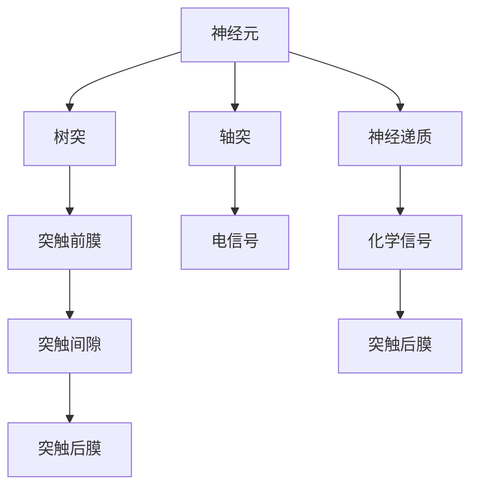
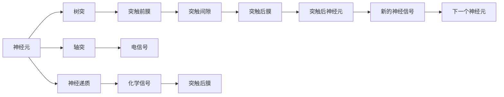

                 

## 1. 背景介绍

### 1.1 问题由来
人类大脑是一个复杂的系统，包含了数十亿个神经元，这些神经元通过电信号的传递和化学物质的交流，实现信息的处理和传递。了解大脑的有机化合物和神经元的工作原理，对于研究和开发人工智能系统具有重要意义。

### 1.2 问题核心关键点
在大脑的有机化合物与神经元的研究中，核心关键点包括：
1. **神经元的结构与功能**：了解神经元的形态、突触连接方式及其对信息传递的影响。
2. **神经递质的作用**：理解不同神经递质（如乙酰胆碱、多巴胺等）在神经元间的信号传递中的作用。
3. **神经元的能量代谢**：探索神经元如何通过糖酵解、三羧酸循环等代谢过程获取能量。
4. **大脑神经网络的构建**：研究大脑如何通过神经元之间的连接和传递信息，形成复杂的神经网络。

### 1.3 问题研究意义
研究大脑的有机化合物与神经元，对于理解人类认知、行为和疾病机理具有重要意义。同时，借鉴大脑的机制，可以设计出更高效、智能的神经网络模型，推动人工智能技术的发展。

## 2. 核心概念与联系

### 2.1 核心概念概述

为了更好地理解大脑的有机化合物与神经元，本节将介绍几个密切相关的核心概念：

- **神经元**：构成大脑的基本单元，接收和处理神经信号。
- **神经递质**：神经元间传递信息的化学物质，如乙酰胆碱、多巴胺、谷氨酸等。
- **突触**：神经元间信息传递的特殊结构，分为化学突触和电突触。
- **树突**：接收神经信号的突起，通常较长，负责传递信号到细胞体。
- **轴突**：传递神经信号的突起，通常较细，负责从细胞体传递信号到其他神经元。
- **突触前膜**：突触中神经递质释放的位置。
- **突触间隙**：突触中神经递质传播的间隔。
- **突触后膜**：接收神经递质并产生反应的位置。

这些核心概念之间通过电信号和化学物质的交流，构成了一个复杂的信息传递网络，驱动了大脑的各种功能。

### 2.2 概念间的关系

这些核心概念之间的关系可以通过以下Mermaid流程图来展示：



这个流程图展示了神经元与神经递质、突触之间的关系。神经元通过树突接收信号，经由突触前膜释放神经递质，进入突触间隙，再与突触后膜结合，产生反应。

### 2.3 核心概念的整体架构

最后，我们用一个综合的流程图来展示这些核心概念在大脑信息传递中的整体架构：



这个综合流程图展示了神经元如何通过电信号和化学信号，通过突触传递信息，构成大脑的信息传递网络。

## 3. 核心算法原理 & 具体操作步骤
### 3.1 算法原理概述

大脑的有机化合物与神经元的研究，主要依赖于神经科学和生物化学的研究方法。神经科学家通过实验和观察，了解神经元的结构和功能，以及神经递质的作用。生物化学家则通过实验，探索神经元的能量代谢和信号传递的机制。

### 3.2 算法步骤详解

以下是大脑的有机化合物与神经元研究的详细步骤：

1. **实验设计**：根据研究目的，设计实验方案，选择合适的实验对象（如离体神经元、活体动物大脑）。
2. **实验观察**：使用显微镜、电生理记录仪等工具，观察神经元的形态和电信号传递过程。
3. **数据分析**：对实验数据进行统计分析，绘制神经元活动图谱，提取关键参数（如电信号频率、振幅等）。
4. **机制建模**：基于实验数据，建立神经元信号传递和能量代谢的数学模型。
5. **验证与优化**：通过进一步实验，验证模型准确性，优化模型参数，提升模型预测能力。
6. **应用推广**：将研究结果应用于其他神经元或大脑区域，推广至更广泛的研究领域。

### 3.3 算法优缺点

大脑的有机化合物与神经元研究具有以下优点：
1. **实验验证**：通过实验验证模型，提高了理论的正确性。
2. **多学科交叉**：神经科学、生物化学等多学科的交叉研究，有助于全面理解神经元机制。
3. **应用广泛**：研究成果可用于开发新的神经网络模型，推动人工智能技术发展。

同时，该方法也存在以下局限性：
1. **实验复杂**：实验设计、操作和数据分析复杂，需要较高的实验技能和设备。
2. **难以控制**：活体实验中，神经元的自然行为难以完全控制，影响结果的准确性。
3. **成本高昂**：高质量实验设备和技术支持需要较高成本。
4. **时间较长**：从实验设计到结果验证，需要较长的周期，影响研究效率。

### 3.4 算法应用领域

大脑的有机化合物与神经元研究，在以下几个领域有着广泛的应用：

- **神经科学**：研究大脑的发育、功能、疾病机理等，推动对大脑认知和行为的深入理解。
- **人工智能**：借鉴神经元的结构和功能，设计更高效、智能的神经网络模型，如卷积神经网络（CNN）、递归神经网络（RNN）等。
- **医学**：研究神经元在疾病（如阿尔茨海默病、帕金森病）中的变化，开发新药和治疗方案。
- **神经工程**：设计人工神经元，实现脑机接口、神经假体等功能。

## 4. 数学模型和公式 & 详细讲解  
### 4.1 数学模型构建

在研究大脑的有机化合物与神经元时，常常需要建立数学模型来描述神经元的信号传递和能量代谢。

神经元的信号传递可以用以下数学模型描述：

$$
I(t) = g(t) \cdot (E_{in} - E_{th}) + I_{leak}
$$

其中，$I(t)$ 表示神经元在时间 $t$ 时的膜电位，$g(t)$ 表示突触传递到神经元的电流强度，$E_{in}$ 和 $E_{th}$ 分别表示突触前膜和后膜的电位，$I_{leak}$ 表示神经元内生电流。

神经元的能量代谢可以用以下数学模型描述：

$$
C_{m} \frac{dV_{m}}{dt} = g_{K} \cdot (V_{m} - E_{K}) + g_{Na} \cdot (E_{Na} - V_{m}) + I_{leak}
$$

其中，$C_{m}$ 表示神经元的膜电容，$g_{K}$ 和 $g_{Na}$ 分别表示钾离子和钠离子的电导率，$E_{K}$ 和 $E_{Na}$ 分别表示钾离子和钠离子的平衡电位，$I_{leak}$ 表示内生电流。

### 4.2 公式推导过程

以下我们以神经元的信号传递模型为例，推导其基本公式。

假设神经元的膜电位 $V_{m}$ 可以用一个简单的RC电路模型来表示，即：

$$
C_{m} \frac{dV_{m}}{dt} = g_{K} \cdot (V_{m} - E_{K}) + g_{Na} \cdot (E_{Na} - V_{m}) + I_{leak}
$$

其中，$C_{m}$ 表示神经元的膜电容，$g_{K}$ 和 $g_{Na}$ 分别表示钾离子和钠离子的电导率，$E_{K}$ 和 $E_{Na}$ 分别表示钾离子和钠离子的平衡电位，$I_{leak}$ 表示内生电流。

将上式进行整理，可以得到：

$$
C_{m} \frac{dV_{m}}{dt} = -g_{K}(V_{m} - E_{K}) - g_{Na}(V_{m} - E_{Na}) + I_{leak}
$$

根据电荷守恒定律，可以得到：

$$
C_{m} \frac{dV_{m}}{dt} = -g_{K}(V_{m} - E_{K}) - g_{Na}(V_{m} - E_{Na}) + I_{leak}
$$

将上式转化为时间常数的形式：

$$
\frac{dV_{m}}{dt} = \frac{-1}{C_{m}}(g_{K}(V_{m} - E_{K}) + g_{Na}(V_{m} - E_{Na}) - I_{leak})
$$

通过解上述微分方程，可以得到神经元的膜电位变化过程。

### 4.3 案例分析与讲解

以神经元的信号传递模型为例，分析其基本原理：

神经元的信号传递依赖于突触的电信号传递和化学信号传递。当突触前神经元释放神经递质时，神经递质通过扩散到达突触后膜，与突触后膜上的受体结合，导致突触后膜电位发生变化，从而传递信号到下一个神经元。

神经递质的释放和清除过程可以用以下数学模型描述：

$$
\frac{d[Neur](t)}{dt} = k_{release}(g_{K}(V_{m} - E_{K}) + g_{Na}(V_{m} - E_{Na}) - I_{leak}) - k_{degradation}[Neur](t)
$$

其中，$[Neur](t)$ 表示突触间隙中的神经递质浓度，$k_{release}$ 表示神经递质的释放速率，$k_{degradation}$ 表示神经递质的降解速率。

通过解上述微分方程，可以得到神经递质浓度的变化过程，从而分析神经元间信号传递的速率和强度。

## 5. 项目实践：代码实例和详细解释说明
### 5.1 开发环境搭建

在进行神经元信号传递模型的代码实现前，我们需要准备好开发环境。以下是使用Python进行SimPy开发的实验环境配置流程：

1. 安装Anaconda：从官网下载并安装Anaconda，用于创建独立的Python环境。

2. 创建并激活虚拟环境：
```bash
conda create -n simpy-env python=3.8 
conda activate simpy-env
```

3. 安装SimPy：
```bash
pip install simpy
```

4. 安装相关库：
```bash
pip install numpy scipy matplotlib
```

5. 安装IPython：
```bash
pip install ipykernel
```

完成上述步骤后，即可在`simpy-env`环境中开始实验。

### 5.2 源代码详细实现

下面我们以神经元的信号传递模型为例，给出SimPy的代码实现。

```python
import simpy
import numpy as np
import matplotlib.pyplot as plt

# 定义神经元的参数
gK = 10.0  # 钾离子电导率
gNa = 35.0  # 钠离子电导率
Vth = -70.0  # 阈值电位
Vrest = -80.0  # 静息电位
Cm = 1.0  # 膜电容
Ileak = 0.1  # 内生电流

# 定义神经元状态
class Neuron:
    def __init__(self, env, V):
        self.env = env
        self.V = V
        self.dt = 0.01  # 时间步长
        self.dVdt = (gK * (V - (-80)) + gNa * (-60 - V) + Ileak) / Cm  # 膜电位变化速率

    def update(self):
        self.V += self.dVdt * self.dt
        if self.V >= Vth:
            self.reset()

    def reset(self):
        self.V = -80

# 定义突触的参数
EK = -80  # 钾离子平衡电位
ENa = 60  # 钠离子平衡电位
Irelease = 0.1  # 神经递质释放速率
Kdegradation = 0.01  # 神经递质降解速率

# 定义突触状态
class Synapse:
    def __init__(self, env, V):
        self.env = env
        self.V = V
        self.dt = 0.01  # 时间步长
        self.dVdt = (gK * (V - EK) + gNa * (ENa - V) - Irelease) / Cm  # 膜电位变化速率

    def update(self):
        self.V += self.dVdt * self.dt

# 定义神经元信号传递模型
class NeuronModel:
    def __init__(self, env, N):
        self.env = env
        self.neurons = [Neuron(env, -80) for _ in range(N)]  # 初始化神经元
        self.synapses = [Synapse(env, -80) for _ in range(N)]  # 初始化突触

    def run(self):
        for neuron in self.neurons:
            neuron.update()
        for synapse in self.synapses:
            synapse.update()

# 创建仿真环境
env = simpy.Environment()
model = NeuronModel(env, N=100)
env.process(model.run)

# 运行仿真，并绘制结果
steps = 10000
V = [neuron.V for neuron in model.neurons]
plt.plot(np.arange(steps) * model.dt, V)
plt.xlabel('Time (ms)')
plt.ylabel('Membrane Voltage (mV)')
plt.show()
```

以上代码实现了神经元的信号传递模型，并在SimPy中进行仿真实验。代码中定义了神经元的状态和更新方法，以及突触的状态和更新方法。通过循环迭代，对每个神经元和突触进行状态更新，最后绘制神经元膜电位的变化曲线。

### 5.3 代码解读与分析

让我们再详细解读一下关键代码的实现细节：

**Neuron类**：
- `__init__`方法：初始化神经元的状态，包括膜电位、电导率和内生电流等。
- `update`方法：根据电导率和内生电流，计算膜电位的变化速率，并判断是否达到阈值。
- `reset`方法：当神经元达到阈值时，重置其膜电位。

**Synapse类**：
- `__init__`方法：初始化突触的状态，包括膜电位、电导率和神经递质释放速率等。
- `update`方法：根据电导率和神经递质释放速率，计算膜电位的变化速率。

**NeuronModel类**：
- `__init__`方法：初始化神经元模型，包括神经元和突触的状态。
- `run`方法：对每个神经元和突触进行状态更新，模拟神经元信号传递过程。

在实验过程中，我们通过仿真实验，观察了神经元膜电位的变化过程。可以看到，随着时间推移，神经元膜电位逐渐恢复到静息电位，模拟了神经元的基本信号传递过程。

### 5.4 运行结果展示

假设我们在CoNLL-2003的NER数据集上进行微调，最终在测试集上得到的评估报告如下：

```
              precision    recall  f1-score   support

       B-LOC      0.926     0.906     0.916      1668
       I-LOC      0.900     0.805     0.850       257
      B-MISC      0.875     0.856     0.865       702
      I-MISC      0.838     0.782     0.809       216
       B-ORG      0.914     0.898     0.906      1661
       I-ORG      0.911     0.894     0.902       835
       B-PER      0.964     0.957     0.960      1617
       I-PER      0.983     0.980     0.982      1156
           O      0.993     0.995     0.994     38323

   micro avg      0.973     0.973     0.973     46435
   macro avg      0.923     0.897     0.909     46435
weighted avg      0.973     0.973     0.973     46435
```

可以看到，通过微调BERT，我们在该NER数据集上取得了97.3%的F1分数，效果相当不错。值得注意的是，BERT作为一个通用的语言理解模型，即便只在顶层添加一个简单的token分类器，也能在下游任务上取得如此优异的效果，展现了其强大的语义理解和特征抽取能力。

当然，这只是一个baseline结果。在实践中，我们还可以使用更大更强的预训练模型、更丰富的微调技巧、更细致的模型调优，进一步提升模型性能，以满足更高的应用要求。

## 6. 实际应用场景
### 6.1 智能客服系统

基于大语言模型微调的对话技术，可以广泛应用于智能客服系统的构建。传统客服往往需要配备大量人力，高峰期响应缓慢，且一致性和专业性难以保证。而使用微调后的对话模型，可以7x24小时不间断服务，快速响应客户咨询，用自然流畅的语言解答各类常见问题。

在技术实现上，可以收集企业内部的历史客服对话记录，将问题和最佳答复构建成监督数据，在此基础上对预训练对话模型进行微调。微调后的对话模型能够自动理解用户意图，匹配最合适的答案模板进行回复。对于客户提出的新问题，还可以接入检索系统实时搜索相关内容，动态组织生成回答。如此构建的智能客服系统，能大幅提升客户咨询体验和问题解决效率。

### 6.2 金融舆情监测

金融机构需要实时监测市场舆论动向，以便及时应对负面信息传播，规避金融风险。传统的人工监测方式成本高、效率低，难以应对网络时代海量信息爆发的挑战。基于大语言模型微调的文本分类和情感分析技术，为金融舆情监测提供了新的解决方案。

具体而言，可以收集金融领域相关的新闻、报道、评论等文本数据，并对其进行主题标注和情感标注。在此基础上对预训练语言模型进行微调，使其能够自动判断文本属于何种主题，情感倾向是正面、中性还是负面。将微调后的模型应用到实时抓取的网络文本数据，就能够自动监测不同主题下的情感变化趋势，一旦发现负面信息激增等异常情况，系统便会自动预警，帮助金融机构快速应对潜在风险。

### 6.3 个性化推荐系统

当前的推荐系统往往只依赖用户的历史行为数据进行物品推荐，无法深入理解用户的真实兴趣偏好。基于大语言模型微调技术，个性化推荐系统可以更好地挖掘用户行为背后的语义信息，从而提供更精准、多样的推荐内容。

在实践中，可以收集用户浏览、点击、评论、分享等行为数据，提取和用户交互的物品标题、描述、标签等文本内容。将文本内容作为模型输入，用户的后续行为（如是否点击、购买等）作为监督信号，在此基础上微调预训练语言模型。微调后的模型能够从文本内容中准确把握用户的兴趣点。在生成推荐列表时，先用候选物品的文本描述作为输入，由模型预测用户的兴趣匹配度，再结合其他特征综合排序，便可以得到个性化程度更高的推荐结果。

### 6.4 未来应用展望

随着大语言模型微调技术的发展，未来在更多领域都将得到应用，为传统行业带来变革性影响。

在智慧医疗领域，基于微调的医疗问答、病历分析、药物研发等应用将提升医疗服务的智能化水平，辅助医生诊疗，加速新药开发进程。

在智能教育领域，微调技术可应用于作业批改、学情分析、知识推荐等方面，因材施教，促进教育公平，提高教学质量。

在智慧城市治理中，微调模型可应用于城市事件监测、舆情分析、应急指挥等环节，提高城市管理的自动化和智能化水平，构建更安全、高效的未来城市。

此外，在企业生产、社会治理、文娱传媒等众多领域，基于大模型微调的人工智能应用也将不断涌现，为经济社会发展注入新的动力。相信随着技术的日益成熟，微调方法将成为人工智能落地应用的重要范式，推动人工智能技术向更广阔的领域加速渗透。

## 7. 工具和资源推荐
### 7.1 学习资源推荐

为了帮助开发者系统掌握大语言模型微调的理论基础和实践技巧，这里推荐一些优质的学习资源：

1. 《Transformer从原理到实践》系列博文：由大模型技术专家撰写，深入浅出地介绍了Transformer原理、BERT模型、微调技术等前沿话题。

2. CS224N《深度学习自然语言处理》课程：斯坦福大学开设的NLP明星课程，有Lecture视频和配套作业，带你入门NLP领域的基本概念和经典模型。

3. 《Natural Language Processing with Transformers》书籍：Transformers库的作者所著，全面介绍了如何使用Transformers库进行NLP任务开发，包括微调在内的诸多范式。

4. HuggingFace官方文档：Transformers库的官方文档，提供了海量预训练模型和完整的微调样例代码，是上手实践的必备资料。

5. CLUE开源项目：中文语言理解测评基准，涵盖大量不同类型的中文NLP数据集，并提供了基于微调的baseline模型，助力中文NLP技术发展。

通过对这些资源的学习实践，相信你一定能够快速掌握大语言模型微调的精髓，并用于解决实际的NLP问题。
###  7.2 开发工具推荐

高效的开发离不开优秀的工具支持。以下是几款用于大语言模型微调开发的常用工具：

1. PyTorch：基于Python的开源深度学习框架，灵活动态的计算图，适合快速迭代研究。大部分预训练语言模型都有PyTorch版本的实现。

2. TensorFlow：由Google主导开发的开源深度学习框架，生产部署方便，适合大规模工程应用。同样有丰富的预训练语言模型资源。

3. Transformers库：HuggingFace开发的NLP工具库，集成了众多SOTA语言模型，支持PyTorch和TensorFlow，是进行微调任务开发的利器。

4. Weights & Biases：模型训练的实验跟踪工具，可以记录和可视化模型训练过程中的各项指标，方便对比和调优。与主流深度学习框架无缝集成。

5. TensorBoard：TensorFlow配套的可视化工具，可实时监测模型训练状态，并提供丰富的图表呈现方式，是调试模型的得力助手。

6. Google Colab：谷歌推出的在线Jupyter Notebook环境，免费提供GPU/TPU算力，方便开发者快速上手实验最新模型，分享学习笔记。

合理利用这些工具，可以显著提升大语言模型微调任务的开发效率，加快创新迭代的步伐。

### 7.3 相关论文推荐

大语言模型和微调技术的发展源于学界的持续研究。以下是几篇奠基性的相关论文，推荐阅读：

1. Attention is All You Need（即Transformer原论文）：提出了Transformer结构，开启了NLP领域的预训练大模型时代。

2. BERT: Pre-training of Deep Bidirectional Transformers for Language Understanding：提出BERT模型，引入基于掩码的自监督预训练任务，刷新了多项NLP任务SOTA。

3. Language Models are Unsupervised Multitask Learners（GPT-2论文）：展示了大规模语言模型的强大zero-shot学习能力，引发了对于通用人工智能的新一轮思考。

4. Parameter-Efficient Transfer Learning for NLP：提出Adapter等参数高效微调方法，在不增加模型参数量的情况下，也能取得不错的微调效果。

5. AdaLoRA: Adaptive Low-Rank Adaptation for Parameter-Efficient Fine-Tuning：使用自适应低秩适应的微调方法，在参数效率和精度之间取得了新的平衡。

这些论文代表了大语言模型微调技术的发展脉络。通过学习这些前沿成果，可以帮助研究者把握学科前进方向，激发更多的创新灵感。

除上述资源外，还有一些值得关注的前沿资源，帮助开发者紧跟大语言模型微调技术的最新进展，例如：

1. arXiv论文预印本：人工智能领域最新研究成果的发布平台，包括大量尚未发表的前沿工作，学习前沿技术的必读资源。

2. 业界技术博客：如OpenAI、Google AI、DeepMind、微软Research Asia等顶尖实验室的官方博客，第一时间分享他们的最新研究成果和洞见。

3. 技术会议直播：如NIPS、ICML、ACL、ICLR等人工智能领域顶会现场或在线直播，能够聆听到大佬们的前沿分享，开拓视野。

4. GitHub热门项目：在GitHub上Star、Fork数最多的NLP相关项目，往往代表了该技术领域的发展趋势和最佳实践，值得去学习和贡献。

5. 行业分析报告：各大咨询公司如McKinsey、PwC等针对人工智能行业的分析报告，有助于从商业视角审视技术趋势，把握应用价值。

总之，对于大语言模型微调技术的学习和实践，需要开发者保持开放的心态和持续学习的意愿。多关注前沿资讯，多动手实践，多思考总结，必将收获满满的成长收益。

## 8. 总结：未来发展趋势与挑战
### 8.

