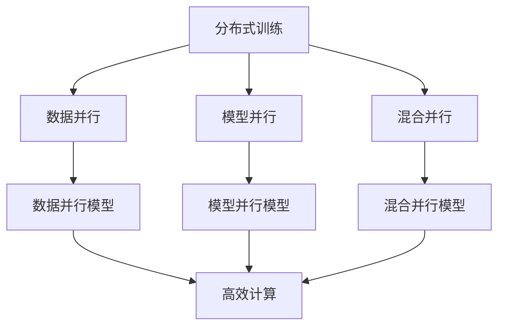
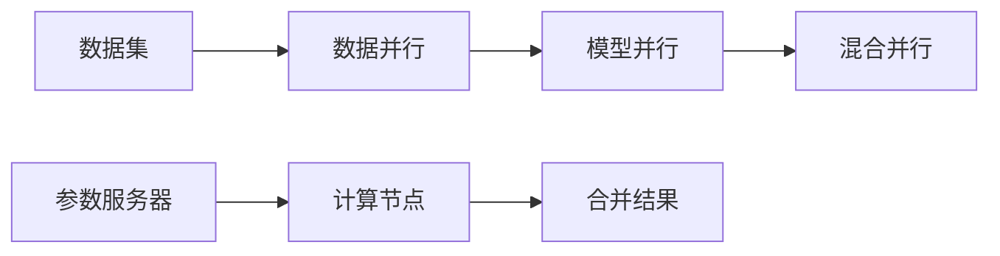
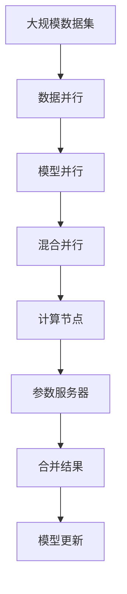

                 

# 大规模语言模型从理论到实践 去中心化架构

> 关键词：大规模语言模型,去中心化架构,分布式训练,自适应梯度,模型参数,神经网络,自监督学习

## 1. 背景介绍

### 1.1 问题由来
近年来，随着深度学习技术的快速发展，大规模语言模型（LLMs）在自然语言处理（NLP）领域取得了巨大的突破。这些模型通过在海量无标签文本数据上进行预训练，学习到了丰富的语言知识和常识，具备强大的语言理解和生成能力。然而，随着模型规模的不断增大，单台机器已经无法承载其训练需求，分布式训练成为了大模型的标配。

分布式训练通过将大规模模型参数分布在多台机器上进行并行计算，极大地提升了训练效率和模型规模。例如，GPT-3模型就是在谷歌的TPU集群上使用分布式训练进行预训练的。然而，大规模分布式训练也带来了新的挑战，如网络通信开销、参数同步等，需要进行系统化的优化和改进。

### 1.2 问题核心关键点
分布式训练的核心在于如何高效地在大规模模型上进行并行计算，同时保证模型参数的一致性和训练的稳定性。目前主流的方法包括：

- 数据并行：将数据集划分为多个子集，不同机器同时处理不同的数据子集，最后合并结果。
- 模型并行：将模型分割成多个部分，分别在不同的机器上进行计算，最后合并结果。
- 混合并行：结合数据并行和模型并行，提高训练效率和模型容量。

这些方法虽然解决了模型规模的限制，但同时也带来了新的问题，如通信开销、同步策略、参数更新效率等。如何在高效的分布式训练中保持模型的稳定性和一致性，是当前研究的热点和难点。

### 1.3 问题研究意义
研究大规模语言模型的分布式训练，对于拓展模型的应用范围，提升模型的性能，加速NLP技术的产业化进程，具有重要意义：

1. 降低训练成本。分布式训练可以显著减少单次训练的时间，使得大规模模型的训练变得更加高效和经济。
2. 提升模型性能。分布式训练可以使模型更好地利用海量数据，学习更丰富的语言知识，从而在各种NLP任务上取得更好的效果。
3. 加速技术落地。大规模模型训练的并行化使得模型开发和部署更加便捷，加速了技术的实际应用。
4. 带来技术创新。分布式训练推动了深度学习模型的发展和优化，催生了自适应梯度、模型参数高效更新等前沿研究方向。

## 2. 核心概念与联系

### 2.1 核心概念概述

为更好地理解大规模语言模型的分布式训练方法，本节将介绍几个密切相关的核心概念：

- 分布式训练（Distributed Training）：指将大规模模型参数分布在多台机器上进行并行计算，提高训练效率和模型规模的方法。
- 数据并行（Data Parallelism）：指将数据集划分为多个子集，不同机器同时处理不同的数据子集，最后合并结果。
- 模型并行（Model Parallelism）：指将模型分割成多个部分，分别在不同的机器上进行计算，最后合并结果。
- 混合并行（Hybrid Parallelism）：结合数据并行和模型并行，提高训练效率和模型容量。
- 自适应梯度（Adaptive Gradient）：指根据当前梯度的方向和大小，动态调整学习率的方法，减少梯度爆炸和消失的风险。
- 模型参数（Model Parameters）：指神经网络中的权重和偏置，是模型表达能力和性能的关键因素。

这些核心概念之间的逻辑关系可以通过以下Mermaid流程图来展示：



这个流程图展示了大规模语言模型的分布式训练的几种主要方法：

1. 分布式训练将大规模模型参数分布在多台机器上进行并行计算。
2. 数据并行通过将数据集划分为多个子集，不同机器同时处理不同的数据子集。
3. 模型并行通过将模型分割成多个部分，分别在不同的机器上进行计算。
4. 混合并行结合数据并行和模型并行，提高训练效率和模型容量。
5. 自适应梯度根据当前梯度的方向和大小，动态调整学习率。
6. 模型参数是神经网络中的权重和偏置，是模型表达能力和性能的关键因素。

### 2.2 概念间的关系

这些核心概念之间存在着紧密的联系，形成了大规模语言模型分布式训练的完整生态系统。下面我通过几个Mermaid流程图来展示这些概念之间的关系。

#### 2.2.1 分布式训练的架构


这个流程图展示了分布式训练的基本架构：

1. 数据集被划分为多个子集，不同机器同时处理不同的数据子集。
2. 不同机器的计算结果被合并，更新模型参数。
3. 参数服务器负责集中存储和更新模型参数。

#### 2.2.2 数据并行的实现


这个流程图展示了数据并行的基本实现方式：

1. 数据集被划分为多个子集，不同机器同时处理不同的数据子集。
2. 不同机器的计算结果被合并，更新模型参数。

#### 2.2.3 模型并行的实现


这个流程图展示了模型并行的基本实现方式：

1. 模型被分割成多个部分，分别在不同的机器上进行计算。
2. 不同机器的计算结果被合并，更新模型参数。

#### 2.2.4 混合并行的实现


这个流程图展示了混合并行的基本实现方式：

1. 数据集被划分为多个子集，不同机器同时处理不同的数据子集。
2. 模型被分割成多个部分，分别在不同的机器上进行计算。
3. 不同机器的计算结果被合并，更新模型参数。

### 2.3 核心概念的整体架构

最后，我们用一个综合的流程图来展示这些核心概念在大规模语言模型分布式训练过程中的整体架构：



这个综合流程图展示了从数据到模型更新的完整过程：

1. 大规模数据集被划分为多个子集，不同机器同时处理不同的数据子集。
2. 模型被分割成多个部分，分别在不同的机器上进行计算。
3. 不同机器的计算结果被合并，更新模型参数。
4. 参数服务器负责集中存储和更新模型参数。
5. 模型更新后，继续进行下一轮训练。

通过这些流程图，我们可以更清晰地理解大规模语言模型分布式训练过程中各个核心概念的关系和作用，为后续深入讨论具体的分布式训练方法和技术奠定基础。

## 3. 核心算法原理 & 具体操作步骤
### 3.1 算法原理概述

大规模语言模型的分布式训练，本质上是一个高效的并行计算过程。其核心思想是：将大规模模型参数分布在多台机器上进行并行计算，通过自适应梯度方法，最小化损失函数，更新模型参数。

形式化地，假设大规模模型为 $M_{\theta}$，其中 $\theta$ 为模型参数。给定大规模训练数据集 $D=\{(x_i, y_i)\}_{i=1}^N$，分布式训练的目标是找到最优参数：

$$
\theta^* = \mathop{\arg\min}_{\theta} \mathcal{L}(M_{\theta},D)
$$

其中 $\mathcal{L}$ 为损失函数，用于衡量模型预测输出与真实标签之间的差异。常见的损失函数包括交叉熵损失、均方误差损失等。

通过梯度下降等优化算法，分布式训练过程不断更新模型参数 $\theta$，最小化损失函数 $\mathcal{L}$，使得模型输出逼近真实标签。由于 $\theta$ 已经通过预训练获得了较好的初始化，因此即便在大规模数据集 $D$ 上进行分布式训练，也能较快收敛到理想的模型参数 $\hat{\theta}$。

### 3.2 算法步骤详解

大规模语言模型的分布式训练一般包括以下几个关键步骤：

**Step 1: 准备分布式训练环境**
- 选择合适的分布式训练框架，如Horovod、PyTorch Distributed等。
- 在多台机器上安装框架所需的依赖库和工具。
- 配置机器之间的网络通信和参数同步策略。

**Step 2: 划分数据集**
- 将大规模训练数据集 $D$ 划分为多个子集，每个子集包含一部分数据。
- 通常采用K-fold或shuffle-split等方法划分数据集。

**Step 3: 初始化模型参数**
- 在每台机器上初始化模型参数 $\theta$。
- 可以使用预训练模型的参数作为初始化值。

**Step 4: 设置分布式训练超参数**
- 选择合适的优化算法及其参数，如AdamW、SGD等。
- 设置学习率、批大小、迭代轮数等。
- 设置参数更新策略，如同步策略、异步策略等。

**Step 5: 执行梯度训练**
- 将数据集子集分批次输入模型，前向传播计算损失函数。
- 反向传播计算参数梯度，根据设定的优化算法和学习率更新模型参数。
- 周期性在验证集上评估模型性能，根据性能指标决定是否触发 Early Stopping。
- 重复上述步骤直到满足预设的迭代轮数或 Early Stopping 条件。

**Step 6: 参数同步和合并**
- 使用参数服务器或直接通信方式，将不同机器的模型参数进行同步。
- 使用算术平均、指数加权平均等方式合并不同机器的参数更新。

**Step 7: 测试和部署**
- 在测试集上评估分布式训练后的模型 $M_{\hat{\theta}}$ 的性能，对比分布式训练前后的精度提升。
- 使用分布式训练后的模型对新样本进行推理预测，集成到实际的应用系统中。
- 持续收集新的数据，定期重新分布式训练模型，以适应数据分布的变化。

以上是大规模语言模型分布式训练的一般流程。在实际应用中，还需要针对具体任务的特点，对分布式训练过程的各个环节进行优化设计，如改进训练目标函数，引入更多的正则化技术，搜索最优的超参数组合等，以进一步提升模型性能。

### 3.3 算法优缺点

大规模语言模型的分布式训练方法具有以下优点：
1. 高效并行计算。分布式训练通过多台机器的并行计算，显著提高了训练速度和效率。
2. 可扩展性强。通过增加机器数量，可以轻松扩展分布式训练的规模，适应更大、更复杂的模型。
3. 模型性能提升。分布式训练使得模型能够更好地利用海量数据，学习更丰富的语言知识，从而在各种NLP任务上取得更好的效果。

同时，该方法也存在一定的局限性：
1. 通信开销大。不同机器之间的通信需要大量的网络带宽，可能导致延迟和性能下降。
2. 同步复杂。不同机器的参数更新需要同步，同步策略的选择和实现较为复杂。
3. 参数更新效率低。由于模型并行等策略，不同机器的计算复杂度不同，可能导致参数更新不均衡。
4. 故障容忍度低。分布式训练需要多台机器协同工作，一台机器故障可能导致整个训练过程的中断。

尽管存在这些局限性，但就目前而言，大规模语言模型的分布式训练方法仍是大规模模型训练的主要范式。未来相关研究的重点在于如何进一步降低通信开销，提高参数更新效率，同时兼顾模型的可扩展性和鲁棒性等因素。

### 3.4 算法应用领域

大规模语言模型的分布式训练方法在NLP领域已经得到了广泛的应用，覆盖了几乎所有常见任务，例如：

- 文本分类：如情感分析、主题分类、意图识别等。通过分布式训练使模型学习文本-标签映射。
- 命名实体识别：识别文本中的人名、地名、机构名等特定实体。通过分布式训练使模型掌握实体边界和类型。
- 关系抽取：从文本中抽取实体之间的语义关系。通过分布式训练使模型学习实体-关系三元组。
- 问答系统：对自然语言问题给出答案。将问题-答案对作为微调数据，训练模型学习匹配答案。
- 机器翻译：将源语言文本翻译成目标语言。通过分布式训练使模型学习语言-语言映射。
- 文本摘要：将长文本压缩成简短摘要。将文章-摘要对作为微调数据，使模型学习抓取要点。
- 对话系统：使机器能够与人自然对话。将多轮对话历史作为上下文，微调模型进行回复生成。

除了上述这些经典任务外，分布式训练方法也被创新性地应用到更多场景中，如可控文本生成、常识推理、代码生成、数据增强等，为NLP技术带来了全新的突破。随着分布式训练方法的不断进步，相信NLP技术将在更广阔的应用领域大放异彩。

## 4. 数学模型和公式 & 详细讲解 & 举例说明
### 4.1 数学模型构建

本节将使用数学语言对大规模语言模型分布式训练过程进行更加严格的刻画。

记大规模模型为 $M_{\theta}$，其中 $\theta$ 为模型参数。假设大规模训练数据集为 $D=\{(x_i, y_i)\}_{i=1}^N$。

定义模型 $M_{\theta}$ 在输入 $x$ 上的输出为 $\hat{y}=M_{\theta}(x)$。在分布式训练中，模型的每个部分在不同机器上进行计算，定义每个机器的参数子集为 $\theta_i$。假设共有 $K$ 台机器，则有：

$$
\theta = \{\theta_1, \theta_2, ..., \theta_K\}
$$

定义损失函数 $\mathcal{L}(\theta, D)$ 为：

$$
\mathcal{L}(\theta, D) = \frac{1}{N} \sum_{i=1}^N \ell(M_{\theta}(x_i), y_i)
$$

其中 $\ell$ 为损失函数，如交叉熵损失函数。

在分布式训练中，不同机器的计算结果需要进行同步和合并。设第 $k$ 台机器的损失函数为 $\mathcal{L}_k(\theta_k, D_k)$，则分布式训练的目标为：

$$
\mathop{\arg\min}_{\theta} \mathcal{L}(\theta, D) = \mathop{\arg\min}_{\theta_k} \mathcal{L}_k(\theta_k, D_k)
$$

其中 $D_k$ 为第 $k$ 台机器的训练数据集。

### 4.2 公式推导过程

以下我们以二分类任务为例，推导分布式训练的损失函数及其梯度的计算公式。

假设模型 $M_{\theta}$ 在输入 $x$ 上的输出为 $\hat{y}=M_{\theta}(x) \in [0,1]$，表示样本属于正类的概率。真实标签 $y \in \{0,1\}$。则二分类交叉熵损失函数定义为：

$$
\ell(M_{\theta}(x),y) = -[y\log \hat{y} + (1-y)\log (1-\hat{y})]
$$

将其代入分布式训练的目标函数，得：

$$
\mathcal{L}(\theta, D) = -\frac{1}{N}\sum_{i=1}^N [y_i\log M_{\theta}(x_i)+(1-y_i)\log(1-M_{\theta}(x_i))]
$$

在分布式训练中，不同机器的计算结果需要进行同步和合并。设第 $k$ 台机器的损失函数为 $\mathcal{L}_k(\theta_k, D_k)$，则有：

$$
\mathcal{L}_k(\theta_k, D_k) = -\frac{1}{|D_k|}\sum_{i=1}^{|D_k|} [y_i\log M_{\theta_k}(x_i)+(1-y_i)\log(1-M_{\theta_k}(x_i))]
$$

其中 $|D_k|$ 为第 $k$ 台机器的训练样本数量。

根据梯度下降等优化算法，模型参数 $\theta$ 的更新公式为：

$$
\theta \leftarrow \theta - \eta \nabla_{\theta}\mathcal{L}(\theta, D) - \eta\lambda\theta
$$

其中 $\eta$ 为学习率，$\lambda$ 为正则化系数。

在分布式训练中，不同机器的梯度需要进行同步和合并。设第 $k$ 台机器的梯度为 $\nabla_{\theta_k}\mathcal{L}_k(\theta_k, D_k)$，则有：

$$
\nabla_{\theta_k}\mathcal{L}_k(\theta_k, D_k) = \frac{1}{|D_k|}\sum_{i=1}^{|D_k|} \nabla_{\theta_k}[y_i\log M_{\theta_k}(x_i)+(1-y_i)\log(1-M_{\theta_k}(x_i))]
$$

根据梯度同步策略，不同机器的梯度需要进行同步和合并。常见的同步策略包括全同步和异步同步。假设采用全同步策略，则有：

$$
\nabla_{\theta_k}\mathcal{L}_k(\theta_k, D_k) = \frac{1}{|D_k|}\sum_{i=1}^{|D_k|} \nabla_{\theta_k}[y_i\log M_{\theta_k}(x_i)+(1-y_i)\log(1-M_{\theta_k}(x_i))]
$$

将不同机器的梯度进行同步和合并，得到总梯度 $\nabla_{\theta}\mathcal{L}(\theta, D)$，模型参数的更新公式为：

$$
\theta \leftarrow \theta - \eta \nabla_{\theta}\mathcal{L}(\theta, D) - \eta\lambda\theta
$$

重复上述过程直至收敛，最终得到分布式训练后的最优模型参数 $\theta^*$。

## 5. 项目实践：代码实例和详细解释说明
### 5.1 开发环境搭建

在进行分布式训练实践前，我们需要准备好开发环境。以下是使用Python进行PyTorch分布式训练的环境配置流程：

1. 安装Anaconda：从官网下载并安装Anaconda，用于创建独立的Python环境。

2. 创建并激活虚拟环境：
```bash
conda create -n pytorch-distributed python=3.8 
conda activate pytorch-distributed
```

3. 安装PyTorch：根据CUDA版本，从官网获取对应的安装命令。例如：
```bash
conda install pytorch torchvision torchaudio cudatoolkit=11.1 -c pytorch -c conda-forge
```

4. 安装分布式训练相关的工具包：
```bash
pip install distributed dill torchdistributed -f https://torchdistributed.readthedocs.io/en/stable/install.html
```

5. 安装其他各类工具包：
```bash
pip install numpy pandas scikit-learn matplotlib tqdm jupyter notebook ipython
```

完成上述步骤后，即可在`pytorch-distributed`环境中开始分布式训练实践。

### 5.2 源代码详细实现

这里我们以命名实体识别(NER)任务为例，给出使用分布式训练对BERT模型进行训练的PyTorch代码实现。

首先，定义NER任务的数据处理函数：

```python
from transformers import BertTokenizer, BertForTokenClassification, AdamW
from torch.utils.data import Dataset, DataLoader
from torch.distributed.fsdp import FullyShardedDataParallel as FSDP
import torch
import torch.distributed as dist

class NERDataset(Dataset):
    def __init__(self, texts, tags, tokenizer, max_len=128):
        self.texts = texts
        self.tags = tags
        self.tokenizer = tokenizer
        self.max_len = max_len
        
    def __len__(self):
        return len(self.texts)
    
    def __getitem__(self, item):
        text = self.texts[item]
        tags = self.tags[item]
        
        encoding = self.tokenizer(text, return_tensors='pt', max_length=self.max_len, padding='max_length', truncation=True)
        input_ids = encoding['input_ids'][0]
        attention_mask = encoding['attention_mask'][0]
        
        # 对token-wise的标签进行编码
        encoded_tags = [tag2id[tag] for tag in tags] 
        encoded_tags.extend([tag2id['O']] * (self.max_len - len(encoded_tags)))
        labels = torch.tensor(encoded_tags, dtype=torch.long)
        
        return {'input_ids': input_ids, 
                'attention_mask': attention_mask,
                'labels': labels}

# 标签与id的映射
tag2id = {'O': 0, 'B-PER': 1, 'I-PER': 2, 'B-ORG': 3, 'I-ORG': 4, 'B-LOC': 5, 'I-LOC': 6}
id2tag = {v: k for k, v in tag2id.items()}

# 创建dataset
tokenizer = BertTokenizer.from_pretrained('bert-base-cased')

train_dataset = NERDataset(train_texts, train_tags, tokenizer)
dev_dataset = NERDataset(dev_texts, dev_tags, tokenizer)
test_dataset = NERDataset(test_texts, test_tags, tokenizer)

# 初始化分布式环境
dist.init_process_group(backend='nccl', world_size=2, rank=0)
```

然后，定义模型和优化器：

```python
from transformers import BertForTokenClassification, AdamW

model = BertForTokenClassification.from_pretrained('bert-base-cased', num_labels=len(tag2id))

# 使用FullyShardedDataParallel进行模型并行
model = FSDP(model)

optimizer = AdamW(model.parameters(), lr=2e-5)
```

接着，定义训练和评估函数：

```python
from torch.utils.data import DataLoader
from tqdm import tqdm
from sklearn.metrics import classification_report

device = torch.device('cuda') if torch.cuda.is_available() else torch.device('cpu')
model.to(device)

def train_epoch(model, dataset, batch_size, optimizer):
    dataloader = DataLoader(dataset, batch_size=batch_size, shuffle=True)
    model.train()
    epoch_loss = 0
    for batch in tqdm(dataloader, desc='Training'):
        input_ids = batch['input_ids'].to(device)
        attention_mask = batch['attention_mask'].to(device)
        labels = batch['labels'].to(device)
        model.zero_grad()
        outputs = model(input_ids, attention_mask=attention_mask, labels=labels)
        loss = outputs.loss
        epoch_loss += loss.item()
        loss.backward()
        optimizer.step()
    return epoch_loss / len(dataloader)

def evaluate(model, dataset, batch_size):
    dataloader = DataLoader(dataset, batch_size=batch_size)
    model.eval()
    preds, labels = [], []
    with torch.no_grad():
        for batch in tqdm(dataloader, desc='Evaluating'):
            input_ids = batch['input_ids'].to(device)
            attention_mask = batch['attention_mask'].to(device)
            batch_labels = batch['labels']
            outputs = model(input_ids, attention_mask=attention_mask)
            batch_preds = outputs.logits.argmax(dim=2).to('cpu').tolist()
            batch_labels = batch_labels.to('cpu').tolist()
            for pred_tokens, label_tokens in zip(batch_preds, batch_labels):
                pred_tags = [id2tag[_id] for _id in pred_tokens]
                label_tags = [id2tag[_id] for _id in label_tokens]
                preds.append(pred_tags[:len(label_tags)])
                labels.append(label_tags)
                
    print(classification_report(labels, preds))
```

最后，启动分布式训练流程并在测试集上评估：

```python
epochs = 5
batch_size = 16

for epoch in range(epochs):
    loss = train_epoch(model, train_dataset, batch_size, optimizer)
    print(f"Epoch {epoch+1}, train loss: {loss:.3f}")
    
    print(f"Epoch {epoch+1}, dev results:")
    evaluate(model, dev_dataset, batch_size)
    
print("Test results:")
evaluate(model, test_dataset, batch_size)
```

以上就是使用PyTorch进行分布式训练对BERT进行命名实体识别任务训练的完整代码实现。可以看到，得益于FullyShardedDataParallel的强大封装，我们可以用相对简洁的代码完成BERT模型的分布式训练。


