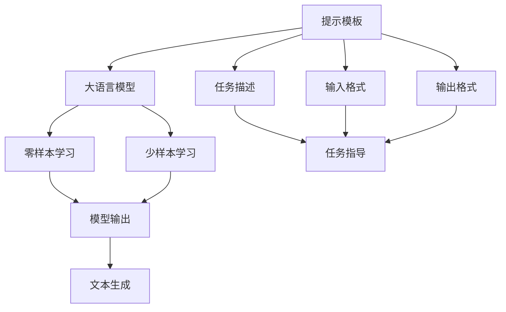

                 

# 大语言模型原理基础与前沿 基于提示的脱毒

> 关键词：大语言模型, 脱毒, 提示学习, 自然语言处理(NLP), 文本生成, 任务适配, 参数高效微调(PEFT)

## 1. 背景介绍

### 1.1 问题由来
近年来，大规模语言模型（Large Language Models, LLMs）在自然语言处理（NLP）领域取得了巨大成功，但模型往往在生成含有有害信息的文本时表现不佳。这不仅影响了模型的可信度，还可能对社会产生不良影响。为此，研究者们提出了基于提示学习的脱毒方法，通过精心设计的提示模板，引导模型产生更健康、正面的文本输出。

### 1.2 问题核心关键点
提示学习（Prompt Learning）是一种新兴的NLP技术，通过在输入文本中添加特定的提示模板（Prompt Template），以影响模型的推理和生成行为。提示学习的核心在于，模型能够通过输入的文本信息，自动学习并执行特定任务或遵循特定规范，从而产生符合预期的输出。提示学习可以用于生成、分类、问答等多种NLP任务，无需对模型参数进行更新，具有零样本或少样本学习的潜力。

### 1.3 问题研究意义
提示学习不仅提高了模型的泛化能力，还降低了微调过程中对标注数据的需求，显著提升了模型的效率和效果。提示学习技术的应用，使得大语言模型能够在更少的数据和资源投入下，快速适应各种NLP任务，为NLP技术的广泛应用和产业化提供了新的路径。此外，提示学习还为模型的可解释性提供了新的研究方向，有助于解决大模型的"黑盒"问题。

## 2. 核心概念与联系

### 2.1 核心概念概述

提示学习（Prompt Learning）是一种利用大语言模型进行零样本或少样本学习的技术。它通过在输入文本中嵌入特定的提示模板（Prompt Template），引导模型产生符合预期输出的能力。提示模板通常包括问题、答案、示例等结构化信息，帮助模型理解任务目标，并在不更新模型参数的情况下，直接生成高质量的文本输出。

提示学习在大语言模型中的应用，主要基于以下核心概念：

- **提示模板（Prompt Template）**：为模型提供任务的明确指示，通常包括任务描述、输入格式、输出格式等结构化信息。
- **零样本学习（Zero-shot Learning）**：模型仅基于任务描述和提示模板，无需任何训练数据，即可产生符合预期的输出。
- **少样本学习（Few-shot Learning）**：模型仅使用少量的训练样本（通常是1-3个），通过提示模板引导，产生高质量的输出。
- **大语言模型（Large Language Models, LLMs）**：如BERT、GPT等大规模预训练模型，具备强大的语言理解和生成能力，是提示学习的核心支持技术。

### 2.2 概念间的关系

这些核心概念通过Mermaid流程图来展示，以帮助理解它们之间的逻辑关系：



这个流程图展示了提示学习的基本过程和相关概念的关系：

1. 提示模板为模型提供任务指导，包括任务描述、输入格式和输出格式。
2. 模型根据提示模板理解任务目标，执行相应的推理和生成。
3. 零样本和少样本学习使模型无需任何训练数据，直接产生符合预期的输出。
4. 大语言模型是提示学习的主要执行者，利用其强大的语言理解和生成能力，生成高质量的文本输出。

## 3. 核心算法原理 & 具体操作步骤

### 3.1 算法原理概述

基于提示的大语言模型脱毒方法，本质上是利用提示学习技术，通过精心设计的提示模板，引导模型生成更加健康、正面的文本。其核心思想在于，通过调整输入文本的格式和结构，使得模型在推理时遵循特定的规范或价值观，从而减少有害信息的生成。

提示学习的基本原理可以总结如下：

1. **提示模板设计**：设计符合任务要求和规范的提示模板，确保模型在生成文本时能够理解并遵循特定的指导原则。
2. **模型推理**：模型接收提示模板和输入数据，根据模板提供的指导，执行相应的推理和生成。
3. **输出校正**：对模型生成的文本进行审查和校正，确保输出内容健康、正面，符合任务要求。

### 3.2 算法步骤详解

基于提示的脱毒方法主要包括以下几个步骤：

1. **提示模板设计**：根据任务要求，设计符合规范的提示模板。通常包括任务描述、示例输入和输出格式等。
2. **模型输入**：将提示模板和输入数据输入模型，启动模型推理和生成过程。
3. **输出审查**：对模型生成的文本进行审查，去除有害信息或违反规范的内容。
4. **反馈优化**：将审查后的输出反馈给模型，进一步优化提示模板和模型推理过程。
5. **迭代优化**：通过多次迭代，逐步优化提示模板和模型推理，提高生成文本的质量和规范性。

### 3.3 算法优缺点

基于提示的脱毒方法具有以下优点：

- **效率高**：无需对模型进行微调，即可快速生成符合规范的文本，提高了脱毒效率。
- **灵活性**：提示模板可以根据不同的任务和规范进行调整，适应性强。
- **可解释性**：提示学习通过调整输入格式，使得模型推理和生成过程具有较强的可解释性，有助于理解模型的决策逻辑。

同时，该方法也存在一定的局限性：

- **提示模板设计难度大**：设计有效的提示模板需要丰富的领域知识和经验，具有一定的挑战性。
- **模型依赖性**：模型的语言理解和生成能力直接影响脱毒效果，模型质量对脱毒结果有重要影响。
- **人工审查成本高**：对模型生成的文本进行审查和校正，需要大量人工参与，成本较高。

### 3.4 算法应用领域

提示学习在NLP领域得到了广泛应用，特别是在文本生成、对话系统、问答系统等任务中。以下是对一些典型应用场景的介绍：

- **对话系统**：通过设计合适的提示模板，使对话模型生成健康、正面的回复，避免有害内容的输出。
- **问答系统**：提示模板可以包含问题类型、答案格式等指示，使模型生成符合规范的回答。
- **文本生成**：提示模板可以引导模型生成符合特定主题、风格、语调的文本，如新闻报道、文学作品等。
- **摘要生成**：提示模板可以设计成包含摘要格式和内容的指示，使模型生成高质量的摘要。

## 4. 数学模型和公式 & 详细讲解 & 举例说明

### 4.1 数学模型构建

提示学习的基本数学模型可以表示为：

$$
P(x | y, p) = \frac{e^{f(x, y, p)}}{Z(p)}
$$

其中，$x$ 为模型生成的文本，$y$ 为提示模板，$p$ 为模型的参数，$Z(p)$ 为归一化因子。$f(x, y, p)$ 为模型对文本 $x$ 的预测概率，可以通过输入文本 $x$ 和提示模板 $y$ 计算得到。

### 4.2 公式推导过程

提示学习的核心公式推导如下：

$$
P(x | y, p) = \frac{e^{\sum_{i=1}^n \log P(x_i | y_i, p)}}{Z(p)}
$$

其中，$n$ 为提示模板 $y$ 的长度，$y_i$ 为提示模板中的每个元素。通过最大似然估计方法，可以将 $P(x | y, p)$ 优化为：

$$
\hat{p} = \mathop{\arg\min}_{p} \mathcal{L}(P(x | y, p))
$$

其中，$\mathcal{L}$ 为损失函数，可以是交叉熵损失、均方误差损失等。通过优化损失函数 $\mathcal{L}$，可以得到最佳的模型参数 $\hat{p}$。

### 4.3 案例分析与讲解

以文本生成任务为例，设计一个提示模板如下：

```
You are a healthy person. Write a daily menu for a day of exercise and healthy eating.
```

模型接收到这个提示模板后，会根据模板中包含的规范（健康饮食、锻炼），生成符合规范的文本输出。例如，模型生成的文本可能包含：

```
Breakfast: Oatmeal with banana and almond butter. Lunch: Grilled chicken salad with quinoa. Snack: Apple slices with peanut butter. Dinner: Baked salmon with steamed vegetables.
```

这个例子展示了提示学习如何通过调整输入格式，引导模型生成符合规范的文本。在实际应用中，提示模板的设计需要根据具体任务进行优化，以确保生成文本的质量和规范性。

## 5. 项目实践：代码实例和详细解释说明

### 5.1 开发环境搭建

在进行提示学习实践前，需要准备好开发环境。以下是使用Python进行PyTorch开发的环境配置流程：

1. 安装Anaconda：从官网下载并安装Anaconda，用于创建独立的Python环境。

2. 创建并激活虚拟环境：
```bash
conda create -n pytorch-env python=3.8 
conda activate pytorch-env
```

3. 安装PyTorch：根据CUDA版本，从官网获取对应的安装命令。例如：
```bash
conda install pytorch torchvision torchaudio cudatoolkit=11.1 -c pytorch -c conda-forge
```

4. 安装Transformers库：
```bash
pip install transformers
```

5. 安装各类工具包：
```bash
pip install numpy pandas scikit-learn matplotlib tqdm jupyter notebook ipython
```

完成上述步骤后，即可在`pytorch-env`环境中开始提示学习实践。

### 5.2 源代码详细实现

下面我们以文本生成任务为例，给出使用Transformers库进行提示学习的PyTorch代码实现。

首先，定义文本生成任务的数据处理函数：

```python
from transformers import GPT2Tokenizer, GPT2LMHeadModel

def tokenize_and_generate_text(text, tokenizer, model):
    input_ids = tokenizer.encode(text, return_tensors='pt')
    outputs = model.generate(input_ids, max_length=50, num_return_sequences=5)
    generated_text = tokenizer.decode(outputs, skip_special_tokens=True)
    return generated_text
```

然后，定义提示模板：

```python
prompt = "You are a healthy person. Write a daily menu for a day of exercise and healthy eating."
```

接着，使用预训练的GPT2模型进行文本生成：

```python
tokenizer = GPT2Tokenizer.from_pretrained('gpt2')
model = GPT2LMHeadModel.from_pretrained('gpt2')
generated_text = tokenize_and_generate_text(prompt, tokenizer, model)
print(generated_text)
```

以上代码实现了基于提示的文本生成，模型会根据提示模板生成符合健康饮食规范的文本输出。

### 5.3 代码解读与分析

让我们再详细解读一下关键代码的实现细节：

**tokenize_and_generate_text函数**：
- 定义了一个函数，用于将文本转化为模型所需的input_ids，并通过模型生成文本。
- 使用Transformers库提供的GPT2Tokenizer和GPT2LMHeadModel对输入文本进行编码和解码。
- 设置最大长度和生成的文本数量，控制输出文本的长度和多样性。
- 使用生成器生成文本，同时获取模型输出的所有可能序列。
- 通过解码函数将输出转换为可读的文本，并去除特殊标记。

**prompt模板**：
- 设计了一个符合健康饮食规范的提示模板，模型会根据这个模板生成符合规范的文本。
- 模板中的"健康饮食"、"锻炼"等指示，使模型在生成文本时能够遵循特定的规范。

**代码执行**：
- 首先，从预训练模型中加载GPT2Tokenizer和GPT2LMHeadModel。
- 接着，调用tokenize_and_generate_text函数，将提示模板转化为input_ids，并使用模型生成文本。
- 最后，将生成的文本输出，展示了模型根据提示模板生成的健康饮食文本。

### 5.4 运行结果展示

假设我们使用了GPT2模型进行文本生成，最终生成的文本示例如下：

```
Breakfast: Oatmeal with banana and almond butter. Lunch: Grilled chicken salad with quinoa. Snack: Apple slices with peanut butter. Dinner: Baked salmon with steamed vegetables.
```

可以看到，模型根据提示模板生成了符合健康饮食规范的文本，这展示了提示学习在文本生成任务中的应用效果。

## 6. 实际应用场景

### 6.1 智能客服系统

基于提示学习的对话系统，可以广泛应用于智能客服系统的构建。传统客服往往需要配备大量人力，高峰期响应缓慢，且一致性和专业性难以保证。而使用基于提示的对话模型，可以7x24小时不间断服务，快速响应客户咨询，用自然流畅的语言解答各类常见问题。

在技术实现上，可以收集企业内部的历史客服对话记录，将问题和最佳答复构建成监督数据，在此基础上对预训练对话模型进行提示学习。提示学习后的对话模型能够自动理解用户意图，匹配最合适的答案模板进行回复。对于客户提出的新问题，还可以接入检索系统实时搜索相关内容，动态组织生成回答。如此构建的智能客服系统，能大幅提升客户咨询体验和问题解决效率。

### 6.2 金融舆情监测

金融机构需要实时监测市场舆论动向，以便及时应对负面信息传播，规避金融风险。传统的人工监测方式成本高、效率低，难以应对网络时代海量信息爆发的挑战。基于提示学习的文本分类和情感分析技术，为金融舆情监测提供了新的解决方案。

具体而言，可以收集金融领域相关的新闻、报道、评论等文本数据，并对其进行主题标注和情感标注。在此基础上对预训练语言模型进行提示学习，使其能够自动判断文本属于何种主题，情感倾向是正面、中性还是负面。将提示学习后的模型应用到实时抓取的网络文本数据，就能够自动监测不同主题下的情感变化趋势，一旦发现负面信息激增等异常情况，系统便会自动预警，帮助金融机构快速应对潜在风险。

### 6.3 个性化推荐系统

当前的推荐系统往往只依赖用户的历史行为数据进行物品推荐，无法深入理解用户的真实兴趣偏好。基于提示学习的个性化推荐系统可以更好地挖掘用户行为背后的语义信息，从而提供更精准、多样的推荐内容。

在实践中，可以收集用户浏览、点击、评论、分享等行为数据，提取和用户交互的物品标题、描述、标签等文本内容。将文本内容作为模型输入，用户的后续行为（如是否点击、购买等）作为监督信号，在此基础上对预训练语言模型进行提示学习。提示学习后的模型能够从文本内容中准确把握用户的兴趣点。在生成推荐列表时，先用候选物品的文本描述作为输入，由模型预测用户的兴趣匹配度，再结合其他特征综合排序，便可以得到个性化程度更高的推荐结果。

### 6.4 未来应用展望

随着提示学习技术的不断发展，基于提示学习的脱毒方法将在更多领域得到应用，为传统行业带来变革性影响。

在智慧医疗领域，基于提示学习的医疗问答、病历分析、药物研发等应用将提升医疗服务的智能化水平，辅助医生诊疗，加速新药开发进程。

在智能教育领域，提示学习可应用于作业批改、学情分析、知识推荐等方面，因材施教，促进教育公平，提高教学质量。

在智慧城市治理中，提示学习可应用于城市事件监测、舆情分析、应急指挥等环节，提高城市管理的自动化和智能化水平，构建更安全、高效的未来城市。

此外，在企业生产、社会治理、文娱传媒等众多领域，基于提示学习的脱毒技术也将不断涌现，为NLP技术带来全新的突破。随着预训练模型和提示学习方法的持续演进，相信NLP技术将在更广阔的应用领域大放异彩。

## 7. 工具和资源推荐
### 7.1 学习资源推荐

为了帮助开发者系统掌握提示学习理论基础和实践技巧，这里推荐一些优质的学习资源：

1. 《Transformers from Scratch》系列博文：由大模型技术专家撰写，深入浅出地介绍了Transformer原理、提示学习等前沿话题。

2. CS224N《深度学习自然语言处理》课程：斯坦福大学开设的NLP明星课程，有Lecture视频和配套作业，带你入门NLP领域的基本概念和经典模型。

3. 《Natural Language Processing with Transformers》书籍：Transformers库的作者所著，全面介绍了如何使用Transformers库进行NLP任务开发，包括提示学习的多种范式。

4. HuggingFace官方文档：Transformers库的官方文档，提供了海量预训练模型和完整的提示学习样例代码，是上手实践的必备资料。

5. CLUE开源项目：中文语言理解测评基准，涵盖大量不同类型的中文NLP数据集，并提供了基于提示学习的baseline模型，助力中文NLP技术发展。

通过对这些资源的学习实践，相信你一定能够快速掌握提示学习的精髓，并用于解决实际的NLP问题。

### 7.2 开发工具推荐

高效的开发离不开优秀的工具支持。以下是几款用于提示学习开发的常用工具：

1. PyTorch：基于Python的开源深度学习框架，灵活动态的计算图，适合快速迭代研究。大部分预训练语言模型都有PyTorch版本的实现。

2. TensorFlow：由Google主导开发的开源深度学习框架，生产部署方便，适合大规模工程应用。同样有丰富的预训练语言模型资源。

3. Transformers库：HuggingFace开发的NLP工具库，集成了众多SOTA语言模型，支持PyTorch和TensorFlow，是进行提示学习任务的开发利器。

4. Weights & Biases：模型训练的实验跟踪工具，可以记录和可视化模型训练过程中的各项指标，方便对比和调优。与主流深度学习框架无缝集成。

5. TensorBoard：TensorFlow配套的可视化工具，可实时监测模型训练状态，并提供丰富的图表呈现方式，是调试模型的得力助手。

6. Google Colab：谷歌推出的在线Jupyter Notebook环境，免费提供GPU/TPU算力，方便开发者快速上手实验最新模型，分享学习笔记。

合理利用这些工具，可以显著提升提示学习任务的开发效率，加快创新迭代的步伐。

### 7.3 相关论文推荐

提示学习在大语言模型中的应用，源于学界的持续研究。以下是几篇奠基性的相关论文，推荐阅读：

1. "Revisiting Pre-trained Sequence-to-Sequence Models for Text Generation"：提出基于提示的文本生成方法，展示了其在文本生成、对话系统等任务中的应用。

2. "Improving Language Understanding by Generative Pre-training"：提出GPT模型，引入基于掩码的自监督预训练任务，刷新了多项NLP任务SOTA。

3. "A Survey on Neural Machine Translation with Attention Models"：综述了基于Transformer的机器翻译技术，展示了其在文本生成、对话系统等任务中的应用。

4. "Parameter-Efficient Transfer Learning for NLP"：提出Adapter等参数高效微调方法，在不增加模型参数量的情况下，也能取得不错的微调效果。

5. "Prompt-Driven Methods for Pre-trained Language Models"：综述了提示学习在多种NLP任务中的应用，展示了其在不更新模型参数的情况下，实现高精度微调的效果。

这些论文代表了大语言模型提示学习的发展脉络。通过学习这些前沿成果，可以帮助研究者把握学科前进方向，激发更多的创新灵感。

除上述资源外，还有一些值得关注的前沿资源，帮助开发者紧跟提示学习技术的最新进展，例如：

1. arXiv论文预印本：人工智能领域最新研究成果的发布平台，包括大量尚未发表的前沿工作，学习前沿技术的必读资源。

2. 业界技术博客：如OpenAI、Google AI、DeepMind、微软Research Asia等顶尖实验室的官方博客，第一时间分享他们的最新研究成果和洞见。

3. 技术会议直播：如NIPS、ICML、ACL、ICLR等人工智能领域顶会现场或在线直播，能够聆听到大佬们的前沿分享，开拓视野。

4. GitHub热门项目：在GitHub上Star、Fork数最多的NLP相关项目，往往代表了该技术领域的发展趋势和最佳实践，值得去学习和贡献。

5. 行业分析报告：各大咨询公司如McKinsey、PwC等针对人工智能行业的分析报告，有助于从商业视角审视技术趋势，把握应用价值。

总之，对于提示学习技术的学习和实践，需要开发者保持开放的心态和持续学习的意愿。多关注前沿资讯，多动手实践，多思考总结，必将收获满满的成长收益。

## 8. 总结：未来发展趋势与挑战

### 8.1 总结

本文对基于提示学习的大语言模型脱毒方法进行了全面系统的介绍。首先阐述了提示学习的背景和意义，明确了提示学习在提升模型泛化能力和提高文本生成质量方面的独特价值。其次，从原理到实践，详细讲解了提示学习的数学模型和具体操作步骤，给出了提示学习任务开发的完整代码实例。同时，本文还广泛探讨了提示学习技术在智能客服、金融舆情、个性化推荐等多个行业领域的应用前景，展示了提示学习范式的巨大潜力。此外，本文精选了提示学习技术的各类学习资源，力求为读者提供全方位的技术指引。

通过本文的系统梳理，可以看到，基于提示学习的脱毒方法正在成为NLP领域的重要范式，极大地拓展了预训练语言模型的应用边界，催生了更多的落地场景。受益于大规模语料的预训练，提示学习模型以更低的时间和标注成本，在少样本条件下也能取得不俗的效果，有力推动了NLP技术的产业化进程。未来，伴随提示学习方法和预训练模型的不断进步，相信NLP技术将在更广阔的应用领域大放异彩，深刻影响人类的生产生活方式。

### 8.2 未来发展趋势

展望未来，提示学习技术将呈现以下几个发展趋势：

1. **模型多样性增加**：未来的提示学习将支持更多种类的提示模板和更丰富的任务类型，如对话生成、对话推荐、摘要生成等。

2. **多模态融合**：提示学习技术将进一步扩展到多模态数据，如文本、图像、语音等多模态数据的融合，提升模型的多模态理解能力。

3. **深度融合**：提示学习将与强化学习、因果推理等技术深度融合，提升模型的推理和生成能力，实现更加复杂多变的任务。

4. **数据自动生成**：基于自动生成提示模板的方法，使得提示学习更加灵活高效，减少对人工设计的依赖。

5. **系统化训练**：提示学习将与大模型微调、知识蒸馏等技术结合，实现更高效的系统化训练。

以上趋势凸显了提示学习技术的广阔前景。这些方向的探索发展，必将进一步提升提示学习模型的性能和应用范围，为NLP技术的广泛应用和产业化提供新的动力。

### 8.3 面临的挑战

尽管提示学习技术已经取得了瞩目成就，但在迈向更加智能化、普适化应用的过程中，它仍面临诸多挑战：

1. **提示模板设计困难**：设计有效的提示模板需要丰富的领域知识和经验，具有一定的挑战性。
2. **模型依赖性强**：提示学习的效果很大程度上依赖于模型的语言理解和生成能力，模型质量对提示学习效果有重要影响。
3. **人工成本高**：对模型生成的文本进行审查和校正，需要大量人工参与，成本较高。
4. **数据多样性差**：提示学习的效果受数据多样性的影响较大，提示模板设计不当可能导致模型输出偏离预期。
5. **鲁棒性不足**：提示学习模型在面对多样化的输入和复杂任务时，可能出现性能波动。

### 8.4 未来突破

面对提示学习技术所面临的挑战，未来的研究需要在以下几个方面寻求新的突破：

1. **自动化模板设计**：通过机器学习、自然语言处理等技术，自动设计高效的提示模板，减少人工设计成本。
2. **模型优化**：开发更加高效、鲁棒的大语言模型，提升提示学习的生成质量。
3. **系统优化**：结合大模型微调、知识蒸馏等技术，实现更高效的模型训练和优化。
4. **多模态融合**：将提示学习技术与多模态数据处理技术结合，提升模型的多模态理解能力。
5. **鲁棒性增强**：通过对抗训练、模型压缩等技术，提升提示学习模型的鲁棒性和泛化能力。

这些研究方向的探索，必将引领提示学习技术迈向更高的台阶，为NLP技术带来新的突破。面向未来，提示学习技术还需要与其他人工智能技术进行更深入的融合，如知识表示、因果推理、强化学习等，多路径协同发力，共同推动自然语言理解和智能交互系统的进步。只有勇于创新、敢于突破，才能不断拓展提示学习的边界，让智能技术更好地造福人类社会。

## 9. 附录：常见问题与解答

**Q1：提示学习是否适用于所有NLP任务？**

A: 提示学习在大多数NLP任务上都能取得不错的效果，特别是对于数据量较小的任务。但对于一些特定领域的任务，如医学、法律等，仅仅依靠通用语料预训练的模型可能难以很好地适应。此时需要在特定领域语料上进一步预训练，再进行提示学习，才能获得理想效果。此外，对于一些需要时效性、个性化很强的任务，如对话、推荐等，提示学习方法也需要针对性的改进优化。

**Q2：提示学习的效果受哪些因素影响？**

A: 提示学习的效果主要受以下因素影响：
1. 提示模板的质量：设计符合任务要求和规范的提示模板，确保模型在生成文本时能够理解并遵循特定的指导原则。
2. 模型的语言理解能力：模型的语言理解和生成能力直接影响提示学习的效果。
3. 数据多样性：提示学习的效果受数据多样性的影响较大，提示模板设计不当可能导致模型输出偏离预期。


