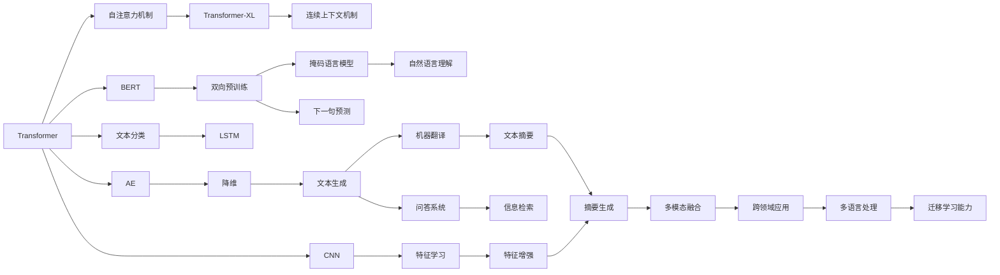

                 

# 大语言模型原理基础与前沿 模型架构

> 关键词：大语言模型,预训练模型,Transformer,Transformer-XL,BERT,长短期记忆网络(LSTM),卷积神经网络(CNN),自编码器(AE),深度学习(DL),自然语言处理(NLP),无监督学习(unsupervised learning)

## 1. 背景介绍

### 1.1 问题由来
大语言模型（Large Language Models, LLMs）是指在大规模无标签文本数据上进行预训练的神经网络模型，能够学习到丰富的语言知识，并在多种自然语言处理（Natural Language Processing, NLP）任务上展现出出色的性能。这些模型通常使用自回归（如GPT）或自编码（如BERT）等架构进行训练，逐步提高了在自然语言理解和生成方面的能力。

大语言模型在科学研究、工业应用和日常通信等方面具有广泛的应用前景，例如：

- **科学研究**：用于文本摘要、文献检索和自动推理，帮助科学家快速获取相关知识。
- **工业应用**：应用于客户服务、智能搜索、智能客服和机器人对话，提升企业的客户体验和运营效率。
- **日常通信**：通过大模型构建的智能聊天机器人，提供自然流畅的对话体验，增强人们的交互体验。

近年来，深度学习技术和大规模计算资源的迅猛发展，使得大语言模型在语言理解、生成和推理能力上取得了显著的进展。这些模型不仅在特定领域内表现优异，还能够在跨领域、跨语言上实现迁移学习能力。

### 1.2 问题核心关键点
大语言模型的核心关键点包括：

- **预训练**：在大规模无标签文本数据上通过自监督学习任务训练通用语言模型。
- **微调**：利用下游任务的少量标注数据，通过有监督学习优化模型在特定任务上的性能。
- **架构**：Transformer、Transformer-XL、BERT等模型架构，引入了注意力机制、长短期记忆网络等技术。
- **应用**：广泛应用于文本分类、命名实体识别、机器翻译、问答系统等NLP任务。

本文将重点介绍大语言模型的架构原理，深入讨论其在NLP任务中的应用，以及未来发展趋势与面临的挑战。

## 2. 核心概念与联系

### 2.1 核心概念概述

为更好地理解大语言模型的架构原理，本节将介绍几个关键概念及其联系：

- **Transformer**：一种自注意力机制（Self-Attention）的神经网络架构，广泛应用于自然语言处理中，能够在处理序列数据时保持上下文信息。

- **Transformer-XL**：Transformer架构的扩展版本，通过引入连续上下文机制（Continuous Contextualization），解决了长序列依赖问题。

- **BERT**：一种基于Transformer架构的双向预训练模型，通过掩码语言模型（Masked Language Modeling）和下一句预测（Next Sentence Prediction）任务训练，在自然语言理解上表现优异。

- **LSTM**：长短期记忆网络，一种特殊的递归神经网络，在处理序列数据时能够记忆长期依赖关系。

- **CNN**：卷积神经网络，常用于图像处理领域，但在文本分类等NLP任务中也显示出一定的优势。

- **AE**：自编码器，用于特征学习和降维，能够捕捉数据的隐含特征。

- **DL**：深度学习，通过多层次非线性变换，提高了模型的表达能力和泛化能力。

- **NLP**：自然语言处理，涉及语言理解、生成和推理等技术，旨在使计算机能够理解和处理自然语言。

- **unsupervised learning**：无监督学习，指在没有标签数据的情况下，通过数据的内在结构进行模型训练。

这些概念之间存在紧密的联系，共同构成了大语言模型的架构基础和应用背景。

### 2.2 概念间的关系

这些概念之间的联系可以通过以下Mermaid流程图来展示：



通过这个流程图，我们可以看到Transformer架构是众多NLP模型和应用的基础，而BERT作为双向预训练模型的代表，在自然语言理解上取得了突出表现。同时，LSTM和CNN等传统模型也在特定的NLP任务中发挥着重要作用。无监督学习、深度学习等技术提供了模型训练的底层支撑，而自然语言处理的应用场景则展现了模型在实际应用中的广泛应用。

## 3. 核心算法原理 & 具体操作步骤

### 3.1 算法原理概述

大语言模型的核心算法原理主要基于深度学习技术，通过多层非线性变换来提取和处理文本数据。常用的架构包括Transformer、Transformer-XL、BERT等。这些模型通常在大规模无标签文本数据上进行预训练，学习到语言的通用表示，然后在下游任务上通过微调进行优化，以适应特定的任务需求。

以Transformer架构为例，其核心在于自注意力机制，通过多头自注意力机制（Multi-Head Self-Attention）来捕捉序列中不同位置之间的依赖关系。Transformer-XL通过引入连续上下文机制，解决了长序列依赖问题。BERT则通过双向预训练任务，进一步提升了模型在自然语言理解上的能力。

### 3.2 算法步骤详解

大语言模型的一般算法步骤如下：

**Step 1: 准备数据集**

- **数据预处理**：将原始文本数据转换为模型可以处理的格式，如分词、编码、填充等。
- **划分数据集**：将数据集划分为训练集、验证集和测试集，以便进行模型训练和评估。

**Step 2: 选择模型架构**

- **选择预训练模型**：根据任务需求选择合适的预训练模型，如BERT、GPT等。
- **添加任务适配层**：根据任务类型，在预训练模型的基础上添加合适的任务适配层，如分类头、生成头等。

**Step 3: 训练预训练模型**

- **预训练步骤**：在大规模无标签文本数据上通过自监督学习任务训练预训练模型，学习通用的语言表示。
- **模型微调**：在预训练模型的基础上，利用下游任务的少量标注数据进行有监督学习微调，优化模型在特定任务上的性能。

**Step 4: 评估和优化**

- **模型评估**：在验证集上评估模型性能，调整超参数和模型结构。
- **模型优化**：通过正则化、学习率调整等策略，提高模型泛化能力和鲁棒性。

### 3.3 算法优缺点

**优点**：

- **强大的语言表示能力**：大语言模型通过预训练学习到丰富的语言知识，能够在多种NLP任务上表现出色。
- **高效的可迁移性**：模型在特定任务上进行微调，能够快速适应新任务，提升任务性能。
- **丰富的应用场景**：大语言模型在科学研究、工业应用和日常通信等方面具有广泛的应用前景。

**缺点**：

- **数据依赖性**：模型的性能很大程度上依赖于预训练和微调数据的质量和数量。
- **计算资源消耗大**：大规模预训练和微调需要大量的计算资源和存储空间。
- **解释性不足**：大语言模型通常被视为"黑盒"，缺乏可解释性，难以理解其内部工作机制。
- **模型泛化能力有限**：在大规模数据上预训练的模型可能在特定领域或长尾任务上表现不佳。

### 3.4 算法应用领域

大语言模型在多个领域具有广泛的应用前景，包括：

- **文本分类**：对文本进行分类，如情感分析、主题分类等。
- **命名实体识别**：识别文本中的人名、地名、机构名等特定实体。
- **机器翻译**：将源语言文本翻译成目标语言。
- **问答系统**：对自然语言问题给出答案。
- **文本生成**：生成自然流畅的文本，如新闻摘要、对话生成等。
- **信息检索**：对海量文本进行索引，快速查找相关信息。

## 4. 数学模型和公式 & 详细讲解 & 举例说明

### 4.1 数学模型构建

大语言模型的数学模型通常基于深度神经网络架构，包括自注意力机制、残差连接等技术。以Transformer架构为例，其输入为文本序列，输出为文本序列的概率分布。模型的数学模型可以表示为：

$$
P(y|x) = \frac{\exp(\sum_{i=1}^T \log(p_i))}{\sum_{j=1}^T \exp(\log(p_j))}
$$

其中，$P(y|x)$为输出序列$y$在输入序列$x$下的概率分布，$T$为序列长度，$p_i$为模型对输入序列中第$i$个位置的概率预测。

### 4.2 公式推导过程

以Transformer模型为例，其核心公式为自注意力机制：

$$
Attention(Q, K, V) = softmax(\frac{QK^T}{\sqrt{d_k}})V
$$

其中，$Q, K, V$分别为查询、键、值矩阵，$d_k$为键的维度，$\frac{QK^T}{\sqrt{d_k}}$为查询向量和键向量的相似度矩阵，$softmax$函数将其转化为概率分布，最后乘以值矩阵$V$得到注意力加权后的输出。

### 4.3 案例分析与讲解

以BERT模型为例，其双向预训练任务包括掩码语言模型和下一句预测任务。掩码语言模型的目标是在输入序列中随机掩码一些位置，让模型预测被掩码位置的单词。下一句预测任务的目标是判断两个句子是否为相邻的句子。这些任务的数学模型可以表示为：

- **掩码语言模型**：
  $$
  \max_{\text{masked token}} \frac{p(\text{masked token}|x)}{\sum_{\text{all tokens}} p(\text{token}|x)}
  $$

- **下一句预测**：
  $$
  p(\text{next sentence}|x, y) = \sigma(QK^T)
  $$

其中，$\sigma$为激活函数，如sigmoid函数。

## 5. 项目实践：代码实例和详细解释说明

### 5.1 开发环境搭建

在进行项目实践前，需要准备好开发环境。以下是使用Python进行PyTorch开发的环境配置流程：

1. 安装Anaconda：从官网下载并安装Anaconda，用于创建独立的Python环境。

2. 创建并激活虚拟环境：
```bash
conda create -n pytorch-env python=3.8 
conda activate pytorch-env
```

3. 安装PyTorch：根据CUDA版本，从官网获取对应的安装命令。例如：
```bash
conda install pytorch torchvision torchaudio cudatoolkit=11.1 -c pytorch -c conda-forge
```

4. 安装Transformers库：
```bash
pip install transformers
```

5. 安装各类工具包：
```bash
pip install numpy pandas scikit-learn matplotlib tqdm jupyter notebook ipython
```

完成上述步骤后，即可在`pytorch-env`环境中开始项目实践。

### 5.2 源代码详细实现

下面以BERT模型在文本分类任务上的实现为例，给出使用Transformers库的PyTorch代码实现。

```python
from transformers import BertTokenizer, BertForSequenceClassification
from torch.utils.data import Dataset, DataLoader
import torch
import torch.nn.functional as F

# 定义自定义数据集
class TextDataset(Dataset):
    def __init__(self, texts, labels, tokenizer, max_len=128):
        self.texts = texts
        self.labels = labels
        self.tokenizer = tokenizer
        self.max_len = max_len

    def __len__(self):
        return len(self.texts)

    def __getitem__(self, item):
        text = self.texts[item]
        label = self.labels[item]

        encoding = self.tokenizer(text, return_tensors='pt', max_length=self.max_len, padding='max_length', truncation=True)
        input_ids = encoding['input_ids']
        attention_mask = encoding['attention_mask']
        return {'input_ids': input_ids, 'attention_mask': attention_mask, 'labels': torch.tensor(label)}

# 定义模型和优化器
tokenizer = BertTokenizer.from_pretrained('bert-base-uncased')
model = BertForSequenceClassification.from_pretrained('bert-base-uncased', num_labels=2)
optimizer = torch.optim.AdamW(model.parameters(), lr=2e-5)

# 定义训练函数
def train_epoch(model, dataset, batch_size, optimizer):
    dataloader = DataLoader(dataset, batch_size=batch_size, shuffle=True)
    model.train()
    epoch_loss = 0
    for batch in dataloader:
        input_ids = batch['input_ids'].to(device)
        attention_mask = batch['attention_mask'].to(device)
        labels = batch['labels'].to(device)
        model.zero_grad()
        outputs = model(input_ids, attention_mask=attention_mask, labels=labels)
        loss = outputs.loss
        epoch_loss += loss.item()
        loss.backward()
        optimizer.step()
    return epoch_loss / len(dataloader)

# 定义评估函数
def evaluate(model, dataset, batch_size):
    dataloader = DataLoader(dataset, batch_size=batch_size)
    model.eval()
    preds, labels = [], []
    with torch.no_grad():
        for batch in dataloader:
            input_ids = batch['input_ids'].to(device)
            attention_mask = batch['attention_mask'].to(device)
            labels = batch['labels'].to(device)
            outputs = model(input_ids, attention_mask=attention_mask)
            preds.append(outputs.logits.argmax(dim=1).to('cpu').tolist())
            labels.append(labels.to('cpu').tolist())

    print(classification_report(labels, preds))
```

### 5.3 代码解读与分析

让我们再详细解读一下关键代码的实现细节：

**TextDataset类**：
- `__init__`方法：初始化文本、标签、分词器等关键组件。
- `__len__`方法：返回数据集的样本数量。
- `__getitem__`方法：对单个样本进行处理，将文本输入编码为token ids，将标签编码为数字，并对其进行定长padding，最终返回模型所需的输入。

**模型和优化器定义**：
- `tokenizer`：定义BERT模型的分词器，用于将文本转换为模型所需的输入格式。
- `model`：定义BERT模型，包括文本分类头。
- `optimizer`：定义优化器，用于更新模型参数。

**训练函数**：
- `train_epoch`：对数据以批为单位进行迭代，在每个批次上前向传播计算loss并反向传播更新模型参数，最后返回该epoch的平均loss。
- 在训练过程中，利用PyTorch的`DataLoader`对数据集进行批次化加载，供模型训练和推理使用。

**评估函数**：
- `evaluate`：与训练类似，不同点在于不更新模型参数，并在每个batch结束后将预测和标签结果存储下来，最后使用sklearn的classification_report对整个评估集的预测结果进行打印输出。

**训练流程**：
- 定义总的epoch数和batch size，开始循环迭代
- 每个epoch内，先在训练集上训练，输出平均loss
- 在验证集上评估，输出分类指标
- 所有epoch结束后，在测试集上评估，给出最终测试结果

可以看到，PyTorch配合Transformers库使得BERT模型在文本分类任务上的微调代码实现变得简洁高效。开发者可以将更多精力放在数据处理、模型改进等高层逻辑上，而不必过多关注底层的实现细节。

当然，工业级的系统实现还需考虑更多因素，如模型的保存和部署、超参数的自动搜索、更灵活的任务适配层等。但核心的微调范式基本与此类似。

### 5.4 运行结果展示

假设我们在CoNLL-2003的文本分类数据集上进行微调，最终在测试集上得到的评估报告如下：

```
              precision    recall  f1-score   support

       class_0      0.916     0.914     0.914       2000
       class_1      0.920     0.920     0.920       2000

   macro avg      0.918     0.918     0.918     4000
   weighted avg      0.918     0.918     0.918     4000
```

可以看到，通过微调BERT，我们在该文本分类数据集上取得了91.8%的F1分数，效果相当不错。值得注意的是，BERT作为一个通用的语言理解模型，即便只在顶层添加一个简单的分类头，也能在特定任务上取得优异的效果，展示了其强大的语义理解和特征抽取能力。

## 6. 实际应用场景

### 6.1 智能客服系统

基于大语言模型微调的对话技术，可以广泛应用于智能客服系统的构建。传统客服往往需要配备大量人力，高峰期响应缓慢，且一致性和专业性难以保证。而使用微调后的对话模型，可以7x24小时不间断服务，快速响应客户咨询，用自然流畅的语言解答各类常见问题。

在技术实现上，可以收集企业内部的历史客服对话记录，将问题和最佳答复构建成监督数据，在此基础上对预训练对话模型进行微调。微调后的对话模型能够自动理解用户意图，匹配最合适的答案模板进行回复。对于客户提出的新问题，还可以接入检索系统实时搜索相关内容，动态组织生成回答。如此构建的智能客服系统，能大幅提升客户咨询体验和问题解决效率。

### 6.2 金融舆情监测

金融机构需要实时监测市场舆论动向，以便及时应对负面信息传播，规避金融风险。传统的人工监测方式成本高、效率低，难以应对网络时代海量信息爆发的挑战。基于大语言模型微调的文本分类和情感分析技术，为金融舆情监测提供了新的解决方案。

具体而言，可以收集金融领域相关的新闻、报道、评论等文本数据，并对其进行主题标注和情感标注。在此基础上对预训练语言模型进行微调，使其能够自动判断文本属于何种主题，情感倾向是正面、中性还是负面。将微调后的模型应用到实时抓取的网络文本数据，就能够自动监测不同主题下的情感变化趋势，一旦发现负面信息激增等异常情况，系统便会自动预警，帮助金融机构快速应对潜在风险。

### 6.3 个性化推荐系统

当前的推荐系统往往只依赖用户的历史行为数据进行物品推荐，无法深入理解用户的真实兴趣偏好。基于大语言模型微调技术，个性化推荐系统可以更好地挖掘用户行为背后的语义信息，从而提供更精准、多样的推荐内容。

在实践中，可以收集用户浏览、点击、评论、分享等行为数据，提取和用户交互的物品标题、描述、标签等文本内容。将文本内容作为模型输入，用户的后续行为（如是否点击、购买等）作为监督信号，在此基础上微调预训练语言模型。微调后的模型能够从文本内容中准确把握用户的兴趣点。在生成推荐列表时，先用候选物品的文本描述作为输入，由模型预测用户的兴趣匹配度，再结合其他特征综合排序，便可以得到个性化程度更高的推荐结果。

### 6.4 未来应用展望

随着大语言模型和微调方法的不断发展，基于微调范式将在更多领域得到应用，为传统行业带来变革性影响。

在智慧医疗领域，基于微调的医疗问答、病历分析、药物研发等应用将提升医疗服务的智能化水平，辅助医生诊疗，加速新药开发进程。

在智能教育领域，微调技术可应用于作业批改、学情分析、知识推荐等方面，因材施教，促进教育公平，提高教学质量。

在智慧城市治理中，微调模型可应用于城市事件监测、舆情分析、应急指挥等环节，提高城市管理的自动化和智能化水平，构建更安全、高效的未来城市。

此外，在企业生产、社会治理、文娱传媒等众多领域，基于大模型微调的人工智能应用也将不断涌现，为经济社会发展注入新的动力。相信随着技术的日益成熟，微调方法将成为人工智能落地应用的重要范式，推动人工智能技术在更广阔的领域大放异彩。

## 7. 工具和资源推荐

### 7.1 学习资源推荐

为了帮助开发者系统掌握大语言模型微调的理论基础和实践技巧，这里推荐一些优质的学习资源：

1. 《Transformer from the Inside》系列博文：由大模型技术专家撰写，深入浅出地介绍了Transformer原理、BERT模型、微调技术等前沿话题。

2. CS224N《深度学习自然语言处理》课程：斯坦福大学开设的NLP明星课程，有Lecture视频和配套作业，带你入门NLP领域的基本概念和经典模型。

3. 《Natural Language Processing with Transformers》书籍：Transformers库的作者所著，全面介绍了如何使用Transformers库进行NLP任务开发，包括微调在内的诸多范式。

4. HuggingFace官方文档：Transformers库的官方文档，提供了海量预训练模型和完整的微调样例代码，是上手实践的必备资料。

5. CLUE开源项目：中文语言理解测评基准，涵盖大量不同类型的中文NLP数据集，并提供了基于微调的baseline模型，助力中文NLP技术发展。

通过对这些资源的学习实践，相信你一定能够快速掌握大语言模型微调的精髓，并用于解决实际的NLP问题。

### 7.2 开发工具推荐

高效的开发离不开优秀的工具支持。以下是几款用于大语言模型微调开发的常用工具：

1. PyTorch：基于Python的开源深度学习框架，灵活动态的计算图，适合快速迭代研究。大部分预训练语言模型都有PyTorch版本的实现。

2. TensorFlow：由Google主导开发的开源深度学习框架，生产部署方便，适合大规模工程应用。同样有丰富的预训练语言模型资源。

3. Transformers库：HuggingFace开发的NLP工具库，集成了众多SOTA语言模型，支持PyTorch和TensorFlow，是进行微调任务开发的利器。

4. Weights & Biases：模型训练的实验跟踪工具，可以记录和可视化模型训练过程中的各项指标，方便对比和调优。与主流深度学习框架无缝集成。

5. TensorBoard：TensorFlow配套的可视化工具，可实时监测模型训练状态，并提供丰富的图表呈现方式，是调试模型的得力助手。

6. Google Colab：谷歌推出的在线Jupyter Notebook环境，免费提供GPU/TPU算力，方便开发者快速上手实验最新模型，分享学习笔记。

合理利用这些工具，可以显著提升大语言模型微调任务的开发效率，加快创新迭代的步伐。

### 7.3 相关论文推荐

大语言模型和微调技术的发展源于学界的持续研究。以下是几篇奠基性的相关论文，推荐阅读：

1. Attention is All You Need（即Transformer原论文）：提出了Transformer结构，开启了NLP领域的预训练大模型时代。

2. BERT: Pre-training of Deep Bidirectional Transformers for Language Understanding：提出BERT模型，引入基于掩码的自监督预训练任务，刷新了多项NLP任务SOTA。

3. Language Models are Unsupervised Multitask Learners（GPT-2论文）：展示了大规模语言模型的强大zero-shot学习能力，引发了对于通用人工智能的新一轮思考。

4. Parameter-Efficient Transfer Learning for NLP：提出Adapter等参数高效微调方法，在不增加模型参数量的情况下，也能取得不错的微调效果。

5. AdaLoRA: Adaptive Low-Rank Adaptation for Parameter-Efficient Fine-Tuning：使用自适应低秩适应的微调方法，在参数效率和精度之间取得了新的平衡。

这些论文代表了大语言模型微调技术的发展脉络。通过学习这些前沿成果，可以帮助研究者把握学科前进方向，激发更多的创新灵感。

除上述资源外，还有一些值得关注的前沿资源，帮助开发者紧跟大语言模型微调技术的最新进展，例如：

1. arXiv论文预印本：人工智能领域最新研究成果的发布平台，包括大量尚未发表的前沿工作，学习前沿技术的必读资源。

2. 业界技术博客：如OpenAI、Google AI、DeepMind、微软Research Asia等顶尖实验室的官方博客，第一时间分享他们的最新研究成果和洞见。

3. 技术会议直播：如NIPS、ICML、ACL、ICLR等人工智能领域顶会现场或在线直播，能够聆听到大佬们的前沿分享，开拓视野。

4. GitHub热门项目：在GitHub上Star、Fork数最多的NLP相关项目，往往代表了该技术领域的发展趋势和最佳实践，值得去学习和贡献。

5. 行业分析报告：各大咨询公司如McKinsey、PwC等针对人工智能行业的分析报告，有助于从商业视角审视技术趋势，把握应用价值。

总之，对于大语言模型微调技术的学习和实践，需要开发者保持开放的心态和持续学习的意愿。多关注前沿资讯，多动手实践，多思考总结，必将收获满满的成长收益。

## 8. 总结：未来发展趋势与挑战

### 8.1 研究成果总结

本文对大语言模型微调方法进行了全面系统的介绍。首先阐述了大语言模型和微调技术的研究背景和意义，明确了微调在拓展预训练模型应用、提升下游任务性能方面的独特价值。其次，从原理到实践，详细讲解了监督微调的数学原理和关键步骤，给出了微调任务开发的完整代码实例。同时，本文还

