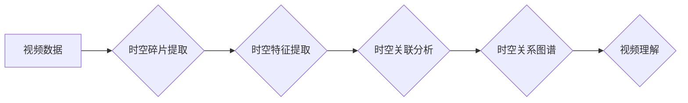

## 时空碎片在视频数据中的应用

> 关键词：视频数据分析，时空关联，碎片化信息，机器学习，计算机视觉，视频理解，时间序列分析

## 1. 背景介绍

随着互联网和移动设备的普及，视频数据正在以指数级速度增长。视频蕴含着丰富的时空信息，是理解世界和获取知识的重要来源。然而，传统的视频分析方法往往局限于静态图像特征或简单的动作识别，难以充分挖掘视频数据中的深层语义和时空关联。

时空碎片化现象是视频数据分析面临的一大挑战。视频数据通常被分割成许多独立的片段，这些片段之间可能存在着复杂的时空关系，但缺乏全局上下文信息。如何有效地识别、关联和理解这些时空碎片，是视频数据分析的关键问题。

## 2. 核心概念与联系

**2.1 时空碎片的概念**

时空碎片是指视频数据中独立存在的片段，这些片段可能包含静态图像、动作序列或其他信息，但缺乏完整的时空上下文。

**2.2 时空关联的概念**

时空关联是指视频数据中不同片段之间的关系，这些关系可以是顺序、因果、相似性或其他形式。

**2.3 时空碎片关联的挑战**

* **数据规模庞大:** 视频数据量巨大，处理和分析这些数据需要强大的计算能力和高效的算法。
* **时空关系复杂:** 视频数据中的时空关系往往是多层次、多维的，难以用简单的模型进行描述。
* **缺乏全局上下文:** 时空碎片缺乏完整的时空上下文信息，难以理解片段之间的语义关联。

**2.4 时空碎片关联的意义**

* **视频理解:** 通过识别和关联时空碎片，可以更好地理解视频内容，例如事件发生顺序、人物关系、场景变化等。
* **视频检索:** 基于时空关联，可以实现更精准的视频检索，例如搜索特定事件、人物或场景的视频片段。
* **视频编辑:** 时空碎片关联可以帮助自动生成视频剪辑、添加字幕和特效等。

**2.5 时空碎片关联的架构**



## 3. 核心算法原理 & 具体操作步骤

**3.1 算法原理概述**

时空碎片关联分析算法通常基于以下核心原理：

* **时空特征提取:** 从视频片段中提取时空特征，例如运动轨迹、物体形状、颜色信息等。
* **时空距离计算:** 计算不同片段之间的时空距离，例如时间间隔、空间位置差异等。
* **关联规则挖掘:** 基于时空距离和特征相似性，挖掘不同片段之间的关联规则。

**3.2 算法步骤详解**

1. **视频预处理:** 对视频数据进行预处理，例如帧率调整、分辨率转换等。
2. **时空碎片提取:** 将视频数据分割成独立的时空碎片，例如基于动作边界、场景变化等。
3. **时空特征提取:** 对每个时空碎片提取时空特征，例如运动轨迹、物体形状、颜色信息等。
4. **时空距离计算:** 计算不同片段之间的时空距离，例如时间间隔、空间位置差异等。
5. **关联规则挖掘:** 基于时空距离和特征相似性，挖掘不同片段之间的关联规则，例如因果关系、顺序关系等。
6. **时空关系图谱构建:** 将关联规则转化为时空关系图谱，表示视频数据中的时空关联。

**3.3 算法优缺点**

* **优点:** 能够有效地识别和关联视频数据中的时空碎片，挖掘视频数据中的深层语义和时空关联。
* **缺点:** 算法复杂度较高，对计算资源要求较高。时空特征提取和关联规则挖掘需要大量的训练数据和经验。

**3.4 算法应用领域**

* **视频监控:** 识别异常行为、追踪目标、分析事件发生顺序等。
* **视频检索:** 基于时空关联，实现更精准的视频检索。
* **视频编辑:** 自动生成视频剪辑、添加字幕和特效等。
* **自动驾驶:** 理解道路场景、预测车辆运动轨迹等。

## 4. 数学模型和公式 & 详细讲解 & 举例说明

**4.1 数学模型构建**

假设视频数据由一系列时空片段组成，每个片段可以用一个四元组 $(t_i, s_i, f_i, c_i)$ 表示，其中：

* $t_i$: 片段的开始时间戳
* $s_i$: 片段的结束时间戳
* $f_i$: 片段的特征向量
* $c_i$: 片段的类别标签

时空关联可以表示为片段之间的关系矩阵 $R$, 其中 $R_{ij}$ 表示片段 $i$ 和片段 $j$ 之间的关联强度。

**4.2 公式推导过程**

时空关联强度 $R_{ij}$ 可以根据以下公式计算：

$$R_{ij} = \frac{sim(f_i, f_j) * exp(-d(t_i, t_j))}{max(sim(f_i, f_j))}$$

其中：

* $sim(f_i, f_j)$: 片段 $i$ 和片段 $j$ 的特征相似度
* $d(t_i, t_j)$: 片段 $i$ 和片段 $j$ 的时间距离

**4.3 案例分析与讲解**

例如，在视频监控场景中，我们可以使用时空关联分析算法识别异常行为。

假设我们有一个视频监控系统，它记录了商店内的顾客活动。我们可以将视频数据分割成时空碎片，并提取每个片段的特征向量，例如顾客的运动轨迹、停留时间等。

然后，我们可以使用上述公式计算不同片段之间的时空关联强度。如果一个片段的关联强度与其他片段明显不同，则可能表示异常行为，例如顾客在商店内徘徊或试图偷窃。

## 5. 项目实践：代码实例和详细解释说明

**5.1 开发环境搭建**

* 操作系统: Ubuntu 20.04
* Python 版本: 3.8
* 必要的库: OpenCV, NumPy, Scikit-learn

**5.2 源代码详细实现**

```python
import cv2
import numpy as np
from sklearn.metrics.pairwise import cosine_similarity

# 视频读取
cap = cv2.VideoCapture("video.mp4")

# 时空碎片提取
frame_count = 0
fragments = []
while(cap.isOpened()):
    ret, frame = cap.read()
    if ret == True:
        frame_count += 1
        #... (根据场景变化或动作边界分割片段)
        fragments.append(frame)
    else:
        break

cap.release()

# 时空特征提取
def extract_features(frame):
    #... (提取帧特征，例如运动轨迹、物体形状等)
    return features

features = [extract_features(frame) for frame in fragments]

# 时空距离计算
def calculate_distance(t1, t2):
    #... (计算时间距离)
    return distance

distances = [[calculate_distance(t1, t2) for t2 in fragments] for t1 in fragments]

# 关联规则挖掘
def find_associations(features, distances):
    #... (基于特征相似度和时间距离挖掘关联规则)
    return associations

associations = find_associations(features, distances)

# 时空关系图谱构建
#... (将关联规则转化为时空关系图谱)
```

**5.3 代码解读与分析**

* 视频读取: 使用 OpenCV 库读取视频数据。
* 时空碎片提取: 根据场景变化或动作边界分割视频数据成独立的时空碎片。
* 时空特征提取: 从每个时空碎片中提取时空特征，例如运动轨迹、物体形状等。
* 时空距离计算: 计算不同片段之间的时空距离，例如时间间隔、空间位置差异等。
* 关联规则挖掘: 基于时空距离和特征相似性，挖掘不同片段之间的关联规则。
* 时空关系图谱构建: 将关联规则转化为时空关系图谱，表示视频数据中的时空关联。

**5.4 运行结果展示**

运行上述代码后，可以生成时空关系图谱，展示视频数据中的时空关联。

## 6. 实际应用场景

**6.1 视频监控**

* 异常行为检测: 识别徘徊、追逐、碰撞等异常行为。
* 人员追踪: 追踪特定人员的运动轨迹。
* 事件分析: 分析事件发生顺序和参与人员。

**6.2 视频检索**

* 基于时空关联的视频检索: 搜索特定事件、人物或场景的视频片段。
* 视频剪辑生成: 自动生成视频剪辑，例如会议记录、体育比赛 highlights 等。

**6.3 自动驾驶**

* 道路场景理解: 识别道路标志、交通信号灯、行人等。
* 车辆运动轨迹预测: 预测其他车辆的运动轨迹，避免碰撞。

**6.4 未来应用展望**

* 更精准的视频理解: 结合自然语言处理、深度学习等技术，实现更精准的视频理解。
* 更智能的视频编辑: 自动生成更具创意和个性化的视频剪辑。
* 更安全的自动驾驶: 基于时空关联分析，提高自动驾驶系统的安全性。

## 7. 工具和资源推荐

**7.1 学习资源推荐**

* **书籍:**
    * "Computer Vision: Algorithms and Applications" by Richard Szeliski
    * "Deep Learning" by Ian Goodfellow, Yoshua Bengio, and Aaron Courville
* **在线课程:**
    * Coursera: "Computer Vision" by Stanford University
    * Udacity: "Deep Learning Nanodegree"

**7.2 开发工具推荐**

* **OpenCV:** 计算机视觉库
* **NumPy:** 数值计算库
* **Scikit-learn:** 机器学习库
* **TensorFlow:** 深度学习框架
* **PyTorch:** 深度学习框架

**7.3 相关论文推荐**

* "Temporal Relation Reasoning for Video Understanding"
* "Spatiotemporal Feature Learning for Video Action Recognition"
* "A Survey on Spatiotemporal Action Recognition"

## 8. 总结：未来发展趋势与挑战

**8.1 研究成果总结**

时空碎片关联分析算法取得了显著的进展，能够有效地识别和关联视频数据中的时空碎片，挖掘视频数据中的深层语义和时空关联。

**8.2 未来发展趋势**

* **更强大的时空特征提取:** 开发更强大的时空特征提取方法，能够更好地捕捉视频数据中的复杂时空信息。
* **更精准的关联规则挖掘:** 开发更精准的关联规则挖掘算法，能够更好地理解视频数据中的时空关系。
* **更智能的视频理解:** 结合自然语言处理、深度学习等技术，实现更智能的视频理解。

**8.3 面临的挑战**

* **数据规模庞大:** 视频数据量巨大，处理和分析这些数据需要强大的计算能力和高效的算法。
* **时空关系复杂:** 视频数据中的时空关系往往是多层次、多维的，难以用简单的模型进行描述。
* **缺乏全局上下文:** 时空碎片缺乏完整的时空上下文信息，难以理解片段之间的语义关联。

**8.4 研究展望**

未来，时空碎片关联分析算法将继续朝着更智能、更精准的方向发展，为视频数据分析提供更强大的工具和技术支持。


## 9. 附录：常见问题与解答

**9.1 如何选择合适的时空碎片分割方法？**

时空碎片分割方法的选择取决于具体的应用场景和视频数据特点。

* **动作边界分割:** 适用于动作识别等场景，可以根据动作的开始和结束时间分割片段。
* **场景变化分割:** 适用于视频监控等场景，可以根据场景的变化分割片段。
* **时间间隔分割:** 适用于视频检索等场景，可以根据时间间隔分割片段。

**9.2 如何提取有效的时空特征？**

时空特征的提取方法多种多样，需要根据具体的应用场景和视频数据特点选择合适的特征。

* **运动轨迹:** 可以提取人物或物体的运动轨迹，例如速度、