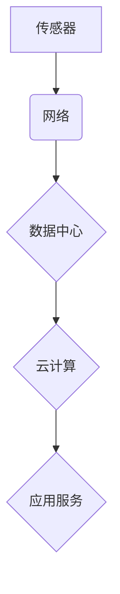

## 物联网(IoT)技术和各种传感器设备的集成：物联网在金融服务中的应用

> 关键词：物联网 (IoT)、传感器、金融服务、数据分析、风险管理、欺诈检测、个性化服务、智能合约

## 1. 背景介绍

物联网 (IoT) 技术的快速发展正在深刻地改变着各个行业，金融服务也不例外。物联网是指通过传感器、网络和数据分析技术，将各种物理设备连接到互联网，实现设备之间互联互通，并通过数据收集和分析，为用户提供更智能、更便捷的服务。

金融服务行业面临着日益增长的数字化转型需求，而物联网技术为其提供了强大的工具和手段。通过整合各种传感器设备，金融机构可以收集更丰富、更全面的客户数据，从而实现更精准的风险管理、更有效的欺诈检测、更个性化的服务体验等。

## 2. 核心概念与联系

**2.1 物联网 (IoT) 核心概念**

物联网 (IoT) 是一项将物理世界与数字世界连接起来的技术，它由以下几个核心概念组成：

* **传感器:** 用于收集物理环境信息，例如温度、湿度、位置、运动等。
* **网络:** 用于连接传感器和数据中心，传输数据。常见的网络协议包括 Wi-Fi、蓝牙、ZigBee 等。
* **数据中心:** 用于存储和处理收集到的数据，并提供数据分析和应用服务。
* **云计算:** 用于提供大数据存储、计算和分析能力，支持物联网平台的运行和扩展。

**2.2 金融服务与物联网的联系**

物联网技术为金融服务行业带来了诸多机遇，主要体现在以下几个方面：

* **风险管理:** 通过传感器收集客户行为数据，金融机构可以更精准地评估客户风险，提高贷款审批效率，降低不良贷款率。
* **欺诈检测:** 物联网传感器可以实时监控客户交易行为，识别异常交易，有效预防欺诈行为。
* **个性化服务:** 通过收集客户的个人信息和行为数据，金融机构可以提供更个性化的金融产品和服务，提升客户体验。
* **智能合约:** 物联网技术可以支持智能合约的执行，实现自动化交易和风险管理。

**2.3 物联网架构**



## 3. 核心算法原理 & 具体操作步骤

**3.1 算法原理概述**

物联网在金融服务中的应用主要依赖于以下核心算法：

* **数据采集和传输:** 利用传感器收集数据，并通过网络传输到数据中心。
* **数据清洗和预处理:** 对收集到的数据进行清洗、转换和格式化，以便于后续分析。
* **数据分析和挖掘:** 利用机器学习、数据挖掘等算法，从数据中提取有价值的信息，例如客户风险等级、欺诈行为模式等。
* **模型训练和评估:** 根据分析结果，建立预测模型，并进行模型训练和评估，以提高模型的准确性和可靠性。

**3.2 算法步骤详解**

1. **数据采集:** 利用传感器收集客户行为数据，例如交易记录、位置信息、消费习惯等。
2. **数据传输:** 将收集到的数据通过网络传输到数据中心。
3. **数据清洗:** 对数据进行清洗，去除无效数据、重复数据和错误数据。
4. **数据预处理:** 对数据进行转换和格式化，例如将时间戳转换为日期格式，将数值数据进行标准化处理。
5. **数据分析:** 利用机器学习、数据挖掘等算法，从数据中提取有价值的信息，例如客户风险等级、欺诈行为模式等。
6. **模型训练:** 根据分析结果，建立预测模型，例如风险评分模型、欺诈检测模型等。
7. **模型评估:** 对模型进行评估，例如使用准确率、召回率等指标，评估模型的性能。
8. **模型部署:** 将经过评估的模型部署到生产环境中，用于实时预测和决策。

**3.3 算法优缺点**

* **优点:**

    * 可以收集更丰富、更全面的客户数据。
    * 可以实现更精准的风险管理、更有效的欺诈检测。
    * 可以提供更个性化的金融产品和服务。

* **缺点:**

    * 数据安全和隐私保护是一个重要问题。
    * 需要强大的数据处理和分析能力。
    * 模型的准确性和可靠性需要不断验证和改进。

**3.4 算法应用领域**

* **风险管理:** 评估客户信用风险、识别潜在的欺诈行为。
* **欺诈检测:** 检测信用卡欺诈、网络银行欺诈等。
* **个性化服务:** 提供个性化的理财建议、定制化的金融产品。
* **智能合约:** 自动执行金融交易、管理风险。

## 4. 数学模型和公式 & 详细讲解 & 举例说明

**4.1 数学模型构建**

在物联网金融服务中，常用的数学模型包括：

* **风险评分模型:** 用于评估客户的信用风险，常用的模型包括 Logistic Regression、Support Vector Machine 等。
* **欺诈检测模型:** 用于识别欺诈行为，常用的模型包括 Anomaly Detection、Clustering 等。
* **个性化推荐模型:** 用于推荐个性化的金融产品，常用的模型包括 Collaborative Filtering、Content-Based Filtering 等。

**4.2 公式推导过程**

以 Logistic Regression 模型为例，其目标是预测客户是否会发生违约，输出结果为概率值。模型的公式如下：

$$
P(违约|特征) = \frac{1}{1 + e^{-(w_0 + w_1*特征_1 + w_2*特征_2 +... + w_n*特征_n)}}
$$

其中：

* $P(违约|特征)$ 是客户发生违约的概率。
* $w_0, w_1, w_2,..., w_n$ 是模型参数，需要通过训练数据进行学习。
* $特征_1, 特征_2,..., 特征_n$ 是客户的特征向量，例如收入、年龄、信用记录等。

**4.3 案例分析与讲解**

假设一家银行想要使用 Logistic Regression 模型来预测客户是否会发生信用卡逾期。

1. 收集客户的历史信用卡交易数据，包括交易金额、交易频率、逾期记录等。
2. 将数据进行清洗和预处理，例如将时间戳转换为日期格式，将数值数据进行标准化处理。
3. 将数据分为训练集和测试集，训练集用于训练模型，测试集用于评估模型性能。
4. 使用训练集训练 Logistic Regression 模型，学习模型参数。
5. 使用测试集评估模型性能，例如使用准确率、召回率等指标。
6. 将训练好的模型部署到生产环境中，用于实时预测客户是否会发生信用卡逾期。

## 5. 项目实践：代码实例和详细解释说明

**5.1 开发环境搭建**

* 操作系统: Ubuntu 20.04 LTS
* Python 版本: 3.8.10
* 必要的库: pandas, numpy, scikit-learn, matplotlib

**5.2 源代码详细实现**

```python
import pandas as pd
from sklearn.model_selection import train_test_split
from sklearn.linear_model import LogisticRegression
from sklearn.metrics import accuracy_score

# 加载数据
data = pd.read_csv('creditcard_data.csv')

# 划分训练集和测试集
X = data.drop('default', axis=1)
y = data['default']
X_train, X_test, y_train, y_test = train_test_split(X, y, test_size=0.2, random_state=42)

# 训练 Logistic Regression 模型
model = LogisticRegression()
model.fit(X_train, y_train)

# 预测测试集结果
y_pred = model.predict(X_test)

# 计算模型准确率
accuracy = accuracy_score(y_test, y_pred)
print(f'模型准确率: {accuracy}')
```

**5.3 代码解读与分析**

* 首先，我们使用 pandas 库加载信用卡数据。
* 然后，我们将数据分为特征向量 (X) 和目标变量 (y)。
* 使用 train_test_split 函数将数据分为训练集和测试集。
* 训练 Logistic Regression 模型，并使用测试集评估模型性能。
* 最后，计算模型准确率，并打印结果。

**5.4 运行结果展示**

运行上述代码后，会输出模型的准确率。

## 6. 实际应用场景

**6.1 风险管理**

* **信用评分:** 利用物联网传感器收集客户的消费习惯、支付记录等数据，构建更精准的信用评分模型，提高贷款审批效率，降低不良贷款率。
* **欺诈检测:** 利用传感器监控客户交易行为，识别异常交易，例如频繁的交易、高额的交易等，及时阻止欺诈行为。

**6.2 个性化服务**

* **定制化理财:** 根据客户的消费习惯、投资偏好等数据，提供个性化的理财建议和定制化的金融产品。
* **智能客服:** 利用自然语言处理技术和物联网数据，构建智能客服系统，为客户提供更便捷、更智能的金融服务。

**6.3 智能合约**

* **自动交易:** 利用物联网传感器触发智能合约执行，实现自动交易，例如当客户的账户余额不足时，自动触发贷款申请。
* **风险管理:** 利用智能合约自动执行风险管理规则，例如当客户的信用风险等级超过阈值时，自动冻结账户。

**6.4 未来应用展望**

物联网技术在金融服务领域的应用前景广阔，未来可能出现以下趋势：

* **更广泛的数据采集:** 利用更多类型的传感器收集更丰富、更全面的客户数据。
* **更智能的算法模型:** 利用深度学习、强化学习等更先进的算法模型，提高预测准确率和决策效率。
* **更安全的隐私保护:** 利用区块链技术等安全技术，保障客户数据安全和隐私。
* **更便捷的用户体验:** 利用物联网设备和人工智能技术，提供更便捷、更智能的金融服务体验。

## 7. 工具和资源推荐

**7.1 学习资源推荐**

* **书籍:**
    * 《物联网技术》
    * 《物联网应用开发》
    * 《金融科技》
* **在线课程:**
    * Coursera: 物联网课程
    * edX: 金融科技课程
    * Udemy: 物联网开发课程

**7.2 开发工具推荐**

* **物联网平台:**
    * AWS IoT
    * Azure IoT
    * Google Cloud IoT
* **数据分析工具:**
    * Python (pandas, numpy, scikit-learn)
    * R
    * Tableau

**7.3 相关论文推荐**

* **物联网在金融服务中的应用:**
    * [物联网技术在金融领域的应用研究](https://www.researchgate.net/publication/331911794_物联网技术在金融领域的应用研究)
    * [物联网技术在金融服务中的应用现状及展望](https://www.sciencedirect.com/science/article/pii/S221267161830031X)
* **金融科技:**
    * [金融科技的未来趋势](https://www.nature.com/articles/s41586-019-1691-4)
    * [金融科技的挑战与机遇](https://www.forbes.com/sites/bernardmarr/2019/01/15/the-challenges-and-opportunities-of-fintech/?sh=2714119a197a)

## 8. 总结：未来发展趋势与挑战

**8.1 研究成果总结**

物联网技术在金融服务领域的应用取得了显著成果，例如风险管理、欺