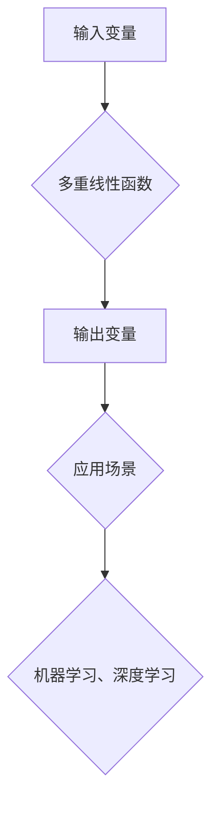

## 线性代数导引：多重线性函数

> 关键词：线性代数、多重线性函数、张量积、核函数、机器学习、深度学习、优化算法

### 1. 背景介绍

在现代机器学习和深度学习领域，数据的多样性和复杂性日益增长，传统的线性模型已经难以满足需求。为了更好地处理高维数据和非线性关系，多重线性函数（multilinear functions）逐渐成为研究热点。

多重线性函数是一种将多个输入变量映射到单个输出变量的函数，其特点是每个输入变量的贡献都呈线性关系。这种函数形式在处理多维数据时具有优势，因为它能够捕捉到输入变量之间的相互作用和依赖关系。

### 2. 核心概念与联系

**2.1 多重线性函数的定义**

一个多重线性函数可以表示为：

$$f(x_1, x_2,..., x_n) = \sum_{i_1=1}^n \sum_{i_2=1}^n... \sum_{i_k=1}^n a_{i_1 i_2... i_k} x_{i_1} x_{i_2}... x_{i_k}$$

其中：

* $x_1, x_2,..., x_n$ 是输入变量。
* $a_{i_1 i_2... i_k}$ 是函数系数。
* $k$ 是函数的阶数，表示输入变量的组合数量。

**2.2 多重线性函数与张量积**

多重线性函数与张量积（tensor product）密切相关。张量积是一种将多个向量或矩阵组合成更高维张量的运算。

对于两个向量 $u$ 和 $v$，它们的张量积 $u \otimes v$ 可以表示为：

$$u \otimes v = \begin{bmatrix} u_1 \\ u_2 \\... \\ u_m \end{bmatrix} \begin{bmatrix} v_1 & v_2 &... & v_n \end{bmatrix} = \begin{bmatrix} u_1v_1 & u_1v_2 &... & u_1v_n \\ u_2v_1 & u_2v_2 &... & u_2v_n \\... &... &... &... \\ u_mv_1 & u_mv_2 &... & u_mv_n \end{bmatrix}$$

多重线性函数可以看作是多个张量积的线性组合。

**2.3 多重线性函数与核函数**

核函数（kernel function）是一种将输入空间映射到高维特征空间的函数，它可以用于解决非线性分类问题。

一些核函数可以表示为多重线性函数的形式。例如，径向基函数（RBF）核函数可以表示为：

$$K(x, y) = exp(-\frac{||x-y||^2}{2\sigma^2})$$

其中 $||x-y||$ 是输入向量 $x$ 和 $y$ 之间的欧氏距离， $\sigma$ 是带宽参数。

**2.4 多重线性函数的应用**

多重线性函数在机器学习和深度学习领域有着广泛的应用，例如：

* **特征提取:** 多重线性函数可以用于提取输入数据的特征，例如图像、文本等。
* **模型构建:** 多重线性函数可以作为神经网络的激活函数或损失函数，用于构建非线性模型。
* **优化算法:** 多重线性函数可以用于优化算法，例如梯度下降法。

**Mermaid 流程图**



### 3. 核心算法原理 & 具体操作步骤

**3.1 算法原理概述**

多重线性函数的计算原理基于线性组合和张量积。

对于给定的输入变量 $x_1, x_2,..., x_n$，多重线性函数将每个输入变量的组合进行线性加权，最终得到输出变量。

**3.2 算法步骤详解**

1. **定义函数阶数:** 确定多重线性函数的阶数 $k$，即输入变量组合的数量。
2. **确定系数:** 计算函数系数 $a_{i_1 i_2... i_k}$，这些系数可以根据训练数据和目标函数进行优化。
3. **计算张量积:** 对每个输入变量组合 $x_{i_1} x_{i_2}... x_{i_k}$，计算其张量积。
4. **线性组合:** 对所有张量积进行线性组合，得到最终的输出变量。

**3.3 算法优缺点**

**优点:**

* **表达能力强:** 可以捕捉到输入变量之间的相互作用和依赖关系。
* **计算效率高:** 对于低阶多重线性函数，计算效率较高。

**缺点:**

* **参数量大:** 随着阶数的增加，参数量会指数级增长。
* **过拟合风险:** 如果阶数过高，容易发生过拟合现象。

**3.4 算法应用领域**

* **图像处理:** 用于图像特征提取、图像分类、图像分割等。
* **自然语言处理:** 用于文本特征提取、文本分类、文本生成等。
* **推荐系统:** 用于用户行为预测、商品推荐等。

### 4. 数学模型和公式 & 详细讲解 & 举例说明

**4.1 数学模型构建**

多重线性函数可以表示为一个张量积的线性组合：

$$f(x_1, x_2,..., x_n) = \sum_{i_1=1}^n \sum_{i_2=1}^n... \sum_{i_k=1}^n a_{i_1 i_2... i_k} x_{i_1} x_{i_2}... x_{i_k}$$

其中 $a_{i_1 i_2... i_k}$ 是函数系数， $x_{i_1}, x_{i_2},..., x_{i_k}$ 是输入变量。

**4.2 公式推导过程**

多重线性函数的系数 $a_{i_1 i_2... i_k}$ 可以通过最小化损失函数来确定。

损失函数通常定义为预测值与真实值的差值平方和。

通过梯度下降法等优化算法，可以迭代更新系数，最终得到最优的模型参数。

**4.3 案例分析与讲解**

**例子:**

考虑一个二阶多重线性函数，输入变量为 $x_1$ 和 $x_2$，输出变量为 $y$。

$$f(x_1, x_2) = a_{11}x_1^2 + a_{12}x_1x_2 + a_{22}x_2^2$$

如果我们有训练数据 $(x_1^{(i)}, x_2^{(i)}, y^{(i)})$，我们可以使用最小二乘法来求解系数 $a_{11}$, $a_{12}$, $a_{22}$。

**4.4 数学公式举例**

* **二阶多重线性函数:**

$$f(x_1, x_2) = a_{11}x_1^2 + a_{12}x_1x_2 + a_{22}x_2^2$$

* **三阶多重线性函数:**

$$f(x_1, x_2, x_3) = a_{111}x_1^3 + a_{112}x_1^2x_2 + a_{113}x_1^2x_3 +... + a_{333}x_3^3$$

### 5. 项目实践：代码实例和详细解释说明

**5.1 开发环境搭建**

* Python 3.x
* NumPy
* Scikit-learn

**5.2 源代码详细实现**

```python
import numpy as np
from sklearn.linear_model import LinearRegression

class MultiLinearFunction:
    def __init__(self, degree):
        self.degree = degree
        self.coefficients = None

    def fit(self, X, y):
        # 将输入数据转换为多重线性函数形式
        X_transformed = self._transform_data(X)
        # 使用线性回归模型训练
        self.coefficients = LinearRegression().fit(X_transformed, y).coef_

    def predict(self, X):
        # 将输入数据转换为多重线性函数形式
        X_transformed = self._transform_data(X)
        # 使用训练好的系数进行预测
        return np.dot(X_transformed, self.coefficients)

    def _transform_data(self, X):
        # 将输入数据转换为多重线性函数形式
        transformed_data = []
        for i in range(X.shape[0]):
            row = []
            for j in range(self.degree + 1):
                for k in range(self.degree + 1):
                    if j + k <= self.degree:
                        row.append(X[i, 0] ** j * X[i, 1] ** k)
            transformed_data.append(row)
        return np.array(transformed_data)

# 示例代码
X = np.array([[1, 2], [3, 4], [5, 6]])
y = np.array([3, 7, 11])
model = MultiLinearFunction(degree=2)
model.fit(X, y)
predictions = model.predict(X)
print(predictions)
```

**5.3 代码解读与分析**

* `MultiLinearFunction` 类实现了多重线性函数的训练和预测功能。
* `fit()` 方法使用线性回归模型训练多重线性函数的系数。
* `predict()` 方法使用训练好的系数对新的输入数据进行预测。
* `_transform_data()` 方法将输入数据转换为多重线性函数的形式。

**5.4 运行结果展示**

运行上述代码，可以得到多重线性函数的预测结果。

### 6. 实际应用场景

**6.1 图像分类**

多重线性函数可以用于提取图像特征，例如边缘、纹理等，然后将其作为输入到分类模型中。

**6.2 文本分类**

多重线性函数可以用于提取文本特征，例如词频、词嵌入等，然后将其作为输入到分类模型中。

**6.3 预测分析**

多重线性函数可以用于预测连续变量，例如股票价格、销售额等。

**6.4 未来应用展望**

随着人工智能技术的不断发展，多重线性函数在更多领域将发挥重要作用，例如：

* **自动驾驶:** 用于感知环境、决策规划等。
* **医疗诊断:** 用于分析医学图像、预测疾病风险等。
* **金融风险管理:** 用于评估风险、预测市场波动等。

### 7. 工具和资源推荐

**7.1 学习资源推荐**

* **书籍:**

    * 《线性代数及其应用》
    * 《机器学习》

* **在线课程:**

    * Coursera: 线性代数
    * edX: 机器学习

**7.2 开发工具推荐**

* **Python:** 广泛用于机器学习和深度学习开发。
* **NumPy:** 用于数值计算和数组操作。
* **Scikit-learn:** 用于机器学习算法的实现和应用。

**7.3 相关论文推荐**

* **Multilinear Regression for High-Dimensional Data**
* **Kernel Methods for Multilinear Regression**

### 8. 总结：未来发展趋势与挑战

**8.1 研究成果总结**

多重线性函数在机器学习和深度学习领域取得了显著成果，能够有效处理高维数据和非线性关系。

**8.2 未来发展趋势**

* **更高阶多重线性函数:** 研究更高阶多重线性函数的算法和应用。
* **非线性多重线性函数:** 研究非线性多重线性函数，例如使用神经网络作为激活函数。
* **高效计算方法:** 研究更高效的计算